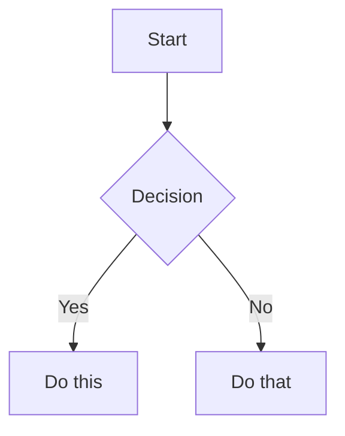

# Obsidian Flavored Markdown Skill

This skill enables skills-compatible agents to create and edit valid Obsidian Flavored Markdown, including all Obsidian-specific syntax extensions.

## Overview

Obsidian uses a combination of Markdown flavors:
- [CommonMark](https://commonmark.org/)
- [GitHub Flavored Markdown](https://github.github.com/gfm/)
- [LaTeX](https://www.latex-project.org/) for math
- Obsidian-specific extensions (wikilinks, callouts, embeds, etc.)

## Internal Links (Wikilinks)

```markdown
[[Note Name]]
[[Note Name|Display Text]]
[[Note Name#Heading]]
[[Note Name#^block-id]]
```

## Embeds

```markdown
![[Note Name]]
![[image.png]]
![[image.png|300]]
![[document.pdf#page=3]]
```

## Callouts

```markdown
> [!note]
> This is a note callout.

> [!tip] Custom Title
> This callout has a custom title.

> [!warning]- Collapsed by default
> This content is hidden until expanded.
```

### Supported Callout Types

| Type | Aliases |
|------|---------|
| `note` | - |
| `abstract` | `summary`, `tldr` |
| `info` | - |
| `todo` | - |
| `tip` | `hint`, `important` |
| `success` | `check`, `done` |
| `question` | `help`, `faq` |
| `warning` | `caution`, `attention` |
| `failure` | `fail`, `missing` |
| `danger` | `error` |
| `bug` | - |
| `example` | - |
| `quote` | `cite` |

## Task Lists

```markdown
- [ ] Incomplete task
- [x] Completed task
```

## Properties (Frontmatter)

```yaml
---
title: My Note Title
date: 2024-01-15
tags:
  - project
  - important
aliases:
  - My Note
---
```

## Tags

```markdown
#tag
#nested/tag
#tag-with-dashes
```

## Math (LaTeX)

```markdown
Inline: $e^{i\pi} + 1 = 0$

Block:
$$
\frac{a}{b}
$$
```

## Diagrams (Mermaid)

````markdown

````

## Comments

```markdown
This is visible %%but this is hidden%% text.
```

## References

- [Basic formatting syntax](https://help.obsidian.md/syntax)
- [Obsidian Flavored Markdown](https://help.obsidian.md/obsidian-flavored-markdown)
- [Internal links](https://help.obsidian.md/links)
- [Callouts](https://help.obsidian.md/callouts)
- [Properties](https://help.obsidian.md/properties)
