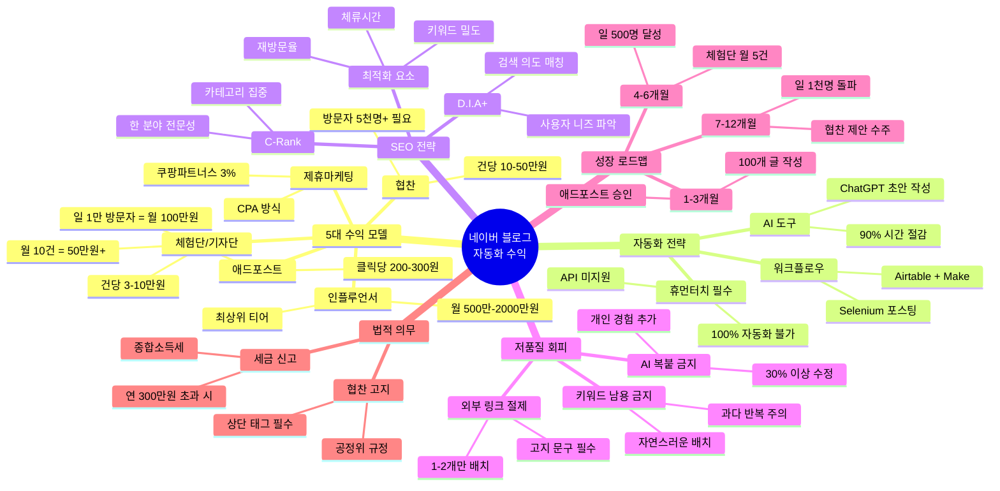
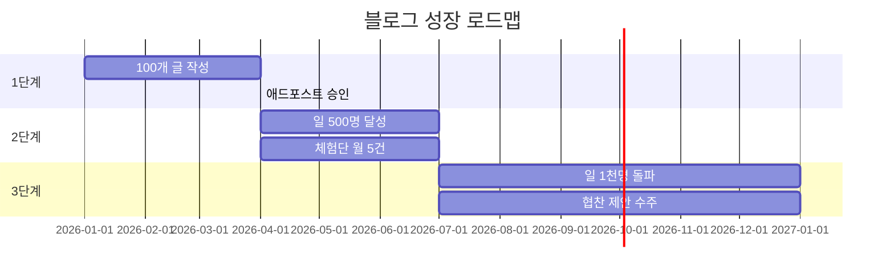

# 네이버 블로그 자동화 수익창출 실전 가이드

> [!abstract] 한 줄 핵심
> AI 자동화와 SEO 전략을 결합하여 네이버 블로그에서 월 30만~100만원 이상의 수익을 창출하는 실전 가이드

## 목차
- [[#Book on a Page]]
- [[#마인드맵]]
- [[#Part 1. 5대 수익화 모델 이해하기]]
- [[#Part 2. AI 기반 자동화 시스템 구축]]
- [[#Part 3. 네이버 검색 알고리즘 공략법]]
- [[#Part 4. 저품질 블로그 회피 전략]]
- [[#Part 5. 현실적 수익 목표와 성장 로드맵]]
- [[#Part 6. 법적 의무와 지속가능한 운영]]
- [[#용어 사전]]
- [[#셀프 테스트]]
- [[#실천 체크리스트]]
- [[#복습 로그]]
- [[#보충자료]]
- [[#내 생각 & 연결]]

---

## Book on a Page

> [!tip] 4문장 개요
> 네이버 블로그는 애드포스트, 체험단, 협찬, 제휴마케팅, 인플루언서 등 다양한 수익화 경로를 제공합니다. ChatGPT와 자동화 도구를 활용하면 콘텐츠 제작 시간을 90% 절감할 수 있지만, 100% 자동화는 불가능하며 휴먼터치가 필수입니다. C-Rank와 D.I.A+ 알고리즘을 이해하고 SEO 전략을 적용하면 검색 노출을 극대화할 수 있습니다. 현실적으로 최소 100개 이상의 양질의 글과 6개월 이상의 꾸준한 운영이 필요합니다.

### 핵심 암기 포인트

| 중요도 | 핵심 내용 |
|:---:|---|
| ★★★ | 최소 100개 글과 6개월 이상 꾸준한 운영이 수익 창출의 전제 조건 |
| ★★★ | AI 생성 콘텐츠는 반드시 30% 이상 수정하고 개인 경험 추가 필수 |
| ★★★ | 한 분야에 집중(C-Rank)하고 검색 의도 파악(D.I.A+)이 검색 노출의 핵심 |
| ★★ | 현실적 초기 목표: 일 500명 방문자 + 체험단 월 5건 = 월 20~30만원 |
| ★★ | 연 300만원 초과 수익 시 종합소득세 신고 의무, 협찬 고지 필수 |
| ★ | ChatGPT + Airtable + Make 조합으로 90% 시간 절감 가능 |

### 수익 구조 한눈에 보기

| 수익 모델 | 진입 조건 | 예상 수익 |
|---|---|---|
| 애드포스트 | 기본 승인 | 일 1천명 → 월 3~9만원 |
| 체험단 | 누구나 가능 | 건당 3~10만원 |
| 협찬 | 방문자 5천명+ | 건당 10~50만원 |
| 제휴마케팅 | 누구나 가능 | 구매당 3% |
| 인플루언서 | 심사 선정 | 월 500만~2000만원 |

---

## 마인드맵



---

## Part 1. 5대 수익화 모델 이해하기

> **난이도**: 🟢 기초

### 핵심 질문 (Cue Column)
- 네이버 블로그에서 수익을 얻는 5가지 방법은?
- 각 수익 모델의 진입 장벽과 예상 수익은?
- 초보자가 시작하기 좋은 모델은?

### 핵심 내용 (Notes)

> [!important] 핵심 주장
> 네이버 블로그는 5가지 주요 수익 경로(애드포스트, 체험단, 협찬, 제휴마케팅, 인플루언서)를 제공하며, 각각의 수익 구조와 진입 장벽이 다르다

#### 1. 애드포스트 (네이버 공식 광고)
- **수익 구조**: 클릭당 200~300원
- **현실적 수익**: 일 1만 방문자 시 월 100만원 가능
- **진입 장벽**: 낮음 (기본 조건 충족 시 승인)

#### 2. 체험단/기자단
- **수익 구조**: 건당 3~10만원 원고료 + 무료 제품
- **현실적 수익**: 월 10건 참여 시 50만원+ (제품 가치 포함 시 더 높음)
- **진입 장벽**: 낮음 (방문자 적어도 가능)

#### 3. 협찬
- **수익 구조**: 건당 10~50만원
- **현실적 수익**: 블로그 영향력에 비례
- **진입 장벽**: 중간 (월 방문자 5천명 이상 필요)

#### 4. 제휴마케팅 (CPA)
- **수익 구조**: 쿠팡파트너스 구매당 3% 수수료
- **현실적 수익**: 트래픽과 전환율에 따라 변동
- **진입 장벽**: 낮음 (누구나 가입 가능)

> [!warning] 주의
> 네이버는 외부 링크를 좋아하지 않아 쿠팡파트너스 링크가 많으면 노출이 제한될 수 있음

#### 5. 네이버 인플루언서
- **수익 구조**: 키워드챌린지, 브랜드 매칭
- **현실적 수익**: 월 500만~2000만원 (상위권)
- **진입 장벽**: 높음 (심사 선정)

### 한 줄 요약 (Summary)
초보자는 **체험단**으로 시작하여 포트폴리오를 쌓고, 방문자가 늘면 **협찬**으로 전환하며, **애드포스트**는 보조 수익으로 활용하라.

### 실천 액션

> [!todo] 지금 당장 할 일
> - [ ] 현재 블로그 방문자 수 확인 후 진입 가능한 수익 모델 파악하기
> - [ ] 애드포스트 승인 조건 확인 및 신청하기
> - [ ] 체험단 플랫폼(레뷰, 서울오빠, 미블) 가입하기
> - [ ] 쿠팡파트너스 계정 생성하고 제휴 링크 생성법 익히기

### 흔한 실수

> [!danger] 이것만은 피하자
> - 초기부터 고수익 모델(협찬, 인플루언서)에만 집중하여 기본적인 방문자 확보를 소홀히 함
> - 애드포스트만으로 고수익을 기대하는 비현실적인 계획 수립

---

## Part 2. AI 기반 자동화 시스템 구축

> **난이도**: 🟡 중급

### 핵심 질문 (Cue Column)
- AI 자동화로 시간을 얼마나 절약할 수 있나?
- 100% 자동화가 불가능한 이유는?
- 휴먼터치란 무엇이며 왜 필수인가?

### 핵심 내용 (Notes)

> [!important] 핵심 주장
> ChatGPT + 자동화 도구 조합으로 콘텐츠 제작 시간을 90% 절감할 수 있지만, 100% 자동화는 불가능하며 휴먼터치가 필수적이다

#### 자동화 도구 조합

| 도구 | 역할 | 비용 |
|---|---|---|
| ChatGPT | 초안 작성 | API 비용 (약 40개 글당 $6) |
| Airtable | 콘텐츠 데이터베이스 | 무료~유료 |
| Make/Zapier | 워크플로우 자동화 | 무료~유료 |
| Selenium | 자동 포스팅 | 무료 (기술 필요) |

#### 자동화 워크플로우 예시

```
1. Airtable에 주제/키워드 입력
2. Make가 ChatGPT API 호출
3. ChatGPT가 초안 생성
4. 결과가 Airtable에 저장
5. 알림 발송 (휴먼터치 시작)
6. 수동으로 개인 경험/사진 추가
7. 네이버 블로그에 직접 발행
```

#### 왜 100% 자동화가 불가능한가?

> [!warning] 기술적 한계
> - 네이버 블로그는 공식 API를 제공하지 않음
> - Selenium 자동 로그인 시 네이버 보안 정책 위반 → 계정 정지 위험
> - AI 생성 글 그대로 발행 시 저품질 처리

#### 휴먼터치의 3요소

1. **개인 경험 추가**: "우리 아이는 이 제품으로..."
2. **실제 사진 삽입**: 직접 촬영한 제품 사용 사진
3. **감정 표현**: 솔직한 장단점, 개인적 느낌

### 한 줄 요약 (Summary)
AI는 **초안 작성 도구**로 활용하고, 반드시 **30% 이상 수정** + **개인 경험/사진 추가**로 휴먼터치를 더해야 한다.

### 실천 액션

> [!todo] 지금 당장 할 일
> - [ ] ChatGPT에 블로그 주제와 톤앤매너를 학습시켜 커스텀 프롬프트 제작하기
> - [ ] Make 또는 Zapier로 ChatGPT → Google Docs → 알림 워크플로우 구축하기
> - [ ] AI 생성 초안에 개인 경험, 사진, 감정 표현 추가하는 편집 프로세스 정립하기
> - [ ] 주 3회 포스팅 스케줄 설정 및 자동 리마인더 설정하기

### 흔한 실수

> [!danger] 이것만은 피하자
> - AI 생성 글을 그대로 복붙하여 저품질 블로그로 분류됨
> - 자동화 도구 설정에만 집중하고 콘텐츠 품질 관리를 소홀히 함
> - Selenium 자동 로그인 시 네이버 보안 정책 위반으로 계정 정지 위험

---

## Part 3. 네이버 검색 알고리즘 공략법

> **난이도**: 🟡 중급

### 핵심 질문 (Cue Column)
- C-Rank와 D.I.A+ 알고리즘의 차이는?
- 검색 상위 노출을 위한 핵심 전략은?
- 키워드 밀도는 어느 정도가 적정한가?

### 핵심 내용 (Notes)

> [!important] 핵심 주장
> C-Rank 알고리즘은 전문성을, D.I.A+ 알고리즘은 검색 의도 매칭을 평가하므로 한 분야 집중과 사용자 의도 파악이 핵심이다

#### C-Rank 알고리즘: 전문성 평가

> [!info] C-Rank 작동 원리
> "특정 관심사에 대해 얼마나 깊이 있는 좋은 콘텐츠를 생산해 내는가"를 측정

**공략 전략**:
- 블로그 주제를 1~2개 세부 카테고리로 좁히기
- 예: 육아 → 육아템 리뷰 / 여행 → 제주도 맛집

#### D.I.A+ 알고리즘: 검색 의도 매칭

> [!info] D.I.A+ 작동 원리
> 검색 의도에 맞는 문서를 먼저 보여줌

**공략 전략**:
- 네이버 검색창 자동완성으로 사용자 검색 의도 파악
- 검색어에 대한 직접적인 답변을 콘텐츠 상단에 배치

#### 키워드 최적화 전략

| 위치 | 권장 횟수 |
|---|---|
| 제목 | 1회 (필수) |
| 소제목 | 1~2회 |
| 본문 | 자연스럽게 3~5회 |
| 총 밀도 | 1~3% |

> [!warning] 키워드 남용 주의
> 50회 이상 사용 시 스팸으로 처리될 수 있음

#### 순위에 영향을 주는 요소

- **체류시간**: 방문자가 글에 머무르는 시간
- **재방문율**: 같은 블로그를 다시 찾는 비율
- **내부 링크**: 이전 글과의 연결

### 한 줄 요약 (Summary)
**한 분야에 집중**(C-Rank)하여 전문성을 쌓고, **검색 의도에 맞는 콘텐츠**(D.I.A+)를 작성하며, **자연스러운 키워드 배치**로 최적화하라.

### 실천 액션

> [!todo] 지금 당장 할 일
> - [ ] 블로그 주제를 1~2개 세부 카테고리로 좁히기
> - [ ] 네이버 검색창 자동완성과 연관검색어로 사용자 검색 의도 파악하기
> - [ ] 글 제목에 핵심 키워드 1개 포함, 본문에 자연스럽게 3~5회 배치하기
> - [ ] 내부 링크로 이전 글 연결하여 체류시간과 재방문율 높이기

### 흔한 실수

> [!danger] 이것만은 피하자
> - 다양한 주제를 다루어 전문성 점수 분산됨
> - 키워드를 의도적으로 반복하여 가독성을 해치고 스팸으로 분류됨
> - 검색 의도를 무시하고 자신이 쓰고 싶은 내용만 작성함

---

## Part 4. 저품질 블로그 회피 전략

> **난이도**: 🔴 심화

### 핵심 질문 (Cue Column)
- 저품질 블로그로 분류되는 4대 요소는?
- AI 생성 콘텐츠는 어떻게 수정해야 하나?
- 외부 링크(쿠팡 등)는 몇 개가 적정한가?

### 핵심 내용 (Notes)

> [!important] 핵심 주장
> AI 글 복붙, 키워드 남용, 외부 링크 남용, 상업성 과다는 저품질 블로그의 4대 위험 요소이며, 이를 회피해야 장기적 수익이 가능하다

#### 저품질 4대 위험 요소

| 위험 요소 | 구체적 사례 | 회피 방법 |
|---|---|---|
| AI 글 복붙 | ChatGPT 출력 그대로 발행 | 30% 이상 수정 + 개인 경험 |
| 키워드 남용 | 같은 키워드 50회+ 반복 | 자연스럽게 3~5회만 |
| 외부 링크 남용 | 쿠팡 링크 5개+ 삽입 | 1~2개만 + 고지 문구 |
| 상업성 과다 | 모든 글이 광고/협찬 | 5개 중 1개는 순수 정보성 |

#### 2025년 네이버 AI 감지 시스템

> [!warning] 2025년 변화
> 네이버 검색 로직이 AI·GPT 기반 콘텐츠 품질 판정으로 전환
> - '글의 의도', '독창성', '전문성', '사용자 가독성'까지 판단
> - 실사용자 행동 데이터(체류시간, 재방문율, 댓글, 공유) 반영

#### 저품질 확인 방법

1. **검색 테스트**: 정확한 글 제목을 검색했을 때 상단에 안 나오면 저품질 의심
2. **통계 확인**: 방문자 수가 갑자기 1/10로 떨어지면 저품질 가능성

#### 저품질 탈출 방법

1. 광고성 글 삭제 또는 비공개 전환
2. 정보성 글 꾸준히 포스팅
3. 제목과 메인 키워드는 수정하지 않기
4. 시간을 두고 양질의 콘텐츠 축적

### 한 줄 요약 (Summary)
AI 글은 **30% 이상 수정**, 키워드는 **자연스럽게 3~5회**, 외부 링크는 **1~2개만**, 5개 글 중 1개는 **순수 정보성**으로 작성하라.

### 실천 액션

> [!todo] 지금 당장 할 일
> - [ ] AI 생성 글은 반드시 30% 이상 수정 후 개인 경험과 사진 추가하기
> - [ ] 키워드는 제목 1회, 소제목 1~2회, 본문 자연스럽게 배치하기
> - [ ] 제휴 링크는 글 하단에 1~2개만 배치하고 고지 문구 추가하기
> - [ ] 5개 글 중 1개는 수익과 무관한 순수 정보성 콘텐츠로 작성하기

### 흔한 실수

> [!danger] 이것만은 피하자
> - ChatGPT 생성 글을 수정 없이 그대로 발행
> - 모든 글에 쿠팡 링크를 여러 개 삽입하여 상업성 블로그로 분류됨
> - 키워드 밀도를 높이기 위해 부자연스러운 문장 반복

---

## Part 5. 현실적 수익 목표와 성장 로드맵

> **난이도**: 🟡 중급

### 핵심 질문 (Cue Column)
- 현실적으로 언제부터 수익이 발생하나?
- 방문자 수별 예상 수익은?
- 성장 단계별 목표는 무엇인가?

### 핵심 내용 (Notes)

> [!important] 핵심 주장
> 네이버 블로그 수익은 단계적으로 성장하며, 최소 100개 글과 6개월 이상의 꾸준한 운영이 필요하다

#### 방문자 수별 현실적 수익

| 일 방문자 | 애드포스트 월 수익 | 체험단 병행 시 |
|---|---|---|
| 300명 | 약 9천원 | +30만원 가능 |
| 1,000명 | 3~9만원 | +50만원 가능 |
| 4,000명 | 약 30만원 | +100만원 가능 |
| 10,000명 | 약 100만원 | +협찬 수익 |

#### 12개월 성장 로드맵



| 단계 | 기간 | 목표 | 예상 수익 |
|---|---|---|---|
| 1단계 | 1~3개월 | 100개 글, 애드포스트 승인 | 0~1만원 |
| 2단계 | 4~6개월 | 일 500명, 체험단 월 5건 | 20~30만원 |
| 3단계 | 7~12개월 | 일 1천명, 협찬 제안 | 50~100만원 |

> [!warning] 현실 인식
> - 10개 글 쓰고 포기하면 절대 수익 발생 불가
> - 최소 100개 글이 쌓여야 검색 트래픽 시작
> - "월 500만원" 수익 인증은 대부분 강의 판매 목적

### 한 줄 요약 (Summary)
**100개 글 + 6개월**이 최소 투자이며, 초기 목표는 **일 500명 + 체험단 월 5건 = 월 20~30만원**으로 현실적으로 설정하라.

### 실천 액션

> [!todo] 지금 당장 할 일
> - [ ] 1단계(1~3개월): 주 3회 포스팅으로 100개 글 달성, 애드포스트 승인 목표
> - [ ] 2단계(4~6개월): 일 500명 방문자 달성, 체험단 월 5건 이상 수주
> - [ ] 3단계(7~12개월): 일 1천명 돌파, 협찬 제안 받을 수 있는 품질 확보
> - [ ] 매월 방문자 통계와 수익을 스프레드시트에 기록하여 성장 추이 분석하기

### 흔한 실수

> [!danger] 이것만은 피하자
> - 초기 1~2개월 수익이 없다고 포기함 (100개 글 전에는 수익 기대 불가)
> - 수익 인증 강의에 현혹되어 비현실적인 목표 설정
> - 방문자 수만 추구하고 콘텐츠 품질을 무시하여 이탈률 증가

---

## Part 6. 법적 의무와 지속가능한 운영

> **난이도**: 🟢 기초

### 핵심 질문 (Cue Column)
- 블로그 수익에 세금 신고가 필요한가?
- 협찬 고지는 어떻게 해야 하나?
- 장기적으로 블로그를 운영하려면?

### 핵심 내용 (Notes)

> [!important] 핵심 주장
> 연 300만원 초과 수익 시 종합소득세 신고 의무가 있으며, 협찬 고지와 윤리적 운영이 장기 신뢰도를 결정한다

#### 세금 신고 가이드

| 연 수익 | 신고 의무 | 비고 |
|---|---|---|
| 300만원 이하 | 선택적 | 기타소득으로 분리과세 가능 |
| 300만원 초과 | 필수 | 다음 해 5월 종합소득세 신고 |
| 사업 규모 | 사업자 등록 | 부가가치세 신고 추가 |

> [!warning] 주의
> 소액이라고 신고를 무시하면 추후 가산세 부담

#### 협찬 고지 의무 (공정거래위원회)

```
예시) 글 상단에 표시
"본 포스팅은 ○○브랜드로부터 제품을 제공받아 작성되었습니다."
또는
#광고 #협찬 #제품협찬
```

#### 지속가능한 운영 원칙

1. **솔직한 리뷰**: 장단점 모두 기재
2. **과장 금지**: 허위 정보 작성 시 법적 책임
3. **신뢰 구축**: 단기 수익보다 장기 신뢰도
4. **기록 보관**: 계좌 이체 내역, 계약서 보관

### 한 줄 요약 (Summary)
**연 300만원 초과 시 종합소득세 신고**, **모든 협찬 글에 고지 문구 삽입**, **솔직한 리뷰**로 장기적 신뢰를 쌓아라.

### 실천 액션

> [!todo] 지금 당장 할 일
> - [ ] 월별 수익(애드포스트, 체험단, 협찬)을 엑셀로 기록하여 세금 신고 준비하기
> - [ ] 협찬 글에는 상단에 '#광고 #협찬' 태그 필수 삽입하기
> - [ ] 과장 광고나 허위 정보 배제하고 솔직한 장단점 리뷰 작성하기
> - [ ] 국세청 홈택스에서 사업자등록 필요 여부 확인하기

### 흔한 실수

> [!danger] 이것만은 피하자
> - 소액 수익이라고 세금 신고를 무시하여 추후 가산세 부담
> - 협찬임을 숨기고 순수 리뷰처럼 작성하여 신뢰도 하락 및 법적 제재
> - 수익 인증 강의를 맹신하고 비현실적인 기대로 시작

---

## 용어 사전

| 용어 | 정의 | 예시 |
|---|---|---|
| **애드포스트** | 네이버 공식 광고 수익 프로그램. 블로그에 광고 게재 후 클릭당 수익 | 일 1만 방문자 시 월 100만원 가능 |
| **CPA (Cost Per Action)** | 방문자가 특정 행동(구매, 가입)을 완료했을 때 수수료 지급 방식 | 쿠팡파트너스 구매당 3% |
| **C-Rank** | 블로그의 한 분야 전문성과 콘텐츠 품질을 평가하는 네이버 알고리즘 | 육아 100개 글 → 육아 검색어 상위 노출 |
| **D.I.A+** | 사용자의 검색 의도와 콘텐츠 일치도를 평가하는 알고리즘 | "이유식 시작 시기" 검색 → 월령별 가이드 노출 |
| **휴먼터치** | AI 콘텐츠에 개인 경험, 감정, 사진을 추가하는 편집 작업 | "우리 아이는 이 제품으로..." 추가 |
| **저품질 블로그** | 네이버가 품질이 낮다고 판단하여 검색 노출을 제한하는 블로그 | AI 복붙 → 방문자 급감 |
| **키워드 밀도** | 전체 텍스트에서 특정 키워드가 차지하는 비율 (적정: 1~3%) | 1,000자 글에 키워드 10~30회 |
| **체험단** | 기업이 제품 무료 제공 + 원고료 지급, 블로거가 리뷰 작성 | 월 10건 = 30~100만원 |
| **쿠팡파트너스** | 쿠팡 제휴 마케팅 프로그램. 링크 통해 구매 시 수수료 | 10만원 구매 → 3천원 수수료 |
| **종합소득세** | 개인의 연간 모든 소득에 대한 세금. 블로그 수익 포함 | 연 300만원 초과 시 5월 신고 |

---

## 셀프 테스트

### 🟢 기억 (Remember)
1. 네이버 블로그의 5가지 주요 수익화 모델을 모두 나열하시오.
2. 저품질 블로그로 분류되는 4대 위험 요소는 무엇인가?

### 🟡 이해 (Understand)
3. C-Rank 알고리즘과 D.I.A+ 알고리즘의 차이점을 설명하시오.
4. AI 자동화를 활용하면서도 '휴먼터치'가 필수적인 이유를 설명하시오.

### 🔵 적용 (Apply)
5. 일 방문자 1,000명을 달성했을 때, 애드포스트 수익과 체험단을 병행하면 월 예상 수익은 얼마인가? (체험단 월 10건 가정)
6. ChatGPT로 생성한 육아용품 리뷰 글에 어떤 요소를 추가해야 저품질 블로그를 회피할 수 있는가? 구체적인 예시 3가지를 제시하시오.

### 🟣 분석 (Analyze)
7. A 블로거는 다양한 주제(육아, 요리, 여행, 재테크)를 다루며 일 500명 방문자를 유지하고, B 블로거는 육아만 집중하며 일 300명 방문자를 유지한다. 장기적으로 누가 더 유리할지 C-Rank 관점에서 분석하시오.
8. 초기 블로거가 10개 글만 쓰고 포기하는 주된 이유를 수익 구조와 검색 알고리즘 관점에서 분석하시오.

### 🔴 평가 (Evaluate)
9. 'AI 자동화로 하루 10분 투자로 월 500만원' 같은 강의의 신뢰도를 평가하시오. 본 노트의 데이터를 근거로 판단하시오.
10. 연 수익 250만원인 블로거가 세금 신고를 하지 않기로 결정했다. 이 결정의 적절성을 법적, 윤리적 관점에서 평가하시오.

<details>
<summary>📝 정답 확인</summary>

1. 애드포스트, 체험단/기자단, 협찬, 제휴마케팅(CPA), 네이버 인플루언서
2. AI 글 복붙, 키워드 남용, 외부 링크 남용, 상업성 과다
3. C-Rank는 한 분야 전문성을, D.I.A+는 검색 의도와 콘텐츠 일치도를 평가
4. AI 글 그대로 발행 시 저품질 처리되며, 개인 경험/사진이 차별화와 신뢰의 핵심
5. 애드포스트 3~9만원 + 체험단 30~100만원 = 약 40~110만원
6. ① 실제 사용 사진 ② "우리 아이는..." 개인 경험 ③ 솔직한 장단점 평가
7. B 블로거가 유리. C-Rank는 한 분야 집중도를 평가하므로 육아 전문성이 축적됨
8. 100개 글 이상이 쌓여야 검색 트래픽이 발생하고, 초기 수익 부재로 동기 상실
9. 신뢰도 낮음. 현실적으로 일 1만 방문자 + 다양한 수익원 필요하며, 대부분 강의 판매 목적
10. 연 300만원 이하는 분리과세 선택 가능하나, 향후 수익 증가 시 기록 필요. 기록 습관 권장

</details>

---

## 실천 체크리스트

### 1단계: 시작하기 (1주차)
- [ ] 블로그 주제 1~2개로 좁히기
- [ ] 애드포스트 승인 조건 확인
- [ ] 체험단 플랫폼 3개 이상 가입 (레뷰, 서울오빠, 미블)
- [ ] 쿠팡파트너스 가입

### 2단계: 자동화 구축 (2~3주차)
- [ ] ChatGPT 커스텀 프롬프트 제작
- [ ] 주 3회 포스팅 스케줄 설정
- [ ] AI 초안 → 휴먼터치 편집 프로세스 정립

### 3단계: 콘텐츠 축적 (1~3개월)
- [ ] 100개 글 작성 완료
- [ ] 애드포스트 승인 획득
- [ ] 체험단 첫 수주 성공

### 4단계: 성장 (4~6개월)
- [ ] 일 500명 방문자 달성
- [ ] 체험단 월 5건 이상
- [ ] 월 수익 20~30만원 달성

### 5단계: 확장 (7~12개월)
- [ ] 일 1,000명 방문자 돌파
- [ ] 첫 협찬 제안 수주
- [ ] 월 수익 50~100만원 달성

---

## 복습 로그

| 회차 | 복습일 | 복습 범위 | 이해도 | 메모 |
|:---:|---|---|:---:|---|
| 1차 | +1일 후 | 전체 훑기 | /5 | |
| 2차 | +7일 후 | 셀프테스트 | /5 | |
| 3차 | +30일 후 | 취약 부분 | /5 | |
| 4차 | +90일 후 | 전체 복습 | /5 | |

---

## 보충자료

### 검색 도구
- [네이버 데이터랩](https://datalab.naver.com/) - 키워드 검색량 확인
- [블랙키위](https://blackkiwi.net/) - 키워드 분석 도구

### 체험단 플랫폼
- [레뷰](https://www.revu.net/) - 대표적인 체험단 플랫폼
- [서울오빠](https://www.seoulopa.co.kr/) - 체험단 중개
- [미블](https://www.miple.co.kr/) - 블로거 체험단

### 제휴마케팅
- [쿠팡파트너스](https://partners.coupang.com/) - 쿠팡 제휴 프로그램

### 자동화 도구
- [Make](https://www.make.com/) - 워크플로우 자동화
- [Zapier](https://zapier.com/) - 앱 연동 자동화
- [Airtable](https://airtable.com/) - 노코드 데이터베이스

### 참고 아티클
- [애드포스트 네이버 수익화 방법 총정리](https://adsensefarm.kr/adpost-naver-income-guide/)
- [블로그 체험단·협찬 수익 만들기 2025](https://siderlab.kr/blog/0089-blog-review-sponsorship-revenue/)
- [네이버 블로그 검색 로직 혁신: AI·GPT 시대](https://studio24.kr/3850)
- [네이버 SEO 최적화 필수 요소 5가지](https://www.nnt-consulting.com/네이버-seo-최적화-필수-요소-5가지-총정리/)

---

## 내 생각 & 연결

### 핵심 인사이트
> [!quote] 가장 중요한 깨달음
> 블로그 수익화는 "100개 글 + 6개월"이라는 최소 투자가 필요한 마라톤이다. AI 자동화로 시간을 절약할 수 있지만, 휴먼터치 없이는 저품질 블로그로 전락한다. 단기 수익보다 한 분야의 전문성(C-Rank)을 쌓는 것이 장기적 성공의 열쇠다.

### 실천 의지
> 나는 _______________ 분야에 집중하여, 주 ___회 포스팅으로 ___개월 후 일 ___명 방문자를 목표로 한다.

### 관련 노트 연결
- 관련 주제가 있다면 여기에 `[[노트명]]` 형식으로 연결

---

> [!info] 노트 정보
> - **생성일**: 2026-03-08
> - **출처**: 웹 검색 종합 (2024-2025 자료)
> - **신뢰도**: 85% (다수 출처 교차 검증)
> - **한계**: 웹 검색 기반 2차 정보로, 개별 사례의 변동성 존재
