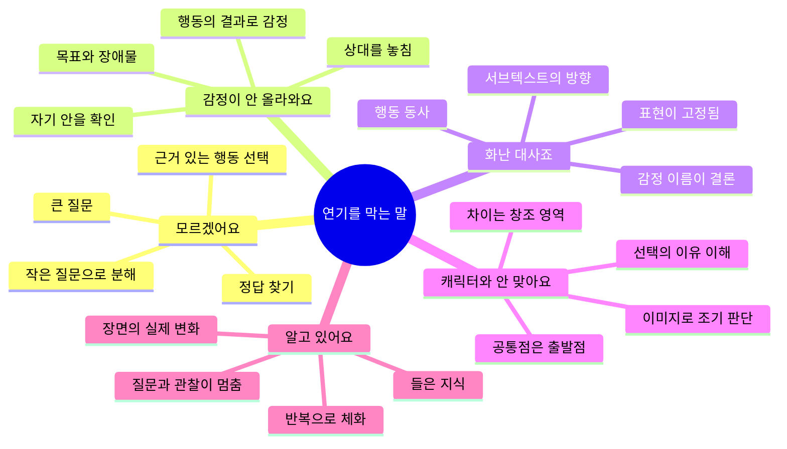

# 내 연기를 망치는 말버릇 5가지 — 멈춤을 질문으로 바꾸기

> [!info] 영상 정보
> - **원제**: "시험 전까지 무조건 고쳐야 됩니다" 내 연기를 망치는 가장 안좋은 습관 5가지..!!
> - **채널**: 배우들의 연기노트
> - **길이**: 26:45
> - **업로드**: 2026-06-21
> - **장르**: #연기 #배우훈련 #대본분석 #연영과입시 #자기대화
> - **링크**: [YouTube](https://www.youtube.com/watch?v=B4HUhk8Ec0o)
> - **자막**: 한국어 자동 자막 기반

---

## 한 줄 요약

“모르겠어요” 같은 말이 문제가 아니라 **그 말에서 생각을 멈추는 것**이 문제다. 현재 상태를 인정하고, 상대·목표·행동을 향한 더 작고 구체적인 질문으로 바꾸면 말은 연기를 막는 벽이 아니라 장면으로 들어가는 문이 된다.

> [!abstract] 다섯 문장의 전환
> 1. **“모르겠어요.”** → 정확히 무엇을 모르는가?
> 2. **“감정이 안 올라와요.”** → 지금 상대에게 무엇을 하려는가?
> 3. **“화난 대사죠?”** → 이 감정으로 상대에게 무엇을 하려는가?
> 4. **“이 캐릭터가 저와 맞을까요?”** → 공통점과 차이를 어떻게 창조에 쓸 것인가?
> 5. **“그거 알고 있어요.”** → 지금 장면에서 실제로 하고 있는가?

---

## 핵심 개념 마인드맵

---

## 챕터별 정리

### [00:00–03:18](https://youtu.be/B4HUhk8Ec0o?t=0) | 문제는 말이 아니라, 말에서 멈추는 습관

<iframe width="100%" height="315" src="https://www.youtube.com/embed/B4HUhk8Ec0o?start=0&end=198" title="문제는 말이 아니라, 말에서 멈추는 습관" frameborder="0" allow="accelerometer; autoplay; clipboard-write; encrypted-media; gyroscope; picture-in-picture" allowfullscreen></iframe>

반복해서 쓰는 말은 배우가 무엇을 먼저 찾고 어디에서 막히는지 보여 주는 단서다. 그렇다고 한 문장만으로 배우를 단정할 수는 없다. 중요한 것은 같은 말이 반복될 때 그 뒤에 숨어 있는 사고 습관을 살피는 것이다.

- “모르겠어요”에는 막막함과 정답을 찾고 싶은 마음
- “감정이 안 올라와요”에는 감정을 먼저 만들어야 한다는 믿음
- “화난 대사죠?”에는 하나의 올바른 해석을 찾으려는 마음
- “캐릭터와 맞을까요?”에는 인물과의 거리감에 대한 불안
- “알고 있어요”에는 익숙한 자리에서 질문을 끝내려는 마음

> [!important]
> 나쁜 말이 문제라기보다, 그 말 뒤에서 더 좋은 질문으로 넘어가지 않는 것이 문제다.

### [03:18–08:43](https://youtu.be/B4HUhk8Ec0o?t=198) | 1. “모르겠어요”

<iframe width="100%" height="315" src="https://www.youtube.com/embed/B4HUhk8Ec0o?start=198&end=523" title="1. “모르겠어요”" frameborder="0" allow="accelerometer; autoplay; clipboard-write; encrypted-media; gyroscope; picture-in-picture" allowfullscreen></iframe>

“모르겠다”는 말은 생각이 없다는 뜻이 아니라, 생각해야 할 것이 너무 많아 어디서 시작할지 정리되지 않았다는 신호일 수 있다. “이걸 어떻게 연기하지?”에는 인물, 상황, 관계, 장면 목표, 직전의 순간, 장애물, 행동이 한꺼번에 들어 있다.

배우의 일은 하나의 정답을 맞히는 것이 아니라, 대본의 근거 위에서 **인물이 충분히 할 수 있는 선택**을 만드는 것이다. 같은 “설득하기”도 논리로 밀기, 추억을 꺼내기, 죄책감을 주기, 농담으로 무장해제하기, 진심을 내보이기 등 여러 전술로 나뉜다. 한 전술이 통하지 않아 다른 행동으로 바뀌는 지점이 비트가 되고, 그 변화가 장면의 리듬을 만든다.

> [!question] 전환 질문
> - 인물·목표·상대·상황·직전의 순간·장애물 중 정확히 무엇을 모르는가?
> - 이 인물이 선택할 수 있는 행동 후보는 무엇인가?
> - 첫 행동이 통하지 않으면 어떤 행동으로 바꿀 수 있는가?

**연습**

1. 대본 옆에 “모르겠다” 대신 모르는 항목을 한 문장으로 적는다.
2. 상대에게 할 수 있는 행동 후보를 세 개 이상 만든다.
3. 대본 근거에 맞는 행동을 골라 실제로 해 본다.
4. 행동이 통하지 않는 지점에서 전술을 바꾸고 비트의 변화를 확인한다.

### [08:43–12:47](https://youtu.be/B4HUhk8Ec0o?t=523) | 2. “감정이 안 올라와요”

<iframe width="100%" height="315" src="https://www.youtube.com/embed/B4HUhk8Ec0o?start=523&end=767" title="2. “감정이 안 올라와요”" frameborder="0" allow="accelerometer; autoplay; clipboard-write; encrypted-media; gyroscope; picture-in-picture" allowfullscreen></iframe>

감정을 진짜로 느끼고 싶다는 마음은 나쁘지 않다. 다만 “슬퍼야지”, “왜 화가 안 나지?”라며 자기 안을 계속 확인하면 앞의 상대를 놓치고 감정은 더 멀어진다.

감정은 목표를 가지고 상대에게 행동하다 장애물에 부딪힐 때 따라오는 반응에 가깝다. 상대를 붙잡으려 하기에 절박해지고, 설득하려 하기에 초조해지며, 들키지 않으려 하기에 불안해진다. 직접 만들어야 할 것은 감정 그 자체보다 **감정이 생길 조건**이다.

> [!question] 전환 질문
> - 나는 지금 상대에게 무엇을 하려고 하는가?
> - 무엇을 얻고 싶고, 무엇을 잃을까 두려운가?
> - 상대와 목표는 구체적인가?
> - 장애물은 충분히 큰가?
> - 왜 이 말이 마지막 기회처럼 느껴지는가?

**연습**

1. 만들고 싶은 감정 이름을 잠시 목표 자리에서 내려놓는다.
2. 얻고 싶은 것과 잃을까 두려운 것을 구체적으로 쓴다.
3. 상대에게 실제 행동을 하고, 상대의 반응과 장애물을 받아들인다.
4. 감정이 없다고 자신을 꾸짖지 말고 목표·상대·장애물·행동을 다시 점검한다.

### [12:47–16:40](https://youtu.be/B4HUhk8Ec0o?t=767) | 3. “이 대사는 화난 거죠?”

<iframe width="100%" height="315" src="https://www.youtube.com/embed/B4HUhk8Ec0o?start=767&end=1000" title="3. “이 대사는 화난 거죠?”" frameborder="0" allow="accelerometer; autoplay; clipboard-write; encrypted-media; gyroscope; picture-in-picture" allowfullscreen></iframe>

감정에 이름을 붙이는 일은 참고가 될 수 있지만, 그것이 연기의 결론이 되면 표현이 굳어진다. 같은 분노라도 누군가는 소리를 지르고, 누군가는 조용해지고, 누군가는 웃는다.

“화난 대사”라고 정하면 화난 얼굴과 큰 목소리를 흉내 내기 쉽다. 반면 “상대를 멈춘다”, “죄책감을 느끼게 한다”, “거짓말을 폭로한다”처럼 행동을 정하면 장면이 움직이고 눈빛·속도·호흡·거리의 선택도 달라진다.

> [!question] 전환 질문
> - 이 인물은 이 감정으로 상대에게 무엇을 하려는가?
> - 막기, 안심시키기, 시험하기, 붙잡기 중 어디를 향하는가?
> - 직접 말하지 못한 행동의 진짜 방향은 무엇인가?

영상에서 서브텍스트는 단순한 “숨은 감정”보다 **말하지 못한 행동의 방향**에 가깝다. “괜찮아”도 더 묻지 못하게 막기, 상대를 안심시키기, 미안해하지 않게 하기, 무너진 것을 감추기, 자신을 알아봐 달라고 요구하기가 될 수 있다.

### [16:40–21:17](https://youtu.be/B4HUhk8Ec0o?t=1000) | 4. “이 캐릭터가 저와 잘 맞을까요?”

<iframe width="100%" height="315" src="https://www.youtube.com/embed/B4HUhk8Ec0o?start=1000&end=1277" title="4. “이 캐릭터가 저와 잘 맞을까요?”" frameborder="0" allow="accelerometer; autoplay; clipboard-write; encrypted-media; gyroscope; picture-in-picture" allowfullscreen></iframe>

시험 작품을 고를 때 이미지와 장점이 드러나는지 확인하는 것은 현실적인 질문이다. 그러나 “나와 맞는가?”를 너무 먼저 물으면 인물을 충분히 이해하기 전에 겉모습으로만 판단하게 된다.

배우에게 더 유용한 첫 질문은 “나는 이 인물을 이해할 수 있는가?”이다. 공통점은 출발점이고, 차이는 창조의 영역이다. 인물을 이해하는 것은 그 행동을 옳다고 승인하는 일이 아니라, 왜 그런 선택까지 이르렀는지 대본의 근거로 추적하는 일이다.

> [!question] 전환 질문
> - 왜 이 인물은 이렇게 말하고, 숨기고, 밀어내고, 떠나지 못하는가?
> - 이 인물과 나는 어디가 같고 어디가 다른가?
> - 무엇을 잃었고, 무엇을 간절히 원하는가?
> - 그 차이를 어떻게 설득력 있게 만들 수 있는가?

좋은 선택지는 나와 접점이 있으면서도 새롭게 만들어야 할 차이가 있는 인물일 수 있다.

### [21:17–24:56](https://youtu.be/B4HUhk8Ec0o?t=1277) | 5. “그거 알고 있어요”

<iframe width="100%" height="315" src="https://www.youtube.com/embed/B4HUhk8Ec0o?start=1277&end=1496" title="5. “그거 알고 있어요”" frameborder="0" allow="accelerometer; autoplay; clipboard-write; encrypted-media; gyroscope; picture-in-picture" allowfullscreen></iframe>

장면 목표, 행동, 비트, 서브텍스트라는 말을 들어 본 것과 실제 장면에서 아는 것은 다르다. “모르겠어요”는 질문을 시작하지 못해 멈추고, “알고 있어요”는 더 질문하지 않아 멈춘다.

대본의 정보가 설명으로만 남으면 죽은 정보다. 그 정보가 눈빛·호흡·거리·속도·몸의 긴장·침묵을 바꿀 때 살아 있는 조건이 된다. 예컨대 “돈이 없는 인물”이라는 정보는 상대가 밥값을 내겠다고 할 때 눈빛이 바뀌거나, 돈 이야기에 몸이 긴장하거나, 웃으면서 손이 주머니로 향하는 변화가 되어야 한다.

> [!question] 전환 질문
> - 나는 이것을 아는가, 들어 보기만 했는가?
> - 내 장면 목표는 지금 상대를 향하고 있는가?
> - 나는 상대에게 실제로 어떤 행동을 하고 있는가?
> - 이 정보가 눈빛·호흡·거리·속도·몸·침묵 중 무엇을 바꾸는가?

좋은 배우는 같은 개념을 새 대본과 새 상대 안에서 반복해서 다시 만나며 경험의 폭을 넓힌다.

### [24:56–26:45](https://youtu.be/B4HUhk8Ec0o?t=1496) | 결론: 벽을 문으로 바꾸는 자기 대화

<iframe width="100%" height="315" src="https://www.youtube.com/embed/B4HUhk8Ec0o?start=1496&end=1605" title="결론: 벽을 문으로 바꾸는 자기 대화" frameborder="0" allow="accelerometer; autoplay; clipboard-write; encrypted-media; gyroscope; picture-in-picture" allowfullscreen></iframe>

배우라면 누구나 막막할 수 있고, 감정이 올라오지 않거나 인물과 거리감을 느낄 수 있다. 그것은 부끄러운 일이 아니다. 배우는 항상 완벽한 사람이 아니라, 흔들리는 자신을 가지고도 다시 인물과 장면으로 돌아와 분석하고 시도하는 사람이다.

> [!tip] 즉시 사용할 자기 대화
> - “지금 모르는구나. 그럼 무엇을 모르는지 나눠 보자.”
> - “감정이 안 올라오는구나. 그럼 상대에게 무엇을 하려는지 다시 보자.”
> - “이걸 안다고 생각했구나. 그럼 실제로 하고 있는지 확인하자.”

---

## 암기 포인트 요약

| 멈추게 하는 말 | 숨어 있는 함정 | 연기를 여는 질문 |
|---|---|---|
| 모르겠어요 | 너무 큰 질문, 정답 찾기 | 정확히 무엇을 모르는가? |
| 감정이 안 올라와요 | 감정을 직접 명령하고 자기 안만 확인 | 상대에게 무엇을 하려는가? |
| 화난 대사죠? | 감정 이름을 연기의 결론으로 삼음 | 이 감정으로 상대에게 무엇을 하려는가? |
| 캐릭터와 안 맞아요 | 이해 전에 이미지로 판단 | 공통점과 차이를 어떻게 창조할까? |
| 알고 있어요 | 들은 지식을 체화된 경험으로 착각 | 지금 장면에서 실제로 하고 있는가? |

> [!summary] 가장 중요한 문장
> 감정은 상태이고 행동은 방향이다. “무슨 감정을 보여 줄까?”보다 “이 인물로서 지금 이 상대에게 무엇을 하려는가?”로 돌아간다.

---

## 용어 정리

| 용어 | 의미 |
|---|---|
| 장면 목표 | 인물이 장면에서 상대에게 얻고자 하는 것 |
| 행동 | 목표를 이루기 위해 상대에게 실제로 하는 것 |
| 장애물 | 목표를 쉽게 이루지 못하게 만드는 힘 |
| 전술 | 같은 목표를 이루기 위해 선택하는 구체적인 방법 |
| 비트 | 전술이나 행동이 바뀌는 장면의 구간 |
| 서브텍스트 | 인물이 직접 말하지 못한 행동의 진짜 방향 |
| 근거 있는 선택 | 인물·상황·관계·목표와 대본 근거에 기반한 행동 선택 |
| 감정의 조건 | 구체적인 상대·목표·장애물·얻고 싶은 것·잃을까 두려운 것 |
| 살아 있는 조건 | 대본 정보가 눈빛·호흡·거리·속도·몸·침묵의 변화를 만드는 상태 |
| 체화 | 개념을 설명하는 데서 끝나지 않고 실제 장면에서 반복 가능하게 사용하는 상태 |

---

## 연습 전 10문항 점검표

- [ ] 지금 반복되는 내 말은 무엇인가?
- [ ] 정확히 무엇을 모르는지 작게 나눴는가?
- [ ] 장면 목표가 상대를 향하는가?
- [ ] 상대에게 실제로 하려는 행동은 무엇인가?
- [ ] 행동을 어렵게 만드는 장애물은 무엇인가?
- [ ] 감정 이름이 행동의 결론을 대신하고 있지 않은가?
- [ ] 서브텍스트를 행동 방향으로 적었는가?
- [ ] 인물과 나의 차이를 판단보다 이해의 질문으로 바꿨는가?
- [ ] 대본 정보가 눈빛·호흡·거리·속도·몸·침묵을 바꾸는가?
- [ ] “안다”가 아니라 실제 장면에서 하는 증거가 있는가?

---

## 셀프 테스트

> [!question]- Q1. 영상은 “모르겠어요”라는 말을 금지하는가?
> 아니다. 현재의 막막함을 인정하되, 거기서 멈추지 않고 “정확히 무엇을 모르는가?”로 문제를 나누라고 한다.

> [!question]- Q2. 감정이 안 생길 때 먼저 확인할 것은?
> 감정 그 자체가 아니라 상대·목표·장애물·얻고 싶은 것·잃을까 두려운 것, 그리고 실제 행동이다.

> [!question]- Q3. “화난 대사”라고 정하면 왜 위험한가?
> 화난 표정이나 큰 목소리 같은 결과를 흉내 내며 표현이 고정되기 쉽기 때문이다.

> [!question]- Q4. 이 영상에서 서브텍스트란?
> 단순한 숨은 감정이 아니라, 인물이 직접 말하지 못한 행동의 진짜 방향이다.

> [!question]- Q5. 인물이 나와 다르면 배역 선택에서 제외해야 하는가?
> 아니다. 공통점은 출발점이고 차이는 창조의 재료다. 차이가 생긴 이유를 대본 근거로 이해해야 한다.

> [!question]- Q6. “알고 있다”와 “들어 봤다”의 차이는?
> 개념이나 정보가 실제 장면의 행동과 눈빛·호흡·거리·속도·몸·침묵의 변화로 나타나는가의 차이다.

> [!question]- Q7. 다섯 습관을 관통하는 해결 원리는?
> 자신을 혼내거나 말을 금지하지 않고, 그 말에서 멈추지 않은 채 상대·목표·행동을 향한 구체적인 질문으로 전환하는 것이다.

---

## 종합 정리

다섯 말버릇은 재능 부족의 증거가 아니라 배우가 막힌 지점을 알려 주는 신호다.

- 막막함은 **작은 질문과 선택 가능한 행동**으로 바꾼다.
- 감정 집착은 **상대·목표·장애물과 행동의 조건**으로 바꾼다.
- 감정 이름은 **상대에게 하려는 행동의 방향**으로 바꾼다.
- 인물과의 거리감은 **차이를 이해하고 창조하는 질문**으로 바꾼다.
- 익숙한 지식은 **장면에서 작동하는 경험**으로 바꾼다.

분석이 선택이 되고, 선택이 행동이 되며, 행동이 장면의 리듬과 감정을 움직인다.

---

## 관련 자료

### 내부 링크

- [[연기 홈]]
- [[연습을 잘 하기 위한 방법]]
- [[연습 템플릿 사용 가이드]]
- [[앞으로 남은 기간 동안 어떻게 해야 많이 성장할 수 있을까]]
- [[20260726(일)_언어적, 신체적 행동]]
- [[20260629(월)_연기 연습]]
- [[마르틴 - 테베랜드]]
- [[마이즈너 테크닉 - 성공 배우]]

### 외부 자료

- [Self-Talk and Sports Performance: A Meta-Analysis](https://pubmed.ncbi.nlm.nih.gov/26167788/) — 자기 대화 개입이 수행에 미치는 효과를 종합한 메타분석
- [Deliberate Practice and Proposed Limits](https://pmc.ncbi.nlm.nih.gov/articles/PMC6824411/) — 명시적 목표·정보성 피드백·반복 수정으로 이루어진 의도적 연습
- [Interaction in Acting Training](https://www.frontiersin.org/journals/psychology/articles/10.3389/fpsyg.2022.949209/full) — 마이즈너 훈련에서 상대와 진행 중인 상호작용에 관여하는 방식에 관한 연구
- [Embodied Cognition in Performance](https://www.frontiersin.org/journals/psychology/articles/10.3389/fpsyg.2019.02277/full) — 신체적 행동과 정서 상태의 상호작용을 살핀 마이클 체홉 훈련 연구
- [The impact of acting training on emotion recognition and expression](https://pubmed.ncbi.nlm.nih.gov/41777782/) — 연기 훈련과 감정 인식·표현 연구를 정리한 체계적 문헌고찰

> [!note] 자료 해석
> 외부 연구는 영상의 모든 주장을 직접 검증한 것이 아니라, 자기 대화·의도적 연습·상대와의 상호작용·행동과 정서의 관계를 보강하는 참고 자료다.

---

## 메타데이터

- **video_id**: B4HUhk8Ec0o
- **source_type**: YouTube
- **genre**: acting
- **note_created**: 2026-07-26
- **transcript_language**: ko
- **transcript_type**: auto-generated
