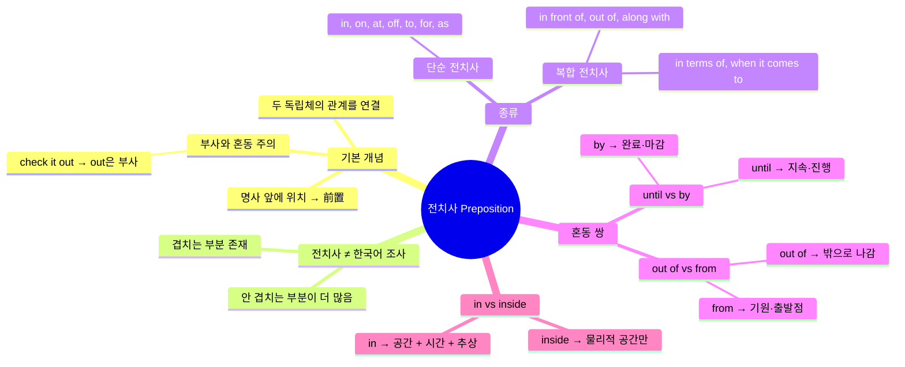
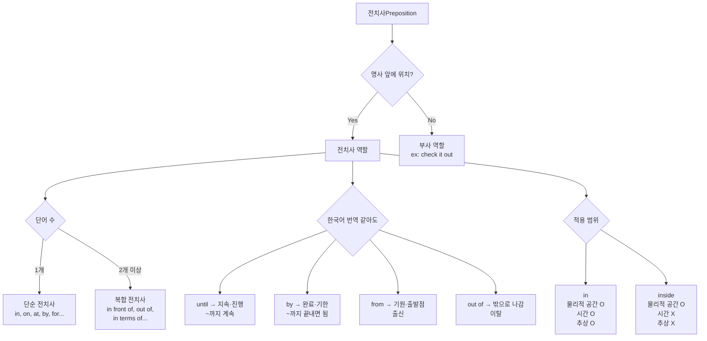

# 영어 전치사 접근법 대공개! (1편)

## 목차

1. [[#개요]]
   - [[#한 줄 핵심]]
   - [[#본문 요약]]
   - [[#마인드맵]]
   - [[#암기 포인트]]
   - [[#구간 가이드]]
   - [[#이해도 체크 — 개요]]
2. [[#Chapter 1 — 전치사의 기본 개념 (0:00~4:23)]]
3. [[#Chapter 2 — 전치사의 종류와 혼동되는 전치사들 (4:23~8:37)]]
4. [[#Chapter 3 — in vs inside 뉘앙스 비교 (8:37~10:56)]]
5. [[#종합 정리]]
6. [[#핵심 표현 카드]]
7. [[#용어·문법 사전]]
8. [[#학습 체크리스트]]
9. [[#보충 자료]]
10. [[#내 생각 & 연결]]

---

## 개요

> [!info] 전체 영상
> <iframe width="560" height="315" src="https://www.youtube.com/embed/J-VYcyiNMPk" frameborder="0" allowfullscreen></iframe>

### 한 줄 핵심

전치사는 **두 독립체 사이의 관계**를 나타내며, 한국어 조사와 1:1 대응하지 않는다 — 겹치는 부분보다 겹치지 않는 부분이 훨씬 많다.

### 본문 요약

전치사(preposition)는 말 그대로 명사 **앞(前)에 위치(置)**하며, 두 개 이상의 독립체 사이의 관계를 연결하는 품사다. "a book on the desk"에서 on은 book과 desk라는 두 독립체의 관계를 이어준다. 전치사가 한국어 조사처럼 보이는 경우가 있지만, 이는 부분적 겹침일 뿐 동일하지 않다. 한국어로 동일하게 번역되는 전치사들(until vs by, out of vs from)도 영어에서는 전혀 다른 뉘앙스를 가지며, 복합 전치사와 단순 전치사의 구분, 그리고 in vs inside처럼 물리적 공간에만 쓸 수 있는 전치사와 시간·추상 개념까지 아우르는 전치사의 차이를 정확히 이해해야 한다.

### 마인드맵



### 암기 포인트

| 번호 | 핵심 포인트 | 예시 |
|------|-------------|------|
| 1 | 전치사 = 두 독립체의 **관계** 표현 | a book **on** the desk |
| 2 | 전치사 ≠ 한국어 조사 (부분적 겹침만) | ~에, ~의는 참고용일 뿐 |
| 3 | until = 지속, by = 완료 기한 | studied until Friday / submit by Friday |
| 4 | from = 기원, out of = 밖으로 이동 | I'm from Korea / I'm out of Korea |
| 5 | in = 공간+시간+추상, inside = 물리적 공간만 | in 1999 (O) / inside 1999 (X) |

### 구간 가이드

| 구간 | 시간 | 난이도 | 핵심 키워드 |
|------|------|--------|-------------|
| Chapter 1 | 0:00~4:23 | 🟢 기초 | 전치사 정의, 두 독립체의 관계, 前置 |
| Chapter 2 | 4:23~8:37 | 🟡 중급 | 단순/복합 전치사, until vs by, out of vs from |
| Chapter 3 | 8:37~10:56 | 🟡 중급 | in vs inside, 물리적 공간 vs 시간·추상 |

### 이해도 체크 — 개요

- [ ] 전치사가 "명사 앞에 위치한다"는 정의를 내 말로 설명할 수 있다.
- [ ] 전치사와 한국어 조사가 왜 1:1 대응이 아닌지 근거를 들어 말할 수 있다.
- [ ] until과 by의 차이를 상황을 들어 구분할 수 있다.
- [ ] in과 inside가 교환 불가능한 맥락을 두 가지 들 수 있다.

---

## Chapter 1 — 전치사의 기본 개념 (0:00~4:23)

> [!info] 챕터 1 영상 구간
> <iframe width="560" height="315" src="https://www.youtube.com/embed/J-VYcyiNMPk?start=0&end=263" frameborder="0" allowfullscreen></iframe>

### 왜 이게 어려운가

한국어 학습자는 전치사를 조사에 대입하려는 습관이 있다. "~에" = at/in/on, "~로" = to/for/by처럼 외우면 초반에는 통하는 것처럼 보이지만, 영어의 전치사는 한국어 조사보다 훨씬 **관계 지향적**이다. 조사는 명사의 격(格)을 표시하지만, 전치사는 두 독립체 사이의 공간적·시간적·추상적 관계를 입체적으로 표현한다. 이 차이를 무시하고 암기로만 접근하면, 새로운 용례를 마주칠 때마다 막히게 된다.

또한 "check it out"처럼 out이 전치사처럼 보이지만 실제로는 부사로 기능하는 사례가 있어, 형태만 보고 품사를 단정하는 오류도 흔하다.

### 규칙 설명

**전치사의 정의:** 두 개 이상의 독립체(entity) 사이의 관계를 나타내며, 명사 앞에 위치한다.

- 前(앞 전) + 置(둘 치) → 명사 앞에 두는 것
- 전치사 뒤에는 반드시 명사(구)가 따라온다.
- 전치사처럼 보이더라도 명사 없이 쓰이면 부사일 가능성이 높다.

**전치사 ≠ 한국어 조사:**
- 겹치는 부분: ~에(at, in, on), ~의(of), ~로(to, for), ~에서(from, out of) 등
- 안 겹치는 부분이 더 많으므로, 조사로 암기하는 방식은 한계가 있다.

### 패턴 구조

```
[ 명사/대명사 A ] + [ 전치사 ] + [ 명사/대명사 B ]
→ A와 B 사이의 관계를 전치사가 표현한다.
```

| 구조 | A | 전치사 | B | 관계 |
|------|---|--------|---|------|
| a book on the desk | book | on | desk | book이 desk 위에 얹혀 있는 관계 |
| a man in the building | man | in | building | man이 building 안에 있는 관계 |
| go to school | (동사 행위) | to | school | 이동의 도착점 관계 |
| from Korea | (출발) | from | Korea | 기원·출발점 관계 |
| during vacation | (사건) | during | vacation | 시간적 동시 진행 관계 |

### 예문 분석

| 문장 | 전치사 | A (앞 독립체) | B (뒤 독립체) | 의미 |
|------|--------|--------------|--------------|------|
| a book **on** the desk | on | book | desk | 책이 책상 위에 얹힌 관계 |
| a man **in** the building | in | man | building | 남자가 건물 안에 있는 관계 |
| go **to** school | to | 이동 행위 | school | 학교를 향한 이동 |
| **from** Korea | from | 출발 | Korea | 한국을 출발점으로 하는 기원 |
| **during** vacation | during | 사건 | vacation | 방학 기간과 동시에 일어남 |
| check it **out** | (부사!) | — | — | out은 동사 check을 수식하는 부사 |

> [!warning] 함정: check it out의 out은 전치사가 아니다
> "check it out"에서 out 뒤에 명사가 없다. 전치사는 반드시 명사(구) 앞에 위치해야 하므로, 이 경우 out은 **부사(adverb)**다. 구동사(phrasal verb)에 포함된 입자(particle)를 전치사로 혼동하지 말 것.

### 이해도 체크 — Chapter 1

- [ ] "a book on the desk"에서 on이 연결하는 두 독립체를 말할 수 있다.
- [ ] 전치사와 부사를 구분하는 기준(뒤에 명사가 오는가)을 적용할 수 있다.
- [ ] "during vacation"에서 during이 어떤 관계를 표현하는지 설명할 수 있다.

---

## Chapter 2 — 전치사의 종류와 혼동되는 전치사들 (4:23~8:37)

> [!info] 챕터 2 영상 구간
> <iframe width="560" height="315" src="https://www.youtube.com/embed/J-VYcyiNMPk?start=263&end=517" frameborder="0" allowfullscreen></iframe>

### 왜 이게 어려운가

한국어 번역이 동일한 전치사들이 영어에서는 전혀 다른 상황을 표현한다. "~까지"로 번역되는 until과 by, "~에서·로부터"로 번역되는 from과 out of가 대표적이다. 번역에 의존하면 "I studied until Friday"를 "by Friday로 바꿔도 되지 않나?"라는 오류를 범하게 된다. 또한 단순 전치사와 복합 전치사의 구분을 몰라 in terms of처럼 세 단어짜리 표현을 하나의 전치사로 인식하지 못하는 경우도 있다.

### 규칙 설명

**단순 전치사(Simple Preposition):** 한 단어로 이루어진 전치사.

> in, on, at, off, to, for, as, by, from, with, of, into, onto, upon, via …

**복합 전치사(Complex/Compound Preposition):** 두 단어 이상으로 이루어졌지만 하나의 전치사 역할을 하는 표현.

> in front of, out of, along with, inside, in terms of, when it comes to, as well as, in addition to …

**until vs by — 둘 다 한국어로 "~까지"**

| 전치사 | 핵심 이미지 | 설명 |
|--------|------------|------|
| until | 지속·연속 | 그 시점까지 계속 진행되거나 유지됨 |
| by | 완료·마감 기한 | 그 시점 이전 어느 때든 완료되면 됨 |

**out of vs from — 둘 다 한국어로 "~에서, ~로부터"**

| 전치사 | 핵심 이미지 | 설명 |
|--------|------------|------|
| from | 기원·출발점 | 출신, 시작점을 나타냄. 이동 동작 불포함 가능 |
| out of | 밖으로 나감 | 안에서 밖으로 나오는 동작·상태 |

### 패턴 구조

```
until [시점] → 그 시점까지 행위가 계속됨
by    [시점] → 그 시점을 기한으로 완료됨

from  [장소/출처] → 출발점·기원
out of [장소]    → 그 장소의 바깥으로 벗어남
```

### 예문 분석

**until vs by**

| 문장 | 번역 | 핵심 뉘앙스 |
|------|------|------------|
| I studied English **until** Friday. | 나는 금요일까지 (쭉) 영어를 공부했다. | 월·화·수·목·금 내내 공부했다는 지속의 의미 |
| Submit the report **by** Friday. | 보고서를 금요일까지 제출해라. | 금요일 이전 어느 시점에 제출하면 됨. 목요일에 해도 OK |

> [!warning] 혼동 방지
> "by Friday"는 금요일 당일에만 한다는 뜻이 아니다. 금요일 **이전에 완료**되면 모두 충족된다. 반면 "until Friday"는 금요일이라는 시점까지 행위가 **지속**되어야 한다.

**out of vs from**

| 문장 | 번역 | 핵심 뉘앙스 |
|------|------|------------|
| I'm **from** Korea. | 저는 한국 출신이에요. | 기원·출신. 현재 위치와 무관 |
| I'm **out of** Korea. | 저는 한국 밖에 있어요 / 한국을 벗어났어요. | 한국이라는 공간의 바깥에 있음을 표현 |

> [!warning] 혼동 방지
> "I'm from Korea"는 출신을 말하는 것이므로, 현재 한국에 있어도 쓸 수 있다. "I'm out of Korea"는 현재 한국 밖에 위치한다는 물리적 상태다. 두 문장은 번역이 비슷해 보이지만 전달하는 정보가 완전히 다르다.

**단순 vs 복합 전치사 예시**

| 구분 | 예시 표현 | 비고 |
|------|----------|------|
| 단순 | in, on, at, by, for, off, to | 한 단어 |
| 복합 | in front of, out of, along with | 두 단어 이상이지만 하나의 전치사 |
| 복합 | in terms of, when it comes to | 세 단어 이상도 하나의 전치사 기능 |

### 이해도 체크 — Chapter 2

- [ ] until과 by의 차이를 상황 예시를 들어 설명할 수 있다.
- [ ] "I'm from Korea"와 "I'm out of Korea"가 다른 이유를 말할 수 있다.
- [ ] "in terms of"가 단순 전치사가 아닌 이유를 설명할 수 있다.
- [ ] 구동사의 입자(particle)가 전치사가 아닌 부사인 이유를 말할 수 있다.

---

## Chapter 3 — in vs inside 뉘앙스 비교 (8:37~10:56)

> [!info] 챕터 3 영상 구간
> <iframe width="560" height="315" src="https://www.youtube.com/embed/J-VYcyiNMPk?start=517&end=656" frameborder="0" allowfullscreen></iframe>

### 왜 이게 어려운가

in과 inside는 물리적 공간에서는 교환 가능해 보이기 때문에 차이가 없다고 생각하기 쉽다. 하지만 in은 물리적 공간뿐 아니라 시간, 추상적 개념까지 커버하는 반면 inside는 물리적·구체적 공간에 제한된다. 이 경계를 모르면 "inside 1999"처럼 원어민이 절대 쓰지 않는 표현을 만들게 된다.

### 규칙 설명

**in의 적용 범위:**
1. 물리적 공간: "a ball in the box" (공이 상자 안에)
2. 시간 표현: "in 1999", "in summer", "in the morning"
3. 추상적 맥락: "in trouble", "in love", "in danger"

**inside의 적용 범위:**
1. 물리적·구체적 공간만: "a ball inside the box" (공이 상자 안쪽에)
2. 어떤 실체가 명확히 존재하는 닫힌 공간에서 그 내부를 강조할 때

→ **inside는 시간이나 추상 개념에 쓸 수 없다.**

### 패턴 구조

```
in + [물리적 공간]      → O  예: in the box
in + [시간 표현]        → O  예: in 1999, in summer
in + [추상 개념]        → O  예: in danger, in love

inside + [물리적 공간]  → O  예: inside the box (내부 강조)
inside + [시간 표현]    → X  예: inside summer (불가)
inside + [추상 개념]    → X  예: inside danger (불가)
```

### 예문 분석

| 문장 | 가능 여부 | 이유 |
|------|----------|------|
| a ball **in** the box | O | in은 물리적 공간 가능 |
| a ball **inside** the box | O | inside도 물리적 공간 가능, 내부 강조 |
| **in** summer | O | in은 시간 표현 가능 |
| **inside** summer | X | inside는 시간 표현 불가 — 이상한 표현 |
| **in** 1999 | O | in은 시간 표현 가능 |
| **inside** 1999 | X | inside는 시간 표현 불가 — 매우 이상한 표현 |

> [!warning] 핵심 구분 원칙
> box는 물리적 실체이므로 "그 안"이라는 개념이 성립한다. 그래서 inside가 가능하다. 그러나 summer와 1999는 추상적 시간 개념이다. "1999의 안쪽"이라는 물리적 공간이 존재하지 않으므로 inside를 쓸 수 없다. **inside는 반드시 물리적으로 '안쪽'이 존재하는 공간에만 쓴다.**

**in과 inside의 교환 가능 범위 요약**

| 맥락 | in | inside |
|------|-----|--------|
| 물리적 닫힌 공간 (box, room, building) | O | O |
| 시간 (1999, summer, morning) | O | X |
| 추상 개념 (love, danger, trouble) | O | X |

### 이해도 체크 — Chapter 3

- [ ] "in the box"와 "inside the box"가 둘 다 가능한 이유를 설명할 수 있다.
- [ ] "inside summer"가 왜 틀린지 근거를 들어 말할 수 있다.
- [ ] in이 inside보다 더 넓은 범위를 커버하는 세 가지 맥락을 나열할 수 있다.

---

## 종합 정리



**전치사 학습의 핵심 원칙:**
1. 전치사는 두 독립체의 **관계**를 표현한다 — 번역 암기보다 관계의 이미지를 먼저 잡아라.
2. 한국어 번역이 같아도 영어 뉘앙스는 다를 수 있다 — until vs by, from vs out of가 대표 사례.
3. 전치사의 사용 범위에는 경계가 있다 — in은 넓고, inside는 물리적 공간에 한정.
4. 구동사의 입자(particle)는 전치사가 아닌 부사일 수 있다 — 명사가 뒤따르는지 확인.

---

## 핵심 표현 카드

> **a book on the desk**
> 책이 책상 위에 있다 — on은 book과 desk 두 독립체의 관계를 연결한다.

> **I studied English until Friday.**
> 나는 금요일까지 (내내) 영어를 공부했다 — until은 그 시점까지의 지속을 의미한다.

> **Submit the report by Friday.**
> 금요일까지 보고서를 제출해라 — by는 완료·마감 기한이며, 이전 어느 시점에 완료해도 된다.

> **I'm from Korea.**
> 나는 한국 출신이에요 — from은 기원·출발점을 나타내며 현재 위치와 무관하다.

> **I'm out of Korea.**
> 나는 한국 밖에 있어요 — out of는 그 공간의 바깥에 있다는 물리적 상태다.

> **a ball in the box / a ball inside the box**
> 물리적 공간에서는 둘 다 가능. in은 더 넓은 범위(시간·추상), inside는 물리적 공간 한정.

> **in summer (O) / inside summer (X)**
> summer는 추상적 시간 개념이므로 inside를 쓸 수 없다. in만 가능하다.

> **in 1999 (O) / inside 1999 (X)**
> 1999는 시간 표현이므로 inside 불가. "1999의 안쪽"이라는 물리적 공간이 존재하지 않기 때문이다.

---

## 용어·문법 사전

| 용어 | 설명 |
|------|------|
| 전치사 (Preposition) | 명사 앞에 위치하며 두 독립체 사이의 관계를 나타내는 품사. 前置詞. |
| 단순 전치사 (Simple Preposition) | 한 단어로 이루어진 전치사. in, on, at, by, for, off, to, as 등 |
| 복합 전치사 (Complex Preposition) | 두 단어 이상이지만 하나의 전치사 기능을 하는 표현. in front of, in terms of, out of 등 |
| 부사 (Adverb) | 동사·형용사·다른 부사를 수식하는 품사. 구동사의 입자(particle)는 부사인 경우가 많음 |
| 구동사 (Phrasal Verb) | 동사 + 입자(particle)로 이루어진 표현. check out, turn on, give up 등 |
| 입자 (Particle) | 구동사를 구성하는 out, up, off 등의 요소. 전치사처럼 보이지만 부사로 기능 |
| 독립체 (Entity) | 전치사가 관계를 연결하는 두 대상. book-desk, man-building 등 |
| until | 그 시점까지 행위·상태가 지속됨을 나타내는 전치사 |
| by | 특정 시점을 기한으로 그 이전에 완료됨을 나타내는 전치사 |
| from | 출발점·기원을 나타내는 전치사 |
| out of | 어떤 공간·범위의 바깥으로 나감을 나타내는 복합 전치사 |
| inside | 물리적으로 닫힌 공간의 내부를 강조하는 전치사. 시간·추상 개념에는 사용 불가 |

---

## 학습 체크리스트

### 개념 이해

- [ ] 전치사가 명사 앞에 위치한다는 정의를 알고, 이를 벗어나는 경우(부사)를 구분할 수 있다.
- [ ] 전치사는 두 독립체의 관계를 표현한다는 핵심 원리를 이해했다.
- [ ] 전치사와 한국어 조사가 다른 이유(겹치는 부분보다 안 겹치는 부분이 더 많음)를 설명할 수 있다.

### 혼동 전치사 구분

- [ ] until(지속)과 by(완료·기한)를 상황별로 정확히 쓸 수 있다.
- [ ] from(기원)과 out of(이탈)를 맥락에 맞게 선택할 수 있다.
- [ ] in과 inside의 차이(in = 공간+시간+추상, inside = 물리적 공간만)를 적용할 수 있다.

### 표현 능력

- [ ] 단순 전치사 5개 이상을 즉시 열거할 수 있다.
- [ ] 복합 전치사 3개 이상을 즉시 열거하고 예문을 만들 수 있다.
- [ ] 구동사의 입자가 부사인지 전치사인지 판단할 수 있다.

### 다음 단계

- [ ] [[YT-english-260305-전치사-접근법-심화-2편]] 에서 개별 전치사의 심화 뉘앙스 학습 예정.

---

## 보충자료

| 자료 | 유형 | 왜 읽어야 하는지 |
|------|------|-----------------|
| [[YT-english-260305-전치사-접근법-심화-2편]] | 후속 영상 | 2편: 공간→시간→추상 발달 공식과 전치사 공부법 |
| [[영어 발음기호 IPA 개념 교과서]] | 볼트 노트 | 전치사 발음(at /æt/, in /ɪn/, on /ɒn/) 정확히 익히기 |
| [Grammarly: In, On, At 전치사 가이드](https://www.grammarly.com/blog/parts-of-speech/prepositions-in-on-at/) | 문법서/사전 | in/on/at의 장소·시간 용법 체계적 정리 |
| [British Council: Prepositions of place](https://learnenglish.britishcouncil.org/grammar/a1-a2-grammar/prepositions-place) | 연습 사이트 | in/on/at 장소 전치사 인터랙티브 연습 |
| [나무위키: 전치사](https://namu.wiki/w/%EC%A0%84%EC%B9%98%EC%82%AC) | 참고 문서 | 한국어 화자 관점에서 정리된 전치사 개요 |

**추가 연습 제안:**
- 영어 원서나 뉴스 기사에서 until/by/from/out of가 쓰인 문장을 찾아 각각 어떤 뉘앙스로 쓰였는지 확인
- inside vs in이 대조되는 맥락을 직접 문장으로 만들어보기 (물리적 공간 3개, 시간 표현 3개)
- 구동사 목록에서 particle을 골라 "이것이 전치사인가 부사인가?"를 판별하는 연습

---

## 내 생각 & 연결

전치사를 "두 독립체의 관계"라는 프레임으로 보는 것은 기존의 조사 대입 방식과 완전히 다른 관점이다. 특히 until과 by의 차이는 영어 글쓰기에서 마감 기한을 표현할 때 실질적인 오해를 낳을 수 있는 부분이라 중요하다. "by Friday"를 "until Friday"로 쓰면 금요일까지 내내 작업한다는 뜻이 되어버린다.

inside가 물리적 공간에만 쓰인다는 규칙은 [[영어 발음기호 IPA 개념 교과서]]에서 다룬 음소 체계 학습과 비슷한 구조다 — 표면적으로 같아 보이지만(in ≈ inside, 비슷한 발음) 내부적으로 적용 범위가 전혀 다르다는 점에서. 언어의 규칙은 형태보다 **기능과 범위**로 이해해야 한다는 원칙이 반복된다.

2편에서 다룰 개별 전치사의 심화 뉘앙스([[YT-english-260305-전치사-접근법-심화-2편]])가 기대된다. 1편의 큰 그림(관계, 범위, 혼동 쌍)이 2편의 세부 뉘앙스 학습의 기반이 될 것이다.