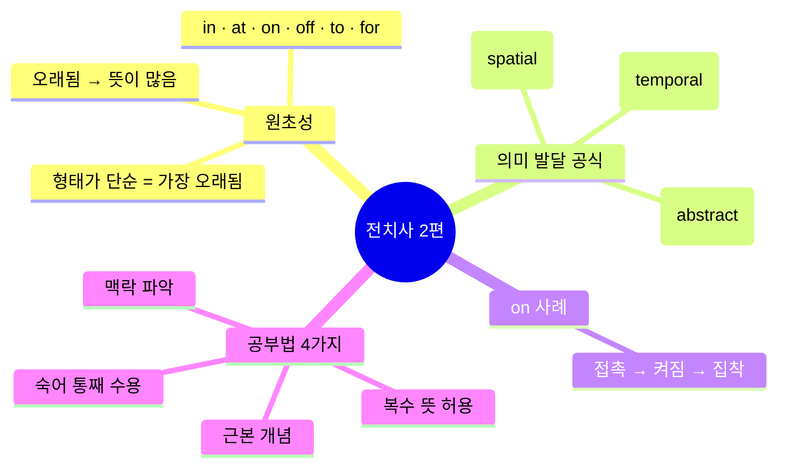
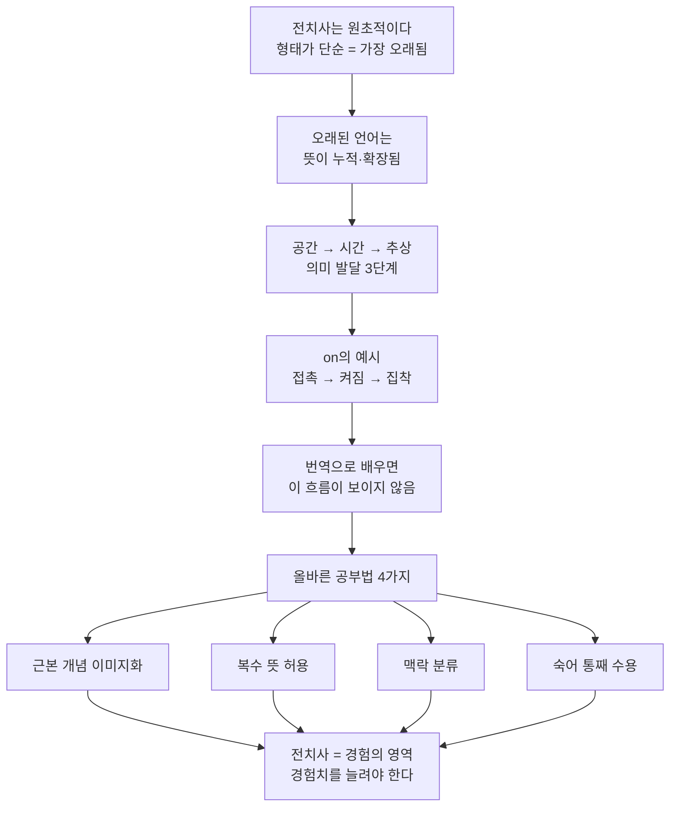

# 이 개념 탑재 안 하면 평생 헤맵니다 — 영어 전치사 접근법 (2편)

<iframe width="100%" height="400" src="https://www.youtube.com/embed/f6FrPW4wLOo" title="전치사 접근법 대공개 2편" frameborder="0" allowfullscreen></iframe>

---

## 목차

1. [[#개요]]
2. [[#Chapter 1 — 전치사는 매우 원초적이다]]
3. [[#Chapter 2 — on의 의미 발달: 접촉에서 집착까지]]
4. [[#Chapter 3 — 전치사가 어려운 이유 + 올바른 공부법]]
5. [[#종합 정리]]
6. [[#핵심 표현 카드]]
7. [[#용어·문법 사전]]
8. [[#학습 체크리스트]]
9. [[#보충자료]]
10. [[#내 생각 & 연결]]

---

## 개요

### 한 줄 핵심

전치사는 **공간 → 시간 → 추상** 순서로 의미가 발달하며, 근본 개념(이미지)을 익혀야 맥락에서 살아있는 뜻을 파악할 수 있다.

### 본문

전치사는 영어에서 가장 오래된 단어군이다. `in`, `at`, `on`, `off`, `to`, `for`처럼 형태가 단순할수록 원초적이고, 원초적이기 때문에 하나의 단어가 수십 가지 쓰임을 갖는다. 이 영상은 그 이유를 언어의 역사적 발달 원리로 설명하고, `on`을 예시로 공간·시간·추상 의미의 연쇄를 시연한다. 마지막으로 전치사 학습이 왜 단어장 암기로는 불가능한지, 올바른 4가지 공부법이 무엇인지를 다룬다.

1편과의 관계: [[YT-english-260305-전치사-접근법-기초-1편]]에서 '전치사란 무엇인가'를 다뤘다면, 2편은 **왜 전치사가 이렇게 복잡한지**의 이론적 근거를 제공한다.

### 마인드맵



### 암기 포인트

| 번호 | 핵심 명제 | 비고 |
|------|-----------|------|
| 1 | 언어는 **공간 → 시간 → 추상** 순서로 발달한다 | 전치사 해석의 근거 |
| 2 | `on`의 근본 개념은 "위에"가 아니라 **접촉(contact)** | 오해 교정 |
| 3 | 전치사를 한국어 번역으로 1:1 매칭하면 반드시 꼬인다 | 학습 오류 원인 |
| 4 | 숙어(collocation)는 이유를 찾지 말고 통째로 받아들인다 | 실용 전략 |
| 5 | 전치사는 경험의 영역이다 — 경험치를 늘려야 한다 | 최종 결론 |

### 구간 가이드

| 챕터 | 구간 | 핵심 주제 | 난이도 |
|------|------|-----------|--------|
| 1 | 0:00~5:44 | 전치사의 원초성과 의미 발달 원리 | 🟢 기초 |
| 2 | 5:44~9:00 | `on` — 접촉에서 집착까지 | 🟡 중급 |
| 3 | 9:00~14:06 | 어려운 이유 + 공부법 4가지 | 🔴 심화 |

### 이해도 체크 (개요)

- [ ] 전치사가 원초적이라는 말의 의미를 설명할 수 있다
- [ ] 공간→시간→추상 발달 공식을 스스로 예시와 함께 말할 수 있다
- [ ] `on`의 근본 개념이 "위에"가 아님을 이해했다

---

## Chapter 1 — 전치사는 매우 원초적이다

<iframe width="100%" height="300" src="https://www.youtube.com/embed/f6FrPW4wLOo?start=0&end=344" title="Ch1 전치사의 원초성" frameborder="0" allowfullscreen></iframe>

🟢 **기초** | 0:00~5:44

### 왜 이게 어려운가

`in`을 "~안에"로 외웠는데 어느 날 *in the morning*에서는 "~에"가 되고, *dressed in blue*에서는 "~으로"가 되고, *in charge*에서는 아예 번역이 안 된다. 하나의 단어가 맥락마다 다른 한국어로 튀어나오는 이유를 모르면 전치사 공부는 끝없는 예외 암기가 된다. 2편은 그 **이유**부터 설명한다.

### 규칙 설명

> [!note] 원초성(primitiveness)의 역설
> 형태가 단순한 단어일수록 역사가 오래됐고, 역사가 오래됐을수록 인류 문명의 각 단계마다 새 뜻이 추가됐다. `in`, `at`, `on`, `off`, `to`, `for`는 모두 철자가 2~3자다. 이 단순함이 곧 '오래됨'의 증거이고, 오래됐기 때문에 뜻이 많다.

언어는 인간 문명과 함께 발달한다. 강사는 `run`의 역사로 이 원리를 시연한다.

| 시대 | `run`의 쓰임 | 의미 전환 |
|------|-------------|-----------|
| 원시 수렵 시대 | *run* (달리다) | 신체 동작 — 공간적 |
| 가축·농경 시대 | *run a horse* (말을 몰다) | 다른 대상을 조종 |
| 상거래·산업 시대 | *run a café / run a company* (운영하다) | 추상적 경영 |
| IT 디지털 시대 | *run the application* (앱을 구동하다) | 시스템 실행 |

같은 단어 `run`이 시대마다 새 뜻을 얻었다. 전치사도 정확히 같은 방식으로 발달했다.

### 패턴 구조 — 의미 발달 3단계

```
공간(spatial)  →  시간(temporal)  →  추상(abstract)
   물리적 위치       상태·전환           관념·감정
```

> [!warning] 이 공식이 전치사 해석의 열쇠다
> 낯선 전치사 표현을 만났을 때 "공간적 의미에서 출발해서 어떻게 확장됐는가"를 추적하면 뜻을 논리적으로 유추할 수 있다. 반대로 한국어 번역만 외우면 이 추적이 불가능하다.

### 예문 분석

| 예문 | 직역 (이미지) | 자연스러운 한국어 | 단계 |
|------|-------------|-----------------|------|
| *run* (in a race) | 앞으로 빠르게 이동하다 | 달리다 | 공간 |
| *run a horse* | 말이 달리도록 조종하다 | 말을 몰다 | 공간→조종 |
| *run a café* | 카페가 굴러가도록 움직이다 | 카페를 운영하다 | 추상 |
| *run the application* | 앱이 실행되도록 하다 | 앱을 구동하다 | 추상 |

### 이해도 체크 (Ch1)

- [ ] `run`의 발달 4단계를 직접 말로 설명할 수 있다
- [ ] 전치사의 형태가 단순할수록 뜻이 많은 이유를 설명할 수 있다
- [ ] 공간→시간→추상 공식을 다른 단어에 적용해볼 수 있다

---

## Chapter 2 — on의 의미 발달: 접촉에서 집착까지

<iframe width="100%" height="300" src="https://www.youtube.com/embed/f6FrPW4wLOo?start=344&end=540" title="Ch2 on의 의미 발달" frameborder="0" allowfullscreen></iframe>

🟡 **중급** | 5:44~9:00

### 왜 이게 어려운가

`on`을 "위에"로 외운 학습자는 *on my mind*를 만나면 막힌다. 마음 위에? 머릿속 위에? 번역이 성립하지 않는다. "위에"라는 뜻이 틀렸기 때문이 아니라, "위에"는 `on`의 공간적 현상 중 일부일 뿐이고 **근본 개념이 아니기** 때문이다.

### 규칙 설명

> [!note] on의 근본 개념 = 접촉(contact)
> 바위 위의 낙엽, 의자 위의 사람, 테이블 위의 컵. 이 모든 상황의 공통점은 두 물체가 **닿아 있다**는 것이다. 중력 방향이 "아래"인 경우가 많아서 "위에"처럼 보일 뿐, 본질은 접촉이다. 천장에 붙은 파리도 *on the ceiling*이다 — 파리는 천장 아래에 있지만 천장과 접촉하고 있기 때문이다.

### 패턴 구조 — on의 3단계 의미 발달

```
접촉(공간)          →        켜짐(시간/상태)       →       집착(추상)
두 물체가 닿음              회로가 연결됨                  의식이 달라붙음
on the table              the TV is on               on my mind
```

**단계별 설명:**

**1단계 — 공간: 물리적 접촉**
낙엽이 바위 위에 있다. 컵이 테이블 위에 있다. 두 물체의 표면이 맞닿은 상태.

**2단계 — 시간/상태: 회로 접촉 → 켜짐**
전기 회로에서 스위치를 누르면 두 단자가 **접촉**한다. 그 순간 전류가 흐르고 전구가 켜진다. 접촉(on)이 곧 '켜진 상태'를 만든다. 에어컨이 on, TV가 on, 컴퓨터가 on — 모두 회로 접촉의 은유다.

**3단계 — 추상: 의식의 접착 → 집착**
무언가가 머릿속에 달라붙어 떨어지지 않는 상태. 물리적 접촉이 심리적 집착으로 확장된 것이다.

### 예문 분석

| 예문 | 근본 이미지 | 한국어 | 단계 |
|------|-----------|--------|------|
| *The leaf is on the rock.* | 낙엽이 바위 표면에 닿아 있다 | 낙엽이 바위 위에 있다 | 공간 |
| *on the ceiling* | 파리가 천장 표면에 닿아 있다 | 천장에 붙어 있다 | 공간 |
| *The TV is on.* | 회로가 접촉된 상태 | TV가 켜져 있다 | 시간/상태 |
| *The air conditioner is on.* | 회로가 접촉된 상태 | 에어컨이 켜져 있다 | 시간/상태 |
| *She's on my mind all day long.* | 그녀가 내 머릿속에 달라붙어 있다 | 하루종일 그녀 생각뿐이다 | 추상 |
| *The game is on my mind.* | 게임이 내 의식에 접착된 상태 | 계속 게임 생각만 난다 | 추상 |
| *get it off my mind* | 머릿속에서 떼어내다 (off = 접촉 해제) | 머릿속에서 지워버리다 | 추상 |

> [!warning] off는 on의 정반대다
> `on` = 접촉, `off` = 접촉 해제. *get it off my mind*에서 `off`는 달라붙은 것을 떼어내는 이미지다. 전치사는 이렇게 쌍으로 이해하면 훨씬 선명해진다.

### 이해도 체크 (Ch2)

- [ ] `on`의 근본 개념이 "위에"가 아님을 설명할 수 있다
- [ ] *on my mind*와 *off my mind*의 차이를 이미지로 설명할 수 있다
- [ ] 회로 비유로 "TV is on"을 논리적으로 설명할 수 있다

---

## Chapter 3 — 전치사가 어려운 이유 + 올바른 공부법

<iframe width="100%" height="300" src="https://www.youtube.com/embed/f6FrPW4wLOo?start=540&end=846" title="Ch3 공부법" frameborder="0" allowfullscreen></iframe>

🔴 **심화** | 9:00~14:06

### 왜 이게 어려운가

대부분의 학습자는 전치사가 왜 어려운지 자체를 모른다. 그래서 더 열심히 단어장을 외우고, 더 많이 실패한다. 어려운 구조적 이유를 알아야 올바른 공부 방향을 설정할 수 있다.

### 규칙 설명 — 전치사가 어려운 2가지 이유

**이유 1: 역사가 너무 길다**

전치사는 수천 년의 언어 발달을 거치며 뜻이 누적됐다. 원래 뜻에서 파생, 확장, 관용화된 쓰임이 겹겹이 쌓였다. 단순히 뜻이 많은 것이 아니라 **뜻이 많아진 방식**이 불규칙적으로 보인다 — 실은 역사적 이유가 있지만 학습자가 그 역사를 전부 복원할 수 없기 때문에 불규칙처럼 느껴진다.

**이유 2: 번역으로 배우면 더 어려워진다**

`in`을 "~에서"로 외우면 *in the morning*은 맞는데, *dressed in blue*에서는 "~으로", *in charge*에서는 번역 자체가 막힌다. 한국어 번역은 영어 전치사의 특정 맥락에서의 **출력값**이지, **입력값(근본 개념)**이 아니다. 출력값을 입력값으로 오해하면 예외가 끝없이 생긴다.

> [!warning] 번역 매칭의 함정
> "in = ~안에"로 외우는 순간, "~안에"가 맞지 않는 모든 `in` 표현이 예외가 된다. 실제로 예외인 것이 아니라 근본 개념을 모르기 때문에 예외처럼 보이는 것이다.

### 패턴 구조 — 공부법 4가지

> [!tip] 공부법 1 — 근본 개념을 익힌다
> 한국어 번역이 아닌 **이미지·뉘앙스**로 전치사를 저장한다. `on` = "접촉"이라는 이미지를 머릿속에 심으면, 새로운 표현에서 그 이미지를 적용해 뜻을 유추할 수 있다. 번역을 먼저 외우면 이 유추가 불가능하다.

> [!tip] 공부법 2 — 여러 가지 뜻이 될 수 있다는 것을 기억한다
> 하나의 전치사가 공간·시간·추상 맥락에서 각각 다른 뜻으로 실현된다. 이를 알면 낯선 표현을 만났을 때 당황하지 않고 "어떤 맥락인가"를 먼저 판단하게 된다. 한 가지 뜻에 집착하면 새 맥락에서 항상 막힌다.

> [!tip] 공부법 3 — 맥락 안에서 받아들인다
> 표현을 만났을 때 "공간적 맥락인가, 시간적 맥락인가, 추상적 맥락인가"를 먼저 분류한다. 분류가 되면 근본 개념에서 출발해 그 맥락에서의 뜻을 도출한다. 맥락 없이 단어만 보면 어떤 뜻인지 결정할 수 없다.

> [!tip] 공부법 4 — 숙어(collocation)는 그냥 받아들인다
> 관용적으로 굳어진 표현은 왜 그 전치사인지 이유를 추적하는 것이 비효율적이다. 역사적 이유가 있지만 현대 학습자가 복원하기 어렵고, 설령 안다고 해도 암기에 도움이 안 되는 경우가 많다. 이 경우는 **통째로 외운다**. 논리를 찾으려는 시도를 멈추는 것이 오히려 빠른 길이다.

### 예문 분석

| 표현 | 번역 접근의 실패 | 근본 개념 접근 |
|------|----------------|---------------|
| *in the morning* | "~안에"→ 아침 안에? ✓ (우연히 맞음) | 아침이라는 시간 범위 안에 있는 상태 |
| *dressed in blue* | "~안에"→ 파란색 안에? ✗ | 파란색으로 둘러싸인/감싸인 상태 |
| *in charge* | "~안에"→ ? ✗ | 책임의 범위 안에 포함된 상태 |
| *She's on my mind.* | "위에"→ 마음 위에? ✗ | 의식에 접촉·접착된 상태 ✓ |
| *on fire* | "위에"→ 불 위에? ✗ | 불과 접촉한 상태 → 불타는 상태 ✓ |

### 최종 결론

전치사는 **경험의 영역**이다. 단어장으로 암기할 수 있는 영역이 아니다. 수천 개의 문장을 읽고 듣고 쓰면서 `on`이 어떻게 쓰이는지를 **몸으로** 익혀야 한다. 공부법 1~3은 그 경험을 쌓을 때 올바른 방향을 잡기 위한 가이드라인이고, 공부법 4는 방향 탐색 자체를 포기해야 할 지점을 알려준다.

### 이해도 체크 (Ch3)

- [ ] 번역 매칭이 왜 실패하는지 구체적 예시로 설명할 수 있다
- [ ] 공부법 4가지를 순서대로 말할 수 있다
- [ ] 숙어를 "그냥 외운다"는 전략의 근거를 설명할 수 있다

---

## 종합 정리

### 핵심 논리 흐름



### 1편과 2편의 관계

| 항목 | 1편 | 2편 |
|------|-----|-----|
| 핵심 질문 | 전치사란 무엇인가 | 왜 이렇게 복잡한가 |
| 주요 내용 | 전치사의 기본 개념과 분류 | 역사적 발달 원리와 공부법 |
| 예시 단어 | (1편 내용 참조) | `run`, `on`, `in` |
| 결론 | 전치사는 관계를 나타낸다 | 전치사는 경험으로 익혀야 한다 |

→ [[YT-english-260305-전치사-접근법-기초-1편]] 참고

### on · off 대조 정리

| 개념 | 근본 이미지 | 공간 예 | 추상 예 |
|------|-----------|---------|---------|
| `on` | 접촉 | *on the table* | *on my mind* |
| `off` | 접촉 해제 | *off the table* | *get it off my mind* |

---

## 핵심 표현 카드

> **"She's on my mind all day long."**
> 하루종일 그녀 생각이 머릿속에 달라붙어 있다.
> — `on` = 의식에 접착된 상태 (접촉의 추상 확장)

---

> **"The game is on my mind."**
> 계속 게임 생각만 난다 / 게임에 사로잡혀 있다.
> — 의식이 게임에 접촉·고정된 상태

---

> **"Get it off my mind."**
> 머릿속에서 그 생각을 지워버려라.
> — `off` = 접촉 해제; `on`의 정반대 이미지

---

> **"Run a café / run a company."**
> 카페를 운영하다 / 회사를 운영하다.
> — `run`이 '달리다'에서 '운영하다'로 확장된 예 (공간 → 추상)

---

> **"Run the application."**
> 앱을 구동하다.
> — `run`의 디지털 시대 확장 의미

---

> **"Run a horse."**
> 말을 몰다.
> — `run`이 타동사로 확장된 중간 단계 (자신이 달림 → 다른 대상 조종)

---

## 용어·문법 사전

| 용어 | 정의 | 관련 내용 |
|------|------|-----------|
| 원초적(primitive) | 언어 발달 초기에 형성된, 형태가 단순하고 역사가 오래된 단어 | `in`, `at`, `on` 등 |
| 공간적 의미(spatial) | 물리적 위치·방향을 나타내는 전치사의 1차 의미 | *on the table* |
| 시간적 의미(temporal) | 공간 개념에서 파생된 시간·상태를 나타내는 의미 | *the TV is on* |
| 추상적 의미(abstract) | 시간·공간 개념이 심리·관념 영역으로 확장된 의미 | *on my mind* |
| 접촉(contact) | `on`의 근본 개념; 두 표면이 닿아 있는 물리적 상태 | Ch2 전체 |
| 숙어/collocation | 특정 단어들이 관용적으로 결합된 표현; 개별 어원보다 통째 암기가 효율적 | 공부법 4 |
| 맥락(context) | 전치사의 실제 뜻을 결정하는 주변 상황 (공간/시간/추상 중 어느 맥락인지) | 공부법 3 |
| 의미 발달(semantic development) | 언어가 문명과 함께 새로운 뜻을 얻어가는 역사적 과정 | Ch1 전체 |

---

## 학습 체크리스트

### 개념 이해

- [ ] 전치사가 원초적인 이유(형태 단순 = 오래됨 = 뜻 많음)를 설명할 수 있다
- [ ] 공간→시간→추상 발달 공식을 `run`과 `on` 두 가지 예시로 설명할 수 있다
- [ ] `on`의 근본 개념이 "접촉"임을 이해했고, "위에"가 왜 틀린 근본 개념인지 말할 수 있다
- [ ] `off`가 `on`의 정반대 개념임을 이미지로 설명할 수 있다
- [ ] 번역 접근법의 구조적 한계를 구체적 예시(`in`)로 설명할 수 있다

### 공부법 적용

- [ ] 새 전치사 표현을 만났을 때 근본 개념에서 출발해 뜻을 유추해봤다
- [ ] 맥락이 공간/시간/추상 중 어느 단계인지 분류해봤다
- [ ] 숙어 표현 5개를 이유 없이 통째로 외웠다
- [ ] `on my mind`, `off my mind`를 실제 문장에서 사용해봤다

### 심화

- [ ] 다른 전치사(`in`, `at`, `for`, `to`)에 3단계 발달 공식을 적용해 자신만의 분석을 만들어봤다
- [ ] [[영어 발음기호 IPA 개념 교과서]]와 연결해 발음과 의미를 함께 정리했다

---

## 보충자료

| 자료 | 유형 | 왜 읽어야 하는지 |
|------|------|-----------------|
| [[YT-english-260305-전치사-접근법-기초-1편]] | 선행 영상 | 1편: 전치사 기본 개념, 종류, 혼동 쌍 |
| [[영어 발음기호 IPA 개념 교과서]] | 볼트 노트 | 발음 기초; "한국어로 대응시키면 안 된다"는 동일 원칙 |
| [Metaphorical Mapping of IN, ON, AT](https://drpress.org/ojs/index.php/ijeh/article/download/6941/6730) | 논문 | 공간→비공간 은유적 확장을 학술적으로 다룬 인지언어학 논문 |
| [Cognitive Grammar: A Case of IN](https://web-archive.southampton.ac.uk/cogprints.org/4384/3/turewicz.pdf) | 논문 | in의 인지문법적 분석 — 이미지 스키마 기반 접근 |
| [Grammarly: In, On, At 전치사 가이드](https://www.grammarly.com/blog/parts-of-speech/prepositions-in-on-at/) | 문법서/사전 | in/on/at 실용적 용법 정리 |
| [British Council: Prepositions of time](https://learnenglish.britishcouncil.org/grammar/a1-a2-grammar/prepositions-of-time-at-in-on) | 연습 사이트 | 시간 전치사 인터랙티브 연습 |

### 관련 개념 더 파보기

- **인지언어학(Cognitive Linguistics)**: 언어 구조가 인간의 인지·경험을 반영한다는 이론. 전치사의 공간→추상 발달은 이 분야의 핵심 연구 주제다.
- **의미 확장(Semantic Extension)**: 단어가 원래 뜻에서 은유·환유를 통해 새 뜻을 얻는 과정.
- **원형 이론(Prototype Theory)**: 한 단어의 여러 의미 중 가장 중심적인 의미(원형)가 있고, 나머지는 원형에서 방사적으로 확장된다는 이론. `on` = 접촉이 원형.

---

## 내 생각 & 연결

이 영상이 제시하는 공간→시간→추상 공식은 단순히 전치사에만 적용되는 것이 아니다. 영어의 거의 모든 다의어가 이 패턴을 따른다. `run`, `head`, `foot`, `back` 같은 신체어도 마찬가지다. 이 공식 하나가 영어 어휘 전반에 대한 해석 틀이 된다.

`on my mind`를 "접촉의 추상화"로 이해하는 순간, 처음 본 표현 *it's been weighing on me* (나를 짓누르고 있다)도 같은 틀로 이해된다. `on`이 어딘가에 달라붙어 무게를 가하는 이미지. 번역 암기 방식으로는 절대 이 유추가 되지 않는다.

공부법 4(숙어는 그냥 외운다)는 처음에는 무책임하게 들릴 수 있다. 그러나 이것은 포기가 아니라 **리소스 배분의 문제**다. 이유를 추적할 수 있는 표현(공간→추상 추적 가능)에는 근본 개념을 적용하고, 이유를 추적하는 데 드는 비용이 효익을 초과하는 관용 표현에는 암기를 적용한다. 이 두 전략을 섞는 것이 실용적이다.

1편과 2편을 합쳐서 봤을 때 강사의 메시지는 하나로 수렴한다: **전치사를 한국어로 가르치는 교육 시스템이 문제다.** 근본 개념을 이미지로 가르치면 학생이 스스로 뜻을 유추할 수 있는데, 번역만 주면 예외가 무한히 생긴다. [[영어 발음기호 IPA 개념 교과서]]에서 발음을 "한글로 표기하면 안 된다"는 원칙과 완전히 같은 구조다. 영어를 한국어로 번역·대응시키는 모든 접근은 같은 함정을 만든다.
