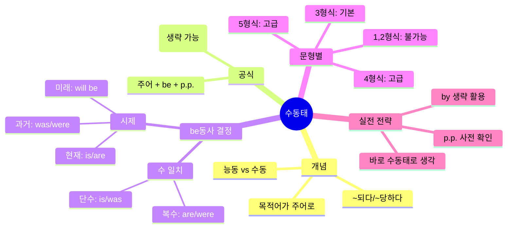

# 수동태 (Passive Voice) 완전정복

> [!quote] 한 줄 핵심
> 수동태는 "~되다/~당하다"를 말할 때 **주어 + be동사 + p.p.** 공식으로, 능동태 변환 없이 바로 말하는 것이 실전의 핵심이다.

---

## 영상 소스

**영상 1: 이나클라쓰 (24분) - 수동태 개념과 문법 구조**
<iframe width="560" height="315" src="https://www.youtube.com/embed/OGtfgQIXIsA" frameborder="0" allowfullscreen></iframe>

**영상 2: 에스텔잉글리쉬 (5분) - 실전 활용과 빠른 말하기**
<iframe width="560" height="315" src="https://www.youtube.com/embed/-n0bLkEVZYw" frameborder="0" allowfullscreen></iframe>

---

## 목차

1. [[#개요]]
2. [[#마인드맵]]
3. [[#Chapter 1 수동태란 무엇인가]]
4. [[#Chapter 2 수동태 만드는 공식]]
5. [[#Chapter 3 시제와 수 일치]]
6. [[#Chapter 4 실전 말하기 전략]]
7. [[#Chapter 5 문형별 수동태]]
8. [[#핵심 패턴 정리]]
9. [[#실전 연습]]
10. [[#용어 사전]]
11. [[#암기 포인트]]
12. [[#셀프테스트]]
13. [[#종합 정리]]
14. [[#보충자료]]
15. [[#내 생각 및 연결]]

---

## 개요

수동태(Passive Voice)는 한국어에 직접적으로 대응되는 표현이 없어 영어 학습자들이 어려워하는 문법이다. 능동태가 "내가 ~을 하다"라면, 수동태는 "~이 되다/당하다"로 행위의 대상이 주어가 되는 구조다. 핵심 공식은 **주어 + be동사 + 과거분사(p.p.)**이며, be동사의 시제는 원래 동사의 시제를, 수는 새로운 주어에 맞춘다. 실전에서는 능동태를 먼저 만들고 변환하는 것이 아니라, "~되다" 느낌이 나면 바로 수동태 구조로 말하는 것이 효율적이다. by + 행위자는 필요한 경우에만 붙이며, 실제 대화에서는 생략하는 경우가 많다.

---

## 마인드맵



---

## Chapter 1: 수동태란 무엇인가

> **난이도:** 🟢 기초

### 1.1 능동태 vs 수동태의 본질

| 구분 | 능동태 (Active) | 수동태 (Passive) |
|------|----------------|-----------------|
| 의미 | 주어가 행동을 함 | 주어가 행동을 당함 |
| 초점 | 행위자 중심 | 대상 중심 |
| 한국어 | ~을/를 하다 | ~이/가 되다, 당하다 |

### 1.2 같은 상황, 다른 시점

**상황:** 차가 고라니를 침

| 시점 | 문장 | 태 |
|------|------|---|
| 운전자 | I hit a deer. (내가 고라니를 쳤다) | 능동 |
| 고라니 | I was hit by a car. (나는 차에 치였다) | 수동 |

> [!tip] 핵심 이해
> 똑같은 사건이라도 누구의 입장에서 말하느냐에 따라 능동/수동이 결정된다.

### 1.3 왜 영어는 수동태를 많이 쓰는가

- 한국어: 대부분 능동태로 표현 ("내가 ~했다")
- 영어: **행위의 대상**이나 **결과**를 강조할 때 수동태 선호
- 행위자가 불분명하거나 중요하지 않을 때 수동태 사용

---

## Chapter 2: 수동태 만드는 공식

> **난이도:** 🟢 기초

### 2.1 3단계 변환 공식

```
능동태 → 수동태 변환

1단계: 목적어 → 주어 자리로
2단계: 동사 → be동사 + p.p.
3단계: 원래 주어 → by + 목적격 (생략 가능)
```

### 2.2 변환 예시

**능동태:** Lions eat rabbits.
```
Lions    eat    rabbits
(주어)  (동사)  (목적어)
  ↓       ↓        ↓
by lions  are eaten  Rabbits
```
**수동태:** Rabbits are eaten by lions.

| 단계 | 능동태 | 수동태 |
|------|--------|--------|
| 원문 | Lions eat rabbits. | - |
| 1단계 | rabbits → 주어 | Rabbits ... |
| 2단계 | eat → be + eaten | Rabbits are eaten ... |
| 3단계 | Lions → by lions | Rabbits are eaten by lions. |

### 2.3 핵심 공식 도식화

```
┌─────────────────────────────────────────┐
│         수동태 = S + be + p.p.          │
│                                         │
│  주어(대상) + be동사 + 과거분사 + (by ~) │
└─────────────────────────────────────────┘
```

---

## Chapter 3: 시제와 수 일치

> **난이도:** 🟡 중급

### 3.1 be동사 결정의 두 가지 기준

| 기준 | 무엇을 따르나 | 예시 |
|------|--------------|------|
| **시제** | 원래 동사의 시제 | ate(과거) → was/were |
| **수** | 새로운 주어의 수 | rabbits(복수) → are/were |

### 3.2 시제별 be동사 변화표

| 시제 | 단수 주어 | 복수 주어 | 예문 |
|------|----------|----------|------|
| 현재 | is | are | A decision **is** made. |
| 과거 | was | were | A decision **was** made. |
| 미래 | will be | will be | A decision **will be** made. |
| 현재진행 | is being | are being | A decision **is being** made. |
| 현재완료 | has been | have been | A decision **has been** made. |

### 3.3 실전 적용 예시

**"결정이 되다" (A decision ~ made)**

| 시제 | 수동태 문장 | 한국어 |
|------|------------|--------|
| 과거 | A decision **was** made. | 결정이 되었다 |
| 현재 | A decision **is** made. | 결정이 된다 |
| 미래 | A decision **will be** made. | 결정이 될 것이다 |

> [!warning] 주의
> be동사의 시제는 원래 동사에서, 수(단수/복수)는 새 주어에서 가져온다. 이 두 가지를 혼동하지 말 것.

---

## Chapter 4: 실전 말하기 전략

> **난이도:** 🟡 중급

### 4.1 핵심 전략: 능동태 변환 없이 바로 수동태로

**비효율적 방법 (X)**
```
한국어 → 능동태 영작 → 수동태 변환 → 말하기
"결정이 됐어" → "Someone made a decision" → "A decision was made" → 발화
```

**효율적 방법 (O)**
```
한국어 → 바로 수동태로 → 말하기
"결정이 됐어" → "A decision was made" → 발화
```

### 4.2 수동태 신호 감지하기

> [!tip] 이런 느낌이 나면 수동태!
> - ~되다 (made, done, decided)
> - ~당하다 (hit, stolen, fired)
> - ~받다 (given, told, offered)
> - ~지다 (broken, fixed, changed)

### 4.3 by 생략의 실제

| 상황 | by 사용 | 예문 |
|------|---------|------|
| 행위자가 중요할 때 | O | This was painted **by Picasso**. |
| 행위자가 불명/불필요 | X | A decision was made. |
| 일반적 사실 | X | English is spoken worldwide. |

**실전 빈도:** by를 붙이는 경우보다 **생략하는 경우가 더 많음**

### 4.4 p.p.(과거분사) 찾는 법

- 규칙 동사: 동사원형 + ed (made, decided, created)
- 불규칙 동사: 암기 필요 (eat-ate-**eaten**, take-took-**taken**)
- 모르면: **네이버 사전**에서 동사 검색 → 3단 변화 확인

---

## Chapter 5: 문형별 수동태

> **난이도:** 🔴 고급

### 5.1 문형과 수동태 가능 여부

| 문형 | 구조 | 목적어 | 수동태 |
|------|------|--------|--------|
| 1형식 | S + V | 없음 | **불가능** |
| 2형식 | S + V + C | 없음 | **불가능** |
| 3형식 | S + V + O | 있음 | **가능** |
| 4형식 | S + V + IO + DO | 2개 | **가능** (고급) |
| 5형식 | S + V + O + OC | 있음 | **가능** (고급) |

### 5.2 왜 1, 2형식은 수동태가 안 되나

```
수동태 = 목적어를 주어로 올리는 것
       ↓
목적어가 없으면 → 올릴 것이 없음 → 수동태 불가
```

**1형식 예:** He runs. → 목적어 없음 → 수동태 불가
**2형식 예:** She is happy. → 보어만 있음 → 수동태 불가

### 5.3 3형식 수동태 (기본)

| 능동태 | 수동태 |
|--------|--------|
| She wrote the book. | The book was written by her. |
| They took a picture. | A picture was taken by them. |

### 5.4 4형식 수동태 (간접목적어/직접목적어)

**능동태:** He gave me a book. (S + V + IO + DO)

| 어떤 목적어를 주어로? | 수동태 |
|---------------------|--------|
| 간접목적어(me) | **I** was given a book (by him). |
| 직접목적어(a book) | **A book** was given to me (by him). |

### 5.5 5형식 수동태

**능동태:** They elected him president. (S + V + O + OC)
**수동태:** He was elected president (by them).

> [!note] 4형식, 5형식 수동태
> 기본 개념을 익힌 후 별도로 심화 학습 권장

---

## 핵심 패턴 정리

### 패턴 1: 기본 수동태

| 패턴 | 구조 | 예문 |
|------|------|------|
| 현재 수동 | S + is/are + p.p. | Coffee **is grown** in Brazil. |
| 과거 수동 | S + was/were + p.p. | The window **was broken**. |
| 미래 수동 | S + will be + p.p. | It **will be done** tomorrow. |

### 패턴 2: 자주 쓰는 수동태 표현

| 한국어 | 영어 패턴 | 예문 |
|--------|----------|------|
| ~이 만들어지다 | be made | Our uniform **was made** in Korea. |
| ~이 찍히다 | be taken | A picture **was taken**. |
| ~이 결정되다 | be decided/made | A decision **will be made**. |
| ~이 완료되다 | be done/completed | The project **is done**. |
| ~에게 주어지다 | be given | A chance **was given** to me. |

### 패턴 3: 시간 표현과 함께

| 시간 표현 | 예문 |
|----------|------|
| by + 시점 | It will be finished **by next week**. |
| in + 기간 | It was built **in 3 months**. |
| 시점 + ago | It was discovered **100 years ago**. |

---

## 실전 연습

### 연습 1: 빈칸 채우기

다음 문장을 수동태로 완성하세요.

1. 이 책은 2020년에 출판되었다.
   → This book _______ _______ in 2020. (publish)

2. 그 회의는 다음 주에 열릴 것이다.
   → The meeting _______ _______ _______ next week. (hold)

3. 이 사진은 파리에서 찍혔다.
   → This picture _______ _______ in Paris. (take)

4. 영어는 전 세계에서 사용된다.
   → English _______ _______ worldwide. (speak)

5. 그 문제는 어제 해결되었다.
   → The problem _______ _______ yesterday. (solve)

<details>
<summary>정답 확인</summary>

1. was published
2. will be held
3. was taken
4. is spoken
5. was solved

</details>

### 연습 2: 능동태 → 수동태 변환

1. Someone stole my wallet.
   → ________________________________

2. They will announce the results tomorrow.
   → ________________________________

3. People speak Spanish in Mexico.
   → ________________________________

<details>
<summary>정답 확인</summary>

1. My wallet was stolen.
2. The results will be announced tomorrow.
3. Spanish is spoken in Mexico.

</details>

### 연습 3: 한국어 → 수동태 영작 (바로 수동태로!)

1. 그 영화는 한국에서 촬영되었다.
2. 우리 유니폼이 이번 달 말까지 만들어질 거야.
3. 그 결정은 아직 내려지지 않았다.

<details>
<summary>정답 확인</summary>

1. The movie was filmed in Korea.
2. Our uniform will be made by the end of this month.
3. The decision hasn't been made yet.

</details>

---

## 용어 사전

| 용어 | 영어 | 설명 |
|------|------|------|
| 수동태 | Passive Voice | 주어가 행위를 당하는 표현 |
| 능동태 | Active Voice | 주어가 행위를 하는 표현 |
| 과거분사 | Past Participle (p.p.) | 동사의 3단 변화 중 세 번째 형태 |
| 목적어 | Object | 동사의 행위 대상 |
| 행위자 | Agent | 행동을 하는 주체 (by 뒤에 옴) |
| 문형 | Sentence Pattern | 문장의 구조적 유형 (1~5형식) |
| 시제 | Tense | 동사가 나타내는 시간 |
| 수 일치 | Number Agreement | 주어의 단수/복수에 동사를 맞춤 |

---

## 암기 포인트

| 중요도 | 내용 |
|--------|------|
| ★★★ | 수동태 공식: **주어 + be동사 + p.p.** |
| ★★★ | be동사 시제는 **원래 동사**에서, 수는 **새 주어**에서 |
| ★★★ | "~되다/당하다" 느낌 → 바로 수동태로 생각 |
| ★★☆ | by + 행위자는 **생략 가능** (실전에선 자주 생략) |
| ★★☆ | 목적어가 없는 1, 2형식은 수동태 **불가능** |
| ★☆☆ | 4형식, 5형식 수동태는 별도 학습 필요 |

---

## 셀프테스트

### Q1. 수동태의 기본 공식은?
<details><summary>정답</summary>
주어 + be동사 + 과거분사(p.p.) + (by 행위자)
</details>

### Q2. "The cake was eaten by Tom."에서 be동사가 'was'인 이유 두 가지는?
<details><summary>정답</summary>
1. 시제: 원래 동사(ate)가 과거이므로 was/were
2. 수: 주어(The cake)가 단수이므로 was
</details>

### Q3. 1형식, 2형식 문장이 수동태가 안 되는 이유는?
<details><summary>정답</summary>
목적어가 없기 때문. 수동태는 목적어를 주어로 올리는 것인데, 올릴 목적어가 없으면 수동태 불가.
</details>

### Q4. "A decision will be made by next week."에서 by next week은 행위자인가?
<details><summary>정답</summary>
아니다. "by next week"은 "다음 주까지"라는 시간 표현이다. 행위자의 by와 시간의 by를 구분해야 한다.
</details>

### Q5. 다음 중 수동태로 바꿀 수 있는 문장은?
a) She is beautiful.
b) He runs fast.
c) They built a house.
<details><summary>정답</summary>
c) They built a house. → A house was built (by them).
a)와 b)는 각각 2형식, 1형식으로 목적어가 없어 수동태 불가.
</details>

### Q6. 실전에서 수동태를 빠르게 말하는 핵심 전략은?
<details><summary>정답</summary>
능동태를 먼저 만들고 변환하지 말고, "~되다/당하다" 느낌이 나면 바로 수동태 구조(S + be + p.p.)로 말한다.
</details>

### Q7. "Our uniform will be made by the end of this month."를 한국어로 옮기면?
<details><summary>정답</summary>
우리 유니폼이 이번 달 말까지 만들어질 거야.
</details>

---

## 종합 정리

```
┌────────────────────────────────────────────────────────┐
│                    수동태 완전정복                       │
├────────────────────────────────────────────────────────┤
│                                                        │
│  1. 개념: 주어가 행동을 당함 (~되다, ~당하다)              │
│                                                        │
│  2. 공식: 주어 + be동사 + p.p. + (by 행위자)             │
│                                                        │
│  3. be동사 결정:                                        │
│     - 시제 → 원래 동사에서                              │
│     - 수 → 새 주어에서                                  │
│                                                        │
│  4. 시제별:                                            │
│     현재: is/are + p.p.                                │
│     과거: was/were + p.p.                              │
│     미래: will be + p.p.                               │
│                                                        │
│  5. 실전 팁:                                           │
│     - 능동태 변환 없이 바로 수동태로 말하기               │
│     - by + 행위자는 필요할 때만                         │
│     - p.p. 모르면 사전 검색                             │
│                                                        │
│  6. 제한:                                              │
│     - 1, 2형식 → 수동태 불가 (목적어 없음)               │
│     - 4, 5형식 → 별도 학습 필요                         │
│                                                        │
└────────────────────────────────────────────────────────┘
```

---

## 보충자료

> [!tip] 온라인 학습 자료
> - [Passive Voice - Ginger Software](https://www.gingersoftware.com/content/grammar-rules/verbs/passive-voice) - 기본 규칙 및 예문
> - [Active vs. Passive Voice - Grammarly](https://www.grammarly.com/blog/sentences/active-vs-passive-voice) - 능동태 vs 수동태 비교
> - [The Passive Voice - UNC Writing Center](https://writingcenter.unc.edu/tips-and-tools/passive-voice) - 학술적 글쓰기에서의 수동태
> - [100 Examples - PlanetSpark](https://www.planetspark.in/english-grammar/100-examples-of-active-and-passive-voice) - 100개 예문 모음

> [!note] 추가 학습 예정
> - 4형식 수동태 심화
> - 5형식 수동태 심화
> - get 수동태 (구어체)
> - 수동태 관용 표현

---

## 내 생각 및 연결

> [!abstract] 메모 공간
>
>
>

### 연결 노트
- [[YT-english-260310-가정법-완전정복|가정법 완전정복]] - 함께 학습하면 좋은 영문법 노트
-
-