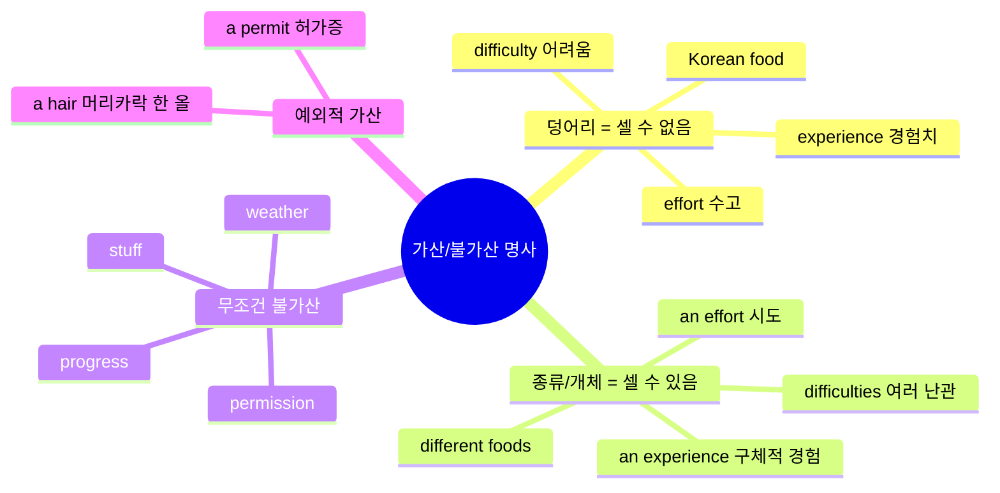
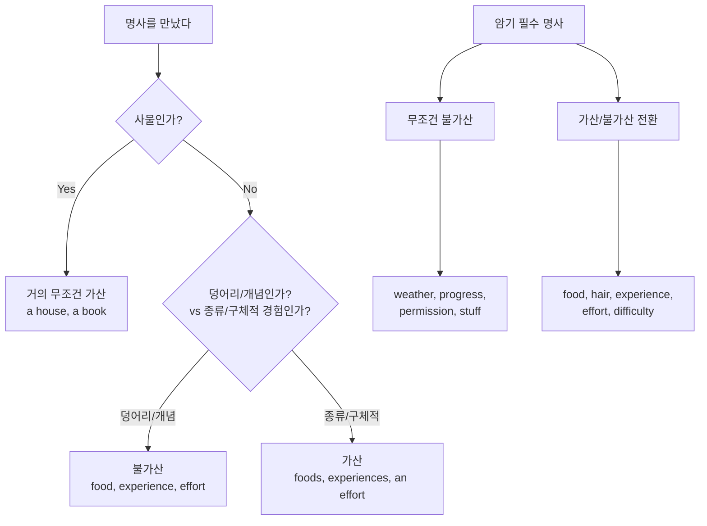

# 가산/불가산 명사 완벽정리 - 셀 수 있고 없고의 기준

> **채널**: 김재우의 영어회화 | **시청일**: 2026-03-18

<iframe width="560" height="315" src="https://www.youtube.com/embed/YkkDDux4qLc" frameborder="0" allowfullscreen></iframe>

---

## 목차

- [[#개요]]
- [[#Chapter 1 가산불가산 명사의 핵심 원리|Chapter 1. 가산/불가산 명사의 핵심 원리]] `🟢 기초`
- [[#Chapter 2 상황에 따라 달라지는 명사들|Chapter 2. 상황에 따라 달라지는 명사들]] `🟡 중급`
- [[#Chapter 3 무조건 암기해야 하는 명사들|Chapter 3. 무조건 암기해야 하는 명사들]] `🔴 심화`
- [[#종합 정리]]
- [[#핵심 표현 카드]]
- [[#용어/문법 사전]]
- [[#학습 체크리스트]]
- [[#보충자료]]
- [[#내 생각 & 연결]]

---

## 개요

> **한 줄 핵심**: "덩어리/개념으로 보면 셀 수 없고, 종류/구체적 경험으로 보면 셀 수 있다"는 원리를 이해하면 가산/불가산 명사를 직관적으로 구분할 수 있다.

한국어에는 가산/불가산의 개념이 희박하여, 한국어 화자는 영어의 단복수와 관사 선택에서 빈번히 실수한다. "Korean food"에는 s가 없는데 "different foods"에는 s가 붙는 이유, "I have experience"와 "I had an experience"의 미묘한 차이 등은 단순 암기로는 해결되지 않는다. 이 영상은 "덩어리(추상적 개념) vs 종류/개체(구체적 사례)"라는 핵심 기준을 제시하여, 같은 단어라도 맥락에 따라 셀 수 있고 없음이 달라지는 원리를 설명한다. 이 규칙은 TOEIC, IELTS 등 시험뿐 아니라 일상 회화와 비즈니스 영어 전반에 걸쳐 매 문장마다 적용되므로, 체득하면 영어의 자연스러움이 크게 향상된다.

### 마인드맵



### 암기 포인트

| 중요도 | 규칙/패턴 | 핵심 | 예문 |
|:------:|----------|------|------|
| ★★★ | 덩어리/개념 = 불가산 | 추상적 총체로 볼 때 | I love Korean food. (O) |
| ★★★ | 종류/개체 = 가산 | 구체적 나열/경험일 때 | different foods, several experiences |
| ★★★ | stuff는 무조건 불가산 | 절대 stuffs 안 됨 | a lot of stuff (O), stuffs (X) |
| ★★☆ | progress는 무조건 불가산 | 절대 progresses 안 됨 | make good progress (O) |
| ★★☆ | permit(허가증) vs permission(허가) | 문서 vs 개념 | a work permit / ask for permission |
| ★☆☆ | hair는 보통 불가산 | 단, 한 올 강조 시 a hair | She has long hair. / I found a hair. |

### 구간 가이드

| 구간 | 챕터 | 난이도 | 주제 |
|------|------|:------:|------|
| 0:00~1:23 | Chapter 1 | 🟢 기초 | 가산/불가산의 핵심 원리 소개 |
| 1:23~7:07 | Chapter 2 | 🟡 중급 | food, weather, hair - 상황별 변화 |
| 7:07~15:25 | Chapter 2 | 🟡 중급 | experience, effort, difficulty, progress |
| 15:25~17:37 | Chapter 3 | 🔴 심화 | permit/permission, stuff - 암기 영역 |

### 이해도 체크

- [ ] "덩어리 vs 종류"라는 핵심 기준을 설명할 수 있다
- [ ] food가 셀 수 있을 때와 없을 때를 구분할 수 있다
- [ ] experience, effort, difficulty의 가산/불가산 기준을 알고 있다

---

## Chapter 1. 가산/불가산 명사의 핵심 원리 `🟢 기초`

<iframe width="560" height="315" src="https://www.youtube.com/embed/YkkDDux4qLc?start=0&end=83" frameborder="0" allowfullscreen></iframe>

### 왜 이게 어려운가

한국어에는 "음식", "경험", "노력" 같은 명사를 셀 수 있는지 없는지 구분하는 문법적 장치가 없다. "나 음식 좋아해"든 "여러 음식 좋아해"든 '음식'이라는 단어 자체는 변하지 않는다. 그러나 영어는 반드시 "food vs foods", "experience vs experiences"를 구분해야 한다. 한국 영어 교육에서는 "셀 수 있으면 복수형, 없으면 단수형"이라고 가르치지만, **같은 단어가 맥락에 따라 셀 수 있기도 하고 없기도 하다**는 점을 제대로 다루지 않는다.

### 핵심 원리: 덩어리 vs 종류

```
┌─────────────────────────────────────────────────┐
│   덩어리(Mass/Concept)로 볼 때 → 셀 수 없음      │
│   종류(Types)/개체(Individual)로 볼 때 → 셀 수 있음 │
└─────────────────────────────────────────────────┘
```

**사물(objects)은 거의 예외 없이 셀 수 있다:**
- a house, a desk, a computer

**추상적 개념/총체는 셀 수 없다:**
- 한국 음식 전체, 경험치, 수고와 노력

**구체적 종류/개별 경험은 셀 수 있다:**
- 여러 종류의 음식, 여행에서 겪은 구체적 경험들

### Chapter 1 이해도 체크

- [x] 사물 명사는 거의 예외 없이 셀 수 있다는 것을 안다 ✅ 2026-03-18
- [x] "덩어리 vs 종류"라는 기준을 한 문장으로 설명할 수 있다 ✅ 2026-03-18

---

## Chapter 2. 상황에 따라 달라지는 명사들 `🟡 중급`

### 2-1. food vs foods

<iframe width="560" height="315" src="https://www.youtube.com/embed/YkkDDux4qLc?start=83&end=295" frameborder="0" allowfullscreen></iframe>

#### 규칙 설명

**food가 불가산일 때 (덩어리):**
- "한국 음식", "패스트푸드"처럼 **하나의 범주 전체**를 가리킬 때
- I love **Korean food**. (한국 음식 전체)
- **Fast food** is not healthy. (패스트푸드 전체)

**food가 가산일 때 (종류):**
- 구체적인 음식 **종류를 나열**할 때
- Allergic reactions can be caused by certain **foods** like eggs, peanuts...
- Different countries have different traditional **foods**.
- You should eat a variety of **foods**.

#### 예문 분석

| ❌ 틀린 표현 | ⭕ 올바른 표현 | 왜? |
|-------------|--------------|-----|
| I love Korean foods | I love Korean food | 한국 음식 전체 = 덩어리 |
| Fast foods is bad | Fast food is bad | 패스트푸드 범주 = 덩어리 |
| Eat a variety of food | Eat a variety of foods | 다양한 종류 = 나열 |

> [!tip] 판단 기준
> "종류를 나열하는 느낌인가?" → Yes면 **foods**
> "하나의 범주 전체인가?" → Yes면 **food**

---

### 2-2. weather

<iframe width="560" height="315" src="https://www.youtube.com/embed/YkkDDux4qLc?start=295&end=332" frameborder="0" allowfullscreen></iframe>

#### 규칙 설명

**weather는 거의 예외 없이 불가산이다.**

| ❌ 틀린 표현 | ⭕ 올바른 표현 |
|-------------|--------------|
| We had a nice weather | We had nice weather |
| The weathers are different | The weather is different |

- "weathers"라는 표현은 거의 사용하지 않는다
- "a nice weather"도 틀림 - 관사 a를 붙이지 않는다

---

### 2-3. hair vs a hair

<iframe width="560" height="315" src="https://www.youtube.com/embed/YkkDDux4qLc?start=332&end=427" frameborder="0" allowfullscreen></iframe>

#### 규칙 설명

**기본적으로 hair는 불가산 (머리 전체):**
- She has long **hair**. (긴 머리를 가지고 있다)
- People with long **hair**... (긴 머리를 한 사람들)

**예외: 머리카락 한 올을 강조할 때 가산:**
- I found **a hair** in my soup! (머리카락 한 올)
- There are **a few grey hairs** on his head. (몇 올의 흰머리)

| 상황 | 표현 | 이유 |
|------|------|------|
| 머리 스타일 | long hair (a 없음) | 머리 전체 |
| 머리카락 발견 | a hair, hairs | 개별 가닥 강조 |

---

### 2-4. experience vs experiences

<iframe width="560" height="315" src="https://www.youtube.com/embed/YkkDDux4qLc?start=427&end=612" frameborder="0" allowfullscreen></iframe>

#### 규칙 설명

**experience가 불가산일 때 (경험치/경력):**
- 어떤 분야에서 쌓은 **총체적 경험, 경력**
- She has a lot of **experience** in marketing. (마케팅 경력)
- I want to get some **experience**. (경험을 쌓다)
- He has a lot of knowledge and **experience**. (지식과 경험)

**experience가 가산일 때 (구체적 경험):**
- **특정 시점에 겪은 개별 경험/사건**
- My trip to Morocco was an unforgettable **experience**. (잊을 수 없는 경험 하나)
- I had several strange **experiences** while traveling alone. (여러 이상한 경험들)

#### 핵심 구분법

```
"경험이 많다/풍부하다" = 경력, 경험치 = 불가산 (experience)
"~한 경험을 했다" = 구체적 사건 = 가산 (an experience, experiences)
```

| ❌ 틀린 표현 | ⭕ 올바른 표현 | 왜? |
|-------------|--------------|-----|
| a lot of experiences in marketing | a lot of experience in marketing | 경력 = 덩어리 |
| I want to get some experiences | I want to get some experience | 경험치 = 덩어리 |
| It was unforgettable experience | It was an unforgettable experience | 구체적 경험 = 개체 |

---

### 2-5. effort vs an effort

<iframe width="560" height="315" src="https://www.youtube.com/embed/YkkDDux4qLc?start=612&end=755" frameborder="0" allowfullscreen></iframe>

#### 규칙 설명

**effort가 불가산일 때 (수고, 노력):**
- **추상적인 수고와 노력** 전체
- It took a lot of **effort** to finish this book. (많은 노력이 들었다)
- *"하 참 많이 고생했죠"*라는 느낌

**effort가 가산일 때 (시도):**
- **구체적인 행동, 시도**
- They made **an effort** to persuade him. (그를 설득하려는 시도)
- Make **an effort** = attempt (시도하다)

#### 핵심 구분법

```
"많은 수고와 노력" = 추상적 개념 = 불가산 (effort)
"~하려는 시도/노력" = 구체적 행동 = 가산 (an effort, efforts)
```

> [!warning] 흔한 실수
> "a lot of efforts"라고 하고 싶지만, 추상적 수고를 말할 땐 **a lot of effort**가 맞다!

---

### 2-6. difficulty vs difficulties

<iframe width="560" height="315" src="https://www.youtube.com/embed/YkkDDux4qLc?start=755&end=886" frameborder="0" allowfullscreen></iframe>

#### 규칙 설명

**difficulty가 불가산일 때 (~하기 어려움):**
- **"~하는 데 어려움을 겪다"** (have difficulty doing)
- I still have **difficulty** speaking English.
- He had **difficulty** breathing. (호흡 곤란)

**difficulty가 가산일 때 (구체적 난관들):**
- **여러 가지 구체적인 어려움, 문제들**
- We had many **difficulties** on the hike. (등반 중 여러 어려움)
- We experienced a lot of **difficulties** in the negotiation.

#### 패턴 구조

```
have difficulty + V-ing  → difficulty 불가산
have difficulties + 전치사구 → difficulties 가산 (구체적 문제들)
```

---

### 2-7. progress vs improvement

<iframe width="560" height="315" src="https://www.youtube.com/embed/YkkDDux4qLc?start=886&end=925" frameborder="0" allowfullscreen></iframe>

#### 규칙 설명

| 단어 | 가산/불가산 | 예문 |
|------|------------|------|
| **progress** | **무조건 불가산** | You are making good **progress** in your English. |
| **improvement** | **가산 가능** | We have seen a lot of **improvements**. |

> [!important] progress는 암기!
> progress는 절대 progresses가 되지 않는다. 외워야 한다.

---

## Chapter 3. 무조건 암기해야 하는 명사들 `🔴 심화`

### 3-1. permit vs permission

<iframe width="560" height="315" src="https://www.youtube.com/embed/YkkDDux4qLc?start=925&end=963" frameborder="0" allowfullscreen></iframe>

#### 규칙 설명

| 단어 | 가산/불가산 | 의미 | 예문 |
|------|------------|------|------|
| **permit** | **가산** | 허가증 (문서) | He got **a work permit**. |
| **permission** | **불가산** | 허가 (개념) | We applied for **permission** to build. |

> permit은 실물 문서이므로 셀 수 있고, permission은 추상적 허락이므로 셀 수 없다.

---

### 3-2. stuff - 절대 불가산

<iframe width="560" height="315" src="https://www.youtube.com/embed/YkkDDux4qLc?start=963&end=1057" frameborder="0" allowfullscreen></iframe>

#### 규칙 설명

**stuff는 어떤 경우에도 복수형이 되지 않는다!**

| ❌ 틀린 표현 | ⭕ 올바른 표현 |
|-------------|--------------|
| a lot of stuffs | a lot of **stuff** |
| many stuffs | a lot of **stuff** |
| These stuffs | This **stuff** |

- stuff = 여러 가지 것들 (이미 복수 개념을 내포)
- "stuffs"는 존재하지 않는 형태

---

## 종합 정리



### 핵심 원리 3줄 요약

1. **덩어리(범주 전체, 추상적 개념)** → 불가산
2. **종류 나열, 구체적 경험/시도** → 가산
3. **weather, progress, stuff, permission** → 무조건 암기 (불가산)

---

## 핵심 표현 카드

> **Expression 1**: a lot of experience
> **Meaning**: 많은 경험/경력 (총체적)
> **Example**: *She has a lot of experience in teaching.*
> **Note**: experiences (X) - 경력을 말할 때는 불가산

> **Expression 2**: an unforgettable experience
> **Meaning**: 잊을 수 없는 경험 (구체적 사건)
> **Example**: *My trip to Japan was an unforgettable experience.*
> **Note**: 구체적 경험은 a/an + experience

> **Expression 3**: make an effort
> **Meaning**: 노력하다, 시도하다 (구체적 행동)
> **Example**: *Please make an effort to arrive on time.*
> **Note**: effort = attempt일 때는 가산

> **Expression 4**: a lot of effort
> **Meaning**: 많은 수고와 노력 (추상적)
> **Example**: *It took a lot of effort to complete this project.*
> **Note**: efforts (X) - 추상적 노력은 불가산

> **Expression 5**: have difficulty doing
> **Meaning**: ~하는 데 어려움을 겪다
> **Example**: *I have difficulty understanding his accent.*
> **Note**: difficulty + V-ing 패턴에서는 불가산

---

## 용어/문법 사전

| 용어 | 설명 | 예문 |
|------|------|------|
| 가산명사 (Countable noun) | 개수를 셀 수 있는 명사. a/an, 복수형 -s 사용 가능 | a book, two books |
| 불가산명사 (Uncountable noun) | 셀 수 없는 명사. a/an 불가, 복수형 없음 | water, information, advice |
| 덩어리 개념 | 범주 전체, 추상적 총체를 가리킬 때 | Korean food, fast food |
| 종류/개체 개념 | 구체적 종류나 개별 사례를 나열할 때 | different foods, several experiences |

---

## 학습 체크리스트

**연습** — 직접 만들어봐야 내 것이 된다

- [x] "food"를 사용한 문장 3개 작성 (불가산 2개, 가산 1개) ✅ 2026-03-18
- [x] "experience"를 사용한 문장 3개 작성 (불가산 2개, 가산 1개) ✅ 2026-03-18
- [x] "effort", "difficulty" 각각 불가산/가산 예문 1개씩 작성 ✅ 2026-03-18
- [x] 실제 대화에서 위 단어들을 올바르게 1회 이상 사용해보기 ✅ 2026-03-18

**셀프 테스트** — 노트를 가리고 답해보기

- [x] Q: food가 가산이 되는 경우는? ✅ 2026-03-18
- [x] Q: experience가 불가산이 되는 경우는? ✅ 2026-03-18
- [ ] Q: effort vs an effort의 차이는?
- [ ] Q: stuff의 복수형은?
- [ ] Q: progress의 복수형은?

**최종 점검**

- [ ] 암기 포인트 ★★★ 항목을 보지 않고 예문과 함께 말할 수 있다
- [ ] "덩어리 vs 종류"라는 핵심 기준을 직접 설명할 수 있다
- [ ] 1차 복습 완료 (+1일: 2026-03-19)
- [ ] 2차 복습 완료 (+7일: 2026-03-25)
- [ ] 3차 복습 완료 (+30일: 2026-04-17)

---

## 보충자료

| 자료 | 유형 | 왜 읽어야 하는지 |
|------|------|-----------------|
| [Cambridge Dictionary - Countable/Uncountable](https://dictionary.cambridge.org/grammar/british-grammar/nouns-countable-and-uncountable) | 문법서 | 가산/불가산 명사의 공식 문법 규칙 상세 설명 |
| [EnglishCurrent - Experience vs Experiences](https://www.englishcurrent.com/grammar/experiences-experience/) | 문법 아티클 | experience의 가산/불가산 상세 설명 |
| [Oxford Learner's Dictionary - effort](https://www.oxfordlearnersdictionaries.com/us/definition/english/effort) | 사전 | effort의 가산/불가산 용법과 예문 |
| [Mastering Grammar - Hair](https://www.masteringgrammar.com/2025/02/hair-countable-or-uncountable.html) | 문법 아티클 | hair의 가산/불가산 상황별 정리 |

---

## 내 생각 & 연결

**가장 큰 깨달음**: "덩어리 vs 종류"라는 기준으로 같은 단어의 가산/불가산이 결정된다는 것. 단순히 "이 단어는 불가산"이라고 암기하는 것이 아니라, **맥락에 따라 달라진다**는 원리를 이해했다.

**내 약점과의 연결**: experience, effort 같은 단어에서 자주 틀렸는데, "경력/수고 = 불가산", "구체적 경험/시도 = 가산"이라는 기준을 알게 되어 앞으로 더 정확하게 사용할 수 있을 것 같다.

**기존 지식과의 연결:**
- [[YT-english-260315-명사의세계-한정사-관사-완전정복]] — 한정사(a/an, the)와 가산/불가산은 긴밀히 연결됨. 불가산 명사에는 a/an을 붙이지 않는다는 규칙과 연결

**다음에 탐구할 것:**
- 관사(a, the, 무관사)와 가산/불가산의 관계를 더 깊이 파고들기
- information, advice, news 같은 불가산 명사 추가 학습
