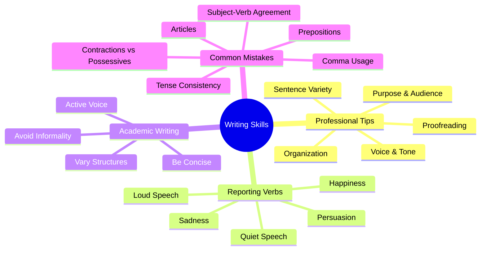
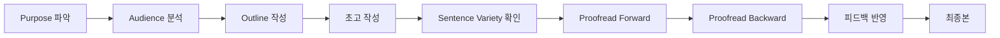

# Writing Skills 완전정복: Professional, Academic, Descriptive Writing

> **채널**: Interactive English | **시청일**: 2026-03-19

<iframe width="560" height="315" src="https://www.youtube.com/embed/gFXE9n7hrOI" frameborder="0" allowfullscreen></iframe>

---

## 목차

- [[#개요]]
- [[#Chapter 1 Professional Writing Tips|Chapter 1. Professional Writing Tips]] `🟢 기초`
- [[#Chapter 2 Reporting Verbs|Chapter 2. Reporting Verbs - said 대체 동사]] `🟡 중급`
- [[#Chapter 3 Academic Writing|Chapter 3. Academic Writing 원칙]] `🟡 중급`
- [[#Chapter 4 Common Mistakes|Chapter 4. Common Writing Mistakes]] `🔴 심화`
- [[#종합 정리]]
- [[#핵심 표현 카드]]
- [[#용어/문법 사전]]
- [[#학습 체크리스트]]
- [[#보충자료]]
- [[#내 생각 & 연결]]

---

## 개요

> **한 줄 핵심**: 전문적인 글쓰기는 **목적 이해 → 아웃라인 구성 → 문장 다양화 → 철저한 교정**의 순환적 과정이며, reporting verbs로 묘사력을, 간결성으로 학술적 품격을 높인다.

이 영상은 1시간 분량의 종합 Writing 레슨으로, Professional Writing Tips(13가지), Reporting Verbs(30개 이상), Academic Writing 원칙(7가지), Common Mistakes(8가지 카테고리)를 다룬다. 한국어 화자는 주어-동사 일치, 관사 사용, 시제 일관성에서 L1 간섭으로 인한 오류를 자주 범하며, 특히 "said"만 반복 사용하여 글이 단조로워지는 문제가 있다. 이 레슨을 익히면 비즈니스 이메일, 학술 논문, 스토리텔링 모든 영역에서 더 professional하고 engaging한 글을 쓸 수 있다. Interactive English의 Wes 강사가 실제 교정 사례와 함께 실전적인 팁을 제공한다.

### 마인드맵



### 암기 포인트

| 중요도 | 규칙/패턴 | 핵심 | 예문 |
|:------:|----------|------|------|
| ★★★ | Be Concise | -tion 명사 → 동사로 | *The report explained* (not "provided an explanation") |
| ★★★ | Vary Sentence Structures | simple/compound/complex 혼합 | 4가지 구조를 섞어 rhythm 생성 |
| ★★★ | Active Voice 우선 | 주어가 행동 명시 | *Archaeologists conducted* (not "was conducted") |
| ★★☆ | Reporting Verbs | said 대신 감정 동사 | *pleaded, insisted, whispered* |
| ★★☆ | Proofread Backward | 텍스트에 집중 | 마지막 문장부터 거꾸로 읽기 |
| ★☆☆ | Transition Words 다양화 | also 반복 피하기 | *in addition, furthermore, moreover* |

### 구간 가이드

| 구간 | 챕터 | 난이도 | 주제 |
|------|------|:------:|------|
| 0:00~14:00 | Chapter 1 | 🟢 기초 | Professional Writing 13 Tips |
| 14:00~28:00 | Chapter 2 | 🟡 중급 | Reporting Verbs (30+ 동사) |
| 28:00~40:00 | Chapter 3 | 🟡 중급 | Academic Writing 원칙 |
| 40:00~60:00 | Chapter 4 | 🔴 심화 | Common Mistakes 8가지 |

### 이해도 체크

- [ ] 개요를 읽고 이 영상의 4대 학습 영역을 설명할 수 있다
- [ ] 마인드맵의 각 분기가 무엇을 의미하는지 이해했다
- [ ] 암기 포인트의 ★★★ 항목을 보지 않고 예문과 함께 말할 수 있다

---

## Chapter 1. Professional Writing Tips `🟢 기초`

<iframe width="560" height="315" src="https://www.youtube.com/embed/gFXE9n7hrOI?start=0&end=840" frameborder="0" allowfullscreen></iframe>

### 왜 이게 어려운가

한국어는 주제 중심(topic-prominent) 언어로, 영어처럼 명확한 subject-verb 구조를 요구하지 않는다. 또한 한국 영어 교육에서는 "문법적으로 맞는 문장"에 집중하지만, 실제 professional writing은 **목적, 청중, 톤의 일관성**이 더 중요하다. "좋은 글 = 긴 글"이라는 오해도 있는데, 실제로는 간결하고 조직된 글이 더 효과적이다.

### 규칙 설명

**13가지 Professional Writing Tips:**

1. **Understand Your Purpose**: 4가지 유형 - narrative(스토리), descriptive(묘사), expository(정보 전달), persuasive(설득)
2. **Know Your Audience**: 상사, 교수, 동료, 대중 → formal vs informal 스타일 결정
3. **Organize Your Ideas**: 브레인스토밍 → comprehensive outline (단어가 아닌 complete thoughts)
4. **Find Your Voice**: 당신만의 fingerprint - 남이 쓸 법한 글이 아닌, 당신다운 글
5. **Establish Tone**: aggressive, humorous, nostalgic, cheerful, sad 중 일관성 유지
6. **Organize Paragraphs**: topic sentence → supporting sentences → conclusion
7. **Use Transition Words**: *in addition, however, first and foremost*
8. **Vary Sentence Structures**: simple, compound, complex, compound-complex 혼합
9. **Keep It Simple**: 초고에서는 아는 어휘 사용, 나중에 fine-tune
10. **Proofread Effectively**: 한 번에 한 종류의 실수만 찾기 (punctuation → spelling → word choice)
11. **Get Others to Review**: 제2의 눈이 필요하지만, 피드백은 선택적 수용
12. **Read Regularly**: 다른 스타일 학습, transition words 사용법 관찰
13. **Write Regularly**: 매일 저널링으로 voice 개발

### 패턴 구조

**Cohesion vs Unity:**
```
Cohesion = 문장들이 논리적으로 연결됨
Unity = 각 문단이 하나의 아이디어 중심
```

**4가지 문장 구조:**
```
Simple:           S + V
Compound:         S + V, and/but/so S + V
Complex:          After S + V, S + V
Compound-Complex: When S + V, S + V, and S + V
```

### 예문 분석

**문장 구조 스토리 예시:**

| 유형 | 영어 | 포인트 |
|------|------|--------|
| Simple | I woke up late this morning. | 1 independent clause |
| Compound | I went to the kitchen, and I made coffee. | 2 independent clauses |
| Complex | After I finished my coffee, I got ready. | 1 independent + 1 dependent |
| Compound-Complex | When I looked at my watch, I realized I was late, so I ran out. | 2 independent + 1 dependent |

**Choppy Writing의 문제:**

| ❌ 단조로운 글 (Simple만 사용) | ⭕ 리듬 있는 글 |
|------------------------------|----------------|
| I woke up. I went to the kitchen. I made coffee. I got ready. | I woke up late. I went to the kitchen and made coffee. After finishing, I got ready for work. |

### Chapter 1 이해도 체크

- [ ] 4가지 writing purpose를 구분할 수 있다
- [ ] cohesion과 unity의 차이를 설명할 수 있다
- [ ] 4가지 문장 구조의 공식을 쓸 수 있다
- [ ] proofread forward와 backward의 목적 차이를 안다

---

## Chapter 2. Reporting Verbs - said 대체 동사 `🟡 중급`

<iframe width="560" height="315" src="https://www.youtube.com/embed/gFXE9n7hrOI?start=840&end=1680" frameborder="0" allowfullscreen></iframe>

### 왜 이게 어려운가

한국어에서 "~라고 했다"는 거의 유일한 인용 표현이지만, 영어는 화자의 감정, 말투, 상황에 따라 수십 가지 reporting verb를 구분한다. 한국 영어 교육에서는 said, told, asked 정도만 배우기 때문에, 실제 writing에서 같은 단어가 반복되어 **redundancy** 문제가 발생한다.

### 규칙 설명

Reporting verbs는 대화의 **감정**과 **강도**를 전달한다. 올바른 동사 선택으로 독자에게 상황을 보여줄 수 있다.

**사용 이유:**
1. More descriptive - 감정과 뉘앙스 전달
2. Keep reader's attention - 다양성으로 흥미 유지
3. Avoid redundancies - he said, she said 반복 방지

### 패턴 구조

```
기본:      "[Quote]," S + reporting verb.
도치:      Reporting verb + S, "[Quote]."
```

### Reporting Verbs 완전정리

#### 1. 설득/요청 (Persuasion)

| 동사 | 의미 | 강도 | 예문 |
|------|------|:----:|------|
| **pleaded** | 간청하다 | ★★☆ | "Don't leave," he **pleaded**. |
| **begged** | 애원하다 | ★★★ | "I want a balloon," the child **begged**. |
| **intreated** | 설득하려 애쓰다 | ★★☆ | "I'll work your shift," he **intreated**. |
| **implored** | 진심으로 호소하다 | ★★★ | "Please don't give me a ticket," she **implored**. |
| **beseeched** | 간절히 구하다 | ★★☆ | "I need this raise," he **beseeched**. |
| **cajoled** | 구슬리다 | ★★☆ | "Please, pretty please," she **cajoled**. |
| **insisted** | 주장하다 | ★★★ | "I want to see my client," the lawyer **insisted**. |
| **demanded** | 요구하다 | ★★★ | "I want another candy," the child **demanded**. |

#### 2. 기쁨/흥분 (Happiness)

| 동사 | 의미 | 뉘앙스 | 예문 |
|------|------|--------|------|
| **gushed** | 과하게 칭찬하다 | 과잉, 약간 insincere | "You look amazing," he **gushed**. |
| **cheered** | 환호하다 | 응원, 격려 | "We won!" she **cheered**. |
| **touted** | 선전하다 | 반복적 칭찬 | "You won't find another car like this," the salesman **touted**. |
| **laughed** | 웃으며 말하다 | 유머 상황 | "I knew it was you," she **laughed**. |
| **chortled** | 만족스럽게 웃다 | 드문 단어 | "Did you hear the news?" she **chortled**. |
| **giggled** | 킥킥거리다 | 통제 안 되는 웃음 | "Where did you get that hat?" he **giggled**. |
| **proclaimed** | 공표하다 | 공식 발표 | "This is a new beginning," he **proclaimed**. |
| **announced** | 알리다 | 뉴스 전달 | "We got engaged!" she **announced**. |
| **declared** | 선언하다 | 명확, 공개적 | "We made it to the finals," the coach **declared**. |

#### 3. 슬픔/불만 (Sadness)

| 동사 | 의미 | 뉘앙스 | 예문 |
|------|------|--------|------|
| **pouted** | 삐지다 | 아랫입술 내밀기 | "I want ice cream," the child **pouted**. |
| **complained** | 불평하다 | 가장 일반적 | "We don't want to work weekends," they **complained**. |
| **sobbed** | 흐느끼다 | 깊은 숨과 함께 울음 | "It's been destroyed," she **sobbed**. |
| **cried** | 울다 | 눈물 동반 | "She told me it was over," he **cried**. |
| **lamented** | 한탄하다 | 후회 포함 | "I should never have accepted," he **lamented**. |
| **sneered** | 비웃다 | 무례함 | "Is that the best you can do?" she **sneered**. |
| **whined** | 징징거리다 | 길고 높은 목소리 | "My ice cream melted," the boy **whined**. |
| **bemoaned** | 탄식하다 | 슬픔 표현 | "We have to lay people off," the manager **bemoaned**. |

#### 4. 큰 소리 (Loud Speech)

| 동사 | 의미 | 상황 | 예문 |
|------|------|------|------|
| **shouted** | 소리치다 | 시끄러운 환경 | "We won!" they **shouted**. |
| **exclaimed** | 외치다 | 놀람/기쁨 | "That's not fair!" she **exclaimed**. |
| **bellowed** | 고함치다 | 아주 큰 목소리 | "Who's there?" he **bellowed**. |
| **yelled** | 고함치다 | 분노/흥분 | "Get out!" she **yelled**. |
| **screamed** | 비명 지르다 | 공포/긴급 | "Help us!" they **screamed**. |
| **hollered** | 크게 부르다 | 주의 끌기 | "Pass me the ball!" he **hollered**. |

#### 5. 작은 소리 (Quiet Speech)

| 동사 | 의미 | 뉘앙스 | 예문 |
|------|------|--------|------|
| **murmured** | 속삭이다 | 수줍음, 부드러움 | "I love you," the boy **murmured**. |
| **muttered** | 중얼거리다 | 들리기 싫어서 | "You're the lazy one," the student **muttered**. |
| **mumbled** | 우물거리다 | 불분명, trailing off | "I can't believe they..." he **mumbled**. |
| **whispered** | 속삭이다 | 비밀, 가까운 사람만 | "Don't tell anyone," she **whispered**. |

> [!tip] muttered vs mumbled
> - **muttered**: 일부러 안 들리게 (의도적)
> - **mumbled**: 말이 흐려져서 안 들림 (비의도적)

### Chapter 2 이해도 체크

- [ ] 5가지 카테고리별 대표 동사 2개씩 말할 수 있다
- [ ] gushed와 cheered의 뉘앙스 차이를 설명할 수 있다
- [ ] muttered와 mumbled의 차이를 안다
- [ ] 자신의 글에서 said를 3가지 다른 동사로 바꿀 수 있다

---

## Chapter 3. Academic Writing 원칙 `🟡 중급`

<iframe width="560" height="315" src="https://www.youtube.com/embed/gFXE9n7hrOI?start=1680&end=2400" frameborder="0" allowfullscreen></iframe>

### 왜 이게 어려운가

한국 학생들은 "어려운 단어 = 학술적"이라고 오해한다. 실제로 academic writing의 핵심은 **간결성(conciseness)**이다. 또한 구어체 표현(gonna, wanna)과 idiom(piece of cake)이 격식체 글에 섞이는 실수가 많다.

### 규칙 설명

**Academic Writing 7대 원칙:**

#### 1. Be Concise
- **-tion 명사 → 동사로 변환**
- 10단어로 할 말을 5단어로

| ❌ 장황한 표현 | ⭕ 간결한 표현 |
|--------------|--------------|
| The report provided an **explanation** | The report **explained** |
| We made a **decision** to | We **decided** to |

#### 2. Organize Your Paper
- 아웃라인 없이 쓰면 **ideas overlap**, main thesis에서 이탈
- 시간이 없어도 5분 투자해서 outline 작성

#### 3. Avoid Contractions, Idioms, Colloquial Expressions

| ❌ 비격식 | ⭕ 격식 |
|---------|--------|
| it's | it is |
| could've | could have |
| put up with | endure, tolerate |
| check out | view, consult |
| piece of cake | simple, straightforward |
| no biggie | not a problem |
| gonna | going to |

#### 4. Vary Sentence Structures
- Simple만 쓰면 **choppy** (아동 도서처럼)
- 4가지 구조 혼합으로 rhythm과 flow 생성

#### 5. Use Active Voice
- Active: 9단어 → Passive: 11단어
- 누가 행동했는지 명확

| Voice | 예문 | 단어 수 |
|-------|------|:------:|
| Active | Archaeologists conducted a study. | 9 |
| Passive | A study was conducted by archaeologists. | 11 |

#### 6. Avoid Repetition
- **also** 반복 대신: *in addition, furthermore, moreover, besides*
- 정밀한 어휘 선택

#### 7. Proofread
- **Forward reading**: rhythm, flow, logical order 확인
- **Backward reading**: 문법, 철자, 구두점 집중 (아이디어가 아닌 텍스트 자체)

### Chapter 3 이해도 체크

- [ ] -tion 명사를 동사로 바꾸는 3가지 예를 들 수 있다
- [ ] informal language 5가지와 formal 대체어를 안다
- [ ] active voice가 더 효과적인 이유를 설명할 수 있다
- [ ] forward vs backward proofreading의 목적을 구분한다

---

## Chapter 4. Common Writing Mistakes `🔴 심화`

<iframe width="560" height="315" src="https://www.youtube.com/embed/gFXE9n7hrOI?start=2400&end=3600" frameborder="0" allowfullscreen></iframe>

### 8가지 Common Mistakes 카테고리

#### 1. Subject-Verb Agreement

| ❌ 틀린 문장 | ⭕ 올바른 문장 | 규칙 |
|-------------|--------------|------|
| Neither John nor Mary **are** at school. | Neither John nor Mary **is** at school. | neither/nor + 단수 주어 → 단수 동사 |
| A friend who always **ask** for help. | A friend who always **asks** for help. | who의 선행사가 단수면 단수 동사 |
| He **don't** need my help. | He **doesn't** need my help. | he/she + doesn't |

#### 2. Contractions vs Possessives

| 혼동 쌍 | Contraction | Possessive |
|--------|-------------|------------|
| you're / your | you're = you are | your = 너의 |
| it's / its | it's = it is/has | its = 그것의 |
| there's / theirs | there's = there is | theirs = 그들의 것 |

#### 3. Article Misuse

| ❌ 틀린 표현 | ⭕ 올바른 표현 | 규칙 |
|-------------|--------------|------|
| I check weather forecast. | I check **the** weather forecast. | 특정 대상 → the |
| I brought **a** umbrella. | I brought **an** umbrella. | 모음 소리 앞 → an |
| We visited **the** Yosemite Park. | We visited Yosemite Park. | 고유명사 → 무관사 |

#### 4. Wrong Prepositions

| ❌ 틀린 조합 | ⭕ 올바른 조합 | 패턴 |
|-------------|--------------|------|
| interested **with** | interested **in** | interested + in |
| good **in** math | good **at** math | good + at |
| depends **to** | depends **on** | depend + on |

> [!tip] Ngram Viewer로 확인
> [Google Ngram Viewer](https://books.google.com/ngrams/)에서 "good at" vs "good in" 빈도 비교 가능

#### 5. Tense Consistency

**시간 표시어에 주목:**

| 시간 표시어 | 시제 | 예문 |
|------------|------|------|
| every day, usually | Present Simple | I **get up** and **go** for a run. |
| yesterday, last week | Past Simple | Yesterday, I **decided** to jog. |
| tomorrow, next week | Future | Tomorrow, I **will** do it again. |

#### 6. Comma Misuse

| 상황 | 규칙 | 예문 |
|------|------|------|
| 부사구 뒤 | comma 필수 | **After going to the dentist,** I learned... |
| 인용 전 | comma 필수 | The dentist said**,** "You need to..." |
| 등위접속사 전 | comma 필수 | I floss regularly**,** and I come in for cleaning. |

#### 7. Wrong Word Choice / Collocations

| ❌ 틀린 조합 | ⭕ 올바른 조합 | 이유 |
|-------------|--------------|------|
| **purchase** time | **buy** time | 고정 표현 (delay의 의미) |
| **make** a presentation | **give** a presentation | give = 발표하다 |
| negative **affect** | negative **effect** | effect = 명사, affect = 동사 |

#### 8. Informal Language in Formal Writing

**"Dear Sir or Madam"이 보이면 = 격식체**

| ❌ 비격식 | ⭕ 격식 |
|---------|--------|
| in the nick of time | before the deadline |
| a piece of cake | straightforward |
| gonna | going to |

### Chapter 4 이해도 체크

- [ ] 8가지 mistake 카테고리를 모두 나열할 수 있다
- [ ] neither/nor 주어-동사 일치 규칙을 안다
- [ ] it's vs its를 구분할 수 있다
- [ ] effect vs affect를 구분할 수 있다
- [ ] comma가 필요한 3가지 상황을 안다

---

## 종합 정리

이 레슨의 핵심은 **계층적 접근**이다:

1. **Big Picture** (Chapter 1): Purpose → Audience → Style 결정
2. **Descriptive Power** (Chapter 2): Reporting verbs로 감정과 뉘앙스 전달
3. **Academic Rigor** (Chapter 3): Conciseness, formality, active voice
4. **Error Elimination** (Chapter 4): 8가지 common mistake 방지

Professional writing은 화려한 어휘가 아니라 **명확한 구조, 다양한 문장, 일관된 톤**에서 나온다. Academic writing은 **간결성**이 핵심이며, informal 표현을 철저히 배제해야 한다.



---

## 핵심 표현 카드

> **Expression 1**: pleaded / begged / implored
> **Meaning**: 간절히 요청하다 (강도: begged > implored > pleaded)
> **Example**: *"Don't leave," he pleaded.*
> **Note**: 감정적 상황에서 said 대신 사용

> **Expression 2**: murmured / whispered
> **Meaning**: 작은 목소리로 말하다
> **Example**: *"I love you," he murmured.*
> **Note**: murmured는 수줍음, whispered는 비밀

> **Expression 3**: in addition / furthermore / moreover
> **Meaning**: 또한, 게다가
> **Example**: *The crisis caused damage. Furthermore, banks tightened lending.*
> **Note**: also의 격식체 대체어

> **Expression 4**: be concise
> **Meaning**: 간결하게 쓰다 (-tion → 동사)
> **Example**: *The report explained* (not "provided an explanation")
> **Note**: 10단어 → 5단어로 줄이기

---

## 용어/문법 사전

| 용어 | 설명 | 예문 |
|------|------|------|
| Cohesion | 문장들이 논리적으로 연결됨 | Good cohesion helps readers follow. |
| Unity | 각 문단이 하나의 아이디어 중심 | Each paragraph maintains unity. |
| Voice (writing) | 글쓴이 고유의 스타일 | Her voice was distinctive. |
| Tone | 주제에 대한 태도 (cheerful, aggressive 등) | The tone was nostalgic. |
| Choppy writing | 짧은 문장만 반복되어 끊기는 글 | Too many simple sentences sound choppy. |
| Reporting verb | 인용문 앞에 오는 동사 (said 대체) | *pleaded, insisted, whispered* |
| Colloquial expression | 구어체 표현 | "no biggie", "gonna" |
| Contraction | 축약형 | it's = it is |

---

## 학습 체크리스트

**연습** — 직접 만들어봐야 내 것이 된다

- [ ] said를 사용한 문장 5개를 reporting verbs로 바꿔보기
- [ ] -tion 명사가 있는 문장 3개를 concise하게 고쳐보기
- [ ] 4가지 문장 구조를 모두 사용한 짧은 스토리 쓰기
- [ ] informal 표현이 있는 이메일을 formal하게 고쳐보기

**셀프 테스트** — 노트를 가리고 답해보기

- [ ] Q: Professional writing의 13 tips 중 가장 중요한 3가지는?
- [ ] Q: Reporting verbs 5가지 카테고리는?
- [ ] Q: Academic writing에서 피해야 할 3가지 informal 요소는?
- [ ] Q: effect vs affect 차이는?
- [ ] Q: Proofread forward vs backward의 목적 차이는?

**최종 점검**

- [ ] 모든 챕터의 이해도 체크를 완료했다
- [ ] 암기 포인트 ★★★ 항목을 보지 않고 예문과 함께 말할 수 있다
- [ ] 핵심 표현 카드를 보지 않고 의미와 예문을 말할 수 있다
- [ ] 종합 정리의 플로우차트를 직접 그릴 수 있다
- [ ] 1차 복습 완료 (2026-03-20)
- [ ] 2차 복습 완료 (2026-03-26)
- [ ] 3차 복습 완료 (2026-04-18)

---

## 보충자료

| 자료 | 유형 | 왜 읽어야 하는지 |
|------|------|-----------------|
| [35 Reporting Verbs - My Lingua Academy](https://myenglishteacher.co.uk/2024/12/24/35-reporting-verbs-in-english/) | 문법 가이드 | Cambridge 시험에서 reporting verbs 활용법 |
| [Sentence Structures - EnglishCurrent](https://www.englishcurrent.com/grammar/sentence-structures-simple-compound-complex-compound-complex/) | 문법 설명 | 4가지 문장 구조 연습 문제 포함 |
| [270+ Words for Said - Reedsy](https://reedsy.com/blog/guide/how-to-write-dialogue/other-words-for-said/) | 어휘 참고 | 270개 이상의 said 대체어 목록 |
| [Perfect English Grammar - Reporting Verbs](https://www.perfect-english-grammar.com/reporting-verbs.html) | 문법서 | Reporting verbs 패턴(verb + to/gerund) 상세 |

---

## 내 생각 & 연결

**가장 큰 깨달음**: "said"만 반복 사용하던 습관을 버리고, 감정과 상황에 맞는 reporting verb를 선택하면 글의 품격이 확 달라진다. 또한 academic writing에서 간결함이 핵심이라는 점 - 어려운 단어가 아니라 간결한 문장이 professional함.

**내 약점과의 연결**: 한국어로 생각하고 영어로 번역하는 습관 때문에 관사, 전치사, 시제에서 자주 실수한다. 특히 "interested with"처럼 한국어 조사를 영어 전치사로 직역하는 오류.

**기존 지식과의 연결:**
- [[YT-english-260305-전치사-접근법-기초-1편]] — 전치사 선택의 원리와 연결
- [[YT-english-260312-Global-Warming-Essay-Writing]] — Academic writing 실전 적용

**다음에 탐구할 것:**
- Reporting verbs의 verb pattern (+ to infinitive vs + gerund) 깊이 파기
- Passive voice가 더 적절한 academic context 연구