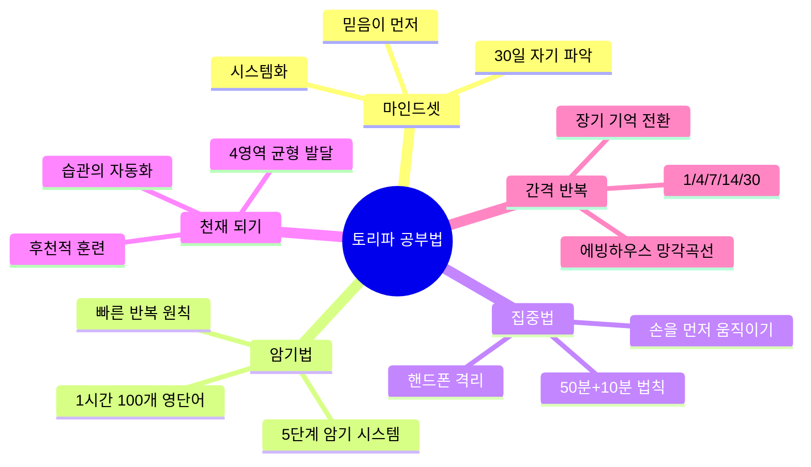
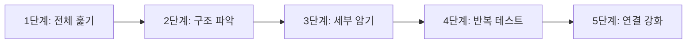
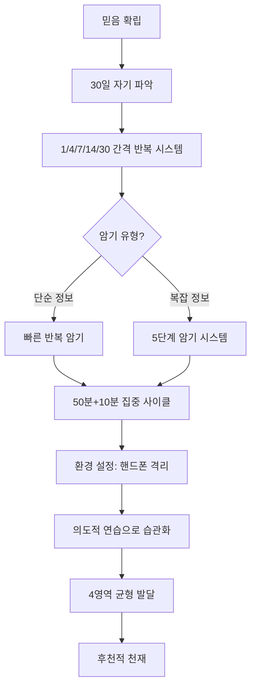

# 토리파 공부법 종합: 평범한 사람이 천재가 되는 시스템

> **채널**: 이상욱의 진료실 밖 처방전 | **시청일**: 2026-03-10

<iframe width="560" height="315" src="https://www.youtube.com/embed/TWBlwqYoDpc" frameborder="0" allowfullscreen></iframe>

---

## 목차

- [[#개요]]
- [[#Chapter 1 마인드셋 확립하기|Chapter 1. 마인드셋 확립하기]] `🟢 기초`
- [[#Chapter 2 한 시간에 영단어 100개 암기법|Chapter 2. 한 시간에 영단어 100개 암기법]] `🟡 중급`
- [[#Chapter 3 암기력을 끌어올리는 5단계 시스템|Chapter 3. 암기력을 끌어올리는 5단계 시스템]] `🔴 심화`
- [[#Chapter 4 잡생각 없이 집중하는 방법|Chapter 4. 잡생각 없이 집중하는 방법]] `🟡 중급`
- [[#Chapter 5 후천적 천재 되기|Chapter 5. 후천적 천재 되기]] `🔴 심화`
- [[#Chapter 6 의사를 만든 4가지 영역 균형|Chapter 6. 의사를 만든 4가지 영역 균형]] `🔴 심화`
- [[#종합 정리]]
- [[#용어 사전]]
- [[#학습 체크리스트]]
- [[#보충자료]]
- [[#내 생각 & 연결]]

---

## 개요

> **한 줄 핵심**: 천재는 타고나는 것이 아니라 **시스템(간격 반복 + 의도적 연습)과 믿음**으로 만들어진다.

토리파(이상욱)는 의사이자 770만 조회수를 기록한 공부법 유튜버다. 그는 자신이 "원래 천재가 아니었다"며, 체계적인 학습 시스템을 통해 의대에 합격하고 의사가 되었다고 말한다. 이 영상은 1시간 21분 동안 그의 핵심 공부법을 총정리한다. 영상이 답하려는 핵심 질문은 "평범한 사람도 천재처럼 공부할 수 있는가?"이며, 답은 "그렇다, 단 올바른 시스템이 필요하다"이다. 과학적으로 검증된 간격 반복 학습(Spaced Repetition)과 의도적 연습(Deliberate Practice)이 이론적 토대이며, 여기에 자기 패턴 파악과 환경 설정이라는 실천 전략이 결합된다.

### 마인드맵

### 암기 포인트

| 중요도 | 개념 | 핵심 한 줄 | 비유/키워드 |
|:------:|------|-----------|------------|
| ★★★ | 1/4/7/14/30 복습법 | Day 1 기준 간격 복습으로 장기 기억 전환 | 망각곡선 이기기 |
| ★★★ | 빠른 반복 > 느린 완벽 | 1시간에 25개 완벽보다 100개 빠른 반복이 효과적 | 다회전 vs 단회전 |
| ★★★ | 5단계 암기 시스템 | 전체→구조→세부→테스트→연결 | 나무 심기 순서 |
| ★★☆ | 30일 자기 파악 | 남의 방법이 아닌 자신만의 패턴 발견 | 맞춤 정장 |
| ★★☆ | 50분+10분 법칙 | 집중력의 자연 주기에 맞춘 학습-휴식 | 포모도로 변형 |
| ★☆☆ | 4영역 균형 발달 | 암기력, 이해력, 적용력, 분석력 | 테이블 4다리 |

### 구간 가이드

| 구간 | 챕터 | 난이도 | 주제 |
|------|------|:------:|------|
| 0:29~16:06 | Chapter 1 | 🟢 기초 | 마인드셋: 믿음과 자기 파악 |
| 16:06~25:44 | Chapter 2 | 🟡 중급 | 1시간 100개 영단어 암기법 |
| 25:44~40:51 | Chapter 3 | 🔴 심화 | 5단계 암기 시스템 |
| 40:51~49:05 | Chapter 4 | 🟡 중급 | 집중력과 환경 설정 |
| 49:05~1:03:51 | Chapter 5 | 🔴 심화 | 후천적 천재 되기 |
| 1:03:51~1:21:00 | Chapter 6 | 🔴 심화 | 4가지 영역 균형 발달 |

### 이해도 체크

- [ ] 개요를 읽고 이 영상의 핵심 질문을 설명할 수 있다
- [ ] 마인드맵의 각 가지가 무엇을 의미하는지 이해했다
- [ ] 암기 포인트의 ★★★ 항목을 보지 않고 말할 수 있다

---

	## Chapter 1. 마인드셋 확립하기 `🟢 기초`

<iframe width="560" height="315" src="https://www.youtube.com/embed/TWBlwqYoDpc?start=29&end=966" frameborder="0" allowfullscreen></iframe>

### 배경

많은 사람들이 공부법 자체에만 집중하지만, 토리파는 "공부법보다 중요한 것이 있다"고 단언한다. 수많은 공부법 책과 영상이 넘쳐나지만 실제로 성과를 내는 사람은 소수인 이유가 여기에 있다. 문제는 방법론이 아니라 그것을 실행하는 사람의 **믿음**과 **자기 이해**의 부재다. 토리파는 "남의 공부법을 그대로 따라하면 99%는 실패한다"고 경고하며, 자신만의 학습 패턴을 찾는 것이 선행되어야 한다고 강조한다.

### 화자의 주장과 근거

토리파의 핵심 주장은 **"공부법의 3요소는 믿음, 자기 패턴 파악, 시스템화"**라는 것이다.

**첫째, 믿음이 먼저다.** "나는 할 수 있다"는 확신 없이 어떤 기법을 적용해도 지속되지 않는다. 토리파는 자신이 처음 의대 준비를 시작했을 때 주변의 회의적인 시선에도 불구하고 "나는 반드시 합격할 것"이라는 믿음을 유지했다고 한다. 이 믿음이 고된 학습 과정을 버티게 한 원동력이었다.

**둘째, 30일간 자기 파악 기간이 필요하다.** 사람마다 집중 시간, 효율적인 학습 방법, 최적의 학습 환경이 다르다. 토리파는 "30일 동안 다양한 방법을 실험하며 자신에게 맞는 패턴을 찾으라"고 권한다. 아침형인지 저녁형인지, 혼자 공부가 잘 되는지 스터디 그룹이 맞는지, 어떤 과목을 먼저 해야 집중이 잘 되는지 등을 스스로 발견해야 한다.

**셋째, 검증된 시스템을 활용한다.** 자기 파악이 끝나면 1/4/7/14/30 복습법과 같은 **간격 반복 시스템**을 자신의 패턴에 맞게 적용한다.

| Day | 행동 | 목적 |
|-----|------|------|
| 1일차 | 최초 학습 | 단기 기억 형성 |
| 4일째 | 1차 복습 | 망각 직전 개입 |
| 7일째 | 2차 복습 | 중기 기억 전환 |
| 14일째 | 3차 복습 | 장기 기억 강화 |
| 30일째 | 4차 복습 | 완전 정착 |

> [!tip] 과학적 배경: 에빙하우스 망각곡선
> 독일 심리학자 헤르만 에빙하우스(Hermann Ebbinghaus)가 1885년 자신을 대상으로 무의미 철자 암기 실험을 수행한 결과, 새로운 정보는 **20분 후 42%, 1시간 후 56%, 1일 후 74%**가 망각된다는 것을 발견했다. 그러나 적절한 간격을 두고 복습하면 망각률을 현저히 낮출 수 있다. 이것이 간격 반복 학습의 이론적 토대다.

**비유로 이해하기**: 자기 파악 없이 남의 공부법을 따라하는 것은 "남의 체형에 맞춘 기성복을 입는 것"과 같다. 아무리 비싼 옷도 맞지 않으면 불편하듯, 아무리 좋은 공부법도 자신에게 맞지 않으면 효과가 없다.

### Chapter 1 이해도 체크

- [ ] 공부법의 3요소(믿음, 자기 파악, 시스템)를 설명할 수 있다
- [ ] 1/4/7/14/30 복습법의 각 간격이 왜 그렇게 설정되었는지 이해했다
- [ ] 에빙하우스 망각곡선의 핵심 수치를 기억하고 있다
- [ ] "맞춤 정장" 비유를 활용해 타인에게 설명할 수 있다

---

## Chapter 2. 한 시간에 영단어 100개 암기법 `🟡 중급`

<iframe width="560" height="315" src="https://www.youtube.com/embed/TWBlwqYoDpc?start=966&end=1544" frameborder="0" allowfullscreen></iframe>

### 배경

앞서 마인드셋과 시스템의 중요성을 살펴보았다면, 자연스럽게 떠오르는 질문은 "그렇다면 구체적으로 어떻게 암기하는가?"이다. 대부분의 학생들은 한 단어를 완벽히 외우고 다음 단어로 넘어가는 방식을 사용한다. 토리파는 이것이 비효율적이라고 지적한다. 천천히 25개를 외우는 것보다 빠르게 100개를 여러 번 반복하는 것이 장기 기억에 훨씬 효과적이다.

### 화자의 주장과 근거

토리파의 핵심 주장은 **"빠른 반복이 느린 완벽보다 낫다"**는 것이다.

| 항목 | 느린 암기 (기존) | 빠른 반복 (토리파) |
|------|-----------------|-------------------|
| 1시간 목표 | 25개 완벽히 | 100개 3~4회전 |
| 방식 | 한 단어 오래 응시 | 빠르게 훑고 반복 |
| 두뇌 작동 | 단기 기억 과부하 | 패턴 인식 활성화 |
| 다음날 결과 | 대부분 망각 | 70% 이상 유지 |

**실전 4단계 방법:**

1. **발음 정확히 하기**: 소리로 기억 회로 연결. 눈으로만 보지 말고 입으로 소리 내어 읽는다.
2. **노트에 틀린 단어 체크**: 1회전 후 모르는 단어에 체크. 2회전부터는 체크된 단어 위주로.
3. **더블 체크 시스템**: 2번 틀린 단어는 별도 표시하여 집중 공략.
4. **유추하기**: 비슷한 어근, 연관 단어로 확장하여 기억 연결망 형성.

> [!important] 과학적 검증
> 2024년 PubMed에 발표된 연구(Price et al.)에 따르면, 26,258명의 의사를 대상으로 한 무작위 대조 시험에서 **간격 반복 그룹이 비반복 그룹보다 58.03% vs 43.20%로 유의미하게 높은 학습 효과**를 보였다(Cohen d = 0.62). 특히 이중 반복(double-spaced)은 단일 반복보다 62.24% vs 51.83%로 더 효과적이었다.

**비유로 이해하기**: 빠른 반복 암기법은 "물감을 여러 번 얇게 칠하는 것"과 같다. 한 번에 두껍게 바르면 고르지 않고 금방 벗겨지지만, 여러 번 얇게 칠하면 균일하고 오래간다.

### Chapter 2 이해도 체크

- [ ] 빠른 반복이 느린 완벽보다 효과적인 이유를 설명할 수 있다
- [ ] 더블 체크 시스템의 작동 방식을 이해했다
- [ ] PubMed 연구의 핵심 수치(58% vs 43%)를 기억하고 있다
- [ ] "물감 여러 번 칠하기" 비유로 타인에게 설명할 수 있다

---

## Chapter 3. 암기력을 끌어올리는 5단계 시스템 `🔴 심화`

<iframe width="560" height="315" src="https://www.youtube.com/embed/TWBlwqYoDpc?start=1544&end=2451" frameborder="0" allowfullscreen></iframe>

### 배경

영단어처럼 단순한 정보는 빠른 반복으로 충분하지만, 복잡한 개념이나 방대한 도표(예: 의대 항생제 도표)는 어떻게 외우는가? 토리파는 5단계 체계적 암기 시스템을 제안한다. 이 방법은 처음 보면 "절대 외울 수 없을 것 같은" 복잡한 정보도 체계적으로 분해하여 암기할 수 있게 한다.

### 화자의 주장과 근거

**5단계 암기 시스템:**

| 단계 | 목적 | 구체적 행동 |
|------|------|------------|
| 1. 전체 훑기 | 큰 그림 파악 | 내용 이해 없이 빠르게 전체를 한 번 스캔 |
| 2. 구조 파악 | 카테고리 이해 | 어떤 범주로 나뉘는지, 상위-하위 관계 파악 |
| 3. 세부 암기 | 개별 정보 입력 | 각 카테고리 내 세부 사항 반복 암기 |
| 4. 반복 테스트 | 약점 발견 | 스스로 테스트하며 모르는 부분 식별 |
| 5. 연결 강화 | 연상 고리 형성 | 관련 개념끼리 연결, 비유나 스토리 부여 |

토리파는 의대 시절 "처음 보면 '헉' 소리가 나올 정도로 복잡한 항생제 도표"도 이 5단계를 거치면 체계적으로 암기할 수 있었다고 한다.

**비유로 이해하기**: 5단계 시스템은 "나무를 심는 순서"와 같다. 먼저 땅 전체를 살피고(1단계), 어디에 몇 그루를 심을지 배치를 정하고(2단계), 각 위치에 나무를 심고(3단계), 제대로 심겼는지 확인하고(4단계), 나무들 사이에 관개 시스템을 연결한다(5단계).

### Chapter 3 이해도 체크

- [ ] 5단계의 순서와 각 단계의 목적을 설명할 수 있다
- [ ] 2단계(구조 파악)가 왜 3단계(세부 암기) 전에 와야 하는지 이해했다
- [ ] 자신의 학습 분야에 5단계를 적용하는 예시를 들 수 있다
- [ ] "나무 심기" 비유로 타인에게 설명할 수 있다

---

## Chapter 4. 잡생각 없이 집중하는 방법 `🟡 중급`

<iframe width="560" height="315" src="https://www.youtube.com/embed/TWBlwqYoDpc?start=2451&end=2945" frameborder="0" allowfullscreen></iframe>

### 배경

앞서 암기의 구체적 방법론을 다루었다면, 이제 그것을 실행하기 위한 **집중력**의 문제로 넘어간다. 토리파는 "공부하다가 자꾸 딴생각이 나요"라는 질문을 가장 많이 받는다고 한다. 집중력 문제의 핵심은 의지력이 아니라 **환경 설정**이다.

### 화자의 주장과 근거

**핵심 주장: "손을 먼저 쓰면 집중이 시작된다."**

집중은 기다려서 오는 것이 아니라, 물리적 행동을 먼저 시작하면 뇌가 따라온다. 토리파는 이를 **50분+10분 법칙**으로 구조화한다.

| 요소 | 내용 |
|------|------|
| 집중 시간 | 50분 (학교 수업 시간의 과학적 근거) |
| 휴식 시간 | 10분 |
| 휴식 활동 | ✅ 스트레칭, 물 마시기, 눈 감기 |
| 금지 활동 | ❌ **핸드폰 절대 금지** |

> [!warning] 핵심 경고
> 토리파가 가장 강조하는 집중의 적은 **핸드폰**이다. 휴식 시간에 핸드폰을 보면 뇌가 다시 집중 모드로 돌아오는 데 평균 23분이 걸린다는 연구가 있다. 휴식 10분 + 재집중 23분 = 33분 손실.

**몰입 환경 4단계 설정:**

1. 핸드폰은 **다른 방**에 둔다 (같은 방 무음도 효과 없음)
2. 알림 완전 차단 (무음 + 진동 OFF + 화면 아래로)
3. 책상 위 정리정돈 (시야에 관련 없는 물건 제거)
4. 손을 먼저 움직이기 (쓰기, 밑줄 긋기 시작)

> [!tip] 과학적 배경: 포모도로 테크닉
> Francesco Cirillo가 개발한 시간 관리 기법. 기본은 25분 집중 + 5분 휴식이지만, 학습에는 **50분 + 10분**이 더 효과적이라는 연구 결과가 있다(ResearchGate, 2025). 집중-휴식의 리듬이 핵심이며, 지속 시간은 개인과 과제에 따라 조정 가능하다.

**비유로 이해하기**: 집중 환경 설정은 "다이어트할 때 냉장고에 과자를 안 두는 것"과 같다. 의지력에 기대지 말고, 유혹 자체를 제거하라.

### Chapter 4 이해도 체크

- [ ] 50분+10분 법칙의 과학적 근거를 설명할 수 있다
- [ ] 휴식 시간에 핸드폰이 해로운 이유를 수치로 설명할 수 있다
- [ ] 몰입 환경 4단계를 기억하고 있다
- [ ] "냉장고에 과자 안 두기" 비유로 타인에게 설명할 수 있다

---

## Chapter 5. 후천적 천재 되기 `🔴 심화`

<iframe width="560" height="315" src="https://www.youtube.com/embed/TWBlwqYoDpc?start=2945&end=3831" frameborder="0" allowfullscreen></iframe>

### 배경

앞서 다룬 암기법과 집중법을 꾸준히 실천하면 어떤 결과가 오는가? 토리파는 "천재는 타고나는 것"이라는 통념에 정면으로 반박한다. 그의 핵심 메시지는 **"천재는 만들어진다"**이다. 이는 심리학자 앤더스 에릭슨(Anders Ericsson)의 의도적 연습(Deliberate Practice) 이론과 일맥상통한다.

### 화자의 주장과 근거

**핵심 주장: 천재성은 의식적 노력이 무의식적 습관으로 전환될 때 나타난다.**

토리파는 "일어나자마자 뉴스 보기"를 예로 든다. 처음에는 의식적으로 시작하지만, 반복되면 의식하지 않아도 자동으로 하게 된다. 공부도 마찬가지다. 처음에는 의지력을 써야 하지만, 습관화되면 "안 하면 불편한 상태"가 된다.

> [!important] 과학적 배경: 의도적 연습 (Deliberate Practice)
> 심리학자 앤더스 에릭슨(Anders Ericsson)이 다양한 분야의 전문가를 연구한 결과, 전문성은 **타고난 재능이 아니라 연습 방법**에서 결정된다는 것을 발견했다. 의도적 연습의 핵심 4요소:
>
> 1. **구체적 목표 설정**: 무엇을 개선할지 명확히 정의
> 2. **몰입과 집중**: 자동화된 반복이 아니라 매번 집중
> 3. **즉각적 피드백**: 수행 직후 결과 확인
> 4. **약점 집중 훈련**: 이미 잘하는 것이 아니라 못하는 부분에 집중
>
> UCSF 의대 자료에 따르면 "단순 연습은 영구적으로 만들지만, **의도적 연습만이 완벽하게 만든다**." 에릭슨의 연구는 어떤 분야든 최소 **10년의 풀타임 연습**이 필요함을 보여준다.

**흔한 오해: 1만 시간의 법칙**

말콤 글래드웰이 대중화한 "1만 시간의 법칙"은 에릭슨의 연구를 단순화한 것이다. 핵심은 **시간의 양이 아니라 연습의 질**이다. 1만 시간을 무의미하게 반복하면 "영구적인 정체"에 빠지고, 의도적 연습을 하면 지속적으로 향상된다.

**비유로 이해하기**: 후천적 천재 되기는 "물이 100도에서 끓는 것"과 같다. 99도까지는 아무 변화가 없어 보이지만, 포기하지 않고 1도를 더 올리면 상태 변화(기화)가 일어난다. 습관이 임계점을 넘으면 "천재처럼 보이는 상태"가 된다.

### Chapter 5 이해도 체크

- [ ] 의도적 연습의 4가지 핵심 요소를 설명할 수 있다
- [ ] 1만 시간 법칙의 한계와 실제 핵심을 구분할 수 있다
- [ ] 습관 자동화의 메커니즘을 이해했다
- [ ] "100도에서 끓는 물" 비유로 타인에게 설명할 수 있다

---

## Chapter 6. 의사를 만든 4가지 영역 균형 `🔴 심화`

<iframe width="560" height="315" src="https://www.youtube.com/embed/TWBlwqYoDpc?start=3831&end=4860" frameborder="0" allowfullscreen></iframe>

### 배경

앞선 챕터들이 "어떻게 공부할 것인가"의 방법론이었다면, 마지막 챕터는 "무엇을 발달시킬 것인가"에 대한 큰 그림을 다룬다. 토리파는 자신을 의사로 만든 것은 단순한 암기력이 아니라 **4가지 영역의 균형 발달**이었다고 말한다.

### 화자의 주장과 근거

**4가지 영역:**

| 영역 | 정의 | 예시 |
|------|------|------|
| **암기력** | 정보를 저장하는 능력 | 단어, 공식, 사실 기억 |
| **이해력** | 개념을 파악하는 능력 | 원리 이해, 맥락 파악 |
| **적용력** | 실제 상황에 활용하는 능력 | 문제 풀이, 사례 적용 |
| **분석력** | 복잡한 문제를 분해하는 능력 | 논증 평가, 오류 발견 |

토리파는 "이 4가지 중 하나라도 약하면 테이블이 기울 듯이 학습 효율이 떨어진다"고 말한다. 특히 많은 학생들이 **암기력에만 치중**하고 나머지를 무시하는 경향이 있다. 그러나 진정한 전문성은 4가지가 균형 있게 발달할 때 나온다.

**장기적 관점의 중요성:**

토리파는 "이 공부법은 30대, 40대, 50대까지 유용한 도구"라고 강조한다. 학창 시절에만 쓰는 기술이 아니라, 평생 학습 시대에 필수적인 **인지적 도구 세트**라는 것이다.

**비유로 이해하기**: 4가지 영역 발달은 "테이블의 4개 다리"와 같다. 한 다리가 짧으면 전체 테이블이 기울어지듯, 한 영역이 부족하면 전체 학습 효율이 떨어진다.

### Chapter 6 이해도 체크

- [ ] 4가지 영역(암기, 이해, 적용, 분석)을 각각 정의할 수 있다
- [ ] 자신의 강점/약점 영역을 파악할 수 있다
- [ ] 왜 암기력만으로는 충분하지 않은지 설명할 수 있다
- [ ] "테이블 4다리" 비유로 타인에게 설명할 수 있다

---

## 종합 정리

토리파 공부법의 핵심은 **"천재는 시스템으로 만들어진다"**는 믿음에서 출발한다.

**논증의 흐름:**
- Chapter 1에서 공부법보다 **마인드셋(믿음 + 자기 파악)**이 선행되어야 함을 강조했고,
- Chapter 2-3에서 구체적 **암기 전략(빠른 반복, 5단계 시스템)**을 제시했으며,
- Chapter 4에서 이를 실행하기 위한 **환경 설정(50분+10분, 핸드폰 격리)**을 다루었고,
- Chapter 5-6에서 장기적 관점의 **습관화와 균형 발달**을 논했다.

### 비판적 시각

1. **개인 경험 기반의 한계**: 토리파의 방법론은 과학적 연구(에빙하우스, 에릭슨)를 인용하지만, 핵심은 본인의 성공 경험이다. N=1의 일화적 증거이므로 모든 사람에게 동일하게 적용될지는 검증이 필요하다.

2. **구체적 수치의 출처 불명**: 영상에서 언급되는 일부 수치(예: "다음날 70% 유지")는 출처가 명시되지 않았다. [미확인] 표시가 필요한 주장들이 있다.

3. **1/4/7/14/30 간격의 검증**: 이 특정 간격이 최적이라는 직접적 연구는 인용되지 않았다. 간격 반복 학습 자체는 검증되었지만, 정확한 간격은 개인과 학습 내용에 따라 다를 수 있다.

4. **적용 범위의 한계**: 이 방법론은 주로 **암기 중심 학습**(언어, 의학 지식)에 최적화되어 있다. 창의성, 문제 해결, 예술적 기술 등 다른 유형의 학습에는 다른 접근이 필요할 수 있다.

---

## 용어 사전

| 용어 | 정의 | 맥락 |
|------|------|------|
| **1/4/7/14/30 복습법** | Day 1 학습 후 4일, 7일, 14일, 30일째 복습하는 간격 반복 시스템 | 에빙하우스 망각곡선에 기반한 장기 기억 전환 전략 |
| **5단계 암기 시스템** | 전체→구조→세부→테스트→연결의 5단계 암기 프로세스 | 복잡한 정보(의학 도표 등) 암기에 적합 |
| **에빙하우스 망각곡선** | 1885년 헤르만 에빙하우스가 발견한 시간에 따른 기억 감소 곡선 | 20분 후 42%, 1시간 후 56%, 1일 후 74% 망각 |
| **의도적 연습** | Anders Ericsson이 제안한 전문성 개발 방법론 | 구체적 목표 + 집중 + 피드백 + 약점 훈련 |
| **간격 반복 학습** | Spaced Repetition. 일정 간격을 두고 복습하여 장기 기억을 강화하는 학습법 | 2024년 RCT에서 효과 검증(58% vs 43%) |
| **포모도로 테크닉** | Francesco Cirillo가 개발한 시간 관리법. 25분 집중 + 5분 휴식 | 토리파는 학습에 50분+10분 변형 권장 |
| **더블 체크 시스템** | 2번 틀린 단어에 별도 표시하여 집중 공략하는 방법 | 빠른 반복 암기법의 핵심 기법 |

---

## 학습 체크리스트

**셀프 테스트** — 노트를 가리고 답해보기

- [ ] Q: 토리파가 말하는 공부법의 3요소는?
- [ ] Q: 에빙하우스 망각곡선에서 1일 후 망각률은?
- [ ] Q: 빠른 반복이 느린 완벽보다 나은 이유를 한 문장으로?
- [ ] Q: 5단계 암기 시스템의 순서는?
- [ ] Q: 휴식 시간에 핸드폰이 해로운 이유는?
- [ ] Q: 의도적 연습의 4가지 핵심 요소는?
- [ ] Q: 4가지 영역 균형이란?

**최종 점검**

- [ ] 모든 챕터의 이해도 체크를 완료했다
- [ ] 암기 포인트 ★★★ 항목을 보지 않고 설명할 수 있다
- [ ] 종합 정리의 플로우차트를 직접 그릴 수 있다
- [ ] 화자의 주장에 대한 나만의 비판적 시각을 정리했다
- [ ] 1차 복습 완료 (2026-03-12)
- [ ] 2차 복습 완료 (2026-03-18)
- [ ] 3차 복습 완료 (2026-04-11)

---

## 보충자료

| 자료 | 유형 | 왜 읽어야 하는지 |
|------|------|-----------------|
| [The Effect of Spaced Repetition on Learning (PubMed, 2024)](https://pubmed.ncbi.nlm.nih.gov/39250798) | 논문 | 26,258명 대상 RCT로 간격 반복 효과 검증. 영상의 과학적 근거 확인 |
| [Deliberate Practice (UCSF)](https://meded.ucsf.edu/sites/meded.ucsf.edu/files/inline-files/pearls-deliberate-practice.pdf) | PDF | 의도적 연습의 핵심 개념과 의학교육 적용 사례 |
| [Spaced Repetition: Remembering What You Learn (KPU)](https://www.kpu.ca/sites/default/files/Learning%20Centres/Think_SpacedRepetition_LA.pdf) | PDF | 간격 반복 학습의 실천 가이드 |
| [1만 시간의 재발견 - 앤더스 에릭슨](https://wallee.tistory.com/4) | 도서 요약 | 의도적 연습의 원저자가 직접 쓴 책. 1만 시간 법칙의 오해와 진실 |
| [The Science Behind Spaced Repetition](https://blog.practicaljournal.com/articles/the-powerful-science-of-spaced-repetition-how-to-drastically-improve-your-learning-and-memory) | 아티클 | 간격 반복의 과학적 원리를 쉽게 설명 |
| [Pomodoro Technique 효과 연구 (ResearchGate, 2025)](https://www.researchgate.net/publication/396621273) | 논문 | 포모도로 기법이 집중력과 피로도에 미치는 영향 |

---

## 내 생각 & 연결

**가장 큰 인사이트**:

>

**내 삶에 적용한다면**:

>

**기존 지식과의 연결:**
- [[에빙하우스 망각곡선]] — 이 노트의 1/4/7/14/30 복습법의 이론적 토대
- [[간격 반복 학습법]] — Anki, SuperMemo 등 도구와 연결
- [[포모도로 테크닉]] — 50분+10분 변형의 원본 기법
- [[의도적 연습]] — Chapter 5의 핵심 개념, 에릭슨의 원 연구

**다음에 탐구할 것:**
- 간격 반복의 최적 간격은 개인/내용에 따라 어떻게 달라지는가?
- 창의성 개발에도 의도적 연습이 적용 가능한가?
- 디지털 도구(Anki, Notion)를 활용한 간격 반복 시스템 구축
