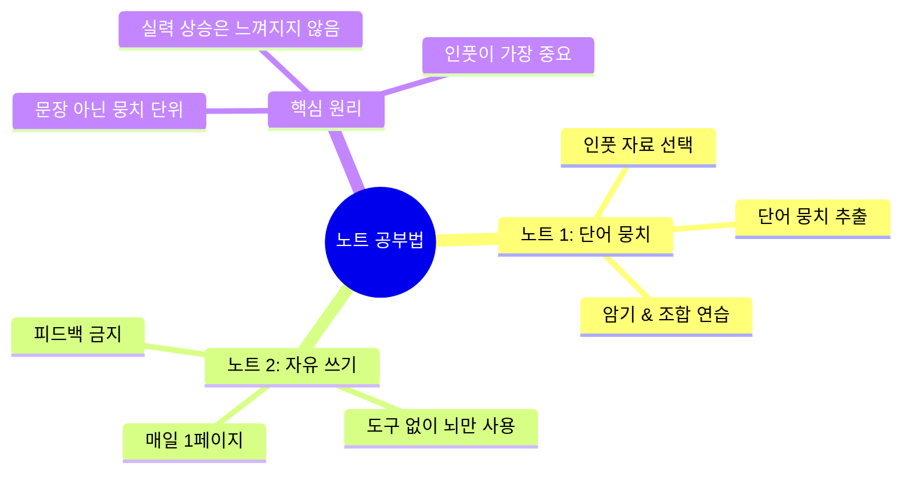
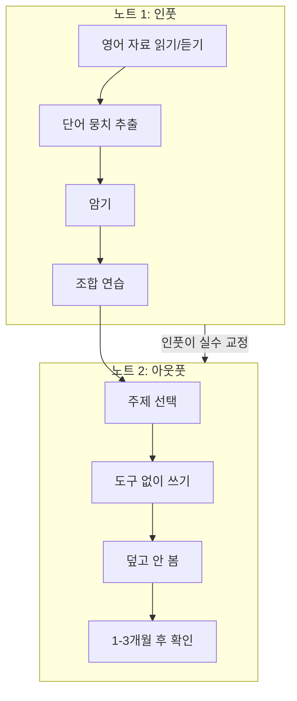

# 외국어 고수들의 노트 공부법: 단어 뭉치 + 자유 쓰기

> **채널**: 런던쌤 | **시청일**: 2026-03-19

<iframe width="560" height="315" src="https://www.youtube.com/embed/avd62300hc4" frameborder="0" allowfullscreen></iframe>

---

## 목차

- [[#개요]]
- [[#Chapter 1 단어 뭉치 노트|Chapter 1. 단어 뭉치 노트 (Input 노트)]] `🟢 기초`
- [[#Chapter 2 자유 쓰기 노트|Chapter 2. 자유 쓰기 노트 (Output 노트)]] `🟡 중급`
- [[#종합 정리]]
- [[#용어 사전]]
- [[#학습 체크리스트]]
- [[#보충자료]]
- [[#내 생각 & 연결]]

---

## 개요

> **한 줄 핵심**: 외국어 고수들은 **문장 단위가 아닌 단어 뭉치(chunk) 단위**로 학습하고, **도구 없이 자유롭게 쓰는 연습**으로 실전 사용 능력을 키운다.

런던쌤은 영어, 한국어, 인도네시아어 등 다국어를 습득한 경험을 바탕으로, 30일 안에 "발전 없음" 느낌에서 벗어날 수 있는 두 가지 노트 공부법을 소개한다. 첫 번째 노트는 영어 인풋(읽기/듣기)을 하면서 **단어 뭉치를 수집**하는 방법이고, 두 번째 노트는 아무 도구 없이 **매일 한 페이지를 영어로 채우는** 자유 쓰기 방법이다. 이 방법은 해외 연수에서 얻는 경험을 국내에서 시뮬레이션하는 효과가 있다. 핵심 인사이트는 "실력이 올라가는 동안에는 느껴지지 않는다 - 계기가 생겨 뒤돌아볼 때 비로소 알게 된다"이다.

### 마인드맵

### 암기 포인트

| 중요도 | 개념 | 핵심 한 줄 | 비유/키워드 |
|:------:|------|-----------|------------|
| ★★★ | 단어 뭉치 학습 | 문장이 아닌 2-4단어 조합으로 학습 | 레고 블록 조립 |
| ★★★ | 인풋의 중요성 | 한 가지만 한다면 인풋이 되어야 | 영양소 섭취 |
| ★★★ | 피드백 금지 | 자유 쓰기 노트는 덮고 보지 않기 | 시험 후 답안 확인 X |
| ★★☆ | 실력 상승 인식 | 계기가 생겨야 뒤돌아볼 수 있음 | 나무가 자라는 것 |
| ★★☆ | 불완전한 표현 | 완벽하지 않아도 부분적으로 표현 | 도착하는 게 중요 |

### 구간 가이드

| 구간 | 챕터 | 난이도 | 주제 |
|------|------|:------:|------|
| 0:00~5:30 | Chapter 1 | 🟢 기초 | 단어 뭉치 노트 - 인풋 & 수집 |
| 5:30~9:30 | Chapter 2 | 🟡 중급 | 자유 쓰기 노트 - 아웃풋 & 실전 |
| 9:30~12:00 | 종합 | 🟢 기초 | 실력 상승 인식과 마무리 |

### 이해도 체크

- [ ] 개요를 읽고 두 가지 노트의 목적 차이를 설명할 수 있다
- [ ] 마인드맵의 각 가지가 무엇을 의미하는지 이해했다
- [ ] 암기 포인트의 ★★★ 항목을 보지 않고 말할 수 있다

---

## Chapter 1. 단어 뭉치 노트 (Input 노트) `🟢 기초`

<iframe width="560" height="315" src="https://www.youtube.com/embed/avd62300hc4?start=0&end=330" frameborder="0" allowfullscreen></iframe>

### 배경

많은 학습자들이 **문장 단위로 암기**하지만, 이 방식에는 두 가지 문제가 있다:
1. **암기 자체가 어려움** - 문장이 너무 길어서 머릿속에 한꺼번에 안 들어감
2. **사용 기회가 적음** - 그 문장 그대로 쓸 상황이 1년에 1-2번

반면 외국어 고수들은 **단어 뭉치(chunk) 단위**로 학습한다. 2-4개 단어로 구성된 뭉치는 외우기 쉽고, 다양한 조합으로 수십 개의 문장을 만들 수 있다.

### 화자의 주장과 근거

**핵심 주장**: 단어 뭉치 단위로 학습하면 초보자도 다양한 문장을 쉽게 조합할 수 있다.

**예시 분석**: "I really need a place to stay" 문장에서

| 추출 방식 | 단어 뭉치 | 활용 가능성 |
|----------|----------|------------|
| 전체 문장 | I really need a place to stay | 하루 1-2번 사용 가능 |
| 단어 뭉치 1 | I really need a + [명사] | 하루 수십 번 사용 가능 |
| 단어 뭉치 2 | a place to stay | 다양한 동사와 조합 가능 |

**단어 뭉치의 조합력**:
- "I really need a" + coffee / break / friend / answer
- "a place to stay" + I need / I found / It's hard to find / There's no

**런던쌤의 인도네시아어 단어장 예시**:
- 대부분 2-3개 단어 조합
- 4개 이상은 머릿속에 한꺼번에 안 들어감
- 긴 표현은 문법 참고용으로만 기록 (암기 대상 아님)

### 실행 방법

**필요 도구**: 노트, 펜, 영어 자료 (원서, 웹사이트, 유튜브, 드라마 등)

**추천 자료**: [Elllo](https://elllo.org/) - 초보자용 오디오 + 스크립트

**단계**:
1. 영어 자료를 읽거나 듣는다 (인풋)
2. 내가 **유용하게 사용할 것 같은 단어 뭉치**를 노트에 적는다
3. **100% 완벽하게 하려고 하지 않는다** - 원하는 것만 적당히
4. 적은 표현을 **각자의 방식으로 암기**한다
5. 뭉치끼리 **연결 연습**을 한다

> [!important] 핵심 원칙
> 모든 단어 뭉치를 다 가져갈 필요 없다. **내가 원하는 것만** 가져가면 된다.

**비유로 이해하기**: 레고 블록처럼 생각하라. 완성된 작품(문장)을 통째로 외우는 게 아니라, 개별 블록(단어 뭉치)을 모아서 원하는 대로 조립하는 것이다.

### Chapter 1 이해도 체크

- [ ] 문장 단위 암기의 두 가지 문제점을 설명할 수 있다
- [ ] "I really need a"를 사용한 문장을 3개 만들 수 있다
- [ ] 단어 뭉치의 적정 길이(2-4개)와 그 이유를 안다
- [ ] 인풋의 중요성을 한 문장으로 설명할 수 있다

---

## Chapter 2. 자유 쓰기 노트 (Output 노트) `🟡 중급`

<iframe width="560" height="315" src="https://www.youtube.com/embed/avd62300hc4?start=330&end=570" frameborder="0" allowfullscreen></iframe>

### 배경

해외 연수의 효과는 **강제적인 아웃풋 환경**에서 나온다. 어휘가 부족해도, 문법이 틀려도, 어떻게든 표현해야 하는 상황. 이 경험을 국내에서 시뮬레이션하는 것이 자유 쓰기 노트의 목적이다.

### 화자의 주장과 근거

**핵심 주장**: 도구 없이 뇌만 사용해서 매일 한 페이지를 쓰면, 해외 연수의 효과를 시뮬레이션할 수 있다.

**규칙 (절대 바꾸지 말 것)**:
1. **하루에 노트 한 페이지 전체**를 영어로 채운다
2. **아무 도구도 사용하지 않는다** - 사전, 번역기, 인터넷 금지
3. 사용 가능한 것: **펜, 노트, 뇌** 오직 세 가지
4. 실수에 대해 걱정하지 않는다 - 당연히 있을 것
5. **완벽하지 않아도 부분적으로라도 표현**한다

**런던쌤의 인도네시아어 경험**:
- 원하는 문장: "내 친구가 한국을 떠났어요"
- 문제: "떠났다" 단어를 모름 → "비행기"도 모름 → "공항"도 모름
- 몇 분간 고민 후 해결책: "내 친구가 친구 집에 갔어요"
- 원하는 문장이 아니지만 **부분적으로 표현 성공**

### 피드백 금지 원칙

**학습자가 가장 하고 싶은 것**: 피드백 받기 (내 문장이 맞는지 확인)

**규칙**: **절대 안 된다**
- 쓴 후 덮는다
- 내일도, 모레도 보지 않는다
- 피드백을 받으면 효과가 없다

**왜 피드백이 없어도 되는가?**:
- 첫 번째 노트(단어 뭉치)로 **인풋을 꾸준히** 하면
- 실수들이 **조금씩 자동으로 고쳐진다**
- 인풋이 실수를 교정하는 메커니즘

### 실력 상승의 인식

**핵심 인사이트**: 실력이 올라가는 동안에는 **절대 느껴지지 않는다**.

**왜 그런가**:
- 매일 조금씩 성장하면 변화가 감지되지 않음
- "내 실력이 똑같다"는 느낌이 지속됨
- **계기가 생겨서 뒤돌아볼 때** 비로소 알게 됨

**런던쌤의 경험**:
- 영어, 한국어, 러시아어, 독일어 학습 시 동일한 경험
- 실력이 빠르게 올라가는 시기에도 느껴지지 않았음
- 나중에 "어? 이게 언제 이렇게 됐지?" 하고 깨달음

**자유 쓰기 노트의 역할**:
- 1-3개월 후에 오늘 쓴 내용을 다시 보면
- 얼마나 발전했는지 **확인할 수 있는 계기**가 됨

**비유로 이해하기**: 나무가 자라는 것은 매일 보면 안 보인다. 몇 달 후에 사진을 비교해야 "이만큼 컸구나" 알 수 있다.

### Chapter 2 이해도 체크

- [ ] 자유 쓰기 노트의 3가지 허용 도구를 안다
- [ ] 피드백이 금지되는 이유를 설명할 수 있다
- [ ] "부분적 표현"의 예시를 자신의 언어로 들 수 있다
- [ ] 실력 상승이 느껴지지 않는 원리를 이해했다

---

## 종합 정리

이 공부법의 핵심은 **인풋과 아웃풋의 분리**와 **단위의 최적화**이다.

**노트 1 (인풋)**: 영어 자료에서 단어 뭉치를 수집하고 암기한다. 문장이 아닌 2-4단어 뭉치로 학습하면 암기가 쉽고 조합력이 높아진다.

**노트 2 (아웃풋)**: 도구 없이 매일 한 페이지를 채운다. 완벽하지 않아도 되고, 피드백도 받지 않는다. 인풋을 꾸준히 하면 실수는 자동 교정된다.

**메타 인사이트**: 실력 향상은 **과정 중에는 느껴지지 않는다**. 이것을 받아들이고, 계기를 만들어 뒤돌아볼 때 확인한다.

---

## 용어 사전

| 용어 | 정의 | 맥락 |
|------|------|------|
| 단어 뭉치 (Chunk) | 2-4개 단어로 구성된 의미 단위 | "I really need a", "a place to stay" |
| 인풋 (Input) | 영어를 듣거나 읽고 이해하는 과정 | 인풋 없이 발전 없음 |
| 아웃풋 (Output) | 영어로 말하거나 쓰는 과정 | 자유 쓰기 노트가 담당 |
| 습득 (Acquisition) | 자연스럽게 언어를 내재화하는 것 | 인풋을 통해 이루어짐 |
| 스트러글링 (Struggling) | 표현하려고 애쓰는 힘든 과정 | 이 과정이 실력을 키움 |

---

## 학습 체크리스트

**셀프 테스트** — 노트를 가리고 답해보기

- [ ] Q: 두 가지 노트 공부법의 차이점은?
- [ ] Q: 단어 뭉치의 적정 길이와 그 이유는?
- [ ] Q: 자유 쓰기 노트에서 피드백이 금지되는 이유는?
- [ ] Q: 인풋이 왜 가장 중요한가?
- [ ] Q: 실력 상승이 느껴지지 않는 이유는?

**실행 계획**

- [ ] 오늘부터 단어 뭉치 노트 시작 - 자료: ____________
- [ ] 내일부터 자유 쓰기 노트 시작 - 주제: 아무거나
- [ ] 30일 후 자유 쓰기 노트 첫 페이지 다시 보기

**최종 점검**

- [ ] 모든 챕터의 이해도 체크를 완료했다
- [ ] 암기 포인트 ★★★ 항목을 보지 않고 설명할 수 있다
- [ ] 종합 정리의 플로우차트를 직접 그릴 수 있다
- [ ] 1차 복습 완료 (2026-03-20)
- [ ] 2차 복습 완료 (2026-03-26)
- [ ] 3차 복습 완료 (2026-04-18)

---

## 보충자료

| 자료 | 유형 | 왜 읽어야 하는지 |
|------|------|-----------------|
| [Elllo.org](https://elllo.org/) | 학습 사이트 | 초보자용 영어 인풋 자료 + 스크립트 |
| [[YT-knowledge-260310-토리파-공부법-종합]] | 관련 노트 | 효과적인 학습법 전반 |

---

## 내 생각 & 연결

**가장 큰 인사이트**: "문장 단위 암기"가 비효율적이라는 것을 머리로는 알았지만, 구체적으로 왜 그런지(1년에 1-2번 사용 기회)와 대안(단어 뭉치 조합)을 명확히 이해했다. 특히 "피드백 금지" 원칙이 반직관적이지만, 인풋이 실수를 자동 교정한다는 논리가 설득력 있다.

**내 삶에 적용한다면**:
1. 이번 주부터 Elllo.org에서 하루 1개 자료 읽으며 단어 뭉치 5개 수집
2. 매일 아침 10분 자유 쓰기 - 어제 있었던 일 영어로 기록
3. 30일 후 첫 페이지 다시 보기

**기존 지식과의 연결:**
- [[YT-knowledge-260310-토리파-공부법-종합]] — 인풋의 중요성 강조와 연결
- [[YT-english-260319-Writing-Skills-Mega-Lesson]] — 오늘 함께 본 영상, writing 실전 스킬

**다음에 탐구할 것:**
- 단어 뭉치 조합 연습 구체적 방법 (다음 영상에서 다룬다고 함)
- Comprehensible Input 이론 (Krashen) 더 깊이 파기
