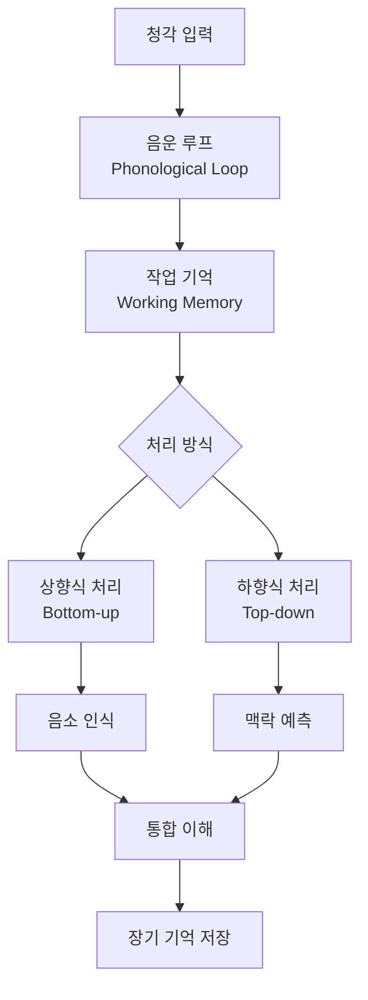
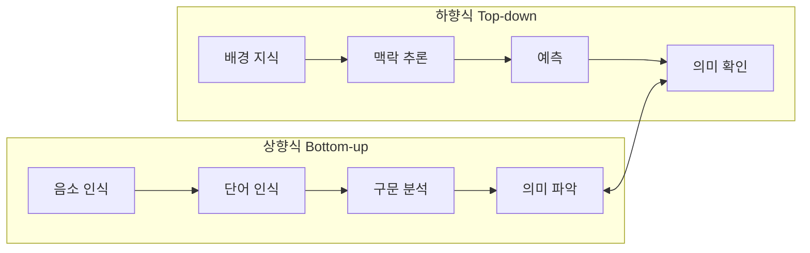
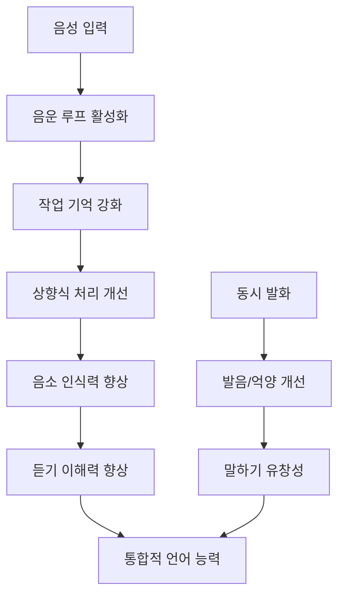
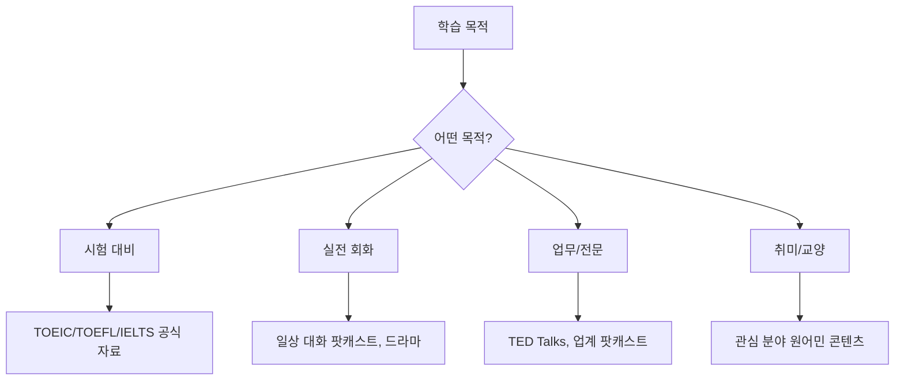
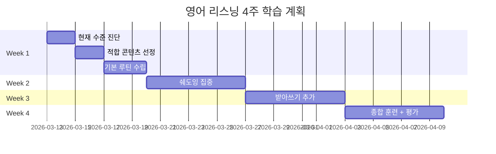
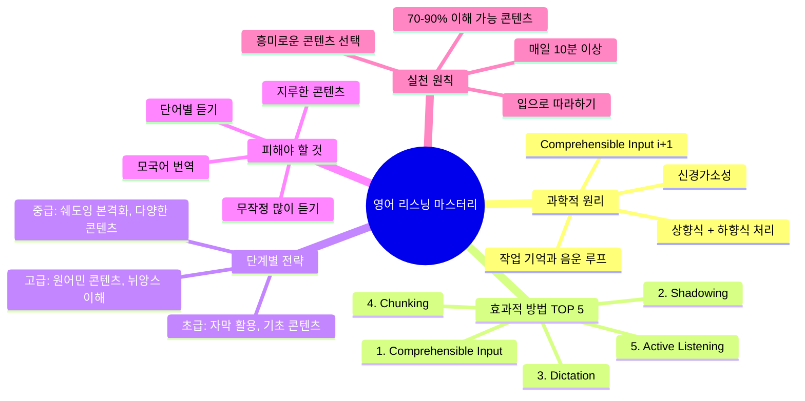

# English Listening Mastery: 과학적으로 검증된 영어 듣기 향상법

> [!quote] Core Insight
> "영어 리스닝은 단순히 많이 듣는다고 해서 자동으로 늘지 않습니다. 효과적인 리스닝 실력 향상을 위해선 자신의 현재 실력과 목표에 따라 맞춤형 학습 전략이 필요합니다."

---

## 1. 리스닝 향상의 과학적 원리

### 1.1 뇌과학이 말하는 언어 습득



> [!info] 핵심 뇌과학 발견
> - **좌측 각회(Angular Gyrus)와 상측두회(Superior Temporal Gyrus)**가 사전 지식과 감각 입력 통합에 핵심 역할
> - 이 영역의 활성화가 **미래 학습 성공을 예측**
> - L2 몰입 학습은 성인 뇌에서도 **신경가소성(Neuroplasticity)** 유도
> - 듣기 경험이 **말하기 관련 뇌 영역에도 영향**

### 1.2 Krashen의 Comprehensible Input 가설

Stephen Krashen(1970-80년대)이 제안한 **입력 가설(Input Hypothesis)**은 언어 습득의 가장 영향력 있는 이론 중 하나입니다.

#### i+1 공식

| 구분 | 설명 | 예시 |
|------|------|------|
| **i** | 현재 언어 수준 | 기초 대화 가능 |
| **+1** | 약간 높은 수준 | 새로운 표현/어휘 포함 |
| **i+0** | 동일 수준 | 학습 효과 없음 |
| **i+2** | 너무 높은 수준 | 좌절감, 포기 |

> [!important] 5가지 핵심 가설
> 1. **입력 가설 (i+1)**: 현재 수준보다 약간 높은 입력이 습득 촉진
> 2. **습득-학습 가설**: 무의식적 '습득'이 의식적 '학습'보다 효과적
> 3. **모니터 가설**: 문법 학습은 출력 점검에만 도움
> 4. **자연 순서 가설**: 언어 습득에는 보편적 순서 존재
> 5. **정의적 필터 가설**: 불안, 두려움이 습득 방해

### 1.3 상향식 vs 하향식 처리



> [!tip] 통합적 접근이 최선
> 연구에 따르면 **두 처리 방식을 동시에 활용**하는 것이 가장 효과적입니다. 초보자는 상향식에 집중하고, 중급 이상은 하향식을 더 활용하는 경향이 있습니다.

---

## 2. 가장 효과적인 방법 TOP 5

### 2.1 Comprehensible Input (이해 가능한 입력)

> [!quote] Krashen의 핵심 주장
> "Language acquisition happens through an unconscious process. The necessary ingredient—the critical, essential core—of that unconscious process is comprehensible input."

#### Clockwork Orange 연구
- 참가자들에게 러시아 슬랭이 포함된 소설 제공 (사전 없이)
- 241개 외래어가 평균 15회 반복
- 결과: **평균 76% 정확도로 어휘 습득** (범위: 50-96%)
- 직접 교육 없이 읽기만으로 최소 45개 외래어 학습

#### 실천 가이드

| 수준 | 이해도 목표 | 추천 콘텐츠 |
|------|------------|------------|
| 초급 | 70-80% | 학습자용 팟캐스트, 간단한 뉴스 |
| 중급 | 75-85% | TED Talks, 드라마 (자막 활용) |
| 고급 | 80-90% | 원어민 팟캐스트, 뉴스, 토론 |

### 2.2 Shadowing (쉐도잉)

> [!success] 연구 검증된 효과
> 2025년 LEARN Journal 연구: 8주간 쉐도잉 훈련 후 **통계적으로 유의미한 듣기 이해력 향상** (p < .05)

#### 쉐도잉의 작동 원리



#### 7단계 쉐도잉 프로토콜 (Hamada, 2012)

| 단계 | 활동 | 시간 | 목적 |
|------|------|------|------|
| 1 | **Listening** | 8분 | 2회 청취, 빈칸 채우기 |
| 2 | **Parallel Reading** | 10분 | 스크립트 보며 따라하기 |
| 3 | **Mumbling** | 5분 | 조용히 발음/억양 집중 |
| 4 | **Check Understanding** | 4분 | 의미/발음 확인 |
| 5 | **Synchronized Reading** | 5분 | 소리 내어 읽으며 따라하기 |
| 6 | **Prosody Shadowing** | 5분 | 스크립트 없이 리듬/억양 집중 |
| 7 | **Check Details** | 2분 | 답 확인, 불명확한 부분 정리 |

#### 권장 연습량
- **Kadota (2007)**: 주 3-5시간으로 측정 가능한 향상
- **Tamai (1992)**: 매일 15-20분, 수 주간 지속
- **Hamada (2016)**: 주 3-4회, 10-15분씩, 6주간

> [!warning] 주의사항
> 쉐도잉은 특히 **저숙련자의 음소 인식 능력**을 크게 향상시킵니다. 고급자보다 초중급자에게 더 큰 효과가 있을 수 있습니다.

### 2.3 Dictation (받아쓰기)

받아쓰기는 **집중적 청취 훈련**의 핵심입니다.

#### 효과
- 단어의 정확한 발음 인식
- 문장 구조 파악
- 청취 집중력 극대화
- 세부 단어까지 캐치하는 훈련

> [!note] 적합 대상
> 연구에 따르면 받아쓰기는 **중상급 학습자**에게 더 효과적입니다. 초급자에게는 쉐도잉이 더 접근하기 쉽습니다.

### 2.4 Chunking (청킹) - 덩어리로 듣기

> [!quote] 핵심 원리
> "영어가 잘 들리지 않는 가장 큰 이유 중 하나는 단어를 하나하나 끊어 들으려고 하기 때문입니다."

#### 한국어 vs 영어 비교

| 특성 | 한국어 | 영어 |
|------|--------|------|
| 리듬 | 음절 중심 (Syllable-timed) | 강세 중심 (Stress-timed) |
| 발음 | 각 음절 균등 | 중요 단어만 강조 |
| 속도 | 일정함 | 강세 사이 압축 |

#### 예시
- **단어별 듣기**: "She-needs-to-buy-some-food" (피로, 이해 어려움)
- **청킹 듣기**: "She-needs-to / buy-some-food" (자연스럽고 효율적)

#### 미믹킹 (Mimicking) 훈련법
쉐도잉이 **동시에** 따라 말하는 것이라면, 미믹킹은 **한 문장을 듣고 기억해서** 원어민처럼 똑같이 흉내 내는 연습입니다.

### 2.5 Active Listening (능동적 듣기)

> [!info] 수동적 듣기 vs 능동적 듣기
> **수동적 듣기**: 배경음악처럼 흘려듣기 (효과 제한적)
> **능동적 듣기**: 의식적으로 집중하며 의미 파악 시도 (효과적)

#### 연구 결과
- 능동적 듣기는 **음운론, 형태론, 화용론** 모든 영역에 영향
- 언어 학습에서 듣기는 일일 의사소통의 **40-50%** 차지
- 말하기(25-30%), 읽기(11-16%), 쓰기(9%)보다 높음

#### 능동적 듣기 전략
1. **예측하며 듣기**: 다음에 나올 내용 추측
2. **핵심어 파악**: 중요 단어/표현에 집중
3. **메모하며 듣기**: 키워드 받아적기
4. **질문 만들기**: 들은 내용에 대한 질문 생성
5. **요약하기**: 들은 후 핵심 내용 정리

---

## 3. 단계별 학습법

### 3.1 초급 (Beginner) - CEFR A1-A2


#### 핵심 전략
- **파닉스(Phonics) 훈련**: 영어 소리 체계 익히기
- **간단한 문장 반복 청취**: 짧고 명확한 콘텐츠
- **자막 적극 활용**: 영어 자막 → 한글 자막 → 무자막 단계적 전환
- **학습자용 콘텐츠**: 속도 조절된 음성

#### 추천 리소스
| 리소스 | 설명 | 특징 |
|--------|------|------|
| **ELLLO** | 레벨별 3,000+ 무료 레슨 | CEFR 기준 분류 |
| **ESL Fast** | 1,500+ 짧은 대화 | 기초 수준에 적합 |
| **British Council** | A1-C1 레벨 콘텐츠 | 체계적 커리큘럼 |
| **어린이 영어 콘텐츠** | 천천히, 명확한 발음 | 입문자에게 이상적 |

> [!tip] 초급자 핵심 조언
> - 번역 도구 적극 활용 OK
> - 말하기/회화보다 **듣기와 읽기에 집중**
> - 문법 공부는 최소화 - 충분한 입력이 문법을 자연스럽게 습득하게 함

### 3.2 중급 (Intermediate) - CEFR B1-B2


#### 핵심 전략
- **쉐도잉 + 받아쓰기 병행**: 능동적 듣기 연습
- **영어 자막 → 무자막 전환**: 점진적 난이도 상승
- **다양한 콘텐츠**: 드라마, 영화, TED Talks
- **대화 파트너 찾기**: 입력과 출력 균형

#### 추천 리소스
| 리소스 | 설명 | 특징 |
|--------|------|------|
| **6-Minute English (BBC)** | 6분 에피소드 | 영국식 영어, 흥미로운 주제 |
| **TED Talks** | 20분 이하 강연 | 다양한 주제, 자막 지원 |
| **All Ears English** | 미국식 영어 팟캐스트 | 실용적 표현 |
| **FluentU** | 실제 영상 기반 학습 | 인터랙티브 자막 |

> [!important] 중급자 핵심
> "Compelling input is not just optimal: It may be the only way we truly acquire language." - Krashen
> **재미있는 콘텐츠**를 선택하세요. 흥미로운 것을 들을 때 언어 습득이 가장 효과적입니다.

### 3.3 고급 (Advanced) - CEFR C1-C2


#### 핵심 전략
- **CNN, BBC 뉴스**: 정보량 많은 빠른 속도 콘텐츠
- **토론형 팟캐스트**: 의도 파악, 주장 분석
- **다양한 억양 노출**: 영국, 호주, 인도 영어 등
- **뉘앙스 이해**: 농담, 풍자, 함축적 의미

#### 추천 리소스
| 리소스 | 설명 | 특징 |
|--------|------|------|
| **99% Invisible** | 디자인/건축 팟캐스트 | 도전적 주제 |
| **Rough Translation** | 사회 이슈 | 고급 어휘/표현 |
| **IDEA Archive** | 세계 영어 방언 | 억양 다양성 |
| **Scientific American** | 과학 팟캐스트 | 전문 어휘 |

> [!tip] 고급자 핵심 조언
> - 문법을 '공부'하지 말고 필요할 때만 참고
> - 다양한 장르의 콘텐츠 소비
> - 새로운 사람과 대화 기회 찾기

---

## 4. 콘텐츠 찾는 방법

### 4.1 레벨 판단 기준

> [!important] 70-90% 법칙
> 콘텐츠의 **70-90%를 이해할 수 있어야** 학습에 효과적입니다.
> - 70% 미만: 너무 어려움 (좌절감)
> - 90% 초과: 너무 쉬움 (새로운 학습 없음)

### 4.2 목적별 콘텐츠 선택



### 4.3 추천 플랫폼 종합

#### 무료 웹사이트
| 사이트 | 특징 | 레벨 |
|--------|------|------|
| **ELLLO** | 3,000+ 레슨, 퀴즈 포함 | 전 레벨 |
| **British Council** | CEFR 기준, 체계적 | A1-C1 |
| **Breaking News English** | 뉴스 기반 3,000+ 레슨 | 전 레벨 |
| **Voice of America** | 느린 속도 뉴스 | 초중급 |
| **TED Talks** | 자막 지원 강연 | 중고급 |

#### 팟캐스트
| 팟캐스트 | 특징 | 레벨 |
|----------|------|------|
| **6-Minute English** | BBC, 6분 에피소드 | 중급 |
| **All Ears English** | 미국식, 문화/예절 | 중고급 |
| **Luke's English Podcast** | 유머러스, 45-60분 | 중고급 |
| **Stuff You Should Know** | 다양한 주제 | 고급 |

#### 앱
| 앱 | 특징 | 가격 |
|----|------|------|
| **LingoClip** | 음악으로 학습 | 무료 (인앱구매) |
| **FluentU** | 실제 영상 활용 | $19.99/월 |
| **Pimsleur** | 모국어 맞춤 | $20.49/월 |

#### 스트리밍
| 플랫폼 | 활용법 |
|--------|--------|
| **Netflix** | 영어 음성 + 영어 자막 → 무자막 |
| **YouTube** | 자동 자막 + 속도 조절 |
| **Disney+** | 친숙한 콘텐츠로 시작 |

---

## 5. 흔한 실수와 피해야 할 것

### 5.1 학습 전략 실수

> [!danger] 피해야 할 7가지 실수

#### 1. 무작정 많이 듣기
- **문제**: 이해 없이 듣는 것은 효과 없음
- **해결**: 이해 가능한 수준(i+1)의 콘텐츠 선택

#### 2. 단어 하나하나 들으려 하기
- **문제**: 빠른 속도에 대처 불가, 피로감
- **해결**: 청킹(의미 덩어리) 단위로 듣기

#### 3. 모국어로 번역하며 듣기
- **문제**: 처리 속도 저하, 자연스러운 이해 방해
- **해결**: 영어로 직접 이해하는 훈련

#### 4. 너무 어려운 콘텐츠 선택
- **문제**: 좌절감, 동기 저하
- **해결**: 70-90% 이해 가능한 콘텐츠

#### 5. 지루한 교재만 사용
- **문제**: 동기 저하, 학습 중단
- **해결**: "Compelling input" - 진정으로 흥미로운 콘텐츠

#### 6. 입으로 따라하지 않기
- **문제**: 연음/발음 패턴 미습득
- **해결**: 쉐도잉/미믹킹으로 소리 내어 연습

#### 7. 불규칙적 학습
- **문제**: 장기 기억 형성 실패
- **해결**: 매일 짧게라도 꾸준히 (10분 > 몰아치기)

### 5.2 발음/듣기 관련 실수

| 실수 | 원인 | 해결책 |
|------|------|--------|
| 연음 미인식 | "want to" → "wanna" 모름 | 연음 규칙 학습, 따라 말하기 |
| 강세 무시 | 모든 단어 똑같이 들으려 함 | 강세 위치 파악 훈련 |
| 빠른 속도 대처 불가 | 상향식 처리만 의존 | 하향식(예측) 처리 병행 |
| 다양한 억양 적응 실패 | 한 종류 억양만 노출 | 다양한 영어권 콘텐츠 |

### 5.3 정서적 장벽

> [!warning] Affective Filter (정의적 필터)
> Krashen에 따르면 **불안, 두려움, 지루함**은 언어 습득을 방해하는 필터 역할을 합니다.

- **불안감**: 틀릴까봐 두려움 → 편안한 환경에서 학습
- **완벽주의**: 100% 이해해야 한다는 강박 → 대략적 이해 OK
- **비교**: 원어민과 비교 → 자신의 진전에 집중
- **조급함**: 빠른 향상 기대 → 점진적 발전 인정

---

## 6. 실천 계획 템플릿

### 6.1 일일 루틴 (30분)

```
06:00-06:10  [능동적 듣기] 팟캐스트 1 에피소드
06:10-06:20  [쉐도잉] 같은 콘텐츠로 따라하기
06:20-06:30  [복습] 새 표현 노트 정리
```

### 6.2 주간 계획

| 요일 | 활동 | 시간 | 콘텐츠 예시 |
|------|------|------|------------|
| 월 | 쉐도잉 | 20분 | TED Talk 클립 |
| 화 | 받아쓰기 | 15분 | 뉴스 클립 |
| 수 | 드라마 시청 | 30분 | Netflix (영어 자막) |
| 목 | 쉐도잉 | 20분 | 팟캐스트 |
| 금 | 받아쓰기 | 15분 | 관심 분야 영상 |
| 토 | 종합 복습 | 30분 | 주간 학습 내용 |
| 일 | 자유 청취 | 원하는 만큼 | 재미있는 콘텐츠 |

### 6.3 4주 목표 설정



### 6.4 진척도 체크리스트

> [!todo] 주간 자가 점검
> - [ ] 이번 주 최소 5일 이상 영어 청취 완료
> - [ ] 쉐도잉 3회 이상 실시
> - [ ] 새로운 표현/어휘 10개 이상 습득
> - [ ] 이해도 70% 이상 유지되는 콘텐츠 사용
> - [ ] 다양한 유형의 콘텐츠 (뉴스, 대화, 강연) 노출

---

## 7. 핵심 요약



> [!success] 최종 핵심 메시지
> 1. **양보다 질**: 무작정 많이 듣는 것보다 '어떻게' 듣느냐가 중요
> 2. **i+1 원칙**: 현재 수준보다 살짝 높은 콘텐츠 선택
> 3. **능동적 참여**: 쉐도잉, 받아쓰기로 적극 참여
> 4. **흥미 우선**: Compelling input이 최고의 학습
> 5. **꾸준함**: 매일 10분이 주 1회 2시간보다 효과적

---

## 참고 문헌 및 출처

### 학술 연구
- Mu, Y., & Wasuntarasophit, S. (2025). Effects of the shadowing technique on English listening comprehension. *LEARN Journal*, 18(2), 130-157.
- Hamada, Y. (2024). Developing a new shadowing procedure for listening vocabulary: selective shadowing. *Innovation in Language Learning and Teaching*.
- Hamada, Y., & Suzuki, Y. (2024). Situating Shadowing in the Framework of Deliberate Practice. *Language Teaching Research*.
- Krashen, S. (1982). *Principles and practice in second language acquisition*. Pergamon Press.

### 온라인 리소스
- [Leonardo English - Comprehensible Input](https://www.leonardoenglish.com/blog/comprehensible-input)
- [FluentU - English Listening Practice Resources](https://www.fluentu.com/blog/english/english-listening-practice-resources/)
- [ELLLO - English Listening Lesson Library Online](https://www.elllo.org/)
- [British Council LearnEnglish](https://learnenglish.britishcouncil.org/skills/listening)

### 뇌과학/신경과학
- ScienceDirect: Brain activity predicts future learning success in intensive second language listening training
- Nature Communications Biology: Enhanced efficiency in the bilingual brain
- PMC: Second-language learning and changes in the brain

---

*Generated: 2026-03-13 | Topic: English Listening Mastery | Genre: Self-help/Language Learning*
