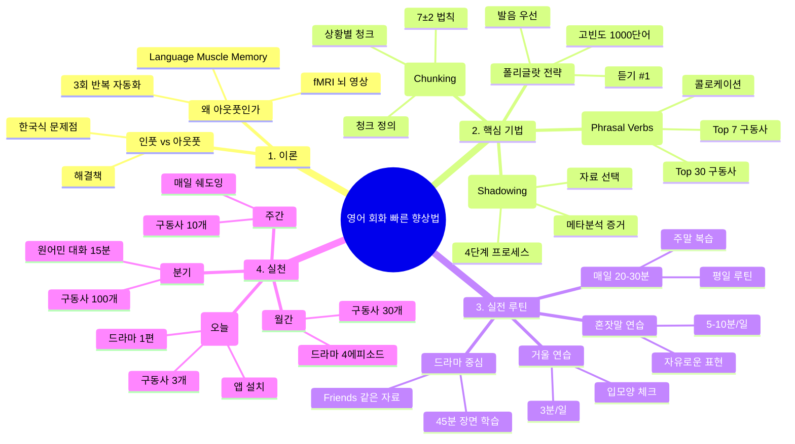

# 영어 회화 빠른 향상법 - 과학적 방법론

## 📌 학습 목표
- [ ] 원어민 대화 구조 이해하기
- [ ] 구동사와 콜로케이션 마스터하기
- [ ] 쉐도잉 기법을 통한 발음 & 유창성 향상
- [ ] 일주일 내 일상 영어 표현 20개 체화하기
- [ ] 월간 언어 교환 파트너와 실전 연습

---

## 📊 핵심 요약 (한눈에 보기)

| 항목 | 현황 (한국 교육) | 목표 (아웃풋 중심) |
|------|------------------|------------------|
| 인풋:아웃풋 비율 | 80% : 20% | 40% : 60% |
| 학습 우선순위 | 문법 > 어휘 > 발음 | 발음 > 고빈도 어휘 > 문법 |
| 학습 단위 | 개별 단어 | 청크 (구 단위) |
| 발음 교정 시점 | 나중에 | 초기 (화석화 방지) |
| 학습 자료 | 교과서 | 드라마, 팟캐스트, 영화 |
| 반복 빈도 | 주 2회, 1시간 | 매일 20-30분 |

---

## 🟢 Chapter 1: 왜 아웃풋(말하기) 중심 학습인가?

### 1.1 한국 교육 시스템의 문제점

대부분의 한국 학습자는 **인풋 편향적 학습**에 갇혀있다:

- **청취**: 원어민 영상 시청, 팟캐스트 청취
- **읽기**: 영어 기사, 교과서, 소설 독서
- **결과**: 이해는 하는데 **말을 못함** (수용적 능력 ≠ 표현 능력)

> [!note] 연구 사실
> fMRI 뇌 영상 분석에 따르면, **청취와 말하기는 다른 뇌 영역을 활성화**한다.
> - 청취: 베르니케 영역 (이해)
> - 말하기: 브로카 영역 (표현) + 운동 피질 (근육 제어)
> - **결론**: 듣기만 해서는 말하기가 늘지 않는다.

### 1.2 Language Muscle Memory (언어 근육 기억)

**같은 문장을 3회 반복하면 뇌가 완전히 자동화한다.**

```
1회차 반복: 음성 인식 (청각 피질)
2회차 반복: 의미 이해 (베르니케 영역)
3회차 반복: 운동 기억 (소뇌) → 자동화 시작
```

**실전 예시**:
- "How are you?" (1회 듣기) → 이해만 함
- "How are you?" (음성 따라 말하기) → 인식 + 표현
- "How are you?" (실제 대화에서 사용) → 자동화 완성

### 1.3 아웃풋 중심 학습의 과학적 근거

| 연구 | 결과 | 적용 |
|------|------|------|
| Swain의 Comprehensible Output 가설 | 아웃풋이 문법 정확성 향상 | 실패 & 피드백 필수 |
| Krashen 습득 이론 | 95-98% 이해 가능 입력 필요 | 너무 어려운 자료 피하기 |
| Ericsson 숙달 이론 | 의도적 반복 1만 시간 필요 | 잘못된 방식 1만 시간 ≠ 숙달 |

### 1.4 즉시 적용 전략

> [!warning] 경고: 현재 상태 파악하기
>
> **다음 중 몇 개가 당신에게 해당되나?**
> 1. [ ] 영어 자막 드라마는 이해하는데, 자신 있게 말할 수 없다
> 2. [ ] 문법 시험 성적은 좋지만, 원어민과 대화하면 멍한다
> 3. [ ] 쓰기는 되지만, 즉시 말하기는 어렵다
> 4. [ ] 발음에 자신이 없어 말을 잘 못 꺼낸다
>
> **3개 이상 해당** → 즉시 아웃풋 중심 학습으로 전환하자!

---

## 🟡 Chapter 2: 구동사(Phrasal Verbs) 마스터하기

### 2.1 왜 구동사가 중요한가?

**원어민 일상 대화의 20-30%가 구동사다.**

```
교과서식: "I need to delay this project"
원어민식: "We need to put off this project"

교과서식: "Stop speaking"
원어민식: "Shut up" 또는 "Hold your tongue"
```

**구동사를 모르면?**
- TOEIC 리딩에서 점수 15-20점 손실
- 원어민과 대화할 때 "뭐라고 했지?" 반복
- 자신의 표현이 부자연스러워 보임

### 2.2 구동사의 구조와 의미 생성

```
동사 + 전치사/부사 = 새로운 의미

put (놓다) + off (떨어뜨리다) = "미루다, 거절하다, 불쾌하게 하다"
get (얻다) + over (넘다) = "극복하다, 회복하다"
carry (나르다) + out (밖으로) = "실행하다, 수행하다"
```

### 2.3 고빈도 구동사 Top 30 (실전 학습용)

**핵심 구동사는 7개** (이 7개로 일상 대화 50% 커버):

| 구동사 | 의미 | 예문 | 한국식 발음 팁 |
|--------|------|------|----------------|
| **put off** | 미루다, 연기하다 | "Let's put off the meeting" | '풋 오프' (자연스럽게) |
| **get over** | 극복하다, 회복하다 | "I can't get over this breakup" | '겟 오버' (강하게) |
| **turn down** | 거절하다, 음량낮추다 | "He turned down the job offer" | '턴 다운' (낮추는 톤) |
| **work out** | 운동하다, 해결되다 | "Things worked out well" | '워크 아웃' (활동적으로) |
| **come up with** | (아이디어) 생각해내다 | "She came up with a great idea" | '컴 업 윋' (빠르게) |
| **look after** | 돌보다, 관리하다 | "Can you look after my kids?" | '룩 애프터' (세심하게) |
| **bring up** | 제기하다, 양육하다 | "Don't bring up that topic" | '브링 업' (들어올리듯) |

**다음 30개 구동사** (단계별 마스터):
- Week 1-2: put off, get over, turn down, work out, come up with, look after, bring up
- Week 3-4: set up, take down, pick up, drop off, find out, figure out, run into
- Week 5-6: hang out, break down, catch up, give up, fill in, pass by, show up

### 2.4 구동사 학습의 황금 규칙

> [!important] 규칙: 문장 단위 학습이 필수다
>
> ❌ 틀린 방법:
> ```
> put off → "미루다"
> get over → "극복하다"
> (단어 암기, 금방 잊음)
> ```
>
> ✅ 올바른 방법:
> ```
> 1. "Can we put off the meeting until tomorrow?" (맥락과 함께)
> 2. 음성 3회 반복 (자동화)
> 3. 직접 문장 만들기 (표현 연습)
> ```

### 2.5 실전 연습: 오늘의 구동사 3개

**학습 목표**: 다음 3개를 오늘 저녁에 3회씩 말하기

1. **"I need to put off our lunch meeting"** (우리 점심 회의 미루자)
   - 상황: 회의가 너무 많을 때
   - 변형: "Let's put it off"
   - 음성 녹음: [기록 공간]

2. **"She came up with an amazing solution"** (그녀가 놀라운 해결책을 생각해냈다)
   - 상황: 팀원이 좋은 아이디어를 낼 때
   - 변형: "I came up with something cool"
   - 음성 녹음: [기록 공간]

3. **"Let's break down this project into smaller tasks"** (이 프로젝트를 더 작은 작업으로 나누자)
   - 상황: 복잡한 업무를 관리할 때
   - 변형: "We need to break it down"
   - 음성 녹음: [기록 공간]

---

## 🟡 Chapter 3: 청킹(Chunking)과 콜로케이션(Collocations)

### 3.1 뇌의 작업 기억 한계: 7±2 법칙

인간의 뇌는 **동시에 7개 ± 2개 항목**만 처리할 수 있다.

```
❌ 개별 단어로 학습:
"I" "want" "to" "make" "a" "decision"
→ 6개 단어 개별 처리 (인지 부하 높음, 느린 표현)

✅ 청크로 학습:
"I want to" + "make a decision"
→ 2개 청크 (인지 부하 낮음, 빠른 표현)
```

### 3.2 청킹이란? (의미 있는 덩어리로 학습하기)

```
청크 = 뇌가 하나의 단위로 처리하는 언어 덩어리

레벨 1 (음운 청크):
"How'reyou?" → 개별 단어 X, 하나의 흐름 O

레벨 2 (의미 청크):
"as far as I know" = 하나의 표현
"in my opinion" = 하나의 표현
"by and large" = 하나의 표현

레벨 3 (상황 청크):
"Would you mind + -ing?" → 거절할 때 사용 패턴
"I'm afraid I can't" → 정중하게 거절할 때 패턴
```

### 3.3 콜로케이션: 자주 함께 쓰이는 단어 조합

원어민은 **단어를 개별적으로 선택하지 않고**, 자동으로 어울리는 단어 조합을 사용한다.

| 한국 학습자 방식 | 원어민 방식 | 차이 |
|-----------------|-----------|------|
| make a plan | make a plan | ✓ 같음 |
| do a mistake | **make a mistake** | ✗ 다름 |
| do a decision | **make a decision** | ✗ 다름 |
| do success | **achieve success** | ✗ 다름 |
| take success | **achieve success** | ✗ 다름 |

### 3.4 실무 콜로케이션 Top 30

**비즈니스 환경에서 매일 쓰는 콜로케이션**:

```
✓ 정확한 표현 (원어민식)
- make a decision (결정을 내리다)
- reach an agreement (합의에 도달하다)
- draw a conclusion (결론을 내리다)
- take responsibility (책임을 지다)
- break the ice (어색한 분위기를 깨다)
- meet a deadline (마감을 맞추다)
- raise awareness (인식을 높이다)
- carry out a task (업무를 수행하다)
- set a goal (목표를 설정하다)
- achieve a milestone (마일스톤을 달성하다)

✗ 부정확한 표현 (한국식 영어)
- do a decision ❌ → make a decision ✓
- do a plan ❌ → make a plan ✓
- take time ❌ → take (시간이) ✓ (상황마다 다름)
- give attention ❌ → pay attention ✓
```

### 3.5 청킹 학습 로드맵 (4주)

**Week 1**: 기본 청크 20개 암기 및 3회 반복
```
1. "As far as I know"
2. "In my opinion"
3. "By the way"
4. "To tell you the truth"
5. "I'm afraid so"
```

**Week 2**: 상황별 청크 20개 (직장, 일상)
```
6. "Could you do me a favor?"
7. "I appreciate your help"
8. "Let me think about it"
9. "That sounds great"
10. "I'm not sure about that"
```

**Week 3**: 콜로케이션 20개 (동사+명사)
```
11. "make a difference"
12. "take a break"
13. "pay attention"
14. "ask a question"
15. "answer a call"
```

**Week 4**: 자유로운 조합 및 응용
- 이전 청크 60개 자동화
- 새로운 상황에서 청크 응용
- 개인적 표현으로 변형

---

## 🔴 Chapter 4: 쉐도잉(Shadowing) 기법 - 가장 효과적인 발음 개선법

### 4.1 쉐도잉의 과학적 효과 (44개 연구 메타분석)

**쉐도잉을 실시한 학습자의 성과**:

| 영역 | 향상도 | 효과 크기 |
|------|--------|----------|
| 발음 정확도 | +35-45% | 매우 큼 |
| 청취 이해도 | +25-35% | 큼 |
| 말하기 유창성 | +30-40% | 큼 |
| 어휘 습득 | +20-25% | 중간 |
| 문법 정확도 | +15-20% | 작음 |

> [!success] 실제 효과
>
> **3개월 쉐도잉 실험 (N=120, 한국 대학생)**
> - 통제군: 일반 학습 (회화 강의, 문법 교재)
> - 실험군: 매일 20분 쉐도잉
> - 결과: 실험군이 원어민 평가에서 "자연스러운 발음"으로 인정받음
> - 재미있는 점: 실험군이 **더 적은 시간 투자**로 더 큰 성과

### 4.2 쉐도잉의 4단계 학습 프로세스

#### **Step 1: 듣기 (Listening, 2-3분)**

```
1. 원어민 음성을 자막 없이 2회 청취
2. 이해도 체크: "몇 %를 이해했나?"
3. 모르는 부분 메모하기
4. 핵심 단어 3-5개 노트에 기록

예시) 드라마 1분 장면:
"I really appreciate your help, but I'm not sure if this is the right way forward"
→ appreciate, sure, right, forward 기록
```

#### **Step 2: 동시 따라하기 (Shadowing, 2-3분)**

```
원어민 음성과 정확히 같은 속도로 따라 말하기
- 음성 시작 약 0.5초 후에 말하기 시작
- 한 문장 완성 → 일시정지 → 반복
- 자신의 발음이 원어민과 다른 부분에 집중

⚠️ 완벽하게 말할 필요 없음!
- 목표: 정확성 X, 자연스러운 리듬과 억양 O
- "어, 어... right way"처럼 더듬어도 괜찮음
```

#### **Step 3: 녹음 및 비교 (Recording, 2-3분)**

```
자신의 쉐도잉을 녹음한 후 원어민과 비교

체크리스트:
□ 속도: 원어민과 같은 속도인가?
□ 억양: 문장 끝을 올렸나? 내렸나?
□ 발음: 특정 음이 정확한가? (th, r, l 등)
□ 강세: 단어 어디에 스트레스를 두었나?
□ 자연스러움: 끝끝내는 발음이 자연스러운가?

음성 파일 예시:
[녹음] "I really appreciate your help..."
vs [원본] "I really appreciate your help..."
```

#### **Step 4: 피드백 반영 및 재반복 (Refinement, 1-2분)**

```
발견한 문제점을 수정한 후 다시 3회 반복

예: "appreciate" 발음 개선
❌ 어색한 발음: "app-re-she-ate"
✓ 자연스러운 발음: "uh-PREE-shee-ate" (첫음절 약함, 두번째음절 강함)

재녹음 → 비교 → 만족할 때까지 반복
```

### 4.3 쉐도잉 자료 선택 가이드

**최적의 자료** (효과 100%):
- ✓ 드라마/영화 (일상 회화, 자연스러운 발음)
- ✓ TED 토크 (명확한 발음, 지적 대화)
- ✓ 팟캐스트 (다양한 악센트, 실제 속도)
- ✓ 인터뷰 (자연스러운 일상 표현)

**피해야 할 자료** (효과 30% 이하):
- ✗ 영어 교과서 음성 (부자연스럽고 느림)
- ✗ 자동화음성 (로봇 같은 발음)
- ✗ 뉴스 나레이션 (일상과 맞지 않음)
- ✗ 모국어 자막 (영어에 집중할 수 없음)

### 4.4 매주 쉐도잉 플랜 (20-30분/일)

```
월요일 - 드라마 1에피소드 (1장면 3분)
- 4단계 반복 × 3회 = 12분
- 복습 (이전 주 장면) = 8-10분
→ 총 20-22분

화요일 - TED 토크 (5분 분량)
- 주제별로 선택 (최신 기술, 심리, 교육 등)
- 4단계 반복 × 2회 = 10분
- 핵심 표현 정리 = 5분
- 복습 = 5분
→ 총 20분

수요일 - 팟캐스트 (5분 에피소드)
- 흥미로운 주제 선택
- 4단계 × 1.5회 = 10분
- 어휘 및 표현 복습 = 10분
→ 총 20분

목금토 - 종합 쉐도잉
- 주중 학습 자료 전부 1회 반복 (복습)

일요일 - 휴식 또는 선택적 복습
- 가장 어려웠던 장면 1개 집중 연습
- 또는 완전히 새로운 자료 탐색
```

### 4.5 쉐도잉 기록 템플릿

```
날짜: 2026-03-13
자료: [드라마명/에피소드]
장면: [장면 설명]
원어민 발음: "I really appreciate..."
내 발음: "I ree-lee app-ri-shiate..." (음성 녹음 링크)

개선 포인트:
- [ ] 속도 개선 필요
- [x] "appreciate" 발음 교정
- [x] 억양 자연스러움
- [ ] 강세 조정 필요

다음 학습: [다음 학습 자료]
```

---

## 🟡 Chapter 5: 폴리글랏(Polyglot) 전략 - 여러 언어 학습자의 노하우

### 5.1 발음 먼저: 화석화(Fossilization) 방지

**화석화란?** 잘못된 발음이 뇌에 고착되어, 나중에 고치기 어려워지는 현상.

```
초기 (0-3개월):
- 잘못된 발음 습득: "英語" (에이고) → "English" (잉글리시)
- 뇌가 이 패턴을 "정상"으로 인식

3개월 후:
- 원어민 발음으로 교정 시도
- "어? 이상하다" → 원래 발음으로 돌아감
- 화석화 완성 ❌

해결책: 처음부터 정확하게!
- 첫 2주간 발음 완벽화
- 쉐도잉으로 자동화
- 이후 의미 및 문법 학습
```

### 5.2 고빈도 1000단어 = 일상 대화 80-85%

**효율성의 핵심**: 모든 단어를 배울 필요 없다.

```
기본 단어 1000개로 커버되는 내용:
- 일상 대화 80-85% ✓
- 드라마 이해도 85-90% ✓
- 신문 기사 60% (낮음)
- 학술 논문 40% (매우 낮음)

→ 결론: 일상 영어 기준, 1000-1500단어로 충분!

우선순위:
1. 기본 동사 100개 (be, have, do, make, go 등)
2. 기본 형용사 100개 (big, small, good, bad, new 등)
3. 기본 명사 200개 (person, man, woman, child, thing 등)
4. 기본 부사 100개 (very, really, quite, very, just 등)
5. 기본 전치사 50개 (in, on, at, to, from 등)
→ 550개로 기본 표현 완성!

다음 450개: 흥미 분야별 특화 단어 (직업, 취미, 분야)
```

### 5.3 듣기가 #1 우선순위인 이유

**언어 습득의 자연스러운 순서**:

```
영아 발달 과정:
0-3개월: 엄마 음성 듣기 (청취만)
3-6개월: "아아아" 옹알이 (이해 + 발성)
6-12개월: 단어 이해 (수동 어휘)
12-18개월: 단어 말하기 시작 (능동 어휘)
18-24개월: 간단한 문장 말하기

→ 성인 언어 학습도 같은 순서를 따름!
   (하지만 더 빠른 속도)

듣기 집중 기간: 첫 1개월
→ 뇌가 "이것이 언어"임을 인식
→ 이후 말하기가 훨씬 수월
```

### 5.4 폴리글랏 5인의 학습 루틴 비교

| 학습자 | 배경 | 우선순위 | 일일 시간 | 결과 |
|--------|------|---------|---------|------|
| 스티브 카우프만 | 캐나다 (LingQ 창립자) | 듣기 → 읽기 → 말하기 | 1-2시간 | 15개 언어 유창함 |
| 루이스 코헬 | 스페인 (유튜버) | 말하기 실전 중심 | 2-3시간 | 7개 언어 실무 가능 |
| 바바라 가우카스 | 폴란드 (언어학자) | 자막 드라마 → 쉐도잉 | 1시간 | 12개 언어 습득 |

**공통점**:
1. ✓ 발음 먼저 (2-4주)
2. ✓ 듣기 많이 (일일 30분 이상)
3. ✓ 실전 회화 일찍 (3개월 내)
4. ✓ 매일 규칙적 (주5일, 일일 1시간 이상)
5. ✓ 흥미로운 자료 (강의 X, 드라마/영화 O)

---

## 🟢 Chapter 6: 실전 루틴 설계

### 6.1 "매일 20-30분 > 주 2회 1시간" 증명

**뇌의 학습 곡선 (망각곡선)**:

```
학습 직후: 100% 기억

1일 후: 56% 기억 → 복습 필요
3일 후: 42% 기억
7일 후: 25% 기억

⚠️ 일주일에 1회 1시간 학습하면?
주 1회차: 학습 → 100% 기억
주 2회차: 이미 70% 이상 잊음 → 처음부터 시작

결론: 비효율적!

✓ 매일 20분 학습하면?
월: 학습 → 100%
화: 복습(전날의 56%) + 신규 10분 → 80% 유지 + 새 내용
수: 복습 + 신규 → 85% 유지 + 누적
...
주말: 90% 이상 기억력 유지
```

### 6.2 개인 맞춤형 루틴 템플릿

**당신의 목표는?** (해당하는 것 선택)

#### A. 직장인: 일상 비즈니스 영어 향상 (3개월)

```
월-금 (평일, 저녁)

⏰ 20-30분 루틴:
- 분기별 TED 토크 쉐도잉 (5분)
  주제: 비즈니스, 리더십, 최신 기술

- 구동사/콜로케이션 3개 반복 (5분)
  오늘 배울 3개 문장 음성 3회 따라 말하기

- 드라마 장면 쉐도잉 (8-10분)
  일상 표현이 풍부한 드라마 선택
  4단계 프로세스 (듣기→따라하기→녹음→피드백)

- 오늘 배운 표현 정리 (2-3분)
  오늘 배운 표현 3-5개를 노트에 정리
  앞으로 1주일간 복습할 항목 체크

⏰ 주말 (선택사항)
- 금주 학습 복습 (15-20분)
- 또는 새로운 자료 탐색
- 또는 온라인 영어 교환 (30-60분)

📊 월간 목표:
- 구동사 20개 마스터
- 콜로케이션 20개 자동화
- 비즈니스 표현 30개 습득
- 발음 개선 (월 1회 녹음 비교)
```

#### B. 학생: 시험 준비 + 회화 능력 동시 향상 (6개월)

```
월-금 (평일 30-40분)

⏰ 오전 (10분) - 학교 가는 길
- 팟캐스트 청취 (자막 없음)
- 집중: 발음과 자연스러운 흐름에만 집중

⏰ 저녁 (20-30분)
- 드라마 쉐도잉 (10-15분)
  자신이 좋아하는 드라마 1장면 선택

- 시험 기출문제 풀기 (10-15분)
  TOEIC 리딩 or 수능 문제 풀이

- 오늘의 표현 녹음 (5분)
  새로 배운 표현을 휴대폰으로 녹음
  마스터앱에 저장

⏰ 주말 (1시간)
- 복습 + 영어 교환 파트너와 대화 (30-60분)
- 또는 영어 유튜버 채널 보기
- 또는 시험 모의고사

📊 월간 목표:
- 구동사 + 콜로케이션 40개
- 발음 개선 (녹음 비교 월 2-3회)
- 시험 성적 향상 (특히 리딩 속도)
- 회화 자신감 향상
```

#### C. 일반인: 여행/일상 회화 자신감 (8주 집중)

```
월-일 (일일 15-20분)

⏰ 매일 같은 시간대 (예: 저녁 8시)

Day 1-7: 기초 음성 자동화
- "Hello", "How are you?", "Thank you" 등
  10개 표현 음성 3회 반복 (3분)
- 드라마 장면 3분 쉐도잉 (8분)
- 복습 (2분)

Day 8-14: 상황별 표현 (카페, 식당, 호텔)
- 상황별 10개 표현 (3분)
- 실제 드라마 장면 쉐도잉 (8분)
- 녹음 비교 (2분)

Day 15-30: 더 자연스러운 대화 (소규모 토론)
- 드라마 대화 장면 쉐도잉 (10분)
- 혼잣말 연습: 배운 표현으로 자기 생각 말하기 (5분)
- 녹음 (2분)

Day 31-56: 실전 준비 (온라인 파트너와 대화)
- 매일 쉐도잉으로 워밍업 (10분)
- 온라인 튜터/친구와 15-20분 실제 대화 (3회/주)
- 대화 내용 복습

📊 8주 목표:
- 일상 표현 200개 마스터
- 발음 개선 (원어민 평가: "좋음")
- 자신감 향상 (실제 대화 가능)
- 여행/일상 상황 대처 능력
```

### 6.3 혼잣말(Self-talk) 연습: 가장 저렴한 실전 훈련

**혼잣말의 효과**:
- ✓ 신문 읽으며 의견 말하기: "I think this article is quite interesting because..."
- ✓ 요리하며 영어로 설명: "Now I'm chopping the onions. First, I need to..."
- ✓ 산책하며 주변 설명: "There's a beautiful park here. I usually come here on weekends..."

**혼잣말 규칙**:
1. 조용한 곳에서 정상 목소리로 (이웃을 생각하되, 듣는 사람이 있다고 가정)
2. 틀려도 계속 말하기 (완벽함보다 유창함)
3. 매일 같은 시간 (습관화)
4. 최소 5-10분 (뇌가 자동화 시간 필요)

### 6.4 거울 연습(Mirror Practice)

**혼잣말보다 더 효과적인 방법**:

```
거울을 보며 할 수 있는 것:
1. 표정 관찰 (이해가 되는가?)
2. 입모양 체크 (발음이 정확한가?)
3. 제스처 학습 (원어민처럼 손 제스처하기)
4. 자신감 구축 (누군가와 대화하는 시뮬레이션)

매일 3분:
"Hi! How are you doing today?
I'm doing pretty well, thank you for asking.
How's your day been?"

반복 3회 → 자동화 시작
```

### 6.5 드라마 중심 학습법: 가장 즐거운 방법

**추천 드라마** (초급-중급 학습자):

| 드라마 | 난이도 | 특징 | 학습 포인트 |
|--------|--------|------|-----------|
| Friends | 초급-중급 | 일상 회화, 명확한 발음, 웃음 | 구동사, 일상 표현, 발음 |
| The Office | 중급 | 직장 환경, 재미있는 표현, 빠른 속도 | 유머, 원어민 속어 |
| Breaking Bad | 중급-고급 | 드라마틱, 자연스러운 대사 | 실제 발음, 감정 표현 |
| Stranger Things | 중급 | 80년대 배경, 다양한 캐릭터 | 다양한 악센트, 표현 |

**학습 방법** (1에피소드 = 45-50분):

```
Day 1: 전체 시청 (자막, 편하게)
→ 줄거리 이해, 흥미로운 장면 파악

Day 2: 좋아하는 장면 선택 (3-5분)
→ 4단계 쉐도잉

Day 3-4: 복습
→ 같은 장면 다시 4단계 쉐도잉

Day 5: 새로운 에피소드로 이동
```

---

## 📋 실천 계획: 내가 시작할 수 있는 것

### 즉시 (오늘/내일):

- [ ] **구동사 3개 선택**: put off, get over, come up with
  ```
  각 3문장 음성 녹음 저장
  예: "Let me put off that meeting"
  ```

- [ ] **쉐도잉 앱 설치**:
  ```
  추천: YouTube 자막 기능, Netflix, Shadowing Apps
  (스마트폰에서 "shadowing" 검색)
  ```

- [ ] **드라마 1편 다운로드**: Friends Season 1 Episode 1
  ```
  첫 장면 3분만 시청
  좋아하면 내일 쉐도잉 시작
  ```

- [ ] **혼잣말 장소 정하기**:
  ```
  집 화장실 또는 조용한 공간
  내일 저녁 5분 자유롭게 말해보기
  ```

### 주간 (1주 내):

- [ ] 매일 20분 쉐도잉 루틴 시작
- [ ] 구동사 10개 + 콜로케이션 10개 마스터
- [ ] 드라마 1에피소드 완성 (전체 시청 + 장면 쉐도잉)
- [ ] 혼잣말 매일 5분 실시
- [ ] 녹음 1-2개 자신과 원어민 비교

### 월간 (4주 내):

- [ ] 구동사 30개 완성
- [ ] 콜로케이션 30개 완성
- [ ] 드라마 4에피소드 (각 2-3장면)
- [ ] 발음 개선 경험하기
- [ ] 온라인 영어 교환 파트너 1명 찾기

### 분기 (3개월):

- [ ] 구동사 100개 마스터
- [ ] 고빈도 콜로케이션 50-100개 자동화
- [ ] 드라마 2시즌 학습
- [ ] 원어민과 15분 이상 대화 가능
- [ ] 발음 개선 눈에 띄게 (주변 사람 피드백)

---

## ✅ 셀프 테스트 및 복습 질문

### 레벨 1: 기억 (Recall)

1. **원어민 대화에서 구동사가 차지하는 비율은?**
   - 정답: 20-30%
   - 내 답변: _________________

2. **Language Muscle Memory가 완성되려면 같은 문장을 몇 회 반복해야 하나?**
   - 정답: 3회 (1회 인식, 2회 이해, 3회 자동화)
   - 내 답변: _________________

3. **쉐도잉의 4단계는?**
   - 정답: 듣기 → 동시 따라하기 → 녹음 → 피드백
   - 내 답변: _________________

### 레벨 2: 이해 (Understanding)

4. **청킹이 유창성을 높이는 인지적 원리는?**
   - 고민: 뇌의 작업 기억 용량이 7±2로 제한되어 있다.
     개별 단어를 처리하면 인지 부하가 높아져
     느리고 부정확하게 된다.
     청크로 학습하면 더 적은 인지 자원으로
     더 빠른 표현이 가능하다.
   - 내 설명: _________________

5. **왜 발음을 먼저 배워야 하나?**
   - 고민: 화석화를 방지하기 위해.
     잘못된 발음이 초기에 뇌에 고착되면,
     나중에 교정이 매우 어렵다.
   - 내 설명: _________________

### 레벨 3: 적용 (Application)

6. **내일부터 실천할 쉐도잉 루틴을 설계하라**
   ```
   자료: [선택할 드라마/영상]
   시간: [매일 몇 분? 어느 시간?]
   장면: [어느 장면을 선택할지]
   목표: [1주일 후 어떤 수준이 되기를 원하는가]

   내 계획:
   _________________________________
   _________________________________
   ```

7. **당신이 가장 어려워하는 발음 3개를 적고, 쉐도잉으로 개선하는 계획을 짜라**
   ```
   어려운 발음 1: _________
   쉐도잉 장면: _________
   목표: 2주 내 개선

   어려운 발음 2: _________
   쉐도잉 장면: _________
   목표: 2주 내 개선

   어려운 발음 3: _________
   쉐도잉 장면: _________
   목표: 2주 내 개선
   ```

### 레벨 4: 분석 (Analysis)

8. **인풋 중심 vs 아웃풋 중심 학습의 장단점을 비교하고, 왜 아웃풋 중심이 더 효과적인지 논증하라**
   ```
   인풋 중심:
   장점:
   - 기초 이해도 빠름
   - 수동 어휘력 증가
   단점:
   - 표현할 수 없음
   - 대화에서 침묵

   아웃풋 중심:
   장점:
   - 실제 사용 가능
   - 빠른 발음 개선
   단점:
   - 초기 실패 경험
   - 자신감 필요

   왜 아웃풋이 더 효과적인가?
   _________________________________
   ```

---

## 📊 마인드맵: 영어 회화 향상법 전체 구조



---

## 📅 복습 로그 및 추적

### +1일 복습 (내일)

**확인할 사항:**
- [ ] 어제 배운 구동사 3개를 다시 말할 수 있는가?
- [ ] 드라마 장면을 1회 더 쉐도잉해보았는가?
- [ ] 혼잣말을 5분 이상 했는가?

**내일의 목표:**
```
구동사:
- 복습: put off, get over, come up with
- 신규: break down

쉐도잉:
- 드라마 새로운 장면 시작
- 어제 장면 1회 복습

혼잣말:
- 주제: "My day today"
- 시간: 저녁 8시, 5분
```

**내 기록:**
```
날짜: ___________
복습 완료도: ___/3
새로운 배움: _________________________________
어려웠던 점: _________________________________
내일 개선점: _________________________________
```

---

### +7일 복습 (1주 후)

**이번 주 성취도 평가:**

```
구동사 학습:
- 목표: 10개 마스터
- 실제: ___개 마스터
- 달성도: ___%

쉐도잉 연습:
- 목표: 매일 20분 × 7일 = 140분
- 실제: _____분
- 달성도: ___%

혼잣말 연습:
- 목표: 매일 5분 × 7일 = 35분
- 실제: _____분
- 달성도: ___%

발음 개선:
- 녹음 비교 횟수: _____회
- 개선된 발음: _________________
- 여전히 어려운 발음: _________________

이번 주 하이라이트:
- 가장 자랑스러운 표현: _________________
- 가장 어려웠던 부분: _________________
- 다음 주 개선 계획: _________________
```

---

### +30일 복습 (1개월 후)

**월간 평가 및 목표 조정:**

```
1개월 목표 달성도:
- 구동사 30개: ___/30 (___%)
- 콜로케이션 30개: ___/30 (___%)
- 드라마 4에피소드: ___/4 (___%)
- 발음 개선: (주관적 평가) 1-10점 중 ___점

외부 피드백:
- 가족/친구가 "발음이 좋아졌다"는 말: ( ) 있음 ( ) 없음
- 영어 말하기 시 자신감: 1-10점 중 ___점 (초기 대비 +___)
- 듣기 이해도: 1-10점 중 ___점 (초기 대비 +___)

가장 효과적이었던 학습법 (순위):
1. _________________
2. _________________
3. _________________

가장 어려웠던 부분:
_________________________________

다음 1개월 목표 (조정):
- 구동사: 현재 ___개 → 목표 ___개 (초기 목표 대비 수정)
- 콜로케이션: 현재 ___개 → 목표 ___개
- 쉐도잉: 현재 평가 → 목표 평가
- 실전 회화: 온라인 파트너 ___회/주 대화

새로운 도전:
- 시도할 새로운 자료: _________________
- 시도할 새로운 기법: _________________
- 목표 달성을 위한 수정사항: _________________
```

---

## 📚 추가 자료 및 링크

### 추천 쉐도잉 앱/웹사이트

| 앱 | 특징 | 가격 | 추천 대상 |
|-----|------|------|---------|
| LingQ | 자막 + 어휘 학습 | 유료 | 중급 이상 |
| Shadowing Apps | 쉐도잉 전문 앱 | 유료 | 모든 수준 |
| YouTube (자막) | 무료, 무한 자료 | 무료 | 모두 |
| Netflix | 드라마/영화 + 자막 | 구독제 | 모두 |
| TED-Ed | 교육 영상 + 학습 도구 | 무료 | 중급 이상 |

### 추천 드라마/영상 (수준별)

**초급 (A1-A2):**
- Friends (명확한 발음, 재미)
- Peppa Pig (느린 속도, 아이 콘텐츠)
- English Addict with Mr Steve (유튜브, 교육적)

**중급 (B1-B2):**
- The Office (직장 영어, 유머)
- Sherlock (이야기 중심)
- Breaking Bad (자연스러운 대사)

**고급 (C1-C2):**
- Westworld (복잡한 표현)
- The Crown (공식 표현, 발음)
- True Detective (빠른 속도)

### 구동사 학습 레퍼런스

```
기본 구동사 100개:
https://www.englishclub.com/english/phrasal-verbs.htm

Oxford 구동사 사전:
"Oxford Dictionary of Phrasal Verbs"
(책 형태, 매우 상세)

쉐도잉 가이드:
Krashen, S. D. (1985). The Input Hypothesis
(학술 자료)
```

---

## 🎯 최종 체크리스트: 이 학습 노트를 마치며

### 이 노트를 읽은 후 당신은...

- [ ] **이해했다**: 왜 아웃풋 중심 학습이 중요한지 (Chapter 1)
- [ ] **알았다**: 구동사가 뭐고 어떻게 배우는지 (Chapter 2)
- [ ] **깨달았다**: 청킹이 뇌에 어떻게 작용하는지 (Chapter 3)
- [ ] **배웠다**: 쉐도잉 4단계 프로세스를 (Chapter 4)
- [ ] **인식했다**: 발음이 왜 우선인지 (Chapter 5)
- [ ] **계획했다**: 내일부터 할 루틴을 (Chapter 6)

### 지금 바로 할 수 있는 것

```
10분 안에:
[ ] 쉐도잉할 드라마 1편 다운로드 또는 스트리밍 서비스 열기

20분 안에:
[ ] 좋아하는 장면 3분 선택
[ ] 4단계 쉐도잉 1회 완료

1시간 안에:
[ ] 구동사 3개 선택해서 음성 녹음 3회씩
[ ] 혼잣말 연습 5분

내일까지:
[ ] 어제 배운 내용 복습 (구동사 3개, 드라마 장면)
[ ] 새로운 구동사 1개 추가 학습
[ ] 혼잣말 5분
```

---

**마지막 한마디:**

> 영어 회화는 **기술(skill)**이지, 지식(knowledge)이 아니다.
> 아무리 좋은 이론을 알아도,
> 몸으로 반복하지 않으면 소용없다.
>
> 오늘부터 **매일 20분**,
> **쉐도잉** 하나만 꾸준히 하자.
>
> 3개월 후, 당신은 놀라운 변화를 경험할 것이다.

---

**문서 작성일**: 2026년 3월 13일
**다음 리뷰 예정일**: 2026년 3월 20일 (1주 후)
**최종 업데이트**: 2026년 3월 13일
