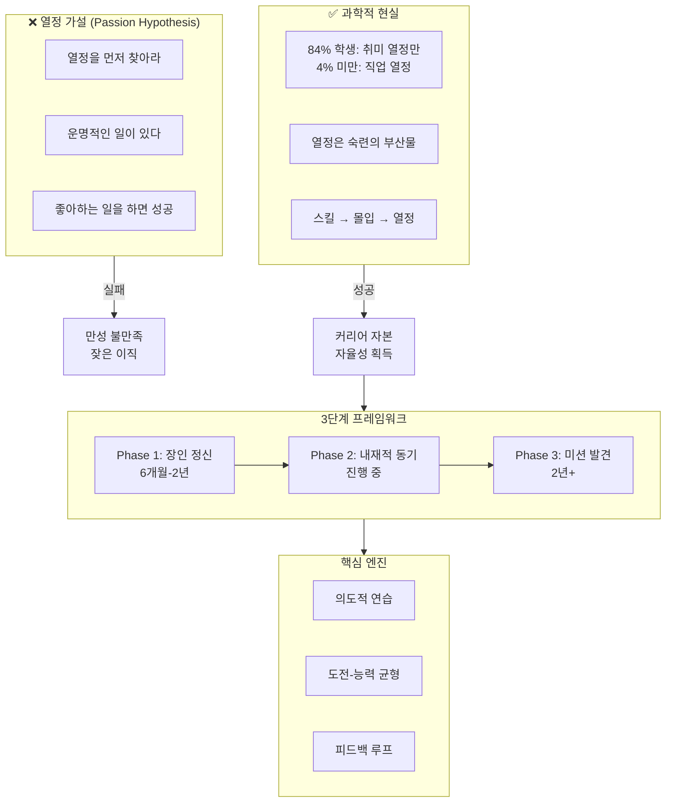
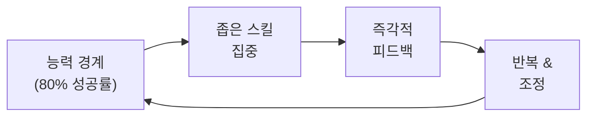
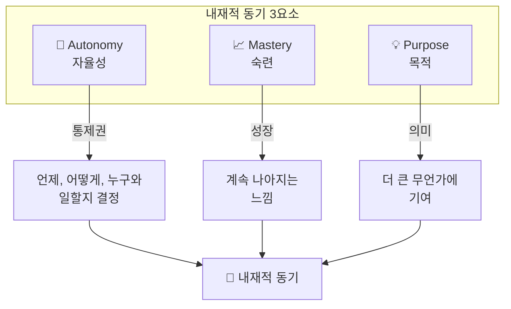
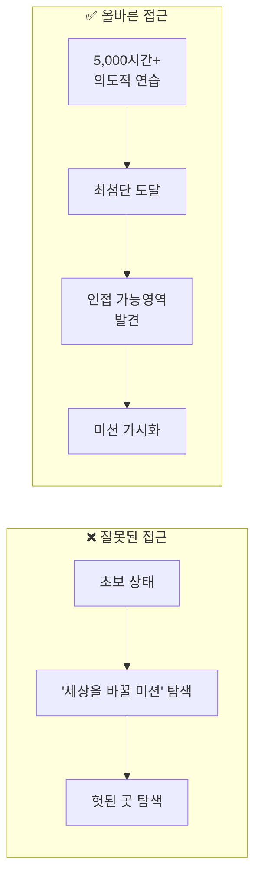
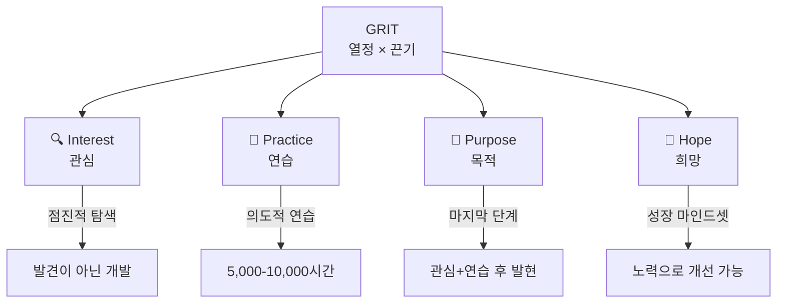

# 열정을 키우고 몰입하는 법
> 6권의 책에서 추출한 과학적 프레임워크

**핵심 질문**: 어떻게 하면 좋아하는 일을 찾고, 그 일에 깊이 몰입할 수 있는가?

**한 줄 답변**: ==먼저 스킬을 쌓아 몰입을 경험하고, 그 과정에서 발견한 흥미를 장기적 목적과 연결하라==

---

## 목차
- [[#Book on a Page]]
- [[#패러다임 전환]]
- [[#Part 1 - 장인 정신으로 스킬 구축]]
- [[#Part 2 - 내재적 동기 활성화]]
- [[#Part 3 - 미션 발견과 장기 지속]]
- [[#통합 액션 프레임워크]]
- [[#자가 진단 체크리스트]]
- [[#흔한 함정과 대안]]
- [[#용어 사전]]
- [[#셀프 테스트]]
- [[#내 생각 & 연결]]
- [[#복습 로그]]
- [[#보충자료]]

---

## Book on a Page



### 핵심 공식

| 개념 | 공식 | 출처 |
|------|------|------|
| **Grit** | 열정 × 끈기 | Duckworth |
| **노력의 복리** | 노력 × 재능 = 스킬<br>노력 × 스킬 = 성취 | Duckworth |
| **내재적 동기** | 자율성 + 숙련 + 목적 | Pink |
| **몰입 조건** | 명확한 목표 + 피드백 + 도전≈능력 | Csikszentmihalyi |
| **커리어 자본** | 희귀한 스킬 = 좋은 커리어의 통화 | Newport |

---

## 패러다임 전환

| Before | After |
|--------|-------|
| "열정을 먼저 찾고, 그 열정을 따라가라" | "가치 있는 스킬을 만들고, 몰입하며 연습하고, 그 과정에서 열정을 발견하라" |

> [!important] 핵심 통찰
> **84%의 대학생이 취미 관련 열정만 가지고 있으며 직업 관련 열정은 4% 미만이다.** 열정은 찾는 것이 아니라 만들어지는 것이다. (Newport, 2012 - 캐나다 대학생 539명 연구)

### 인과 관계의 방향

```
❌ 열정 → 노력 → 성공 (잘못된 믿음)
✅ 노력 → 숙련 → 몰입 → 열정 → 성공 (과학적 검증)
```

---

## Part 1 - 장인 정신으로 스킬 구축
🟢 **Phase 1** | 6개월 - 2년 | 핵심 책: So Good They Can't Ignore You, Grit, Flow

### 핵심 질문
- 내가 세상에 제공할 수 있는 희귀한 가치는 무엇인가?
- 지금 80% 성공률인 도전적 영역은 어디인가?

### 장인 정신(Craftsman Mindset) vs 열정 마인드셋

| 장인 정신 | 열정 마인드셋 |
|-----------|--------------|
| "내가 세상에 무엇을 줄 수 있나?" | "세상이 나에게 무엇을 줄 수 있나?" |
| 스킬 구축에 집중 | 만족감 찾기에 집중 |
| 측정 가능한 개선 | 막연한 열정 탐색 |
| 장기적 성장 | 즉각적 만족 |

### 커리어 자본 이론

> **커리어 자본(Career Capital)**: 희귀하고 가치 있는 스킬. 좋은 커리어의 "통화"로, 이것으로 자율성, 영향력, 미션을 "구매"할 수 있다.

**실천법**:
1. 현재 영역에서 희귀하고 가치 있는 스킬 1-2개 선택
2. 내 스킬의 시장 희귀성 평가 (대체 가능한가?)
3. 희귀성 높이는 방향으로 의도적 연습

### 의도적 연습(Deliberate Practice)

> [!warning] Naive Practice의 함정
> 이미 잘하는 것만 반복하면 10,000시간을 해도 개선 없음. 뇌는 도전 없이 성장하지 않는다.

**의도적 연습의 구성요소**:



| 요소 | 설명 | 실천 |
|------|------|------|
| **능력 경계** | 너무 쉽지도, 어렵지도 않은 지점 | 80% 성공률 난이도 선택 |
| **좁은 스킬** | 하나의 세부 스킬에 집중 | 실패 패턴 분석 후 그 부분만 연습 |
| **즉각적 피드백** | 결과를 빠르게 확인 | 코치, 데이터, 녹화로 확인 |
| **반복** | 불편함 속에서 반복 | 편안해지면 난이도 상향 |

### 몰입(Flow) 조건 설계

**몰입 = 도전 수준 ≈ 능력 수준**

| 상태 | 도전 vs 능력 | 해결책 |
|------|-------------|--------|
| 😰 불안 | 도전 >> 능력 | 단계 쪼개기, 스킬 업 |
| 😐 지루함 | 도전 << 능력 | 제약 추가, 난이도 상향 |
| 🔥 몰입 | 도전 ≈ 능력 | 이 상태 유지! |

> [!tip] 놀라운 발견
> 일에서 **54%** 몰입 경험 vs 여가에서 **18%**. 여가가 아닌 일에서 몰입이 더 쉽다. 일은 게임처럼 구조화되어 있기 때문. (Csikszentmihalyi 연구)

### 한 줄 요약
> 열정을 찾지 말고, 희귀한 스킬을 쌓아라. 스킬이 쌓이면 몰입이 오고, 몰입이 오면 열정이 따라온다.

---

## Part 2 - 내재적 동기 활성화
🟡 **Phase 2** | 진행 중 | 핵심 책: Drive, Finding Flow, The Passion Paradox

### 핵심 질문
- 내 일에서 자율성, 숙련, 목적 중 무엇이 부족한가?
- 내 열정은 조화로운가, 집착적인가?

### AMP 프레임워크 (자율성-숙련-목적)



| 요소 | 정의 | 부족 시 증상 | 실천법 |
|------|------|-------------|--------|
| **자율성** | 일하는 방식·시간·장소 통제권 | 무기력, 수동성 | 스킬로 협상력 확보 |
| **숙련** | 계속 더 나아지는 느낌 | 정체감, 지루함 | 주간 1% 개선 목표 |
| **목적** | 더 큰 의미에 기여 | 공허함, 회의 | 내 일이 누구를 돕는지 명확히 |

### Type I vs Type X 행동

| Type X (외재적) | Type I (내재적) |
|----------------|-----------------|
| 연봉, 승진, 인정 추구 | 성장, 기여, 의미 추구 |
| 보상 사라지면 동기 소멸 | 활동 자체가 보상 |
| 창의적 작업에서 성과 저하 | 지속 가능한 고성과 |

> [!warning] 보상의 역설
> 창의적·인지적 작업에서 **외적 보상(보너스)은 오히려 성과를 저하**시킨다. 단순 반복 작업에서만 효과적. (Pink, 2009)

### 조화로운 열정 vs 집착적 열정

| 조화로운 열정 | 집착적 열정 |
|--------------|------------|
| 일이 정체성의 **일부** | 일이 정체성을 **지배** |
| 일 외 삶이 존재 | 일 없이는 존재 의미 없음 |
| 지속 가능한 몰입 | 번아웃, 관계 파괴 |
| 자기 선택 | 통제 불능 충동 |

**자가 진단**: "이 일을 못하게 되면 나는 누구인가?"
- "아무것도 아니다" → ⚠️ 집착적 열정 위험
- "다른 측면도 있다" → ✅ 조화로운 열정

> [!important] 열정의 어원
> 라틴어 *passio* = **고통**. 열정과 중독은 같은 도파민 메커니즘을 공유한다. 경계 없는 열정은 고통이 된다. (Stulberg, 2019)

### 균형의 역설

> **깊은 열정과 균형 잡힌 삶은 양립하기 어렵다.** 완벽한 균형을 찾으려 하지 말고, 몰입할 때와 쉴 때를 **의도적으로 구분**하라.

### 한 줄 요약
> 외적 보상이 아닌 자율성·숙련·목적을 추구하라. 단, 열정이 정체성을 지배하지 않도록 경계를 설정하라.

---

## Part 3 - 미션 발견과 장기 지속
🔴 **Phase 3** | 2년+ | 핵심 책: So Good They Can't Ignore You, Grit

### 핵심 질문
- 내 분야의 최첨단(인접 가능영역)은 어디인가?
- 장기 목표 1개는 무엇이고, 희망을 어떻게 유지하는가?

### 인접 가능영역(Adjacent Possible)

> **미션은 충분한 커리어 자본을 쌓은 후, 분야의 최첨단에서만 발견된다.** 초보 상태에서는 다음 혁신이 보이지 않는다.



### Little Bets 전략

> 큰 미션을 **작은 실험들**로 검증. 실패 비용 낮추고 학습 속도 높임.

**실천법**:
1. 새 방향 시도 시 전체 시간의 **10-20%만** 투자
2. **3개월** 테스트 후 피드백으로 결정
3. 성공 신호 있으면 확장, 없으면 폐기

### Grit의 4가지 심리적 자산



| 자산 | 정의 | 개발 방법 |
|------|------|----------|
| **관심** | 좋아하는 것 | 다양한 시도 → 점진적 심화 |
| **연습** | 의도적 연습 | 피드백 + 불편함 영역 반복 |
| **목적** | 타인 기여 | 내 스킬이 누구를 돕는지 연결 |
| **희망** | 노력 → 개선 믿음 | 성장 마인드셋, 낙관적 자기대화 |

> [!tip] 희망의 정의
> "내 **노력으로** 미래를 개선할 수 있다는 기대." 상황이 저절로 좋아지길 바라는 것이 아님. (Duckworth)

### 노력은 두 번 카운트된다

```
재능 × 노력 = 스킬
스킬 × 노력 = 성취
∴ 성취 = 재능 × 노력²
```

> 노력은 **선형이 아닌 기하급수적** 효과. 초기 투자가 후기 수익을 결정한다.

### 한 줄 요약
> 미션은 5,000시간 이후에 발견된다. Little Bets로 검증하고, 희망(노력→개선 믿음)으로 지속하라.

---

## 통합 액션 프레임워크

### 매일 실천 (Daily)

| # | 실천 | 체크 |
|---|------|------|
| 1 | 의도적 연습 1시간: 80% 성공률 난이도에서 불편함 느끼며 | ☐ |
| 2 | 몰입 체크인: 시간 감각 잃은 순간 기록 | ☐ |
| 3 | 진전 측정: 측정 가능한 개선 1가지 기록 | ☐ |
| 4 | 도전-능력 재조정: 너무 쉬우면 제약↑, 어려우면 단계↓ | ☐ |
| 5 | 최상위 목표 연결: 오늘이 장기 목표에 어떻게 기여? | ☐ |

### 매주 실천 (Weekly)

| # | 실천 | 체크 |
|---|------|------|
| 1 | 커리어 자본 점검: 내 스킬이 얼마나 희귀해졌나? | ☐ |
| 2 | AMP 체크: 자율성/숙련/목적 중 부족한 요소 보완 | ☐ |
| 3 | Little Bet 실행: 10-20% 시간으로 새 방향 실험 | ☐ |
| 4 | 도파민 중독 점검: 일 외 활동 시간 확보했는가? | ☐ |
| 5 | 피드백 루프: 실패 패턴 분석 → 다음 주 집중 영역 | ☐ |

### 마인드셋 전환

| From | To |
|------|-----|
| "좋아하는 일 찾기" | "가치 있는 스킬 만들기" |
| "이미 잘하는 것 연습" | "경계에서 불편한 것 연습" |
| "연봉, 승진 추구" | "자율성, 숙련, 목적 추구" |
| "운명적 일 찾기" | "스킬이 쌓이며 사랑하게 되는 일" |
| "타고난 재능" | "노력 × 노력 = 성취" |
| "완벽한 일-삶 균형" | "몰입 시간 / 쉬는 시간 명확히 구분" |
| "성공/실패 이분법" | "매일 1% 나아지는 게임" |

---

## 자가 진단 체크리스트

### Q1. 현재 일에서 몰입(시간 감각 상실)을 경험하는가?
- ✅ Yes → Phase 2로 이동. 자율성·목적 연결에 집중
- ❌ No → Phase 1 필요. 도전-능력 균형 맞추기, 의도적 연습으로 스킬 구축

### Q2. 일을 못하게 되면 "나는 누구인가?"라는 생각이 드는가?
- ✅ Yes → ⚠️ 집착적 열정 위험. 일 외 정체성 구축, 경계 설정 필요
- ❌ No → 조화로운 열정. Phase 3 (미션 발견) 탐색 가능

### Q3. 내 스킬이 시장에서 희귀하고 대체 불가능한가?
- ✅ Yes → 커리어 자본 충분. 자율성 협상, 미션 탐색 가능
- ❌ No → 최소 2년간 의도적 연습 필요. 자율성 추구는 위험

### Q4. 연습할 때 불편함(stretch)을 느끼는가?
- ✅ Yes → 올바른 의도적 연습. 피드백 루프 유지
- ❌ No → Naive practice. 난이도 올려서 80% 성공률 영역으로

### Q5. "좋아하는 일"을 찾아야 한다는 압박을 느끼는가?
- ✅ Yes → Passion Hypothesis 함정. Craftsman Mindset으로 전환
- ❌ No → 올바른 방향. 현재 일에서 가치 창출에 집중 중

### Q6. 지난 6개월간 측정 가능한 스킬 개선이 있었는가?
- ✅ Yes → 성장 궤도. 목적(Purpose) 연결 강화
- ❌ No → 정체 상태. 피드백 메커니즘 구축 필요

### Q7. 현재 일에서 자율성(방식, 시간, 장소 선택권)이 있는가?
- ✅ Yes → 스킬로 얻은 자율성. 목적과 미션으로 확장
- ❌ No → 커리어 자본으로 협상하거나, 먼저 자본 구축

---

## 흔한 함정과 대안

### 1. 자본 없는 자율성 추구 (Autonomy Trap)
| 위험 | 대안 |
|------|------|
| 스킬 없이 프리랜서, 창업 시도 → 시장에서 가치 못 줌 | 최소 2년간 커리어 자본 구축 후 자율성 협상 |

### 2. Naive Practice (편안한 연습)
| 위험 | 대안 |
|------|------|
| 잘하는 것만 반복 → 10,000시간 해도 성장 없음 | 80% 성공률 난이도, 실패 패턴 집중 연습 |

### 3. Passion Hypothesis 맹신
| 위험 | 대안 |
|------|------|
| "운명적 일" 찾다 시간 낭비 | 현재 일에서 희귀 스킬 연마 → 열정은 따라옴 |

### 4. 외적 동기만 추구 (Type X)
| 위험 | 대안 |
|------|------|
| 연봉·승진만 추구 → 창의적 성과 저하 | AMP(자율성-숙련-목적) 추구 |

### 5. 미션 조급증 (Mission Rush)
| 위험 | 대안 |
|------|------|
| 초보 상태에서 미션 찾기 → 헛된 탐색 | 5,000시간 후 Little Bets로 검증 |

### 6. 집착적 열정으로 번아웃
| 위험 | 대안 |
|------|------|
| 일 = 전체 정체성 → 관계 파괴, 건강 악화 | 조화로운 열정 유지, 일 외 활동·관계 투자 |

### 7. 피드백 없는 연습
| 위험 | 대안 |
|------|------|
| 진전 측정 안 함 → 방향 모르고 지루해짐 | 주간 지표 설정, 실패 패턴 기록, 코치/멘토 활용 |

### 8. 균형 집착 (Balance Obsession)
| 위험 | 대안 |
|------|------|
| 완벽한 균형 찾다 둘 다 못 얻음 | 의도적 경계: 몰입/휴식 시간 블록 구분 |

---

## 용어 사전

| 용어 | 정의 | 출처 |
|------|------|------|
| **Craftsman Mindset** | 세상에 무엇을 제공할 수 있는지에 집중하는 태도 | Newport |
| **Career Capital** | 희귀하고 가치 있는 스킬, 좋은 커리어의 "통화" | Newport |
| **Deliberate Practice** | 능력 경계에서 좁은 스킬 + 즉각적 피드백 + 반복 | Newport, Duckworth |
| **Flow State** | 활동에 완전히 몰두하여 시간 감각을 잃는 상태 | Csikszentmihalyi |
| **AMP** | Autonomy(자율성) + Mastery(숙련) + Purpose(목적) | Pink |
| **Grit** | 장기 목표에 대한 열정과 끈기 | Duckworth |
| **Adjacent Possible** | 현재 최첨단에서만 보이는 다음 혁신의 영역 | Newport |
| **Little Bets** | 작은 실험으로 미션/방향을 검증하는 전략 | Newport |
| **Autotelic Personality** | 외부 보상 없이 활동 자체에서 목적을 찾는 성격 | Csikszentmihalyi |
| **Harmonious Passion** | 일이 정체성의 일부인 건강한 열정 | Stulberg |
| **Obsessive Passion** | 일이 정체성을 지배하는 위험한 열정 | Stulberg |
| **Type I / Type X** | 내재적 동기(I) vs 외재적 동기(X) 행동 유형 | Pink |

---

## 셀프 테스트

### 기억 (Remember)
1. 열정 가설(Passion Hypothesis)이란 무엇이며, 왜 문제인가?
2. 의도적 연습의 4가지 구성요소는?
3. AMP가 각각 의미하는 것은?

### 이해 (Understand)
4. "노력은 두 번 카운트된다"는 말의 의미를 설명하라.
5. 왜 여가(18%)보다 일(54%)에서 몰입을 더 많이 경험하는가?
6. 조화로운 열정과 집착적 열정의 차이는?

### 적용 (Apply)
7. 당신의 현재 일에서 80% 성공률인 도전 영역은 무엇인가?
8. AMP 중 가장 부족한 요소는? 어떻게 보완할 것인가?
9. Little Bets로 테스트할 수 있는 새로운 방향은?

### 분석 (Analyze)
10. 당신의 커리어 자본(희귀한 스킬)은 무엇인가? 얼마나 대체 가능한가?
11. 현재 열정이 조화로운지 집착적인지 어떻게 판단할 수 있는가?
12. 6권의 책에서 공통으로 강조하는 "핵심 엔진"은 무엇인가?

### 평가 (Evaluate)
13. "열정을 따르라"는 조언이 여전히 유효한 상황이 있다면?
14. Phase 1(스킬 구축)을 건너뛰고 Phase 3(미션)으로 가려는 사람에게 조언은?
15. 6권 중 당신 상황에 가장 필요한 책 1권과 그 이유는?

---

## 내 생각 & 연결

### 기존 믿음 vs 새로운 이해

| 이전 | 이후 |
|------|------|
| 열정적인 사람은 타고난 것 | 열정은 숙련의 부산물, 개발 가능 |
| 좋아하는 일을 찾아야 행복 | 잘하게 되면 좋아하게 됨 |
| 균형 잡힌 삶이 최선 | 의도적 불균형 (몰입↔휴식) |

### 개인적 적용

**나의 현재 Phase**: ____
**가장 부족한 요소**: ____
**이번 달 집중할 의도적 연습 영역**: ____
**나의 80% 성공률 도전**: ____

### 관련 노트 연결

- [[생산성]] - 계획은 잘 세우지만 실행이 어려운 이유
- [[습관]] - 의도적 연습을 습관화하는 방법
- [[번아웃]] - 집착적 열정의 위험성
- [[커리어]] - 커리어 자본 관점에서 경력 설계

---

## 복습 로그

| 회차 | 날짜 | 기억난 핵심 | 새로 깨달은 것 | 다음 실천 |
|------|------|------------|---------------|----------|
| 1 | +1일 | | | |
| 2 | +7일 | | | |
| 3 | +30일 | | | |

---

## 보충자료

### 핵심 책 (심층 분석)

| 책 | 저자 | 핵심 기여 | 링크 |
|----|------|----------|------|
| So Good They Can't Ignore You | Cal Newport | Craftsman Mindset, Career Capital, Adjacent Possible | [Goodreads](https://www.goodreads.com/book/show/13525945-so-good-they-can-t-ignore-you) |
| Drive | Daniel Pink | AMP 프레임워크, Type I/X, Motivation 3.0 | [danpink.com](https://www.danpink.com/books/drive/) |

### 보충 책 (핵심만)

| 책 | 저자 | 핵심 기여 |
|----|------|----------|
| Flow | Csikszentmihalyi | 몰입 조건, Autotelic Personality |
| Finding Flow | Csikszentmihalyi | 일상에서 몰입 찾기, 일>여가 역설 |
| Grit | Angela Duckworth | 4가지 심리적 자산, 노력의 복리 효과 |
| The Passion Paradox | Stulberg & Magness | 조화로운 vs 집착적 열정, 도파민 메커니즘 |

### 웹 자료

- [Cal Newport 요약](https://calvinrosser.com/notes/so-good-they-cant-ignore-you/) - So Good They Can't Ignore You 상세 요약
- [Drive 핵심 원칙](https://www.bitesizelearning.co.uk/resources/autonomy-mastery-purpose-motivation-pink) - AMP 프레임워크 실용 가이드
- [Grit 요약](https://readingraphics.com/book-summary-grit-the-power-of-passion-and-perseverance/) - 4가지 심리적 자산 상세

### 관련 연구

- Vallerand (2002): 캐나다 대학생 539명 열정 연구 - 84% 취미 열정, 4% 미만 직업 열정
- Csikszentmihalyi: 일에서 54% 몰입 vs 여가 18% (ESM 연구)
- Duckworth: West Point 사관학교 Grit Scale 연구 - 재능보다 Grit이 생존 예측

---

> [!quote] 핵심 명언
> "Be so good they can't ignore you." — Steve Martin
>
> "Working right trumps finding the right work." — Cal Newport
>
> "Control of consciousness determines the quality of life." — Csikszentmihalyi
>
> "Passion for your work is a little bit of discovery, followed by a lot of development, and then a lifetime of deepening." — Angela Duckworth