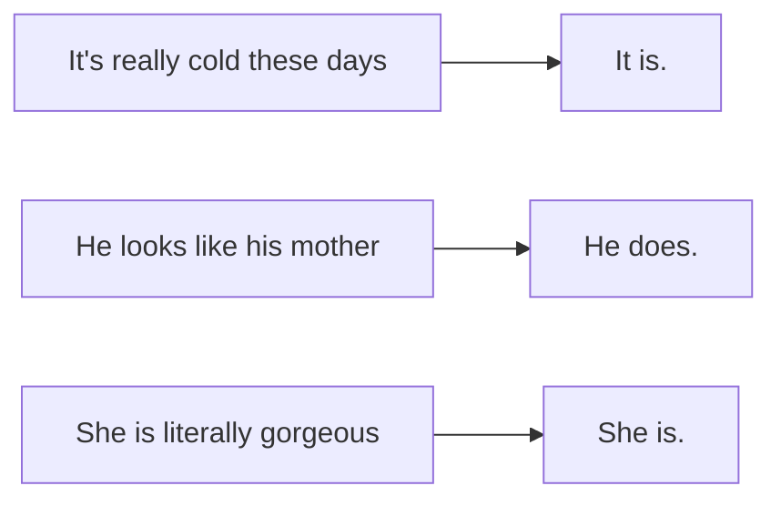
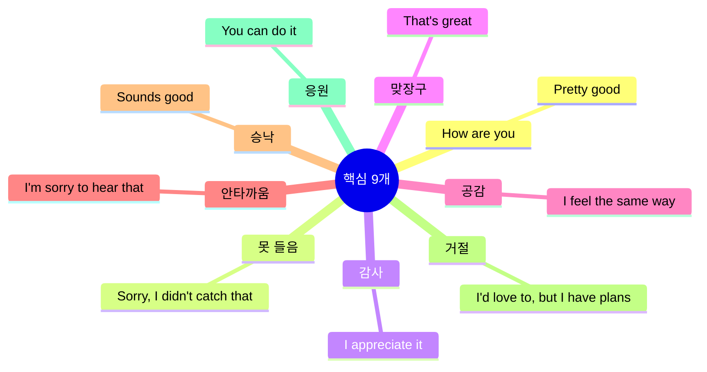
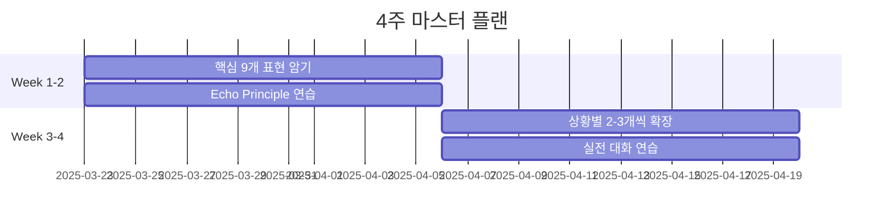

# 영어 리액션 70개 완전 정복

> [!info] 핵심 요약
> 짧은 리액션만 잘해도 대화가 훨씬 쉬워진다. 9가지 상황별 70+개 표현을 상대방의 **주어+동사를 그대로 반복**하는 원칙과 함께 익히면 해외에서 바로 써먹을 수 있다.

<iframe width="100%" height="400" src="https://www.youtube.com/embed/ZdI4WKVMkEY" frameborder="0" allowfullscreen></iframe>

---

## 목차

1. [[#리액션의 황금 원칙 Echo Principle|리액션의 황금 원칙]]
2. [[#1 How are you 대답 🟢|How are you 대답]]
3. [[#2 못 알아들었을 때 🟢|못 알아들었을 때]]
4. [[#3 감사할 때 🟢|감사할 때]]
5. [[#4 맞장구 쳐 줄 때 🟡|맞장구 쳐 줄 때]]
6. [[#5 공감될 때 🟡|공감될 때]]
7. [[#6 안타까울 때 🟢|안타까울 때]]
8. [[#7 좋다고 할 때 승낙 🟡|좋다고 할 때]]
9. [[#8 거절할 때 🔴|거절할 때]]
10. [[#9 응원할 때 🟢|응원할 때]]
11. [[#우선 암기 9선|우선 암기 9선]]

---

## 리액션의 황금 원칙: Echo Principle

> [!tip] 가장 쉬운 리액션 = 상대방의 주어+동사 반복

상대방이 한 말의 **주어와 동사(또는 be동사/조동사)**를 그대로 사용하면 자연스러운 리액션이 된다.

| 상대방 발화 | 리액션 | 원리 |
|------------|--------|------|
| "It's really cold these days" | **It is.** | be동사(is) 반복 |
| "He looks like his mother" | **He does.** | 일반동사 → do/does로 |
| "She is literally gorgeous" | **She is.** | be동사(is) 반복 |

이 원칙만 알아도 **즉석에서 리액션 생성** 가능!

---

## 1. How are you 대답 🟢

> [!warning] 필수 규칙
> 답변 후 **반드시 "And you?" 또는 "How are you?"로 되묻기**. 안 물어보면 "안녕하세요" 하고 지나가는 것과 같다.

<iframe width="100%" height="200" src="https://www.youtube.com/embed/ZdI4WKVMkEY?start=51&end=180" frameborder="0" allowfullscreen></iframe>

| 표현 | 뜻 | 뉘앙스 | 예시 |
|------|-----|--------|------|
| **Good** / **Pretty good** | 좋아, 괜찮아 | 가장 기본, 무난 | "Good, thanks. And you?" |
| **Not bad** | 나쁘지 않아 | 중립적 긍정 | "Not bad, yourself?" |
| **Not good** | 좋지 않아 | ⚠️ 심각한 상황 암시 | 가벼운 대화에서는 피하기 |
| **Couldn't be better** | 이보다 좋을 순 없어 | ★ 최상의 기분 | "Couldn't be better!" |
| **I can't complain** | 불평할 게 없어 | 평범하지만 만족 | "I can't complain." |
| **I'm doing fine/okay** | 잘 지내요, 별일 없어 | 정중하고 자연스러움 | "I'm doing fine, thanks." |
| **Same as usual** | 평소랑 똑같지 뭐 | 일상적, 캐주얼 | "Same as usual, you know." |

> [!example] 실전 팁
> 기분이 안 좋더라도 **"Couldn't be better"**라고 말하면 진짜 기분이 나아질 수 있다. (영상 제작자의 실제 경험담)

---

## 2. 못 알아들었을 때 🟢

> [!info] 당당하게 물어보기
> 원어민들은 다시 말해달라는 요청을 무례하게 생각하지 않는다. 못 알아듣고 넘어가는 것보다 물어보는 게 훨씬 낫다.

<iframe width="100%" height="200" src="https://www.youtube.com/embed/ZdI4WKVMkEY?start=180&end=360" frameborder="0" allowfullscreen></iframe>

| 표현 | 뜻 | 격식 | 주의점 |
|------|-----|------|--------|
| **What is/was that?** | 뭐라고요? | casual | 친한 사이에서만 |
| **Can you say that again?** | 다시 말해주실래요? | neutral | could 쓰면 더 정중 |
| **Come again** | 뭐라고? | casual | 친구 사이에서만 |
| **Sorry, I didn't catch that** | 죄송, 못 들었어요 | polite | ★ 가장 무난 |
| **Sorry, I missed that** | 방금 놓쳤어요 | polite | 집중 못 했을 때 |
| **Sorry, the last part** | 마지막 부분 뭐라고요? | neutral | 특정 부분만 놓쳤을 때 |
| **Excuse me?** | 뭐라고요? | neutral | ⚠️ 억양 주의 (무례하게 들릴 수 있음) |
| **I didn't get it** | 이해 못 했어요 | casual | 의미를 모를 때 |
| **Can you speak a little slower?** | 천천히 말해주실래요? | polite | ★ 당당하게 요청하기 |

> [!tip] 만능 문장
> **"Sorry, I didn't catch that. Could you say that again, please?"**
> 이 문장 하나면 모든 상황에서 정중하게 재요청 가능!

---

## 3. 감사할 때 🟢

> [!info] Thank you를 넘어서
> 단순히 "Thank you"만 반복하지 말고, 뒤에 한 마디 더 붙이면 감사의 깊이가 3배!

<iframe width="100%" height="200" src="https://www.youtube.com/embed/ZdI4WKVMkEY?start=360&end=540" frameborder="0" allowfullscreen></iframe>

| 표현 | 뜻 | 강도 | 상황 |
|------|-----|------|------|
| **Thank you for your help/kindness** | 도와주셔서/친절하게 감사해요 | ★★ | 구체적 행동에 감사 |
| **I appreciate it** | 감사합니다 | ★★★ | 상황/행동에 감사 (사람이 아닌 it 대상) |
| **You made my day** | 덕분에 오늘 하루가 최고예요 | ★★★★ | 큰 기쁨을 줬을 때 |
| **You saved me** | 덕분에 살았어요 | ★★★★ | 큰 도움을 받았을 때 |
| **I can't thank you enough** | 뭐라 감사해야 할지 모르겠어요 | ★★★★★ | 매우 큰 감사 |
| **Thanks a million** | 정말 고마워요 | ★★★ | 과장된 감사 (캐주얼) |
| **That's very kind of you** | 친절하시네요, 감사해요 | ★★★ | 상대 친절함 인정 |

> [!example] 레벨업 공식
> **"Thank you. I appreciate it."**
> Thank you(사람에게) + I appreciate it(행동에) = 감사 3배 전달!

---

## 4. 맞장구 쳐 줄 때 🟡

> [!info] "부럽다" = Good for you
> 한국어로 "부럽다"라고 할 때 I'm jealous보다 **Good for you**가 더 자연스럽다.

<iframe width="100%" height="200" src="https://www.youtube.com/embed/ZdI4WKVMkEY?start=540&end=720" frameborder="0" allowfullscreen></iframe>

| 표현 | 뜻 | 사용 상황 |
|------|-----|----------|
| **Good for you** | 잘됐다, 잘했네 | 상대 성취 축하 ("부럽다" 대체) |
| **That's great/awesome** | 멋지다, 대박 | 긍정적 소식에 반응 |
| **I'm glad to hear that** | 그 얘기 들으니 기뻐요 | 좋은 소식에 공감 |
| **You deserve it** | 넌 그럴 자격 있어 | 당연한 성취 인정 |
| **I knew you could do it** | 네가 해낼 줄 알았어 | 예상했던 성공 축하 |
| **Lucky you** | 운 좋다, 잘됐네 | 행운에 대한 반응 |
| **That sounds amazing** | 진짜 멋진데 | 계획/경험에 반응 |
| **That must have been fun** | 재밌었겠다 | ★ 과거 경험에 공감 |

> [!example] 실전 대화
> A: "나 이번 주말에 제주도 갔다 왔어"
> B: **"That must have been fun!"** (재밌었겠다!)

---

## 5. 공감될 때 🟡

> [!warning] 직역 함정 주의
> **"Tell me about it"** = "말해봐" ❌ → "내 말이!" ✅
> **"You can say that again"** = "다시 말해" ❌ → "두 말하면 잔소리" ✅

<iframe width="100%" height="200" src="https://www.youtube.com/embed/ZdI4WKVMkEY?start=720&end=900" frameborder="0" allowfullscreen></iframe>

| 표현 | 뜻 | 주의점 |
|------|-----|--------|
| **I feel the same way** | 저도 같은 마음이에요 | 감정적 공감 |
| **Tell me about it** | 내 말이! 완전 공감 | ⚠️ 직역 아님 |
| **I was just about to say that** | 나 딱 그 말 하려고 했는데 | 같은 생각 표현 |
| **That's exactly how I feel** | 제 기분이 딱 그래요 | 정확히 같은 감정 |
| **I was thinking the same thing** | 저도 같은 생각 중이었어요 | 동일한 생각 |
| **I can relate to that** | 공감돼요, 저도 그런 적 있어요 | 비슷한 경험 |
| **You can say that again** | 두 말하면 잔소리 | ⚠️ 직역 아님, 강한 동의 |
| **I can't argue with that** | 반박 불가, 완전 동의 | 논리적 동의 |

> [!example] 실전 대화
> A: "야, 요새 물가 미친 거 같지 않아?"
> B: **"Tell me about it!"** (내 말이! 물가 진짜 비싸)

---

## 6. 안타까울 때 🟢

<iframe width="100%" height="200" src="https://www.youtube.com/embed/ZdI4WKVMkEY?start=900&end=1080" frameborder="0" allowfullscreen></iframe>

| 표현 | 뜻 | 사용 상황 |
|------|-----|----------|
| **I'm sorry to hear that** | 그 말 들으니 유감이에요 | ★ 가장 범용적 위로 |
| **Too bad** | 아쉽네요 | 가벼운 아쉬움 |
| **That's a bummer** | 아쉽다 | 캐주얼, 친구 사이 |
| **What a shame/pity** | 아깝다, 아쉽다 | 안타까운 상황 |
| **You must have had a hard time** | 힘들었겠다 | 과거 어려움 공감 |
| **That must be tough** | 힘들겠다, 고생하네 | 현재 어려움 공감 |

> [!tip] 위로 + 응원 조합
> **"That must be tough. Hang in there!"**
> (힘들겠다. 조금만 버텨!)

---

## 7. 좋다고 할 때 (승낙) 🟡

<iframe width="100%" height="200" src="https://www.youtube.com/embed/ZdI4WKVMkEY?start=1080&end=1260" frameborder="0" allowfullscreen></iframe>

| 표현 | 뜻 | 사용 상황 |
|------|-----|----------|
| **I love it** | 너무 좋아요 | 아이디어/제안/선물 |
| **Sounds good** | 좋아요 | ★ 제안에 동의 |
| **That sounds like a plan** | 그렇게 하자 | 계획에 동의 |
| **I'm down for it / I'm up for it** | 좋아, 나도 할래 | 참여 의사 |
| **Count me in** | 나도 껴줘 | 참여 희망 |
| **I'm all for it** | 완전 찬성 | 강한 찬성 |

> [!example] 실전 대화
> A: "이번 주 캠핑 갈래?"
> B: **"I'm down for it!"** (좋아, 갈래!)

---

## 8. 거절할 때 🔴

> [!warning] 정중함이 핵심
> 거절은 문화적으로 민감한 영역. **I'd love to, but...**처럼 긍정 + 이유 구조가 안전하다.

<iframe width="100%" height="200" src="https://www.youtube.com/embed/ZdI4WKVMkEY?start=1260&end=1440" frameborder="0" allowfullscreen></iframe>

| 표현 | 뜻 | 정중도 |
|------|-----|--------|
| **I'd love to, but I have plans** | 좋은데 약속이 있어요 | ★★★★★ 가장 정중 |
| **I'm good, thank you** | 괜찮아요 | ★★★★ |
| **I can't this time** | 이번엔 안 되겠어요 | ★★★ |
| **I'm afraid I can't** | 유감이지만 안 돼요 | ★★★★ |
| **Maybe next time** | 다음에 하자 | ★★★ |
| **I'd rather not say** | 말하고 싶지 않아요 | ★★★★ 민감한 질문에 |

> [!tip] 거절 공식
> **긍정적 시작 + 이유 + 대안 제시**
> "I'd love to, but I have plans. Maybe next time?"

---

## 9. 응원할 때 🟢

<iframe width="100%" height="200" src="https://www.youtube.com/embed/ZdI4WKVMkEY?start=1440&end=1620" frameborder="0" allowfullscreen></iframe>

| 표현 | 뜻 | 사용 상황 |
|------|-----|----------|
| **You can do it / You've got this** | 넌 할 수 있어 | 자신감 북돋움 |
| **Go for it** | 해봐, 도전해봐 | 도전 격려 |
| **I'm rooting for you** | 널 응원해 | 지지 표현 |
| **Hang in there** | 조금만 버텨봐 | 어려운 시기 격려 |
| **You're doing great** | 잘하고 있어 | 현재 노력 인정 |
| **I've got your back** | 내가 있잖아, 난 네 편이야 | 지지와 보호 |
| **Keep it up / Keep up the good work** | 계속해, 지금처럼만 해 | 지속 격려 |
| **I'm on your side** | 난 네 편이야 | 편들어줌 |
| **It will all work out** | 다 잘될 거야 | ★ 긍정적 위로 |

> [!example] 응원 조합
> **"Don't worry. I've got your back. It will all work out."**
> (걱정마. 내가 있잖아. 다 잘될 거야.)

---

## 우선 암기 9선

> [!success] 이것만 외우면 70% 상황 커버

| 상황 | 우선 표현 | 발음 팁 |
|------|----------|---------|
| How are you | **Pretty good** | 프리리 굿 |
| 못 알아들음 | **Sorry, I didn't catch that** | 쏘뤼 아이 디든 캐치 댓 |
| 감사 | **I appreciate it** | 아이 어프뤼시에잇 |
| 맞장구 | **That's great** | 댓츠 그뤠잇 |
| 공감 | **I feel the same way** | 아이 필 더 쎄임 웨이 |
| 안타까움 | **I'm sorry to hear that** | 아임 쏘뤼 투 히어 댓 |
| 승낙 | **Sounds good** | 싸운즈 굿 |
| 거절 | **I'd love to, but I have plans** | 아이드 러브 투 벗 아이 해브 플랜즈 |
| 응원 | **You can do it** | 유 캔 두 잇 |

---

## 학습 전략

### 흔한 실수 3가지

1. **직역 함정**: "Tell me about it" → "말해봐" ❌ (실제: "내 말이!")
2. **격식 무시**: 공식 석상에서 "Come again" 사용 ❌
3. **되묻기 누락**: How are you 답하고 "And you?" 안 함 ❌

---

## 내 생각 & 연결

- 이 영상의 Echo Principle은 [[Narrative Tenses]]에서 배운 시제 일치와 연결됨
- 감사 표현들은 [[writing-coach/error-profile]]에서 다룬 정중함 수준과 관련
- 리액션 표현은 실제 대화에서 **think time**을 벌어주는 역할도 함

---

## 셀프테스트

> [!question] 다음 상황에 적절한 리액션은?

1. 친구가 "나 승진했어!"라고 했을 때 → ?
2. 상대방 말이 빨라서 못 알아들었을 때 (정중하게) → ?
3. "오늘 저녁에 치킨 먹을래?" 제안에 동의할 때 → ?
4. 누군가 힘든 이야기를 했을 때 위로 → ?
5. "Tell me about it"의 실제 의미는? → ?

정답 확인

1. **Good for you! / You deserve it!**
2. **Sorry, I didn't catch that. Could you say that again, please?**
3. **Sounds good! / I'm down for it!**
4. **I'm sorry to hear that. / That must be tough.**
5. **"내 말이!" / 강한 공감** (직역 "말해봐" 아님!)

---

## 보충자료

| 자료 | 링크 | 이 노트의 어떤 부분을 보완하는지 |
|------|------|-------------------------------|
| Speak Confident English | [37 Reaction Words](https://www.speakconfidentenglish.com/be-more-expressive-in-english-conversations/) | 추가 리액션 단어와 소리 표현 |
| PhraseCamp | [12 Natural Phrases](https://phrasecamp.com/speaking/natural-english-phrases-fluent/) | 대화 흐름 연결 표현 |
| Learn English Fun Way | [55 Common Phrases](https://learnenglishfunway.com/55-common-english-phrases-to-help-you-speak-like-a-native/) | 일상 표현 확장 |

---

## 복습 일정

- [ ] +1일 (2025-03-24): 핵심 9개 복습
- [ ] +7일 (2025-03-30): 전체 표 훑어보기
- [ ] +30일 (2025-04-22): 셀프테스트 재도전
