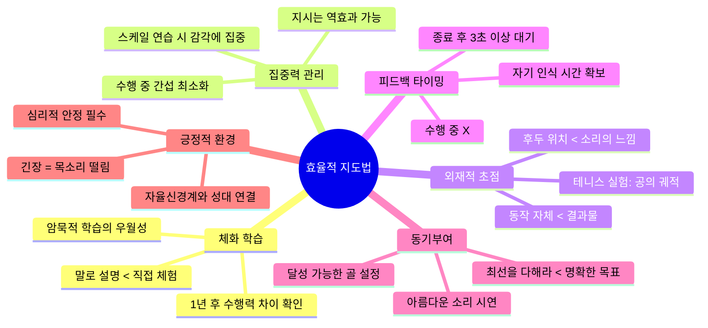
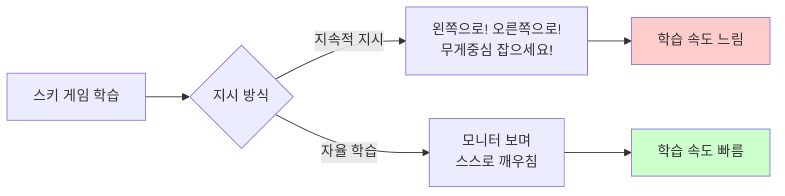
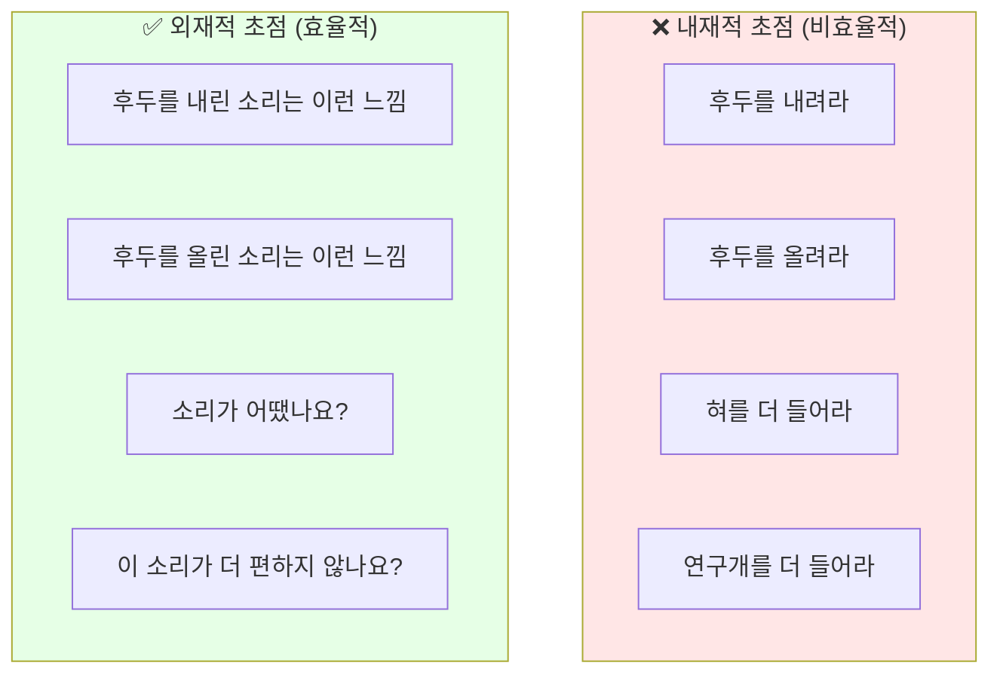
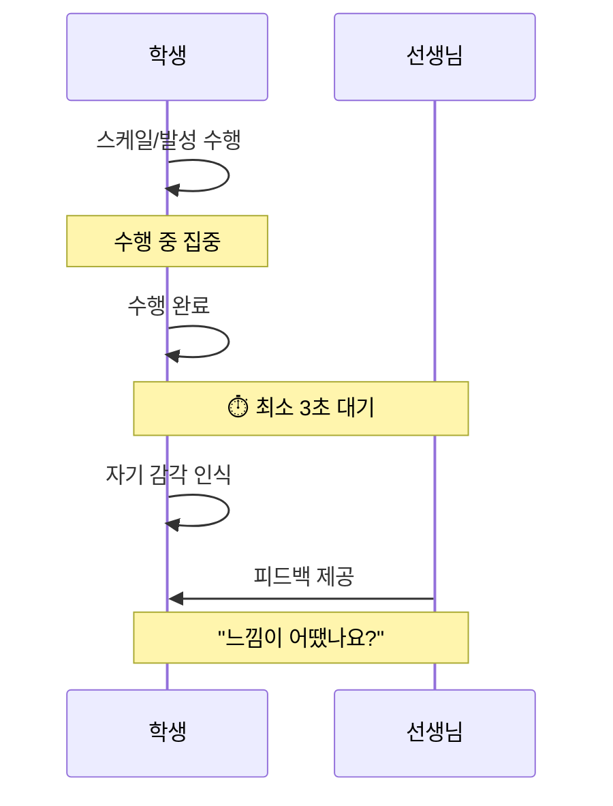
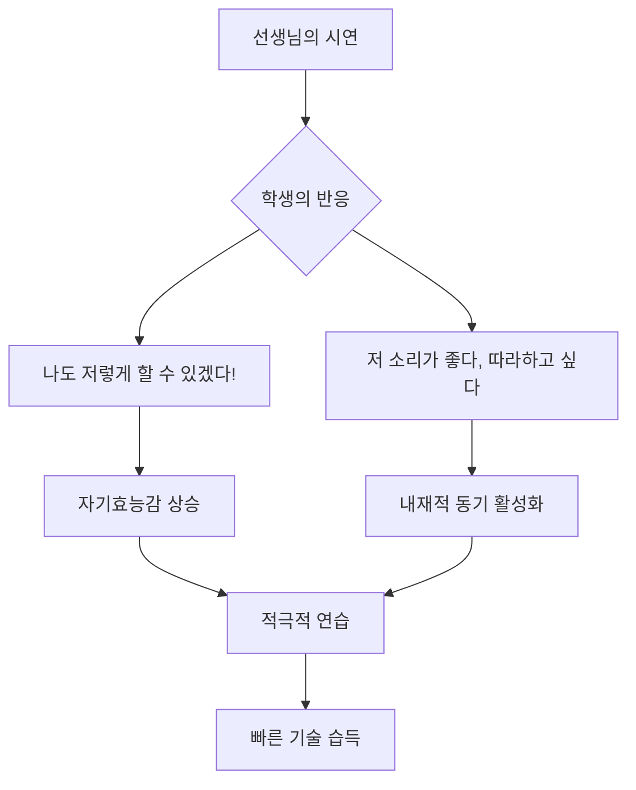
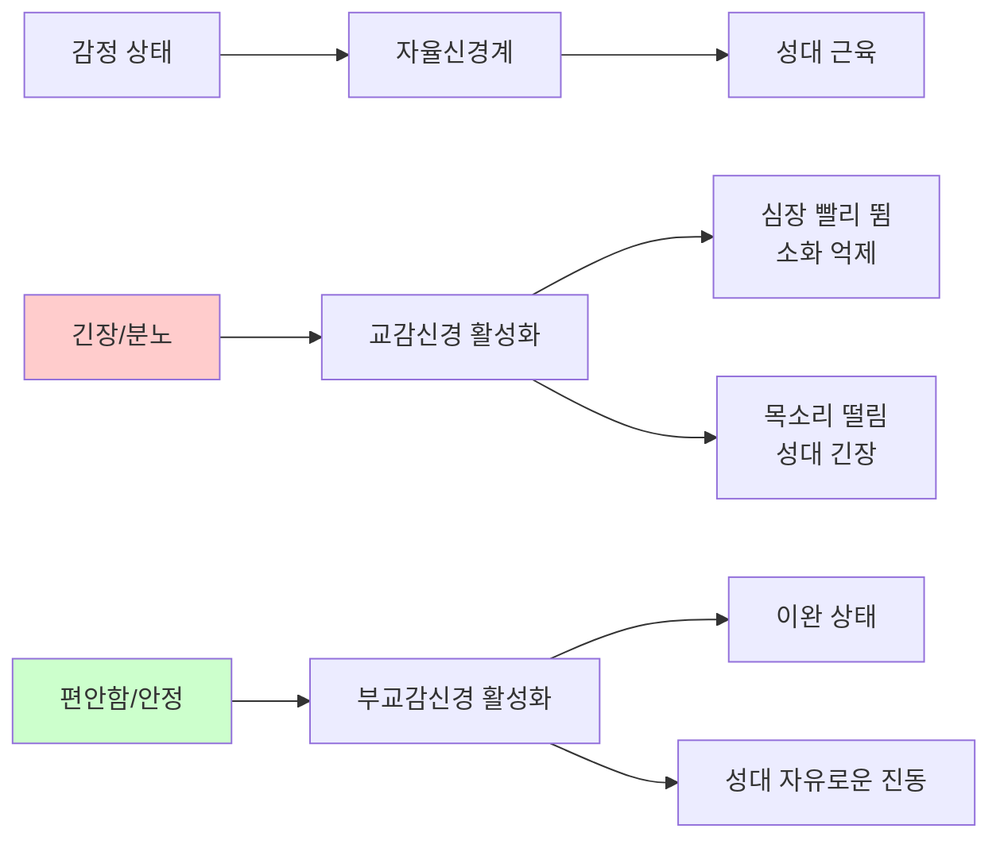

# 어떤 식의 지도가 더 효율적일까? - 운동학습 기반 교수법

<iframe width="560" height="315" src="https://www.youtube.com/embed/69gVuko1x5U" frameborder="0" allowfullscreen></iframe>

## 영상 개요

| 항목 | 내용 |
|------|------|
| 채널 | 의학발성 메디칼보이스 |
| 주제 | 운동학습(Motor Learning) 연구에 기반한 효율적인 지도 방법 |
| 대상 | 보컬 트레이너, 음악 교육자, 스포츠 코치 |
| 난이도 | 🟡 중급 |
| 핵심 가치 | 과학적 연구 결과를 교육 현장에 적용하는 실용적 가이드 |

---

## 핵심 요약 (TL;DR)

> **"말로 설명하기보다 직접 해보게 하고, 동작 자체보다 결과에 집중하게 하며, 수행 중에는 간섭을 최소화하고, 명확한 목표와 긍정적 환경을 제공하라."**

운동학습(Motor Learning) 분야의 연구 결과들을 보컬 트레이닝에 적용하여, 학생들이 더 빠르고 효과적으로 기술을 습득할 수 있는 지도 방법론을 제시한다.

---

## 마인드맵



---

## 챕터별 학습 내용

### Chapter 1: 체화 학습의 힘 (Embodied Learning) 🟢 기초
**[0:00 - 1:25](https://www.youtube.com/watch?v=69gVuko1x5U&t=0s)**

#### 핵심 원리
말로만 설명하는 것보다 **직접 몸으로 해보게 하는 것**이 훨씬 더 오래 남는다.

#### 연구 근거
| 그룹 | 학습 방법 | 1년 후 결과 |
|------|----------|------------|
| A그룹 | 말로만 설명 받음 | 동작 수행 정확도 낮음 |
| B그룹 | 직접 몸으로 체험 | 동작 수행 정확도 높음 |

#### 교육적 시사점
- **Declarative Knowledge (선언적 지식)**: "성대를 이렇게 움직여야 해" → 단기 기억
- **Procedural Knowledge (절차적 지식)**: 직접 해보며 체득 → 장기 기억, 자동화

> 💡 **적용 팁**: 긴 설명 대신 학생이 직접 시도하게 하고, 그 경험을 바탕으로 짧은 피드백을 제공한다.

---

### Chapter 2: 집중력과 간섭의 역설 🟡 중급
**[1:25 - 2:45](https://www.youtube.com/watch?v=69gVuko1x5U&t=85s)**

#### 핵심 원리
몸으로 하는 일(운동 기술)은 **다른 것에 정신이 분산되지 않고 집중**할 때 훨씬 잘 학습된다.

#### 스키 시뮬레이터 실험



#### 보컬 트레이닝 적용
| 비효율적 방식 | 효율적 방식 |
|--------------|-----------|
| 스케일 도중 "성대 더 닫아!" | 스케일 전 설명, 수행 중 관찰 |
| 발성 중 계속 지시 | 학생이 감각에 집중하도록 침묵 |
| 실시간 교정 | 수행 완료 후 피드백 |

> ⚠️ **주의**: 수행 중 계속되는 말 지시는 학생의 집중력을 흐트러뜨려 **오히려 역효과**를 낼 수 있다.

---

### Chapter 3: 외재적 초점 (External Focus) 🔴 심화
**[2:45 - 4:10](https://www.youtube.com/watch?v=69gVuko1x5U&t=165s)**

#### 핵심 개념
**내재적 초점 (Internal Focus)**: 신체 부위나 동작 자체에 집중
**외재적 초점 (External Focus)**: 동작의 결과나 효과에 집중

#### 테니스 연구 사례

| 집중 대상 | 지시 내용 | 학습 효과 |
|----------|----------|----------|
| 내재적 초점 | "라켓과 공의 컨택트에 집중해" | 느린 학습 |
| 외재적 초점 | "공이 날아가는 궤적에 집중해" | 빠른 학습 |

#### Timothy Gallwey 일화
유명 테니스 선수 Timothy Gallwey의 경험:
- 경기 중 상대 선수에게 "어떻게 그렇게 훌륭한 포핸드를 칠 수 있나요?"라고 질문받음
- 상대 선수는 자신의 동작(내재적)에 집중하게 되어 경기를 망침
- **결과보다 동작 자체에 집중하면 자동화된 기술이 방해받는다**

#### 보컬 트레이닝 적용



> 💡 **핵심**: "TA를 더 강화해라" 대신 "이 소리와 저 소리 중 어떤 게 더 쉽게 나오나요?"

---

### Chapter 4: 피드백의 타이밍과 방법 🟡 중급
**[4:10 - 5:30](https://www.youtube.com/watch?v=69gVuko1x5U&t=250s)**

#### 암묵적 유도 (Implicit Guidance)

직접적 지시 대신 **자연스럽게 원하는 결과가 나오도록** 환경이나 과제를 설계한다.

| 문제 상황 | 직접 지시 (비효율) | 암묵적 유도 (효율) |
|----------|------------------|------------------|
| 입이 너무 넓게 벌어짐 | "입을 다물어라" | 손으로 볼을 잡고 노래하게 함 |
| 소리가 너무 딱딱함 | "소리를 밀어 올려라" | 비음이 자연스럽게 나오는 모음 사용 |

#### 피드백 타이밍의 과학



#### 연구 결과
- 스킬 수행 후 **최소 3초 이상의 간격**을 두고 피드백을 제공할 때 학습 효과가 가장 좋음
- 학생이 스스로 자신의 수행을 인식할 시간을 확보해야 함

> 📌 **실천 가이드**: 학생이 발성을 마친 후 바로 말하지 말고, 잠시 기다린 후 "어떤 느낌이었어요?"라고 물어본다.

---

### Chapter 5: 동기부여와 목표 설정 🟢 기초
**[5:30 - 6:00](https://www.youtube.com/watch?v=69gVuko1x5U&t=330s)**

#### 효과적인 동기부여 전략

| 비효율적 | 효율적 |
|---------|--------|
| "최선을 다해 연습해라" | "이번 주까지 이 음역을 편하게 내보자" |
| 막연한 격려 | 명확하고 달성 가능한 목표 |
| 추상적 지시 | 구체적 성취 기준 |

#### 시연의 힘
학생이 **쉽게 구현할 수 있으면서도 아름다운 소리**를 선생님이 직접 들려주는 것이 강력한 동기부여가 된다.



---

### Chapter 6: 긍정적 학습 환경의 신경과학적 근거 🔴 심화
**[6:00 - 6:45](https://www.youtube.com/watch?v=69gVuko1x5U&t=360s)**

#### 자율신경계와 발성의 연결

성대의 근육을 담당하는 신경은 **자율신경계**와 연결되어 있다.



#### 교육적 함의
- 학생을 혼내거나 긴장하게 만들면 **성대 자체가 생리적으로 경직**됨
- 목표하는 소리를 찾기 어려워짐
- **긍정적이고 안전한 학습 환경** 조성이 기술 습득에 직접적 영향

> ⚠️ **핵심 통찰**: 레슨의 분위기는 단순히 '기분' 문제가 아니라, 학생의 **신체적 발성 능력**에 직접적으로 영향을 미친다.

---

## 핵심 개념 시각화

```mermaid
graph TB
    subgraph 전통적 교수법
        T1[말로 설명] --> T2[동작 지시]
        T2 --> T3[실시간 교정]
        T3 --> T4[반복 연습]
    end

    subgraph 운동학습 기반 교수법
        M1[시연 & 체험] --> M2[외재적 초점]
        M2 --> M3[자율 탐색]
        M3 --> M4[지연된 피드백]
        M4 --> M5[명확한 목표]
        M5 --> M6[긍정적 환경]
    end

    style 전통적 교수법 fill:#ffe6e6
    style 운동학습 기반 교수법 fill:#e6ffe6
```

---

## 용어 사전

| 용어 | 영문 | 정의 |
|------|------|------|
| 운동학습 | Motor Learning | 연습과 경험을 통해 운동 기술을 습득하는 과정에 대한 학문 |
| 내재적 초점 | Internal Focus | 신체 부위나 동작 자체에 주의를 기울이는 것 |
| 외재적 초점 | External Focus | 동작의 결과나 환경의 효과에 주의를 기울이는 것 |
| 암묵적 학습 | Implicit Learning | 의식적 인식 없이 경험을 통해 자연스럽게 학습되는 과정 |
| 선언적 지식 | Declarative Knowledge | 말로 설명할 수 있는 사실적 지식 ("~이다") |
| 절차적 지식 | Procedural Knowledge | 실제 수행 방법에 대한 지식 ("~하는 법") |
| 자기효능감 | Self-efficacy | 특정 과제를 성공적으로 수행할 수 있다는 자신에 대한 믿음 |
| 자율신경계 | Autonomic Nervous System | 심장, 소화, 호흡 등을 무의식적으로 조절하는 신경계 |
| 피드백 지연 | Feedback Delay | 수행과 피드백 사이에 의도적으로 시간 간격을 두는 것 |

---

## 실천 체크리스트

### 레슨 전
- [ ] 오늘 달성할 구체적이고 명확한 목표 설정
- [ ] 학생이 쉽게 따라할 수 있는 시연 준비
- [ ] 긍정적이고 안전한 분위기 조성

### 레슨 중
- [ ] 긴 설명보다 직접 체험하게 하기
- [ ] 수행 중에는 말 지시 최소화
- [ ] "혀를 올려라" 대신 "이 소리가 더 편하지 않나요?"
- [ ] 직접 지시 대신 암묵적 유도 방법 활용
- [ ] 수행 완료 후 3초 이상 기다린 후 피드백

### 레슨 후
- [ ] 오늘 목표 달성 여부 확인
- [ ] 다음 레슨 목표 함께 설정
- [ ] 긍정적 마무리

---

## 셀프테스트 질문

### 이해도 확인
1. **왜 말로 설명하는 것보다 직접 해보게 하는 것이 더 효과적인가?**
   <details>
   <summary>정답 보기</summary>
   직접 몸으로 체험하면 절차적 지식(Procedural Knowledge)으로 저장되어 장기 기억과 자동화에 유리하다. 연구에서 1년 후 비교 시 직접 체험한 그룹이 동작을 더 정확하게 수행했다.
   </details>

2. **내재적 초점과 외재적 초점의 차이는 무엇인가?**
   <details>
   <summary>정답 보기</summary>
   내재적 초점은 신체 부위나 동작 자체(예: 후두 위치)에 집중하는 것이고, 외재적 초점은 동작의 결과(예: 소리의 느낌)에 집중하는 것이다. 연구에 따르면 외재적 초점이 학습에 더 효과적이다.
   </details>

3. **피드백을 제공할 때 최소 몇 초를 기다려야 하는가?**
   <details>
   <summary>정답 보기</summary>
   최소 3초 이상. 학생이 스스로 자신의 수행을 인식할 시간을 확보해야 학습 효과가 높아진다.
   </details>

4. **레슨 환경이 긍정적이어야 하는 신경과학적 이유는?**
   <details>
   <summary>정답 보기</summary>
   성대 근육을 담당하는 신경이 자율신경계와 연결되어 있어, 긴장하거나 화가 나면 생리적으로 목소리가 떨리고 성대가 경직된다. 긍정적 환경에서 신체가 이완되어야 목표하는 소리를 찾기 쉽다.
   </details>

### 적용 연습
5. **"혀를 좀 더 들어라"라는 지시를 외재적 초점 방식으로 바꿔보시오.**
   <details>
   <summary>예시 답안</summary>
   "이 소리와 저 소리 중 어떤 게 더 밝게 들리나요?" / "소리를 좀 더 위쪽으로 보내는 느낌으로 해보세요" / "이런 느낌의 소리가 나오면 좋겠어요 (시연)"
   </details>

6. **입이 너무 넓게 벌어지는 학생에게 "입을 다물어"라고 직접 지시하는 대신 사용할 수 있는 암묵적 유도 방법은?**
   <details>
   <summary>예시 답안</summary>
   손으로 볼을 가볍게 잡고 노래하게 하여 자연스럽게 입 벌림을 제한한다.
   </details>

---

## 추가 학습 자료

### 관련 개념
- [[운동학습]] - Motor Learning의 기초 이론
- [[암묵적 학습]] - Implicit Learning 심화
- [[피드백의 과학]] - 효과적인 피드백 전략
- [[자기효능감]] - Bandura의 Self-efficacy 이론
- [[자율신경계와 발성]] - 신경과학적 접근

### 추천 도서
- Gabriele Wulf, "Attention and Motor Skill Learning"
- Timothy Gallwey, "The Inner Game of Tennis"
- Richard Schmidt, "Motor Learning and Performance"

### 관련 영상
- [[YT-보컬 트레이닝 기초]]
- [[YT-발성 해부학]]

---

## 메타 정보

| 항목 | 내용 |
|------|------|
| 영상 길이 | 약 6분 45초 |
| 학습 소요 시간 | 20-30분 (영상 + 노트 정리) |
| 복습 권장 주기 | 1주 후, 1개월 후 |
| 연결된 실천 | 다음 레슨에서 3가지 원칙 적용해보기 |

---

*노트 생성일: 2026-04-16*
*마지막 수정: 2026-04-16*
