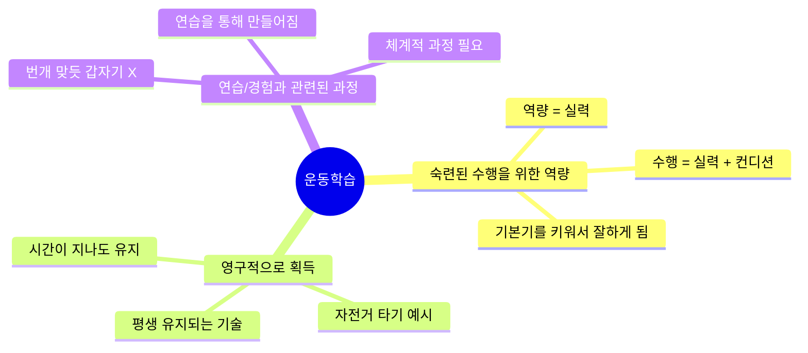
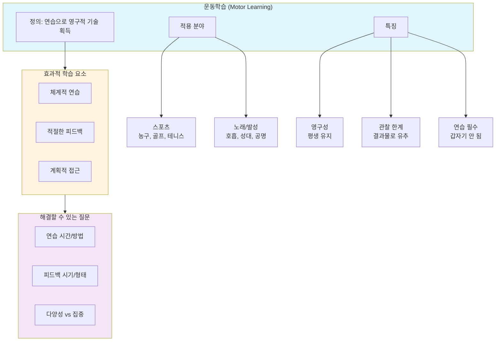
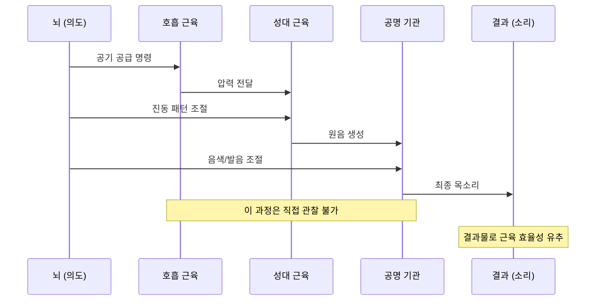

# [운동학습 #1] 연습의 큰 그림을 그려주는 운동학습 이론

<iframe width="560" height="315" src="https://www.youtube.com/embed/hFzAoS9HfnY" frameborder="0" allowfullscreen></iframe>

## 영상 개요

| 항목 | 내용 |
|------|------|
| 채널 | 의학발성 메디칼보이스 |
| 주제 | 운동학습(Motor Learning) 이론의 정의와 노래 연습에의 적용 |
| 난이도 | 🟢 기초 |
| 핵심 질문 | 노래 연습은 어떻게 해야 효과적일까? |

---

## 핵심 요약

> **운동학습(Motor Learning)이란?**
> "숙련된 수행을 위한 역량을 비교적 영구적으로 획득하기 위한 연습 또는 경험과 관련된 일련의 과정"
>
> 쉽게 말해: **연습을 열심히 해서 평생 써먹을 수 있는 기술을 만드는 것**

---

## 챕터별 정리

### Chapter 1: 운동학습이란 무엇인가? (0:00-1:41)
[📺 구간 재생](https://www.youtube.com/watch?v=hFzAoS9HfnY&t=0s)

**난이도**: 🟢 기초

#### 핵심 내용

운동학습은 농구 슛, 골프 스윙, 테니스 스트로크 같은 **복잡한 신체 동작**을 익히는 과정을 연구하는 이론이다.

**운동 동작의 공통점:**
- 다양한 근육들이 **동시다발적**으로 작동
- 필요한 만큼만 정확하게 움직임
- 일종의 **근육 간 팀워크**가 필요

**효과적인 학습을 위해 필요한 것:**
1. 충분한 연습
2. 적절한 피드백
3. 계획적인 접근

> **핵심 인사이트**: 무작정 연습하거나 잘못된 피드백을 받으면 실력 향상이 어렵다. 야구공을 무작정 던지기만 하면 실력이 잘 오르지 못한다.

---

### Chapter 2: 왜 노래에 운동학습 이론이 필요한가? (1:41-2:40)
[📺 구간 재생](https://www.youtube.com/watch?v=hFzAoS9HfnY&t=101s)

**난이도**: 🟢 기초

#### 노래 = 운동 기술

노래 역시 다양한 근육들의 협응에 의해 만들어진다. 단지 그 결과물이 **소리**일 뿐이다.

```
호흡 근육 → 공기 공급
    ↓
성대 근육 → 소리 생성
    ↓
목/비강 조절 → 발음과 음색 완성
    ↓
   목소리
```

**미국의 발성 서적**에서는 운동학습 이론을 별도의 챕터로 할애해서 설명하고 있다. 그러나 한국의 발성 관련 서적에서는 아직 자세히 다루지 않고 있다.

#### 운동학습 이론으로 답할 수 있는 질문들

| 학습자 관점 | 교사 관점 |
|------------|----------|
| 이 연습이 정말 도움이 될까? | 피드백을 언제 주는 게 좋을까? |
| 하루에 몇 시간 연습해야 효과적일까? | 어떤 형태의 피드백이 좋을까? |
| 스케일 연습 vs 노래 직접 연습? | 다양하게 vs 하나에 집중? |

---

### Chapter 3: 운동학습의 정의 분석 (2:40-4:14)
[📺 구간 재생](https://www.youtube.com/watch?v=hFzAoS9HfnY&t=160s)

**난이도**: 🟡 중급

#### 학술적 정의

> **Motor Learning**: "숙련된 수행(skilled performance)을 위한 역량(capability)을 비교적 영구적으로(relatively permanently) 획득하기 위한 연습(practice) 또는 경험(experience)과 관련된 일련의 과정(set of processes)"

#### 정의 분해



#### 핵심 개념 설명

**1. 역량(Capability) vs 수행(Performance)**

| 개념 | 설명 | 예시 |
|------|------|------|
| **역량** | 그 사람의 실력 자체 | 평소 노래 실력 |
| **수행** | 실력 + 그날 컨디션 | 오늘 공연에서의 노래 |

**2. 영구적 획득의 의미**

- **O**: 자전거 타기 - 어릴 때 배우면 커서도 탈 수 있음
- **X**: 상상 같은 지식 - 내일이면 잊어버릴 수 있음

> **핵심 인사이트**: 운동학습으로 익힌 기술은 시간이 지나도 유지된다. 이것이 단순 암기와 다른 점이다.

---

### Chapter 4: 운동학습 기술의 특징 - 관찰의 한계 (4:14-5:31)
[📺 구간 재생](https://www.youtube.com/watch?v=hFzAoS9HfnY&t=254s)

**난이도**: 🟡 중급

#### 블랙박스로서의 신체

운동학습을 통해 얻어지는 기술들의 특징: **그 과정을 자세히 들여다볼 수 없다**

```
      [입력]              [블랙박스]              [출력]
    의도/명령    →    근육들의 복잡한 움직임    →    결과물
                      (직접 관찰 불가)

골프: 스윙 의도  →    수십 개 근육 협응       →    공의 궤적
노래: 음 내기   →    호흡/성대/공명 근육      →    소리
```

#### 간접적 평가의 필요성

| 운동 | 직접 관찰 가능 | 간접 평가 방법 |
|------|--------------|---------------|
| 골프 | 큰 동작만 가능 | 공의 궤적으로 판단 |
| 노래 | 큰 움직임만 가능 | 소리로 판단 |

> **결론**: 결과물(소리)이 좋아지면 → 근육들이 효율적으로 움직이고 있다고 유추할 수 있다.

---

## 마인드맵: 운동학습 이론 전체 구조



---

## 핵심 개념 다이어그램: 노래의 운동학습 과정



---

## 용어 사전

| 용어 | 영어 | 정의 |
|------|------|------|
| **운동학습** | Motor Learning | 연습을 통해 영구적인 운동 기술을 획득하는 과정 |
| **역량** | Capability | 개인이 가진 실력 자체 (컨디션 제외) |
| **수행** | Performance | 실력 + 그날의 컨디션을 포함한 결과 |
| **피드백** | Feedback | 수행 결과에 대한 정보 제공 |
| **근육 협응** | Muscle Coordination | 여러 근육이 동시에 적절히 작동하는 팀워크 |
| **영구적 획득** | Permanent Acquisition | 시간이 지나도 유지되는 기술 습득 |

---

## 비유와 사례 정리

### 비유 1: 자전거 타기 vs 암기

```
자전거 타기 (운동학습)          vs          지식 암기
━━━━━━━━━━━━━━━━━━━━━━━━━━━━━━━━━━━━━━━━━━━━━━━━━━━━
어릴 때 배움                              오늘 공부함
    ↓                                        ↓
10년 후에도 탈 수 있음                   내일 잊어버림
    ↓                                        ↓
영구적 기술                              일시적 정보
```

### 비유 2: 야구공 던지기 (잘못된 연습의 예)

- **나쁜 방법**: 불펜에서 무작정 던지기만 함 → 실력 향상 미미
- **좋은 방법**: 계획적 연습 + 적절한 피드백 → 효과적 향상

### 비유 3: 블랙박스

골프 스윙, 노래 모두 **수십 개의 근육**이 관여하지만, 그 모든 움직임을 하나하나 파악할 수 없다. 마치 블랙박스처럼 **입력(의도)**과 **출력(결과)**만 볼 수 있고, 내부 과정은 간접적으로 유추해야 한다.

---

## 시리즈 프리뷰: 앞으로 다룰 내용

이 영상은 운동학습 시리즈의 첫 번째로, **정의와 개요**만 다루었다.

### 예상되는 후속 주제

| 주제 | 관련 질문 |
|------|----------|
| 연습 설계 | 하루에 몇 시간? 어떤 방식으로? |
| 피드백 이론 | 언제, 어떤 형태로 피드백을 줄까? |
| 다양성 vs 집중 | 여러 가지 vs 하나에 집중? |
| 전이(Transfer) | 스케일 연습이 실제 노래에 도움이 될까? |
| 학습 단계 | 초보자 vs 숙련자의 연습 차이 |

---

## 셀프 테스트

### 이해도 점검 질문

1. **운동학습의 정의를 자신의 말로 설명해보세요.**
   <details>
   <summary>모범 답안</summary>
   연습을 통해 평생 써먹을 수 있는 운동 기술을 만드는 과정. 단순 암기와 달리 시간이 지나도 유지된다.
   </details>

2. **역량(Capability)과 수행(Performance)의 차이는?**
   <details>
   <summary>모범 답안</summary>
   역량은 그 사람의 실력 자체이고, 수행은 실력에 그날의 컨디션까지 포함한 개념이다.
   </details>

3. **노래가 운동학습 이론을 따르는 이유는?**
   <details>
   <summary>모범 답안</summary>
   노래도 호흡 근육, 성대 근육, 공명 기관 등 다양한 근육들의 협응으로 만들어지는 운동 기술이기 때문이다. 결과물이 공의 궤적 대신 소리일 뿐이다.
   </details>

4. **운동학습 기술을 직접 관찰할 수 없는 이유와 대안은?**
   <details>
   <summary>모범 답안</summary>
   수십 개의 근육이 동시에 작동하기 때문에 모든 움직임을 파악할 수 없다. 대신 결과물(골프의 공 궤적, 노래의 소리)을 통해 근육 효율성을 간접적으로 유추한다.
   </details>

5. **무작정 연습하는 것이 효과적이지 않은 이유는?**
   <details>
   <summary>모범 답안</summary>
   계획 없이 아무렇게나 연습하거나 잘못된 피드백을 받으면 실력 향상이 어렵다. 효과적인 학습을 위해서는 체계적인 연습과 적절한 피드백이 필요하다.
   </details>

### 적용 질문

6. **당신의 연습 방식을 돌아보세요. 운동학습 이론 관점에서 개선할 점은?**

7. **피드백 없이 혼자 연습할 때, 결과물(소리)을 어떻게 활용할 수 있을까요?**

---

## 실천 포인트

### 학습자를 위한 조언

- [ ] 무작정 연습하지 말고 **계획**을 세우자
- [ ] 연습 결과물(녹음)을 **피드백 도구**로 활용하자
- [ ] 운동학습은 **시간이 걸리는 과정**임을 인정하자
- [ ] 결과물(소리)의 변화로 **진전을 확인**하자

### 교사/코치를 위한 조언

- [ ] 피드백의 **시기와 형태**를 고민하자
- [ ] 학생의 **수준에 맞는** 연습을 설계하자
- [ ] 운동학습 이론을 **체계적으로** 학습하자

---

## 관련 자료 및 추가 학습

### 추천 도서
- Richard A. Schmidt & Timothy D. Lee - *Motor Learning and Performance*
- 국내 발성 서적에서는 아직 운동학습 이론을 자세히 다루지 않음 (영상 언급)

### 연결 개념
- [[deliberate-practice|의도적 연습]]
- [[feedback-theory|피드백 이론]]
- [[muscle-memory|근육 기억]]
- [[vocal-pedagogy|발성 교육학]]

---

## 메타 정보

- **영상 길이**: 약 6분
- **시리즈**: 운동학습 시리즈 #1 (정의 편)
- **다음 편 예고**: 본격적인 운동학습 이론 상세 내용 (한 달~두 달 후 예정)
- **노트 작성일**: 2026-04-16
