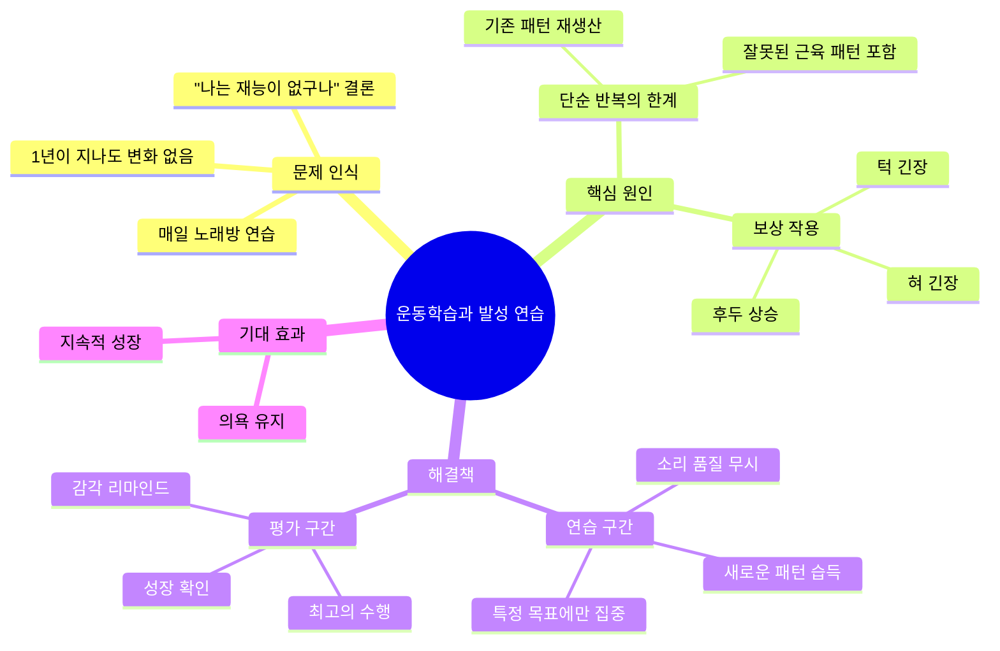
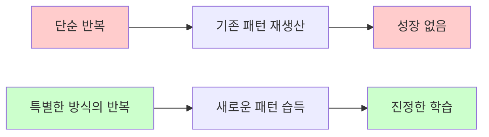
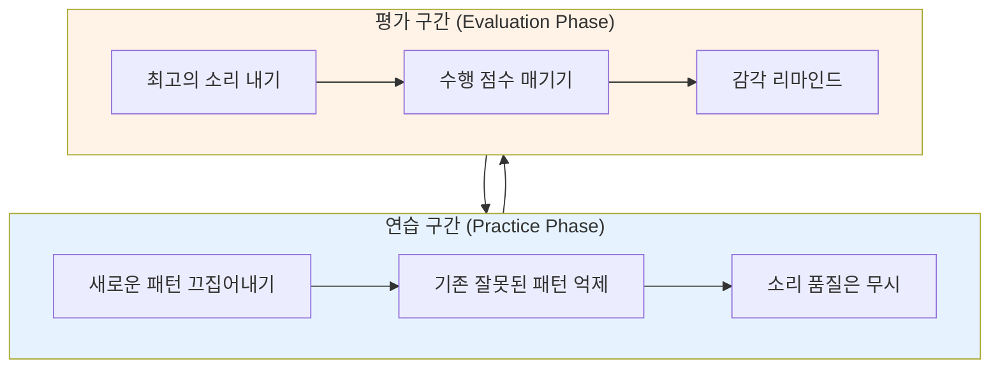
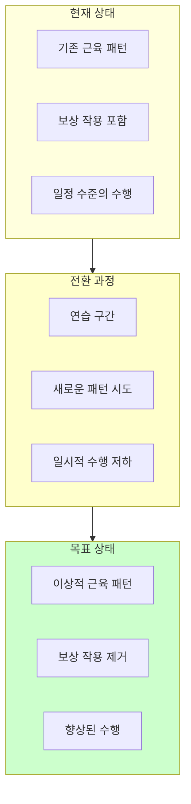

# [운동학습 #2] 노래방에서 연습하는데 왜 안 늘어요?

<iframe width="560" height="315" src="https://www.youtube.com/embed/phQyhD2HLUQ" frameborder="0" allowfullscreen></iframe>

---

## 핵심 요약 (TL;DR)

> **"연습은 단순한 반복이 아니라 특별한 방식의 반복이다"** - 베른슈타인
>
> 코인노래방에서 매일 연습해도 실력이 늘지 않는 이유는 **잘못된 근육 패턴을 반복**하기 때문이다. 진정한 성장을 위해서는 **연습 구간**(새로운 패턴 습득)과 **평가 구간**(최고의 수행)을 분리해야 한다.

---

## 마인드맵

---

## 챕터별 정리

### Chapter 1: 문제 제기 - 왜 노래방 연습이 효과가 없을까? 🟢
[▶ 0:00](https://www.youtube.com/watch?v=phQyhD2HLUQ&t=0s)

**상황 설명:**
- 노래를 잘하기 위해 꾸준히 연습해야 한다는 것은 누구나 안다
- 마음을 다잡고 매일 코인노래방에 간다
- 부르고 싶은 노래를 열심히 부른다
- 1년이 지나도 아무런 변화가 없다
- 최고음은 여전히 2옥타브 솔

**흔한 결론:** "나는 재능이 없구나, 나는 결국 바리톤이구나"

> **핵심 메시지:** 재능의 문제가 아니라 **연습 방법의 문제**이다!

---

### Chapter 2: 이론적 배경 - 베른슈타인의 운동학습 이론 🟡
[▶ 0:35](https://www.youtube.com/watch?v=phQyhD2HLUQ&t=35s)

**핵심 인용 (운동학습과 수행 195페이지):**

> "연습은 단순한 반복 그 이상이다"

> "연습은 단순히 반복이 아니라 **특별한 방식의 반복**이며, 만약에 그렇게 하지 않는다면 훈련은 단지 **이전에 암기된 패턴에 단순한 재생산**일 뿐이다" - 베른슈타인

**의미 해석:**
- 어떤 동작을 그냥 반복하는 것만으로는 학습이 일어나지 않는다
- 단순 반복 = 기존 패턴의 재생산
- 특별한 방식의 반복 = 진정한 학습

---

### Chapter 3: 코인노래방 연습의 문제점 분석 🟡
[▶ 1:03](https://www.youtube.com/watch?v=phQyhD2HLUQ&t=63s)

**코인노래방에서의 심리:**
1. 1,000원을 넣으면 물러날 길이 없다
2. 노래와의 승부에 들어간다
3. 최선을 다해 모든 것을 쏟아낸다
4. "내가 낼 수 있는 최고의 소리"를 낸다

**문제점:**

| 생각 | 실제 |
|------|------|
| "내가 낼 수 있는 최고의 소리" | 그동안 반복해온 **최적의 근육 패턴** |
| 최선의 노력 | **잘못된 패턴이 포함된** 노력 |

**잘못된 패턴의 예시 (보상 작용):**
- 혀 긴장 (혀가 말려 들어감)
- 턱 긴장 (턱에 힘이 과도하게 들어감)
- 후두 상승 (지나치게 높은 후두 위치)

> **핵심 통찰:** 비록 "내가 만들 수 있는 최고의 패턴"이라 하더라도, 실제로 **이상적인 패턴은 아닐 수 있다**

---

### Chapter 4: 해결책 - 연습 구간과 평가 구간의 분리 🔴
[▶ 3:55](https://www.youtube.com/watch?v=phQyhD2HLUQ&t=235s)

**운동학습 이론의 제안:**

#### 연습 구간의 원칙

| 목표 | 방법 | 예시 |
|------|------|------|
| 새로운 패턴 습득 | 특정 목표에만 집중 | 혀가 앞으로 나오기만 하면 OK |
| 잘못된 패턴 제거 | 보상 작용 억제 | 턱에 힘이 안 들어가기만 하면 OK |
| 품질 무시 | 소리가 좋든 나쁘든 상관없음 | 뒤집어져도 괜찮음 |

**구체적 연습 방법 (바리톤 시리즈 참조):**
1. **보상 작용 억제:** 턱 근육을 손으로 눌러서 이완 유도
2. **새로운 성대 접촉 패턴:** 보컬 프라이, 투행 등의 소리 사용
3. **효율적 호흡 패턴:** 비효율적 호흡 억제, 새로운 패턴 연습

#### 평가 구간의 원칙

- 내가 낼 수 있는 **가장 좋은 소리**를 낸다
- 선생님 또는 스스로 **점수를 매겨서 객관화**
- **성장 확인** + **감각 리마인드**

---

### Chapter 5: 왜 이 방법이 어려운가? 🟡
[▶ 2:48](https://www.youtube.com/watch?v=phQyhD2HLUQ&t=168s)

**새로운 패턴 연습의 역설:**

**비유: 길거리 농구 선수의 슛 폼 교정**
- 자기만의 방식으로 슛을 쏘던 선수
- 정석 슛 폼을 배우면
- 처음에는 슛 성공률이 떨어진다
- 하지만 장기적으로는 더 좋아진다

**노래의 경우:**
- 보상 작용(높은 후두)에 의지해서 고음을 내던 사람
- 후두를 낮추면 → 소리가 미친 듯이 뒤집어진다
- 이 기간을 견디기가 쉽지 않다

**선생님들의 어려움:**
- 학생들은 레슨 후 "마법 같은 소리 변화"를 기대
- 하지만 나쁜 버릇 제거 시 당장 소리가 나빠짐
- "이 길이 맞다"는 것을 설득해야 하는 과정 필요

---

## 개념 관계도

---

## 용어 사전

| 용어 | 정의 | 비고 |
|------|------|------|
| **운동학습 (Motor Learning)** | 연습이나 경험을 통해 운동 기술을 습득하는 과정 | 단순 반복과 구분됨 |
| **보상 작용 (Compensation)** | 부족한 기능을 다른 근육이 대신하는 현상 | 혀, 턱, 후두 등 |
| **근육 패턴** | 특정 동작을 위해 근육들이 협응하는 방식 | 좋은 패턴 vs 나쁜 패턴 |
| **베른슈타인 (Bernstein)** | 러시아의 신경생리학자, 운동학습 이론의 선구자 | 운동 조절 이론 |
| **연습 구간** | 새로운 패턴 습득에 집중하는 시간 | 수행 품질 무시 |
| **평가 구간** | 최고의 수행을 시도하고 평가하는 시간 | 성장 확인용 |
| **보컬 프라이 (Vocal Fry)** | 낮고 탁한 음성, 성대 접촉 패턴 훈련에 사용 | 발성 연습 기법 |
| **투행 (Twang)** | 밝고 날카로운 음색, 성대 효율성 향상에 도움 | 발성 연습 기법 |
| **후두 (Larynx)** | 성대가 위치한 기관, 목젖 아래에 위치 | 위치가 발성에 영향 |

---

## 실천 가이드

### 연습 구간 체크리스트

- [ ] 특정 목표 하나만 설정 (예: 혀 위치, 턱 이완)
- [ ] 소리의 좋고 나쁨은 신경 쓰지 않기
- [ ] 목표한 패턴이 나오는지만 확인
- [ ] 보상 작용 억제에 집중

### 평가 구간 체크리스트

- [ ] 현재 낼 수 있는 최고의 소리 내기
- [ ] 녹음해서 들어보기
- [ ] 점수 매기기 (1-10점)
- [ ] 그때의 감각 기억하기

### 주간 연습 계획 예시

| 요일 | 연습 구간 (20분) | 평가 구간 (10분) |
|------|------------------|------------------|
| 월 | 혀 위치 집중 | 편한 곡 1곡 |
| 화 | 턱 이완 집중 | 편한 곡 1곡 |
| 수 | 호흡 패턴 집중 | 중간 난이도 곡 |
| 목 | 후두 위치 집중 | 편한 곡 1곡 |
| 금 | 종합 연습 | 도전 곡 1곡 |

---

## 셀프 테스트

### 이해도 확인 질문

1. **Q:** 베른슈타인에 따르면, 연습이 "단순한 반복"에 그치면 어떤 결과가 나타나는가?
   

   
정답 보기

   이전에 암기된 패턴의 단순한 재생산일 뿐이며, 진정한 학습이 일어나지 않는다.
   

2. **Q:** 코인노래방에서 "최선을 다해" 연습해도 실력이 늘지 않는 핵심 이유는?
   

   
정답 보기

   "내가 낼 수 있는 최고의 소리"에는 이미 잘못된 근육 패턴(보상 작용)이 포함되어 있기 때문이다.
   

3. **Q:** 연습 구간에서 가장 중요한 원칙은 무엇인가?
   

   
정답 보기

   소리의 좋고 나쁨은 무시하고, 새로운 패턴이 나오는 것에만 집중한다. 특정 목표(예: 턱 이완, 혀 위치)에만 주력한다.
   

4. **Q:** 새로운 패턴을 연습할 때 수행 능력이 일시적으로 떨어지는 이유는?
   

   
정답 보기

   기존에 의지하던 보상 작용을 제거하면 아직 새로운 패턴이 안정화되지 않았기 때문에 소리가 뒤집어지거나 불안정해진다.
   

5. **Q:** 연습 구간과 평가 구간을 분리하는 이유는?
   

   
정답 보기

   연습 구간에서 성장을 추구하고, 평가 구간에서 의욕을 유지하면서 두 가지 목적을 모두 달성하기 위해서이다.
   

### 적용 질문

1. 나의 발성에서 의심되는 보상 작용은 무엇인가? (혀 긴장, 턱 긴장, 후두 상승 등)

2. 다음 연습 때 연습 구간의 목표로 삼을 것은?

3. 내가 "최선을 다해" 부를 때 무의식적으로 사용하는 근육 패턴은?

---

## 연관 자료

### 이 채널의 관련 영상
- 운동학습 #1 (시리즈 이전 편)
- 운동학습 #3 (시리즈 다음 편)
- 바리톤 시리즈 (구체적 발성 연습법)

### 참고 도서
- **운동학습과 수행** (Motor Learning and Performance) - 이 영상에서 직접 인용된 책

### 관련 개념
- [[발성의 원리]]
- [[보상작용과 긴장]]
- [[효율적인 연습법]]

---

## 메타 정보

- **영상 길이:** 약 5분 30초
- **핵심 키워드:** 운동학습, 연습 구간, 평가 구간, 보상 작용, 베른슈타인
- **추천 대상:** 노래 연습을 하지만 실력이 늘지 않아 고민인 사람, 보컬 트레이닝에 관심 있는 사람
- **복습 주기:** 1주일 후 재시청 권장

---

*Last updated: 2026-04-16*
