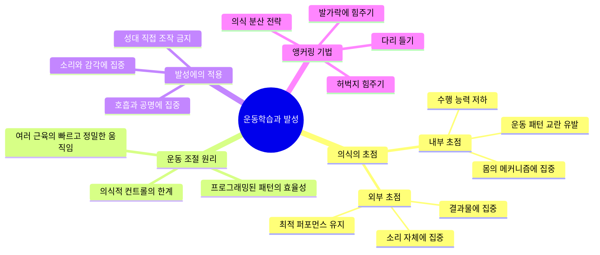
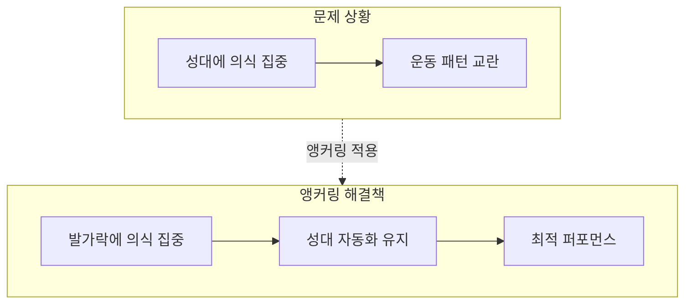
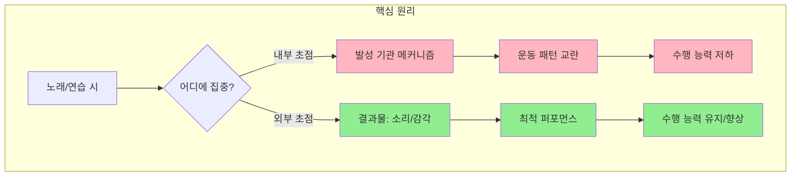

# [운동학습 #3] 발성이론을 공부할 때 이 부분을 경계해야 합니다

<iframe width="560" height="315" src="https://www.youtube.com/embed/GCyt_HmMesw" frameborder="0" allowfullscreen></iframe>

---

## 핵심 요약

> [!abstract] 한 줄 요약
> **발성 기관의 메커니즘에 의식적으로 집중하면 오히려 기존 운동 패턴이 교란되어 수행 능력이 저하된다. 노래할 때는 내부(성대)가 아닌 외부(소리, 감각)에 초점을 두어야 한다.**

### 핵심 키워드
| 키워드 | 설명 |
|--------|------|
| 내부 초점 (Internal Focus) | 몸의 움직임 메커니즘에 의식을 집중하는 것 |
| 외부 초점 (External Focus) | 동작의 결과물(소리, 공 등)에 의식을 집중하는 것 |
| 운동 패턴 교란 | 의식적 개입으로 인해 자동화된 움직임이 방해받는 현상 |
| 앵커링 (Anchoring) | 의식을 특정 부위에 고정시켜 불필요한 내부 초점을 방지하는 기법 |

---

## 마인드맵

---

## 챕터별 정리

### Chapter 1: 테니스 선수의 역설 - 의식의 초점 문제 🟢 기초
`0:00 - 1:00` [구간 재생](https://www.youtube.com/watch?v=GCyt_HmMesw&t=0s)

#### 핵심 내용
테니스 선수 Tim Henman의 일화로 시작합니다. 경기 중 상대 선수에게 "포핸드 어떻게 치세요?"라고 물으면, 신기하게도 그 상대 선수가 그날 경기를 망치는 경우가 많았다고 합니다.

#### 왜 이런 일이 발생하는가?
- 어떤 동작을 수행할 때 **의식의 초점** 때문
- 질문을 받은 순간, "내가 포핸드를 어떻게 쳤더라?"라고 생각하게 됨
- 초점이 **내부로 이동**하면서 자동화된 움직임이 방해받음

> [!quote] 핵심 인용
> "어떤 동작을 수행할 때 의식의 초점 때문입니다."

---

### Chapter 2: 운동 조절의 과학적 원리 🟡 중급
`1:00 - 2:30` [구간 재생](https://www.youtube.com/watch?v=GCyt_HmMesw&t=60s)

#### 운동 조절의 특성
운동 학습에 적용되는 운동 조절은 다음과 같은 특성을 가집니다:

| 특성 | 설명 |
|------|------|
| 복잡성 | 여러 근육이 빠르고 정밀하게 움직여야 함 |
| 정보량 | 의식적으로 컨트롤하기엔 정보의 양이 너무 방대함 |
| 효율성 | 몸에 프로그래밍된 패턴대로 움직이는 것이 가장 효율적 |

#### 의식적 개입의 문제
- 머리(의식)를 통해 조작하려 하면 **반드시 움직임에 교란**이 발생
- 이는 마치 투자 프로그램과 비슷함
  - 프로그램이 알아서 사고팔기 하면 수익이 나는데
  - 나의 의견이 개입될수록 손실이 남

> [!important] 핵심 원리
> 내부 초점(Internal Focus), 즉 우리 몸의 움직임 메커니즘에 초점을 두게 되면, 원래 프로그래밍되어 있던 운동 패턴이 의식에 의해 교란됩니다.

#### 현재 발성의 의미
여러분이 현재 내고 있는 소리는:
- 그 음을 내기 위해 **몸이 열심히 찾아놓은 최적의 운동 패턴**
- 단지 그 방법이 효율적이지 않을 수 있음
- 그러나 의식적으로 조절하려 하면 더 효율적인 패턴으로 바뀌는 게 아니라 **그마저도 교란되어 버림**

---

### Chapter 3: 실험적 근거 - 스키와 테니스 연구 🔴 심화
`1:45 - 2:30` [구간 재생](https://www.youtube.com/watch?v=GCyt_HmMesw&t=105s)

#### 1997년 Wulf의 스키 시뮬레이터 실험

**실험 설계:**
- 참가자들에게 스키 시뮬레이터를 타게 함
- **그룹 A (내부 초점)**: "왼발에 힘을 실으면 왼쪽으로 꺾이고, 다시 오른쪽으로 몸을 급히 옮겨서 오른발에 힘을 실으세요" - 구체적 지시
- **그룹 B (외부 초점)**: 그냥 알아서 타게 둠

**결과:**
- 구체적으로 지시를 받은 그룹이 **오히려 퍼포먼스가 안 나왔음**

#### 2002년 테니스 서브 실험

**실험 설계:**
- **그룹 A (외부 초점)**: 라켓을 휘두르고 나서 **공의 궤적**에 집중하게 함
- **그룹 B (내부 초점)**: **라켓을 휘두르는 움직임 자체**에 집중하게 함

**결과:**
- 외부에 집중했던 그룹이 훨씬 **좋은 퍼포먼스**를 보임

---

### Chapter 4: 발성에의 적용 - 성악계의 오랜 격언 🟡 중급
`2:30 - 3:30` [구간 재생](https://www.youtube.com/watch?v=GCyt_HmMesw&t=150s)

#### 성악계의 격언

> [!quote] 전통적 가르침
> "절대로 성대를 의식적으로 조작하지 마라. 대신 호흡과 공명을 느끼면서 불러라."

#### 이 격언의 과학적 타당성

우리는 이미 알고 있습니다:
- 소리가 성대에서 나온다는 것
- 성대 운동 패턴이 올바른 소리를 내는 데 매우 중요하다는 것

그렇다면 이 격언은 틀린 것일까요? **당연히 아닙니다.**

#### 왜 성대에 집중하면 안 되는가

| 상황 | 결과 |
|------|------|
| 노래하면서 성대 조절에 의식을 집중 | 기존 연습으로 만들어온 성대 운동 패턴이 교란됨 |
| 성대의 움직임을 설명만 해줘도 | 초점이 그쪽으로 이동하여 퍼포먼스 저하 가능 |

> [!warning] 경계해야 할 점
> "이론을 알게 되면 노래가 잘 안된다"는 말이 완전히 틀린 말은 아닙니다. 성대의 움직임에 관한 이론을 설명해 주는 것만으로도 초점이 이쪽으로 이동해 버리면서 오히려 퍼포먼스가 떨어질 수 있습니다.

---

### Chapter 5: 실전 적용 - 앵커링 기법 🟢 기초
`3:30 - 4:30` [구간 재생](https://www.youtube.com/watch?v=GCyt_HmMesw&t=210s)

#### 앵커링(Anchoring)이란?
의식을 다른 곳에 "묶어 놓는" 기법입니다. 성대 조작에 가해지는 불필요한 의식을 몸의 다른 부분으로 분산시킵니다.

#### 다양한 앵커링 방법

| 방법 | 설명 | 효과 |
|------|------|------|
| 한쪽 다리 들기 | 노래하면서 한쪽 다리를 들고 있음 | 의식 분산 |
| 허벅지에 힘주기 | 과량 큰 힘을 허벅지에 줌 | 의식 분산 |
| 발가락에 힘주기 | 발가락에 의식을 집중 | 가장 추천되는 방법 |

#### 왜 발가락이 좋은가?
영상 제작자가 배운 보컬 코칭에서는 **발가락에 의식을 두는 것**을 특히 추천했습니다:
- 발성 기관의 움직임이나 자세를 교란시키지 않음
- 의식을 가장 멀리 떨어뜨려 놓을 수 있음

#### 호흡으로 설명하는 선생님들
일부 선생님들은 이런 지시를 "호흡"으로 설명하기도 합니다. 하지만 기본적으로 이러한 행위를 했을 때 소리가 좋아지는 것은 **초점의 이동 때문**인 경우가 많습니다.

---

### Chapter 6: 전통적 교수법의 지혜와 한계 🔴 심화
`4:30 - 5:30` [구간 재생](https://www.youtube.com/watch?v=GCyt_HmMesw&t=270s)

#### 전통적 교수법이 성대 조작을 피하는 이유

일부 선생님들은 모든 것을 "호흡"으로 표현하려고 노력합니다:
- 예: 성대 접촉에 도움을 주는 b, d, g 같은 자음들
- "성대 접촉에 도움을 준다"가 아니라 **"호흡을 차단한다"**라고 설명

**이유:**
- 성대 조작으로 설명해 버리면 의식이 그쪽으로 가버림
- 아예 그것을 **원천 차단하기 위한 목적**
- 이것이 **전통적 교수법의 지혜**

#### 이 방법의 한계

| 장점 | 한계 |
|------|------|
| 가진 역량에서 수행 능력을 최대한 끌어올림 | 새로운 운동 패턴을 개발해 주지는 않음 |
| 나쁜 운동 패턴이 들어오는 것을 막아줌 | 역량 자체를 끌어올리는 데는 별도 방법 필요 |

#### 새로운 운동 패턴 개발
역량 자체를 끌어올리기 위해서는 새로운 운동 패턴을 개발해야 합니다. 이를 위한 다양한 방법들이 이미 개발되어 있으며, 이전 영상들에서 소개된 바 있습니다.

---

## 결론

> [!success] 최종 결론
> **노래를 하거나 연습을 할 때는 발성 기관의 메커니즘에 집중하는 것이 아니라, 결과물인 소리 혹은 그때 느껴지는 감각에 집중해야 합니다.**

---

## 용어 사전

| 용어 | 영문 | 정의 |
|------|------|------|
| 내부 초점 | Internal Focus | 동작을 수행하는 신체 부위의 움직임에 주의를 기울이는 것 |
| 외부 초점 | External Focus | 동작의 결과물이나 환경적 요소에 주의를 기울이는 것 |
| 운동 패턴 | Motor Pattern | 반복적인 연습을 통해 몸에 프로그래밍된 움직임의 순서와 방식 |
| 앵커링 | Anchoring | 의식을 특정 부위에 고정시켜 불필요한 내부 초점을 방지하는 기법 |
| 운동 조절 | Motor Control | 신체 움직임을 계획하고 실행하는 신경학적 과정 |
| 자동화 | Automatization | 의식적 노력 없이도 동작이 수행되는 상태 |

---

## 셀프테스트

### 이해도 점검 질문

1. **테니스 선수 Tim Henman이 상대에게 "포핸드 어떻게 치세요?"라고 물었을 때, 상대의 경기력이 떨어진 이유는 무엇인가요?**

정답 보기

질문을 받은 선수가 "나는 포핸드를 어떻게 쳤더라?"라고 생각하게 되면서 의식의 초점이 내부(신체 움직임)로 이동했기 때문입니다. 이로 인해 자동화되어 있던 운동 패턴이 교란되어 수행 능력이 저하되었습니다.

2. **1997년 Wulf의 스키 시뮬레이터 실험에서, 구체적인 동작 지시를 받은 그룹의 퍼포먼스가 더 낮았던 이유는?**

정답 보기

"왼발에 힘을 실으면 왼쪽으로 꺾인다"와 같은 구체적 지시가 내부 초점을 유발했기 때문입니다. 참가자들이 자신의 신체 움직임에 의식적으로 집중하게 되면서, 자연스럽게 형성되어야 할 운동 패턴이 방해받았습니다.

3. **성악계에서 "성대를 의식적으로 조작하지 마라"고 가르치는 이유를 운동학습 관점에서 설명하세요.**

정답 보기

성대의 움직임은 매우 빠르고 정밀한 조절이 필요한데, 이를 의식적으로 컨트롤하려 하면 정보의 양이 너무 방대하여 오히려 기존에 형성된 운동 패턴이 교란됩니다. 따라서 내부 초점(성대)보다 외부 초점(호흡, 공명, 소리)에 집중하는 것이 더 나은 퍼포먼스를 만들어냅니다.

4. **앵커링(Anchoring) 기법이란 무엇이며, 왜 발가락에 의식을 두는 것이 추천되나요?**

정답 보기

앵커링은 의식을 특정 부위에 "묶어 놓아" 성대에 대한 불필요한 내부 초점을 방지하는 기법입니다. 발가락이 추천되는 이유는: (1) 발성 기관과 가장 멀리 떨어져 있어 발성 기관의 움직임이나 자세를 교란시키지 않으며, (2) 의식을 효과적으로 분산시킬 수 있기 때문입니다.

5. **전통적 교수법(호흡 중심 설명)의 장점과 한계를 각각 설명하세요.**

정답 보기

**장점:**
- 가진 역량에서 수행 능력을 최대한 끌어올릴 수 있음
- 나쁜 운동 패턴이 들어오는 것을 막아줌
- 성대에 대한 내부 초점을 원천 차단함

**한계:**
- 새로운 운동 패턴을 개발해 주지는 않음
- 역량 자체를 끌어올리기 위해서는 별도의 방법이 필요함

---

## 적용 과제

### 실습 1: 앵커링 체험
다음 노래를 부르면서 두 가지 방식을 비교해 보세요:
1. **내부 초점**: 성대가 어떻게 움직이는지, 후두가 어디에 있는지 의식하면서 부르기
2. **외부 초점**: 발가락에 살짝 힘을 주고, 나오는 소리의 울림만 느끼면서 부르기

어떤 차이가 느껴지나요?

### 실습 2: 일상 적용
악기 연주, 운동, 타이핑 등 자동화된 동작을 할 때 의식적으로 "어떻게 하고 있지?"라고 생각해 보세요. 퍼포먼스에 어떤 변화가 있는지 관찰하세요.

---

## 관련 자료

- [[운동학습-시리즈]] - 운동학습 이론 전체 시리즈
- [[발성-메커니즘]] - 발성의 해부학적 이해
- [[보컬-테크닉]] - 실전 발성 훈련법

---

## 메타데이터

- **영상 길이**: 약 5분 41초
- **난이도**: 🟡 중급
- **선수 지식**: 기본적인 발성 개념
- **추천 대상**: 보컬리스트, 성악 학습자, 발성 교육자
- **노트 작성일**: 2026-04-16
- **노트 분량**: 약 10,000자
