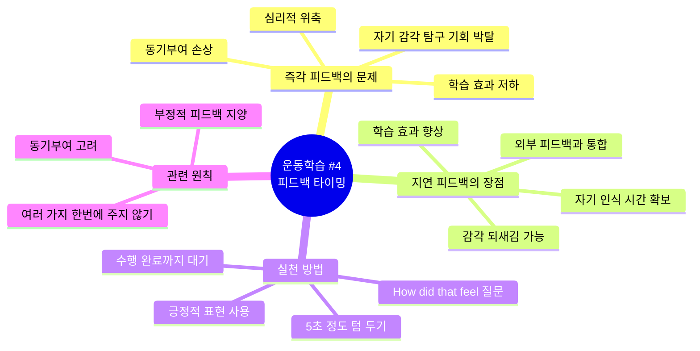
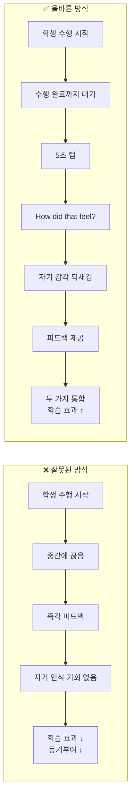
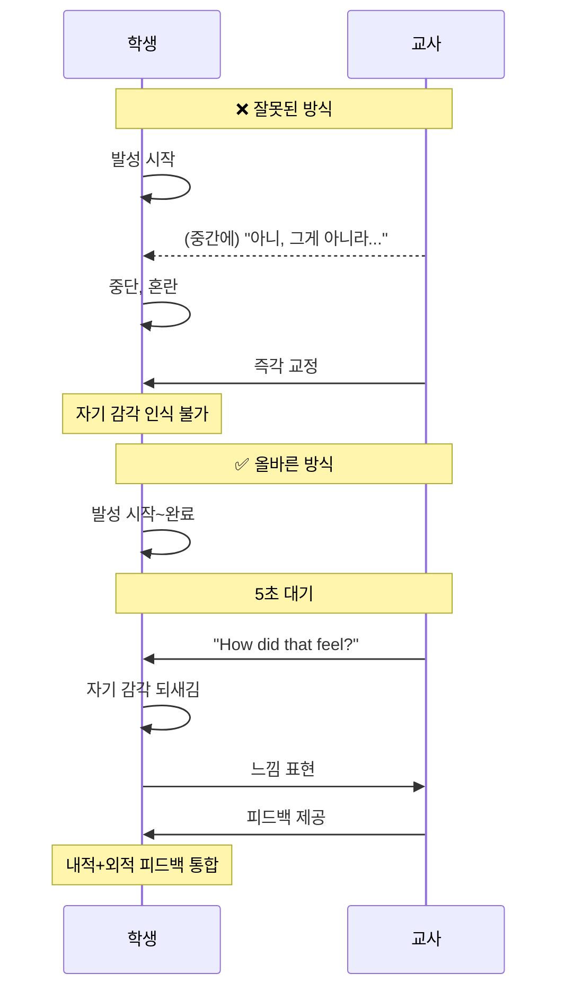
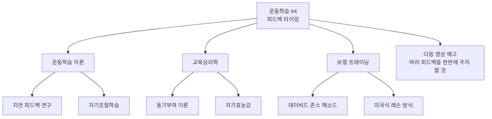

# [운동학습 #4] 절대로 놓으면 안되는 것!!

<iframe width="560" height="315" src="https://www.youtube.com/embed/pYYouYn2RBc" frameborder="0" allowfullscreen></iframe>

---

## 영상 개요

| 항목 | 내용 |
|------|------|
| 채널 | 의학발성 메디칼보이스 |
| 시리즈 | 운동학습 시리즈 #4 |
| 핵심 주제 | 피드백 타이밍의 중요성 |
| 난이도 | 🟢 기초 |
| 영상 길이 | 약 5분 |

---

## 핵심 요약

> **"절대로 놓으면 안 되는 것"** = 학생이 수행 중일 때 중간에 끊지 말 것

운동학습 이론에 따르면, 피드백을 **즉시** 제공하는 것보다 **몇 초의 텀**을 두고 제공하는 것이 학습에 더 효과적이다. 이는 학습자가 스스로 자신의 감각을 탐구하고 되새길 시간이 필요하기 때문이다.

---

## 챕터별 정리

### Chapter 1: 문제 상황 제시 🟢
`0:00 - 1:07` [▶ 구간 재생](https://www.youtube.com/watch?v=pYYouYn2RBc&t=0s)

**잘못된 레슨 예시**

강사가 레슨 상황을 시연하며 문제점을 보여준다:
- 학생이 발성/노래를 수행하는 중간에 계속 끊어버림
- "아니, 그게 아니라..." 식으로 즉각적인 개입
- 학생이 무엇을 했는지 스스로 인지할 틈이 없음

> **핵심 질문**: "이 레슨에서 뭐가 잘못되었을까요?"

---

### Chapter 2: 운동학습 이론 - 지연 피드백의 효과 🟡
`1:07 - 2:40` [▶ 구간 재생](https://www.youtube.com/watch?v=pYYouYn2RBc&t=67s)

**연구 결과: 즉각 피드백 vs 지연 피드백**

```
┌─────────────────────────────────────────────────┐
│  학습 효과 그래프                                │
│                                                 │
│  📈 빨간선 (지연 피드백) ─── 더 높은 위치        │
│  📉 파란선 (즉각 피드백) ─── 더 낮은 위치        │
│                                                 │
│  → 몇 초 텀을 둔 피드백이 더 효과적!            │
└─────────────────────────────────────────────────┘
```

**이론적 근거**:
1. 선생님이 주는 피드백도 중요하지만
2. **학생 스스로 자신의 감각을 탐구**하는 것도 중요
3. 중간에 끊으면 → 자기 감각 탐구 능력이 개발될 여지가 없어짐

**미국 보컬 교본/레슨의 방식**:
- 한 소절 또는 스케일 수행 후
- **"How did that feel?"** (방금 어땠어?)
- 약 5초 정도 텀을 준 후 피드백

> 💡 **핵심 원리**: 나의 감각을 한번 되새기고 → 그 다음에 피드백을 받으면 → 두 가지가 통합된다

---

### Chapter 3: 심리적 영향 - 동기부여와의 관계 🟡
`2:40 - 3:38` [▶ 구간 재생](https://www.youtube.com/watch?v=pYYouYn2RBc&t=160s)

**반복적으로 끊기면 발생하는 문제들**:

| 현상 | 심리적 결과 |
|------|-------------|
| 뭔가 하다가 끊김 | 지금까지 뭘 했는지 기억이 안 남 |
| 위축됨 | 자신감 저하 |
| 매번 "아니라고" 들음 | 내가 잘못하고 있는 것 같은 느낌 |
| 반복적 부정 피드백 | 선생님을 실망시킨 것 같은 기분 |
| 극단적 경우 | "내가 태어나지 말았어야 할 것 같다" |

**피드백과 동기부여의 관계**:
- 피드백이 **잘 나오면** → 동기부여에 도움
- 자꾸 중간에 끊으면 → 동기부여를 해침
- **부정적인 피드백을 하지 말라**는 것도 같은 맥락

**데이비드 존스(David Jones)의 조언**:
- "아 그 소리가 아니라요, 이것도 별로 안 좋고..."  ❌
- 이런 방식을 지양하고 긍정적 표현 권장

---

### Chapter 4: 실천 가이드라인 🟢
`3:38 - 4:35` [▶ 구간 재생](https://www.youtube.com/watch?v=pYYouYn2RBc&t=218s)

**올바른 피드백 방법 정리**:

```
✅ DO (해야 할 것)
──────────────────────────────────────
• 학생이 수행을 마칠 때까지 기다리기
• 몇 초 텀을 두고 피드백 제공
• "How did that feel?" 질문으로 자기 인식 유도
• 가능하면 좋은 말로 피드백

❌ DON'T (하지 말아야 할 것)
──────────────────────────────────────
• 수행 중간에 끊기
• 즉각적으로 "아니, 그게 아니라" 개입
• 부정적 표현으로 피드백
• 여러 가지를 한번에 주기 (다음 영상 예고)
```

**연구 기반 근거**:
> "제가 미국에서 배워서 그런 게 아니라, 연구에서도 그게 더 낫다고 하더라구요"

---

## 개념 마인드맵



---

## 핵심 개념 다이어그램



---

## 용어 사전

| 용어 | 영어 | 설명 |
|------|------|------|
| **운동학습** | Motor Learning | 운동 기술을 습득하고 숙달해가는 과정을 연구하는 학문 분야. 보컬 트레이닝도 성대 근육의 운동학습에 해당 |
| **지연 피드백** | Delayed Feedback | 수행 직후가 아닌 일정 시간(보통 몇 초) 후에 제공되는 피드백 |
| **즉각 피드백** | Immediate Feedback | 수행과 동시에 또는 직후에 제공되는 피드백 |
| **내적 피드백** | Intrinsic Feedback | 학습자 스스로 느끼는 감각적 정보 (고유수용감각) |
| **외적 피드백** | Extrinsic Feedback | 교사나 외부에서 제공하는 정보 |
| **동기부여** | Motivation | 학습을 지속하게 하는 내적/외적 요인 |

---

## 피드백 프로세스 비교



---

## 핵심 인사이트

### 1. 학습의 두 축
```
외적 피드백 (선생님) + 내적 피드백 (자기 감각)
         ↓                    ↓
    정보 제공              자기 인식
         ↓                    ↓
         └────── 통합 ──────┘
                  ↓
            진정한 학습
```

### 2. 타이밍의 중요성
- 즉각적 개입 = 내적 피드백 기회 박탈
- 적절한 텀 = 두 피드백의 통합 가능

### 3. 심리적 안전감
- 반복적 부정 피드백 → 학습 의욕 저하
- 긍정적 환경 → 도전 의지 유지

---

## 실전 적용 가이드

### 교사/트레이너를 위한 체크리스트

- [ ] 학생이 한 프레이즈/스케일을 완전히 끝낼 때까지 기다렸는가?
- [ ] 피드백 전 최소 3-5초의 텀을 주었는가?
- [ ] "어땠어?" 또는 "How did that feel?" 질문을 했는가?
- [ ] 부정적 표현 대신 건설적 표현을 사용했는가?
- [ ] 한 번에 하나의 포인트만 전달했는가?

### 학습자를 위한 자기 점검

1. **수행 후 멈추기**: 바로 다음으로 넘어가지 말고 잠시 멈춤
2. **자기 질문**: "방금 어떤 느낌이었지?"
3. **감각 기록**: 좋았던 점, 이상했던 점 인식
4. **피드백 수용**: 외부 피드백과 내 감각 비교

---

## 연결 개념



---

## 셀프테스트

### Q1. 빈칸 채우기
운동학습 연구에 따르면, 피드백을 즉시 제공하는 것보다 ( ______ )을 두고 제공하는 것이 학습에 더 효과적이다.

<details>
<summary>정답 보기</summary>
<strong>몇 초의 텀 (약 5초)</strong>
</details>

---

### Q2. O/X 퀴즈
학생이 발성하는 도중에 잘못된 점을 발견하면 즉시 멈추고 교정해주는 것이 효율적이다.

<details>
<summary>정답 보기</summary>
<strong>X</strong> - 수행이 끝날 때까지 기다린 후, 텀을 두고 피드백하는 것이 더 효과적이다.
</details>

---

### Q3. 서술형
지연 피드백이 즉각 피드백보다 효과적인 이유를 2가지 이상 설명하시오.

<details>
<summary>모범 답안</summary>

1. **자기 감각 탐구 기회**: 학습자가 스스로 자신의 감각을 되새기고 인식할 시간이 주어진다.

2. **내적-외적 피드백 통합**: 자신이 느낀 것(내적 피드백)과 선생님이 알려주는 것(외적 피드백)이 통합되어 더 깊은 학습이 일어난다.

3. **동기부여 유지**: 계속 끊기면 위축되고 자신감이 떨어지지만, 완수 후 피드백을 받으면 성취감과 학습 의욕이 유지된다.

4. **자기조절능력 개발**: 스스로 수정하고 조절하는 능력이 발달할 수 있는 여지가 생긴다.
</details>

---

### Q4. 적용 문제
당신이 보컬 트레이너라면, 학생이 노래 한 소절을 부른 직후 어떤 순서로 피드백을 제공하겠는가?

<details>
<summary>모범 답안</summary>

1. **대기** (3-5초): 학생이 스스로 느낌을 되새길 시간
2. **질문**: "방금 어땠어?" / "How did that feel?"
3. **경청**: 학생의 자기 인식 표현 듣기
4. **피드백**: 긍정적 표현으로, 한 가지 포인트만 전달
5. **다시 시도**: 새로운 시도 기회 제공
</details>

---

## 관련 자료 및 참고문헌

- **데이비드 존스 (David Jones)**: 보컬 교육 관련 저서
- **운동학습 연구**: 지연 피드백(Delayed Feedback) 관련 논문들
- **시리즈 이전 영상**: 운동학습 #1, #2, #3
- **다음 영상 예고**: 피드백 원칙 - 여러 가지를 한번에 주지 말 것

---

## 한 줄 요약

> 🎯 **"학생이 수행을 마칠 때까지 기다리고, 몇 초 후에 'How did that feel?'이라고 물어본 다음, 긍정적인 말로 피드백하라."**

---

*📅 노트 생성일: 2026-04-16*
*🎬 영상 시청일: 2026-04-16*
*📚 시리즈: 의학발성 메디칼보이스 - 운동학습*
