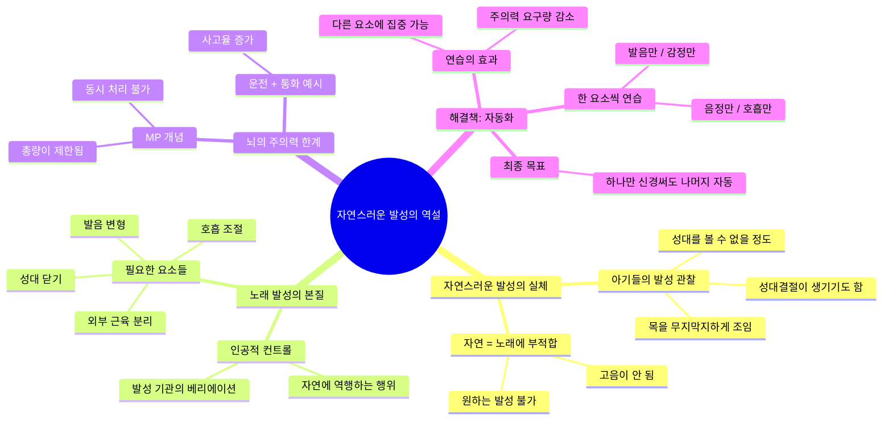
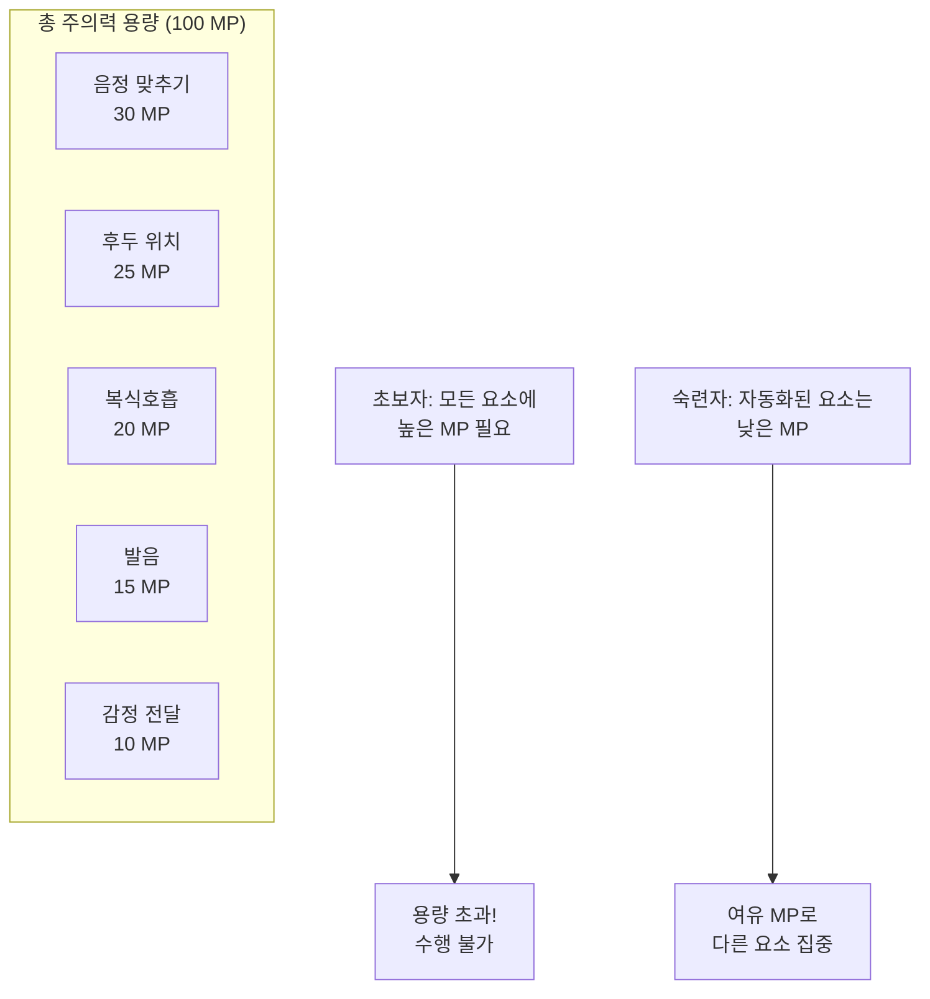
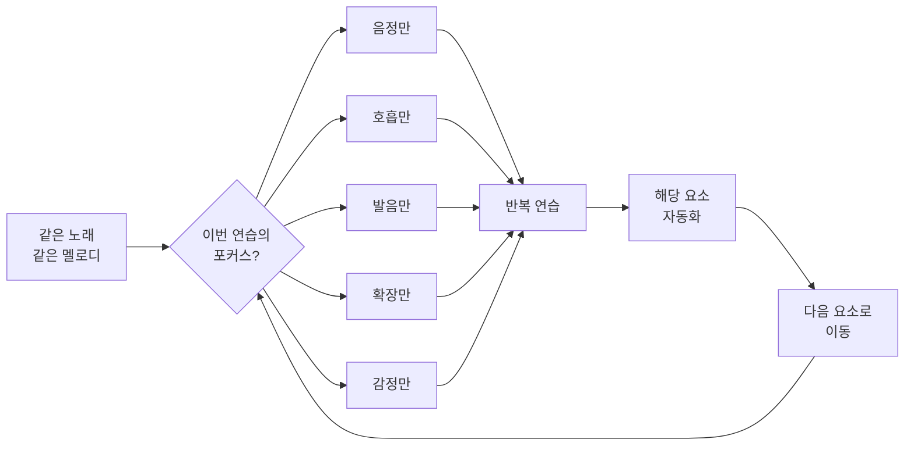
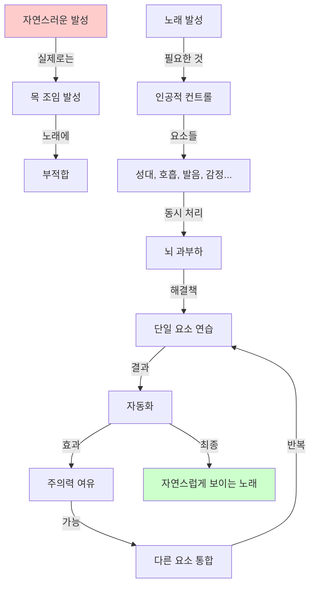
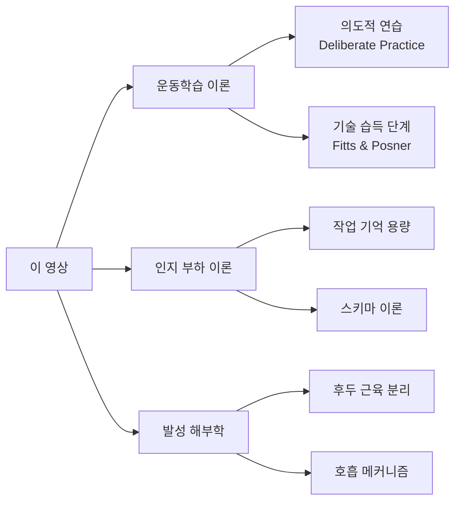

# [운동학습 #5] 진짜 자연스러운 발성으로는 노래를 할 수 없는 이유

<iframe width="560" height="315" src="https://www.youtube.com/embed/W2QD55uIyfI" frameborder="0" allowfullscreen></iframe>

---

## 영상 개요

| 항목 | 내용 |
|------|------|
| 채널 | 의학발성 메디칼보이스 |
| 시리즈 | 운동학습 #5 |
| 난이도 | 🟡 중급 |
| 핵심 주제 | 자연스러운 발성의 역설, 주의력 한계와 자동화 |
| 러닝타임 | 약 6분 40초 |

---

## 핵심 요약 (TL;DR)

> **"자연스러운 발성"은 사실 노래에 적합하지 않다. 아기들도 목을 조여서 우는 것이 자연스러운 것이며, 노래를 잘 부르려면 발성 기관을 인공적으로 컨트롤하는 법을 배워야 한다. 그러나 뇌는 여러 가지를 동시에 처리하지 못하므로, 한 번에 한 요소씩 연습하여 자동화시켜야 한다.**

---

## 마인드맵



---

## 챕터별 상세 정리

### Chapter 1: 자연스러운 발성의 실체 (0:00 - 1:50)
[구간 재생](https://www.youtube.com/watch?v=W2QD55uIyfI&t=0s)

#### 핵심 논점: "자연스러운 발성을 되찾는다"는 말의 오류

발성 관련 정보를 접하다 보면 흔히 듣는 말이 있다:
- "아이들 소리가 자연스러운 소리다"
- "여러분이 뭔가를 잘못해서 자연스러운 소리를 잃었다"
- "우리는 그 자연스러운 것을 다시 되찾아야 한다"

#### 이비인후과 전문의의 관찰

> **"전공의 때 아기들 내시경을 가져다 보면, 아기들이 울 때 목을 무지막지하게 조여서 성대를 볼 수가 없었다."**

| 관찰 사실 | 의미 |
|-----------|------|
| 아기들은 목을 극도로 조여서 운다 | 자연스러운 발성 = 목 조임 |
| 성대가 보이지 않을 정도 | 외후두근 과도한 사용 |
| 아기들도 성대결절이 생긴다 | 자연스러운 발성도 손상 가능 |
| 시간이 지나면 좋아지는 경우가 많음 | 성장과 함께 개선 |

#### 핵심 통찰

```
자연스럽게 노래를 잘한다 ≠ 자연스러운 발성을 한다
자연스럽게 노래를 잘한다 = 인공적 컨트롤이 자동화된 상태
```

---

### Chapter 2: 노래 발성은 자연에 역행하는 행위 (1:50 - 3:40)
[구간 재생](https://www.youtube.com/watch?v=W2QD55uIyfI&t=110s)

#### 노래를 잘한다는 것의 본질

> **"노래를 잘한다는 건, 본능적인 것들을 하나하나 우리가 원하는 방식대로 베리에이션 해야 되는 것"**

노래 발성에 필요한 인공적 컨트롤 요소들:

| 요소 | 자연스러운 상태 | 노래에 필요한 상태 |
|------|----------------|-------------------|
| 성대 닫기 | 외부 근육(목)도 함께 조임 | 성대 근육만 사용 |
| 외부 근육 | 성대와 함께 작동 | 분리하여 이완 |
| 발음 | 일상 발음 그대로 | 노래 발음에 맞게 변형 |
| 호흡 | 무의식적 | 의식적 복식호흡 |

#### 영어 발음과의 비유

> **"우리가 영어발음을 자연스럽게 만들려면 얼마나 오래 걸리고 얼마나 힘듭니까"**

- 영어 발음 습득 = 새로운 조음 패턴 학습
- 노래 발성 습득 = 새로운 발성 패턴 학습
- 둘 다 **의식적 노력 + 반복 연습**이 필요

#### 문제점: 의식적으로 하면 안 된다

```
의식적으로 여러 요소를 동시에 조절하려 함
          ↓
      뇌 과부하
          ↓
    수행 능력 저하
```

---

### Chapter 3: 뇌의 주의력 한계 - MP 개념 (3:40 - 5:00)
[구간 재생](https://www.youtube.com/watch?v=W2QD55uIyfI&t=220s)

#### 운동학습 이론의 핵심 원리

> **"과제 수행에 요구되는 주의의 양이 수행자가 이용할 수 있는 전체 주의의 양을 초과할 경우에는 과제 수행이 어렵다. 연습을 통해 이러한 주의의 양을 줄일 수 있다."**

#### 주의력(MP) 모델



#### 일상 예시: 운전과 통화

| 상황 | 주의력 배분 | 결과 |
|------|-------------|------|
| 운전만 | 운전에 충분한 MP | 정상 수행 |
| 운전 + 통화 | 두 곳에 MP 분산 | 사고율 증가 |
| 초보 운전 + 통화 | 극심한 MP 부족 | 위험 |
| 숙련 운전 + 통화 | 운전 자동화로 여유 | 상대적으로 안전 |

#### 가수들의 비밀

> **"가수들에게 '노래할 때 어떤 생각을 하고 부르세요?' 하면, '감정 전달에만 충실했어요' 또는 '호흡에만 집중했습니다' 이런 식으로 얘기합니다."**

가수들의 특징:
- 여러 가지를 한 번에 집중하지 않음
- 모든 것을 아우르는 **한 요소에만 집중**
- 나머지는 이미 **자동화**되어 있음

---

### Chapter 4: 해결책 - 단일 요소 연습법 (5:00 - 6:25)
[구간 재생](https://www.youtube.com/watch?v=W2QD55uIyfI&t=300s)

#### 연습의 핵심 원칙

> **"모든 걸 한 번에 신경쓰면서 연습하지 마시고, 딱 한 요소만 신경 써 가지고 연습을 해보세요."**

#### 단일 요소 연습법 실천 가이드



#### 연습 세션 예시

| 회차 | 포커스 요소 | 나머지 요소 |
|------|-------------|-------------|
| 1회 | 음정 맞추기 | 신경 끄기 |
| 2회 | 호흡 (복식) | 신경 끄기 |
| 3회 | 확장 (성구) | 신경 끄기 |
| 4회 | 발음 | 신경 끄기 |
| 5회 | 2개 요소 통합 | 나머지는 자동 |
| ... | 점진적 통합 | ... |

#### 자동화의 과정

```
[초보 단계]
모든 요소 → 높은 주의력 필요 → 동시 수행 불가

        ↓ (단일 요소 반복 연습)

[중급 단계]
일부 요소 → 자동화됨 → 다른 요소에 집중 가능

        ↓ (지속적 연습)

[숙련 단계]
대부분 요소 → 자동화 → 감정/표현에만 집중
```

---

### Chapter 5: 자동화 이론 - 학술적 배경 (5:40 - 6:25)
[구간 재생](https://www.youtube.com/watch?v=W2QD55uIyfI&t=340s)

#### 자동 처리(Automatic Processing)의 특징

운동학습 문헌에서 제시하는 자동 처리의 특징:

| 특징 | 설명 |
|------|------|
| 정보처리 속도 빠름 | 의식적 처리보다 훨씬 빠른 반응 |
| 주의 요구량 적음 | 최소한의 MP만 사용 |
| 병렬 처리 | 여러 요소 동시 처리 가능 |
| 비의도적 발현 | 의식하지 않아도 자동 실행 |

#### 연구 사례: 스케이팅 실험 (Leavitt et al., 1979)

> **"스케이팅만 할 때보다 스틱과 퍽을 조작하면서 스케이팅을 할 때 수행력이 감소하는 것이 관찰되었는데, 숙련자일수록 이러한 차이가 줄어들었다."**

| 조건 | 초보자 | 숙련자 |
|------|--------|--------|
| 스케이팅만 | 기준 수행력 | 기준 수행력 |
| 스케이팅 + 퍽 조작 | 큰 폭 감소 | 작은 폭 감소 |
| 차이 | 크다 | 작다 |

**해석**: 숙련자는 스케이팅이 자동화되어 퍽 조작에 더 많은 주의력을 할당할 수 있음

---

## 핵심 개념 정리

### 개념 관계도



### 역설적 진실

| 표면적 이해 | 실제 원리 |
|-------------|-----------|
| "자연스럽게 노래해" | 자동화된 인공 컨트롤 |
| "힘 빼고 불러" | 특정 근육만 선택적 이완 |
| "그냥 느끼면서 불러" | 기술적 요소가 이미 자동화된 상태 |
| "천재는 생각 안 하고 불러" | 엄청난 연습의 결과 |

---

## 용어 사전

| 용어 | 정의 | 영상 맥락 |
|------|------|-----------|
| **자연스러운 발성** | 훈련 없이 본능적으로 나오는 발성. 목 조임 동반 | 노래에는 부적합한 발성 방식 |
| **인공적 컨트롤** | 발성 기관을 의식적으로 분리, 조절하는 것 | 노래 발성의 본질 |
| **주의력(MP)** | 뇌가 과제 수행에 할당할 수 있는 인지 자원의 총량 | 게임의 MP에 비유 |
| **자동화/자동 처리** | 연습을 통해 최소한의 주의력으로 수행 가능한 상태 | 숙련자의 특징 |
| **통제적 처리** | 의식적 주의력이 많이 필요한 정보 처리 방식 | 초보자의 상태 |
| **병렬 처리** | 여러 정보를 동시에 처리하는 것 | 자동화의 결과 |
| **외후두근** | 성대 바깥쪽의 근육들 (목 근육) | 노래할 때 분리해야 함 |
| **성대 근육** | 성대 자체를 움직이는 내부 근육 | 독립적 컨트롤 필요 |

---

## 실천 가이드

### 연습 프레임워크

```
┌─────────────────────────────────────────┐
│         단일 요소 연습 프레임워크          │
├─────────────────────────────────────────┤
│                                         │
│  1. 연습곡 선정 (익숙한 곡)               │
│           ↓                             │
│  2. 오늘의 포커스 요소 결정               │
│     - 음정? 호흡? 발음? 성구? 감정?       │
│           ↓                             │
│  3. 해당 요소에만 집중하여 부르기          │
│     - 나머지는 신경 끄기                  │
│           ↓                             │
│  4. 녹음 후 해당 요소만 체크              │
│           ↓                             │
│  5. 충분히 익숙해지면 다음 요소로          │
│           ↓                             │
│  6. 점진적으로 요소 통합                  │
│                                         │
└─────────────────────────────────────────┘
```

### 주간 연습 스케줄 예시

| 요일 | 포커스 요소 | 세부 목표 |
|------|-------------|-----------|
| 월 | 음정 | 정확한 피치 유지 |
| 화 | 호흡 | 복식호흡, 호흡 지지 |
| 수 | 발음 | 노래 발음, 모음 순화 |
| 목 | 성구 전환 | 부드러운 믹스 |
| 금 | 음정 + 호흡 | 2요소 통합 |
| 토 | 전체 통합 | 모든 요소 연결 |
| 일 | 휴식 또는 감정 | 표현력 |

---

## 셀프테스트

### 이해도 점검 질문

1. **"자연스러운 발성을 되찾아야 한다"는 말이 왜 부정확한가?**
   <details>
   <summary>정답 확인</summary>
   자연스러운 발성(아기의 발성)은 목을 조이는 방식이며, 이는 노래에 적합하지 않다. 노래 발성은 자연에 역행하는 인공적 컨트롤을 필요로 한다.
   </details>

2. **뇌의 주의력(MP) 한계가 노래 연습에 주는 시사점은?**
   <details>
   <summary>정답 확인</summary>
   뇌는 여러 가지를 동시에 처리하지 못하므로, 한 번에 모든 요소를 신경쓰며 연습하면 효과가 없다. 한 요소씩 집중하여 자동화시켜야 한다.
   </details>

3. **가수들이 "감정에만 집중했다"고 말하는 이유는?**
   <details>
   <summary>정답 확인</summary>
   기술적 요소들(음정, 호흡, 발음 등)이 이미 자동화되어 있기 때문에, 의식적으로는 감정이나 표현 같은 상위 요소에만 집중할 수 있는 것이다.
   </details>

4. **단일 요소 연습법의 핵심 원리는?**
   <details>
   <summary>정답 확인</summary>
   같은 곡을 부르더라도 매번 하나의 요소(음정, 호흡, 발음 등)에만 집중하여 연습하고, 그 요소가 자동화되면 다음 요소로 넘어간다.
   </details>

5. **자동화(자동 처리)의 4가지 특징을 설명하라.**
   <details>
   <summary>정답 확인</summary>
   (1) 정보처리 속도가 빠르다, (2) 주의 요구량이 적다, (3) 정보가 병렬적으로 처리된다, (4) 비의도적으로 발현된다.
   </details>

### 적용 질문

1. 현재 본인의 노래 연습에서 가장 자동화가 안 된 요소는 무엇인가?

2. 이번 주 연습에서 어떤 단일 요소에 집중할 것인가?

3. "자연스럽게 불러"라는 피드백을 받았을 때, 실제로 무엇을 해야 하는가?

---

## 관련 개념 연결



### 추천 후속 학습

- **운동학습 시리즈 다른 영상**: 같은 채널의 #1~#4 영상
- **의도적 연습(Deliberate Practice)**: Anders Ericsson의 연구
- **인지 부하 이론**: John Sweller의 연구
- **보컬 해부학**: 후두, 성대, 호흡 기관의 구조

---

## 인용구

> "아기들이 울 때 보면 목을 무지막지하게 조여 가지고 성대를 볼 수가 없어요." (00:53)

> "노래를 잘한다는 건 이런 본능적인 것들을 하나하나 우리가 원하는 방식대로 베리에이션 해야 되는 거거든요." (02:43)

> "우리의 뇌는 생각보다 멍청해 가지고 여러 가지를 한 번에 하지 못해요." (02:56)

> "가수들이 여러 가지를 한 번에 집중한다기 보다는, 모든 것들을 아우르는 한 요소에만 집중하는 거예요." (03:37)

> "모든 걸 한 번에 신경쓰면서 연습하지 마시고, 딱 한 요소만 신경 써 가지고 연습을 해보세요." (04:41)

---

## 메타 정보

- **노트 작성일**: 2026-04-16
- **영상 시청일**: 2026-04-16
- **노트 버전**: 1.0
- **예상 복습 주기**: 1주 후, 1개월 후, 3개월 후

---

## 관련 노트 링크

- [[운동학습 시리즈]]
- [[발성 트레이닝]]
- [[의도적 연습]]
- [[인지 부하 이론]]
- [[자동화와 습관 형성]]
