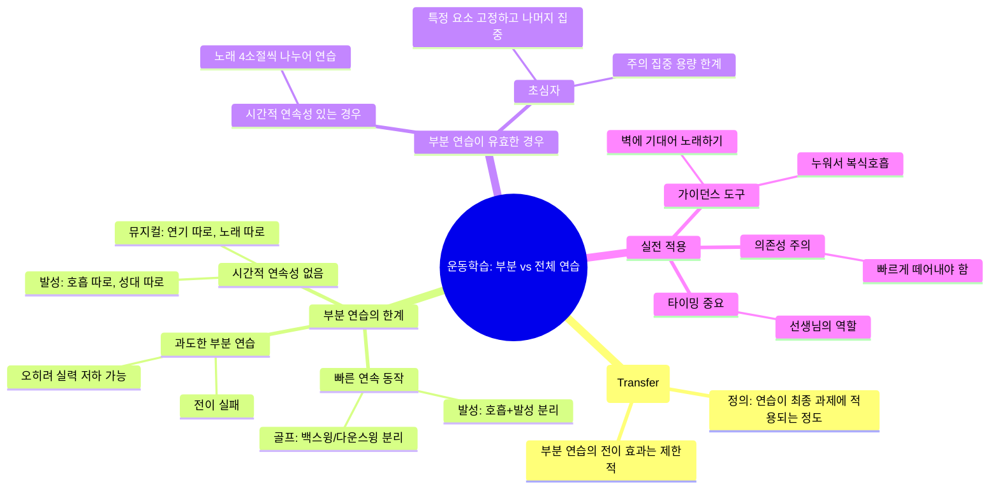
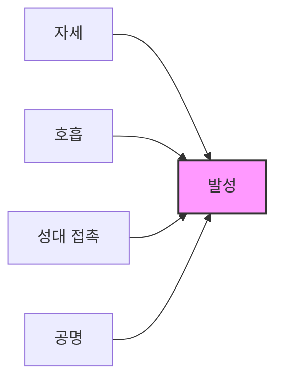
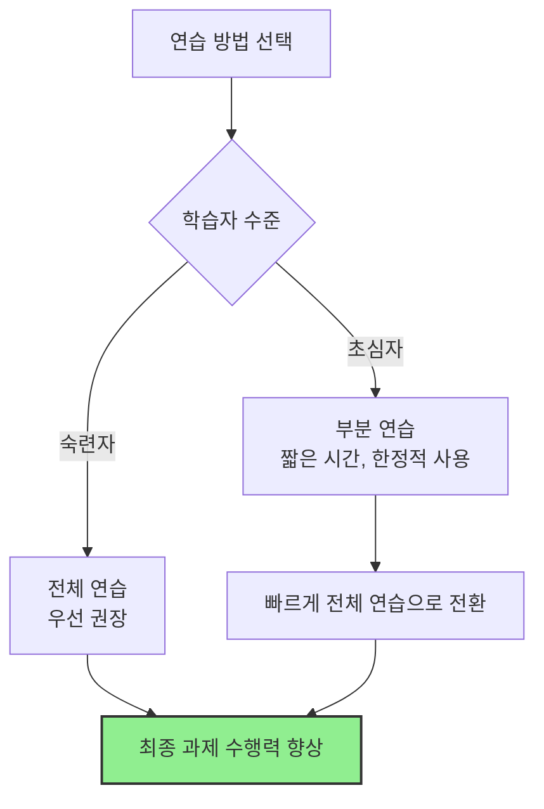

# [운동학습 #6] 가능한 한 빨리 노래 연습으로 전환해야 하는 이유, 부분 연습과 전체 연습

<iframe width="560" height="315" src="https://www.youtube.com/embed/dbErfzsUoD8" frameborder="0" allowfullscreen></iframe>

---

## 핵심 요약 (TL;DR)

> **부분 연습은 생각보다 최종 과제에 도움이 되지 않는 경우가 많다.**
> 시간적 연속성이 없거나, 빠르게 한 번에 이루어지는 동작을 분리해서 연습하면 전이(Transfer)가 잘 일어나지 않는다. 초심자에게는 짧은 시간의 부분 연습이 도움될 수 있지만, 가능한 빨리 전체 연습(노래 연습)으로 전환해야 한다.

**난이도**: 🟢 기초 ~ 🟡 중급

---

## 마인드맵



---

## 챕터별 정리

### Chapter 1: 부분 연습과 전체 연습의 개념 (0:00~1:05)
[▶ 구간 재생](https://www.youtube.com/watch?v=dbErfzsUoD8&t=0s)

**난이도**: 🟢 기초

#### 핵심 내용
- **부분 연습(Part Practice)**: 전체 과제를 분리해서 부분부분 연습하는 방법 (= 분습법)
- **전체 연습(Whole Practice)**: 전체를 한 번에 연습하는 방법 (= 전습법)
- **전이(Transfer)**: 연습한 것이 최종 과제 수행 능력에 얼마나 적용되는지

> **핵심 질문**: 부분 연습을 어떻게 해야 최종 과제 전이가 될까?

#### 놀라운 사실
- **부분 연습은 실제로 최종 과제에 도움이 되지 않는 경우가 훨씬 더 많다**
- 단 하나의 예외: 부분 과제 간 **시간적 연속성**이 있을 때

---

### Chapter 2: 부분 연습이 실패하는 두 가지 경우 (1:05~2:38)
[▶ 구간 재생](https://www.youtube.com/watch?v=dbErfzsUoD8&t=65s)

**난이도**: 🟡 중급

#### 경우 1: 시간적 연속성이 없는 경우

| 예시 | 부분 연습 | 문제점 |
|------|----------|--------|
| 뮤지컬 | 연기 따로 + 노래 따로 | 함께 할 때 기대만큼 안 됨 |
| 발성 | 호흡 조절 따로 + 성대 조절 따로 | 노래에 충분히 반영 안 됨 |

> **발성 = 호흡 + 성대**가 함께 움직여야 하는 과제
> 따로 훈련하면 노래에 충분히 반영되지 않을 수 있다

#### 경우 2: 빠르게 한 번에 이루어지는 동작

| 예시 | 부분 연습 | 문제점 |
|------|----------|--------|
| 골프 | 백스윙 따로 + 다운스윙 따로 | 전체 수행 실력 향상에 도움 안 됨 |
| 발성 | 호흡 따로 + 소리 내기 따로 | 한 번에 할 때와 감각이 다름 |

> **백스윙과 다운스윙**을 따로 할 때와 두 개를 한 번에 이어서 할 때 **감각이 서로 다르다**

#### 위험성
- 부분 연습을 너무 오래 하면 전이가 일어나기는커녕 **최종 과제의 수행 능력을 떨어뜨리기도 함**

---

### Chapter 3: 발성 요소와 전체 훈련의 중요성 (2:38~3:14)
[▶ 구간 재생](https://www.youtube.com/watch?v=dbErfzsUoD8&t=158s)

**난이도**: 🟡 중급

#### 발성의 세부 요소



- 자세
- 호흡
- 성대 접촉
- 공명

> **이 요소들을 따로 훈련하는 것보다 가능하면 한 번에 훈련하는 것이 좋다**

#### 예시
- 깊은 호흡을 하고 소리를 내는 동작
- 호흡을 따로, 소리 내는 것을 따로 훈련하는 것보다
- **이 동작을 한 번에 만들어내는 것**을 훈련시키는 것이 더 큰 도움

---

### Chapter 4: 부분 연습이 유효한 경우와 가이던스 (3:14~4:10)
[▶ 구간 재생](https://www.youtube.com/watch?v=dbErfzsUoD8&t=194s)

**난이도**: 🟢 기초 ~ 🟡 중급

#### 부분 연습이 필요한 경우
- **초심자**: 각 부분 과제 자체가 잘 이루어지지 않는 경우
- **이유**: 개인이 주의 집중할 수 있는 **용량의 한계**가 있기 때문

#### 발성 훈련 도구의 원리

| 훈련 방법 | 고정되는 요소 | 집중할 수 있는 요소 |
|----------|--------------|-------------------|
| 벽에 뒤통수/날개뼈/골반 대고 노래 | 자세 | 호흡, 성대, 공명 |
| 배에 가벼운 물건 올려놓고 누워서 노래 | 복식호흡 (자동화) | 성대, 공명 등 |

> 발성 훈련 도구들은 **어떤 요소를 고정**시켜 놓고 **나머지 요소에만 집중**할 수 있도록 만들어주는 원리

#### 주의사항: 가이던스 의존성
- 이런 훈련들은 **가이던스(Guidance)**이기 때문에
- 너무 오래 사용하면 **의존성**이 생길 수 있음
- **빠르게 떼어내야 함**

---

### Chapter 5: 결론 및 실전 적용 (4:10~4:48)
[▶ 구간 재생](https://www.youtube.com/watch?v=dbErfzsUoD8&t=250s)

**난이도**: 🟢 기초

#### 핵심 정리



#### 두 가지 핵심 원칙

| 원칙 | 내용 |
|------|------|
| **원칙 1** | 일반적으로 **전체 연습이 부분 연습보다 우월**하다 |
| **원칙 2** | 초심자의 경우, **한정적으로 사용할 경우** 부분 연습이 도움이 될 수 있다 |

#### 선생님/코치의 역할
- 부분 연습에서 전체 연습으로 **넘어가는 타이밍**을 잘 캐치해야 함
- 숙련된 사람에게 지나치게 과제를 분리해서 연습시키면 **큰 도움이 되지 않음**
- 초심자에게 너무 전체 과제만 연습시키면 **전혀 감을 잡지 못할 가능성**이 높음

---

## 용어 사전

| 용어 | 정의 | 영문 |
|------|------|------|
| **부분 연습** | 전체 과제를 분리해서 부분부분 연습하는 방법 | Part Practice |
| **전체 연습** | 전체를 한 번에 연습하는 방법 | Whole Practice |
| **전이** | 연습한 것이 최종 과제 수행 능력에 적용되는 정도 | Transfer |
| **분습법** | 부분 연습의 다른 표현 | - |
| **전습법** | 전체 연습의 다른 표현 | - |
| **가이던스** | 학습을 돕기 위한 보조 도구/방법, 의존성 주의 필요 | Guidance |
| **시간적 연속성** | 동작들이 시간 순서대로 이어지는 특성 | Temporal Continuity |
| **주의 집중 용량** | 한 번에 집중할 수 있는 인지적 자원의 한계 | Attention Capacity |

---

## 핵심 인사이트

### 1. 부분 연습의 역설
> 효과적으로 보이는 부분 연습이 실제로는 최종 과제에 도움이 안 되는 경우가 더 많다

### 2. 감각의 차이
> 동작을 분리해서 할 때와 한 번에 이어서 할 때의 **감각이 서로 다르다**
> 이것이 부분 연습의 전이가 실패하는 핵심 이유

### 3. 가이던스의 양면성
> 발성 훈련 도구들은 특정 요소를 고정시켜 집중을 돕지만,
> 오래 사용하면 **의존성**이 생길 수 있어 빠르게 떼어내야 함

### 4. 수준별 맞춤 전략
> - **초심자**: 짧은 시간의 부분 연습 → 빠르게 전체 연습으로 전환
> - **숙련자**: 전체 연습 우선, 부분 연습은 제한적 사용

---

## 실전 적용 가이드

### 발성 연습 시

```
[비효율적 방법]
1. 호흡 연습 30분
2. 성대 접촉 연습 30분
3. 공명 연습 30분
→ 노래 부르기

[효율적 방법]
1. 간단한 부분 연습 (5-10분, 초심자만)
2. 빠르게 노래 연습으로 전환
3. 노래 안에서 전체적으로 훈련
```

### 뮤지컬 연습 시

```
[비효율적 방법]
- 연기만 2주 집중
- 노래만 2주 집중
→ 합치기

[효율적 방법]
- 처음부터 연기+노래 함께 연습
- 부분적으로 어려운 곳만 짧게 분리 연습
- 바로 전체 연습으로 복귀
```

---

## 셀프테스트

### Q1. 부분 연습이 전이되지 않는 두 가지 경우는?
<details>
<summary>정답 보기</summary>

1. **시간적 연속성이 없는 경우** (예: 뮤지컬에서 연기와 노래를 따로 연습)
2. **빠르게 한 번에 이루어지는 동작**을 분리하는 경우 (예: 골프의 백스윙/다운스윙)

</details>

### Q2. 초심자에게 부분 연습이 도움이 될 수 있는 이유는?
<details>
<summary>정답 보기</summary>

개인이 **주의 집중할 수 있는 용량에 한계**가 있기 때문에, 특정 요소를 고정시키고 나머지 요소에만 집중할 수 있도록 해주면 학습에 도움이 됨

</details>

### Q3. 발성 훈련 도구(벽에 기대기, 누워서 노래하기 등)의 원리는?
<details>
<summary>정답 보기</summary>

**어떤 요소를 고정**시켜 놓고 **나머지 요소에만 집중**해서 조절할 수 있도록 만들어주는 원리
- 벽에 기대기: 자세 고정 → 나머지 집중
- 누워서 노래: 복식호흡 자동화 → 나머지 집중

</details>

### Q4. 가이던스 도구 사용 시 주의할 점은?
<details>
<summary>정답 보기</summary>

너무 오래 사용하면 **의존성**이 생길 수 있으므로 **빠르게 떼어내야** 함

</details>

### Q5. 선생님/코치가 캐치해야 할 중요한 타이밍은?
<details>
<summary>정답 보기</summary>

부분 연습에서 **전체 연습으로 넘어가는 타이밍**
- 숙련자에게 과도한 부분 연습 X
- 초심자에게 처음부터 전체 연습만 X

</details>

---

## 관련 개념 연결

- [[운동학습-가이던스]] - 보조 도구의 양면성
- [[주의집중-용량한계]] - 인지 자원의 제한
- [[전이-학습이론]] - 연습과 실제 수행의 관계
- [[발성-기초원리]] - 호흡, 성대, 공명의 통합

---

## 메타 정보

- **영상 길이**: 약 5분
- **핵심 키워드**: 부분 연습, 전체 연습, 전이, 시간적 연속성, 가이던스
- **추천 대상**: 보컬 트레이너, 음악 교육자, 발성 학습자, 운동 코치
- **시리즈**: 운동학습 #6
