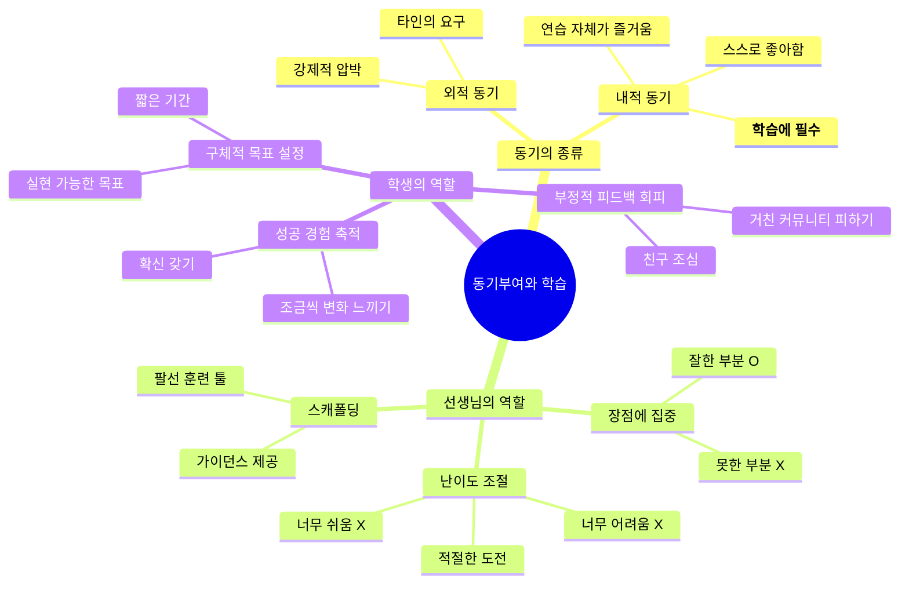
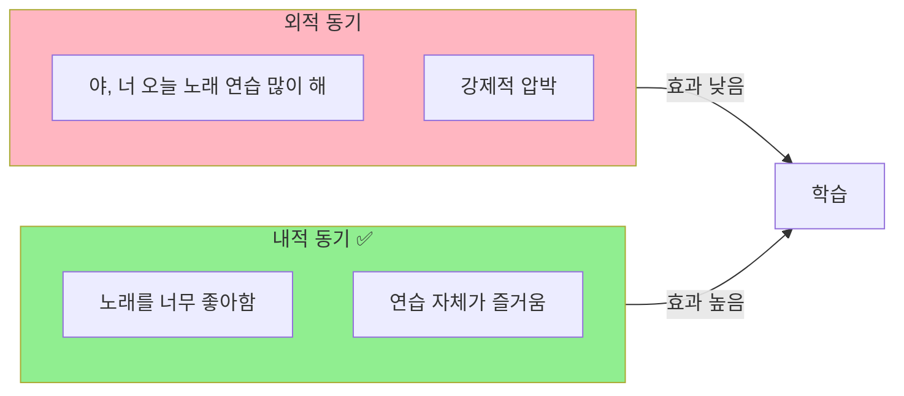
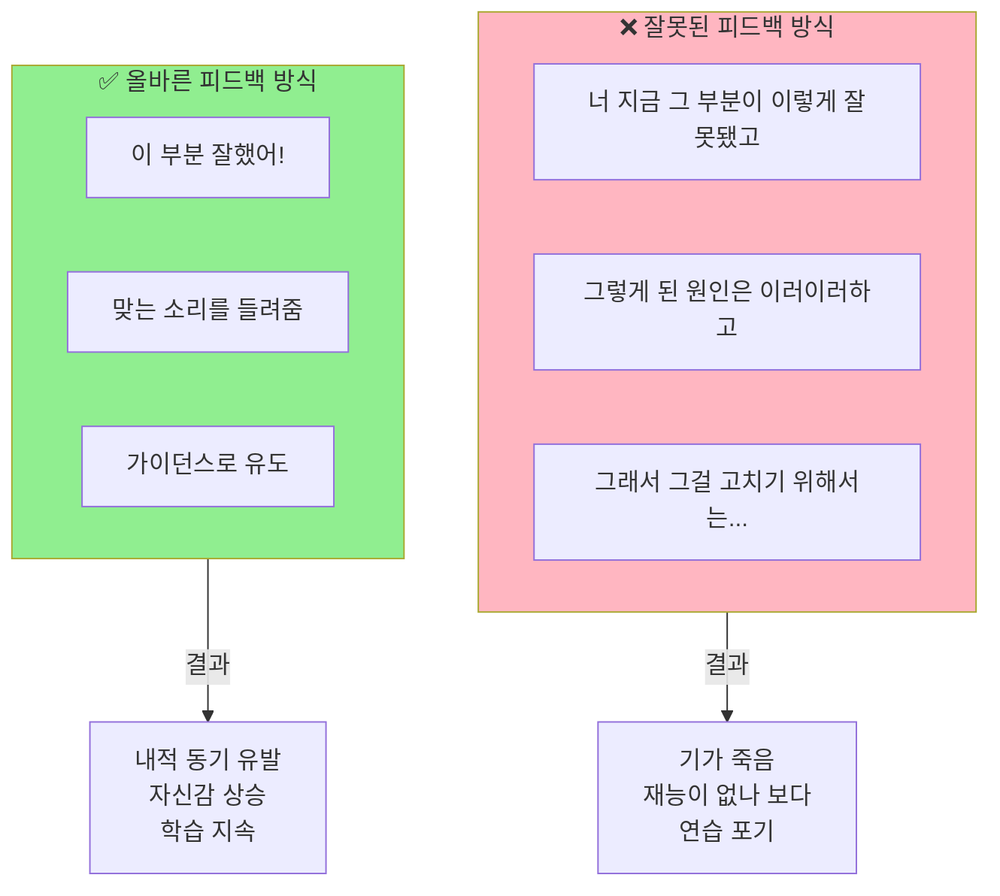
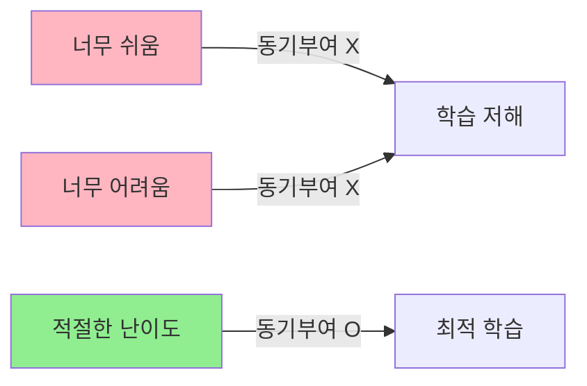
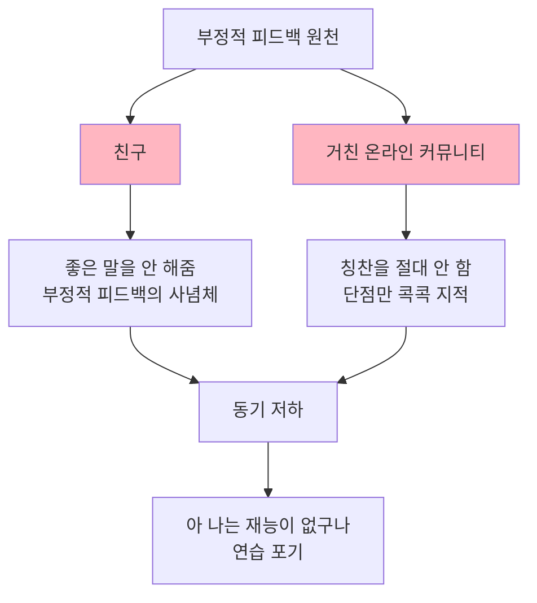
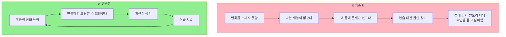
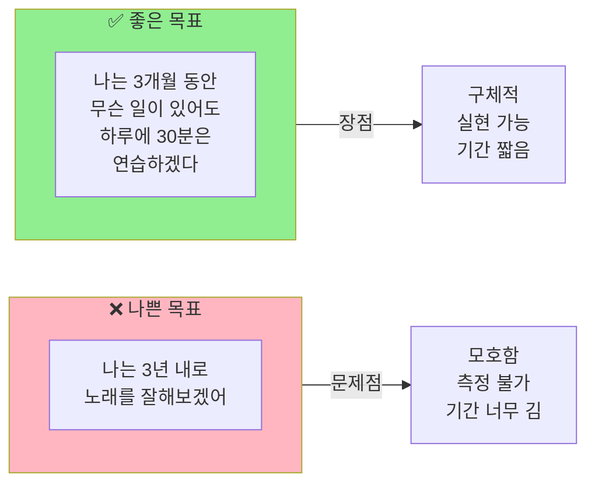
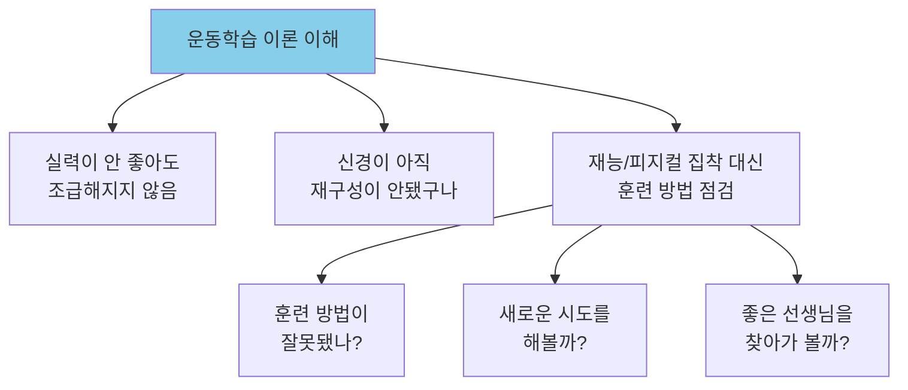
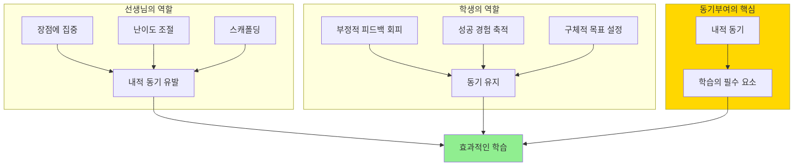

# [운동학습 #7] 학습이 일어나기 위해 반드시 필요한 것, 동기부여

<iframe width="560" height="315" src="https://www.youtube.com/embed/HaFjeCanil8" frameborder="0" allowfullscreen></iframe>

---

## 영상 개요

| 항목 | 내용 |
|------|------|
| 채널 | 의학발성 메디칼보이스 |
| 주제 | 운동학습 이론 제7편 - 동기부여 |
| 핵심 메시지 | 학습에는 내적 동기가 필수이며, 선생님과 학생 모두 동기부여를 위한 전략이 필요하다 |
| 난이도 | 🟢 기초 |
| 영상 길이 | 약 8분 30초 |

---

## 목차

1. [[#챕터 1 동기부여의 중요성 (0:00-1:51)|동기부여의 중요성]]
2. [[#챕터 2 선생님이 할 수 있는 일 (1:51-4:32)|선생님이 할 수 있는 일]]
3. [[#챕터 3 학생이 할 수 있는 일 (4:32-7:03)|학생이 할 수 있는 일]]
4. [[#챕터 4 결론 및 격려 (7:03-8:36)|결론 및 격려]]

---

## 마인드맵

---

## 챕터 1: 동기부여의 중요성 (0:00-1:51)

> [구간 재생](https://www.youtube.com/watch?v=HaFjeCanil8&t=0s)

### 핵심 내용

발성 훈련이나 음성 훈련은 **반복 훈련**을 통해 **대뇌 피질의 신경을 리모델링**해야 하기 때문에, 제대로 하더라도 **시간이 굉장히 오래 걸린다**. 이 과정을 버티기 위해서는 동기부여가 필수적이다.

### 외적 동기 vs 내적 동기

| 구분 | 외적 동기 | 내적 동기 |
|------|----------|----------|
| 정의 | 외부 압박이나 보상에 의한 동기 | 마음 속에서 우러나오는 동기 |
| 예시 | "오늘 노래 연습 안 하면 혼나" | "노래가 너무 좋아서 연습이 즐거워" |
| 지속성 | 낮음 | 높음 |
| 학습 효과 | 제한적 | 최적 |

### 왜 동기부여가 중요한가?

- 아마추어가 프로를 따라가기 힘든 가장 큰 이유가 바로 **동기부여의 차이**
- 실용음악과 출신 선생님도 학창시절 가장 많이 들은 말이 "입 10번 더!" (반복의 중요성)
- 동기부여 연구는 운동학습 분야에서 굉장히 많이 이루어져 있음

> [!quote] 핵심 인용
> "뭘 하던지 동기가 중요한 건 당연하겠지만, 특히 발성 훈련이나 음성 훈련은 반복 훈련으로 대뇌 피질의 신경을 리모델링해야 되기 때문에 제대로 한다 하더라도 시간이 굉장히 오래 걸립니다."

---

## 챕터 2: 선생님이 할 수 있는 일 (1:51-4:32)

> [구간 재생](https://www.youtube.com/watch?v=HaFjeCanil8&t=111s)

### 1. 학생의 장점에 집중하기 🟢 기초

운동학습 이론의 **피드백 원칙** 중 하나: 학생의 **못한 부분이 아니라 잘한 부분에 집중**해서 피드백하라.

#### 왜 칭찬이 중요한가?

- 사람은 본능적으로 **잘못한 것부터 눈에 들어옴**
- 계속 지적받으면 "나는 재능이 없나 보다" → 연습 포기
- **팩폭(팩트 폭력)은 장기 학습에 도움이 되지 않는다**는 연구 결과

> [!tip] 실전 팁
> 틀렸다는 말을 하지 말고, **맞는 소리를 들려줘서 학생을 그쪽으로 이끌거나**, 학생이 그 소리를 좀 더 쉽게 낼 수 있도록 **가이던스(팔선 훈련 툴)**를 사용하라.

### 2. 과제 난이도 조절하기 🟡 중급

**최적 난이도**: 선생님이 살짝 도와줬을 때, 학생이 **몇 번 정도 해보면 성공할 수 있는** 수준

#### 난이도 조절 방법

| 조절 요소 | 설명 |
|----------|------|
| 음역대 조절 | 학생이 편한 음역대에서 시작 |
| 입모양 조절 | 발음하기 쉬운 모음으로 변경 |
| 자모음 변경 | 더 쉬운 자음/모음 조합 사용 |

> [!important] 스캐폴딩 (Scaffolding)
> 이렇게 세밀하게 난이도를 조절하는 것을 해외에서는 **"스캐폴딩(Scaffolding)"**이라고 부르며, 마치 **예술**과 같다고 평가함. 이를 위해서는 **발성 기관의 움직임이나 언어에 대한 배경 지식**과 **충분한 경험**이 필요.

### 3. 학생의 상대적 장점 부각하기 🟢 기초

비슷한 수준의 학생들 사이에서 해당 학생이 **특히 잘하는 것**을 찾아서 부각시키기.

**예시**:
- "너는 목소리에 파워가 있어"
- "너는 목소리가 되게 음색이 좋아"
- "너는 감정 표현이 좋아"

---

## 챕터 3: 학생이 할 수 있는 일 (4:32-7:03)

> [구간 재생](https://www.youtube.com/watch?v=HaFjeCanil8&t=272s)

### 1. 부정적 피드백에 노출되지 않기 🟢 기초

> [!warning] 주의
> - **친구 조심하세요!** 친구들은 좋은 말을 잘 해주지 않음
> - 노래 피드백 커뮤니티 중 **분위기가 거친 곳은 피하기**
> - 좋은 얘기만 들으면서 해도 힘든데, 굳이 부정적 피드백을 받으러 다닐 필요 없음

### 2. 성공의 경험 쌓기 🔴 심화

#### 왜 조기 레슨이 중요한가?

- 발성은 **맞는 방법으로 훈련하지 않으면** 아무리 오래 연습해도 잘 안 됨
- 잘못된 방법으로 좌절이 반복되면 → "나는 재능이 없구나" 사고에 빠짐
- **조금씩이나마 목소리가 좋은 방향으로 변하는 것을 느끼는 것**이 가장 중요
- 이 확신이 생기면, 타고난 가수를 봐도 **노력한 부분이 보임**

> [!quote] 핵심 인용
> "마음속에 그런 확신이 생기는 게 제일 중요해요. 그러면 타고났다는 가수를 봐도 노력한 부분이 또 보입니다. 아, 이 부분을 타고났지만 여기는 노력해서 만든 거구나."

### 3. 구체적인 목표 설정 🟢 기초

| 목표 설정 원칙 | 설명 |
|--------------|------|
| 구체적 | "잘하겠다" 대신 "30분 연습하겠다" |
| 실현 가능 | 무리한 목표보다 지킬 수 있는 목표 |
| 짧은 기간 | 3년보다 3개월, 3개월보다 1주일 |
| 측정 가능 | 성공/실패를 명확히 판단 가능 |

---

## 챕터 4: 결론 및 격려 (7:03-8:36)

> [구간 재생](https://www.youtube.com/watch?v=HaFjeCanil8&t=423s)

### 운동학습 이론의 가치

운동학습 이론은 **뇌가 무언가를 받아들이는 과정에 대한 이론**이다. 이것을 이해하면:

### 격려의 메시지

> [!success] 당신은 이미 상위 30%!
> - 노래를 잘하고 싶어서 이런 채널을 찾아보는 것 자체가 **상위 30%**
> - 애초에 노래에 관심을 가졌다는 것 자체가 **어느 정도 재능이 있다는 것**
> - 좋은 정보가 많이 풀렸고, 실력 좋은 선생님들이 많음
> - **꾸준히만 하시면 스스로 생각하시는 것보다 훨씬 높이 올라가실 것**

---

## 핵심 개념 정리

### 개념 다이어그램

---

## 용어 사전

| 용어 | 정의 | 관련 개념 |
|------|------|----------|
| **내적 동기 (Intrinsic Motivation)** | 마음 속에서 우러나오는 동기. 활동 자체가 즐거워서 하는 것 | 자기결정이론 |
| **외적 동기 (Extrinsic Motivation)** | 외부 보상이나 압박에 의한 동기 | 당근과 채찍 |
| **스캐폴딩 (Scaffolding)** | 학습자가 혼자서는 어려운 과제를 수행할 수 있도록 적절한 도움을 제공하는 교수 전략 | 비고츠키, ZPD |
| **신경 리모델링** | 반복 훈련을 통해 대뇌 피질의 신경 연결이 재구성되는 과정 | 신경가소성 |
| **피드백 원칙** | 운동학습에서 효과적인 피드백을 제공하기 위한 가이드라인 | 긍정적 강화 |
| **팩폭** | 팩트 폭력의 줄임말. 사실이지만 상대방에게 상처가 되는 직접적인 지적 | - |

---

## 실천 체크리스트

### 선생님을 위한 체크리스트

- [ ] 학생의 잘못된 부분보다 **잘한 부분을 먼저** 말하고 있는가?
- [ ] 학생이 **몇 번 시도하면 성공할 수 있는** 적절한 난이도를 제시하고 있는가?
- [ ] **가이던스(스캐폴딩)**를 통해 학생을 올바른 방향으로 유도하고 있는가?
- [ ] 학생의 **상대적 장점**을 찾아서 부각시키고 있는가?

### 학생을 위한 체크리스트

- [ ] **부정적 피드백**이 많은 환경(거친 커뮤니티, 부정적인 친구)을 피하고 있는가?
- [ ] 조금씩이라도 **성공의 경험**을 쌓고 있는가?
- [ ] **구체적이고 실현 가능한 목표**를 설정했는가?
- [ ] 재능/피지컬 탓보다 **훈련 방법 점검**에 집중하고 있는가?

---

## 셀프테스트 질문

### 이해도 확인

1. **내적 동기와 외적 동기의 차이**는 무엇인가요? 학습에 더 효과적인 것은 무엇인가요?

정답 보기

- **외적 동기**: 외부 압박이나 보상에 의한 동기 (예: "연습 안 하면 혼나")
- **내적 동기**: 마음 속에서 우러나오는 동기 (예: "노래가 좋아서 연습이 즐거워")
- **내적 동기**가 학습에 더 효과적입니다. 장기적으로 지속 가능하고, 연습 자체를 즐기기 때문입니다.

2. **선생님이 학생의 단점보다 장점에 집중해야 하는 이유**는 무엇인가요?

정답 보기

- 계속 지적받으면 학생이 기가 죽어 "나는 재능이 없나 보다"라고 생각하게 됨
- 연습을 포기할 가능성이 높아짐
- 연구 결과에 따르면 팩폭은 장기 학습에 도움이 되지 않음
- 장점에 집중하는 피드백이 **내적 동기 유발**에 도움이 됨

3. **스캐폴딩(Scaffolding)**이란 무엇이며, 발성 훈련에서 어떻게 적용되나요?

정답 보기

- **스캐폴딩**: 학습자가 혼자서는 어려운 과제를 수행할 수 있도록 적절한 도움을 제공하는 교수 전략
- 발성 훈련에서의 적용:
  - 음역대 조절 (편한 음역대에서 시작)
  - 입모양 조절 (발음하기 쉬운 모음 사용)
  - 자모음 변경 (더 쉬운 조합 사용)
- 학생이 몇 번 시도하면 성공할 수 있는 난이도로 조절

4. **구체적인 목표 설정**의 원칙을 설명하세요.

정답 보기

- **구체적**: "잘하겠다" 대신 "30분 연습하겠다"처럼 명확하게
- **실현 가능**: 무리한 목표보다 지킬 수 있는 목표
- **짧은 기간**: 3년보다 3개월, 3개월보다 1주일
- **측정 가능**: 성공/실패를 명확히 판단할 수 있어야 함

나쁜 예: "나는 3년 내로 노래를 잘해보겠어"
좋은 예: "나는 3개월 동안 무슨 일이 있어도 하루에 30분은 연습하겠다"

### 적용 질문

5. 당신이 노래 연습을 하면서 **부정적 피드백에 노출되는 상황**이 있나요? 어떻게 개선할 수 있을까요?

6. 지금 당장 실천할 수 있는 **구체적이고 실현 가능한 목표** 하나를 세워보세요.

7. 최근에 느낀 **작은 성공의 경험**이 있나요? 그것이 동기부여에 어떤 영향을 미쳤나요?

---

## 관련 영상 및 추가 학습

### 운동학습 시리즈
- [[운동학습 #1]] - 운동학습의 기초
- [[운동학습 #2]] - 피드백의 원칙
- [[운동학습 #3]] - 반복 훈련의 중요성
- [[운동학습 #4]] - 신경 가소성
- [[운동학습 #5]] - 전이 학습
- [[운동학습 #6]] - 연습 스케줄링
- **[[운동학습 #7]] - 동기부여** (현재 노트)

### 관련 개념
- [[내적 동기 vs 외적 동기]]
- [[자기결정이론]]
- [[스캐폴딩 교수법]]
- [[신경가소성]]
- [[SMART 목표 설정]]

---

## 핵심 요약

> [!abstract] 3줄 요약
> 1. **학습에는 내적 동기가 필수**다. 외부 압박이 아닌 스스로 좋아서 하는 마음이 중요하다.
> 2. **선생님은 장점에 집중하고 난이도를 조절**해야 하며, **학생은 부정적 피드백을 피하고 성공 경험을 쌓아야** 한다.
> 3. **구체적이고 실현 가능한 짧은 기간의 목표**를 설정하고, 꾸준히 하면 생각보다 훨씬 높이 올라갈 수 있다.

---

## 메타 정보

- **노트 작성일**: 2026-04-16
- **복습 예정일**: 2026-04-23
- **마지막 수정**: 2026-04-16
