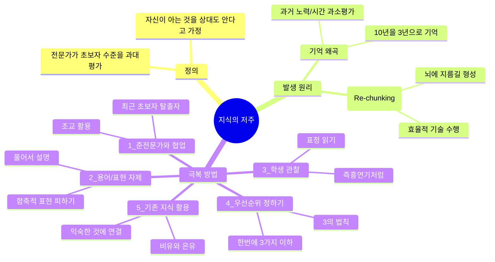
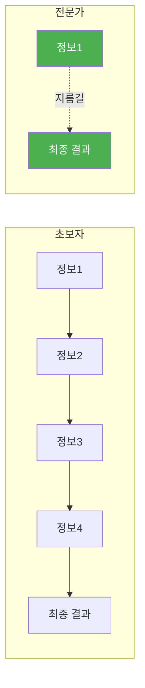
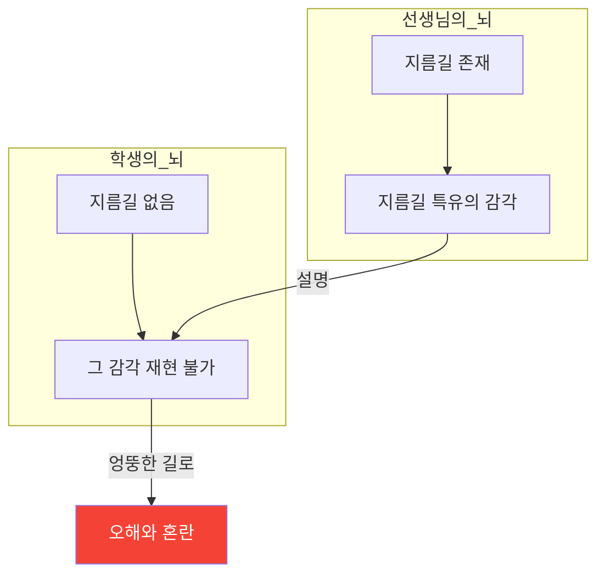
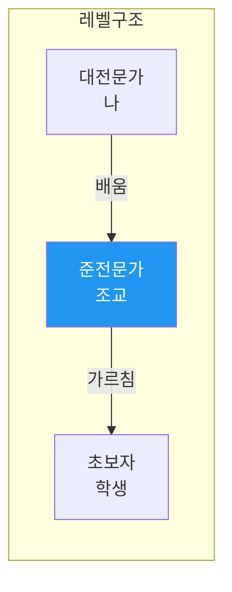
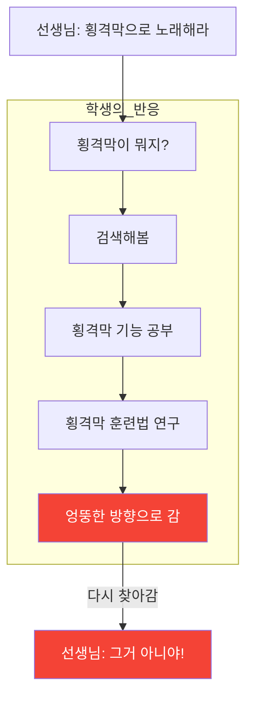
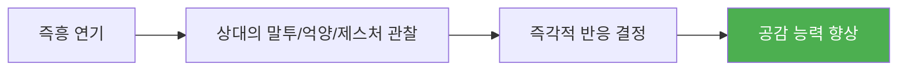
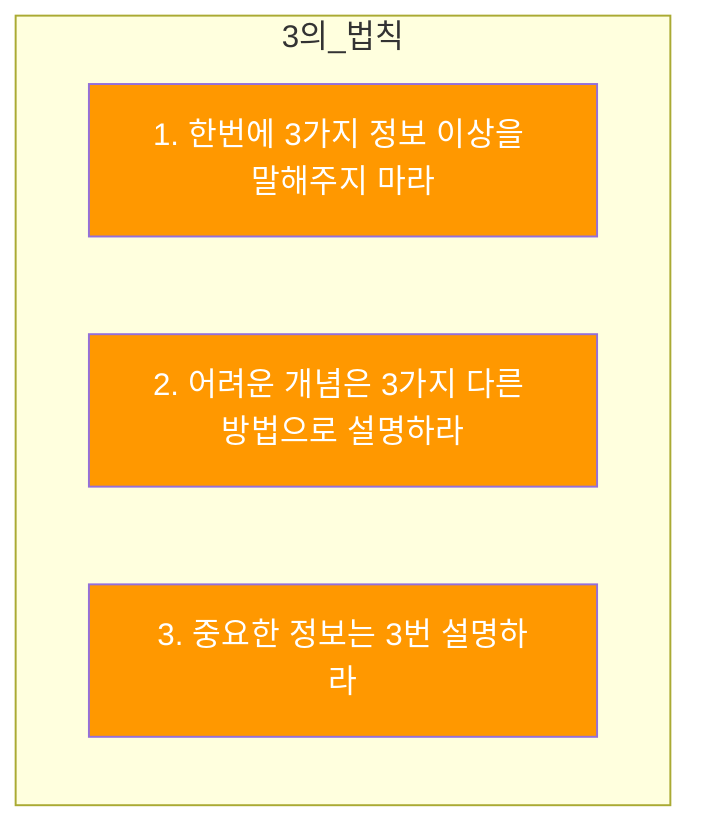
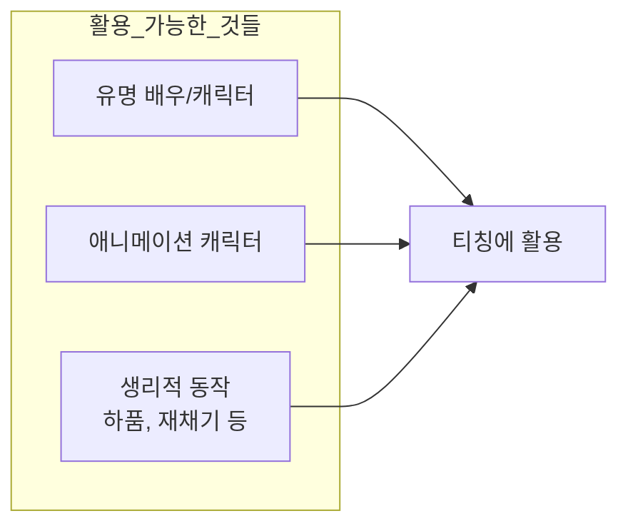
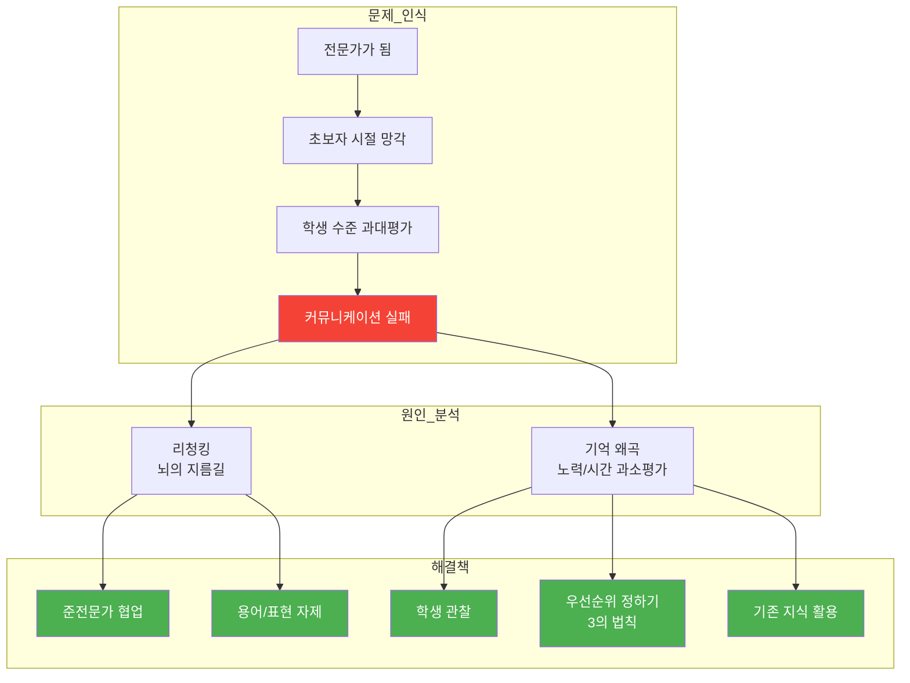

# [운동학습 #8] 실력이 좋아질수록 빠지기 쉬운 함정, 지식의 저주

<iframe width="560" height="315" src="https://www.youtube.com/embed/DwBKqMxsSj4" frameborder="0" allowfullscreen></iframe>

---

## 핵심 요약 (TL;DR)

> **지식의 저주(Curse of Knowledge)** 란 전문가가 되면 초보자의 입장을 잊어버리고, 상대방도 당연히 알 것이라고 과대평가하는 인지적 편향이다. 이 영상에서는 지식의 저주가 왜 발생하는지 그 원리를 설명하고, 이를 극복하기 위한 5가지 실용적인 방법을 제시한다.

---

## 마인드맵

---

## 목차 (챕터별 구간 재생)

| 챕터 | 시간 | 내용 | 난이도 |
|------|------|------|--------|
| [Ch.1 지식의 저주란?](#ch1-지식의-저주란) | [0:00](https://www.youtube.com/watch?v=DwBKqMxsSj4&t=0s) | 지식의 저주 개념 정의 | :green_circle: 기초 |
| [Ch.2 왜 발생하는가?](#ch2-왜-발생하는가-리청킹과-기억-왜곡) | [1:36](https://www.youtube.com/watch?v=DwBKqMxsSj4&t=96s) | 리청킹, 기억 왜곡 | :yellow_circle: 중급 |
| [Ch.3 극복하는 5가지 방법](#ch3-지식의-저주를-극복하는-5가지-방법) | [3:43](https://www.youtube.com/watch?v=DwBKqMxsSj4&t=223s) | 실용적 극복 전략 | :green_circle: 기초 |
| [Ch.4 3의 법칙과 정리](#ch4-3의-법칙과-마무리) | [7:23](https://www.youtube.com/watch?v=DwBKqMxsSj4&t=443s) | 티칭의 3의 법칙 | :green_circle: 기초 |

---

## Ch.1 지식의 저주란?

### 핵심 개념

**지식의 저주(Curse of Knowledge)** 는 전문가가 되면 다른 사람이 **얼마나 모르는지를 과대평가**하는 경향을 말한다. 즉, 자신이 알고 있는 것을 상대방도 당연히 알고 있을 것이라고 무의식적으로 가정하게 되는 인지적 편향이다.

> "대학생 여러분들은 교수님 강의 들으면 이런 생각이 좀 들지 않나요? 왜 교수님들은 이 내용들을 우리가 당연히 알고 있을 거라 생각하고 강의하시는 걸까?"

### 실제 사례: 보컬 코칭

보컬 코치 선생님이 "후두를 좀 낮춰야 한다"라고 말할 때:
- **선생님 관점**: 후두가 뭔지는 당연히 알겠지
- **학생 관점**: 후두가 뭔지 모름 (발성 이론에 관심 없는 사람)

이것이 바로 지식의 저주에 빠진 대표적인 사례다.

### 지식뿐 아니라 기술도 해당

지식의 저주는 단순히 "지식적인 것"에만 해당되지 않는다. **신체적으로 하는 기술들**도 여기에 빠진다.

> "기술 수준이 어느 수준 위로 올라가면, 다른 사람들도 '이 정도는 하겠지'라고 생각하게 됩니다."

그래서 학생이 그 이하 수준인 경우에는 선생님의 설명을 이해하지 못하게 되는 것이다.

---

## Ch.2 왜 발생하는가? (리청킹과 기억 왜곡)

### 원인 1: 리청킹 (Re-chunking)

어떤 연습을 오래 해서 기술이 일정 수준 이상으로 올라간 사람들은 그 기술을 **효율적으로 수행하기 위한 지름길**이 생긴다. 인지심리학에서는 이를 **리청킹(Re-chunking)** 이라고 부른다.

**군대 비유:**
- 일반적 보고: 이등병 -> 중대장 -> 대대장 -> 사단장
- 리청킹 후: 이등병 -> 사단장 (다이렉트 카톡)

이렇게 지름길이 생기는 것은 노래할 때는 굉장한 도움이 된다. **그런데 가르칠 때 문제가 생긴다.**

### 문제: 커뮤니케이션의 부재

선생님은 지름길을 사용할 때 특유의 감각이 생긴다. 그래서 학생에게도 "아, 이 감각이 일어나게 하면 되겠구나"라고 생각하고 그 감각을 설명해준다.

**문제는:** 학생의 뇌에는 아직 지름길이 없다. 지름길이 없으면 그 감각도 만들 수가 없다. 그런데 그 감각을 재현하려고 하면 **엉뚱한 길로 갈 가능성**이 높아진다.

### 원인 2: 기억 왜곡

> "선생님들의 경력이 오래 될수록, 자기가 초보자 시절을 벗어나는 데 기울였던 노력이나 시간을 과소평가하는 경향이 있었다고 합니다."

**예시:**
- 실제: 10년에 걸쳐서 고음을 뚫음
- 기억: "위 2~3년만 하지 않았나?"

이렇게 과소평가한 상태에서 학생을 보면:
- "나도 2~3년 정도면 됐던 것 같은데, 이 학생은 왜 못하지?"
- "이 학생은 재능이 없나?"

### 왜 기억이 왜곡되는가?

우리의 뇌는 **먼 과거의 일을 자세히 기억하지 못하기 때문**이다. 이것은 본질적으로 어쩔 수 없는 인지적 한계다.

---

## Ch.3 지식의 저주를 극복하는 5가지 방법

### 방법 1: 준전문가와의 협업

**핵심 전략:** 내가 아닌 **조교에게 수업을 시키는 것**

**왜 효과적인가?**
- 조교는 나한테 배웠기 때문에 나랑 같은 지식 체계를 갖고 있음
- 하지만 초보자에서 벗어난 지 얼마 안 됨
- 따라서 학생들에게 훨씬 더 **와닿게 설명**할 수 있음

> "만약에 이 학생이 나를 너무 따라오지 못하는 것 같으면, 실력은 나만큼은 아니더라도 나한테 배워서 최근에야 초보자를 벗어난 그런 학생들의 도움을 받아볼 수 있다는 얘기죠."

---

### 방법 2: 자의적 용어/함축적 표현 자제

| 피해야 할 표현 | 왜 문제인가? |
|----------------|--------------|
| 전문 용어 | 선생님 머리에는 이미지가 그려지지만, 학생은 완전 엉뚱하게 이해할 수 있음 |
| 함축적 표현 | 여러 가지 요소가 포함되어 있어 초보자가 길을 잃을 수 있음 |

**대표적 예시: "횡격막으로 노래하라"**

"횡격막으로 노래하라"는 사실 여러 가지 요소가 포함된 함축적인 표현이다. 초보자가 이 말을 들으면 횡격막이 어떤 기능을 하는지 찾아보고, 횡격막을 어떻게 훈련시킬 수 있을까 이쪽으로 빠져나가게 된다.

**해결책:** 학생과 선생님 사이에 용어에 대한 합의가 일어나기 전까지는 **가능하면 풀어서 설명**하라.

---

### 방법 3: 학생을 잘 관찰하라

> "가끔 하다 보면 내가 말하고 싶은 걸 말하는 데 집중을 하다가 학생의 표정을 놓치는 경우가 있습니다."

**관찰해야 할 것들:**
- 내 설명을 정말 이해하고는 있는지?
- 학생이 별로 듣기 싫어하는 설명인데 내가 지금 계속하고 있는 건 아닌지?

**재미있는 연구 결과:**

즉흥 연기를 하는 사람들이 이런 관찰 능력이 뛰어났다고 한다.

왜냐하면 즉흥적으로 연기를 하려면 상대방의 말투나 억양, 제스처를 보면서 내가 어떻게 반응해야 될지를 계속 고민해야 하기 때문이다.

> "레슨도 즉흥 연기를 한다는 생각으로 학생을 집중해서 관찰하라는 거죠."

**좋은 소식:** 이 능력은 **노력으로 극복이 가능**하다!

---

### 방법 4: 우선순위를 정하라 (3의 법칙)

초보자의 소리를 들으면 선생님들은 머리에 **10가지 생각**이 난다. 그런데 그 10가지를 학생한테 다 얘기하면?

> "이것도 문제고 저것도 문제고... 나는 정말 쓰레기구나 이렇게 된단 말이에요."

**실제 사례 (보컬 코칭 참관):**
- 학생: 음정, 박자도 안 맞고, 목도 엄청 쥐어짜고, 총체적 난국
- 선생님: 음정 얘기만 함
- 질문: "왜 목 쥐어짜는 건 언급도 안 하고 훈련하지 않느냐?"
- 대답: "지금 이 학생한테 그것까지 얘기하면 이 사람은 confused 된다. 음정 박자 맞추기도 급급한 사람인데, 정보량이 감당할 수 있는 수준을 넘어간다."

### 3의 법칙 (Rule of Three)

| 법칙 | 설명 |
|------|------|
| **3가지 정보 제한** | 한 번에 너무 많은 정보를 주지 않는다 |
| **3가지 방법** | 학생이 이해 못할 것 같은 어려운 개념은 세 가지 다른 방법으로 설명한다 |
| **3번 반복** | 중요한 정보는 3번 반복해서 설명한다 |

> "이게 굉장히 기억하기도 쉽고 실제 티칭에 활용하기도 좋은 것 같아 가지고 가져와봤습니다."

---

### 방법 5: 학생이 이미 가지고 있는 정보를 활용하라

노래를 처음으로 배우러 온 초보자의 경우에는 **두성, 흉성, 후두** 같은 개념 자체가 생소할 수 있다.

**해결책:** 일반 사람들이 알고 있는 **상식을 활용**해서 이해를 돕는다.

**역사적 예시:**
> "옛날에 자동차가 처음 개발됐을 때, 이것을 설명할 수 있는 방법이 없어서 **'말이 없는 마차'** 라고 설명했다고 합니다."

마차는 사람들이 일반적으로 알고 있는 거였으니까.

### 활용할 수 있는 것들

### 실제 적용 예시

| 추상적 표현 (피하기) | 구체적 표현 (권장) |
|---------------------|-------------------|
| 후두를 내려라 | 뚱이 한번 따라해 봐요 |
| 흉성을 걸어볼까요 | 오리 소리 내보세요 (꽥!) |
| 소리를 띄워라 | 유재석처럼 해봐요 |
| 톤을 낮춰라 | 에단(목소리가 낮은 캐릭터)처럼 해봐요 |

---

## Ch.4 3의 법칙과 마무리

### Feynman Challenge (파인만 챌린지)

영상에서는 **플레임 챌린지(Flame Challenge)** 를 언급한다. 이것은 전 세계 유명한 과학자들이 **11살 학생을 심사위원으로 앉히고**, 그 학생에게 "불이 뭔지"를 이해시키는 것이다. 가장 잘 이해시킨 사람에게 상을 준다.

> "여기서도 뭐 공연이 대체됩니다. 믹스보이스 같은 것 있잖아요."

이것은 결국 **지식의 저주를 극복하는 최종 테스트**와 같다. 복잡한 개념을 11살 아이도 이해할 수 있게 설명할 수 있다면, 진정으로 지식의 저주에서 벗어난 것이다.

---

## 개념 흐름도

---

## 용어 사전

| 용어 | 정의 | 예시/비유 |
|------|------|----------|
| **지식의 저주 (Curse of Knowledge)** | 전문가가 초보자의 입장을 잊고, 상대방도 당연히 알 것이라고 과대평가하는 인지적 편향 | 교수님이 학생들이 당연히 알 것이라 생각하고 강의하는 것 |
| **리청킹 (Re-chunking)** | 숙련자의 뇌에서 복잡한 과정이 하나의 덩어리(chunk)로 재조직화되어 지름길이 생기는 현상 | 이등병이 사단장에게 직접 카톡하는 것처럼 중간 단계 생략 |
| **3의 법칙 (Rule of Three)** | 티칭 시 정보량을 제한하고 반복을 통해 학습 효과를 높이는 원칙 | 한번에 3가지 이하, 3가지 방법으로, 3번 반복 |
| **준전문가** | 전문가와 초보자 사이의 중간 단계에 있는 학습자로, 최근에 초보자 단계를 벗어난 사람 | 대학교 조교 |
| **함축적 표현** | 여러 가지 요소가 압축되어 있어 전문가만 이해할 수 있는 표현 | "횡격막으로 노래해라" |

---

## 셀프 테스트

### Q1. 지식의 저주란 무엇인가?

정답 보기

전문가가 되면 다른 사람이 얼마나 모르는지를 과대평가하는 경향. 즉, 자신이 아는 것을 상대방도 당연히 알고 있을 것이라고 무의식적으로 가정하게 되는 인지적 편향이다.

### Q2. 리청킹(Re-chunking)이란 무엇이며, 왜 티칭에서 문제가 되는가?

정답 보기

**리청킹:** 숙련자의 뇌에서 복잡한 과정이 하나의 덩어리로 재조직화되어 지름길이 생기는 현상.

**문제점:** 선생님은 지름길을 사용할 때의 특유의 감각을 기준으로 설명하지만, 학생의 뇌에는 아직 지름길이 없어서 그 감각을 재현할 수 없다. 이로 인해 학생이 엉뚱한 방향으로 가게 된다.

### Q3. 3의 법칙의 세 가지 원칙을 설명하시오.

정답 보기

1. **한번에 3가지 정보 이상을 말해주지 마라** - 정보 과부하 방지
2. **어려운 개념은 3가지 다른 방법으로 설명하라** - 다양한 접근으로 이해 촉진
3. **중요한 정보는 3번 설명하라** - 반복을 통한 기억 강화

### Q4. 준전문가와 협업하는 것이 왜 효과적인가?

정답 보기

준전문가(조교)는:
- 선생님에게 배웠기 때문에 같은 지식 체계를 가지고 있음
- 하지만 초보자에서 벗어난 지 얼마 안 됐기 때문에 초보자의 어려움을 아직 기억함
- 따라서 학생들에게 훨씬 더 와닿게 설명할 수 있음

### Q5. "횡격막으로 노래해라"가 왜 나쁜 표현인가?

정답 보기

이것은 함축적 표현으로, 여러 가지 요소가 포함되어 있다. 초보자가 이 말을 들으면:
1. 횡격막이 뭔지 검색함
2. 횡격막의 기능을 공부함
3. 횡격막 훈련법을 찾아봄
4. 결국 선생님이 원하는 방향과 다른 방향으로 감

대신 용어에 대한 합의가 일어나기 전까지는 풀어서 설명해야 한다.

### Q6. 왜 선생님들은 자신의 초보자 시절을 정확히 기억하지 못하는가?

정답 보기

우리의 뇌는 먼 과거의 일을 자세히 기억하지 못하기 때문이다. 이로 인해:
- 10년 걸린 것을 2~3년으로 기억
- 자신이 기울인 노력과 시간을 과소평가
- 결과적으로 학생의 진도가 느리면 "재능이 없나?"라고 오해하게 됨

---

## 나의 생각 / 적용

### 핵심 인사이트

1. **전문성의 역설**: 실력이 좋아질수록 오히려 가르치기 어려워질 수 있다. 이것은 전문가의 "저주"라고 할 만하다.

2. **의식적 노력의 필요성**: 지식의 저주에서 벗어나기 위해서는 전문가가 될 때만큼이나 의식적인 노력이 필요하다.

3. **즉흥 연기의 교훈**: 좋은 티칭은 즉흥 연기와 같다. 상대방의 반응을 계속 관찰하고, 그에 맞춰 내 행동을 조절해야 한다.

### 적용 가능한 영역

- **교육/강의**: 학생들에게 설명할 때 항상 "이 사람이 정말 이해하고 있는가?"를 체크
- **글쓰기**: 독자가 알 것이라고 가정하지 말고, 용어를 풀어서 설명
- **프레젠테이션**: 청중의 지식 수준을 과대평가하지 말 것
- **팀 커뮤니케이션**: 다른 부서나 신입 직원에게 설명할 때 전문 용어 자제

---

## 연결 노트

- [[운동학습 시리즈]]
- [[인지심리학 개념]]
- [[효과적인 교수법]]
- [[커뮤니케이션 스킬]]
- [[리청킹과 자동화]]

---

## 출처

- 영상: [의학발성 메디칼보이스 - 운동학습 #8](https://www.youtube.com/watch?v=DwBKqMxsSj4)
- 시청일: 2026-04-16
- 논문/저자: 2019년 1월 관련 연구 (영상 내 언급)
