# 침묵이 학습을 만든다: 성악 교육에서의 운동 학습 원리

## 📌 핵심 한 줄

과도한 교사의 피드백이 성악 레슨에서 학생의 장기 학습을 방해한다는 운동 학습 원리를 실제 사례와 연구로 설명

## 🎯 목차

1. [[#운동 학습 원리의 현실|운동 학습 원리의 현실: 15년간의 노력에도 여전히 부족한 적용]] 🟡
2. [[#개인 경험|개인 경험: '교사의 뇌'에 의존한 레슨의 실패와 침묵하는 교사의 성공]] 🟢
3. [[#과학적 근거|과학적 근거: 피드백 타이밍과 청각 기억의 메커니즘]] 🔴
4. [[#불편함의 구조|교사와 학생 모두의 불편함: 가치 증명과 학습의 본질적 불편함]] 🟡

---

## 📖 개요

성악 교육에서 운동 학습(motor learning) 원리가 15년 이상 알려졌지만 실제 적용은 여전히 부족하다. 한 논문 연구는 교사들이 레슨 중 너무 많이 말하고, 학생에게 스스로 배울 공간을 주지 않는다는 '충격적인 데이터'를 제시했다.

즉각적인 피드백(0ms)보다 **3-4초 지연된 피드백**이 장기 학습에 더 효과적이라는 연구 결과가 있다. 화자의 개인 경험에서, 끊임없이 교정하는 유명 교사들과의 레슨에서는 좋은 성과를 냈지만 혼자서는 재현할 수 없었고 목 문제가 생겼다. 반면 거의 말하지 않는 Mark Madsen 교사와의 레슨은 처음엔 불편했지만 결국 독립적인 학습 능력을 키워주었다.

레슨 중 즉각 성과를 내는 방법이 오히려 장기 학습을 해친다는 **역설적 원리**와, 교사의 말이 학생의 청각 피드백(2-4초 지속되는 echoic storage)을 가린다는 신경과학적 근거가 제시된다.

---

## 🎬 영상 정보

<iframe width="560" height="315" src="https://www.youtube.com/embed/MjdHJPhjhDw" frameborder="0" allow="accelerometer; autoplay; clipboard-write; encrypted-media; gyroscope; picture-in-picture" allowfullscreen></iframe>

**채널**: 의학발성 메디칼보이스 (Medicalvoice)
**제목**: 간단하지만 매우 지키기 어려운 레슨 원칙 (메보도 못함)
**시청일**: 2026-04-20

---

## 📚 본문

### 운동 학습 원리의 현실: 15년간의 노력에도 여전히 부족한 적용

**🟡 중급 | 00:00:29 - 00:04:17**

<iframe src="https://www.youtube.com/embed/MjdHJPhjhDw?start=29&end=257" width="560" height="315" frameborder="0" allowfullscreen></iframe>

#### 이론과 현실의 간극

15년 전부터 운동 학습 원리가 성악 교육계에 전파되어 많은 교사들의 접근법을 변화시켰다. Paul Keysight, Lynn Helding, Lynn Maxfield 등의 연구자들이 이 개념을 확산시켰고, 화자는 Indiana University에서의 일주일 워크샵에서 처음 이를 접했다. 이러한 개념들은 실제로 많은 성악 교사들의 교육 방식을 "변화시켰다(transformed things)"고 평가된다.

그러나 **한 박사 논문 연구**는 충격적인 결과를 제시했다. 성악 스튜디오에서 **"매우 기초적인(very very basic) 운동 학습 원리조차 제대로 적용되지 않는다"**는 데이터가 나온 것이다. 연구는 "충격적인 데이터(disturbing data)"라고 표현될 정도로 이론과 실천의 간극이 컸다.

#### 말이 너무 많은 교사들

연구가 밝혀낸 가장 큰 문제는 **교사들이 너무 많이 말한다**는 것이었다. 화자는 자조적으로 "우리 성악 교사들은 모두 수다스럽다(we voice people we're all pretty talkative)"고 인정한다. 레슨 시간 내내 말을 하느라 학생에게 **'배울 공간(space to learn)'**을 주지 않는다는 것이다.

여기서 중요한 개념 전환이 제시된다:

> "우리의 역할은 가르치는 것이 아니라 학생이 배울 수 있는 환경을 만드는 것이다. 왜냐하면 학생이 진짜 학습자이기 때문이다."
> — Lynn 인용

이는 교사 중심 교육에서 학생 중심 학습 환경 설계로의 패러다임 전환을 요구한다. 교사의 "가르침"이 많을수록 좋은 것이 아니라, 학생의 "배움"이 일어날 수 있는 조건을 만드는 것이 핵심이다.

#### 복잡성의 함정

지난 20년간 운동 학습 이론에 많은 "미묘함(subtlety)"이 추가되었다. 단순했던 원리들이 점점 정교해지고 복잡해졌다. 그러나 화자는 중요한 경고를 한다:

> "만약 우리가 여전히 단순한 것들의 적용에 있어 어둠 속에 있다면, 아마도 우리는 복잡하게 만들어서는 안 될 것이다."

기본 원리조차 제대로 적용하지 못하는데 더 복잡한 이론을 추가하는 것은 문제 해결이 아니라 혼란만 가중시킬 수 있다는 통찰이다. 이는 교육 현장에서 흔히 발생하는 함정 — 더 많은 지식이 더 나은 교육을 만든다는 착각 — 을 지적한다.

---

### 개인 경험: '교사의 뇌'에 의존한 레슨의 실패와 침묵하는 교사의 성공

**🟢 기초 | 00:01:26 - 00:03:37**

<iframe src="https://www.youtube.com/embed/MjdHJPhjhDw?start=86&end=217" width="560" height="315" frameborder="0" allowfullscreen></iframe>

#### 유명 교사들과의 실패 패턴

화자는 여러 명의 "매우 유명한(very very famous)" 교사들과 공부했다. 놀랍게도, 모든 경험이 동일한 패턴을 보였다:

- **레슨 중**: "정말 정말 잘했다(always do really really well in my lessons)"
- **레슨 후**: "재현할 수 없었고, 재현하려다 목을 다쳤다(couldn't replicate and hurt myself attempting to replicate)"

왜 이런 일이 벌어졌을까? 화자는 핵심을 찌르는 진단을 내린다:

> "레슨 중 내 목소리가 **그들의 뇌에 의해 구동되고 있었다**(my voice was being driven by their brain)"

교사들은 끊임없는 피드백과 "교정, 교정(constant correction and no not that)"을 제공했다. 심지어 스케일 연습 중에도 "거의 지휘하듯이(almost conducting)" 계속 지시했다. 이는 학생이 **교사의 실시간 처리 능력에 의존**하는 상태를 만든다.

문제는 레슨이 끝난 후였다. "그들의 뇌 없이는(without their brain)" 혼자 있게 되면, 학생 자신의 내부 제어 시스템이 발달하지 않았기 때문에 재현이 불가능했다. 오히려 잘못된 시도로 "온갖 종류의 목 문제(a whole bunch of different kinds of voice problems)"를 겪게 되었다.

#### Mark Madsen: 침묵의 힘

이 실패의 연속 속에서 화자는 Mark Madsen이라는 교사를 만난다. 그는 지금은 고인이 된(deceased) 인물이지만, 완전히 다른 접근법을 보여주었다.

**Mark의 교육 방식**:
- **"거의 말하지 않았다(hardly said a word)"**
- 약 **10분마다 한 번** 정도만 무언가를 말했다
- 학생이 "배를 때리듯 실패하고(belly flop), 땀 흘리고, 일하게(sweat, work)" 내버려 두었다
- 단, **"절벽에서 떨어지는 것은 막아주었다(keep me from going off the cliff)"**

화자의 첫인상은 부정적이었다. "나는 화가 났다(I was miffed)" — 유명한 교사인데 아무것도 안 하니까. 그러나 계속 다닌 이유가 있었다. Mark의 다른 학생들을 입학 시점과 몇 년 후에 관찰했는데, **"훨씬 훨씬 더 좋아져 있었고(much much better)"**, 무엇보다 중요한 것은:

> "그들의 목소리는 모두 **매우 달랐다**(all sounded very different)"

Mark는 학생들을 "자신이 미학적으로 선호한다고 생각하는 특정 틀에 밀어 넣으려 하지 않았다(wasn't trying to stuff them into a certain box)". 대신 "그들 자신의 목소리를 탐색하고 확장하게(explore and expand their own voices)" 했다.

**공통점은 무엇이었을까?**

> "자유, 파워, 섬세함(freedom, power, and subtlety)"

그리고 Mark는 **"입을 다물었다(kept his mouth shut)"**.

#### 학습의 불편함

처음 Mark와의 레슨은 끔찍했다. "정말 끔찍한 레슨들(really awful lessons)"이었다고 솔직히 고백한다. 그러나 화자는 이미 성악 교사로 일하고 있었고, Mark 학과의 좋은 결과들을 직접 목격했기 때문에 참고 계속했다. "뭔가 있다(there's something here)"는 직관이 있었기 때문이다.

왜 끔찍했을까? Mark의 **피드백이 매우 적었기(feedback was very sparse)** 때문이다. 끊임없는 교정에 익숙했던 화자에게 침묵은 불편하고 혼란스러웠다. 그러나 바로 이 불편함이 **독립적 학습 능력을 발달시키는 과정**이었다.

---

### 과학적 근거: 피드백 타이밍과 청각 기억의 메커니즘

**🔴 심화 | 00:03:37 - 00:08:06**

<iframe src="https://www.youtube.com/embed/MjdHJPhjhDw?start=217&end=486" width="560" height="315" frameborder="0" allowfullscreen></iframe>

#### 핵심 역설: 즉각 성과 vs 장기 학습

운동 학습 연구의 가장 반직관적인 발견:

> "일반적으로, 스튜디오나 훈련 세션 중 **즉각적인 성과를 높이는 것들이 실제로는 장기 학습을 해친다**(things that boost immediate performance actually harm long-term learning)"

이는 교육의 근본적 딜레마를 제시한다. 교사와 학생 모두 레슨 중 즉각적인 개선을 보고 싶어 한다. 학생은 돈을 내고 있고, 교사는 자신의 가치를 증명해야 한다. 그러나 바로 이 즉각적 개선이 진짜 학습을 방해한다는 것이다.

따라서 교사와 학생은 **"그리 좋지 않은 레슨들을 견딜 수 있어야 한다(to be able to tolerate not so good lessons)"**. 이는 단순히 참는 것이 아니라, 장기적 발전(progress well)을 위해 필수적인 과정이다.

#### 피드백 타이밍의 과학

한 연구는 피드백 타이밍이 학습에 미치는 영향을 측정했다:

**실험 설계**:
- 조건 1: 발화 완료 직후 **0밀리초(zero milliseconds)** 피드백
- 조건 2: **3-4초** 지연 피드백

**결과**:
- **나중의 retention test(보유 테스트)**에서 3-4초 지연 그룹이 더 나은 학습을 보였다

Retention test는 즉각적 수행력이 아닌 **진짜 학습**을 측정하는 지표다. 시간이 지난 후에도 기억하고 수행할 수 있는가? 이것이 교육의 진짜 목표다.

화자는 강조한다: **"3-4초는 긴 시간이다(that's a long time)"**. 레슨 중 학생이 뭔가를 하고 나서 3-4초를 침묵으로 기다리는 것은 교사에게도 학생에게도 어색하고 불편하다. 그러나 바로 이 시간이 학습의 열쇠다.

#### Echoic Storage: 청각 기억의 생물학

왜 3-4초가 중요한가? 신경과학이 답을 제공한다.

**Iconic Storage (시각)**:
- 시각 정보는 **iconic storage**라는 초기 저장소에 보관된다
- 지속 시간: **최대 250밀리초**
- 경험 방법: 손을 빠르게 흔들면 보이는 **잔상(trail)**

**Echoic Storage (청각)**:
- 청각 정보는 **echoic storage**에 보관된다
- 지속 시간: **2-4초**
- 이것은 "기억 저장소도 아니다(not even a memory store)" — 더 초기 단계의 일시적 흔적이다

화자가 강조하는 메커니즘:

> "청각 양식에서, 잔상은 실제로 **2-4초**이다. 그래서 우리가 끼어들면, 우리는 가리고 있는 것이다(we are masking)"

**Masking의 의미**:

교사가 즉시 피드백을 주면, 학생의 echoic storage에 남아있는 **"원자재(raw material)"**를 완전히 가려버린다(totally masking it). 이 원자재는 학생이 **단기 기억(short-term memory)**으로, 궁극적으로는 **장기 기억**으로 전환해야 할 정보다.

2-4초의 echoic storage 기간 동안, 학생의 뇌는:
1. 방금 낸 소리를 "재생(replay)"하며
2. 그것을 처리하고
3. 단기 기억으로 전환 준비를 한다

교사가 이 과정을 방해하면, 학습의 생물학적 기반 자체가 작동하지 못한다.

#### Efferent Copy: 내부 예측 시스템

또 다른 중요한 신경과학적 개념이 소개된다:

**Efferent Copy (원심성 사본)**:
- 정의: **"원하는 지각 결과의 복사본(a copy of the perceptual outcome that you want)"**
- 기능: 운동 명령이 실행되기 전/중에 예상되는 감각을 미리 생성 (feedforward)
- 경험: "다음 프레이즈를 듣는다(I hear that next phrase)" — 아직 연주/노래하지 않았는데 이미 들린다

화자는 이것이 실제로 경험 가능한 현상임을 강조한다. 음악가라면 누구나 "이 프레이즈는 끝났는데(this phrase is gone)" 다음 프레이즈가 이미 "들리는(hear)" 경험을 안다.

**교사 개입의 문제**:

> "고음을 향해 가거나 고음 중에, 우리가 온갖 지시를 주면, 우리는 efferent copy를 가리고 있는 것이다"

학생이 고음을 시도할 때:
1. 뇌는 그 소리가 어떻게 들릴지 efferent copy 생성
2. 실제 소리와 비교하며 운동 조정
3. 다음 시도를 위한 학습 발생

교사가 이 순간에 "더 높이", "목 풀어", "호흡 지지" 등을 말하면, 학생의 청각 채널이 점유되어 자신의 efferent copy를 "들을" 수 없게 된다. 이는 학생의 **내부 피드백/피드포워드(feedback/feedforward) 시스템**의 발달을 막는다.

---

### 교사와 학생 모두의 불편함: 가치 증명과 학습의 본질적 불편함

**🟡 중급 | 00:05:16 - 00:09:25**

<iframe src="https://www.youtube.com/embed/MjdHJPhjhDw?start=316&end=565" width="560" height="315" frameborder="0" allowfullscreen></iframe>

#### 구조적 압박: 돈값 증명하기

이론은 명확하다. 과학적 근거도 있다. 그런데 왜 교사들은 여전히 너무 많이 말할까?

화자와 대화 상대는 **"까다로운(tricky)"** 현실을 지적한다:

> "독립 성악 교사로서, 학생들이 우리에게 많은 돈을 내기 때문에, 우리는 매주 그것을 계속 벌어야 한다(we have to keep earning that week after week)"

**심리적 압박**:
- 끊임없이 **"가치 있다고 느낄 필요가 있다(needing to feel valuable)"**
- 10분 동안 조용히 있으면서 학생이 알아내게 하는 것은 **"도전적이다(challenging)"**
- 학생이 "돈값을 하고 있다고 느끼도록(feel like they're getting value for money)" 해야 한다

이는 단순히 개인 교사의 불안이 아니다. **사회적으로 공유되는 믿음 체계 — "내러티브(narrative)"** — 의 문제다.

> "내러티브를 바꿔야 한다(narrative that needs to be altered)"

무엇을 바꿔야 하나? **"좋은 레슨 = 교사가 많이 가르치는 것"**이라는 통념. 그리고 **"침묵 = 아무것도 안 하는 것 = 돈값을 못함"**이라는 오해.

#### 1980년, 40달러의 침묵

화자는 자신의 첫 Mark 레슨 경험을 생생하게 회상한다:

**1980년, 40달러** (당시로서는 상당한 금액)를 내고 레슨실에 들어갔다. Mark는... 아무 말도 안 했다. 화자의 생각:

> "나는 여기 40달러를 내고 있는데... 누군가는 뭔가를 해야 하니까 그가 하지 않을 거면 내가 하는 게 낫겠다(I'm paying 40 bucks here... somebody's got to do something here better be me if he's not going to)"

5분 후에야 화자는 스스로 뭔가를 하기 시작했다. 침묵의 불편함이 학생을 능동적 학습자로 만든 순간이었다.

이 일화는 교육의 아이러니를 보여준다. 돈을 내는 소비자는 즉각적 서비스를 기대한다. 그러나 진짜 학습은 **"서비스를 받지 않는"** 시간에 일어난다.

#### 학습은 본질적으로 Messy하다

대화 상대가 중요한 통찰을 제시한다:

> "운동 학습에서 우리가 배운 것 중 하나는 학습은 **엉망이어야 한다(has to be messy)**는 것이다. 불편할 수밖에 없다 — 신체적이 아니라 **심리적으로**"

"Messy"는 깔끔하지 않고, 예측 불가능하고, 실패가 포함되어 있다는 의미다. 이것이 학습의 **본질**이다. 문제는:

> "우리는 또 다른 층위를 거쳐야 할지도 모른다 — 교사로서 우리에게 불편한 것을"

학생에게 불편함을 요구하듯이, **교사 자신도 불편함을 견뎌야 한다**는 것이다:
- 침묵의 불편함
- 자신의 가치를 증명하지 못하는 것 같은 불안
- 즉각적 결과를 만들지 못하는 조바심
- "나쁜 레슨"을 지켜보는 인내

화자의 메타-인지적 결론:

> "우리 모두가 필요하고, 나 자신도 계속 노력하는 것은, **매우 무거운 침묵의 리듬에 들어가는 것**(get into that groove of a very heavy silence)"

"Heavy silence" — 무거운 침묵. 이는 단순한 말하지 않음이 아니다. 의도적이고, 의미 있고, 학습을 위한 **적극적 선택**으로서의 침묵이다.

---

## 🗺️ 개념 지도

```mermaid
graph TB
    A[침묵이 학습을 만든다] --> B[문제 현황]
    A --> C[개인 경험적 증거]
    A --> D[신경과학적 메커니즘]
    A --> E[핵심 역설]
    A --> F[구조적 장벽]

    B --> B1[15년간 전파되었지만 적용 부족]
    B --> B2[박사논문: 충격적인 비적용 데이터]
    B --> B3[교사들이 너무 많이 말함]
    B --> B4[학생에게 배울 공간을 안 줌]

    C --> C1[유명 교사들: 끊임없는 피드백<br/>→ 레슨 성공, 혼자 실패 + 부상]
    C --> C2[Mark Madsen: 거의 침묵<br/>→ 처음 끔찍, 장기적 자유와 독립성]
    C --> C3[학생들 모두 다른 소리<br/>공통점: freedom/power/subtlety]
    C --> C4[belly flop 허용, 절벽만 방지]

    D --> D1[피드백 타이밍:<br/>0ms < 3-4초 지연 retention test]
    D --> D2[Iconic storage: 시각 250ms]
    D --> D3[Echoic storage: 청각 2-4초]
    D --> D4[교사 개입<br/>→ 학생의 raw material 가림]
    D --> D5[Efferent copy:<br/>다음 프레이즈를 듣는 현상]

    E --> E1[즉각 성과 향상 ≠ 장기 학습]
    E --> E2[좋은 레슨immediate<br/>vs 나쁜 레슨long-term progress]
    E --> E3[교사의 뇌 vs 학생의 뇌]
    E --> E4[가르치기 vs 환경 만들기]

    F --> F1[돈값 증명 압박<br/>value for money]
    F --> F2[침묵 = 가치 없음<br/>이라는 내러티브]
    F --> F3[교사도 불편함 견뎌야 함]
    F --> F4[학습은 본질적으로<br/>messy하고 불편함]

    style A fill:#ff6b6b
    style E fill:#4ecdc4
    style D fill:#ffe66d
    style F fill:#a8e6cf
```

---

## ⭐ 핵심 암기 포인트

### ★★★ 필수 암기 (핵심 원리)

1. **즉각적 성과 vs 장기 학습의 역설**
   - 즉각적인 성과를 높이는 것이 장기 학습을 해친다
   - 암기법: "'레슨 대박' ≠ '진짜 배움'"
   - 이유: 학생이 교사의 뇌에 의존하게 만들어 독립적 학습 능력 발달 방해

2. **3-4초 피드백 지연 원칙**
   - 발화 후 3-4초 기다려야 효과적 (0ms 즉각 피드백보다 retention test 결과 우수)
   - 암기법: "Echoic storage 2-4초 = 학생이 자기 소리 처리하는 시간"
   - 과학적 근거: 청각 정보가 echoic storage에 2-4초 지속

3. **Echoic Storage의 중요성**
   - 청각 정보는 2-4초, 시각은 0.25초 (청각이 시각보다 8-16배 길다)
   - 암기법: "귀는 2-4초, 눈은 0.25초 — 노래는 귀로 배운다"
   - 교사가 즉시 말하면 이 원자재(raw material)를 masking

4. **교사의 역할 재정의**
   - "가르치기"가 아닌 "학생이 배울 환경 만들기"
   - 암기법: Lynn 인용 — "not to teach but to create environment"
   - 학생이 진짜 학습자(actual learner)

5. **'교사의 뇌' 의존 문제**
   - 과도한 피드백 → 학생이 교사 뇌로 구동 → 혼자서 재현 불가
   - 암기법: "레슨 = 교사 뇌 빌림, 혼자 = 뇌 반납 → 실패"
   - Mark Madsen의 침묵이 학생의 독립적 뇌 발달

### ★★ 중요 암기 (핵심 디테일)

6. **Efferent Copy 메커니즘**
   - 다음 소리를 미리 '듣는' 내부 복사본 (feedforward)
   - 암기법: "'이 프레이즈 끝났는데 다음 프레이즈 들림' = efferent copy 작동 중"
   - 교사가 계속 지시하면 학생의 efferent copy를 masking

7. **학습의 Messy 본질**
   - 학습은 본질적으로 엉망이고 불편해야 함 (신체적 아닌 심리적 불편함)
   - 암기법: "Belly flop 허용, 절벽만 방지 — Mark Madsen 원칙"
   - "나쁜 레슨"을 견디는 것이 장기 발전에 필수

8. **박사논문의 충격적 데이터**
   - 15년간 알려졌지만 기초 운동학습 원리조차 스튜디오에서 비적용
   - 암기법: "15년 알려졌지만 여전히 안 함 = 아는 것 ≠ 하는 것"
   - 이론과 실천의 간극

### ★ 보조 암기 (맥락 이해)

9. **내러티브 변화의 필요성**
   - "침묵 = 돈값 못함"이라는 통념을 바꿔야 함
   - 암기법: "10분 침묵이 어려운 이유 = 구조적 압박, 개인 문제 아님"
   - 1980년 40달러 레슨에서도 불편했던 경험

---

## 📖 용어 사전

### Motor Learning (운동 학습)
**정의**: 운동 기술의 습득과 개선 과정을 연구하는 학문 분야

**영상 맥락**: 15년 전부터 성악 교육계에 전파되었지만 실제 스튜디오 적용은 여전히 부족. 기초 원리는 단순하지만 최근 20년간 많은 미묘함(subtlety)이 추가됨. 그러나 기본도 못 지키면서 복잡성을 추가하는 것은 문제.

### Retention Test (보유 테스트)
**정의**: 학습 후 시간이 지난 뒤 얼마나 기억하고 수행할 수 있는지 측정하는 테스트

**영상 맥락**: 0ms 즉각 피드백보다 3-4초 지연 피드백이 retention test에서 더 나은 결과를 보임. 즉각적 성과가 아닌 진짜 학습의 지표. 이것이 교육의 진짜 목표.

### Iconic Storage (시각 저장소)
**정의**: 시각 정보의 초기 감각 저장소로, 기억 저장소도 아닌 일시적 흔적

**영상 맥락**: 손을 빠르게 흔들 때 보이는 시각적 잔상(trail)으로 체험 가능. 최대 250밀리초만 지속되어 청각(2-4초)보다 훨씬 짧음. 노래는 청각 기반이므로 echoic storage가 더 중요.

### Echoic Storage (청각 저장소)
**정의**: 청각 정보의 초기 감각 저장소로, 'not even a memory store'라고 표현될 정도로 초기 단계

**영상 맥락**: **2-4초** 동안 지속되며, 이것이 피드백을 3-4초 지연해야 하는 신경과학적 근거. 교사가 즉시 말하면 이 원자재(raw material)를 완전히 가림(totally masking). 학생이 자신의 소리를 단기/장기 기억으로 전환할 수 없게 됨.

[관련 연구](https://www.simplypsychology.org/echoic-memory.html): Ulric Neisser가 1967년 이 용어를 도입. Darwin, Turvey & Crowder (1972) 연구에서 최대 4초 지속 확인.

### Efferent Copy (원심성 사본)
**정의**: 원하는 지각 결과의 내부 복사본으로, 운동 명령 실행 전에 생성되는 예상 감각 (feedforward 메커니즘)

**영상 맥락**: 음악 연주 중 '이 프레이즈는 끝났는데 다음 프레이즈를 듣는' 현상으로 실제 경험 가능. 고음 시도 중 교사가 지시하면 이를 가려버림. 학생의 독립적 feedforward 시스템 발달에 필수.

### Masking (가리기)
**정의**: 한 감각 정보가 다른 정보의 인지를 방해하는 현상

**영상 맥락**: 교사가 즉시 피드백을 주면 학생 자신의 청각 피드백(echoic storage)과 efferent copy를 masking하여 단기/장기 기억으로의 전환을 차단. 이것이 '교사의 뇌에 의해 구동됨' 현상의 신경과학적 설명.

### Feedforward (피드포워드)
**정의**: 행동 전에 예상되는 감각 결과를 미리 생성하는 메커니즘 (feedback과 반대 방향)

**영상 맥락**: 학생 자신의 feedforward 시스템이 있는데, 교사가 너무 많이 말하면 이를 가린다. Efferent copy가 feedforward의 핵심 구성 요소.

### Space to Learn (배울 공간)
**정의**: 학생이 스스로 시도하고, 실수하고, 발견할 수 있는 시간적·심리적 여유

**영상 맥락**: 교사들이 너무 많이 말해서 'don't leave the learner the space to learn'라고 비판됨. 침묵과 기다림(3-4초 지연)이 이 공간을 만듦. Mark Madsen의 10분 침묵이 대표 사례.

### Driven by Their Brain (교사의 뇌에 의해 구동됨)
**정의**: 학생의 독립적 사고가 아닌 교사의 실시간 지시와 피드백에 의존하여 행동하는 상태

**영상 맥락**: 화자가 유명 교사들과의 레슨에서 경험. 레슨 중에는 '교사의 뇌'로 잘했지만 'without their brain' 혼자서는 재현 불가능하고 부상. 이것이 끊임없는 피드백과 교정의 근본 문제.

### Belly Flop (배를 때리듯 실패)
**정의**: 수영장 다이빙 시 배를 때리듯 실패하는 것의 비유 — 시도하다 실패하는 학습 과정

**영상 맥락**: Mark Madsen의 교육 철학 — 'let me belly flop, let me sweat, let me work'. 실패를 허용하되 'going off the cliff'는 방지. 학습의 messy한 본질을 인정하는 태도.

### Going off the Cliff (절벽에서 떨어지다)
**정의**: 위험한 수준으로 잘못된 방향으로 가는 것, 회복 불가능한 실수

**영상 맥락**: 교사의 역할은 학생이 belly flop하게 내버려 두되 'keep from going off the cliff' — 최소한의 안전장치만 제공. 과잉 보호와 방임의 균형.

### Narrative (내러티브)
**정의**: 사회적으로 공유되는 이야기나 믿음 체계

**영상 맥락**: '좋은 레슨 = 교사가 많이 가르치는 것, 침묵 = 돈값 못함'이라는 narrative를 바꿔야 한다(needs to be altered). 구조적 문제이지 개인 교사의 문제가 아님.

### Value for Money (돈값)
**정의**: 지불한 금액에 상응하는 가치를 받는다는 느낌

**영상 맥락**: 독립 교사들이 10분 침묵하기 어려운 이유 — 학생이 'feel like they're getting value for money'해야 한다는 압박. 1980년 40달러 레슨에서의 불편함이 이를 잘 보여줌.

---

## 🔗 종합 정리

이 대화는 단일한 논증 구조를 가진다: **교사의 침묵이 학습에 필수적이지만 구조적·심리적 장벽 때문에 실천이 어렵다**.

### 논증의 흐름

**1장 (문제 제기)**: 운동 학습 원리가 15년간 알려졌지만 박사논문 연구는 "충격적인 비적용 데이터"를 보여준다. 교사들이 너무 많이 말하고, 학생에게 배울 공간을 주지 않는다는 것이다.

**2장 (경험적 구체화)**: 화자의 개인 경험이 이를 생생하게 증명한다. 끊임없이 피드백하는 유명 교사들과는 레슨에서는 잘했지만 혼자서는 실패하고 부상을 입었다 — "교사의 뇌에 의해 구동"되었기 때문이다. 반면 거의 말하지 않는 Mark Madsen과는 처음엔 끔찍했지만 장기적으로 독립적 능력이 발달했다.

**3장 (과학적 설명)**: 왜 그런가? 신경과학이 답을 제공한다. Echoic storage는 2-4초 지속되므로, 교사가 즉시 개입하면 학생의 청각 피드백 처리를 가린다(masking). 연구는 3-4초 지연 피드백이 0ms 즉각 피드백보다 retention test에서 우수함을 보였다. Efferent copy(다음 소리 예측) 메커니즘도 교사의 말로 방해받는다.

**4장 (구조적 맥락)**: 그런데 왜 교사들은 여전히 말이 많을까? 돈값 증명 압박 때문이다. "침묵 = 가치 없음"이라는 내러티브를 바꿔야 한다. 학습은 본질적으로 messy하고 불편하며, 학생뿐 아니라 교사도 이 불편함을 견뎌야 한다.

### 핵심 역설

**"즉각 성과 ≠ 장기 학습"**이 모든 챕터를 관통한다:

- **2장**: 유명 교사와의 '좋은 레슨'이 실제로는 해로웠다
- **3장**: 연구에서도 immediate performance boost가 long-term learning을 해친다고 밝혔다
- **4장**: 교사들이 즉각적 가치 증명에 집착하는 것이 문제의 근본 원인이다

### 메커니즘의 연결

**생물학 → 원리 → 현상**의 인과 사슬:

1. **Echoic storage 2-4초** (생물학적 사실)
   ↓
2. **3-4초 피드백 지연** (교육 원칙)
   ↓
3. **침묵이 학습을 만든다** (실천 지침)

그리고:

1. **Efferent copy masking** (신경 메커니즘)
   ↓
2. **학생의 피드백/feedforward 시스템 방해** (인지 과정)
   ↓
3. **"교사의 뇌에 의해 구동됨"** (현상학적 경험)

### 메타-인지적 교훈

마지막으로, **"학습은 messy하고 불편하다"**는 원리가 **학생뿐 아니라 교사에게도 적용**되어야 한다는 메타-인지적 결론으로 마무리된다.

교사는 학생에게 불편함을 요구한다. 그렇다면 교사 자신도 "또 다른 층위의 불편함(another layer of being uncomfortable)"을 겪어야 한다:
- 침묵의 불편함
- 가치를 증명하지 못하는 것 같은 불안
- "나쁜 레슨"을 지켜보는 인내

이것이 **"매우 무거운 침묵의 리듬에 들어가는 것(get into that groove of a very heavy silence)"**의 의미다.

---

## 🧪 셀프 테스트

### 🟢 기초 (개념 이해)

**Q1**: Mark Madsen의 교육 방식이 효과적이었던 이유를 3가지 이상 설명하라.

모범 답안 보기

1. **침묵과 피드백 지연**: 10분마다 한 번씩만 말하여 학생의 echoic storage(2-4초)가 자연스럽게 작동하고 자신의 소리를 처리할 시간을 줌.

2. **Space to learn 제공**: 'belly flop, sweat, work'하게 내버려 두어 학생이 스스로 시도하고 실수하며 배울 공간을 만듦.

3. **학생 뇌의 독립성 발달**: 교사의 뇌에 의존하지 않고 학생 자신의 피드백/feedforward 시스템이 발달하여 혼자서도 재현 가능.

4. **최소 개입 원칙**: 'going off the cliff'만 방지하여 안전은 확보하되 과잉 보호 안 함.

5. **개별성 존중**: 특정 미적 틀에 끼워넣지 않아 모든 학생이 다른 소리를 가졌지만 공통적으로 freedom/power/subtlety 달성.

**Q2**: Echoic storage와 iconic storage의 차이를 설명하고, 왜 성악 교육에서 echoic storage가 더 중요한지 논하라.

모범 답안 보기

**차이**:
- Iconic storage는 시각 정보의 초기 흔적으로 최대 250ms만 지속 (손 흔들 때 잔상)
- Echoic storage는 청각 정보의 초기 흔적으로 2-4초 지속 (시각보다 8-16배 길다)

**성악 교육에서의 중요성**:
1. 노래는 본질적으로 청각 기반 활동이므로 학생이 자신의 소리를 듣고 평가하는 것이 핵심
2. 2-4초는 학생이 방금 낸 소리를 의식적으로 처리하고 단기 기억으로 전환할 수 있는 시간
3. 이것이 '3-4초 피드백 지연'이 효과적인 신경과학적 근거
4. 교사가 즉시 말하면 이 시간을 침해하여 raw material을 masking

**Q3**: '교사의 역할은 가르치는 것이 아니라 학생이 배울 환경을 만드는 것'이라는 원칙을 구체적인 교사 행동 3가지로 설명하라.

모범 답안 보기

1. **전략적 침묵**: 학생이 발화/노래한 후 3-4초 이상 기다려서 echoic storage가 작동하고 학생이 자신의 소리를 처리할 시간 확보. 10분에 한 번 정도만 개입하는 것도 가능.

2. **실패 허용**: 'Belly flop'하게 내버려 두고 즉각 교정하지 않음. 학습은 본질적으로 messy하고 불편하므로 'not so good lessons'을 견디게 함. 단, 'going off the cliff' 수준의 위험한 실수는 방지.

3. **피드백 최소화**: 끊임없는 교정('no not that', conducting) 대신 sparse feedback만 제공하여 학생의 자체 피드백/feedforward 메커니즘이 masking되지 않게 함.

### 🟡 중급 (적용 및 분석)

**Q4**: 독립 성악 교사가 침묵 기반 교육을 실천하기 어려운 구조적 이유를 설명하고, 이를 극복하기 위한 '내러티브 변화' 전략을 제안하라.

모범 답안 보기

**구조적 이유**:
1. 돈값 압박 — 학생들이 많은 돈을 내므로 매주 가치를 증명해야 함
2. 잘못된 내러티브 — '교사가 많이 가르침 = 좋은 레슨 = value for money'
3. 즉각 성과 선호 — 학생들이 immediate result에 impressed되고, 교사도 이를 원함
4. 불편함 회피 — 10분 침묵은 교사에게도 학생에게도 challenging

**내러티브 변화 전략**:
1. **첫 레슨에서 학습 과정 설명** — 'messy하고 불편한 레슨'이 장기 학습에 필수적임을 명시적으로 교육
2. **장기 결과 추적** — retention test 개념처럼 몇 주/몇 달 후 발전을 측정하여 보여줌
3. **침묵의 가치 재정의** — '3-4초 기다림 = echoic storage 작동 시간'처럼 과학적 근거 공유
4. **'환경 만들기' 프레임** — 교사의 역할을 'teaching'에서 'creating environment'로 재정의
5. **Mark Madsen 사례 공유** — 처음엔 끔찍했지만 장기적으로는 최고의 결과

**Q5**: Efferent copy가 무엇인지 정의하고, 교사의 과도한 피드백이 이를 어떻게 방해하는지 구체적 상황으로 설명하라.

모범 답안 보기

**정의**: Efferent copy는 운동 명령이 실행되기 전/중에 뇌가 생성하는 '의도한 감각 결과의 내부 복사본'. Feedforward 메커니즘의 일부로, 음악 연주 중 '이 프레이즈는 끝났는데 다음 프레이즈를 듣는' 현상이 이것.

**방해 메커니즘**:
고음을 시도하는 학생이 있다. 학생은 내부적으로 그 고음이 어떻게 들릴지 efferent copy를 생성하고, 실제 소리와 비교하며 운동 명령을 조정한다.

그런데 교사가 '더 높이', '목 풀어', '호흡 지지' 등 계속 지시하면:
1. 학생의 청각 채널이 교사의 말로 masking되어 efferent copy를 '들을' 수 없음
2. 학생이 자신의 내부 예측 대신 교사의 외부 지시에 의존하게 되어 feedforward 시스템이 발달하지 않음
3. '교사의 뇌'가 efferent copy를 대체하므로, 혼자 있을 때 'without their brain' 상태가 되어 내부 예측 능력이 없어 실패

### 🔴 심화 (종합 및 비판)

**Q6**: '즉각 성과를 높이는 것이 장기 학습을 해친다'는 원리가 성악 교육 외에 다른 분야에도 적용될 수 있는지 논하고, 그 이유를 신경과학적 메커니즘과 연결하여 설명하라.

모범 답안 보기

**적용 가능**: 이 원리는 모든 motor learning 영역에 보편적으로 적용된다.

**이유**:
1. **신경 메커니즘의 공통성** — Echoic/iconic storage, efferent copy, feedforward 시스템은 뇌의 기본 작동 방식으로 활동 영역과 무관. 예: 테니스에서 코치가 매 스윙마다 교정하면 선수의 proprioceptive feedback을 masking하여 독립적 동작 학습 방해.

2. **의존성 vs 독립성** — 즉각 피드백은 '코치/교사의 뇌'에 의존하게 만들어 혼자서 재현 불가능. 피아노에서 선생님이 계속 '틀렸어, 다시'라고 하면 학생이 자신의 청각 피드백으로 틀린 음을 찾는 능력이 발달 안 함.

3. **Retention의 본질** — 모든 학습은 결국 '혼자서 할 수 있는가'로 평가됨. 언어 학습에서 교사가 실시간으로 문법 교정하면 학생의 내재화 방해.

4. **Messy learning의 보편성** — 실패와 시행착오 없이는 진짜 학습 불가능. 모든 분야에서 'variable practice'가 장기 retention에 유리.

**차이점**: 시각 의존적 활동(미술)에서는 echoic storage보다 다른 sensory storage가 중요하지만, 핵심 원리는 동일.

**Q7**: 화자가 여러 유명 교사들과 공부했을 때 'driven by their brain'이었다는 표현의 의미를 cognitive load theory나 distributed cognition 관점에서 분석하라.

모범 답안 보기

**Distributed cognition 관점**:
'Driven by their brain'은 인지 기능이 학생 개인 내부가 아니라 교사-학생 시스템에 분산되어 있었다는 의미. 교사의 실시간 피드백과 교정이 학생의 외부 인지 자원으로 작동하여, 학생 혼자서는 완전한 인지 시스템이 아니었다.
- 레슨 = augmented cognition (증강된 인지)
- 혼자 = diminished cognition (감소된 인지)
- 따라서 재현 불가능

**Cognitive load 관점**:
1. 교사의 끊임없는 지시가 학생의 working memory에 extraneous load(외재적 부하)를 과도하게 주어, 실제 노래의 germane load(본질적 부하)를 처리할 여력이 없었다.

2. 학생이 자신의 소리를 듣고 평가하는 intrinsic processing(내재적 처리)이 교사의 verbal input으로 interrupt되어 schema 형성 실패.

3. 레슨에서의 '성공'은 교사가 cognitive load를 대신 져준 것이므로 학습이 아닌 임시 performance.

**장기 학습 실패 이유**: Distributed cognition이 해체되면(혼자 남으면) 내재화된 schema가 없어 재현 불가능하고, cognitive overload를 스스로 관리하는 능력이 발달 안 되어 부상까지 발생. Mark Madsen의 침묵은 학생이 처음부터 full cognitive load를 지게 하여 진짜 internal schema 형성.

**Q8**: 왜 레슨 중 즉각적인 성과가 좋게 나오는 것이 오히려 장기 학습에는 해로운가? 신경과학적 메커니즘과 연결하여 설명하라.

모범 답안 보기

즉각적 성과는 학생이 교사의 실시간 피드백과 교정에 의존하여 '교사의 뇌에 의해 구동되는' 상태이기 때문이다. 이는 학생 자신의 내부 학습 메커니즘을 작동시키지 못한다.

**신경과학적으로**:
1. **Echoic storage masking**: 청각 정보는 echoic storage에 2-4초 동안 지속되는데, 교사가 즉시 피드백을 주면 이 원자재(raw material)를 masking하여 학생이 자신의 소리를 단기/장기 기억으로 전환할 수 없게 만든다.

2. **Efferent copy 방해**: 학생의 efferent copy(다음 소리에 대한 내부 예측)도 가려버려 독립적인 feedforward 시스템 발달을 방해한다.

3. **연구 증거**: 0ms 즉각 피드백보다 3-4초 지연 피드백이 retention test에서 더 나은 결과를 보였다.

따라서 레슨에서의 '성공'은 교사 의존적이고 일시적이며, 혼자서 재현할 수 없어 장기적으로는 실패나 부상으로 이어진다.

---

## 📚 보충자료

### 운동 학습과 피드백 타이밍
1. [Self-Controlled Feedback in Motor Learning (Frontiers in Psychology, 2025)](https://www.frontiersin.org/journals/psychology/articles/10.3389/fpsyg.2025.1638827/full)
   - **이 노트와의 연관성**: 피드백 타이밍이 운동 학습에 미치는 영향을 최신 연구로 확인. Self-controlled feedback(학습자가 피드백 시점을 선택)이 전통적 피드백보다 효과적일 수 있다는 연구. 영상에서 제시된 "3-4초 지연" 원칙의 확장 — 학생에게 더 많은 통제권을 주는 것의 가치.

2. [Self-Controlled Feedback and Behavioral Outcomes (PMC, 2024)](https://pmc.ncbi.nlm.nih.gov/articles/PMC12467369/)
   - **이 노트와의 연관성**: Self-controlled feedback이 retention과 transfer 단계에서 운동 기술 학습을 향상시킨다는 메타 분석. 영상의 핵심 주장 — "즉각 성과 ≠ 장기 학습" — 을 지지하는 광범위한 연구 증거.

### Echoic Memory의 과학
3. [Echoic Memory in Psychology (Simply Psychology)](https://www.simplypsychology.org/echoic-memory.html)
   - **이 노트와의 연관성**: 영상에서 언급된 "2-4초" echoic storage의 과학적 근거를 상세히 설명. Ulric Neisser(1967)의 용어 도입, Darwin, Turvey & Crowder (1972)의 4초 지속 연구 등 역사적 맥락 제공. 왜 교사가 3-4초 기다려야 하는지에 대한 신경과학적 설명.

4. [Echoic Memory (Wikipedia)](https://en.wikipedia.org/wiki/Echoic_memory)
   - **이 노트와의 연관성**: Echoic memory의 뇌 영역(Broca's area, superior temporal gyrus 등)과 연령에 따른 발달(2-6세 사이 500ms에서 5000ms로 증가) 정보. 영상 내용을 신경해부학적으로 보완.

### Motor Learning 보충 이론
5. [Assessment of retention and attenuation of motor-learning memory (Nature, 2024)](https://www.nature.com/articles/s41598-024-82108-0)
   - **이 노트와의 연관성**: Retention과 attenuation(감쇠)을 측정하는 방법론 연구. 영상에서 강조한 "retention test가 진짜 학습의 지표"라는 주장의 과학적 배경.

---

## 💭 내 생각 & 연결

### 관련 개념들

이 노트는 다음 주제들과 긴밀히 연결됩니다:

- **학습 과학**: Spaced repetition, retrieval practice와 유사한 원리 — 즉각적 편안함이 아닌 "바람직한 어려움(desirable difficulty)"
- **교육 철학**: Constructivism(구성주의) — 지식은 전달되는 것이 아니라 학습자가 구성하는 것
- **신경과학**: Working memory, sensory storage 시스템의 작동 방식
- **피드백 이론**: Formative vs summative feedback, timing of feedback

### 실천적 함의

**교사에게**:
- 침묵을 "아무것도 안 하는 것"이 아닌 "적극적 교육 행위"로 재정의
- 레슨 중 "나쁜" 순간을 견디는 것이 장기적 성공의 필수 조건
- 자신의 가치를 즉각적 개선이 아닌 학생의 독립성 발달로 측정

**학습자에게**:
- 끊임없이 교정해주는 교사가 반드시 좋은 교사는 아님
- 레슨이 불편하고 혼란스러운 것이 정상일 수 있음
- 혼자서 재현할 수 있는가가 진짜 학습의 지표

### 미해결 질문들

1. 3-4초가 모든 학습자와 모든 과제에 최적일까? 개인차는?
2. 완전 초보자에게도 같은 원리가 적용되는가? 발달 단계별 차이는?
3. 디지털 교육 환경에서 이 원리를 어떻게 구현할 수 있을까?
4. "절벽에서 떨어지는 것"을 어떻게 판단하나? 개입의 기준은?

---

## 🗓️ 다음 복습 일정

- **1차 복습**: 2026-04-21 (1일 후)
- **2차 복습**: 2026-04-27 (7일 후)
- **3차 복습**: 2026-05-20 (30일 후)

각 복습 시 [[#셀프 테스트]] 섹션의 문제들을 풀어보고, 답할 수 없는 부분은 본문을 다시 읽으세요.

---

## 📎 태그

#yt-note #knowledge #motor-learning #pedagogy #voice-teaching #cognitive-science #feedback-timing #echoic-storage #efferent-copy #learning-theory #neuroscience #education-philosophy

---

*이 노트는 YT-to-Note 스킬 v8.0으로 생성되었습니다.*