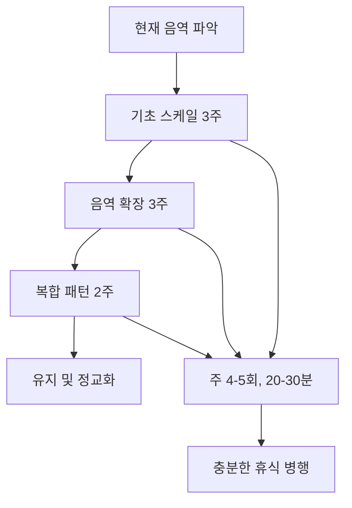

<iframe src="https://www.youtube.com/embed/nBL3K52syl4" width="560" height="315" frameborder="0" allowfullscreen></iframe>

# 한 줄 핵심

성대 근육은 불수의근이면서 골격근인 특수한 구조로, 적절한 스케일 훈련을 통해 의식적으로 발전시킬 수 있다.

---

## 개요

노래는 성대 근육의 움직임으로 이루어지지만, 이 근육들은 불수의근이면서 동시에 골격근이라는 매우 독특한 특성을 가지고 있습니다. 따라서 일반적인 근육 훈련 방법이 아닌 특수한 훈련 방법이 필요하며, 그것이 바로 스케일 연습입니다.

이 영상은 발성이론 기초 시리즈의 4번째 에피소드로, 왜 스케일 훈련이 필수적인지, 그리고 발성 기관이 어떤 원리로 발전하는지를 의학적 관점에서 설명합니다.

**러닝타임**: 4분 43초
**난이도**: 🟡 중급

---

## 목차

1. [[#성대 근육의 특수성]]
2. [[#스케일 훈련의 필요성]]
3. [[#발성 기관의 발전 원리]]
4. [[#효과적인 훈련 방법]]
5. [[#용어 사전]]
6. [[#셀프테스트]]
7. [[#내 생각 & 연결]]

---

## 성대 근육의 특수성

### 불수의근이면서 골격근

성대를 움직이는 내후두근(intrinsic laryngeal muscles)은 일반적인 골격근과 다른 독특한 특성을 가집니다:

- **불수의적 제어**: 심장 근육처럼 의식적으로 직접 제어할 수 없음
- **골격근 구조**: 하지만 구조적으로는 골격근(skeletal muscle)에 속함
- **중간 특성**: 따라서 훈련을 통해 간접적으로 발전시킬 수 있음

> [!warning] 왜 직접 제어가 안 되는가?
> 성대 근육은 진화적으로 기도 보호라는 생존 기능을 우선하도록 설계되었습니다. 의식적 제어가 가능했다면 위험 상황에서 반응이 늦어질 수 있었기 때문입니다.

### 근육 섬유 구성

연구에 따르면 후두 내근은 두 가지 유형의 근육 섬유로 구성됩니다:

**Type I 섬유 (지구력)**
- 느린 수축 속도
- 피로에 강함
- 장시간 사용에 유리
- 후윤상피열근(PCA)에 주로 분포

**Type II 섬유 (순발력)**
- 빠른 수축 속도
- 강한 힘 생산
- 피로에 약함
- 성대 진동 제어에 주로 관여

> [!note] PCA를 제외한 대부분의 내후두근은 Type II 섬유가 더 많습니다. 이는 기도 보호를 위한 빠른 성대 닫힘이 진화적으로 더 중요했기 때문입니다.

---

## 스케일 훈련의 필요성

### 왜 스케일인가?

스케일은 단순히 음정을 오르내리는 연습이 아닙니다:

1. **근육 활성화 패턴 학습**: 특정 음높이에서 어떤 근육 조합이 필요한지 학습
2. **신경근 연결 강화**: 뇌와 성대 근육 간의 신호 전달 효율 증가
3. **근육 기억 형성**: 반복을 통한 자동화된 발성 패턴 구축

### 스케일 vs 곡 연습

| 구분 | 스케일 연습 | 곡 연습 |
|------|------------|---------|
| 목적 | 근본적인 근육 훈련 | 음악적 표현 연습 |
| 집중 | 특정 음역/기술 | 전체적인 흐름 |
| 반복성 | 높음 (같은 패턴) | 낮음 (다양한 구성) |
| 효율성 | 단시간에 특정 영역 집중 개선 | 장시간 필요 |

> [!tip] 운동 비유
> 스케일 연습은 축구 선수의 드리블 연습, 곡 연습은 실전 경기와 같습니다. 드리블 없이 경기만 하면 기초 체력이 약해집니다.

---

## 발성 기관의 발전 원리

### SAID 원리 (Specific Adaptation to Imposed Demand)

운동 생리학의 핵심 원리가 발성에도 적용됩니다:

**적용 예시:**
- 고음역 스케일 반복 → 윤상갑상근(CT) 강화 → 고음 발성 용이
- 지속적 발성 연습 → Type I 섬유 증가 → 성대 지구력 향상

### 과부하 원칙 (Overload Principle)

현재 수준보다 약간 높은 요구를 지속적으로 부과해야 발전이 일어납니다:

- **강도 증가**: 더 높은 음, 더 큰 소리
- **지속 시간 증가**: 더 긴 프레이즈, 더 많은 반복
- **복잡도 증가**: 더 빠른 템포, 더 넓은 음역 이동

> [!warning] 과훈련 주의
> 대한음성학회 보고서(2023)에 따르면 과훈련으로 인해 25% 이상이 오히려 음성 악화를 경험했습니다. 충분한 휴식 없이 무리한 스케일 연습은 역효과를 냅니다.

### 신경근 적응 단계

발성 기관의 발전은 3단계로 진행됩니다:

**1단계: 신경 적응 (1-4주)**
- 뇌-근육 연결 효율 증가
- 불필요한 근육 긴장 감소
- 음정 정확도 향상

**2단계: 근섬유 적응 (4-8주)**
- 근육 섬유 유형 변화 (Type IIb → Type IIa)
- 미토콘드리아 증가 (에너지 생산 효율 ↑)
- 신경근 접합부(NMJ) 형태 변화

**3단계: 구조적 변화 (8주+)**
- 근섬유 크기 증가 (특정 근육)
- 모세혈관 밀도 증가
- 근지구력 대폭 향상

---

## 효과적인 훈련 방법

### 1. 횡격막 호흡 연계

스케일 연습 시 반드시 횡격막 호흡을 기반으로 해야 합니다:

**올바른 호흡 체크리스트:**
- [ ] 흡기 시 배가 먼저 팽창
- [ ] 어깨가 올라가지 않음
- [ ] 호기가 고르고 일정함

### 2. 점진적 과부하

| 주차 | 음역 | 반복 횟수 | 템포 |
|------|------|----------|------|
| 1-2 | 편안한 음역 ±3음 | 3회 | 느림 (60 BPM) |
| 3-4 | ±5음 | 5회 | 보통 (80 BPM) |
| 5-6 | ±7음 | 7회 | 보통 (80 BPM) |
| 7-8 | ±옥타브 | 5회 | 빠름 (100 BPM) |

### 3. 휴식과 회복

**음성 회복 3단계 루틴 (서울대병원 음성 클리닉, 2024):**

1. **초기 안정기**: 완전 음성 휴식 + 보습 유지
2. **중기 재활기**: 가벼운 발성 + 스트레칭
3. **후기 강화기**: 스케일 훈련 재개

> [!tip] 하루 최소 4시간의 음성 휴식이 권장됩니다 (대한이비인후과학회).

### 4. 발성 전후 스트레칭

**필수 스트레칭 루틴:**
- 턱 이완: 입 벌리고 턱을 좌우로 천천히 움직이기
- 혀 스트레칭: 혀를 최대한 내밀어 5초 유지
- 후두 마사지: 갑상연골 주변을 부드럽게 마사지

---

## 용어 사전

**내후두근 (Intrinsic Laryngeal Muscles)**
성대의 움직임을 직접 제어하는 후두 내부의 근육들. 윤상갑상근, 후윤상피열근, 측윤상피열근, 갑상피열근 등이 포함됨.

**골격근 (Skeletal Muscle)**
뼈에 부착되어 신체 움직임을 담당하는 근육. 횡문근이라고도 하며, 의지로 제어 가능한 수의근이 일반적이지만 성대 근육은 예외적으로 불수의적 특성을 가짐.

**신경근 접합부 (Neuromuscular Junction, NMJ)**
신경 말단과 근육 섬유가 만나는 지점. 전기 신호를 화학 신호로 변환하여 근육 수축을 일으킴. 훈련을 통해 이 연결의 효율이 증가함.

**SAID 원리 (Specific Adaptation to Imposed Demand)**
운동 생리학의 기본 원칙으로, 신체는 부과된 특정 요구에 맞춰 적응한다는 이론. 스케일 훈련 설계의 이론적 기반.

**과부하 원칙 (Overload Principle)**
현재 수준을 초과하는 자극을 지속적으로 제공해야만 근육이 발전한다는 원칙. 단, 과도한 부하는 부상으로 이어짐.

**Type I/II 근섬유**
Type I은 느리고 지구력이 강한 산화성 섬유, Type II는 빠르고 강하지만 피로에 약한 해당성 섬유. 후두근은 Type II가 우세하지만 훈련으로 비율 조정 가능.

---

## 종합 정리

### 핵심 3가지

1. **성대 근육의 이중성**: 불수의근이면서 골격근이므로 간접적 훈련 가능
2. **스케일의 본질**: 단순 음정 연습이 아닌 신경근 시스템 훈련
3. **과학적 훈련**: SAID 원리와 점진적 과부하를 통한 체계적 발전

### 실천 로드맵

### 흔한 실수

- ❌ 스케일 없이 곡 연습만 함 → 기초 체력 부족
- ❌ 과도한 반복으로 피로 누적 → 음성 손상
- ❌ 호흡 기반 없이 목만 사용 → 긴장성 발성
- ❌ 일관성 없는 연습 → 신경근 적응 실패

---

## 셀프테스트

### 이해도 체크

1. 성대 근육이 불수의근이면서 골격근이라는 특성이 왜 중요한가?
2. SAID 원리를 스케일 훈련에 어떻게 적용할 수 있는가?
3. Type I과 Type II 근섬유의 차이는 무엇이며, 각각 어떤 발성에 중요한가?
4. 신경근 적응의 3단계는 무엇이며, 각 단계는 얼마나 걸리는가?
5. 과훈련을 피하기 위한 핵심 원칙은?

### 실천 체크

- [ ] 나의 현재 편안한 음역을 파악했는가?
- [ ] 횡격막 호흡을 제대로 구사할 수 있는가?
- [ ] 발성 전후 스트레칭을 실천하고 있는가?
- [ ] 하루 4시간 이상 음성 휴식을 확보하는가?
- [ ] 주 4-5회, 20-30분 스케일 연습을 계획했는가?

---

## 내 생각 & 연결

### 개인적 인사이트

성대 근육이 불수의근이라는 점이 흥미롭습니다. 이는 우리가 "의지력"만으로는 노래 실력을 향상시킬 수 없고, 반드시 체계적인 훈련 시스템이 필요하다는 것을 의미합니다. 마치 심장을 더 빠르게 뛰게 하려고 의지로 명령할 수 없듯이, 성대도 간접적인 접근이 필요합니다.

운동 생리학의 SAID 원리가 발성에도 그대로 적용된다는 점은 발성 훈련을 "과학"으로 접근할 수 있게 만듭니다. 감으로 하는 것이 아니라, 측정 가능하고 재현 가능한 시스템으로 발전시킬 수 있다는 뜻입니다.

### 후속 학습 계획

- [ ] 윤상갑상근과 갑상피열근의 구체적인 역할 학습
- [ ] 음역별 최적 스케일 패턴 조사
- [ ] 실제 8주 프로그램 설계 및 실행
- [ ] 발성 전문가와 상담하여 개인 맞춤 계획 수립

---

## 보충자료

### 연구 논문

1. **Exercise Science and the Vocalist** (Johnson & Sandage, 2021)
   - 링크: https://www.ncbi.nlm.nih.gov/pmc/articles/PMC8524757/
   - 내용: 운동 과학이 발성 훈련에 어떻게 적용되는지 포괄적으로 다룬 논문
   - 이 노트의 SAID 원리, 근육 섬유 유형, 신경근 적응 부분을 과학적으로 뒷받침함

2. **성대 근육 강화 훈련법 5가지 핵심 팁** (Ds스쿨, 2024)
   - 링크: https://www.dsschool.co.kr/성대-근육-강화-훈련법-5가지-핵심-팁/
   - 내용: 실용적인 성대 강화 훈련법과 회복 루틴
   - 이 노트의 "효과적인 훈련 방법" 섹션을 실천 가능한 단계로 구체화함

### 관련 시리즈

이 영상은 "발성이론 기초 시리즈"의 Ep. 04입니다. 같은 시리즈의 다른 에피소드:
- Ep. 01: 발성의 3요소
- Ep. 02: 목소리의 종류
- Ep. 03: 발성용어 한방 정리
- Ep. 05: 실시간 긴장 해부학
- Ep. 06: 성대 붙이는 방법 총정리

---

**다음 복습일**: +1일 (2026-05-15), +7일 (2026-05-21), +30일 (2026-06-13)
