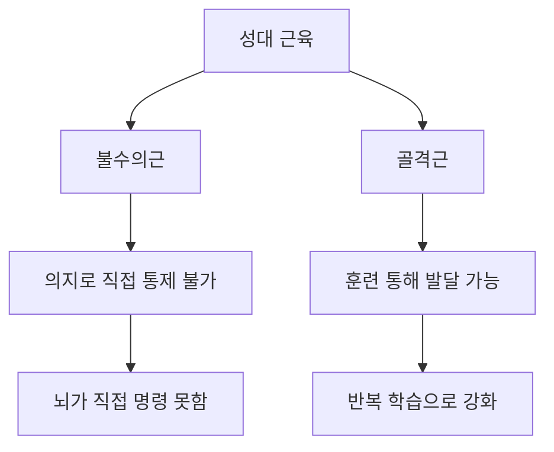
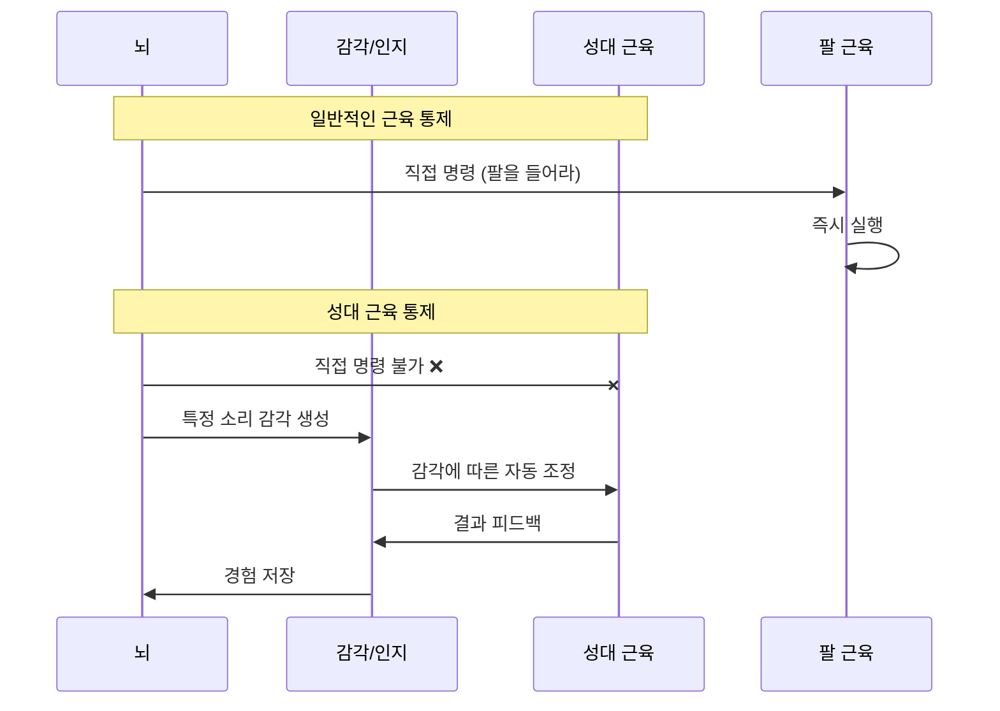
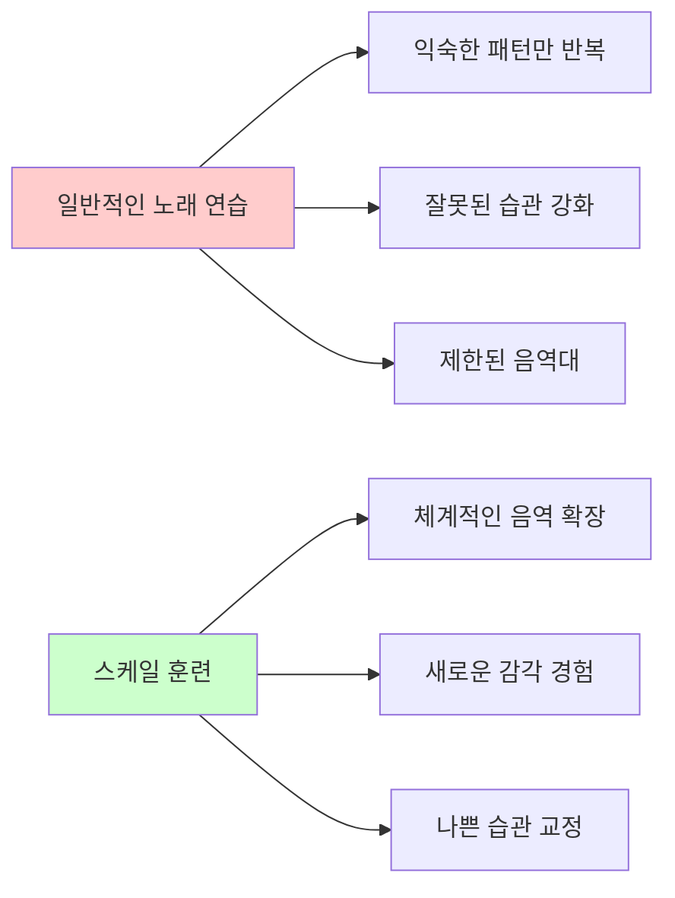
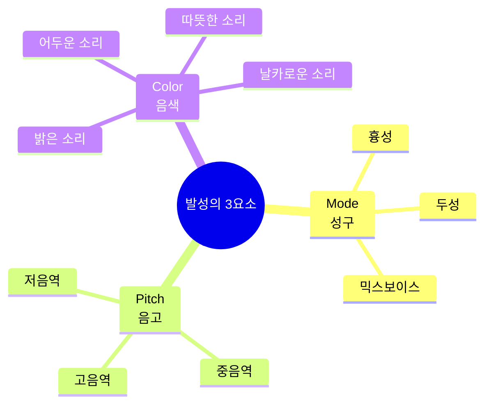
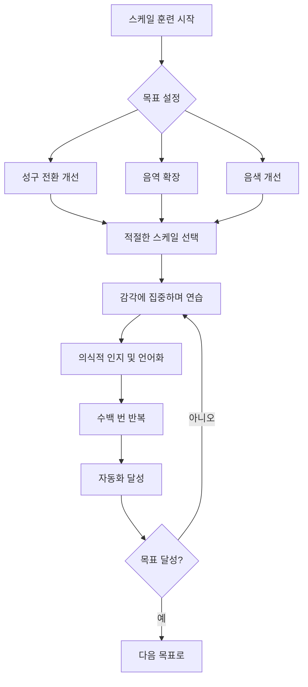
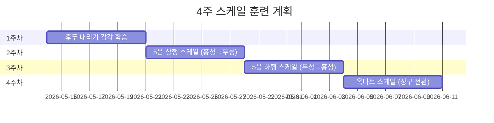

<iframe width="560" height="315" src="https://www.youtube.com/embed/nBL3K52syl4" title="YouTube video player" frameborder="0" allow="accelerometer; autoplay; clipboard-write; encrypted-media; gyroscope; picture-in-picture" allowfullscreen></iframe>

## 한 줄 핵심

성대 근육은 뇌가 직접 통제할 수 없는 불수의근이므로, 스케일을 통해 새로운 소리 감각을 반복적으로 경험시켜 뇌에 학습시키는 것이 발성 훈련의 핵심 원리다.

## 개요

**러닝타임**: 4분 43초
**난이도**: 중급 (발성 기초 이해 필요)
**학습 목표**:
- 성대 근육의 생리학적 특성 이해
- 스케일 훈련이 필요한 근본적 이유 파악
- 발성 기관 발전 메커니즘 학습
- 효과적인 발성 훈련 방법론 습득

**핵심 질문**: 왜 단순히 노래만 부르는 것이 아니라 스케일 연습을 해야 하는가?

## 목차

1. [[#성대 근육의 특수성]]
2. [[#발성 학습의 메커니즘]]
3. [[#스케일 훈련의 필요성]]
4. [[#감각 학습의 실제 예시]]
5. [[#코넬리우스 리더의 3가지 분류]]
6. [[#용어 사전]]
7. [[#종합 정리]]
8. [[#셀프테스트]]
9. [[#내 생각 & 연결]]
10. [[#보충자료]]

---

## 성대 근육의 특수성

### 불수의근이면서 골격근인 이중성

성대 근육은 인체에서 매우 독특한 위치를 차지한다:



> [!note] 불수의근과 수의근
> - **불수의근**: 심장 근육, 내장 근육처럼 의지로 직접 통제할 수 없는 근육
> - **수의근**: 팔다리 근육처럼 의지대로 움직일 수 있는 근육
> - **성대 근육**: 골격근이지만 뇌가 직접 명령을 내릴 수 없는 특수한 근육

### 노래는 근육 운동이다

| 특성 | 일반적인 운동 | 발성 운동 |
|------|--------------|-----------|
| 근육 유형 | 수의근 (팔, 다리) | 불수의근 + 골격근 (성대) |
| 통제 방식 | 의지로 직접 명령 | 감각을 통한 간접 유도 |
| 발달 방식 | 반복 운동으로 강화 | 반복 경험으로 학습 |
| 훈련 속도 | 비교적 빠름 | 상대적으로 느림 |

> [!warning] 흔한 오해
> "노래는 타고난 재능이다"라는 생각은 잘못된 인식이다. 노래는 근육 운동이며, 체계적인 훈련을 통해 누구나 발전시킬 수 있다. 다만 성대 근육의 특수성 때문에 일반적인 근육 훈련과는 다른 접근이 필요하다.

---

## 발성 학습의 메커니즘

### 뇌-성대 연결의 특수성



### 새로운 소리를 학습하는 3단계

1. **경험 단계**: 새로운 소리를 실제로 내보기
   - 예시: 처음으로 믹스보이스 소리를 내보는 순간

2. **인지 단계**: 그 소리의 감각을 의식적으로 인식하기
   - 예시: "아, 이런 진동감이구나", "목이 이렇게 열리는구나"

3. **저장 단계**: 뇌가 그 감각을 기억하여 재현 가능하게 하기
   - 예시: 의식하지 않아도 자연스럽게 그 소리를 낼 수 있게 됨

> [!tip] 학습 가속화 팁
> 새로운 소리를 낼 때마다 그 순간의 신체 감각을 **언어화**하고 **메모**하라. "목 뒤쪽이 시원하다", "진동이 코 쪽으로 올라온다" 등의 표현이 다음 연습 시 재현에 도움이 된다.

---

## 스케일 훈련의 필요성

### 왜 그냥 노래만 부르면 안 되는가?



### 스케일 훈련의 5가지 핵심 이점

| 훈련 요소 | 일반 노래 연습 | 스케일 훈련 |
|----------|--------------|------------|
| 음역 확장 | 노래의 한계에 갇힘 | 체계적으로 극한까지 확장 |
| 새로운 감각 습득 | 우연히 발견하면 다행 | 의도적으로 경험 설계 |
| 나쁜 습관 교정 | 반복될수록 고착화 | 올바른 패턴으로 재학습 |
| 훈련 효율성 | 산발적, 비효율적 | 집중적, 효율적 |
| 진행 측정 | 모호함 | 명확한 지표 (음역, 음질) |

> [!note] 스케일의 본질
> 스케일은 단순히 "도레미파솔라시도"를 부르는 것이 아니다. 특정한 **감각을 몸에 "때려박기" 위한 도구**다. 마치 헬스장에서 특정 근육을 집중적으로 자극하는 운동을 하듯이, 스케일은 발성 기관의 특정 기능을 집중 훈련하는 운동이다.

---

## 감각 학습의 실제 예시

### 사례: 하품을 통한 후두 내리기

**목표**: 후두를 내려서 넓고 깊은 소리를 만들기

**문제**: "후두를 내려라"라고 뇌에 직접 명령할 수 없음

**해결책**: 후두가 자연스럽게 내려가는 상황(하품)을 경험시키기

```mermaid
flowchart TD
    A[하품하기] --> B[후두가 자연스럽게 내려감]
    B --> C[그 감각을 의식적으로 인지]
    C --> D[그 감각 상태에서 소리 내기]
    D --> E[뇌가 "후두 내린 소리" 학습]
    E --> F[반복 훈련]
    F --> G[의식하지 않아도 후두 내린 소리 가능]

    style A fill:#e1f5ff
    style E fill:#ffe1e1
    style G fill:#e1ffe1
```

**훈련 프로세스**:

1. **1단계 - 감각 경험**: 하품할 때 목 안쪽이 넓어지는 느낌 주의 깊게 관찰
2. **2단계 - 의식적 재현**: 하품 없이도 그 느낌을 유지하려고 시도
3. **3단계 - 소리와 결합**: 그 느낌을 유지하면서 특정 모음(예: "아") 발성
4. **4단계 - 스케일 적용**: 그 감각을 유지하며 5음 스케일 상행/하행
5. **5단계 - 자동화**: 수백 번 반복하여 의식하지 않아도 자동으로 실행되게 함

> [!tip] 감각 학습 핵심 원칙
> **"명령이 아닌 경험"** - 성대 근육에게 "이렇게 해라"가 아니라 "이런 상황을 경험해봐"라고 접근해야 한다. 올바른 감각을 경험하면 성대 근육이 자동으로 올바른 동작을 한다.

### 감각을 "때려박는다"는 표현의 의미

강사가 사용한 "때려박는다"는 표현은:
- **반복의 강도**: 한두 번이 아닌 수십, 수백 번의 반복
- **의도의 명확성**: 무작위가 아닌 특정 감각에 집중
- **각인의 깊이**: 피상적이 아닌 무의식까지 스며드는 학습

---

## 코넬리우스 리더의 3가지 분류

Cornelius Reid(1911-2008)는 미국의 전설적인 성악 교사로, 발성을 과학적으로 체계화한 선구자다.

### 3가지 핵심 요소



### 1. Mode (성구)

**정의**: 성대가 진동하는 방식의 차이

| 성구 | 특징 | 느낌 | 주요 사용 음역 |
|------|------|------|---------------|
| 흉성 (Chest Voice) | 성대가 두껍게 진동 | 가슴 울림 | 낮은 음역 |
| 두성 (Head Voice) | 성대가 얇게 진동 | 머리 울림 | 높은 음역 |
| 믹스보이스 (Mix) | 흉성+두성 혼합 | 균형잡힌 울림 | 중간~고음역 |

**스케일 적용**: 특정 성구를 강화하거나, 성구 전환을 매끄럽게 하는 스케일 설계

### 2. Pitch (음고)

**정의**: 소리의 높낮이

**스케일 설계에서의 활용**:
- 음 간격이 넓은 스케일: 넓은 음역을 빠르게 이동하며 성구 전환 훈련
- 음 간격이 좁은 스케일: 특정 음역에서 안정감 확보

### 3. Color (음색)

**정의**: 같은 음높이와 성구라도 다르게 들리는 소리의 질감

**영향 요소**:
- 공명강의 모양 (목, 입, 코의 공간)
- 후두의 위치
- 혀의 위치
- 연구개의 높이

> [!note] 3요소의 상호작용
> 이 세 가지 요소는 독립적이지 않고 서로 영향을 주고받는다. 예를 들어:
> - 고음(pitch)으로 올라가면 자연스럽게 두성(mode)이 필요해짐
> - 밝은 음색(color)을 원하면 두성(mode)이 더 섞임
> - 스케일 훈련은 이 세 요소를 독립적으로 또는 통합적으로 훈련할 수 있게 설계됨

---

## 용어 사전

### 불수의근 (Involuntary Muscle)
자율신경계의 지배를 받아 의지와 무관하게 움직이는 근육. 심장 근육, 내장 근육 등. 성대 근육은 골격근이지만 불수의근의 특성을 가짐.

### 골격근 (Skeletal Muscle)
뼈에 붙어있는 근육으로 일반적으로 수의근. 훈련을 통해 발달 가능. 성대 근육은 골격근이지만 직접적인 의지로 통제할 수 없는 특수성을 가짐.

### 후두 (Larynx)
목 앞부분에 있는 기관으로 성대를 포함하는 구조물. 일반적으로 "목젖"이라 부르는 부분. 후두의 위치(높낮이)가 음색에 큰 영향을 미침.

### 성구 (Register, Mode)
성대가 진동하는 방식의 차이로 구분되는 발성 영역. 흉성, 두성, 믹스보이스 등.

### 스케일 (Scale)
체계적인 음계 연습. 발성 훈련에서는 특정 감각이나 기술을 집중적으로 훈련하기 위해 설계된 음형.

### 코넬리우스 리드 (Cornelius Reid)
20세기 미국의 전설적인 발성 교사. 발성을 과학적으로 분석하고 체계화한 선구자. Mode, Pitch, Color의 3요소 분류법 제시.

### 감각 학습 (Sensory Learning)
직접적인 명령이 아닌 감각 경험을 통해 학습하는 방법. 성대 근육처럼 직접 통제할 수 없는 기관을 훈련하는 핵심 원리.

---

## 종합 정리

### 핵심 개념 요약

1. **성대 근육의 특수성**: 불수의근이면서 골격근인 독특한 구조
   - 뇌가 직접 명령할 수 없음
   - 감각을 통한 간접적 학습만 가능

2. **발성 학습 메커니즘**: 경험 → 인지 → 저장 → 자동화
   - 새로운 소리를 실제로 경험
   - 그 감각을 의식적으로 인지
   - 뇌가 저장하여 재현 가능하게 함

3. **스케일 훈련의 필요성**: 체계적이고 집중적인 감각 학습 도구
   - 특정 감각을 "때려박기" 위한 설계된 운동
   - 일반 노래 연습보다 훨씬 효율적

4. **코넬리우스 리더의 3요소**: Mode, Pitch, Color
   - 발성의 모든 측면을 체계적으로 분류
   - 스케일 설계의 이론적 기반

### 실천 가이드



> [!warning] 흔한 실수
> - **속도 조급증**: 감각이 몸에 각인되려면 최소 수백 번의 반복이 필요하다. 며칠 만에 결과를 기대하지 마라.
> - **기계적 반복**: 의식 없이 그냥 소리만 내는 것은 효과가 없다. 매 반복마다 감각에 집중해야 한다.
> - **이론만 공부**: 이해만으로는 발전이 없다. 반드시 실제로 소리를 내며 경험해야 한다.

---

## 셀프테스트

### 이해도 확인 문제

1. **개념 이해**
   - Q: 성대 근육이 왜 일반적인 근육과 다르게 훈련해야 하는가?
   - A: 성대 근육은 불수의근의 특성을 가져 뇌가 직접 명령할 수 없기 때문에, 감각 경험을 통한 간접적 학습이 필요하다.

2. **적용 능력**
   - Q: "후두를 내려라"라는 지시를 어떻게 실제 훈련으로 전환할 수 있는가?
   - A: 하품과 같이 후두가 자연스럽게 내려가는 상황을 만들고, 그 감각을 인지한 후, 그 감각을 유지하며 발성하는 방식으로 훈련한다.

3. **분석 능력**
   - Q: 스케일 훈련이 일반 노래 연습보다 효율적인 이유 3가지는?
   - A:
     1. 특정 감각에 집중적으로 노출시킬 수 있음
     2. 노래의 음역 제한을 벗어나 체계적으로 확장 가능
     3. 나쁜 습관을 반복하지 않고 올바른 패턴으로 재학습 가능

### 실천 체크리스트

- [ ] 오늘 연습에서 새로운 감각을 경험했는가?
- [ ] 그 감각을 언어로 표현하여 기록했는가?
- [ ] 같은 스케일을 최소 20회 이상 반복했는가?
- [ ] 기계적 반복이 아닌 의식적 집중을 유지했는가?
- [ ] Mode, Pitch, Color 중 어떤 요소를 훈련하는지 명확히 알고 있는가?

---

## 내 생각 & 연결

### 다른 학습 영역과의 연결

이 발성 학습 원리는 다른 영역에도 적용 가능:

**언어 학습**:
- 새로운 발음을 배울 때도 직접적인 설명보다 모방과 감각 학습이 효과적
- 혀의 위치를 "앞으로 3mm 이동"이라고 명령할 수 없듯이, 올바른 발음 경험을 반복해야 함

**악기 연주**:
- 피아노의 터치, 바이올린의 보잉도 언어화하기 어려운 감각
- 반복적인 스케일 연습을 통해 손가락 근육에 패턴을 각인

**운동 기술**:
- 골프 스윙, 테니스 서브 등도 의식적 명령보다 몸의 감각 학습이 중요
- 스케일처럼 분해된 동작 반복 훈련이 효과적

### 나의 적용 계획



---

## 보충자료

### 추천 다음 학습 단계

1. **같은 채널의 다음 영상**: "스케일을 디자인하는 법" - 스케일 설계의 구체적 방법론
2. **성대 해부학 기초**: 성대의 구조를 이해하면 왜 직접 통제가 안 되는지 더 명확히 알 수 있음
3. **운동학습 이론**: Motor Learning 이론은 발성 학습과 많은 공통점을 가짐

### 관련 과학 개념

**운동 기억 (Motor Memory)**:
- 절차 기억(Procedural Memory)의 일종
- 반복을 통해 대뇌 기저핵과 소뇌에 저장됨
- 의식하지 않아도 실행 가능한 자동화된 기술

**신경가소성 (Neuroplasticity)**:
- 뇌는 새로운 경험을 통해 계속 변화할 수 있음
- 성인이 되어서도 새로운 발성 기술 습득 가능
- 반복이 많을수록 신경 회로가 강화됨

### 참고문헌

- Cornelius L. Reid, "The Free Voice: A Guide to Natural Singing"
- Richard Miller, "The Structure of Singing"
- 대한음성언어의학회, "음성장애" (한국어 자료)

### 연습 도구 추천

- **피아노 앱**: 정확한 음정으로 스케일 연습
- **녹음 앱**: 자신의 목소리를 객관적으로 들으며 변화 추적
- **메트로놈**: 일정한 템포로 반복 훈련

---

> [!tip] 최종 조언
> 이 영상의 가장 중요한 메시지는 **"발성은 재능이 아니라 학습 가능한 근육 운동"**이라는 것이다. 올바른 방법론(스케일 훈련)과 충분한 반복만 있다면 누구나 발성을 개선할 수 있다. 조급해하지 말고, 매일 조금씩, 감각에 집중하며 연습하라.
