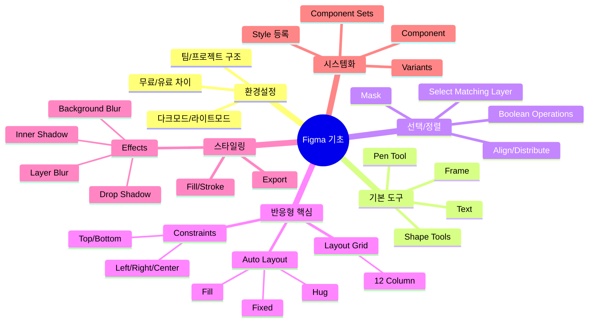
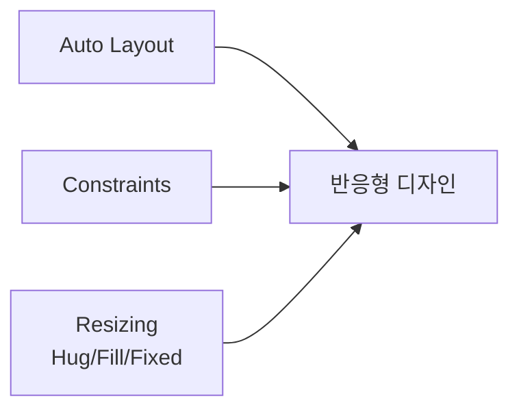
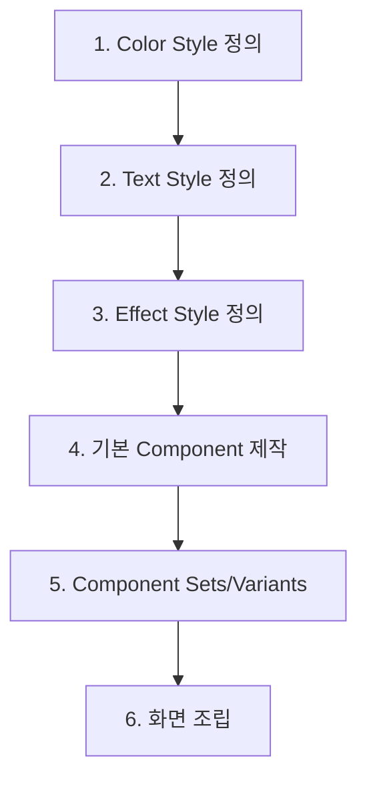

# 🔥 피그마(Figma) 기초 마스터 강좌

<iframe width="100%" height="400" src="https://www.youtube.com/embed/c6yCZecrMpQ" frameborder="0" allowfullscreen></iframe>

> [!info] 영상 정보
> - **채널**: Madia Designer (디자이너 마디)
> - **길이**: 2시간 54분
> - **조회수**: 445,024회 (2024.06 기준)
> - **대상**: UI/UX 디자이너, 기획자, 개발자, 퍼블리셔, 마케터

---

## 📋 목차

1. [[#🎯 한 줄 핵심|한 줄 핵심]]
2. [[#📖 개요|개요]]
3. [[#🗺️ 마인드맵|마인드맵]]
4. [[#📚 챕터별 학습|챕터별 학습]]
5. [[#💡 핵심 개념 정리|핵심 개념 정리]]
6. [[#🔧 실무 팁|실무 팁]]
7. [[#📝 용어 사전|용어 사전]]
8. [[#✅ 셀프테스트|셀프테스트]]
9. [[#🔗 보충자료|보충자료]]

---

## 🎯 한 줄 핵심

**피그마는 단순 디자인 툴이 아닌 협업 플랫폼으로, Auto Layout + Constraints + Component 3가지를 마스터하면 실무 80%를 커버할 수 있다.**

---

## 📖 개요

피그마는 현재 전 세계 글로벌 기업들과 국내 대기업들이 Adobe XD, Sketch에서 전환하고 있는 **웹 기반 UI/UX 디자인 툴**이다. 

이 강좌는 피그마의 모든 기능이 아닌, **실무에서 반드시 필요한 핵심 기능**만 선별하여 다룬다:

- **협업 중심**: 기획자, 디자이너, 개발자, 퍼블리셔, 마케터가 함께 사용
- **실시간 동기화**: 클라우드 기반으로 버전 관리 자동화
- **반응형 설계**: Auto Layout으로 다양한 화면 크기 대응
- **디자인 시스템**: Component와 Style로 일관성 유지

> [!tip] 학습 전략
> 영상이 3시간에 달하므로 **챕터별로 끊어서 학습**하고, 각 챕터마다 직접 따라해보는 것을 권장한다.

---

## 🗺️ 마인드맵



---

## 📚 챕터별 학습

### Chapter 1: 초기 화면 구성 🟢
<iframe width="100%" height="200" src="https://www.youtube.com/embed/c6yCZecrMpQ?start=306&end=870" frameborder="0" allowfullscreen></iframe>

| 항목 | 설명 |
|------|------|
| **시간** | 5:06 ~ 14:30 |
| **난이도** | 🟢 기초 |
| **핵심** | 피그마 인터페이스와 팀/프로젝트 구조 이해 |

#### 핵심 내용

**좌측 메뉴 구조**:
- **프로필**: 다크모드/라이트모드 설정 가능
- **검색**: 최근 열었던 파일 검색
- **Your Teams**: 소속된 팀 목록
- **Drafts**: 초안 작업물 저장소

**무료 vs 유료**:
| 항목 | 무료 | 유료 |
|------|------|------|
| 프로젝트 | 1개 | 무제한 |
| 디자인 파일 | 3개 | 무제한 |
| 피그잼 | 3개 | 무제한 |

**팀 생성 방법**:
1. 하단 `+` → Create New Team
2. 팀 이름 입력
3. 공동 작업자 이메일 초대 (선택)

> [!note] 실무 팁
> 초보자는 무료 버전으로 충분하다. 유료는 팀 협업이 본격화될 때 고려하자.

---

### Chapter 2: 기초 툴 개념 🟢
<iframe width="100%" height="200" src="https://www.youtube.com/embed/c6yCZecrMpQ?start=870&end=1291" frameborder="0" allowfullscreen></iframe>

| 항목 | 설명 |
|------|------|
| **시간** | 14:25 ~ 21:31 |
| **난이도** | 🟢 기초 |
| **핵심** | 저장, 버전 히스토리, 공유 기능 |

#### Version History (버전 히스토리)

피그마는 **자동 저장**되지만, 중요 시점에 수동으로 버전을 남길 수 있다:

1. `File` → `Save to Version History`
2. 버전 이름 입력 (예: "v1.0 - 메인 레이아웃 완성")
3. 언제든 해당 버전으로 복원 가능

#### 공유 및 초대

**권한 레벨**:
- **Can Edit**: 편집 가능 (디자이너)
- **Can View**: 보기만 가능 (기획자, 개발자 확인용)
- **Can View Prototypes**: 프로토타입만 확인 가능

> [!warning] 주의
> Edit 권한은 신중하게 부여하자. 실수로 디자인이 변경될 수 있다.

---

### Chapter 3: 기초 툴 기능 🟢
<iframe width="100%" height="200" src="https://www.youtube.com/embed/c6yCZecrMpQ?start=1291&end=2158" frameborder="0" allowfullscreen></iframe>

| 항목 | 설명 |
|------|------|
| **시간** | 21:31 ~ 35:58 |
| **난이도** | 🟢 기초 |
| **핵심** | Frame, Shape, Pen, Text 도구 사용법 |

#### Frame vs Rectangle

| Frame | Rectangle |
|-------|-----------|
| 컨테이너 역할 | 단순 도형 |
| 자식 요소 포함 가능 | 독립적 요소 |
| Auto Layout 적용 가능 | Auto Layout 불가 |
| 반응형 디자인 필수 | 장식용 |

> [!important] 핵심 원칙
> **화면(Screen)은 항상 Frame으로 만든다.** Rectangle은 배경이나 장식에만 사용.

#### Shape Tools

- **Rectangle (R)**: 사각형
- **Ellipse (O)**: 원/타원
- **Line (L)**: 선
- **Polygon**: 다각형

**Corner Radius (모서리 둥글기)**:
- 전체: 4개 모서리 동시 적용
- 개별: 각 모서리 독립 설정 가능

#### Pen Tool (P)

벡터 패스 그리기 도구. 아이콘 제작에 필수.

**핵심 조작**:
- 클릭: 직선 앵커 포인트
- 드래그: 곡선 핸들 생성
- `Alt` + 클릭: 핸들 꺾기

---

### Chapter 4: Select Matching Layer 🟡
<iframe width="100%" height="200" src="https://www.youtube.com/embed/c6yCZecrMpQ?start=2158&end=2373" frameborder="0" allowfullscreen></iframe>

| 항목 | 설명 |
|------|------|
| **시간** | 35:58 ~ 39:33 |
| **난이도** | 🟡 중급 |
| **핵심** | 동일한 속성의 레이어 일괄 선택 |

#### 기능 설명

**Select Matching Layer**는 동일한 속성을 가진 모든 레이어를 한 번에 선택하는 기능이다.

**사용 시나리오**:
- 모든 버튼의 색상을 한 번에 변경
- 같은 폰트 스타일 텍스트 일괄 수정
- 동일 크기 아이콘 전체 선택

**방법**:
1. 기준이 될 레이어 선택
2. `Edit` → `Select All with Same...` (또는 우클릭 메뉴)
3. 원하는 속성 선택 (Fill, Stroke, Font 등)

> [!tip] 단축키
> 자주 쓰는 기능이므로 단축키를 외워두면 생산성이 크게 향상된다.

---

### Chapter 5: Mask (마스크) 🟡
<iframe width="100%" height="200" src="https://www.youtube.com/embed/c6yCZecrMpQ?start=2373&end=2496" frameborder="0" allowfullscreen></iframe>

| 항목 | 설명 |
|------|------|
| **시간** | 39:33 ~ 41:36 |
| **난이도** | 🟡 중급 |
| **핵심** | 이미지를 원하는 형태로 자르기 |

#### Use as Mask

마스크는 **특정 영역만 보이게 하는 기능**이다.

**적용 순서**:
1. 마스크로 사용할 도형 생성 (예: 원형)
2. 마스크 안에 들어갈 이미지 배치
3. 도형 → 이미지 순서로 선택
4. 우클릭 → `Use as Mask` 또는 `Ctrl/Cmd + Alt + M`

**활용 예시**:
- 프로필 이미지를 원형으로 자르기
- 카드 이미지를 둥근 모서리로 표시
- 복잡한 형태로 이미지 크롭

```
┌─────────────┐
│   도형      │  ←  마스크 영역
│  ┌─────┐    │
│  │이미지│   │  ←  이 부분만 보임
│  └─────┘    │
└─────────────┘
```

---

### Chapter 6: Boolean Operations (Union Selection) 🟡
<iframe width="100%" height="200" src="https://www.youtube.com/embed/c6yCZecrMpQ?start=2496&end=2672" frameborder="0" allowfullscreen></iframe>

| 항목 | 설명 |
|------|------|
| **시간** | 41:36 ~ 44:32 |
| **난이도** | 🟡 중급 |
| **핵심** | 도형 합치기/빼기/교차 연산 |

#### Boolean 연산 종류

| 연산 | 설명 | 아이콘 |
|------|------|--------|
| **Union** | 합집합 (두 도형 합치기) | ⊕ |
| **Subtract** | 차집합 (앞 도형에서 뒤 도형 빼기) | ⊖ |
| **Intersect** | 교집합 (겹치는 부분만) | ⊗ |
| **Exclude** | 배타적 합집합 (겹치는 부분 제외) | ⊘ |

**실무 활용**:
- **Union**: 복잡한 아이콘 조합
- **Subtract**: 도넛 형태, 구멍 뚫린 도형
- **Intersect**: 겹치는 영역 강조
- **Exclude**: 특수 효과

> [!example] 예시: 도넛 만들기
> 1. 큰 원 생성
> 2. 작은 원 생성 (중앙 배치)
> 3. 둘 다 선택 → Subtract
> 4. 결과: 가운데 구멍 뚫린 도넛

---

### Chapter 7: Align (정렬) 🟢
<iframe width="100%" height="200" src="https://www.youtube.com/embed/c6yCZecrMpQ?start=2672&end=2837" frameborder="0" allowfullscreen></iframe>

| 항목 | 설명 |
|------|------|
| **시간** | 44:32 ~ 47:17 |
| **난이도** | 🟢 기초 |
| **핵심** | 요소 정렬 및 균등 배치 |

#### 정렬 옵션

**수평 정렬**:
- Align Left: 좌측 정렬
- Align Center (H): 가로 중앙
- Align Right: 우측 정렬

**수직 정렬**:
- Align Top: 상단 정렬
- Align Center (V): 세로 중앙
- Align Bottom: 하단 정렬

**균등 배치 (Distribute)**:
- Distribute Horizontal: 가로 간격 균등
- Distribute Vertical: 세로 간격 균등

> [!tip] 단축키
> - `Alt + A`: 좌측 정렬
> - `Alt + D`: 우측 정렬
> - `Alt + V`: 수직 중앙
> - `Alt + H`: 수평 중앙

---

### Chapter 8: Auto Layout ⭐🔴
<iframe width="100%" height="200" src="https://www.youtube.com/embed/c6yCZecrMpQ?start=3018&end=4341" frameborder="0" allowfullscreen></iframe>

| 항목 | 설명 |
|------|------|
| **시간** | 50:18 ~ 1:12:21 |
| **난이도** | 🔴 심화 (핵심!) |
| **핵심** | 반응형 디자인의 핵심 기능 |

> [!important] ⭐ 가장 중요한 챕터
> Auto Layout은 피그마의 **가장 강력하고 중요한 기능**이다. 반응형 디자인, 컴포넌트 제작, 실무 효율성 모두 이 기능에 달려있다.

#### Auto Layout이란?

**CSS Flexbox와 동일한 개념**으로, 자식 요소들을 자동으로 정렬하고 간격을 조절하는 기능.

**적용 방법**:
1. 요소들 선택
2. `Shift + A` 또는 우측 패널 `+` 클릭

#### 방향 설정

| 방향 | 설명 | CSS 대응 |
|------|------|----------|
| Horizontal | 가로 배치 | `flex-direction: row` |
| Vertical | 세로 배치 | `flex-direction: column` |

#### Gap (간격)

요소 간 간격 설정. **개별 마진보다 Gap을 사용**하는 것이 유지보수에 유리.

```
┌─────────────────────────────┐
│  [요소1]  ←Gap→  [요소2]    │
│     ↑                       │
│   Padding                   │
└─────────────────────────────┘
```

#### Padding (내부 여백)

컨테이너 안쪽 여백. 4방향 개별 설정 가능:
- 전체 동일: `16`
- 상하/좌우: `16, 24`
- 개별: `16, 24, 16, 24` (상, 우, 하, 좌)

#### ⭐ Resizing (크기 조절) - 핵심 중의 핵심

| 옵션 | 설명 | 사용 시점 |
|------|------|----------|
| **Fixed** | 고정 크기 | 아이콘, 버튼 너비 등 |
| **Hug** | 내용에 맞춤 | 텍스트 길이에 따라 변화 |
| **Fill** | 부모 크기에 맞춤 | 반응형 컨테이너 |

> [!warning] 흔한 실수
> **Fill은 반드시 부모가 Auto Layout이어야 작동한다!**

**예시: 반응형 카드**
```
Card (Auto Layout - Vertical)
├── Image (Fixed Height, Fill Width)
├── Title (Hug)
└── Description (Fill Width, Hug Height)
```

#### 실습: 반응형 모바일 화면 만들기

1. **Frame 생성** (390 x 844 - iPhone 14 사이즈)
2. **Status Bar** 추가 → Width: Fill
3. **Content Area** → Auto Layout (Vertical), Gap: 16
4. **각 요소에 Fill 적용**
5. Frame 크기 조절 시 내부 요소가 자동으로 반응!

---

### Chapter 9: Constraints (컨스트레인츠) 🔴
<iframe width="100%" height="200" src="https://www.youtube.com/embed/c6yCZecrMpQ?start=4266&end=5328" frameborder="0" allowfullscreen></iframe>

| 항목 | 설명 |
|------|------|
| **시간** | 1:11:06 ~ 1:28:48 |
| **난이도** | 🔴 심화 |
| **핵심** | 부모 Frame 기준 위치 고정 |

#### Constraints란?

**부모 Frame 크기가 변할 때 자식 요소의 위치/크기를 어떻게 유지할지** 결정하는 기능.

#### 수평 Constraints

| 옵션 | 동작 |
|------|------|
| **Left** | 왼쪽 거리 유지 |
| **Right** | 오른쪽 거리 유지 |
| **Left & Right** | 양쪽 거리 유지 (늘어남) |
| **Center** | 중앙 위치 유지 |
| **Scale** | 비율 유지 |

#### 수직 Constraints

| 옵션 | 동작 |
|------|------|
| **Top** | 위쪽 거리 유지 |
| **Bottom** | 아래쪽 거리 유지 |
| **Top & Bottom** | 양쪽 거리 유지 (늘어남) |
| **Center** | 중앙 위치 유지 |
| **Scale** | 비율 유지 |

#### Auto Layout vs Constraints

| Auto Layout | Constraints |
|-------------|-------------|
| 요소 간 관계 | 부모-자식 관계 |
| 동적 배치 | 고정 위치 |
| 반응형 컨텐츠 | 반응형 레이아웃 |
| **함께 사용하면 완벽한 반응형!** ||

> [!example] 실무 예시
> - **FAB 버튼**: Right + Bottom (우하단 고정)
> - **헤더**: Left & Right + Top (상단 전체 너비)
> - **로고**: Left + Top (좌상단 고정)

---

### Chapter 10: Layout Grid 🟡
<iframe width="100%" height="200" src="https://www.youtube.com/embed/c6yCZecrMpQ?start=5328&end=5762" frameborder="0" allowfullscreen></iframe>

| 항목 | 설명 |
|------|------|
| **시간** | 1:28:48 ~ 1:36:02 |
| **난이도** | 🟡 중급 |
| **핵심** | 그리드 시스템으로 정렬된 레이아웃 |

#### Grid 종류

| 타입 | 용도 |
|------|------|
| **Grid** | 픽셀 단위 격자 |
| **Columns** | 세로 칼럼 (웹 레이아웃) |
| **Rows** | 가로 행 |

#### 12 Column Grid (웹 표준)

**설정값**:
- Count: 12
- Margin: 60px (좌우 여백)
- Gutter: 32px (칼럼 간격)

```
│←Margin→│Col│Gutter│Col│Gutter│...│Col│←Margin→│
│   60   │   │  32  │   │  32  │...│   │   60   │
```

#### 아이콘 가이드 그리드

아이콘 디자인 시 일관성을 위한 가이드:
1. Frame에 Layout Grid 추가
2. Rows: 1개, Offset: 3px (상하 여백)
3. Columns: 1개, Offset: 3px (좌우 여백)
4. 정사각형 + 세로 직사각형 + 가로 직사각형 가이드 완성

---

### Chapter 11: Font/Fill/Stroke 🟢
<iframe width="100%" height="200" src="https://www.youtube.com/embed/c6yCZecrMpQ?start=5762&end=7500" frameborder="0" allowfullscreen></iframe>

| 항목 | 설명 |
|------|------|
| **시간** | 1:36:02 ~ 2:05:00 |
| **난이도** | 🟢 기초 |
| **핵심** | 텍스트, 채우기, 테두리 스타일링 |

#### Text 속성

| 속성 | 설명 |
|------|------|
| **Font Family** | 폰트 종류 (Pretendard 등) |
| **Font Weight** | 굵기 (Light ~ Black) |
| **Font Size** | 크기 (px) |
| **Line Height** | 행간 (px 또는 %) |
| **Letter Spacing** | 자간 |
| **Paragraph Spacing** | 문단 간격 |

#### Text Resizing

| 옵션 | 동작 |
|------|------|
| **Auto Width** | 텍스트 길이에 따라 너비 확장 |
| **Auto Height** | 고정 너비, 높이만 확장 |
| **Fixed Size** | 고정 크기, 말줄임(...) 처리 |

#### Truncate (말줄임)

긴 텍스트를 `...`으로 자르기:
1. Text Resizing을 Fixed로 설정
2. 우측 `...` 메뉴 → Truncate Text 활성화
3. Max Lines 설정 (1줄, 2줄, 3줄 등)

#### Fill (채우기)

- **Solid**: 단색
- **Linear Gradient**: 선형 그라데이션
- **Radial Gradient**: 원형 그라데이션
- **Image**: 이미지 채우기

#### Stroke (테두리)

| 속성 | 설명 |
|------|------|
| **Position** | Inside / Center / Outside |
| **Weight** | 두께 (px) |
| **Dash** | 점선 패턴 |
| **Cap** | 끝 모양 (None, Round, Square) |
| **Join** | 모서리 연결 (Miter, Bevel, Round) |

> [!tip] Inside vs Outside
> - **Inside**: 도형 크기 유지 (UI 요소에 권장)
> - **Outside**: 도형이 테두리만큼 커짐
> - **Center**: 절반씩 안팎으로

---

### Chapter 12: Effects 🟡
<iframe width="100%" height="200" src="https://www.youtube.com/embed/c6yCZecrMpQ?start=7500&end=8177" frameborder="0" allowfullscreen></iframe>

| 항목 | 설명 |
|------|------|
| **시간** | 2:05:00 ~ 2:16:17 |
| **난이도** | 🟡 중급 |
| **핵심** | 그림자, 블러 효과 |

#### Effect 종류

| 효과 | 설명 | 용도 |
|------|------|------|
| **Drop Shadow** | 외부 그림자 | 카드, 버튼 부각 |
| **Inner Shadow** | 내부 그림자 | 입체감, 눌린 효과 |
| **Layer Blur** | 레이어 흐림 | 배경 흐림 처리 |
| **Background Blur** | 배경 블러 | 글래스모피즘 |

#### Drop Shadow 설정

```
X: 0       (수평 이동)
Y: 4       (수직 이동 - 아래로)
Blur: 8    (흐림 정도)
Spread: 0  (크기 확장)
Color: #000000, 25% (색상, 투명도)
```

> [!example] 카드 그림자 추천값
> - 가벼운 그림자: `0, 2, 4, 0, 10%`
> - 중간 그림자: `0, 4, 8, 0, 15%`
> - 강한 그림자: `0, 8, 16, 2, 20%`

#### Background Blur (글래스모피즘)

반투명 배경 + 블러 효과:
1. 도형에 Fill 추가 (흰색 50% 투명도)
2. Effects → Background Blur: 20~40

---

### Chapter 13: Export 🟢
<iframe width="100%" height="200" src="https://www.youtube.com/embed/c6yCZecrMpQ?start=8177&end=8300" frameborder="0" allowfullscreen></iframe>

| 항목 | 설명 |
|------|------|
| **시간** | 2:16:17 ~ 2:18:20 |
| **난이도** | 🟢 기초 |
| **핵심** | 디자인 에셋 내보내기 |

#### Export 설정

| 포맷 | 용도 |
|------|------|
| **PNG** | 일반 이미지, 투명 배경 지원 |
| **JPG** | 사진, 용량 작음 |
| **SVG** | 벡터, 아이콘, 로고 |
| **PDF** | 인쇄용, 문서 |

#### 배율 설정

| 배율 | 용도 |
|------|------|
| **1x** | 웹 기본 |
| **2x** | 레티나 디스플레이 |
| **3x** | 고해상도 모바일 |
| **4x** | 인쇄용 |

**여러 배율 동시 내보내기**:
1. Export 섹션에서 `+` 클릭
2. 1x, 2x, 3x 각각 추가
3. Export 클릭 → 모든 배율 파일 생성

---

### Chapter 14: Style 등록 🟡
<iframe width="100%" height="200" src="https://www.youtube.com/embed/c6yCZecrMpQ?start=8300&end=9350" frameborder="0" allowfullscreen></iframe>

| 항목 | 설명 |
|------|------|
| **시간** | 2:18:20 ~ 2:35:50 |
| **난이도** | 🟡 중급 |
| **핵심** | 재사용 가능한 스타일 정의 |

#### Style 종류

| 타입 | 등록 가능 속성 |
|------|----------------|
| **Color Style** | Fill, Stroke 색상 |
| **Text Style** | Font, Size, Weight, Line Height |
| **Effect Style** | Shadow, Blur |
| **Grid Style** | Layout Grid |

#### 네이밍 컨벤션

**슬래시(/)로 폴더 구조 생성**:
```
Primary/Blue/500
Primary/Blue/600
Neutral/Gray/100
Neutral/Gray/900
```

결과:
```
📁 Primary
  📁 Blue
    - 500
    - 600
📁 Neutral
  📁 Gray
    - 100
    - 900
```

#### Style 등록 방법

1. 요소 선택
2. 속성 패널에서 스타일 아이콘(4개 점) 클릭
3. `+` → 이름 입력 → Create Style

#### Style 적용

1. 요소 선택
2. 속성 패널에서 스타일 아이콘 클릭
3. 등록된 스타일 목록에서 선택

> [!tip] 실무 팁
> 스타일을 먼저 정의하고 디자인을 시작하면 일관성 유지가 쉽다.

---

### Chapter 15: Component & Component Sets ⭐🔴
<iframe width="100%" height="200" src="https://www.youtube.com/embed/c6yCZecrMpQ?start=9350&end=10439" frameborder="0" allowfullscreen></iframe>

| 항목 | 설명 |
|------|------|
| **시간** | 2:35:50 ~ 2:53:59 |
| **난이도** | 🔴 심화 (핵심!) |
| **핵심** | 재사용 가능한 디자인 블록 |

> [!important] ⭐ 두 번째로 중요한 챕터
> Component는 **디자인 시스템의 핵심**이다. 한 번 만들어두면 전체 프로젝트에서 재사용하고, 한 곳에서 수정하면 모든 인스턴스에 반영된다.

#### Component 기본 개념

| 용어 | 설명 |
|------|------|
| **Main Component** | 원본 (마스터) |
| **Instance** | 복사본 (Main에 연결됨) |

**만들기**: 요소 선택 → `Ctrl/Cmd + Alt + K` 또는 우클릭 → Create Component

#### Component 네이밍 규칙

```
카테고리/컴포넌트명/상태
Button/Primary/Default
Button/Primary/Hover
Button/Secondary/Default
```

#### Component Sets (Variants)

**여러 상태를 하나의 컴포넌트로 묶기**:

1. 같은 컴포넌트의 여러 버전 생성 (Default, Hover, Active 등)
2. 모두 선택 → 우클릭 → Combine as Variants
3. Property 정의:
   - **State**: Default, Hover, Active, Disabled
   - **Size**: Small, Medium, Large
   - **Type**: Primary, Secondary, Outline

#### Variant Property 설정

```
Button Component Set
├── State
│   ├── Default
│   ├── Hover
│   ├── Active
│   └── Disabled
├── Size
│   ├── Small (32px)
│   ├── Medium (40px)
│   └── Large (48px)
└── Style
    ├── Primary (blue)
    ├── Secondary (gray)
    └── Outline (border only)
```

#### Instance Override

Instance에서 변경 가능한 것:
- ✅ 텍스트 내용
- ✅ 색상 (Fill, Stroke)
- ✅ 이미지
- ✅ 표시/숨김 (Show/Hide)

Instance에서 변경 불가능한 것:
- ❌ 구조 (레이어 추가/삭제)
- ❌ Auto Layout 설정
- ❌ 크기 (Size가 Fixed인 경우)

> [!warning] 주의
> Instance를 Detach하면 Main Component와의 연결이 끊어진다. 신중하게 사용하자.

---

## 💡 핵심 개념 정리

### 반응형 디자인 3요소



| 요소 | 역할 | 단축키 |
|------|------|--------|
| Auto Layout | 요소 간 관계 정의 | `Shift + A` |
| Constraints | 부모-자식 위치 관계 | 속성 패널에서 설정 |
| Resizing | 크기 변화 방식 | 속성 패널에서 설정 |

### 디자인 시스템 구축 순서



---

## 🔧 실무 팁

### 자주 쓰는 단축키

| 기능 | Mac | Windows |
|------|-----|---------|
| Frame 생성 | `F` | `F` |
| Auto Layout | `Shift + A` | `Shift + A` |
| Component 생성 | `⌘ + ⌥ + K` | `Ctrl + Alt + K` |
| 그룹 | `⌘ + G` | `Ctrl + G` |
| 복제 | `⌘ + D` | `Ctrl + D` |
| 숨기기 | `⌘ + Shift + H` | `Ctrl + Shift + H` |
| 잠금 | `⌘ + Shift + L` | `Ctrl + Shift + L` |
| 확대 | `⌘ + +` | `Ctrl + +` |
| 축소 | `⌘ + -` | `Ctrl + -` |
| 100% | `⌘ + 0` | `Ctrl + 0` |
| 선택 영역에 맞춤 | `Shift + 1` | `Shift + 1` |

### 레이어 네이밍 규칙

```
❌ Frame 1, Frame 2, Rectangle 3
✅ Header, Card/Title, Button/Primary
```

**슬래시(/) 활용으로 계층 구조 표현**

### 파일 구조 권장안

```
📁 Project
├── 📄 Cover (프로젝트 설명)
├── 📄 Design System
│   ├── Colors
│   ├── Typography
│   └── Components
├── 📄 Screens
│   ├── Mobile
│   └── Desktop
└── 📄 Prototypes
```

---

## 📝 용어 사전

| 용어 | 설명 |
|------|------|
| **Frame** | 컨테이너 역할의 기본 요소. 화면, 그룹을 만들 때 사용 |
| **Auto Layout** | CSS Flexbox와 유사한 자동 배치 시스템 |
| **Constraints** | 부모 요소 기준 위치/크기 고정 규칙 |
| **Component** | 재사용 가능한 디자인 블록 |
| **Instance** | Component의 복사본 (원본과 연결됨) |
| **Variant** | Component의 여러 상태/버전 |
| **Style** | 재사용 가능한 색상/텍스트/효과 정의 |
| **Hug** | 내용물 크기에 맞춤 |
| **Fill** | 부모 크기에 맞춤 |
| **Fixed** | 고정 크기 |
| **Boolean Operations** | 도형 합치기/빼기/교차 연산 |
| **Mask** | 특정 영역만 보이게 하는 기능 |
| **Layout Grid** | 정렬 가이드 (12컬럼 그리드 등) |

---

## ✅ 셀프테스트

### 기초 (🟢)

1. Frame과 Rectangle의 차이점 3가지를 설명하시오.
2. 버전 히스토리를 저장하는 방법은?
3. 정렬(Align) 단축키 중 수평 중앙 정렬은?

### 중급 (🟡)

4. Select Matching Layer의 용도와 사용 시나리오를 설명하시오.
5. Boolean Operations 4가지 종류와 각각의 결과물을 설명하시오.
6. Layout Grid에서 12 Column Grid 설정 시 Margin과 Gutter의 역할은?

### 심화 (🔴)

7. Hug, Fill, Fixed의 차이점을 예시와 함께 설명하시오.
8. Auto Layout과 Constraints를 함께 사용해야 하는 이유는?
9. Component와 Instance의 관계, 그리고 Override 가능한 속성 3가지는?
10. Component Sets(Variants)를 사용하는 이유와 Property 설정 예시를 작성하시오.

<details>
<summary>정답 보기</summary>

1. **Frame vs Rectangle**
   - Frame은 자식 요소 포함 가능, Rectangle은 불가
   - Frame은 Auto Layout 적용 가능, Rectangle은 불가
   - Frame은 컨테이너/화면용, Rectangle은 장식용

2. `File` → `Save to Version History` → 버전 이름 입력

3. `Alt + H` (수평 중앙), `Alt + V` (수직 중앙)

4. 동일한 속성(색상, 폰트 등)을 가진 모든 레이어를 한 번에 선택. 예: 모든 버튼 색상 일괄 변경

5. - Union: 합집합 (두 도형 합치기)
   - Subtract: 차집합 (구멍 뚫기)
   - Intersect: 교집합 (겹치는 부분만)
   - Exclude: 배타적 합집합 (겹치는 부분 제외)

6. Margin: 좌우 여백, Gutter: 컬럼 사이 간격

7. - **Hug**: 내용물 크기에 맞춤 (텍스트 버튼)
   - **Fill**: 부모 크기에 맞춤 (반응형 카드)
   - **Fixed**: 고정 크기 (아이콘, 로고)

8. Auto Layout은 요소 간 배치, Constraints는 부모-자식 위치 관계. 함께 사용하면 완벽한 반응형 가능

9. Main Component는 원본, Instance는 연결된 복사본. Override 가능: 텍스트, 색상, 이미지, 표시/숨김

10. 버튼의 여러 상태(Default, Hover, Disabled)와 크기(S, M, L)를 하나의 컴포넌트로 관리. Property: State, Size, Style

</details>

---

## 🔗 보충자료

### 공식 문서
- [Figma 공식 도움말](https://help.figma.com/)
- [Auto Layout 가이드](https://help.figma.com/hc/en-us/articles/360040451373)
- [Components 가이드](https://help.figma.com/hc/en-us/articles/360038662654)

### 추천 학습 자료
- [Figma YouTube 채널](https://www.youtube.com/@Figma)
- [UI/UX 디자인 트렌드 2024](https://www.nngroup.com/)

### 실습 템플릿
- [Figma Community](https://www.figma.com/community) - 무료 UI Kit 다운로드
- Material Design 3 Kit
- iOS Design Kit

---

## 📅 복습 일정

- [ ] +1일: 기초 툴 (Chapter 1-3) 복습
- [ ] +3일: Auto Layout 실습 (Chapter 8)
- [ ] +7일: Component 제작 실습 (Chapter 15)
- [ ] +14일: 전체 셀프테스트
- [ ] +30일: 실제 프로젝트에 적용

---

> [!note] 내 생각 & 연결
> - 이 강의는 실무에서 바로 쓸 수 있는 핵심만 추린 것이 장점
> - Auto Layout은 CSS Flexbox를 알면 이해가 훨씬 빠름
> - Component 시스템은 React의 컴포넌트 개념과 유사

