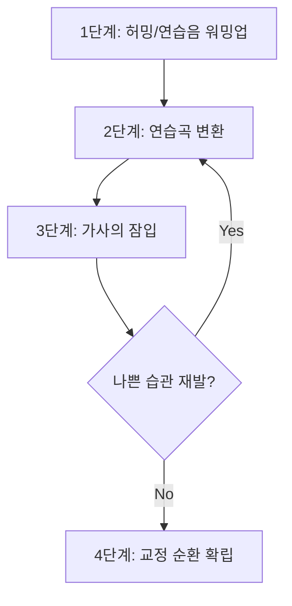

# 보컬 및 현대무용의 신경운동학적 체화 및 습관 교정 체계

> **핵심 명제**: 단순한 반복 훈련이 아닌, 신경가소성 기반의 과학적 체화 전략

---

## 1. 서론: 신경가소성과 수초화 기반의 단기 체화 메커니즘

### 체화의 본질

공연 예술의 복잡한 물리적 이론을 신체에 빠르게 체화하고 고착된 나쁜 습관을 단기간에 교정하는 과정은:
- ❌ 단순한 근력 강화나 기계적 반복의 영역이 아님
- ✅ **신경가소성(Neuroplasticity)** 기반의 뇌 신경망 재구축 과정
- ✅ 철저하게 통제된 **인지적 전략**이 요구되는 신경학적 작업

### 뇌의 운동 제어 시스템

| 뇌 영역 | 주요 기능 | 예술적 역할 |
|---------|----------|------------|
| **운동 피질** (Motor cortex) | 자발적 움직임 계획, 제어, 실행 | 발성/움직임의 의도적 통제 |
| **체성감각 피질** (Somatosensory cortex) | 눈-손 협응, 미세 운동 제어 | 정교한 발성 기관/신체 분절 조정 |
| **기저핵** (Basal ganglia) | 움직임의 부드러운 조정, 습관 형성 | 자동화된 근육 기억 구축 |
| **소뇌** (Cerebellum) | 뇌-척수 정보 통합, 정교한 운동 기획 | 기술적 완성도의 생물학적 기반 |

### 수초화(Myelination): 근육 기억의 실체

> [!important] 수초화의 핵심 메커니즘
> - **수초(Myelin)**: 신경 세포 축삭을 둘러싼 절연 물질
> - **효과**: 신경 신호 전달 속도를 최대 **100배** 증가
> - **결과**: 의식적 노력 없이 자동적 수행 가능한 **자동성(Automaticity)** 획득

#### 수초화의 양면성

**✅ 긍정적 측면**
- 올바른 발성/동작 반복 → 효율적 신경망 강화
- 무의식적 자동 수행 가능

**⚠️ 위험한 측면**
- 뇌는 좋은 습관과 나쁜 습관을 구분하지 못함
- 잘못된 자세/긴장 반복 → 나쁜 습관의 고착화
- 평균 **66일**이면 습관이 신경학적으로 자동화됨

### 단기 체화 전략의 필요성

> 맹목적 반복이 아닌, 기존 잘못된 신경 회로 억제 + 새로운 감각-운동 신경망 구축

---

## 2. 의도적 연습(Deliberate Practice)을 통한 훈련의 구조적 재편

### 핵심 명제

> **"단순한 연습은 영구적인 습관을 만들지만,
> 오직 완벽한 연습만이 완벽함을 만든다."**
> — Anders Ericsson

### 일반적 연습 vs 의도적 연습

| 구분 | 일반적 연습 | 의도적 연습 | 신경운동학적 효과 |
|------|------------|------------|------------------|
| **목표 설정** | 명확한 목표 없이 전체 루틴 반복 | 매 세션마다 미세하고 구체적인 단기 목표 | 운동 피질의 집중 활성화 인지 자원의 효율적 배분 |
| **속도 통제** | 원래 템포 또는 빠른 템포로 수행 | 오류 감지 가능하도록 **극단적으로 느린 템포** 유지 | 신경망 오작동 차단 정확한 수초화 경로 확보 |
| **피드백** | 주관적 느낌에 의존 | 녹음/녹화를 통한 즉각적·객관적 외부 피드백 | 뇌의 예측 오류 수정 감각 보정 |
| **한계 극복** | 편안한 영역(Comfort zone) 내 반복 | 자신의 한계점을 살짝 상회하는 도전적 과제 수행 | 신경가소성 자극 시냅스 결합력 강화 |

### 극단적 청킹(Extreme Chunking)

> [!tip] 단기 체화의 핵심 기술
> 복잡한 수행 과정을 아주 작은 단위로 분해하여 정복

#### 보컬 훈련 적용

- ❌ 전체 곡을 처음부터 끝까지 반복 → 나쁜 습관 강화
- ✅ **한 프레이즈, 한 마디, 단 하나의 음정 도약 구간**만을 분리
- ✅ 완벽한 호흡 서포트와 발음 기관 통제가 이루어질 때까지 반복

#### 무용 훈련 적용

- ❌ 복잡한 안무 전체 반복
- ✅ **프리퍼레이션(Preparation), 중심 이동의 순간** 등 미세한 움직임을 블록 단위로 분할
- ✅ 속도를 극단적으로 늦춰 연습

**효과**: 학습자가 오류를 실시간 인지하고 정확한 근육 신경망을 활성화할 **인지적 여유** 확보

### 분산 연습(Spaced Practice)의 원리

| 연습 방식 | 설명 | 효과 |
|----------|------|------|
| **집중 연습** (Massed practice) | 같은 동작을 한 번에 장시간 반복 | 단기 성과 향상 하지만 장기 정착 불리 |
| **분산 연습** (Distributed practice) | 짧은 시간 집중 + 주기적 휴식 하루 여러 번 나누어 연습 | 뇌 인지 과부하 방지 **기억 응고화** 촉진 |

#### 실천 가이드

- 집중력 한계: 최대 1시간
- 세션을 짧게 구성
- 연습 직후: 명상 또는 짧은 낮잠 (10~30분)
- 밤: 깊은 수면 확보 (7~10시간)

> **새롭게 학습된 신경망의 물리적 구조 개편은 휴식 중에 완성됨**

---

## 3. 나쁜 습관의 해체: 인지적 억제와 우회 신경망 구축

### 기본 원리

오랜 기간 굳어진 나쁜 습관 = 두꺼운 수초화를 거친 강력한 신경망

- ❌ 직접 수정 시도 → 뇌와 신체의 강한 저항
- ✅ 잘못된 패턴 발현 자체를 **인지적으로 차단·우회**

---

### 3.1. 알렉산더 테크닉: 억제와 지시

#### 목적 지향(End-gaining)의 오류

많은 예술가들이 빠지는 함정:
- 목표에만 집착
- 목표 달성에 필요한 신체적 수단 무시

#### 억제(Inhibition)

**효과**:
- 고음 시 목을 과도하게 내미는 습관 차단
- 무용 중 긴장으로 어깨를 들어올리는 습관 원천 차단
- 전두엽의 의식적 개입 허용

#### 지시(Direction)

억제를 통해 중립 상태 도달 → 긴장 없이 새로운 움직임 시작

**5가지 기본 방향성**:
1. 목이 자유로워지고
2. 머리가 앞과 위로 향하며
3. 척추가 길어지고
4. 다리가 골반에서 분리되며
5. 어깨가 넓어진다

#### 건설적 휴식(Constructive Rest) - 필수 일과

**자세**: 반듯이 누운 자세(Semi-supine)
- 무릎을 세우고
- 머리 아래 책을 받침
- 등을 대고 누움

**시간**: 매일 10~20분

| 단계 | 인지 작업 내용 | 신경학적 목적 |
|------|---------------|--------------|
| 1 | **통합적 신체 인식** | 촉각·압력 감지 + 고유수용성 감각 결합 뼈의 상대적 위치와 신체 비대칭성 인지 |
| 2 | **근육의 자유로움** | '아래로 당기는 힘' 인지 후 의도적 지시로 수축 패턴 해제 |
| 3 | **호흡 재조정** | 24개 갈비뼈의 자유로운 팽창 복벽·골반 기저근의 긴장 없는 반동 |
| 4 | **정확한 신체 지도** | 골격·해부학적 구조에 대한 내적 신체 지도를 현실과 일치 |
| 5 | **공간-시간 관계** | 내향적 인지 + 주변 환경 동시 인지 → 무대 위 공간 압박감 해소 |

---

### 3.2. 보컬: IVTOM 프레임워크를 통한 근육 기억 우회

#### 점진적 교정 프로토콜 (4단계)

**1단계: 허밍 및 연습음 기반 워밍업**
- 발음 배제, 허밍·입술 떨기(Lip trill)·특정 모음만 사용
- 뇌가 올바른 발성의 '느낌'을 경계심 없이 수용

**2단계: 곡의 구조적 분해와 연습곡 변환**
- 가사 전면 배제
- 편안한 발음('Nay Nay' 또는 'Mah Mah')만으로 멜로디
- 후두의 안정된 균형감 유지 훈련

**3단계: 가사의 잠입(Sneaking in words)**
- 연습음으로 멜로디가 완벽히 안정된 후
- 신체 감각을 흐트리지 않으면서 진짜 가사를 조심스럽게 대입

**4단계: 교정의 순환 고리**
- 가사 투입 시 나쁜 습관 재발 → 즉시 2단계로 회귀
- 올바른 감각 복구

> [!warning] 좋은 어색함(Good weird)
> 새롭게 도입된 올바른 발성은 초기에 매우 어색함
> → 인지적 인내를 바탕으로 한 의식적 반복
> → 두터운 수초화 형성
> → **'새로운 정상(New normal)'**으로 확립

---

### 3.3. 현대무용: 가가(Gaga) 움직임 언어

**창안자**: 오하드 나하린(Ohad Naharin)
**목적**: 기존 무용수의 미학적 강박과 기계적 습관 파괴

#### 핵심 원리

**❌ 금지 사항**:
- 거울 보며 시각적 형태에 의존하여 춤추기

**✅ 집중 대상**:
- 내부의 체성 감각(Somatic experience)
- 강렬한 상상력

#### 쾌락 기반 철학

- ❌ 고통 감내하며 관절·인대 혹사 (고전적 훈련)
- ✅ **즐거움(Pleasure)**이라는 감각적 피드백에 집중

**효과**:
- 부상 방지
- 뇌의 보상 회로 강력 자극 → 나쁜 습관 신속 해체

#### 독자적 상상 언어(Imagery Vocabulary)

| 용어 | 설명 | 효과 |
|------|------|------|
| **Biba** | 좌골에서 몸을 길게 당겨내는 감각 | 기존 움직임 예측 경로 교란 → 과거 신경 회로 우회 |
| **Float** | 중력을 묵직하게 인지하면서도 공간을 부유하는 감각 | 신체 내부 잠재 폭발력과 텍스처 섬세함 동시 각성 |

---

## 4. 코어 앵커링과 그라운딩: 발성과 움직임의 생체역학적 교차점

### 공통 원리

**보컬 발성 = 현대무용 움직임**
- 중력 저항
- 신체 물리적 중심(Core)에서 운동 에너지 발생
- 사지(Distal)와 후두(Larynx)로 흔들림 없이 전달

→ 고도의 **전신 생체역학 시스템**

---

### 4.1. 에스틸 발성법(EVTS): 앵커링

#### 앵커링의 개념

큰 강력한 근육들을 활성화 → 미세하고 연약한 성대 주변 근육의 작업 부하 경감

#### 머리와 목 앵커링

**활성화 근육**:
- 흉쇄유돌근(Sternocleidomastoid)
- 안면 여러 근육

**상상 기법**:
- 콧방울 벌리기
- 귀 들어올리기
- 목 뒤쪽 늘리기
- 사과 베어물기

**효과**:
- 후두를 위로 끌어올리는 나쁜 습관 억제
- 발성 기관 과도한 부하 감소

#### 몸통 앵커링

**활성화 근육**:
- 복근
- 광배근
- 승모근

**적용 상황**:
- 오페라 가창
- 벨팅(Belting) 창법

**효과**:
- 성대 주변 조임(Constriction) 방지
- 소리에 강력한 에너지 부여

---

### 4.2. 무용: 바르테니에프 원리와 그라운딩

#### 바르테니에프 기본 원리(Bartenieff Fundamentals)

**기반**: 유아의 발달 과정에서 나타나는 원초적 신경 운동 패턴 재학습

**핵심 패턴**:

**1. 코어-말단(Core/Distal) 패턴**
- 바닥에 누워 팔다리를 중심부로 당김
- 별 모양(X 모양)으로 동시 팽창
- 호흡근과 코어 근육의 완벽한 동기화

**2. 신체 반분(Body Half) 훈련**
- 좌우 신체의 독립성
- 관절 마찰·과부하 감소
- 움직임의 부드러운 전이

#### 그라운딩 훈련 기법

**실천 방법**:
- 벽 밀기
- 저항 밴드 사용
- 발바닥에서 올라오는 작용-반작용의 힘 인지

**적용 테크닉**:
- 마사 그레이엄: 수축과 이완(Contraction and Release)
- 호세 리몬: 낙하와 회복(Fall and Recovery)
- 릴리즈 테크닉: 뼈가 바닥에 물처럼 쏟아지는 질감

**결과**: 체중을 중력에 맡기고 척추의 나선형 회전 동력 이용 → 최소 에너지로 최대 움직임 창출

### 통합 효과 비교표

| 특성 | 보컬 (앵커링) | 무용 (그라운딩) | 생체역학적 통합 효과 |
|------|-------------|---------------|-------------------|
| **물리적 목적** | 성대·후두 주변 불필요한 긴장 제거 | 관절 부하 축소 중력을 능동적으로 활용 | 국소 근육 피로도 감소 대근육 지지력 강화 |
| **활성화 근육** | 승모근, 광배근 흉쇄유돌근 복부 코어 | 골반 기저근, 둔근 복부 코어 하체 지지근 | 체간(Torso) 안정성 확보 → 사지/후두 가동범위 극대화 |
| **에너지 방향성** | 하부로 누르는 지지력 + 두부로 확장되는 공명 | 바닥으로의 깊은 체중 하강 + 척추를 타고 오르는 확장 | 뉴턴 작용-반작용 법칙 운동 에너지의 수직/수평 증폭 |

---

## 5. 움직임의 최적화: 라반 움직임 분석(LMA)

**창안자**: 루돌프 폰 라반(Rudolf von Laban)

### 4가지 모션 팩터(Motion Factors)

| 요소 | 스펙트럼 | 예술적 적용 |
|------|---------|------------|
| **시간**(Time) | 빠름 ↔ 느림 | 프레이징의 템포 조절 |
| **무게**(Weight) | 무거움 ↔ 가벼움 | 소리/움직임의 강약 |
| **공간**(Space) | 직접적 ↔ 간접적 | 움직임의 경로, 발성의 지향성 |
| **흐름**(Flow) | 구속됨 ↔ 자유로움 | 긴장도와 유연성 |

### 활용 방법

1. 각 요소의 극단적 스펙트럼을 의식적으로 조합
2. 8가지 '에포트 액션(Effort actions)' 생성
3. 보컬의 강약 조절·무용의 질감 변화에 대입

**효과**:
- 기술적 단조로움 탈피
- 입체적 퍼포먼스 완성
- 무대 위 긴장 상황에서 미리 설계된 공간감·흐름 스위치 활성화

---

## 6. 불필요한 긴장 해소: 상호 억제(Reciprocal Inhibition)

### 기본 원리

- 근육은 항상 **주동근(Prime mover)** + **길항근(Antagonist)** 쌍으로 작용
- 한쪽 강력 수축 → 반대편 자연스럽게 이완
- 이 신경학적 특성 활용 → 병리적 긴장 패턴 신속 해소

---

### 6.1. 구강·혀·턱의 과긴장 해소

#### 문제점

- 안면·목 근육 과긴장 → 근막(Fascia)을 타고 전신으로 전파
- 척추·코어 유연성 저해
- 턱관절(TMJ)·혀뿌리(Tongue root) 긴장 → 후두 압박 + 공명 공간 축소

#### 해소 프로토콜

**1. 혀 긴장의 인지적 억제**

**훈련 방법**:
- 자음·모음 교차 발음 (T ↔ K, 전설모음 ↔ 후설모음)
- 혀를 둥글게 말아 목젖(Uvula) 쪽으로 향하게 하는 스트레칭
- 혀끝을 거즈로 감싸 잡고 구강 밖으로 뺀 상태에서 'Ah' 발성

**효과**: 고음 시 혀가 뒤로 말려 기도를 좁히는 무의식적 보상 작용 차단

**2. 수기 요법과 보조 도구**

**도구**:
- 영유아용 구강 브러시(Nuk Brush)
- 거울 상자 치료(Mirror Book Therapy)

**효과**:
- 저작근·측두근·익돌근 강직 이완
- 턱관절 가동 범위 즉시 확보
- 거울 뉴런 통해 안면 근육 불균형 조정

**3. 하품-한숨(Yawn-Sigh) 및 허밍**

**기법**:
- 하품하듯 깊게 들이마시기
- 편안한 한숨으로 내쉬기
- 가벼운 'Mmm' 허밍
- 입술 떨기(Lip trills)
- 빨대 발성(Straw Exercises - SOVT의 일환)

**효과**:
- 인두강 열림, 후두 자연스럽게 하강
- 성문 상압 조절 → 성대 접촉 효율성 극대화
- 비강·안면 전면부 공명 진동 감각 활성화

---

### 6.2. 원초적 소리와 가성대 제어

#### 원초적 소리(Primal Sound) - 재니스 채프먼(Janice Chapman)

**개념**:
- ❌ 인위적 호흡법 강요
- ❌ 억지로 지지대(Support) 형성
- ✅ 생존 본능에 의한 **무의식적·반사적 소리** 활용

**예시**:
- 깊은 탄식
- 놀람의 흡기
- 진심 어린 웃음
- 아기의 우는 소리

**효과**:
- 감정 운동 시스템(Emotional Motor System) 즉각 활성화
- 인위적 생각 개입 없이 하부 호흡근·복벽의 올바른 반동 작용 자동 구축

#### 가성대 후퇴(False Vocal Fold Retraction)

**가성대(False Vocal Folds)**:
- 진성대 상단에 위치
- 원래 기능: 무거운 물건 들거나 배변 시 흉강 압력 높이기 위해 숨 참기

**문제 상황**:
- 무용의 고난도 점프
- 보컬의 고음
- → 무의식적으로 숨 참기 → 가성대가 진성대 조임

**해결책**:
- 침묵 속에서 미소 짓기
- 깊은 하품의 초기 감각 떠올리기
- → 가성대 개방(후퇴)

**효과**:
- 진성대 불필요한 마찰 획기적 감소
- 투명하고 건강한 발성

#### 무용 적용: 진공 호흡(Vacuum Breath)

**기법**:
- 바닥으로 체중 깊이 떨어뜨릴 때
- 내쉬는 숨에 "Ffff" 마찰음
- 복강을 완전히 비워냄

**효과**:
- 하부 갈비뼈의 유연한 팽창
- 횡격막의 깊은 이완
- 등뼈·골반 운동 범위 급격 향상

---

## 7. 인지적 시연(Mental Rehearsal)과 시각화

### 기본 원리

> [!important] 뇌과학의 핵심 발견
> 특정 동작/프레이징을 **머릿속으로 생생하게 상상**할 때
> = 실제 동작 수행 시와 **거의 동일한 운동 피질 및 신경 회로 활성화**

→ 신체 피로의 한계를 극복하는 훈련 시간 확장

---

### 7.1. 다감각적 통합 시각화

#### 관념운동적 훈련(Ideomotoric Training)

단순 암기가 아닌, **모든 감각 정보를 입체적으로 구현**:
- 시각
- 청각
- 촉각
- 고유수용성 감각

#### 보컬 적용

**실천 방법**:
1. 소리 내기 전 완벽한 피치·음색 마음속으로 미리 듣기 (내적 오디에이션, Audiation)
2. 그 소리가 터져 나올 때 안면·흉부의 공명감 상상
3. 복부의 호흡 압력을 세포 단위로 생생하게 느끼기

#### 무용 적용

**1인칭 내적 시점(Internal perspective)**:
- 자신의 눈을 통해 무대 바닥의 재질 인지
- 파트너와의 거리 체감

**3인칭 외적 시점(External observation)**:
- 드론 시점처럼 객석에서 자신을 관찰
- 완벽한 턴 아웃 각도
- 뻗어 나가는 팔의 선(Extension) 감상

**효과**:
- 두 시점을 자유자재로 교차

### 효과

**특히 유용한 상황**:
- 신체 피로도 도달
- 부상으로 실제 움직임 불가능한 재활 단계

**성과**:
- 신경근 연결망 보존·강화
- 최대 **15%** 실질적 운동 수행 능력 향상

---

### 7.2. 에빙하우스 망각 곡선 중단

**문제**: 레슨 후 하루 지나면 **약 70% 이상** 정보 소실

**해결책**:

> **강력한 인지적 복습 전략**

---

## 8. 몰입 상태(Flow State)로의 진입

### 몰입의 조건

**균형점**:
- 현재 기량(Skill level)
- 눈앞 과제의 난이도(Challenge level)

→ 완벽한 균형 시 발현

### 몰입 상태의 특징

**해방**:
- 자아에 대한 강박
- 타인의 시선에 대한 두려움
- 완벽해야 한다는 자기 검열(Self-consciousness)

**융화**:
- 음악의 선율
- 움직임의 질감 그 자체

### 신경생리학적 변화

**교감신경계(Sympathetic nervous system)**:
- ✅ 적절한 흥분 (심박수 증가, 가벼운 발한)

**부교감신경계(Parasympathetic nervous system)**:
- ⬇️ 활동 억제

**결과**:
- 극도의 각성
- 신체적 집중력 유지
- ❌ 파괴적 긴장 (무대 공포, 관절 굳어짐)
- ✅ 폭발적 에너지 즉시 발산 준비 완료

### 기술에서 예술로의 전이

**스토리텔링 단계**:

1. 기술의 기계적 체화 완료
2. 내면 깊은 정서를 끌어올림
3. 무빙 바디·보컬 라인에 투사

**구체적 실천**:
- 곡의 가사·안무의 캐릭터 감정적 궤적(Emotional arc)에 공감
- 내면의 극적 서사가 다음을 주도하도록 허용:
  - 성대의 긴장도
  - 보컬의 미세한 다이내믹스 변화
  - 움직임에 수반되는 호흡의 질감

> [!note] 테크닉의 역할
> 테크닉 숙달 ≠ 예술의 최종 목적
> 테크닉 = 예술적 표현을 온전하고 상해 없이 드러내기 위한
> **든든한 신체적 수단이자 보이지 않는 지지대**

---

## 9. 부상 방지와 교차 훈련(Cross-Training)

### 필요성

보컬·무용 = 특정 부위만 편향적으로 사용
- → 근골격계 불균형
- → 오버트레이닝 부상 위험

### 교차 훈련 전략

#### 1. 근력 강화와 과가동성(Hypermobility) 통제

**문제**: 무용수·유연성 강조 아티스트의 과가동성
- 인대·관절 과도하게 늘어남
- 체중 이동·점프 시 관절 연골 손상 축적

**해결책**:
- ❌ "근육이 비대해질 것"이라는 낡은 미신 버리기
- ✅ 요가, 필라테스, 체계적 역도(Weightlifting) 병행
- ✅ 흔들리는 관절을 붙잡을 구조적 코어 근력 양성

#### 2. PBT(Progressing Ballet Technique) 접목

**도구**:
- 짐볼(Fit ball)
- 탄성 밴드

**훈련**:
- 흔들리는 짐볼 위에서 몸통 밸런스 유지
- 팔다리 통제

**효과**:
- 뇌의 고유수용성 감각 신경 날카롭게 깨움
- 코어 활성화 일상화
- 움직임의 군더더기 제거
- 부상 발생률 급격 감소

---

## 10. 결론: 단기 체화를 위한 통합 마스터 프로토콜

### 5단계 통합 훈련 시스템

| 단계 | 수행 지침 | 신경학적·생리학적 목표 |
|------|----------|----------------------|
| **1단계: 초기화 및 인지적 억제** | • 15분간 알렉산더 건설적 휴식 • 턱관절·혀 수기 마사지 • 하품-한숨 연습 | • 척추·신체 지도 영점 조절 • 교감신경계 안정화 • 구강/안면부 불필요한 근육 개입 차단 |
| **2단계: 코어 앵커링과 그라운딩** | • 바르테니에프 코어/디스탈 바닥 훈련 • 릴리즈 테크닉의 수직/수평 체중 이동 • 에스틸 앵커링 근육 활성화 | • 대근육으로 하중 전이 → 후두·관절 부하 극소화 • 고유수용성 감각 극대화 |
| **3단계: 극단적 청킹과 의도적 연습** | • 전체 루틴 반복 금지 • 가장 취약한 마디/동작만 극단적으로 느린 속도로 • 객관적 영상/음성 녹화 피드백 필수 | • 인지 과부하 방지 • 오류 실시간 수정 • 운동 피질의 정확한 시냅스 결합 유도 |
| **4단계: 우회 신경망 훈련 및 원초적 감각 전이** | • 복잡한 가사 대신 허밍/입술 떨기 • 가가의 쾌락 기반 상상 언어 • 채프먼의 원초적 소리 활용 | • 가성대 개방 유도 • 뇌의 기존 습관 저항 회피 • 자율신경계 내 감정 운동 시스템 반사 활용 |
| **5단계: 정신적 시연 및 휴식** | • 훈련 직후 및 취침 전 다감각적 1인칭/3인칭 시각화 복습 • 분산 연습 채택 • 양질의 수면 확보 | • 에빙하우스 망각 곡선 중단 • 뇌의 수초화 가속 • 단기 기억 → 영구적 근육 기억 전환 |

### 최종 원칙

> [!success] 단기 체화의 핵심
> 1. **의식적 차원**에서 프로토콜 준수
> 2. **뇌의 구조적 재편성**(수초화) 최대 가속
> 3. **오염된 근육 기억** 빠르게 우회 수정
>
> → 보컬 발성과 현대무용이 요구하는
> **고도의 신체 조절 능력 + 폭발적 예술적 표현력**을
> **가장 단기간 내에, 부상 없이 완벽하게 체화**

---

## 참고 개념

### 주요 용어 정리

- **신경가소성(Neuroplasticity)**: 뇌 신경망의 근본적 재구축 능력
- **수초화(Myelination)**: 신경 축삭 절연으로 신호 전달 속도 100배 증가
- **자동성(Automaticity)**: 의식적 노력 없이 자동적으로 수행 가능한 상태
- **의도적 연습(Deliberate Practice)**: 구체적 목표, 집중, 피드백을 동반한 구조화된 연습
- **극단적 청킹(Extreme Chunking)**: 복잡한 과제를 아주 작은 단위로 분해하여 정복
- **분산 연습(Spaced Practice)**: 짧은 세션을 긴 시간에 걸쳐 분산
- **억제(Inhibition)**: 자동화된 반응 대신 의식적으로 멈추는 과정
- **지시(Direction)**: 긴장 없이 새로운 움직임을 시작하도록 인지적 명령
- **앵커링(Anchoring)**: 큰 근육 활성화로 작은 근육의 부하 경감
- **그라운딩(Grounding)**: 중력을 능동적으로 활용한 신체 안정화
- **원초적 소리(Primal Sound)**: 생존 본능에 의한 무의식적·반사적 소리
- **가성대 후퇴(False Vocal Fold Retraction)**: 가성대 개방으로 진성대 마찰 감소
- **정신적 시연(Mental Rehearsal)**: 머릿속으로 동작을 생생하게 상상하는 훈련
- **몰입 상태(Flow State)**: 기량과 과제 난이도의 완벽한 균형 시 발현되는 최적 집중 상태

---

*본 연구는 신경과학, 생체역학, 인지심리학, 소매틱 요법을 융합하여
단기간 기술 체화를 위한 가장 효과적인 연습 방법론을 제시합니다.*
