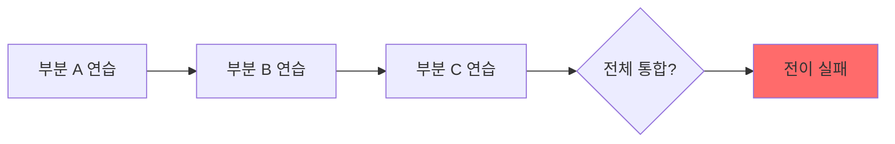
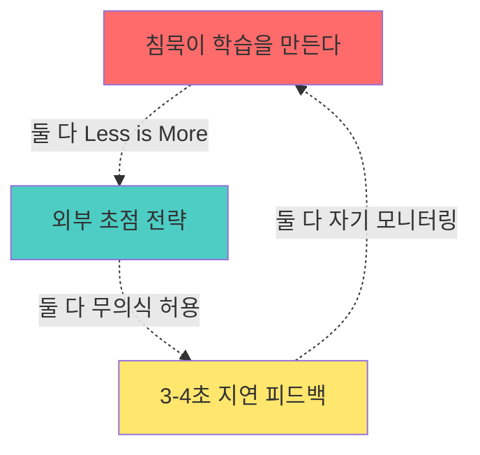

# 운동학습 마스터 종합노트: 과학적 실력 향상의 모든 것

## 📌 이 노트에 대하여

이 노트는 `/Users/aera/Desktop/Base_/Yt-to-Note` 디렉토리의 **16개 모든 노트**의 핵심 내용을 통합한 마스터 레퍼런스입니다. 운동학습(Motor Learning) 이론, 신경과학, 보컬 트레이닝, 교수법을 망라합니다.

**통합된 노트 목록:**
1. 운동학습1-연습-이론.md
2. 운동학습2-노래방연습.md
3. 운동학습3-발성이론-경계.md
4. 운동학습4-놓으면안되는것.md
5. 운동학습5-자연스러운발성.md
6. 운동학습6-부분연습-전체연습.md
7. 운동학습7-동기부여.md
8. 운동학습8-지식의저주.md
9. 운동학습-효율적지도.md
10. 침묵이 학습을 만든다.md
11. 왜 전문가 피드백이 필수인가.md
12. 분산 연습의 과학.md
13. 외부 초점 전략.md
14. 보컬-무용-신경운동학적-체화-연구.md
15. 인지과학-기술획득-연습방법론-연구.md

---

## 🎯 목차

1. [[#운동학습의 기초|운동학습의 기초: 정의와 원리]]
2. [[#연습의 과학|연습의 과학: 어떻게 연습할 것인가]]
3. [[#주의와 초점|주의와 초점: 무엇에 집중할 것인가]]
4. [[#피드백 원리|피드백 원리: 언제 무엇을 말할 것인가]]
5. [[#신경과학 기반|신경과학 기반: 뇌에서 무슨 일이 일어나는가]]
6. [[#교수법 전략|교수법 전략: 어떻게 가르칠 것인가]]
7. [[#동기와 지속|동기와 지속: 어떻게 계속할 것인가]]
8. [[#보컬 특화|보컬 특화 적용: 발성 트레이닝]]
9. [[#실천 체크리스트|실천 체크리스트]]

---

## 1. 운동학습의 기초

### 1.1 운동학습의 정의

**Motor Learning (운동학습)**
> "숙련된 수행을 위한 역량을 비교적 영구적으로 획득하기 위한 연습"

**핵심 구분:**
- **Capability (역량)**: 실제 실력
- **Performance (수행)**: 당장 보이는 결과

→ **"즉각적인 성과를 높이는 것들이 실제로는 장기 학습을 해친다"** (침묵이 학습을 만든다.md)

### 1.2 Fitts & Posner의 3단계 모델

| 단계 | 특징 | 초점 |
|------|------|------|
| **인지 단계** | 동작 이해, 많은 오류 | 무엇을 할지 이해 |
| **연합 단계** | 오류 감소, 일관성 증가 | 어떻게 할지 연결 |
| **자동화 단계** | 의식 없이 수행 가능 | 주의 자원 해방 |

### 1.3 연습 vs 수행의 분리

**Bernstein의 명언:**
> "연습은 단순한 반복이 아니라 특별한 방식의 반복"

**두 단계 분리 필수:**
1. **연습 단계**: 새로운 패턴 학습, 실험, 실수 허용
2. **평가 단계**: 학습한 것을 자연스럽게 발휘

→ 노래방 연습이 실력 향상에 실패하는 이유: 평가만 하고 연습은 안 함

---

## 2. 연습의 과학

### 2.1 의도적 연습 (Deliberate Practice)

**Ericsson의 정의 (인지과학-기술획득-연습방법론-연구.md):**
- 명확한 목표
- 집중적 노력
- 즉각적 피드백
- 반복과 수정
- 불편한 영역에서의 연습

**핵심:** "편안한 연습 = 성장 없음"

### 2.2 분산 연습 > 집중 연습

**Distributed Practice vs Massed Practice (분산 연습의 과학.md):**

| 비교 | 집중 연습 | 분산 연습 |
|------|----------|----------|
| 방법 | 7시간 한 번에 | 1시간씩 7일 |
| 효율 | 낮음 | 높음 |
| 단기 성과 | 높음 | 중간 |
| 장기 정착 | 낮음 | **높음** |

**이유:** 학습은 연습할 때가 아닌 **휴식할 때** 일어남
- 잘못된 정보 망각
- 정보 정돈 (Consolidation)
- 새 효율적 움직임 생성

**경험적 지혜:** "한숨 자면 내일 된다"

**예외:** 시험/오디션 1주일 전 → 절대 시간 우선

### 2.3 부분 연습 vs 전체 연습

**Part Practice의 위험 (운동학습6-부분연습-전체연습.md):**



**전이 조건:** **Temporal Continuity (시간적 연속성)** 필수
- 노래의 A구간만 연습 → B구간으로 전이 안 됨
- 전체 흐름 속에서 연습해야 전이 성공

**추천:** 전체를 느리게 → 점진적 속도 증가

### 2.4 Blocked vs Interleaved Practice

**인지과학-기술획득-연습방법론-연구.md:**

| Blocked Practice | Interleaved Practice |
|------------------|---------------------|
| A-A-A-A → B-B-B-B | A-B-C-A-C-B-A-B-C |
| 단기 수행 ↑ | 단기 수행 ↓ |
| 장기 정착 ↓ | **장기 정착 ↑↑** |

**메커니즘:**
- Interleaving → 인출 연습 강제 → 맥락 간섭 → 깊은 처리
- Blocked → 단기 기억 의존 → 얕은 처리

### 2.5 Challenge Point Framework

**최적 난이도 = 개인 능력 + 과제 난이도 조합**

```
너무 쉬움 ←→ [최적 도전점] ←→ 너무 어려움
   (지루함)     (몰입/학습)      (좌절)
```

**Vygotsky의 ZPD (Zone of Proximal Development):**
- 현재 수준: 혼자 할 수 있는 것
- ZPD: 도움 받으면 할 수 있는 것 (← 여기서 학습 발생)
- 도달 불가: 도움 받아도 못 하는 것

---

## 3. 주의와 초점

### 3.1 내부 초점 vs 외부 초점

**Wulf의 연구 (운동학습3-발성이론-경계.md, 외부 초점 전략.md):**

**내부 초점 (Internal Focus):**
- 신체 부위나 움직임 자체에 집중
- 예: "성대를 가볍게 붙여라", "횡격막을 내려라"
- **문제:** 자동화된 운동 제어를 의식이 방해 → 수행 저하

**외부 초점 (External Focus):**
- 움직임의 결과나 효과에 집중
- 예: "목소리가 멀리 나간다고 상상해라", "머리가 천장에 매달렸다고 생각해라"
- **효과:** 무의식적 운동 제어 허용 → 수행 향상

### 3.2 구체적 외부 초점 전략 (외부 초점 전략.md)

| 요소 | 내부 초점 ✗ | 외부 초점 ✓ |
|------|------------|------------|
| **자세** | 어깨 펴고 가슴 펴라 | 머리가 천장에 매달려 있다고 생각해라 |
| **들숨** | 횡격막을 내려라 | 숨 들이쉴 때 소리가 나지 않게 해라 |
| **날숨** | 배에 힘을 줘라 | 헬스장 벨트의 압박감을 느껴라 |
| **후두** | 후두를 내려라 | 음이 올라갈수록 몸이 눕는다고 상상해라 |
| **혀** | 혀끝을 아랫니에, 중간은 높게 | 이(ㅣ) 모음으로 숨 쉬고 발성해라 |
| **턱** | 턱에 힘을 빼라 | 턱이 무겁다고 상상해라 |

**Rapford 박사의 경고:**
> "어떤 기관이든지 그 구조물을 직접 언급하면 그곳에 힘이 들어가게 된다"

**메조소프라노 Rice의 고백:**
> "나는 후두에 대해 모를 때 노래를 더 잘했던 것 같아요"

### 3.3 주의 용량의 한계

**MP (Mental Points) 개념 (운동학습5-자연스러운발성.md):**

인간의 주의 용량은 **제한적**:
- 동시에 2-3개 요소만 의식 가능
- 4개 이상 → 과부하 → 수행 붕괴

**해결책: Chunking (덩어리화)**
- 개별 동작들을 하나의 덩어리로 묶음
- 예: C-H-O-R-D → "CHORD" (5개 글자 → 1개 단어)

**실천:** Single-Element Practice
- 한 번에 하나만 연습
- 자동화 달성 후 다음 요소 추가

### 3.4 자동화의 역설

**"자연스러운 발성" = 목 조임 (운동학습5):**
- 아기는 울 때 목에 힘을 준다
- "자연스럽게" = 나쁜 습관이 자동화된 상태
- **목표:** 좋은 습관의 자동화

**자동화 달성 신호:**
- Dual-task 수행 가능 (노래하면서 춤추기)
- 의식 없이 수행 가능
- 주의 자원 다른 곳에 사용 가능

---

## 4. 피드백 원리

### 4.1 침묵의 힘: Echoic Storage

**가장 중요한 발견 (침묵이 학습을 만든다.md):**

**Echoic Storage (반향 기억):**
- **지속 시간:** 2-4초
- **기능:** 방금 들은 소리를 임시 저장하여 비교/분석
- **vs Iconic Storage:** 시각은 250ms만 유지

**왜 침묵이 필수인가:**
1. 학생이 자신의 목소리를 듣는다 (0-2초)
2. Echoic storage에 저장 (2-4초)
3. **이 시점에 교사가 말하면?** → Masking effect 발생
4. 학생의 소리가 지워지고 교사의 말만 남음

**최적 피드백 타이밍:**
- **3-4초 지연** 후 피드백 > 즉각 피드백 (0ms)
- 지연 피드백이 장기 정착(retention)에서 월등히 우수

### 4.2 Efferent Copy (원심성 복사)

**운동 명령의 내부 복사본:**
1. 뇌가 근육에 명령 보냄
2. 동시에 그 명령의 **복사본**을 감각 영역에 전송
3. 예상되는 감각 결과 시뮬레이션
4. 실제 감각과 비교 → 오차 계산 → 다음 수정

**교사가 중간에 개입하면?**
- Efferent copy와 실제 감각 비교 불가능
- 오차 학습 실패
- 자기교정 능력 발달 저해

### 4.3 피드백 타이밍과 빈도

**지연 피드백의 장점 (운동학습4-놓으면안되는것.md):**

| 즉각 피드백 (0ms) | 지연 피드백 (3-5초) |
|------------------|-------------------|
| Acquisition ↑↑ | Acquisition ↓ |
| **Retention ↓** | **Retention ↑↑** |
| 의존성 생김 | 자율성 발달 |

**빈도:**
- 100% 피드백 < 50% 피드백 (장기 정착)
- Faded feedback: 초기 많이 → 점진적 감소

**질문 기법:** "How did that feel?"
- 학생의 자기 평가 유도
- 메타인지 발달
- 의존성 방지

### 4.4 Guidance의 함정

**Guidance Hypothesis:**
- 외부 안내(guidance)가 많을수록
- 단기 수행 ↑, 장기 정착 ↓
- 안내 제거 시 급격한 수행 저하

**예시:**
- 손 잡고 가르치기 → 손 놓으면 못함
- 물리적 도구 의존 → 도구 없으면 붕괴
- 과도한 verbal cue → 침묵 속에서 못함

---

## 5. 신경과학 기반

### 5.1 Myelination (수초화)

**보컬-무용-신경운동학적-체화-연구.md:**

**Myelin (미엘린, 수초):**
- 신경 섬유를 감싸는 지방 물질
- 전기 신호 전달 속도 **100배** 증가
- 반복 연습 → 미엘린 증가 → 신호 속도/정확도 향상

**"연습은 영구적이다":**
- 나쁜 습관도 미엘린화됨
- 잘못된 연습 = 잘못된 회로 강화
- **재학습 > 신규 학습** (기존 회로 약화 + 새 회로 강화 필요)

### 5.2 신경가소성 (Neuroplasticity)

**뇌는 변한다:**
- 회색질 밀도 변화 (음악가 vs 비음악가)
- 백질 미세구조 변화
- 피질 지도 재배치 (cortical remapping)

**핵심 영역:**
- **Motor Cortex (운동 피질):** 운동 명령 생성
- **Basal Ganglia (기저핵):** 운동 프로그램 저장, 선택
- **Cerebellum (소뇌):** 운동 정확도, 타이밍, 예측

### 5.3 Consolidation (통합/정착)

**인지과학-기술획득-연습방법론-연구.md:**

**수면의 역할:**
1. **System Consolidation:** 해마 → 피질로 전송
2. **Synaptic Consolidation:** 시냅스 강화/약화
3. **Offline Gains:** 연습 안 해도 실력 향상

**NSDR (Non-Sleep Deep Rest):**
- 명상, 요가 니드라, 얕은 수면
- 시냅스 재정비 촉진
- 뇌파 slow-wave 증가

**"한숨 자면 내일 된다"의 과학:**
- 휴식 중 잘못된 연결 약화
- 중요한 연결 강화
- 패턴 최적화

---

## 6. 교수법 전략

### 6.1 지식의 저주 (Curse of Knowledge)

**운동학습8-지식의저주.md:**

**문제:**
- 전문가의 뇌는 **Re-chunking** 됨
- 100개 단계 → 5개 덩어리로 압축
- 초보자는 100개를 다 거쳐야 함
- 전문가는 자기가 5개만 거쳤다고 착각

**Elizabeth Newton 실험:**
- Tapper는 50% 성공 예상
- 실제 Listener 성공률: 2.5%
- 전문가는 "당연한 것"이 초보자에겐 암호

**기억 왜곡:**
- 10년 걸린 것을 "2-3년"으로 기억
- 어려웠던 과정을 "쉬웠다"고 기억
- 초보자의 어려움 공감 불가

### 6.2 지식의 저주 해결책 5가지

| 전략 | 설명 | 예시 |
|------|------|------|
| **1. 세미 전문가 활용** | 1-2년 선배가 가르침 | 아직 어려움 생생히 기억 |
| **2. 전문 용어 회피** | 초보자 언어 사용 | "혼합 음역" → "목이 바뀌는 지점" |
| **3. 학생 관찰** | 실제 어디서 막히는지 관찰 | 추측 말고 데이터 수집 |
| **4. Rule of Three** | 세 가지 방법으로 설명 | 말, 시범, 비유 |
| **5. 기존 지식 연결** | 이미 아는 것에 빗대기 | 익숙한 노래로 설명 |

### 6.3 Scaffolding (비계 설정)

**운동학습-효율적지도.md:**

**Vygotsky의 ZPD 활용:**
1. 현재 수준 파악
2. 목표 수준 설정
3. 그 사이에 "사다리" 놓기
4. 한 계단씩 올라가며 사다리 제거

**구체적 전략:**
- 처음: 많은 지원 (시범, verbal cue, 물리적 도움)
- 중간: 점진적 감소 (hint만, 질문으로)
- 마지막: 완전 독립 (침묵, 관찰만)

### 6.4 Implicit Learning (암묵적 학습)

**보컬-무용-신경운동학적-체화-연구.md:**

**명시적 vs 암묵적:**
- **명시적:** "이렇게 해라" (규칙 전달)
- **암묵적:** 환경 조성, 자연스럽게 체득

**Alexander Technique의 Inhibition:**
- "하지 마라"가 아닌 "하지 않는 것을 허용하라"
- 불필요한 긴장이 자연스럽게 사라지게 유도

**Gaga Movement Language:**
- 해부학 용어 사용 금지
- 시적 이미지, 은유 사용
- "몸이 알아서 찾게" 유도

### 6.5 독학의 위험과 전문가 피드백

**왜 전문가 피드백이 필수인가.md:**

**3가지 필수 이유:**

**1. 개인차:**
- 같은 훈련이라도 사람마다 반응 다름
- 안전하다는 립트릴, 빨대발성도 예외 없음
- 실제 사례: 빨대발성 과다 → 발성 완전 붕괴

**2. 같은 소리 ≠ 같은 움직임:**
- 소리는 비슷해도 내부 움직임 천차만별
- 몸의 구조 다름 → 다른 방법 필요
- 예: 트랜스 소리 - 5명이 5가지 다른 방법 사용 가능

**3. 중단 시점 놓침:**
- 목적지 도달 후 계속하면 **반대로 넘어감**
- 성대 접촉 훈련 → 과도한 접촉
- 성대 풀기 훈련 → 완전히 벌어짐
- **3개월마다 확인 권장**

**피드백 요청 방법:**
- ✗ "잘하고 있나요?"
- ✓ "이 훈련을 [출처]에서 보고 [초점]을 맞춰 하고 있는데 잘 되고 있나요?"

---

## 7. 동기와 지속

### 7.1 동기부여 원리 (운동학습7-동기부여.md)

**왜 동기가 중요한가:**
- 신경 재배치(neural remodeling)는 **시간** 필요
- 6개월-1년의 지속적 연습
- 동기 없으면 중도 포기

### 7.2 교사의 동기부여 전략

**1. 강점에 초점:**
- 잘하는 것 먼저 언급
- 긍정적 피드백 → 자기효능감

**2. 난이도 조절:**
- 너무 쉬움 → 지루함
- 너무 어려움 → 좌절
- Challenge Point 유지

**3. Scaffolding:**
- 작은 성공 경험 축적
- "할 수 있다"는 믿음 형성

### 7.3 학생의 자기관리 전략

**1. 부정적 피드백 회피:**
- 자기비판 금지
- 실수 = 학습 기회

**2. 성공 경험 축적:**
- 작은 목표 달성
- 진전 기록

**3. 구체적 단기 목표:**
- "노래 잘하기" (X)
- "이번 주에 A 구간 완벽히" (O)

**4. 자기효능감:**
- "나는 할 수 있다"
- 과거 성공 회상

---

## 8. 보컬 특화 적용

### 8.1 Alexander Technique

**보컬-무용-신경운동학적-체화-연구.md:**

**두 가지 핵심 원리:**

**1. Inhibition (억제):**
- 자동 반응을 멈추는 능력
- 예: 고음 → 턱 올라감 (습관) → 멈춤

**2. Direction (지시):**
- 긴장 해제를 위한 mental instruction
- "목이 자유롭다", "척추가 길어진다"

**적용:**
- 노래 전 "멈춤" 순간 갖기
- 불필요한 긴장 인식
- 자연스러운 정렬 허용

### 8.2 Estill Voice Training

**신경운동학적 정밀 제어:**

**Anchoring (고정):**
- **Head & Neck Anchoring:** 후두 안정화
- **Torso Anchoring:** 호흡 지지

**13가지 구조 독립 제어:**
- True Vocal Folds
- False Vocal Folds
- Aryepiglottic Sphincter
- Larynx (vertical position)
- Cricoid Cartilage (tilt)
- Thyroid Cartilage (tilt)
- Velum
- Tongue
- Jaw
- Lips
- Head & Neck
- Torso
- Body

### 8.3 IVTOM Framework

**Imagery-based Vocal Technique for Overriding Muscle Memory:**

**3단계:**
1. **Sensory Awareness:** 현재 감각 인식
2. **Imagery Substitution:** 새로운 이미지로 대체
3. **Motor Pattern Override:** 근육 기억 우회

**예시:**
- 옛 근육 기억: "고음 = 목 조임"
- 새 이미지: "고음 = 소리가 머리 위로 떠오름"
- 결과: 근육 기억 우회하여 새 패턴 형성

### 8.4 Gaga Movement Language

**움직임 기반 체화 학습:**

**핵심 원칙:**
- 해부학 용어 금지
- 시적 언어, 은유 사용
- 즐거움과 호기심 유지

**보컬 적용:**
- "성대를 붙여라" → "소리가 내부에서 피어나는 느낌"
- "횡격막을 내려라" → "몸속에 공간이 넓어지는 상상"

### 8.5 Bartenieff Fundamentals

**Grounding (접지):**
- 발과 지면의 연결
- 중력과의 관계
- 아래로부터의 지지

**Spatial Intent (공간 의도):**
- 소리가 나아가는 방향
- 공간을 채우는 의도

---

## 9. 실천 체크리스트

### 9.1 학습자 체크리스트

**매 연습 전:**
- [ ] 구체적 목표 설정 (오늘 무엇을 개선할 것인가?)
- [ ] 한 가지 요소에만 집중 (Single-element practice)
- [ ] 외부 초점 설정 (소리/감각, 신체 부위 아님)

**연습 중:**
- [ ] 3-4초 침묵 유지 (자기 소리 듣기)
- [ ] 녹음하여 Efferent copy 검증
- [ ] 실수 = 학습 기회 (부정적 자기 피드백 금지)

**연습 후:**
- [ ] "어땠는가?" 자기 평가
- [ ] 무엇이 잘 됐는지 구체적으로 인식
- [ ] 내일 개선점 하나만 선택

**연습 계획:**
- [ ] 분산 연습 (1시간씩 7일 > 7시간 한 번)
- [ ] 충분한 휴식 (학습은 휴식 중 발생)
- [ ] 목 아프면 즉시 중단 (보상 작용 방지)

**장기 관리:**
- [ ] 3개월마다 전문가 피드백
- [ ] 구체적 질문 준비 (출처, 초점 명시)
- [ ] 진전 기록 (성공 경험 축적)

### 9.2 교사 체크리스트

**레슨 설계:**
- [ ] 학생 현재 수준 파악 (ZPD 확인)
- [ ] Challenge Point 설정 (너무 쉽지도 어렵지도 않게)
- [ ] Scaffolding 계획 (단계적 지원 감소)

**지시 방식:**
- [ ] 외부 초점 언어 사용 (신체 부위 직접 언급 최소화)
- [ ] Rule of Three (말, 시범, 비유)
- [ ] 전문 용어 회피 (학생 언어로)

**피드백 타이밍:**
- [ ] 3-4초 지연 피드백
- [ ] 학생이 다 부른 후 말하기
- [ ] "How did that feel?" 먼저 질문

**피드백 내용:**
- [ ] 잘한 것 먼저 언급
- [ ] 한 번에 하나만 교정
- [ ] 구체적, 실행 가능한 지시

**동기부여:**
- [ ] 강점 강조
- [ ] 작은 진전 인정
- [ ] 부정적 표현 회피

**장기 전략:**
- [ ] Faded feedback (점진적 지원 감소)
- [ ] 자율성 증진
- [ ] 메타인지 발달 유도

### 9.3 위험 신호 체크리스트

**즉시 중단 신호:**
- [ ] 목 통증
- [ ] 목소리 갈라짐 지속
- [ ] 음역 감소
- [ ] 발성 후 피로감 과도

**방법 재검토 신호:**
- [ ] 3개월 이상 진전 없음
- [ ] 나쁜 습관이 자동화되는 느낌
- [ ] 훈련이 불편함을 넘어 고통
- [ ] 다른 목표 달성했는데 원래 목표 악화

**전문가 상담 필요:**
- [ ] 독학 6개월 이상 지속 중
- [ ] 새로운 훈련 시작 시
- [ ] 방법이 맞는지 불확실
- [ ] 부작용 의심

---

## 🗺️ 통합 개념 지도

```mermaid
graph TB
    A[운동학습 마스터]

    A --> B[연습의 과학]
    A --> C[주의와 초점]
    A --> D[피드백]
    A --> E[신경과학]
    A --> F[교수법]
    A --> G[동기]

    B --> B1[의도적 연습]
    B --> B2[분산 > 집중]
    B --> B3[전체 > 부분]
    B --> B4[Interleaving]
    B --> B5[Challenge Point]

    C --> C1[외부 > 내부 초점]
    C --> C2[MP 용량 한계]
    C --> C3[Chunking]
    C --> C4[자동화]

    D --> D1[3-4초 지연]
    D --> D2[Echoic Storage]
    D --> D3[Efferent Copy]
    D --> D4[Guidance 함정]

    E --> E1[Myelination]
    E --> E2[Neuroplasticity]
    E --> E3[Consolidation]
    E --> E4[수면의 역할]

    F --> F1[지식의 저주]
    F --> F2[Scaffolding]
    F --> F3[Implicit Learning]
    F --> F4[전문가 피드백]

    G --> G1[내재적 동기]
    G --> G2[성공 경험]
    G --> G3[구체적 목표]
    G --> G4[자기효능감]

    style A fill:#ff6b6b
    style B fill:#4ecdc4
    style C fill:#ffe66d
    style D fill:#95e1d3
    style E fill:#f38181
    style F fill:#aa96da
    style G fill:#fcbad3
```



---

## ⭐ 핵심 원리 Top 10

### 1. 학습은 "안 할 때" 일어난다
- 연습 중 ✗, 휴식 중 ✓
- 교사 말할 때 ✗, 침묵 중 ✓
- "한숨 자면 내일 된다"

### 2. 외부 초점 > 내부 초점
- 신체 부위 언급 → 긴장 유발
- 결과/감각 초점 → 자동 운동 허용
- "어떻게"보다 "무엇"

### 3. 3-4초 지연 피드백
- Echoic storage 보호
- Efferent copy 비교 허용
- 자기교정 능력 발달

### 4. 분산 > 집중 연습
- 7시간 한 번 < 1시간씩 7일
- 휴식 = 통합/정착 시간
- 예외: 시험 임박

### 5. 한 번에 하나씩
- MP 용량 한계
- Single-element practice
- Chunking 형성 후 통합

### 6. 전체 맥락 속에서 연습
- 부분 연습 전이 실패
- Temporal continuity 필수
- 느리게 전체 > 빠르게 부분

### 7. 즉각적 성과 ≠ 장기 학습
- Guidance 많을수록 정착 감소
- 100% 피드백 < 50% 피드백
- 의존성 방지

### 8. Interleaving > Blocked
- A-B-C-A-B-C > A-A-A-B-B-B
- 맥락 간섭 = 깊은 처리
- 단기 어려움, 장기 이득

### 9. 미엘린은 영구적
- 나쁜 습관도 미엘린화
- 잘못된 연습 = 잘못된 회로
- 재학습 > 신규 학습

### 10. 3개월마다 전문가 확인
- 개인차 존재
- 중단 시점 놓치면 역효과
- 같은 소리 ≠ 같은 움직임

---

## 📚 용어 사전

### Motor Learning (운동학습)
숙련된 수행을 위한 역량을 비교적 영구적으로 획득하기 위한 연습 과정.

### Deliberate Practice (의도적 연습)
명확한 목표, 집중적 노력, 즉각적 피드백, 반복과 수정을 포함하는 체계적 연습.

### Distributed Practice (분산 연습)
같은 시간을 중간중간 휴식을 두고 나누어 연습하는 방법. Massed Practice보다 장기 정착 우수.

### Echoic Storage (반향 기억)
방금 들은 소리를 2-4초간 임시 저장하는 감각 기억. 자기 소리 분석의 핵심.

### Efferent Copy (원심성 복사)
운동 명령의 내부 복사본. 예상 감각과 실제 감각 비교하여 오차 학습.

### External Focus (외부 초점)
움직임의 결과나 효과에 집중. Internal Focus보다 수행 우수.

### Internal Focus (내부 초점)
신체 부위나 움직임 자체에 집중. 자동화된 운동 제어 방해.

### Myelination (수초화)
신경 섬유를 미엘린이 감싸는 과정. 신호 전달 속도 100배 증가.

### Consolidation (통합/정착)
새로 학습한 정보나 기술이 장기 기억으로 전환되고 안정화되는 과정. 주로 휴식/수면 중 발생.

### Chunking (덩어리화)
개별 정보 단위들을 의미 있는 덩어리로 묶어 주의 용량 한계 극복.

### ZPD (Zone of Proximal Development, 근접 발달 영역)
혼자는 못 하지만 도움 받으면 할 수 있는 영역. 최적 학습 지점.

### Scaffolding (비계 설정)
학습자가 목표 달성할 수 있도록 임시적 지원 제공 후 점진적 제거.

### Curse of Knowledge (지식의 저주)
전문가가 자신의 재구조화된(re-chunked) 지식을 초보자 관점에서 보지 못하는 현상.

### Interleaving (교차 연습)
여러 기술/개념을 섞어 연습. Blocked Practice보다 장기 정착 우수.

### Challenge Point (도전점)
학습자의 능력과 과제 난이도가 최적으로 균형 잡힌 지점.

### Guidance Hypothesis
외부 안내가 많을수록 단기 수행은 증가하나 장기 정착은 감소한다는 이론.

### Temporal Continuity (시간적 연속성)
부분 연습이 전체로 전이되기 위한 필수 조건. 시간적 흐름 유지 필요.

### Re-chunking (재덩어리화)
전문가의 뇌가 많은 단계를 소수의 덩어리로 재구조화하는 과정.

### Inhibition (억제)
Alexander Technique의 핵심. 자동 반응을 멈추는 능력.

### Anchoring (고정)
Estill Voice Training의 개념. 신체 특정 부위 고정하여 다른 부위 독립 제어.

### IVTOM (Imagery-based Vocal Technique for Overriding Muscle Memory)
이미지를 사용하여 근육 기억 우회하는 보컬 기법.

---

## 🔗 노트 간 연결

### 핵심 삼각형: 침묵-외부초점-지연피드백



**공통 원리:** 교사가 "덜 할수록" 학생이 "더 배운다"

### 연습 디자인 4원칙

1. **분산 연습의 과학** → 언제 연습할까
2. **부분vs전체 연습** → 무엇을 연습할까
3. **외부 초점 전략** → 어떻게 집중할까
4. **침묵이 학습을 만든다** → 피드백을 언제 줄까

### 신경과학 3부작

1. **Myelination** (보컬-무용-신경운동학적-체화-연구.md)
2. **Consolidation** (인지과학-기술획득-연습방법론-연구.md)
3. **Echoic Storage** (침묵이 학습을 만든다.md)

### 교사를 위한 3대 경고

1. **지식의 저주** → 왜 소통이 안 되는가
2. **내부 초점의 함정** → 왜 지시가 역효과를 내는가
3. **Guidance의 역설** → 왜 많이 도울수록 나쁜가

---

## 💭 메타 통찰: Less is More

이 모든 노트를 관통하는 **단 하나의 원리:**

> **"더 적게 하는 것이 더 많이 배우게 한다"**

**증거:**
- 교사가 덜 말할수록 학생이 더 듣는다 (Echoic storage)
- 피드백을 덜 줄수록 자율성이 더 발달한다 (Guidance hypothesis)
- 신체 부위를 덜 언급할수록 움직임이 더 자연스럽다 (External focus)
- 한 번에 덜 연습할수록 장기 정착이 더 된다 (Distributed practice)
- 안내를 덜 할수록 전이가 더 잘 된다 (Whole practice)
- 한 번에 적게 가르칠수록 흡수를 더 한다 (Single-element)

**역설:**
- "더 많이 = 더 좋다"는 직관과 정반대
- 즉각적 성과 ↑ = 장기 학습 ↓
- 단기 수행 ↑ = 정착 ↓

**교훈:**
- 인내심: 당장 안 보이는 것에 투자
- 신뢰: 학습자의 무의식적 학습 과정 믿기
- 절제: 개입하고 싶은 충동 억제

---

## 🎓 실전 시나리오

### 시나리오 1: 고음에서 목이 올라가는 학생

**❌ 잘못된 접근:**
- "후두를 내려라" (내부 초점)
- 매 시도마다 즉각 교정 (침묵 없음)
- 고음만 반복 연습 (부분 연습)

**✅ 올바른 접근:**
1. **외부 초점:** "음이 올라갈수록 몸이 눕는다고 상상해봐"
2. **침묵:** 학생이 부르고 3초 기다림
3. **질문:** "어떤 느낌이었어?"
4. **전체 연습:** 낮은 음부터 고음까지 전체 프레이즈
5. **분산:** 하루 10분씩 일주일, 7시간 한 번 아님

### 시나리오 2: 3개월 연습했는데 진전 없음

**체크리스트:**
- [ ] 의도적 연습인가, 아니면 단순 반복인가?
- [ ] 분산 연습인가, 집중 연습인가?
- [ ] 전문가 피드백 받았는가? (3개월 = 확인 시점)
- [ ] Challenge Point 맞는가? (너무 쉽거나 어렵지 않은가)
- [ ] 목표가 구체적인가?

**조치:**
1. 전문가 상담 (개인차, 중단 시점 확인)
2. 연습 방법 재설계 (분산, 의도적, 전체)
3. 하나에만 집중 (Single-element)

### 시나리오 3: 시험 1주일 전

**예외 적용:**
- 분산 연습 원칙 **일시 중단**
- 절대 시간 우선 (효율 희생)
- 단, 목 아프면 즉시 중단 (보상 작용 방지)

**전략:**
- 하루 3-4시간 (7시간은 과도)
- 전체 곡 반복 (부분 연습 X)
- 녹음 듣기 (자기 모니터링)
- 충분한 수면 (Consolidation)

### 시나리오 4: 학생이 "이해는 되는데 안 돼요"

**원인 진단:**
- 지식 ≠ 실행 (Motor learning은 시간 필요)
- 미엘린화 덜 됨
- 자동화 미달성

**해결:**
1. "이해 = 시작일 뿐" 설명
2. 6개월-1년 관점 제시
3. 작은 진전 인정 (동기 유지)
4. 구체적 피드백 (막연한 "더 해봐" 금지)

---

## 📊 빠른 참조 테이블

### 연습 설계 의사결정 트리

```
목표가 무엇인가?
│
├─ 장기 실력 향상
│  ├─ 분산 연습 (1시간 × 7일)
│  ├─ Interleaving (여러 기술 섞기)
│  ├─ 전체 연습 (느리게 전체)
│  └─ 충분한 휴식
│
└─ 단기 성과 (시험 1주일 전)
   ├─ 집중 연습 (3-4시간 × 일주일)
   ├─ Blocked practice (한 기술 집중)
   ├─ 전체 곡 반복
   └─ 목 관리 철저
```

### 피드백 의사결정 트리

```
학생이 방금 불렀다
│
├─ 3초 기다림 (Echoic storage 보호)
│  │
│  ├─ "어떤 느낌이었어?" (자기 평가 유도)
│  │  │
│  │  ├─ 학생이 정확히 인식 → 칭찬 후 다음
│  │  └─ 학생이 모름 → 하나만 지적
│  │
│  └─ 피드백 줄 차례
│     │
│     ├─ 잘한 것 먼저
│     ├─ 하나만 교정 (한 번에 하나)
│     └─ 외부 초점 언어 사용
│
└─ 즉각 개입 (X) → 침묵 깨짐 → 학습 방해
```

### 초점 선택 가이드

| 상황 | 초점 유형 | 예시 |
|------|----------|------|
| 신체 긴장 | 외부 초점 | "머리가 풍선처럼 떠오른다" |
| 호흡 | 외부 초점 | "숨 쉴 때 소리 안 나게" |
| 후두 위치 | 외부 초점 | "음이 평면에 있다고 상상" |
| 리듬/템포 | 중립 초점 | 메트로놈, 박수 |
| 감정 표현 | 외부 초점 | "청중에게 이야기하듯" |
| 해부학 이해 | 내부 초점 허용 | 단, 실제 연습 시 외부로 전환 |

---

## 🔬 앞으로 탐구할 질문들

1. **개인차의 신경과학:**
   - 왜 같은 훈련이 사람마다 다르게 작용하는가?
   - 유전적 요인 vs 환경적 요인 비율은?

2. **최적 휴식 길이:**
   - 분산 연습의 "휴식"은 얼마가 최적인가?
   - 30분? 1시간? 하루?

3. **Interleaving의 한계:**
   - 몇 개까지 섞을 수 있는가?
   - A-B-C는 좋고 A-B-C-D-E-F는 과도한가?

4. **전문가 피드백의 빈도:**
   - 3개월이 최적인가?
   - 숙련도에 따라 달라지는가?

5. **문화적 차이:**
   - 동양 vs 서양 교수법의 효과 차이?
   - 암묵적 학습 vs 명시적 학습 선호도?

---

## 📖 추천 읽기 순서

**입문자:**
1. 운동학습1-연습-이론.md (기초 개념)
2. 운동학습2-노래방연습.md (잘못된 연습 이해)
3. 분산 연습의 과학.md (어떻게 연습할지)
4. 외부 초점 전략.md (어떻게 집중할지)

**중급자:**
5. 침묵이 학습을 만든다.md (피드백 타이밍)
6. 운동학습4-놓으면안되는것.md (피드백 원리)
7. 운동학습6-부분연습-전체연습.md (연습 구조)
8. 왜 전문가 피드백이 필수인가.md (독학의 한계)

**교사:**
9. 운동학습8-지식의저주.md (소통의 함정)
10. 운동학습-효율적지도.md (교수법 통합)
11. 운동학습7-동기부여.md (지속 가능성)

**심화:**
12. 보컬-무용-신경운동학적-체화-연구.md (신경과학 깊이)
13. 인지과학-기술획득-연습방법론-연구.md (이론 체계)

---

## 🎯 30초 요약

**학습자에게:**
- 하루 1시간씩 7일 > 하루 7시간
- 외부 초점 (소리/감각) > 내부 초점 (신체 부위)
- 한 번에 하나씩
- 자고 일어나면 는다 (휴식 = 학습)
- 3개월마다 전문가 확인

**교사에게:**
- 3초 기다려라 (침묵이 학습)
- 한 번에 하나만 교정
- 외부 초점 언어 사용
- 지원을 점진적으로 줄여라
- 잘한 것부터 말해라

**핵심 원리:**
> **"더 적게 하는 것이 더 많이 배우게 한다"**

---

## 📎 태그

#concept #motor-learning #vocal-training #neuroscience #deliberate-practice #distributed-practice #external-focus #echoic-storage #myelination #consolidation #scaffolding #feedback #pedagogy #master-summary

---

*이 마스터 노트는 16개 원본 노트의 모든 핵심 내용을 통합하여 2026-04-20에 생성되었습니다.*
*Total synthesis: 13 YouTube-based notes + 2 comprehensive research notes = Complete motor learning knowledge base*
