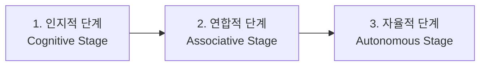
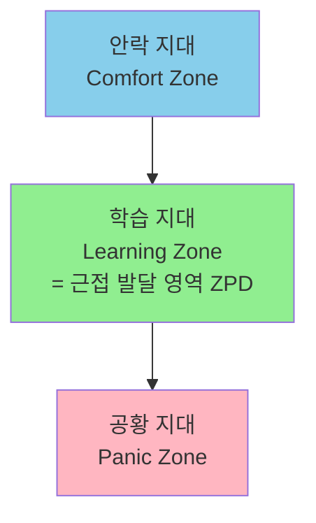
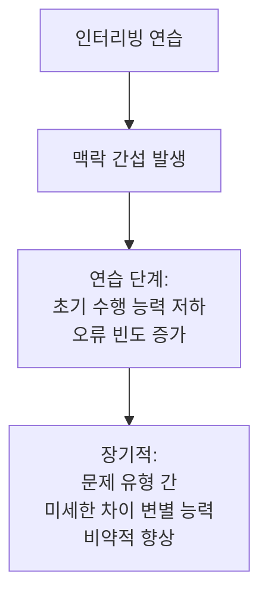
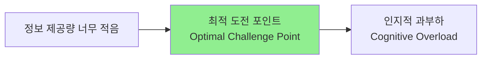
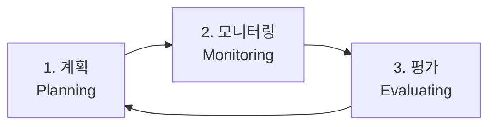
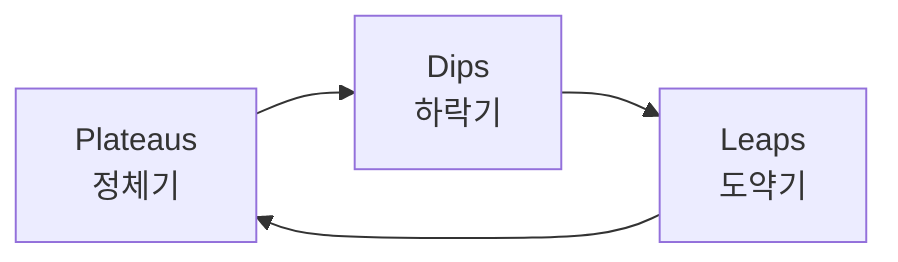

# 인지과학, 신경가소성 및 행동 심리학 기반의 최적화된 기술 획득 및 연습 방법론

> **핵심 명제**: 맹목적 반복이 아닌, 과학적으로 검증된 학습 전략의 전략적 결합

---

## 1. 서론: 기술 획득의 역학적 본질

### 기술 획득(Skill Acquisition)이란?

**다학제적 정의**:
- = 운동 학습 및 통제(Motor Learning and Control)
- 의도, 지각, 행동, 수행자-환경 간 관계 조율을 포괄

**본질**:
- ❌ 단순히 반복적인 육체적 움직임
- ✅ 운동 기술 문제(Motor skill problem) 해결
- ✅ 관절·신체 분절의 움직임을 자발적·의도적으로 통제하는 **목적론적(Teleonomic) 과정**

**연구 분야**: 신경과학, 생리학, 심리학, 코칭의 교차점

---

### 학습의 단계적 전이

#### Fitts와 Posner의 3단계 모델

| 단계 | 특징 | 학습자의 초점 | 성과 |
|------|------|--------------|------|
| **1. 인지적 단계** (언어-운동 단계) | • "무엇을" "어떻게" 할지에 모든 정신 에너지 집중 • 코치 피드백을 복잡한 인지 과제로 처리 | 이해와 전략 수립 | • 일관성 부족 • 수많은 오류 • 뇌가 새로운 신경 경로 탐색 |
| **2. 연합적 단계** | • 기본 패턴 형성 • 오류 점진적 감소 | 정교화와 조정 | • 점차 안정적 수행 |
| **3. 자율적 단계** | • 기술의 자동화 • 의식적 사고 거의 불필요 | 무의식적 실행 | • 다른 인지 과제 동시 수행 가능 (대화하며 연주) |

#### Ann Gentile의 2단계 모델

**초기 단계**: 환경적 조건에 맞는 움직임 해법 탐색
- → **인지적 문제 해결(Cognitive problem-solving)** 중요성 강조

#### Nikolai Bernstein의 통찰

> **"기술 획득 = 운동 문제를 해결하는 과정"**

- ❌ 단순하고 기계적인 맹목적 반복
- ✅ 변동성이 크고 복잡한 인지적 상황 속에서의 연습
- → 다양한 환경으로 기술 전이(Transfer) 가능

### 신체 훈련 vs 인지 훈련

**상호 배타적이지 않음**:

| 훈련 유형 | 생리적 변화 | 예시 |
|----------|-----------|------|
| **물리적 훈련** | 감각운동·시공간 네트워크의 생리적 변화 | 심혈관계 훈련 협응력 훈련 |
| **인지적 훈련** | 실행 기능(Executive functions) 향상 | 심상 훈련 전략 분석 |

**결론**: 두 영역의 상호작용 = 고도의 기술 획득에 필수불가결

---

## 2. 연습의 위계: 목적 있는 연습과 의식적인 연습

### 맹목적 반복의 함정

**일반적 오류**:
- 단순 반복 → 숙련도 향상 (X)
- 일정 수준('수용 가능한' 단계) 도달 → **성장 정체**

> [!warning] 전문가의 역설
> 수십 년 경력 전문가 = 1~2년 차 초보자
>
> **원인**: 더 이상 개선의 필요성을 절박하게 느끼지 못함

---

### Anders Ericsson의 연습 위계

#### 목적 있는 연습(Purposeful Practice)

**핵심 요소**:
1. ✅ **명확하고 구체적인 목표** 설정
2. ✅ **고도의 집중력** 발휘
3. ✅ **피드백**을 통한 진행 상황 모니터링
4. ✅ 스스로를 **안락 지대(Comfort zone) 밖**으로 밀어냄

#### 의식적인 연습(Deliberate Practice)

**목적 있는 연습 +**:
1. ✅ **잘 정의된 분야** (전문가와 초보자 구분 명확)
2. ✅ **경험 풍부한 코치/교사**의 적극적 개입

**기반**:
- 최고 수행자들의 달성 성취 이해
- 탁월함을 얻기 위한 구체적 방법론

---

### 근접 발달 영역(ZPD)

**Lev Vygotsky의 개념**:

**ZPD 정의**:
- 독립적으로 달성 가능한 **실제 발달 수준**
- ↕️
- 유능한 또래/성인 지도 하 달성 가능한 **잠재적 발달 수준**
- = 이 사이의 거리

**가장 생산적인 훈련**:
- 학습자를 안락 지대에서 끌어냄
- **학습 지대**에 머물게 함
- 공황 지대로 넘어가지 않도록 정밀 조율 ← **코치의 핵심 역할**

---

### 연습 유형 비교표

| 연습 유형 | 핵심 목적 | 주요 특징 | 한계점 |
|----------|----------|----------|--------|
| **임상적/일상적 연습** (Clinical/Naive Practice) | 성과 창출 (Performance) | 주어진 업무/게임 반복 수행 | 성과 일관성은 생기나 역량 향상에 한계 |
| **목적 있는 연습** (Purposeful Practice) | 역량 강화 (Competence) | • 구체적 목표 • 집중 • 피드백 • 안락 지대 탈출 | 자기 주도적 노력 전문가 개입 없음 |
| **의식적인 연습** (Deliberate Practice) | 탁월함 달성 (Excellence) | • 확립된 분야 • 최상위 수행자 기준 • 코치의 맞춤형 피드백 • ZPD 공략 | 코치·시간·비용 필요 |

---

### 의식적인 연습의 구체적 실천

#### 과제 분해

**❌ 나쁜 목표**:
- "퍼블릭 스피킹을 더 잘하고 싶다" (모호함)

**✅ 좋은 목표**:
- "첫 문장으로 청중의 시선을 사로잡는다"
- "발표 내내 청중과 눈을 맞춘다"
- → **특정 요소를 정조준**

#### 코치 없이 의식적인 연습 구현

**자가 교정(Self-correction) 프로토콜**:

**1. 체스 - Magnus Carlsen 사례**
- 컴퓨터 체스 프로그램 활용
- 동시에 여러 게임 진행
- 일반 선수보다 압도적으로 빠른 속도
- 약 **30만 개** 체스 패턴(Chunks) 학습

**2. 음악 - Nathan Milstein의 조언**
> "손가락으로만 연습하면 아무리 오래 해도 충분치 않지만,
> **머리로 집중해서 연습하면 2시간으로도 족하다**"

**3. 디자인**
- 훌륭한 UI/로고를 보고 숨김
- 기억에만 의존해 재현
- 원본과 비교하며 약점 파악

**4. 글쓰기**
- 특정 형용사/부사 사용 금지 (제약 기반 연습)
- 잘 쓰인 기사의 구조 해체 → 자신만의 언어로 재조립

---

## 3. 인지과학적 훈련 기법: 분산·인터리빙·인출 연습

### 핵심 원리

> **학습 ≠ 마법의 알약**
> **학습 = 효과적인 전략들의 전략적 결합**

---

### 3.1. 분산 연습(Spaced Practice)

#### 집중 연습 vs 분산 연습

| 방식 | 설명 | 단기 효과 | 장기 효과 |
|------|------|----------|----------|
| **집중 연습** (Massed Practice) | 한 번에 몰아서 연습 (벼락치기) | ✅ 단기 성과 향상 | ❌ 쉬운 망각 (Easy forgetting) |
| **분산 연습** (Spaced Practice) | 짧은 세션을 긴 시간에 걸쳐 분산 | 초기 성과 느림 | ✅ 장기 기억 형성 ✅ 영구적 뇌 구조 변화 |

#### Shana Carpenter의 원칙

> **"쉬운 학습은 쉬운 망각"**
> (Easy learning is easy forgetting)

#### 실천 가이드

**❌ 비효율적**:
- 단일 4시간 연습

**✅ 효율적**:
- 30분씩 8회 연습
- 일정한 간격

**이유**: 신경 가소성이 작용할 충분한 **물리적 시간과 휴식 간격** 필요

---

### 3.2. 인터리빙(Interleaving, 교차 연습)

#### 차단 연습 vs 인터리빙

| 방식 | 패턴 | 단기 성과 | 장기 전이 |
|------|------|----------|----------|
| **차단 연습** (Blocked Practice) | AAA BBB CCC | ✅ 초기 습득 속도 빠름 ✅ 단기 퍼포먼스 향상 | ❌ 실전 변동성 대응 약함 ❌ 기술 전이 능력 저하 |
| **인터리빙** (Interleaving) | ABC BCA CAB | ❌ 초기 습득 느림 ❌ 오류 빈도 증가 | ✅ 실전 대응력 강함 ✅ 기술 전이 뛰어남 |

#### 신경과학적 메커니즘

**차단 연습**:
- GABA(억제성 신경전달물질) 수치 ↑
- 단기 집중 향상
- 새로운 연결 형성 유연성 ↓

**인터리빙/무작위 연습**:
- GABA 수치 ↓
- 신경망이 광범위하고 복잡한 연관성 형성
- 뇌가 문제 유형 간 미세한 차이 **변별(Discriminate)** 능력 향상

---

### 맥락 간섭 효과(Contextual Interference Effect)

#### McMaster 대학 연구 (Dominic A. Simon)

**메타인지적 착각(Metacognitive illusion)**:

| 집단 | 연습 중 자기 평가 | 실제 지연 보존 테스트 결과 |
|------|-----------------|------------------------|
| **차단 연습** | "완벽히 습득했다" (과대평가) | ❌ 낮은 성과 |
| **인터리빙** | "아직 부족하다" (과소평가) | ✅ 압도적으로 우수한 성과 |

#### 실전 적용: 아일랜드 럭비 연맹

**Nick Winkelman (인지과학자)**:
- 최상위 엘리트 스포츠 구단에 인터리빙 도입
- 항상 경쟁자보다 한발 앞서 적응해야 하는 환경
- → 인터리빙 연습 **필수적**

**적용 범위**:
- 명시적 규칙 기반 학습
- 무의식적 암묵적 운동 순서 학습(Implicit motor sequence learning)

---

### 3.3. 인출 연습(Retrieval Practice)

#### 기본 개념

**❌ 수동적 학습**:
- 입력된 정보를 눈으로 다시 읽기
- 검토

**✅ 능동적 학습**:
- 기억 속에서 정보를 적극적으로 끄집어냄
- → **뉴런 연결망 물리적 재편 및 강화**

#### 의도적인 곤란함(Desirable Difficulty)

**효과**:
- 정보 인출 과정에서 발생하는 곤란함
- → 지식 휘발 방지
- → 뇌의 장기 저장소에 깊이 뿌리내림

**핵심**: 뇌는 정보를 인출하기 위해 애쓰는 **바로 그 순간**에 학습

---

## 4. 과제 난이도의 동적 조율: 도전 포인트 프레임워크

### Challenge Point Framework (Guadagnoli & Lee, 2004)

#### 난이도의 두 차원

| 차원 | 정의 | 특징 |
|------|------|------|
| **명목상 난이도** (Nominal Task Difficulty) | 수행자 숙련도와 무관하게 과제 자체가 지닌 고정 난이도 | 예: 3점 슛 > 미드레인지 슛 (모든 선수에게 동일) |
| **기능적 난이도** (Functional Task Difficulty) | 학습자의 현재 기술 수준과 환경에 따라 체감되는 난이도 | 기술 숙달 시 점차 하락 |

---

### 최적 도전 포인트(Optimal Challenge Point)

**균형점**:
- ✅ 정보 처리 능력을 자극할 충분한 정보 제공
- ✅ 인지적 과부하로 시스템 붕괴하지 않을 수준
- = **학습 잠재력 극대화** + **성과 저하 최소화**

---

### 이중 과제 연구(Dual-task Study)

#### 실험 설계

**일차 과제**: 러닝머신에서 특정 보폭 유지
**이차 과제**: 외부 자극 반응 (탐사 반응 시간 측정)

#### 결과

| 집단 | 연습 단계 | 유지 단계 | 반응 시간 | 의미 |
|------|----------|----------|----------|------|
| **차단 연습** | ✅ 수행 능력 좋음 | ❌ 낮은 성과 | 짧음 | 낮은 인지적 주의 |
| **무작위 연습** | ❌ 수행 능력 낮음 | ✅ 우수한 성과 | **길음** | **높은 인지적 주의** 뇌 활성화 극대화 |

#### 실천 전략

**초보자**: 차단 연습으로 기초 정보 처리 기반 마련
**숙련자**: 무작위 연습 + 심리적 압박 조건 도입
- → 기능적 난이도 의도적으로 높임
- → 훈련 정체 방지
- → 지속적 신경가소성 유도

---

## 5. 행동주의적 접근: 무오류 학습과 연쇄 기법

### 5.1. 무오류 학습(Errorless Learning)

#### 시행착오 방식의 문제점

**❌ 전통적 Trial-and-Error**:
- 실패를 거듭하며 정답 찾기
- 학습자의 빈번한 좌절감
- 잘못된 패턴이 뇌에 깊이 각인
- 수정에 이중 노력 소요

#### 무오류 학습의 원리

**✅ Errorless Learning**:
1. 학습 초기 강력한 **프롬프트(Prompt)** 제공
   - 힌트 또는 물리적 가이드
2. 오답/잘못된 동작 발생 가능성 **원천 차단**
3. 처음부터 **오직 올바른 수행만** 경험
4. 올바른 패턴 익숙해짐에 따라 프롬프트 강도 점진적 감소
   - = **용암법(Fading)**
5. 독립적 수행 능력 완성

---

#### 효과 및 적용

**전통적 적용**:
- 자폐 스펙트럼 장애(ASD) 아동
- 좌절감 방지, 동기 고취

**최근 연구**:
- 일반 성인
- 인지 손상 환자
- 신체적·인지적 기술 습득

**Addenbrookes 인지 평가 연구**:

| 집단 | 과제 | 결과 |
|------|------|------|
| **무오류 학습** | 의족 착용 기술 | ✅ 압도적으로 많은 단계 정확 기억 ✅ 오류 발생 빈도 유의미하게 낮음 |
| **시행착오** | 의족 착용 기술 | ❌ 적은 단계 기억 ❌ 높은 오류 빈도 |

**메커니즘**:
- 초기 지속적 성공 경험 → 동기 부여 유지
- 불필요한 신경 경로 활성화 억제
- → 기술 획득 효율성 비약적 향상

---

### 5.2. 연쇄 기법(Chaining)

#### 기본 전제

**과제 분석(Task Analysis)**:
- 복잡한 절차 → 여러 개의 작은 단위로 분해
- 순차적으로 결합

---

#### 연쇄 기법의 종류

| 기법 | 메커니즘 | 최적 상황 | 장점 |
|------|---------|----------|------|
| **전진 연쇄** (Forward Chaining) | • 첫 번째 단계부터 시작 • 완벽히 마스터 후 다음 단계 • 나머지는 교사 보조 | 순서와 논리적 흐름이 중요한 과제 | 처음부터 시작 → 안정감·자신감 구축 |
| **후진 연쇄** (Backward Chaining) | • 교사가 앞선 단계 대신 수행 • 학습자는 마지막 단계만 수행 • 거꾸로 앞 단계 추가 | 동기 부족한 학습자 | 과업 완료 성취감 즉각적 보상 (Reinforcement) |
| **전체 과제 연쇄** (Total Task Chaining) | • 매 세션 전체 단계 처음부터 끝까지 수행 • 막히는 부분에서만 즉각 프롬프트 | 기초 능력·높은 이해도 갖춘 학습자 | 전체 흐름 속 기술 연마 |

---

#### 비교 연구 결과

**Concurrent-chains preference assessment**:
- 특정 연쇄 기법이 무조건 우월하지 않음
- 모든 연쇄 기법 > 프롬프팅 없는 기준선(Baseline) 훈련

#### 실천 전략

**하이브리드 접근**:
- 학습자의 동기 수준 분석
- 과제 맥락 고려
- 전진 연쇄 + 후진 연쇄 결합

**예시: 옷 입기**
- 바지 끌어올리기: 전진 연쇄
- 지퍼 올리기 (마지막 단계): 후진 연쇄
- → 성취감 극대화

---

## 6. 자기 주도적 규제: 메타인지와 이중 순환 학습

### 6.1. 메타인지(Metacognition)와 자기 규제

#### 정의

**메타인지**:
- 자신이 무엇을 알고 무엇을 모르는지에 대한 **명시적 지식과 자각**
- 어떤 학습 전략이 자신에게 효과적인지에 대한 인식

**자기 주도적 학습(Self-regulated learning)**:
- 메타인지적 자각을 바탕으로
- 행동·감정 모니터링
- 훈련 계획 실행
- = **동기적·실천적 측면**

---

#### 자기 주도적 학습자의 우위

**특징**:
- 강점·약점 객관적 파악
- 정체기에도 좌절하지 않음
- 스스로 동기 부여

**영국 교육기부재단(EEF) 분석**:
> 메타인지와 자기 규제 전략 =
> **낮은 비용 + 최고의 성과 향상**

---

### 자기 주도적 규제의 역동적 순환

| 단계 | 핵심 질문 | 행동 |
|------|----------|------|
| **계획** (Planning) | "유사한 문제를 어떻게 해결했었는가?" | • 사전 지식 활성화 • 최적 인지 전략 배치 (연상 기법, 가이드라인) |
| **모니터링** (Monitoring) | "현재 성과가 목표에 부합하는가?" "방향을 선회해야 하는가?" | • 이해도·동기 실시간 추적 • 방법론 수정 |
| **평가** (Evaluating) | "적용된 훈련 기법이 유효했는가?" | • 세션 종료 후 구조화된 성찰 • 다음 세션 피드백 추출 |

---

### 7단계 점진적 책임 이양 모델

**Gradual Release of Responsibility Model**:

| 단계 | 주체 | 활동 |
|------|------|------|
| 1 | 교사 | 사전 지식 활성화 |
| 2 | 교사 | 명시적 전략 교육 |
| 3 | 교사 | 생각 과정 소리 내어 모델링 (Thinking aloud) |
| 4 | 교사+학습자 | 전략 이해도 점검 |
| 5 | 교사+학습자 | 세밀한 안내가 수반된 가이드 연습 |
| 6 | 학습자 | 독립적 연습 (프롬프트 제거) |
| 7 | 학습자 | 구조화된 성찰 |

**최종 목표**: 코치의 외재적 피드백 시스템을 학습자의 **내면으로 완벽히 이식**

---

#### 실증 연구: 의과 대학

| 그룹 | 교육 방식 | 메타인지적 인식률 | 상황 대처 능력 |
|------|----------|-----------------|--------------|
| **전통적 주입식** | 강의 중심 | ❌ 낮음 | ❌ 낮음 |
| **문제 중심 학습(PBL)** | 학습자 중심 자기 주도적 커리큘럼 | ✅ 현저히 높음 | ✅ 현저히 높음 |

---

### 6.2. 이중 순환 학습(Double-Loop Learning)

**창안자**: Chris Argyris (하버드 대학교)

#### 단일 순환 vs 이중 순환

| 학습 방식 | 비유 | 접근 | 결과 |
|----------|------|------|------|
| **단일 순환 학습** (Single-Loop Learning) | 온도 조절기 (Thermostat) | • 목표는 그대로 • 행동 방식만 약간 수정 예: "20도 유지를 위해 보일러 가동" | 기계적 교정 근본 문제 미해결 |
| **이중 순환 학습** (Double-Loop Learning) | 온도 조절기 재설계 | • 근본 전제 조건·가치관 재검토 예: "왜 20도로 설정했는가?" "이 온도가 진정 효율적인가?" | 혁신적 사유 규칙 재설계 |

---

#### 실전 사례: 웹 에이전시 스크럼 팀

**The Liberators Network 사례**:

**문제 상황**:
- 영업 부서 수주 프로젝트 개발
- 늘 예산 부족, 납기 지연, 심각한 스트레스

**단일 순환 학습 시도**:
- 수많은 회고(Retrospectives) 회의
- "어떻게 하면 일정을 더 잘 추산할까?" 고민
- **결과**: 성과 없음

**이중 순환 학습 적용**:
- 근본 전제 뒤집기: "왜 영업 부서가 수주·일정 산정을 도맡아야 하는가?"
- **해결책**: 책임을 실제 개발 담당 스크럼 팀으로 완전 이관
- **결과**: 문제 해결

---

#### 기술 연마에의 적용

**표면적 질문** (단일 순환):
- "내가 올바른 방법으로 연습하고 있는가?"

**근본적 질문** (이중 순환):
- "내가 설정한 훈련의 지향점이 타당한가?"
- "평가 기준에 내재된 암묵적 가정(Tacit knowledge)이 올바른가?"
- "훈련 방식 자체를 재설계해야 하는가?"

> [!success] 반성적 실천(Reflective Practice)
> = 수행자를 초보자에서 **궁극적인 전문가**로 진입시키는 **결정적 촉매제**

---

## 7. 실행 가능한 피드백 루프의 설계

### 전통적 피드백의 문제점

**❌ 구조적 결함**:
- 일과성 칭찬
- 평가 지향적 최종 결과 통보
- → 실제 학습 행동 수정으로 이어지지 못함

---

### 진정한 피드백 루프의 3가지 핵심 구조

| 요소 | 설명 | 예시 |
|------|------|------|
| **1. 학습 목표와 명확한 연결** (Connect to learning target) | "나는 ~을 할 수 있다(I can~)" 형태의 명시적 목표 참조 | "나는 청중의 주의를 끌 수 있다" |
| **2. 구체적·객관적 증거 제시** (Point to specific evidence) | ❌ 모호한 지시 ("자세 좋지 않다", "디테일 추가") ✅ 비평가적·정확한 사실 | "오프닝 예시가 성공적이었다. 하지만 3번째 문단에 객관적 데이터 누락" |
| **3. 명확·즉각적 다음 단계** (Give one clear next step) | ❌ 오류 목록 나열 (인지 과부하) ✅ 당장 실행 가능한 관리 가능한(Manageable) 크기의 단일 조치 | "주장을 뒷받침할 하나의 데이터를 추가해 보라" |

---

### 실천 기법

#### 3-2-1 기법

**훈련 후 작성**:
- 오늘 습득한 기술의 핵심 **3가지**
- 흥미로웠던 변주 **2가지**
- 여전히 해결되지 않은 의문점 **1가지**

#### 렉처 래퍼(Lecture Wrapper)

**자기 교정형 피드백 루프**:
1. 강의의 핵심 포인트 목록 (교사)
2. 학습자가 스스로 요약한 목록
3. 두 목록 대조
4. 이해의 빈틈 파악

---

### 현대 기술적 개입: AI 도구

#### SchoolAI 사례

**PowerUps / Spaces**:
- 플래시카드·문제 해결 과제 수행 즉시
- 문맥에 맞는 **실시간 교정** 제공
- 학습을 능동적 상태로 유지

**Mission Control 대시보드** (교사용):
- 전체 집단의 실시간 진척도 시각화
- 공통된 오개념(Misconceptions) 패턴 발견
- 데이터 기반 개입 시점 결정

#### 대안: 사후 피드백 시스템

**즉각적 피드백 불가능한 경우** (스포츠, 임상 실무):
- 비디오 녹화본 슬로우 모션 분석
- 전문가 리뷰 결합

---

## 8. 신경가소성, 수면, 극소 휴식의 신경과학

### 8.1. 신경가소성(Neuroplasticity)

#### 기본 개념

**뇌 ≠ 고정된 하드웨어**
**뇌 = 구조적·기능적 시냅스 배열을 끊임없이 재조직**

**효율적 연습의 효과**:
- 세포 단위 → 근육 운동 뉴런 단위
- 분자적·시냅스적 연접 강도 근본 변화

---

#### 시간에 따른 변화

| 단계 | 시기 | 뇌 영역 | 변화 유형 |
|------|------|---------|----------|
| **빠른 단계** (Fast-stage) | 처음 접하고 연습 | 1차 운동 피질 (Primary motor cortex) | 빠르고 강력한 활성화 |
| **느린 단계** (Slow-stage) | 며칠~몇 주 누적 후 | 대뇌·척수 회색질(Gray matter) | 밀도의 구조적 재편성 → 기술 영구 자동화 |

---

#### 성인기의 신경가소성

**생물학적 사실**:
- 회색질 밀도: 사춘기 직전 정점
- 이후 시냅스 가지치기 → 서서히 감소

**희망적 사실**:
- ✅ 성인기에도 새로운 운동 패턴 학습 가능
- ✅ 뇌는 평생 변화 잠재력 보유

**촉진 요인**:
1. **신경영양인자 분비 촉진**:
   - BDNF (뇌유래신경영양인자)
   - GDNF, NGF
   - 방법: 유산소 운동

2. **염증 수치 감소**:
   - 지중해식 식단
   - MIND 식단 (과일, 잎채소, 생선, 올리브 오일, 견과류)

---

### 8.2. 수면: 신경망 재편의 핵심 시간

#### 패러다임 전환

> [!important] 핵심 발견
> 뇌의 신경망이 재편되는 핵심 시간 ≠ 연습 수행 순간
> 뇌의 신경망이 재편되는 핵심 시간 = **휴식·수면 중**

**수면 ≠ 단순 피로 해소**
**수면 = 가장 적극적이고 치열한 인지적 응고화(Memory Consolidation)**

---

#### 수면의 단계별 기능

| 수면 단계 | 주요 활동 | 강화되는 기억 유형 |
|----------|---------|------------------|
| **깊은 NREM 수면** (서파 수면 SWS) | • 해마-신피질 대화 (Hippocampal-neocortical dialogue) • 능동적 시스템 응고화 | • 선언적 기억 (Declarative Memory) • 운동 기술의 피질 흔적 |
| **REM 수면** | 절차적 기억 강화 | • 기법의 창의적 변용 • 무의식적 절차 기억 미세 조정 • 통찰력 |

---

#### 능동적 시스템 응고화 가설

**메커니즘**:
1. 해마(Hippocampus)에 임시 저장된 훈련 흔적
2. 지속적 재활성화
3. 점진적으로 신피질(Neocortex) 장기 기억 저장소로 이동
4. 다른 지식 네트워크와 통합

**결과**: 연습 중 풀리지 않던 난제 → 자고 일어난 후 무의식적 해결

---

#### 수면의 중요성

> [!warning] 절대 원칙
> - 연습 직후 수면 **절대적으로 보장**
> - 철야 작업으로 신경 생리학적 황금 시간대 놓치면
> - → 다음 날 보충 수면으로도 **되돌릴 수 없음**

**표적 기억 재활성화(TMR)** 연구:
- 수면 중 특정 소리/냄새로 훈련 내용 재활성화
- → 수면이 학습에 직접 개입 증명

---

### 8.3. 미세 휴식(Micro-rests)의 마법

#### 기본 발견

**뇌자도(MEG) 및 뇌파(EEG) 연구**:

**10초 내외 짧은 휴식 시**:
- 깨어 있는 뇌(Awake resting brain)
- 방금 연습한 행동 시퀀스의 신경 활동 패턴 재생
- 실제 연습 속도보다 **약 20배 빠르고** 시간적으로 압축된 형태

= **각성 상태의 해마-신피질 신경 재현**
  (Waking hippocampo-neocortical replay)

**효과**:
- 이 재현 현상 빈도 = 이후 성과 향상폭의 **가장 정확한 예측 지표**

> [!success] NIH 연구진의 선언
> **"각성 상태의 휴식은 새로운 기술을 배우는 데 있어
> 연습 자체만큼이나 중요하다"**

**결론**: 휴식 없는 집중 연습(Massed Practice) = 생물학적으로 극히 비효율적

---

### 8.4. 비수면 깊은 휴식(NSDR)

**제안자**: Andrew Huberman (스탠퍼드 대학교)
**전통명**: 요가 니드라(Yoga Nidra)

#### 메커니즘

**상태**:
- 신체: 수면에 가까운 깊은 이완
- 의식: 집중력의 끈 유지
- → 체계적 가이드를 통해 진행

#### 효과

**생리적 변화**:
- ⬇️ 코르티솔 (스트레스 호르몬) 급격 감소
- 💓 심박수 안정
- 🧠 **세타파(Theta waves)** 활동 비약적 증가

**세타파의 역할**:
- 정보 처리
- 기억 형성
- 가소성 증대

**결과**:
- 시냅스 새로운 연결 형성 가속화
- 정신적 잡음 제거
- 핵심 정보만 뇌 저장소에 달라붙게(Stick) 만듦
- → 기술의 장기 체화 속도 최고조

#### 실천 가이드

**시기**: 치열한 기술 연습·인지 학습 직후
**시간**: 20~30분

---

## 9. 성취 정체기(Plateaus)의 과학적 진단과 극복

### 정체기의 재정의

**일반적 오해**:
- 정체기 = 재능의 영구적 한계
- 정체기 = 한계 효용의 법칙

**과학적 정의**:
- 정체기 = 기존 훈련 방법론의 인지적 자극 유효성 종료를 알리는 **행동적 마커(Behavioral marker)**
- ❌ 영구적 벽
- ✅ 전환 신호

---

### 정체기의 3가지 유형

| 유형 | 원인 | 신경생리학적 메커니즘 | 대응 전략 |
|------|------|---------------------|----------|
| **유형 1: 행동 부족** (Behavioral Insufficiency) | 훈련 루틴화 → 뇌에 더 이상 인지적 마찰·도전 없음 | 명목상 난이도에 안주 기능적 난이도 소실 | • 훈련 강도·빈도 점진적 증가 • 목적 있는 연습 → 의식적인 연습 전환 • 환경 변화로 새로움(Novelty) 주입 |
| **유형 2: 자원 부족** (Resource Insufficiency) | 훈련 강도 충분 but 회복 자원 결핍 (수면, 단백질, 휴식) | 신경가소성 발휘 필요 자원 만성 결핍 | • 무리한 훈련량 증가 중단 • 계획된 휴식 주간 (Deload weeks) • 수면 최적화 • NSDR, 크레아틴 보충 • 냉온수 요법 등 과학적 회복 |
| **유형 3: 과도한 확장** (Overextension) | 훈련-회복 균형 맞음 but 훈련 외부 스트레스가 인지 용량(Cognitive load) 초과 | 직장, 대인관계, 경제적 압박 등 적응 에너지 고갈 | • 스케줄 대대적 구조조정·축소 • 복수 목표 폐기 • 훈련과 생존이라는 단일 최우선 순위에만 극단적 집중 |

---

### 정체기의 수학적 모델

**Hall KD 박사의 체중 감량 모델 적용**:

**피드백 제어 회로**:
- 개입 노력: $P(t)$
- 저항 매개변수: $k$
- 기술/체중 향상 시 $k$ 값 증가

**정체기 발생**:
- 동일 훈련 $P$ 지속
- 어느 시점에서 증폭된 $k$와 완벽히 일치
- → 수학적 상쇄 작용
- → 성과 지표 평행선(Plateau)

**돌파 전략**:
- ❌ 단순 반복 훈련 증가 (칼로리 제한)
- ✅ 시스템의 본질적 저항값 $k$ 자체를 40~70% 무력화
- → 완전히 이질적인 접근 (패러다임 전환)

---

### PDL 프레임워크 (Bryan & Harter, 1899)

**극단적 전문성(Extreme expertise) 향한 성취 = 비선형적**

#### 단계별 특징

**1. 정체기(Plateaus)**
- 익숙한 접근법으로 성장 정체
- 안락 지대

**2. 하락기(Dips)**
- 기존 접근법 과감히 버림
- 완전히 새로운 스킬 세트·전략 실험
- 성과 일시적 퇴보
- 극심한 인지적 마찰·심리적 저항
- = **실험의 시기**

**예시**:
- 독수리 타법 → 터치 타이핑 전환 시 타수 느려짐

**3. 도약기(Leaps)**
- 하락기 버텨냄
- 새로운 신경 회로 배선 완료
- 이전 한계 돌파
- 폭발적 기록 경신

---

#### 역사적 사례: 포스버리 플롭(Fosbury Flop)

**배경**: 육상 높이뛰기
- 수십 년간 가위뛰기·엎드려뛰기(Straddle) 고수
- → 정체기

**혁신**: 배면뛰기 발명
- → 인류의 도약 한계 재설정

> **"저항이 거세다면 올바른 길을 가고 있는 것"**
> — Stephen Pressfield

---

## 10. 결론: 통합적 원리

### SAFE 프레임워크 (Williams & Hodges)

**Skill Acquisition for Excellence**

---

### 기술 획득의 통합 원리

#### 1. 의식적인 연습 체계

**실천**:
- ✅ 명목상 난이도를 미시적 구성 요소 단위로 분해
- ✅ 가장 구체적인 목표 설정
- ✅ 외부 전문가의 객관적 비디오 분석·피드백 루프
- ✅ 근접 발달 영역(ZPD)만 타격

---

#### 2. 인터리빙 구조 강제 전환

**실천**:
- ❌ 단일 과제 반복하는 안락한 차단 연습
- ✅ 다양한 과제 유형을 섞어 뇌에 맥락 간섭 유발
- ✅ 무작위 연습 및 인터리빙(Interleaving)

---

#### 3. 휴식을 통한 완성

**생물학적 법칙 인정**:
- 기술 획득 ≠ 연습 그 자체
- 기술 획득 = **휴식**을 통해 완성

**실천**:
- ✅ 학습 직후의 수면
- ✅ 각성 상태 뇌파의 20배 압축 재현 (극소 휴식, Micro-rests)
- ✅ NSDR 프로토콜
- → 피질 내 정보 응고화 속도 극대화

---

#### 4. 이중 순환 학습

**정체기 대응**:
- ✅ 하락과 정체기를 시스템 저항의 자연스러운 생리적 현상으로 수용
- ✅ 메타인지 발동
- ✅ 목표의 전제 조건 자체를 뒤엎는 혁신 감행

---

### 최종 명제

> [!success] 인간 뇌의 잠재력
> **인간의 뇌는 유연하게 재조직될 준비가 되어 있다**
>
> 위의 인지과학적 원리들을 훈련 설계에 촘촘히 엮어낼 때
> → **무한에 가까운 탁월함의 영역으로 비약적 도약**

---

## 참고 개념

### 주요 용어 정리

#### 기술 획득 관련
- **기술 획득(Skill Acquisition)**: 운동 기술 문제 해결을 위한 목적론적 과정
- **목적 있는 연습(Purposeful Practice)**: 구체적 목표, 집중, 피드백을 동반한 연습
- **의식적인 연습(Deliberate Practice)**: 전문가 개입 + 최상위 수행자 기준 추구
- **근접 발달 영역(ZPD)**: 독립 달성 가능 수준과 지도 하 달성 가능 수준 사이의 거리

#### 인지과학 기법
- **분산 연습(Spaced Practice)**: 짧은 세션을 긴 시간에 걸쳐 분산
- **인터리빙(Interleaving)**: 서로 다른 기술을 교차 연습
- **맥락 간섭 효과(Contextual Interference Effect)**: 인터리빙이 유발하는 초기 성과 저하 → 장기 변별 능력 향상
- **인출 연습(Retrieval Practice)**: 기억 속에서 정보를 적극적으로 끄집어내는 훈련
- **의도적인 곤란함(Desirable Difficulty)**: 정보 인출 과정의 곤란함 → 장기 저장 촉진

#### 과제 설계
- **명목상 난이도(Nominal Task Difficulty)**: 과제 자체가 지닌 고정 난이도
- **기능적 난이도(Functional Task Difficulty)**: 학습자 수준과 환경에 따른 체감 난이도
- **최적 도전 포인트(Optimal Challenge Point)**: 학습 잠재력 극대화 + 성과 저하 최소화 균형점

#### 행동주의 기법
- **무오류 학습(Errorless Learning)**: 초기 강력한 프롬프트로 오답 원천 차단 → 올바른 수행만 경험
- **용암법(Fading)**: 프롬프트 강도를 점진적으로 감소
- **전진 연쇄(Forward Chaining)**: 첫 단계부터 순차적 마스터
- **후진 연쇄(Backward Chaining)**: 마지막 단계부터 역순으로 추가
- **전체 과제 연쇄(Total Task Chaining)**: 매 세션 전체 단계 수행

#### 메타인지
- **메타인지(Metacognition)**: 자신의 인지 과정에 대한 인지
- **자기 주도적 학습(Self-regulated learning)**: 계획-모니터링-평가의 역동적 순환
- **단일 순환 학습(Single-Loop Learning)**: 행동 방식만 수정
- **이중 순환 학습(Double-Loop Learning)**: 근본 전제 조건·가치관 재검토

#### 신경과학
- **신경가소성(Neuroplasticity)**: 뇌 구조적·기능적 시냅스 배열 재조직 능력
- **BDNF (뇌유래신경영양인자)**: 신경 성장·생존 촉진 단백질
- **능동적 시스템 응고화**: 해마-신피질 간 대화를 통한 장기 기억 형성
- **각성 상태의 신경 재현**: 휴식 중 행동 시퀀스를 20배 빠르게 압축 재생
- **세타파(Theta waves)**: 정보 처리·기억 형성·가소성 증대 관련 뇌파
- **NSDR (비수면 깊은 휴식)**: 의식 유지하며 깊은 이완 상태 유도

#### 정체기
- **정체기(Plateaus)**: 성장 정체 구간
- **하락기(Dips)**: 새로운 전략 실험 시 일시적 성과 퇴보
- **도약기(Leaps)**: 새로운 신경 회로 완성 후 폭발적 성장

---

*본 연구는 인지과학, 신경가소성, 행동 심리학을 융합하여
기술 획득과 연습 방법론의 최적화된 전략을 제시합니다.*
