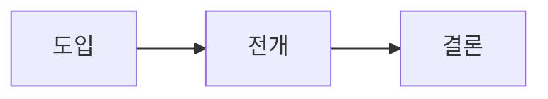

# {{영상 제목}}

> [!info] 영상 정보
> **채널**: {{채널명}}
> **링크**: {{유튜브 URL}}
> **날짜**: {{시청일}}

## TL;DR

{{영상의 핵심 주장/메시지를 2~3문장으로}}

## 핵심 논점

### 1. {{논점/주장}}

{{주장의 상세 설명과 맥락}}

> [!quote] 근거
> {{영상에서 제시한 근거, 데이터, 사례}}

### 2. {{논점/주장}}

{{상세 설명}}

> [!quote] 근거
> {{근거/사례}}

## 흐름 정리

{{시간순 또는 논리순으로 영상의 전개 흐름을 정리. 필요시 Mermaid 다이어그램 활용.}}

## 비판적 사고

> [!question] 생각해볼 질문
> - {{이 주장의 전제는 무엇인가?}}
> - {{반론은 무엇이 있을 수 있는가?}}
> - {{내 경험/지식과 어떻게 연결되는가?}}

## 용어 사전

| 용어 | 정의 |
|------|------|
| {{용어1}} | {{정의1}} |
| {{용어2}} | {{정의2}} |

## 보충자료

- {{관련 도서, 논문, 아티클 링크 + 한 줄 설명}}
- {{추가 자료}}

## 연결 노트

- {{[[기존 볼트 내 관련 노트]]와의 연결점 설명}}
