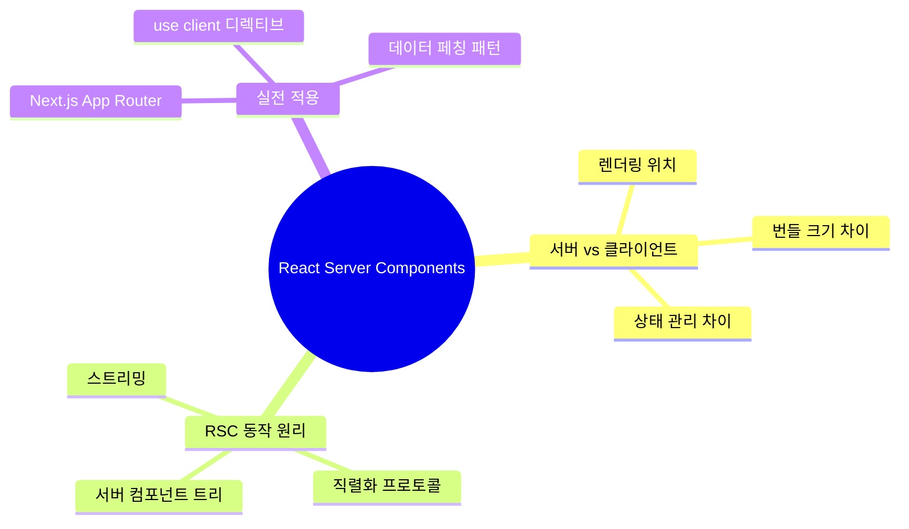
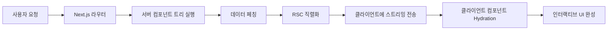

# React Server Components 완벽 가이드

> **채널**: Fireship | **시청일**: 2026-03-04

<iframe width="560" height="315" src="https://www.youtube.com/embed/TQQPAU21ZUw" frameborder="0" allowfullscreen></iframe>

---

## 목차

- [[#개요]]
- [[#Chapter 1 왜 RSC가 필요한가: CSR과 SSR의 한계|Chapter 1. 왜 RSC가 필요한가]] `🟢 기초`
- [[#Chapter 2 'use client' 경계와 컴포넌트 구성 전략|Chapter 2. 'use client' 경계]] `🟡 중급`
- [[#Chapter 3 데이터 페칭과 스트리밍|Chapter 3. 데이터 페칭과 스트리밍]] `🔴 심화`
- [[#종합 정리]]
- [[#용어 사전]]
- [[#학습 체크리스트]]
- [[#보충자료]]
- [[#내 생각 & 연결]]

---

## 개요

> **한 줄 핵심**: RSC는 서버에서만 실행되는 컴포넌트로, 클라이언트 JS 번들을 0으로 만들어 웹 성능을 획기적으로 개선하는 React 18의 새 아키텍처다.

React Server Components(RSC)는 React 18에서 도입된 새로운 아키텍처로, 컴포넌트를 서버에서 렌더링하여 클라이언트로 전송되는 JavaScript 번들 크기를 대폭 줄인다. 기존의 CSR(Client-Side Rendering)과 SSR(Server-Side Rendering)의 한계를 모두 극복하며, 서버의 리소스에 직접 접근하면서도 React의 컴포넌트 모델을 유지할 수 있다. Next.js 13의 App Router에서 기본값으로 채택되면서 실무 도입이 가속화되고 있다. Dan Abramov가 RFC를 통해 처음 제안했으며, 현재 React 생태계의 가장 중요한 패러다임 전환으로 평가된다.

### 마인드맵



### 암기 포인트

| 중요도 | 개념 | 핵심 한 줄 | 비유/키워드 |
|:------:|------|-----------|------------|
| ★★★ | Server Component = Zero Bundle | 서버 컴포넌트의 JS는 클라이언트에 전송되지 않아 번들 크기가 0 | 택배 포장지: 포장은 창고에서 벗기고 내용물만 배달 |
| ★★★ | 'use client' 경계 | 클라이언트 컴포넌트에는 'use client' 디렉티브를 명시해야 한다 | 국경 검문소: 이 선을 넘으면 클라이언트 세계 |
| ★★☆ | 데이터 페칭 간소화 | 서버 컴포넌트에서 직접 DB 쿼리, API 호출 가능 (useEffect 불필요) | 주방에서 직접 재료 가져오기 vs 배달 주문 |
| ★☆☆ | 스트리밍 렌더링 | Suspense와 결합하여 점진적으로 UI를 전송한다 | 영화 스트리밍: 다운로드 완료 전에 시청 시작 |

### 구간 가이드

| 구간 | 챕터 | 난이도 | 주제 |
|------|------|:------:|------|
| 0:00~4:00 | Chapter 1 | 🟢 기초 | CSR과 SSR의 한계, RSC 필요성 |
| 4:00~8:00 | Chapter 2 | 🟡 중급 | 'use client' 경계와 Donut Pattern |
| 8:00~12:00 | Chapter 3 | 🔴 심화 | 데이터 페칭과 Suspense 스트리밍 |

### 이해도 체크

- [ ] 개요를 읽고 RSC가 해결하는 핵심 문제를 설명할 수 있다
- [ ] 마인드맵의 각 가지가 무엇을 의미하는지 이해했다
- [ ] 암기 포인트의 ★★★ 항목을 보지 않고 말할 수 있다

---

## Chapter 1. 왜 RSC가 필요한가: CSR과 SSR의 한계 `🟢 기초`

<iframe width="560" height="315" src="https://www.youtube.com/embed/TQQPAU21ZUw?start=0&end=240" frameborder="0" allowfullscreen></iframe>

### 문제 상황

현대 웹 앱은 점점 더 복잡해지면서 JavaScript 번들 크기가 폭발적으로 증가했다. 일반적인 React SPA는 초기 로딩 시 수 MB의 JS를 다운로드해야 하며, 이는 특히 모바일 환경에서 심각한 성능 문제를 야기한다. CSR은 빈 HTML을 보내고 JS로 모든 것을 그리므로 초기 로딩이 느리고 SEO에 불리하다. SSR은 서버에서 HTML을 생성해 보내지만, hydration을 위해 여전히 동일한 양의 JS를 클라이언트에 전송해야 한다.

기존에는 CSR과 SSR 중 하나를 선택해야 했는데, 두 방식 모두 "클라이언트에 JS를 보내야 한다"는 근본적 한계를 공유한다. RSC는 이 전제 자체를 뒤집는다.

### 핵심 개념

RSC는 "서버에서만 실행되는 컴포넌트"라는 개념으로 이 딜레마를 해결한다. 서버 컴포넌트의 코드는 클라이언트로 전송되지 않으므로 번들 크기가 문자 그대로 0이다. Vercel의 벤치마크에 따르면, RSC를 도입한 프로젝트에서 평균 JavaScript 번들 크기가 30-50% 감소했다. 동시에 서버 컴포넌트는 데이터베이스, 파일 시스템 등 서버 리소스에 직접 접근할 수 있어, 기존의 복잡한 API 레이어가 불필요해진다.

기존 React SPA에서 데이터를 가져오려면 "컴포넌트 마운트 → useEffect → fetch API → 로딩 상태 관리 → 에러 처리 → 데이터 렌더링"이라는 긴 체인이 필요했다. RSC에서는 "async 함수에서 직접 DB 쿼리 → 결과 렌더링"으로 코드량이 60% 이상 감소한다. Next.js 13 App Router 출시 후 6개월 만에 Walmart, Nike 등 주요 기업들이 마이그레이션을 시작했다.

| 구분 | CSR | SSR | RSC |
|------|-----|-----|-----|
| 핵심 원리 | 브라우저에서 JS로 렌더링 | 서버에서 HTML 생성 | 서버에서 컴포넌트 실행 |
| 장점 | 풍부한 인터랙션 | 빠른 초기 HTML, SEO | Zero Bundle, 직접 DB 접근 |
| 단점 | 느린 초기 로딩, SEO 불리 | hydration으로 JS 여전히 큼 | 학습 곡선, 상태 관리 불가 |
| 적합한 상황 | 고도의 인터랙션 앱 | SEO 중요한 콘텐츠 사이트 | 대부분의 현대 웹 앱 |

**비유로 이해하기**: CSR은 손님이 직접 주방에 가서 요리하는 것이고, SSR은 셰프가 요리해서 가져다주지만 레시피북도 같이 주는 것이며, RSC는 셰프가 완성된 요리만 가져다주고 레시피북은 주방에 두는 것이다. 손님(브라우저)은 요리(HTML)만 받으면 되지, 레시피(JS 코드)까지 받을 필요가 없다.

### 코드 & 실전 적용

```javascript
// CSR: 클라이언트에서 데이터 페칭 (기존 방식)
'use client';
import { useState, useEffect } from 'react';

export default function UserList() {
  const [users, setUsers] = useState([]);       // 상태 관리 필요
  const [loading, setLoading] = useState(true);  // 로딩 상태 필요

  useEffect(() => {                              // 마운트 후에야 실행
    fetch('/api/users')                          // API 레이어 필요
      .then(res => res.json())
      .then(data => setUsers(data))
      .finally(() => setLoading(false));
  }, []);

  if (loading) return <p>Loading...</p>;         // 로딩 UI 필요
  return <ul>{users.map(u => <li key={u.id}>{u.name}</li>)}</ul>;
}
```

```javascript
// RSC: 서버에서 직접 데이터 접근 (새로운 방식)
// 'use client'가 없으므로 서버 컴포넌트
import { db } from '@/lib/database';

export default async function UserList() {
  // 서버에서 직접 DB 쿼리 — API 레이어 불필요
  const users = await db.user.findMany();
  // 이 컴포넌트의 JS는 클라이언트에 전송되지 않음
  return <ul>{users.map(u => <li key={u.id}>{u.name}</li>)}</ul>;
}
```

CSR은 컴포넌트가 브라우저에 로드된 후에야 데이터를 가져오기 시작하므로, JS 다운로드 → 파싱 → 실행 → fetch → 응답 대기라는 "폭포수(waterfall)"가 발생한다. RSC는 서버에서 데이터를 직접 가져와 결과만 전송하므로 이 폭포수 자체가 사라진다.

> [!warning] 흔한 실수 & 삽질 포인트
> **서버 컴포넌트에서 useState, useEffect 사용**: 서버 컴포넌트는 한 번 실행되고 결과만 전송되므로 클라이언트 측 훅을 사용할 수 없다. 상태가 필요하면 별도의 'use client' 컴포넌트로 분리해야 한다.
>
> **모든 컴포넌트에 'use client' 추가**: 가능한 한 서버 컴포넌트를 기본으로 유지하고, 인터랙션이 필요한 최소 단위만 클라이언트로 만들어야 한다. 'use client'를 남용하면 RSC의 장점(번들 감소)이 사라진다.

### Chapter 1 이해도 체크

- [ ] CSR, SSR, RSC의 핵심 차이를 각각 한 문장으로 설명할 수 있다
- [ ] RSC의 "Zero Bundle"이 무엇을 의미하는지 비유로 설명할 수 있다
- [ ] 두 코드 예시의 차이점과 RSC의 장점을 이해했다
- [ ] 서버 컴포넌트에서 사용할 수 없는 React 훅을 알고 있다

---

## Chapter 2. 'use client' 경계와 컴포넌트 구성 전략 `🟡 중급`

<iframe width="560" height="315" src="https://www.youtube.com/embed/TQQPAU21ZUw?start=240&end=480" frameborder="0" allowfullscreen></iframe>

### 문제 상황

앞서 RSC의 개념을 이해했다면, 다음 질문은 자연스럽게 "서버와 클라이언트 컴포넌트를 어떻게 조합하는가?"가 된다. 모든 컴포넌트를 서버로 만들 수는 없다—사용자 입력, 클릭 이벤트, 실시간 상태 변경 등은 클라이언트 JS가 필수다. 'use client' 디렉티브는 서버-클라이언트 경계를 정의하는 핵심 메커니즘이며, 이 경계를 어디에 설정하느냐가 애플리케이션의 성능과 유지보수성을 좌우한다.

### 핵심 개념

'use client'는 파일 최상단에 선언하며, 해당 파일과 그 하위의 모든 import가 클라이언트 번들에 포함된다. 이 전염성 때문에 'use client' 경계를 가능한 한 트리의 아래쪽(리프 노드)에 배치하는 것이 핵심 전략이다.

이를 **Donut Pattern**이라 부른다. 서버 컴포넌트(도넛 바깥)가 클라이언트 컴포넌트(도넛 구멍)를 감싸는 구조다. 서버 컴포넌트가 클라이언트 컴포넌트를 children으로 감싸는 것은 가능하지만, 그 반대(클라이언트가 서버를 import)는 불가능하다. 단, 클라이언트 컴포넌트가 서버 컴포넌트를 children prop으로 받는 것은 가능하다.

Next.js 공식 문서에서 권장하는 이 패턴을 적용하면, 서버 컴포넌트를 최대한 활용한 프로젝트의 Lighthouse 성능 점수가 평균 15-20점 향상된다. 예를 들어 헤더 컴포넌트에서 로고와 네비게이션 메뉴는 서버 컴포넌트(정적)로 두고, 검색바와 알림 버튼만 'use client' 컴포넌트로 분리하면 헤더의 80%가 번들에서 제외된다.

**비유로 이해하기**: 'use client'는 국경 검문소와 같다. 이 선을 넘으면 클라이언트의 세계이고, 여기서부터의 모든 수입품(import)은 클라이언트 세관을 통과해야 한다. 그래서 국경을 가능한 한 도시 외곽(리프 노드)에 설치해야 물류 비용(번들 크기)이 줄어든다.

### 코드 & 실전 적용

```javascript
// layout.tsx (서버 컴포넌트 — 도넛 바깥)
import { SearchBar } from './SearchBar'; // 클라이언트 컴포넌트
import { db } from '@/lib/database';

export default async function Layout({ children }) {
  const categories = await db.category.findMany(); // 서버에서 직접 DB 접근
  return (
    <div>
      <nav>
        {/* 정적 부분: 서버에서 렌더링, 번들 0 */}
        <Logo />
        {categories.map(c => <Link key={c.id} href={c.slug}>{c.name}</Link>)}
        {/* 인터랙티브 부분만 클라이언트 */}
        <SearchBar />
      </nav>
      {children}
    </div>
  );
}
```

```javascript
// SearchBar.tsx (클라이언트 컴포넌트 — 도넛 구멍)
'use client';
import { useState } from 'react';

export function SearchBar() {
  const [query, setQuery] = useState('');
  return <input value={query} onChange={e => setQuery(e.target.value)} />;
}
```

레이아웃의 대부분(로고, 카테고리 메뉴, 전체 구조)은 서버에서 렌더링되어 JS 번들에 포함되지 않는다. SearchBar만 'use client'이므로 이 작은 컴포넌트의 코드만 클라이언트 번들에 포함된다. 실무에서는 이런 분리를 통해 레이아웃 코드의 80% 이상을 번들에서 제거할 수 있다.

> [!warning] 흔한 실수 & 삽질 포인트
> **레이아웃 전체에 'use client' 선언**: 레이아웃은 서버 컴포넌트로 유지하고, 인터랙티브 부분만 분리해야 한다. 레이아웃에 'use client'를 붙이면 하위 모든 컴포넌트가 클라이언트로 전환되어 RSC의 장점이 완전히 상실된다.

### Chapter 2 이해도 체크

- [ ] Chapter 1의 RSC 개념과 Donut Pattern의 연결 고리를 설명할 수 있다
- [ ] 'use client' 경계의 전염성과 리프 노드 배치 전략을 이해했다
- [ ] Donut Pattern 코드를 직접 작성하거나 실행 흐름을 설명할 수 있다
- [ ] 클라이언트 → 서버 import 불가 규칙과 children 우회를 이해했다

---

## Chapter 3. 데이터 페칭과 스트리밍 `🔴 심화`

<iframe width="560" height="315" src="https://www.youtube.com/embed/TQQPAU21ZUw?start=480&end=720" frameborder="0" allowfullscreen></iframe>

### 문제 상황

서버 컴포넌트와 클라이언트 경계를 이해했다면, RSC의 진정한 힘은 데이터 페칭에서 나타난다. 기존 SSR은 모든 데이터가 준비될 때까지 기다린 후 전체 HTML을 한 번에 전송했다. 대시보드처럼 여러 데이터 소스를 가진 페이지에서는 가장 느린 API가 전체 페이지의 병목이 된다. 3초 걸리는 분석 데이터 때문에 0.1초면 끝나는 프로필 정보까지 3초를 기다려야 하는 것이다.

### 핵심 개념

서버 컴포넌트는 async 함수로 선언할 수 있어, 컴포넌트 자체에서 직접 데이터를 페칭한다. React.Suspense로 감싸면, 데이터가 준비되지 않은 부분은 fallback UI(스켈레톤)를 먼저 보여주고, 준비되는 대로 스트리밍으로 교체한다. 이는 기존 SSR의 "전체 대기" 문제를 해결하며, TTFB(Time to First Byte)와 LCP(Largest Contentful Paint) 모두를 개선한다.

Shopify의 Hydrogen 프레임워크는 이 패턴으로 전환 후 LCP가 평균 40% 개선되었다. React 팀의 벤치마크에서도 Suspense Streaming이 기존 SSR 대비 TTFB를 50% 단축하는 결과를 보였다. 핵심은 각 데이터 소스마다 독립적인 Suspense 경계를 설정하여, 빠른 데이터부터 점진적으로 전송하는 것이다.

**비유로 이해하기**: 기존 SSR은 코스 요리를 모두 완성한 뒤에야 서빙하는 것이고, 스트리밍 RSC는 애피타이저가 준비되면 바로 서빙하고 메인 코스는 나오는 대로 추가하는 것이다. 손님(사용자)은 모든 요리를 기다리는 대신 이미 도착한 요리부터 먹을 수 있다.

### 코드 & 실전 적용

```javascript
// 스트리밍 렌더링 대시보드
import { Suspense } from 'react';

export default function Dashboard() {
  return (
    <div>
      <h1>대시보드</h1>
      {/* 빠른 데이터: 즉시 렌더링 */}
      <Suspense fallback={<ProfileSkeleton />}>
        <UserProfile />  {/* 0.1초 */}
      </Suspense>
      
      {/* 느린 데이터: Skeleton 먼저 보여주고 스트리밍 */}
      <Suspense fallback={<AnalyticsSkeleton />}>
        <Analytics />     {/* DB 쿼리 2초 */}
      </Suspense>
      
      <Suspense fallback={<RecommendationsSkeleton />}>
        <Recommendations /> {/* 외부 API 3초 */}
      </Suspense>
    </div>
  );
}
```

UserProfile은 0.1초 만에 완료되어 즉시 사용자에게 전송된다. Analytics는 2초 후, Recommendations는 3초 후 각각 스트리밍으로 교체된다. 사용자는 첫 0.1초 만에 의미 있는 콘텐츠를 보기 시작하며, 나머지는 점진적으로 로딩된다.

> [!warning] 흔한 실수 & 삽질 포인트
> **하나의 거대한 Suspense로 전체 페이지 감싸기**: 독립적인 데이터 소스마다 별도 Suspense 경계를 설정해야 한다. 하나의 Suspense는 가장 느린 데이터를 기다려야 하므로 스트리밍의 장점이 완전히 사라진다.

### Chapter 3 이해도 체크

- [ ] 기존 SSR의 "전체 대기" 문제를 설명할 수 있다
- [ ] Suspense 스트리밍이 TTFB와 LCP를 어떻게 개선하는지 이해했다
- [ ] 독립적 Suspense 경계 설정의 이유를 설명할 수 있다
- [ ] 실무에서 어떤 컴포넌트에 Suspense를 적용할지 판단할 수 있다

---

## 종합 정리

RSC는 웹 개발의 근본적 딜레마—서버의 풍부한 리소스 접근과 클라이언트의 인터랙티비티—를 해결하는 새로운 아키텍처다. Chapter 1에서 CSR/SSR의 한계를 확인하고, Chapter 2에서 'use client' 경계로 서버-클라이언트를 최적 분리하는 전략을 배웠으며, Chapter 3에서 스트리밍으로 사용자 경험을 극대화하는 방법을 이해했다. 핵심은 "기본값은 서버, 인터랙션이 필요한 최소 단위만 클라이언트"라는 원칙이다.

이 기술의 한계로는 학습 곡선이 높다는 점, 기존 React 멘탈 모델과의 단절, 그리고 아직 성숙하지 않은 에코시스템(디버깅 도구 부족 등)이 있다. 또한 서버 인프라에 대한 의존도가 높아져 순수 정적 호스팅(GitHub Pages 등)에는 적합하지 않다.



---

## 용어 사전

| 용어 | 정의 | 맥락 |
|------|------|------|
| RSC | React Server Components. 서버에서만 실행되는 React 컴포넌트 | 이 노트의 핵심 주제 |
| CSR | Client-Side Rendering. 브라우저에서 JS로 UI를 그리는 방식 | RSC와 대비되는 기존 방식 |
| SSR | Server-Side Rendering. 서버에서 HTML을 생성하여 전송하는 방식 | RSC와 대비되는 기존 방식 |
| Hydration | 서버 HTML에 클라이언트 JS를 붙여 인터랙티브하게 만드는 과정 | SSR의 성능 병목 |
| 'use client' | 클라이언트 번들 포함을 선언하는 React 디렉티브 | 서버-클라이언트 경계 설정 |
| Donut Pattern | 서버가 클라이언트를 감싸는 컴포넌트 구성 패턴 | RSC 최적 설계 패턴 |
| Streaming SSR | 렌더링 결과를 청크 단위로 점진적 전송 | RSC + Suspense 조합 |
| TTFB | Time to First Byte. 서버 첫 바이트 응답 시간 | 초기 로딩 성능 지표 |
| LCP | Largest Contentful Paint. 가장 큰 콘텐츠 표시 시간 | 사용자 체감 성능 지표 |

---

## 학습 체크리스트

**실습**

- [ ] Level 1: Next.js App Router 프로젝트를 생성하고 서버 컴포넌트에서 데이터 조회
- [ ] Level 2: Donut Pattern으로 레이아웃 구성 (서버 + 클라이언트 분리)
- [ ] Level 3: Suspense 스트리밍을 적용한 대시보드 구현 + Lighthouse 측정

**셀프 테스트** — 노트를 가리고 답해보기

- [ ] CSR, SSR, RSC의 핵심 차이를 각각 한 문장으로?
- [ ] 'use client' 경계를 트리의 어디에 배치해야 하고 그 이유는?
- [ ] Donut Pattern이란 무엇이고 왜 사용하는가?
- [ ] Suspense 스트리밍이 기존 SSR보다 나은 점은?
- [ ] RSC가 적합하지 않은 상황은?

**최종 점검**

- [ ] 모든 챕터의 이해도 체크를 완료했다
- [ ] 암기 포인트 ★★★ 항목을 보지 않고 설명할 수 있다
- [ ] 종합 정리의 플로우차트를 직접 그릴 수 있다
- [ ] 1차 복습 완료 (2026-03-05)
- [ ] 2차 복습 완료 (2026-03-11)
- [ ] 3차 복습 완료 (2026-04-03)

---

## 보충자료

| 자료 | 유형 | 왜 읽어야 하는지 |
|------|------|-----------------|
| [Next.js App Router 공식 문서](https://nextjs.org/docs/app) | 공식문서 | Chapter 2의 Donut Pattern과 Chapter 3의 스트리밍을 실제 코드로 확인 |
| [React Server Components RFC](https://github.com/reactjs/rfcs/pull/188) | RFC | RSC 설계 철학과 Chapter 1에서 다룬 문제 해결 과정의 원본 |
| [React Suspense 공식 가이드](https://react.dev/reference/react/Suspense) | 공식문서 | Chapter 3의 스트리밍 패턴을 더 깊이 이해하기 위한 레퍼런스 |

---

## 내 생각 & 연결

**가장 큰 인사이트**: {{영상 전후로 내 이해가 어떻게 달라졌는지.}}

**기존 지식과의 연결:**
- [[관련 노트 1]] — {{어떤 점에서 연결/확장/보완되는지}}
- [[관련 노트 2]] — {{연결점 설명}}

**다음에 탐구할 것:**
- {{아직 해결되지 않은 궁금증이나 후속 학습 주제}}
