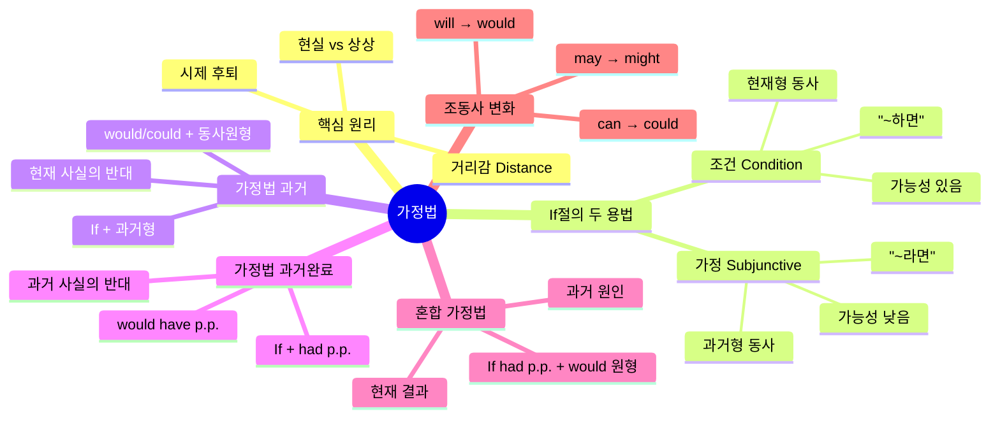
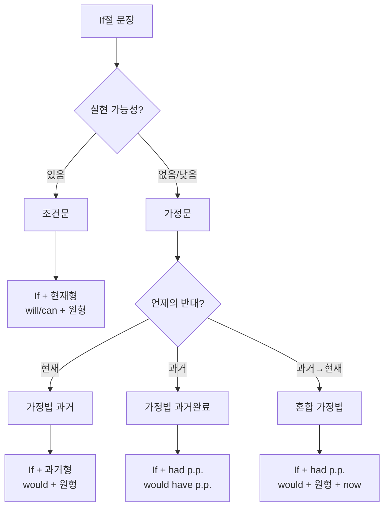

> [!quote] 한 줄 핵심
> **가정법의 본질은 "거리감"이다** — 현실과 거리가 먼 상황일수록 시제를 한 단계씩 과거로 당겨서 표현한다.

---

## 영상 소스

<iframe width="560" height="315" src="https://www.youtube.com/embed/cb_3tYgqksQ" frameborder="0" allowfullscreen></iframe>

<iframe width="560" height="315" src="https://www.youtube.com/embed/IXBACZv5KBQ" frameborder="0" allowfullscreen></iframe>

---

## 목차

1. [[#개요]]
2. [[#마인드맵]]
3. [[#Chapter 1 조건 vs 가정 - 가장 중요한 구별]]
4. [[#Chapter 2 가정법의 핵심 원리 - 거리감]]
5. [[#Chapter 3 가정법 과거 - 현재 사실의 반대]]
6. [[#Chapter 4 가정법 과거완료 - 과거 사실의 반대]]
7. [[#Chapter 5 혼합 가정법 - 과거 원인 현재 결과]]
8. [[#핵심 패턴 정리]]
9. [[#실전 연습]]
10. [[#용어 사전]]
11. [[#암기 포인트]]
12. [[#셀프테스트]]
13. [[#종합 정리]]
14. [[#보충자료]]
15. [[#내 생각 및 연결]]

---

## 개요

가정법은 "사실이 아닌 것을 사실인 것처럼 표현하는 문법"이다. 한국어에서는 어미 변화(-라면, -할 텐데)로 가정을 나타내지만, 영어에서는 **동사의 시제를 과거로 당겨서** 현실과의 거리감을 표현한다. 핵심은 "가정법 과거 = 과거 시제"가 아니라 "가정법 과거 = 현재 사실의 반대를 과거형으로 표현"이라는 점이다. 즉, 시제 명칭에 혼동하지 말고 **거리감을 주는 장치**로 이해해야 한다. 조건(일어날 가능성 있음)과 가정(일어날 가능성 거의 없음)을 구별하는 것이 첫 번째 관문이며, 이 구별만 명확히 하면 나머지는 패턴 적용이다.

---

## 마인드맵



---

## Chapter 1: 조건 vs 가정 - 가장 중요한 구별
> 난이도: 🟢 기초

### 핵심 개념

If절이 항상 가정법인 것은 아니다. **조건**과 **가정**은 완전히 다른 개념이다.

| 구분 | 조건 (Condition) | 가정 (Subjunctive) |
|------|------------------|-------------------|
| 가능성 | 충분히 일어날 수 있음 | 거의 일어날 수 없음 |
| 동사 형태 | **현재형** | **과거형** |
| 느낌 | 실현 가능한 약속/계획 | 상상, 후회, 아쉬움 |

### 예문 비교

```
[조건 - 현재형]
If you study hard, you will pass the exam.
(열심히 공부하면, 시험에 붙을 거야) → 실현 가능

[가정 - 과거형]
If you studied hard, you would pass the exam.
(열심히 공부한다면, 시험에 붙을 텐데) → 현재 안 하고 있음을 암시
```

### 실생활 구별 테스트

> "시험 100점 맞으면 핸드폰 바꿔줄게"

- 100점 맞을 가능성이 있다고 보는가? → **조건** → 현재형
- If you get 100 on the test, I will buy you a new phone.

> "내가 너라면 그 일 안 할 텐데"

- 내가 너일 수 있는가? → **불가능** → **가정** → 과거형
- If I were you, I wouldn't do that.

### 흔한 실수

> [!warning] 주의
> "가정법에는 무조건 would를 쓴다"는 잘못된 공식화.
> 조건문에서는 will을 쓰고, 가정문에서만 would를 쓴다.

---

## Chapter 2: 가정법의 핵심 원리 - 거리감
> 난이도: 🟢 기초

### 핵심 개념: 거리감 (Distance)

원어민이 가정법을 이해하는 방식의 핵심 키워드는 **"거리감"**이다.

```
현실 ←―――――――― 거리감 ―――――――→ 상상
(fact)                              (imagination)
```

- 한국어: 어미로 거리감 표현 ("-라면", "-할 텐데")
- 영어: **시제를 과거로 당겨서** 거리감 표현

### 시제 후퇴의 원리

| 말하고 싶은 시점 | 사용하는 시제 | 거리감 |
|-----------------|--------------|--------|
| 현재 상황의 반대 | 과거형 | 한 단계 후퇴 |
| 과거 상황의 반대 | 과거완료형 | 두 단계 후퇴 |

### 왜 과거형이 "거리감"을 주는가?

과거는 이미 지나간 것 → 현재와 **분리됨** → 분리 = 거리
따라서 과거 시제는 시간적 과거뿐 아니라 **심리적 거리**도 나타낸다.

```
현재형: I want... (직접적, 가까움)
과거형: I wanted... / I would want... (간접적, 거리감)
```

### 거리감의 뉘앙스

가정법이 전달하는 감정:
- **후회**: 그때 그랬더라면...
- **아쉬움**: 지금 그럴 수 있다면...
- **부러움**: 나도 그렇다면...
- **추측**: 혹시 그렇다면...

---

## Chapter 3: 가정법 과거 - 현재 사실의 반대
> 난이도: 🟡 중급

### 공식

```
If + 주어 + 동사 과거형, 주어 + would/could/might + 동사원형
```

### 이름의 함정

> [!danger] 중요
> **"가정법 과거"는 과거 이야기가 아니다!**
> "현재 사실의 반대"를 "과거 형태"로 표현하는 것이다.

### 조동사 과거형 변화표

| 현재 | 과거 (가정법) | 뉘앙스 |
|------|--------------|--------|
| will | **would** | ~할 텐데 |
| can | **could** | ~할 수 있을 텐데 |
| may | **might** | ~일지도 모를 텐데 |
| shall | **should** | ~해야 할 텐데 |

### 핵심 예문

```
[현재 사실]
I don't study. My grade is bad.
(나는 공부를 안 한다. 성적이 나쁘다.)

[가정법 과거 - 현재의 반대]
If I studied, my grade would be good.
(만약 내가 공부를 한다면, 성적이 좋을 텐데.)
→ 실제로는 공부 안 하고 있음
```

```
[현재 사실]
I am not Taylor Swift's husband. I am not happy.

[가정법 과거]
If I married Taylor Swift, I would be happy.
(테일러 스위프트와 결혼한다면 행복할 텐데.)
→ 현실적으로 불가능한 상상
```

### be동사의 특별 규칙

가정법에서 be동사는 인칭에 관계없이 **were** 사용 (격식체)

```
If I were you, I would accept the job.
(내가 너라면, 그 일을 받아들일 텐데.)

If he were here, he would help us.
(그가 여기 있다면, 우리를 도울 텐데.)
```

> [!tip] 구어체
> 일상 회화에서는 "If I was..."도 허용되지만, 시험과 격식 상황에서는 were 사용

### 실전 패턴 연습

| 한국어 | 영어 |
|--------|------|
| 내가 너라면 그 일을 받아들일 텐데 | If I were you, I would accept the job. |
| 그들이 진실을 안다면 속상해할 텐데 | If they knew the truth, they would be upset. |
| 뉴욕에 산다면 매주 센트럴파크에 갈 텐데 | If I lived in New York, I would go to Central Park every weekend. |
| 돈이 있다면 세계여행을 할 텐데 | If I had money, I would travel around the world. |

---

## Chapter 4: 가정법 과거완료 - 과거 사실의 반대
> 난이도: 🔴 고급

### 공식

```
If + 주어 + had + p.p., 주어 + would/could/might + have + p.p.
```

### 거리감 원리 적용

과거 상황을 가정 → 그보다 **한 단계 더 과거** = 과거완료

```
과거 ←――― 거리감 ―――→ 과거완료
(실제 일어난 일)        (상상하는 일)
```

### 핵심 예문

```
[과거 사실]
You didn't come to the party. I wasn't happy.
(너는 파티에 안 왔다. 나는 행복하지 않았다.)

[가정법 과거완료 - 과거의 반대]
If you had come to the party, I would have been happy.
(네가 파티에 왔었다면, 나는 행복했을 텐데.)
→ 실제로는 안 왔고, 그래서 행복하지 않았음
```

```
[과거 사실]
I didn't know Trendy earlier. My English didn't improve fast.

[가정법 과거완료]
If I had known Trendy earlier, my English would have improved much faster.
(트랭디를 더 일찍 알았더라면, 영어가 훨씬 빨리 늘었을 텐데.)
```

### 조동사 변화 (과거완료)

| 가정법 과거 | 가정법 과거완료 |
|------------|----------------|
| would + 동사원형 | would **have** + p.p. |
| could + 동사원형 | could **have** + p.p. |
| might + 동사원형 | might **have** + p.p. |

### 실전 패턴 연습

| 한국어 | 영어 |
|--------|------|
| 그가 사과했더라면 그녀가 용서했을지도 몰라 | If he had apologized, she might have forgiven him. |
| 일찍 출발했더라면 비행기를 놓치지 않았을 텐데 | If I had left earlier, I wouldn't have missed the flight. |
| 그 말을 안 했더라면 상황이 달랐을 텐데 | If I hadn't said that, things would have been different. |

### 흔한 실수

> [!warning] 주의
> 1. had를 빼먹는 실수: ~~If you came~~ → If you **had** come
> 2. have를 빼먹는 실수: ~~I would been~~ → I would **have** been
> 3. 축약형 혼동: would've = would have (would of 아님!)

---

## Chapter 5: 혼합 가정법 - 과거 원인, 현재 결과
> 난이도: 🔴 고급

### 개념

과거의 가정이 현재의 결과로 이어질 때 사용

```
If + 주어 + had p.p., 주어 + would + 동사원형 (+ now)
   [과거 가정]              [현재 결과]
```

### 핵심 예문

```
[상황]
과거: 너는 파티에 안 왔다
현재: 나는 (지금) 행복하지 않다

[혼합 가정법]
If you had come to the party, I would be happy now.
(네가 파티에 왔었다면, 내가 지금 행복할 텐데.)
```

### 비교 정리

| 유형 | If절 | 주절 | 의미 |
|------|------|------|------|
| 가정법 과거 | 과거형 | would + 원형 | 현재→현재 |
| 가정법 과거완료 | had p.p. | would have p.p. | 과거→과거 |
| 혼합 가정법 | had p.p. | would + 원형 | 과거→현재 |

---

## 핵심 패턴 정리

### 가정법 전체 구조표

| 구분 | If절 동사 | 주절 조동사 | 시간 관계 | 예문 |
|------|----------|------------|----------|------|
| 조건 | 현재형 | will/can | 미래 가능성 | If it rains, I will stay home. |
| 가정법 과거 | 과거형 | would/could | 현재 반대 | If it rained, I would stay home. |
| 가정법 과거완료 | had p.p. | would have p.p. | 과거 반대 | If it had rained, I would have stayed home. |
| 혼합 가정법 | had p.p. | would + 원형 | 과거→현재 | If it had rained, the ground would be wet now. |

### 빈출 표현 패턴

| 패턴 | 의미 | 예문 |
|------|------|------|
| If I were you | 내가 너라면 | If I were you, I would quit. |
| I wish + 과거형 | ~라면 좋을 텐데 | I wish I had more time. |
| I wish + had p.p. | ~했더라면 좋았을 텐데 | I wish I had studied harder. |
| as if + 과거형 | 마치 ~인 것처럼 | He acts as if he knew everything. |
| If only + 과거형 | ~라면 얼마나 좋을까 | If only I could fly! |

---

## 실전 연습

### Exercise 1: 빈칸 채우기

1. If I _______ (be) rich, I would travel the world.
2. If she _______ (study) harder, she would have passed.
3. If they _______ (know) the answer, they would tell us.
4. If he _______ (arrive) on time, we wouldn't have missed the movie.
5. If I _______ (can) speak French, I would move to Paris.

<details>
<summary>정답 확인</summary>

1. **were** (가정법 과거 - be동사)
2. **had studied** (가정법 과거완료)
3. **knew** (가정법 과거)
4. **had arrived** (가정법 과거완료)
5. **could** (가정법 과거 - 조동사)

</details>

### Exercise 2: 문장 변환

다음 사실을 가정법으로 바꾸세요.

1. I don't have a car. I can't drive to work.
   → If I ______________________

2. He didn't listen to me. He failed.
   → If he ______________________

3. She isn't here. She can't help us.
   → If she ______________________

<details>
<summary>정답 확인</summary>

1. If I **had** a car, I **could drive** to work.
2. If he **had listened** to me, he **wouldn't have failed**.
3. If she **were** here, she **could help** us.

</details>

### Exercise 3: 조건 vs 가정 구별

다음 문장이 조건인지 가정인지 판단하세요.

1. If it rains tomorrow, the game will be canceled. ( )
2. If I won the lottery, I would buy a house. ( )
3. If you finish your homework, you can watch TV. ( )
4. If I were a bird, I could fly away. ( )

<details>
<summary>정답 확인</summary>

1. **조건** (내일 비 올 가능성 있음)
2. **가정** (복권 당첨 가능성 낮음)
3. **조건** (숙제 끝낼 가능성 있음)
4. **가정** (새가 될 수 없음)

</details>

---

## 용어 사전

| 용어 | 영어 | 설명 |
|------|------|------|
| 가정법 | Subjunctive Mood | 사실이 아닌 것을 가정하여 표현하는 문법 |
| 조건 | Condition | 실현 가능성이 있는 상황 |
| 가정법 과거 | Past Subjunctive | 현재 사실의 반대를 과거형으로 표현 |
| 가정법 과거완료 | Past Perfect Subjunctive | 과거 사실의 반대를 과거완료형으로 표현 |
| 혼합 가정법 | Mixed Conditional | 과거 가정 + 현재 결과 |
| 거리감 | Distance | 현실과 상상 사이의 심리적 간격 |
| If절 | If-clause | 조건/가정을 나타내는 종속절 |
| 주절 | Main clause | 결과를 나타내는 주된 문장 |

---

## 암기 포인트

### ★★★ 최우선 암기

1. **조건 = 현재형 / 가정 = 과거형**
2. **가정법의 핵심 = 거리감 (시제 한 단계 후퇴)**
3. **If I were you** (be동사는 were로 통일)

### ★★ 중요 암기

4. 가정법 과거: If + 과거형, would + 원형
5. 가정법 과거완료: If + had p.p., would have p.p.
6. 조동사 변화: will→would, can→could, may→might

### ★ 참고 암기

7. 혼합 가정법: If + had p.p., would + 원형 (+ now)
8. 축약형: would've = would have (would of 아님!)

---

## 셀프테스트

### Q1. 다음 중 가정법 과거 문장은?
- A) If it rains, I will stay home.
- B) If it rained, I would stay home.
- C) If it had rained, I would have stayed home.

### Q2. "내가 너라면"을 영어로?
- A) If I was you
- B) If I were you
- C) If I am you

### Q3. 가정법에서 시제를 과거로 당기는 이유는?
- A) 과거 이야기를 하기 위해
- B) 현실과의 거리감을 표현하기 위해
- C) 문법 규칙이니까

### Q4. 빈칸: If I ___ rich, I would buy a mansion.
- A) am
- B) was
- C) were

### Q5. "그가 왔었다면 재미있었을 텐데"를 영어로?
- A) If he came, it would be fun.
- B) If he had come, it would have been fun.
- C) If he comes, it will be fun.

### Q6. 조건과 가정의 차이점은?
- A) 문법 구조
- B) 실현 가능성
- C) 문장 길이

### Q7. 혼합 가정법의 구조는?
- A) If 과거형 + would 원형
- B) If had p.p. + would have p.p.
- C) If had p.p. + would 원형

<details>
<summary>정답 확인</summary>

1. **B** - 과거형 + would 원형
2. **B** - 가정법에서 be동사는 were
3. **B** - 거리감 표현이 핵심
4. **C** - 가정법에서 be동사는 were
5. **B** - 과거 사실의 반대 = 가정법 과거완료
6. **B** - 조건은 가능성 있음, 가정은 가능성 낮음
7. **C** - 과거 가정 + 현재 결과

</details>

---

## 종합 정리



### 3줄 요약

1. **가정법의 본질은 "거리감"** — 현실과 거리가 먼 상황을 시제 후퇴로 표현한다.
2. **조건(가능성 있음)은 현재형, 가정(가능성 낮음)은 과거형**을 사용한다.
3. **현재의 반대 = 과거형, 과거의 반대 = 과거완료형**으로 한 단계씩 후퇴한다.

---

## 보충자료

> [!tip] 온라인 학습 자료
> - [Subjunctive Mood - Lingolia](https://english.lingolia.com/en/grammar/verbs/subjunctive) - 가정법 기본 개념 및 연습문제
> - [Subjunctive in Conditional Sentences - DilEnglish](https://dilenglish.com/grammar/subjunctive-mood-in-conditional-sentences/) - 조건문에서의 가정법
> - [Conditional vs. Subjunctive Mood - Study.com](https://study.com/academy/lesson/using-verbs-in-the-conditional-and-subjunctive-moods.html) - 조건법 vs 가정법 비교
> - [Grammar Moods - MyEnglishPages](https://www.myenglishpages.com/grammar-moods-in-english-with-examples/) - 영어 5가지 법(mood) 총정리
> - [Subjunctive Mood - Grammar Monster](https://www.grammar-monster.com/glossary/subjunctive_mood.htm) - 가정법 상세 설명

---

## 내 생각 및 연결

> [!abstract] 메모 공간
>
>
>

### 연결 노트
- [[나머지/도구와 자동화/AI Agent/Yt-to-Note/YT-english-260310-수동태-완전정복|수동태 완전정복]] - 함께 학습하면 좋은 영문법 노트

---

*Generated from YouTube learning notes - 가정법 완전정복*