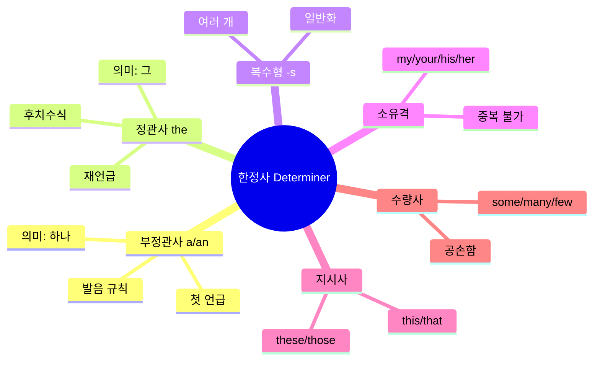
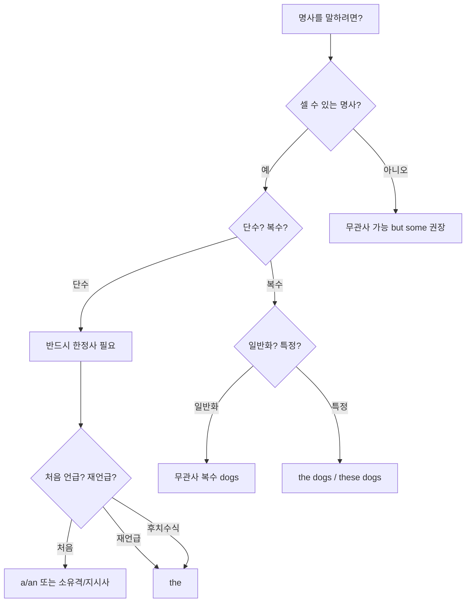

# 명사의 세계 - 한정사(Determiner) 완전정복

> **채널**: 나의 영어 종착지. 리얼딜 | **시청일**: 2026-03-15

<iframe width="560" height="315" src="https://www.youtube.com/embed/bbtqScToMYM" frameborder="0" allowfullscreen></iframe>

---

## 목차

- [[#개요]]
- [[#Chapter 1 한정사의 개념과 중요성|Chapter 1. 한정사의 개념과 중요성]] `🟢 기초`
- [[#Chapter 2 a/an의 기본 원리와 발음 규칙|Chapter 2. a/an의 기본 원리와 발음 규칙]] `🟢 기초`
- [[#Chapter 3 the(정관사)의 사용과 차이|Chapter 3. the(정관사)의 사용과 차이]] `🟡 중급`
- [[#Chapter 4 복수형(-s)과 일반화|Chapter 4. 복수형(-s)과 일반화]] `🟡 중급`
- [[#Chapter 5 소유격, 지시사, 수량사|Chapter 5. 소유격, 지시사, 수량사]] `🔴 심화`
- [[#종합 정리]]
- [[#핵심 표현 카드]]
- [[#용어/문법 사전]]
- [[#학습 체크리스트]]
- [[#보충자료]]
- [[#내 생각 & 연결]]

---

## 개요

> **한 줄 핵심**: 영어는 명사 앞에 범위/단위를 반드시 결정하는 '병적인 습관'이 있으므로, 한정사(a/an, the, 복수형, 소유격, 지시사, 수량사)를 상황에 맞게 선택해야 자연스러운 영어가 된다.

한국어는 "나 어제 친구 만났어"처럼 한정사 없이 소통이 가능하지만, 영어는 "I met a friend / the friend / my friend / friends"처럼 반드시 명사를 한정해야 한다. 한국어 화자는 이러한 '범위 결정'에 익숙하지 않아 한정사를 아예 생략하거나 잘못 사용하는 실수가 빈번하다. 이 강의는 단순히 "a는 부정관사, the는 정관사"라는 암기 방식이 아니라, 각 한정사가 주는 '느낌'과 '뉘앙스'를 이해하는 방식으로 접근한다. 이 규칙은 일상 대화, 비즈니스 영어, 시험 영어 모든 영역에서 매 문장마다 적용되므로, 체득하면 영어 전반의 자연스러움이 크게 향상된다.

### 마인드맵



### 암기 포인트

| 중요도 | 규칙/패턴 | 핵심 | 예문 |
|:------:|----------|------|------|
| ★★★ | 셀 수 있는 단수 명사는 무조건 한정사 필요 | Man (X) → A man (O) | I met friend (X) → I met a friend (O) |
| ★★★ | a/an은 발음(알파벳 아님)에 따라 선택 | 단모음 앞 an | a university (유-), an F1 (에프-) |
| ★★★ | the는 '그'의 의미, 상대방이 알고 있는 것 | 재언급/후치수식 | I met a girl. The girl was talkative. |
| ★★★ | 복수형(-s)은 일반적 상황 표현 | 일반화 vs 특정 | Do you like dogs? (일반) vs a dog (특정) |
| ★★☆ | 한정사는 중복 사용 불가 | 하나만 선택 | a my friend (X) → my friend (O) |
| ★★☆ | some은 '좀'의 느낌으로 공손함 추가 | 부드러운 요청 | Give me some coffee (자연스러움) |

### 구간 가이드

| 구간 | 챕터 | 난이도 | 주제 |
|------|------|:------:|------|
| 0:00~9:00 | Chapter 1 | 🟢 기초 | 한정사의 개념, 영어와 한국어의 근본적 차이 |
| 9:00~22:00 | Chapter 2 | 🟢 기초 | a/an의 '하나' 의미, 발음 기반 선택 규칙 |
| 22:00~32:00 | Chapter 3 | 🟡 중급 | the의 '그' 의미, 후치수식, a/an과의 차이 |
| 32:00~46:00 | Chapter 4 | 🟡 중급 | 복수형으로 일반화 표현, a vs 복수형 차이 |
| 46:00~58:00 | Chapter 5 | 🔴 심화 | 소유격/지시사/수량사의 역할, 한정사 통합 이해 |

### 이해도 체크

- [ ] 개요를 읽고 이 영상의 핵심 학습 목표를 설명할 수 있다
- [ ] 마인드맵의 각 한정사 종류가 무엇인지 이해했다
- [ ] 암기 포인트의 ★★★ 항목을 보지 않고 예문과 함께 말할 수 있다

---

## Chapter 1. 한정사(Determiner)의 개념과 중요성 `🟢 기초`

<iframe width="560" height="315" src="https://www.youtube.com/embed/bbtqScToMYM?start=0&end=540" frameborder="0" allowfullscreen></iframe>

### 왜 이게 어려운가

한국어에는 영어의 '한정사'에 해당하는 필수 요소가 없다. 한국어는 "사과 먹어라", "나 친구 만났어"처럼 명사 앞에 아무것도 붙이지 않아도 완벽하게 소통된다. 맥락에서 '알잘딱깔센'으로 파악하기 때문이다. 그러나 영어는 명사를 말할 때 반드시 "몇 개인지, 어떤 것인지"를 명확히 해야 하는 '병적인 습관'이 있다. 한국 영어 교육에서는 "a는 부정관사, the는 정관사"라고 단순 암기시키지만, 이 방식으로는 실제 상황에서 어떤 것을 써야 할지 직관적으로 판단하기 어렵다.

### 규칙 설명

**한정사(Determiner)**란 명사 앞에 위치하여 명사의 **범위나 단위를 결정**하는 역할을 하는 말이다. 영어로 'determine'은 '결정하다'라는 뜻이므로, 한정사는 "이 명사가 하나인지, 여러 개인지, 특정한 것인지, 일반적인 것인지"를 결정해 주는 품사다.

한정사의 종류:
1. **관사**: a, an, the
2. **소유격**: my, your, his, her, its, our, their
3. **지시사**: this, that, these, those
4. **수량사**: some, any, many, much, few, little, several...

중요한 원칙: **셀 수 있는 단수 명사 앞에는 반드시 한정사가 필요하다.**

```
❌ Man called me.
✅ A man called me. / The man called me. / My man called me.
```

### 패턴 구조

```
기본 패턴:  한정사 + 명사
           a man / the car / my friend / this book / some water

선택 원칙:  셀 수 있는 단수 → 반드시 한정사 필요
           셀 수 없는 명사 → 무관사 가능 (but some 등 권장)
           복수 명사 → 무관사 가능 (일반화) 또는 the/these 등
```

### 예문 분석

**기본 예문:**

| 영어 | 한국어 | 포인트 |
|------|--------|--------|
| I met a friend yesterday. | 나 어제 친구 만났어. | 한국어는 한정사 없이 가능, 영어는 a/my/the 필수 |
| a man, the man, my man, this man | 한 남자, 그 남자, 내 남자, 이 남자 | 같은 명사에 다른 한정사 = 다른 의미 |
| Eat apples. | 사과 먹어라. | 복수형은 일반화. 한국어는 '사과 먹어라'로 충분 |

**한국인이 자주 하는 실수:**

| ❌ 틀린 표현 | ⭕ 올바른 표현 | 왜 틀리는가 |
|-------------|--------------|------------|
| Man called me. | A man called me. | 한국어 습관대로 한정사 생략 |
| I met friend. | I met a friend / my friend. | 셀 수 있는 단수 명사에 한정사 필수 |
| I like apple. | I like apples. / I like an apple. | 한정사 없는 셀 수 있는 단수는 비문법 |

### Chapter 1 이해도 체크

- [ ] 한정사(Determiner)의 정의를 설명할 수 있다
- [ ] 영어가 한정사를 필수로 쓰는 이유(한국어와의 차이)를 이해했다
- [ ] 한정사의 4가지 종류(관사, 소유격, 지시사, 수량사)를 나열할 수 있다
- [ ] "Man called me"가 왜 틀린지 설명할 수 있다

---

## Chapter 2. a/an의 기본 원리와 발음 규칙 `🟢 기초`

<iframe width="560" height="315" src="https://www.youtube.com/embed/bbtqScToMYM?start=540&end=1320" frameborder="0" allowfullscreen></iframe>

### 왜 이게 어려운가

한국 학교에서는 "모음 앞에 an, 자음 앞에 a"라고 배우지만, 이것은 **알파벳**이 아니라 **발음** 기준이다. 이 차이를 제대로 배우지 못하면 "an university" 같은 오류를 계속 범하게 된다. 또한 a/an의 핵심 의미가 '하나(one)'라는 것을 인식하지 못하면, 복수형이나 the와의 차이를 직관적으로 구분하기 어렵다.

### 규칙 설명

**a/an의 핵심 의미**: '하나(one)' — 셀 수 있는 명사 중 단수에만 사용

**a vs an 선택 기준**: 다음에 오는 단어의 **발음**이 단모음으로 시작하면 an, 그렇지 않으면 a

- **단모음**: ㅏ, ㅔ, ㅣ, ㅗ, ㅜ 계열 발음 (apple, egg, ice, orange, umbrella)
- **이중모음**: '유', '와' 등 복합 발음 (university → 유니버시티)

**a/an의 용도**: 상대방이 모르는 것, 처음 언급하는 것

원어민의 사고방식: "상대방이 이게 뭔지 모르니까, 일단 '어떤 하나'라고 말해줘야지"

### 패턴 구조

```
a + 자음 발음:     a car, a house, a university (유-), a one-year-old (원-)
an + 단모음 발음:  an apple (애-), an hour (아-, h묵음), an F1 (에프-), an MP3 (엠-)

첫 언급 → a/an:    I met a girl this morning.
재언급 → the:      The girl was talkative.
```

### 예문 분석

**기본 예문:**

| 영어 | 한국어 | 포인트 |
|------|--------|--------|
| a university | 한 대학 | u로 시작하지만 발음이 '유-'이므로 a |
| an F1 race | F1 레이스 | F는 자음이지만 '에프'로 발음되므로 an |
| an MP3 file | MP3 파일 | M은 자음이지만 '엠'으로 발음되므로 an |
| an hour | 한 시간 | h가 묵음이므로 '아워'로 시작 → an |

**뉘앙스 비교:**

| 표현 | 뉘앙스 | 적합한 상황 | 예문 |
|------|--------|------------|------|
| a man called me | 어떤 남자가 전화했어 (상대방 모름) | 처음 언급 | 누군지 모르는 남자 |
| the man called me | 그 남자가 전화했어 (상대방 알고 있음) | 재언급/서로 아는 사람 | 앞서 말한 그 남자 |

**한국인이 자주 하는 실수:**

| ❌ 틀린 표현 | ⭕ 올바른 표현 | 왜 틀리는가 |
|-------------|--------------|------------|
| an university | a university | 알파벳 아닌 발음 기준. '유-'는 이중모음 |
| a F1 race | an F1 race | F의 발음은 '에프'로 단모음 시작 |
| a hour | an hour | h가 묵음이므로 '아워'로 시작 |

### Chapter 2 이해도 체크

- [x] a/an의 핵심 의미가 '하나'임을 이해했다 ✅ 2026-03-15
- [x] a와 an 선택이 알파벳이 아닌 발음 기준임을 숙지했다 ✅ 2026-03-15
- [x] "a university"와 "an hour"가 왜 그런지 설명할 수 있다 ✅ 2026-03-15
- [x] 첫 언급 → a/an, 재언급 → the 패턴을 기억한다 ✅ 2026-03-15

---

## Chapter 3. the(정관사)의 사용과 차이 `🟡 중급`

<iframe width="560" height="315" src="https://www.youtube.com/embed/bbtqScToMYM?start=1320&end=1920" frameborder="0" allowfullscreen></iframe>

### 왜 이게 어려운가

the를 "정관사"라고 배우면 "특정한 것"이라는 모호한 개념에 갇히게 된다. Chapter 2의 a/an과 어떻게 다른지, 언제 the를 써야 하는지 직관적으로 판단하기 어렵다. 특히 **후치수식**(뒤에서 명사를 한정하는 구문)이 있을 때 처음 언급에도 the를 쓴다는 규칙은 한국어에 없는 개념이라 혼란스럽다.

### 규칙 설명

**the의 핵심 의미**: '그(that)' — 상대방이 알고 있는 것을 지칭

**the의 사용 조건**:
1. **재언급**: 앞서 a/an으로 언급한 것을 다시 말할 때
2. **공유 지식**: 상대방도 알고 있는 특정한 것
3. **후치수식**: 관계절이나 전치사구가 명사를 한정할 때

**the의 발음**:
- 자음 발음 앞: /ðə/ (더) — the car, the book
- 모음 발음 앞: /ði:/ (디) — the apple, the end (강조 시)

**중요**: the는 셀 수 있거나 없거나, 단수/복수 모두 사용 가능 (a/an은 셀 수 있는 단수만)

### 패턴 구조

```
재언급:        I met a girl. → The girl was talkative.
공유 지식:     Please get me the pen. (서로 아는 특정 펜)
후치수식:      I read the book [you recommended]. (관계절이 한정)
              The car [your mom drives] is old. (관계절이 한정)
```

### 예문 분석

**기본 예문:**

| 영어 | 한국어 | 포인트 |
|------|--------|--------|
| I met a girl. The girl was talkative. | 어떤 여자를 만났어. 그 여자는 말이 많더라. | 첫 언급 a → 재언급 the |
| I read the book you recommended. | 네가 추천한 그 책을 읽었어. | 후치수식으로 한정 → 첫 언급에도 the |
| Please get me the pen. | 그 펜 좀 갖다 주세요. | 서로 어떤 펜인지 알고 있음 |

**뉘앙스 비교:**

| 표현 | 뉘앙스 | 적합한 상황 | 예문 |
|------|--------|------------|------|
| a pen | 아무 펜이나 하나 | 어떤 펜이든 상관없을 때 | Can I borrow a pen? |
| the pen | 그 펜 (특정) | 서로 아는 특정 펜 | Please give me the pen (on the desk). |

**한국인이 자주 하는 실수:**

| ❌ 틀린 표현 | ⭕ 올바른 표현 | 왜 틀리는가 |
|-------------|--------------|------------|
| Please get me pen. | Please get me a pen / the pen. | 셀 수 있는 단수 명사에 한정사 필수 |
| Eric is English teacher. | Eric is an English teacher. | 직업 앞에도 한정사 필수 |
| I read book you recommended. | I read the book you recommended. | 후치수식이 있으면 the |

### Chapter 3 이해도 체크

- [x] the의 핵심 의미가 '그'임을 이해했다 ✅ 2026-03-15
- [x] the를 쓰는 3가지 조건(재언급, 공유 지식, 후치수식)을 나열할 수 있다 ✅ 2026-03-15
- [x] 후치수식이 있으면 첫 언급에도 the를 쓴다는 것을 숙지했다 ✅ 2026-03-15
- [x] a pen vs the pen의 뉘앙스 차이를 설명할 수 있다 ✅ 2026-03-15

---

## Chapter 4. 복수형(-s)과 일반화 `🟡 중급`

<iframe width="560" height="315" src="https://www.youtube.com/embed/bbtqScToMYM?start=1920&end=2760" frameborder="0" allowfullscreen></iframe>

### 왜 이게 어려운가

한국어는 단수와 복수를 문법적으로 구분하지 않는다. "개 좋아해?"라고 하면 개 일반, 특정 개 한 마리, 여러 마리 모두 될 수 있다. 그러나 영어에서 "Do you like dogs?"(복수)와 "Do you like a dog?"(단수)는 완전히 다른 질문이다. 이 차이를 이해하지 못하면 의도와 다른 의미를 전달하게 된다.

### 규칙 설명

**복수형(-s)의 핵심 기능**: 일반적인 상황, 일반화(generalization)를 표현

**원칙**:
- **일반화(종 전체, 범주 전체)** → 복수형 (무관사)
- **특정 하나** → a/an + 단수
- **특정 그것** → the + 단수/복수

원어민의 사고방식: "Do you like dogs?"라고 하면 '강아지'라는 종 전체에 대한 선호도를 묻는 것. "Do you like a dog?"라고 하면 '어떤 특정 개 한 마리'를 좋아하는지 묻는 것 (어색함).

### 패턴 구조

```
일반화:     Do you like dogs?       (강아지 좋아해? - 강아지 전반)
            I love taking pictures. (사진 찍기 좋아해 - 활동 전반)

특정 하나:  Do you like a dog?      (좋아하는 개 한 마리 있어? - 어색)
            I love taking a picture. (특정 사진 한 장 - 어색)

특정 그것:  Do you like the dog?    (그 개 좋아해? - 서로 아는 그 개)
```

### 예문 분석

**기본 예문:**

| 영어 | 한국어 | 포인트 |
|------|--------|--------|
| Do you like dogs? | 강아지 좋아해요? | 강아지라는 종 전체 (일반화) |
| Do you like a dog? | 좋아하는 개 있어요? | 특정 한 마리 (어색함) |
| Do you like the dog? | 그 개 좋아해요? | 서로 아는 특정 그 개 |
| I love taking pictures. | 사진 찍는 거 좋아해. | 사진 찍기라는 활동 전반 |

**뉘앙스 비교:**

| 표현 | 뉘앙스 | 적합한 상황 |
|------|--------|------------|
| Do you like dogs? | 강아지 좋아해? (종 전체) | 반려동물 선호도 질문 |
| Do you like a dog? | 좋아하는 개 있어? (특정 한 마리) | 거의 안 씀 (어색) |
| Do you like girls? | 여자 좋아해? (성적 지향) | 복수형 = 일반화 |
| Do you like a girl? | 좋아하는 여자 있어? (연애 질문) | a = 특정 한 명 |

**한국인이 자주 하는 실수:**

| ❌ 틀린 표현 | ⭕ 올바른 표현 | 왜 틀리는가 |
|-------------|--------------|------------|
| I love taking picture. | I love taking pictures. | 일반적 활동이므로 복수형 |
| Do you like dog? | Do you like dogs? | 한정사 없는 단수는 비문법 |
| I like coffee. | I like coffee. ✅ | 셀 수 없는 명사는 무관사 OK |

### Chapter 4 이해도 체크

- [ ] 복수형이 '일반화'를 표현한다는 것을 이해했다
- [ ] "Do you like dogs?"와 "Do you like a dog?"의 의미 차이를 설명할 수 있다
- [ ] "I love taking pictures"에서 왜 복수형인지 이해했다
- [ ] 셀 수 있는 단수 vs 복수 vs 셀 수 없는 명사의 한정사 규칙을 구분할 수 있다

---

## Chapter 5. 소유격, 지시사, 수량사 `🔴 심화`

<iframe width="560" height="315" src="https://www.youtube.com/embed/bbtqScToMYM?start=2760&end=3480" frameborder="0" allowfullscreen></iframe>

### 왜 이게 어려운가

a/an, the를 따로 배우고 my, this, some을 또 따로 배우면, 이것들이 모두 **같은 역할을 하는 한정사**라는 통합적 이해가 부족해진다. 그 결과 "a my friend"처럼 한정사를 중복 사용하는 실수를 범하거나, 상황에 맞는 한정사를 선택하지 못한다.

### 규칙 설명

**핵심 원칙**: 한정사는 서로 **대체 가능**하며, **중복 사용 불가**

| 한정사 종류 | 예시 | 역할 |
|------------|------|------|
| 관사 | a/an, the | 하나 / 그 |
| 소유격 | my, your, his, her | 누구의 |
| 지시사 | this, that, these, those | 이/저 (위치 지시) |
| 수량사 | some, many, few | 얼마나 |

**소유격 (my/your/his/her)**: a/an/the와 같은 한정사 역할 → 함께 쓸 수 없음
- ❌ a my friend
- ✅ my friend

**지시사 (this/that)**: '이것/저것'이 아니라 '이/저' (형용사 역할)
- this car = 이 차 (눈앞)
- that car = 저 차 (멀리/앞서 언급)
- the car your mom drives = 엄마가 운전하는 그 차 (후치수식)

**수량사 (some)**: '좀'의 느낌으로 공손함 추가
- Give me coffee. (딱딱함)
- Give me some coffee. (부드러움, 자연스러움)

### 패턴 구조

```
한정사 선택 (하나만):
  a dog / the dog / my dog / this dog / some dogs
  ↑       ↑         ↑        ↑          ↑
  하나    그       나의     이        좀/몇몇

중복 불가:
  ❌ a my friend  →  ✅ my friend
  ❌ the this car →  ✅ this car
```

### 예문 분석

**기본 예문:**

| 영어 | 한국어 | 포인트 |
|------|--------|--------|
| Look at my dog. / Look at the dog. / Look at a dog. | 내 개 봐 / 그 개 봐 / 개 한 마리 봐 | 셋 중 하나만 선택 |
| This car is too expensive. | 이 차는 너무 비싸. | this = 눈앞의 것 |
| That car is old. | 저 차는 오래됐어. | that = 멀리/앞서 언급 |
| Give me some coffee. | 커피 좀 주세요. | some = 공손함 추가 |

**뉘앙스 비교:**

| 표현 | 뉘앙스 | 적합한 상황 |
|------|--------|------------|
| Give me coffee. | 커피 주세요 (딱딱함) | 문법적으로 맞지만 무뚝뚝 |
| Give me some coffee. | 커피 좀 주세요 (자연스러움) | 일상에서 권장 |
| I got an email. | 이메일 하나 받았어 | 특정되지 않은 하나 |
| I got the email. | 그 이메일 받았어 | 서로 아는 특정 이메일 |
| I got your email. | 네 이메일 받았어 | 상대방이 보낸 이메일 |

**한국인이 자주 하는 실수:**

| ❌ 틀린 표현 | ⭕ 올바른 표현 | 왜 틀리는가 |
|-------------|--------------|------------|
| a my friend | my friend | 한정사 중복 불가 |
| Look at dog. | Look at a/the/my/this dog. | 셀 수 있는 단수에 한정사 필수 |
| I got email. | I got an email / the email / your email. | 한정사 필수 |

### Chapter 5 이해도 체크

- [ ] 한정사는 서로 대체 가능하며 중복 불가임을 이해했다
- [ ] "a my friend"가 왜 틀린지 설명할 수 있다
- [ ] this vs that vs the의 차이를 설명할 수 있다
- [ ] some이 주는 공손함의 느낌을 이해했다

---

## 종합 정리

이 강의는 영어의 '관사'를 더 큰 개념인 '한정사(Determiner)'로 접근하여 전체 체계를 이해하는 방식이다.

### 핵심 연결 구조



**왜 이 순서가 중요한가:**
1. **한정사 개념 없이** a/the만 배우면 '특정/불특정'이라는 모호한 설명에 갇힘
2. **복수형을 이해해야** a/an의 '하나' 의미가 명확해짐
3. **모든 한정사가 같은 역할**임을 알아야 "a my friend" 같은 실수를 안 함

### 실전 적용 5원칙

1. **셀 수 있는 단수 명사는 무조건 한정사 필요**
2. **일반적 상황은 복수형, 특정은 a/an/the**
3. **처음 언급은 a/an, 재언급은 the**
4. **후치수식이 있으면 처음에도 the**
5. **공손하게 말할 때는 some 추가**

---

## 핵심 표현 카드

> **Expression 1**: Determiner + Countable Singular Noun
> **Meaning**: 셀 수 있는 단수 명사 앞에는 반드시 한정사(a/an/the/my/this 등)가 필요
> **Example**: *A man called me.* (O) / *Man called me.* (X)
> **Note**: 영어의 '병적인 습관' — 반드시 범위/단위를 결정해야 함

> **Expression 2**: 발음 기준 a/an 선택
> **Meaning**: 알파벳이 아닌 발음이 단모음이면 an, 아니면 a
> **Example**: *a university* (유-), *an hour* (아-)
> **Note**: F, M, S 등은 발음이 '에프', '엠', '에스'로 시작하므로 an

> **Expression 3**: 첫 언급 a → 재언급 the
> **Meaning**: 상대방이 모르면 a/an, 알게 되면 the로 전환
> **Example**: *I met a girl. The girl was talkative.*
> **Note**: 후치수식이 있으면 첫 언급에도 the 가능

> **Expression 4**: 복수형 = 일반화
> **Meaning**: 종 전체, 범주 전체를 말할 때 복수형 사용
> **Example**: *Do you like dogs?* (강아지 좋아해? - 일반)
> **Note**: *Do you like a dog?*는 특정 한 마리를 묻는 어색한 질문

> **Expression 5**: some = 좀 (공손함)
> **Meaning**: 셀 수 있거나 없거나 모두 사용, 부드러운 느낌 추가
> **Example**: *Give me some coffee.* (자연스러움) vs *Give me coffee.* (딱딱함)
> **Note**: 한국어의 '좀'과 역할이 유사

---

## 용어/문법 사전

| 용어 | 설명 | 예문 |
|------|------|------|
| 한정사 (Determiner) | 명사 앞에서 범위/단위를 결정하는 품사. 관사, 소유격, 지시사, 수량사 포함 | a/the/my/this/some + man |
| 부정관사 (Indefinite Article) | a/an. '하나'의 의미. 셀 수 있는 단수에만 사용 | I met **a** girl. |
| 정관사 (Definite Article) | the. '그'의 의미. 상대방이 아는 것, 재언급, 후치수식에 사용 | **The** girl was talkative. |
| 후치수식 (Post-modification) | 명사 뒤에서 관계절/전치사구로 한정. 첫 언급에도 the 사용 | the book **you recommended** |
| 무관사 (Zero Article) | 한정사 없이 사용. 셀 수 없는 명사나 복수형 일반화에 가능 | I like **coffee**. / **Dogs** are loyal. |
| 일반화 (Generalization) | 특정이 아닌 종/범주 전체. 복수형으로 표현 | Do you like **dogs**? |
| 소유격 (Possessive) | my/your/his/her 등. 한정사 역할이므로 a/the와 중복 불가 | **my** friend (O), a my friend (X) |
| 지시사 (Demonstrative) | this/that/these/those. '이/저' (형용사 역할) | **this** car, **that** car |
| 수량사 (Quantifier) | some/many/few 등. 수량 표현 + 공손함 | **some** coffee |
| 단모음 (Short Vowel) | ㅏ, ㅔ, ㅣ, ㅗ, ㅜ 발음. an 사용 기준 | **an** apple (애-), **a** university (유-) |

---

## 학습 체크리스트

**연습** — 직접 만들어봐야 내 것이 된다

- [ ] 예문 5개를 직접 영작해보기 (a/an, the, 복수형 활용)
- [ ] 한국어 문장 3개를 적절한 한정사로 영작해보기
- [ ] 틀린 문장 3개를 보고 어디가 틀렸는지 찾아보기
- [ ] 실제 대화/글쓰기에서 한정사를 의식적으로 1회 이상 사용해보기

**셀프 테스트** — 노트를 가리고 답해보기

- [ ] Q: 한정사(Determiner)의 정의는?
- [ ] Q: a와 an을 선택하는 기준은? (알파벳 vs 발음)
- [ ] Q: "a university"는 왜 an이 아닌가?
- [ ] Q: "Do you like dogs?"와 "Do you like a dog?"의 차이는?
- [ ] Q: 후치수식이 있으면 왜 첫 언급에도 the를 쓰는가?
- [ ] Q: "a my friend"가 왜 틀린가?
- [ ] Q: "Give me coffee"와 "Give me some coffee"의 뉘앙스 차이는?

**최종 점검**

- [ ] 모든 챕터의 이해도 체크를 완료했다
- [ ] 암기 포인트 ★★★ 항목을 보지 않고 예문과 함께 말할 수 있다
- [ ] 핵심 표현 카드를 보지 않고 의미와 예문을 말할 수 있다
- [ ] 종합 정리의 flowchart를 직접 그릴 수 있다
- [ ] 1차 복습 완료 (2026-03-16)
- [ ] 2차 복습 완료 (2026-03-22)
- [ ] 3차 복습 완료 (2026-04-14)
- [ ] 4차 복습 완료 (2026-06-13)

---

## 보충자료

| 자료 | 유형 | 왜 읽어야 하는지 |
|------|------|-----------------|
| [Cambridge Dictionary - A/an and the](https://dictionary.cambridge.org/us/grammar/british-grammar/a-an-and-the) | 문법서/사전 | a/an/the의 공식 문법 규칙과 다양한 예문. 특히 '일반 명사'와 '특정 명사'의 구분 상세 설명 |
| [Espresso English - Common Errors in A, AN, THE](https://www.espressoenglish.net/common-errors-in-english-a-an-the) | 연습 가이드 | 한국인이 자주 하는 5가지 관사 실수와 교정법. 실전 오류 패턴 학습 |
| [Purdue OWL - Articles: A vs An](https://owl.purdue.edu/owl/general_writing/grammar/articles_a_versus_an.html) | 학술 가이드 | 미국 대학 글쓰기 센터의 공식 가이드. 발음 기준 a/an 선택 규칙 상세 |
| [[나머지/도구와 자동화/AI Agent/Yt-to-Note/YT-english-260305-전치사-접근법-기초-1편]] | 같은 채널 영상 | 전치사도 한정사와 마찬가지로 한국어에 없는 '범위 결정' 개념. 함께 학습 시 영어 구조 이해 심화 |
| [[나머지/도구와 자동화/AI Agent/Yt-to-Note/YT-english-260310-수동태-완전정복]] | 같은 채널 영상 | 수동태에서도 a/the 선택이 중요. 이 노트의 규칙 적용 연습 |

---

## 내 생각 & 연결

**가장 큰 깨달음**: '관사'를 a/the로만 외우지 말고, '한정사(Determiner)'라는 상위 개념으로 접근해야 한다는 점. my, this, some도 모두 같은 역할을 하며, 그래서 "a my friend"처럼 중복이 불가능하다는 것이 논리적으로 이해됐다.

**내 약점과의 연결**: 지금까지 "Do you like dog?"처럼 한정사 없이 말하는 실수를 많이 했다. 영어는 명사를 말할 때 '범위 결정'이 필수라는 점을 체화해야 한다. 앞으로는 명사를 말하기 전에 "하나인지, 여러 개인지, 그것인지, 일반인지"를 먼저 생각하는 습관을 들여야겠다.

**기존 지식과의 연결:**
- [[나머지/도구와 자동화/AI Agent/Yt-to-Note/YT-english-260305-전치사-접근법-기초-1편]] — 전치사도 한국어에 없는 '공간/시간 범위 결정' 개념. 한정사와 전치사를 함께 이해하면 영어의 '명시적 범위 결정' 사고방식이 보인다.
- [[나머지/도구와 자동화/AI Agent/Yt-to-Note/YT-english-260310-수동태-완전정복]] — 수동태 문장에서 a/the 선택 연습. "A book was written by him" vs "The book was written by him"의 차이.

**다음에 탐구할 것:**
- 셀 수 없는 명사(uncountable nouns)의 종류와 a piece of / a glass of 같은 단위 표현
- 고유명사 앞 the 사용 규칙 (the United States, the Alps 등)
- 관용 표현에서의 관사 생략 (go to school vs go to the school)