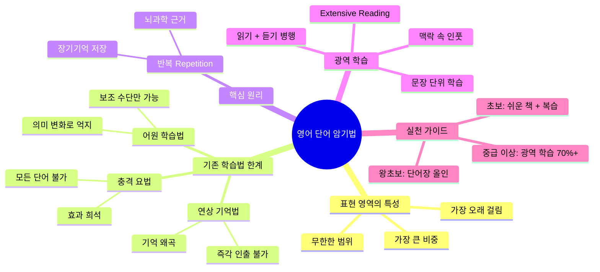
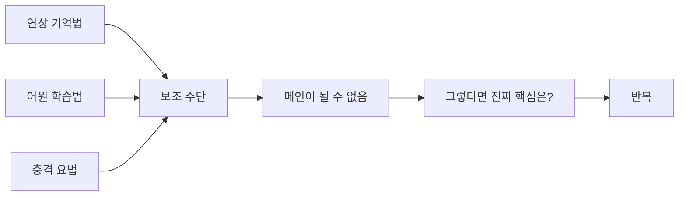
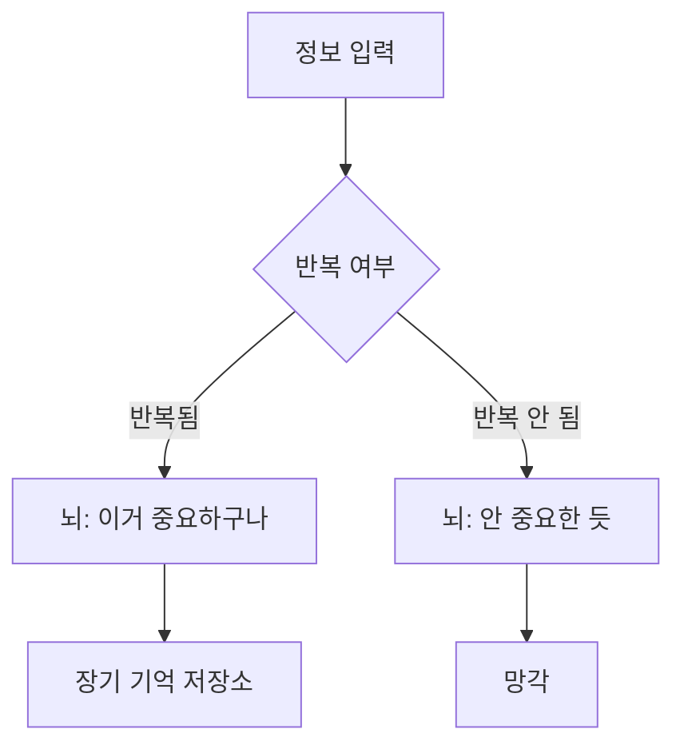
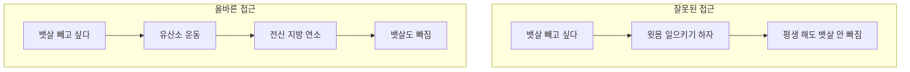
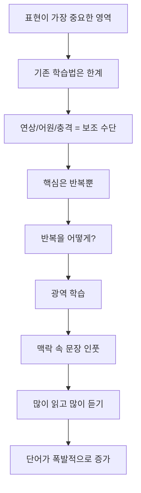

> [!quote] 한 줄 핵심
> **단어 암기의 핵심은 "반복"이고, 그 반복을 실현하는 최선의 방법은 "광역 학습"(맥락 속 문장 인풋)이다.**

---

## 영상 소스

<iframe width="560" height="315" src="https://www.youtube.com/embed/QCHVCx72KM8" frameborder="0" allowfullscreen></iframe>

---

## 목차

1. [[#개요]]
2. [[#마인드맵]]
3. [[#Chapter 1 표현 영역의 중요성]]
4. [[#Chapter 2 기존 학습법의 한계]]
5. [[#Chapter 3 반복이 핵심이다]]
6. [[#Chapter 4 광역 학습의 원리]]
7. [[#Chapter 5 수준별 실천 가이드]]
8. [[#종합 정리]]
9. [[#핵심 개념 카드]]
10. [[#용어 사전]]
11. [[#학습 체크리스트]]
12. [[#보충자료]]
13. [[#내 생각 & 연결]]

---

## 개요

영어 학습에서 **표현(어휘/패턴/숙어)** 영역은 문법이나 발음과 달리 **범위가 무한**하다. 문법은 2~3개월 집중하면 80% 마스터 가능하고, 발음도 몇 개월이면 정복 가능한 유한한 영역이다. 하지만 원어민조차 평생 새로운 단어를 배우듯, 표현은 끝이 없는 영역이다.

그래서 "귀가 뚫린다", "입이 터진다"는 말은 거짓이다. 표현에서 막히면 아무리 문법과 발음이 완벽해도 영어가 안 된다. 문제는 대부분의 학습자가 **비효율적인 방법**으로 단어를 공부한다는 것. 방법을 제대로 아는 사람은 5천 단어를 5개월에 익히고, 모르는 사람은 5년을 해도 제대로 안 외워진다.

핵심 해법은 **반복**이다. 그리고 그 반복을 가장 효과적으로 실현하는 방법이 **광역 학습**—맥락 있는 문장을 많이 읽고 듣는 것이다.

---

## 마인드맵



---

## 암기 포인트

| 중요도 | 원칙 | 핵심 | 근거 |
|:------:|------|------|------|
| ★★★ | **반복이 유일한 정답** | 뇌가 중요하다고 인식해야 장기기억으로 저장 | 뇌과학 |
| ★★★ | **광역 학습 = 맥락 인풋** | 단어장이 아니라 문장을 많이 읽고 듣기 | 학습 효율 |
| ★★☆ | **단어장은 20~30% 이하** | 메인이 아닌 보조 수단 | 시간 배분 |
| ★★☆ | **읽기 + 듣기 병행** | 소리 없이 읽기만 하면 반쪽 | 언어 습득 |
| ★☆☆ | **기존 학습법은 보조** | 연상/어원/충격요법 모두 제한적 | 실용성 |

---

## 구간 가이드

| 구간 | 챕터 | 난이도 | 주제 |
|------|------|:------:|------|
| 0:00~2:00 | Chapter 1 | 🟢 기초 | 표현 영역이 가장 중요한 이유 |
| 2:00~7:00 | Chapter 2 | 🟡 중급 | 연상/어원/충격 학습법의 한계 |
| 7:00~9:00 | Chapter 3 | 🟢 기초 | 반복이 핵심인 이유 (뇌과학) |
| 9:00~14:00 | Chapter 4 | 🟡 중급 | 광역 학습의 원리와 비유 |
| 14:00~끝 | Chapter 5 | 🟢 기초 | 수준별 실천 방법 |

---

## Chapter 1: 표현 영역의 중요성 `🟢 기초`

<iframe width="560" height="315" src="https://www.youtube.com/embed/QCHVCx72KM8?start=0&end=120" frameborder="0" allowfullscreen></iframe>

### 핵심 개념

**"표현"** 이란 단어, 어휘, 숙어, 패턴을 모두 통틀어 지칭하는 개념이다. 문법이나 발음과 구분되는 별개의 영역이다.

### 영역별 비교

| 영역 | 범위 | 정복 가능성 | 소요 기간 |
|------|------|------------|----------|
| **문법** | 유한 | 마스터 가능 | 2~3개월 (80%), 1년 (강사 수준) |
| **발음** | 유한 | 정복 가능 | 몇 개월 |
| **표현** | **무한** | **불가능** | **평생** |

### 왜 표현이 가장 중요한가

1. **비중이 가장 크다**: 언어 사용의 대부분은 적절한 표현 선택
2. **시간이 가장 오래 걸린다**: 끝이 없는 영역
3. **여기서 막히면 다 막힌다**: 문법/발음이 완벽해도 표현을 모르면 말이 안 됨

> [!warning] 거짓말 구별하기
> "귀가 뚫린다", "입이 터진다", "갑자기 모든 말이 들린다"는 **다 거짓말**이다.
> 이런 일은 일어나지 않는다. 표현을 모르면 평생 막힌다.

### Chapter 1 이해도 체크

- [x] 표현, 문법, 발음 영역의 차이를 설명할 수 있다 ✅ 2026-03-21
- [x] 표현 영역이 가장 중요한 이유 3가지를 말할 수 있다 ✅ 2026-03-21
- [x] "귀가 뚫린다"는 말이 왜 거짓인지 설명할 수 있다 ✅ 2026-03-21

---

## Chapter 2: 기존 학습법의 한계 `🟡 중급`

<iframe width="560" height="315" src="https://www.youtube.com/embed/QCHVCx72KM8?start=120&end=420" frameborder="0" allowfullscreen></iframe>

### 학습법 1: 연상 기억법 (해마 학습법)

**원리**: 한국어 발음과 유사한 소리로 연상 스토리 만들기

**예시**:
- **Molar** (어금니) → "몰라~" 소리와 비슷 → 어금니가 몰라
- **Nun** (수녀) → 수녀가 "넌!" 이라고 함
- **Admonish** (책망하다) → "어디다 많이 쐈어?" → 꾸짖다

**장점**: 초기 암기에 효과적

**단점**:
| 문제점 | 설명 |
|--------|------|
| **모든 단어 불가** | 연상 가능한 단어가 제한적 |
| **기억 왜곡** | 1000개 이상 시 스토리 헷갈림 |
| **즉각 인출 불가** ★ | 항상 중간 스토리를 거쳐야 함 → **치명적 단점** |

> [!danger] 치명적 단점
> 실제 대화/독해에서 단어가 즉각적으로 떠오르지 않고, 항상 "아 그 스토리가..." 하고 중간 과정을 거쳐야 한다.
> **시험 찍기용**까지만 유효한 방법.

---

### 학습법 2: 어원 학습법

**원리**: 라틴어/그리스어 어원을 통해 단어군 학습

**예시**:
- **spec** (라틴어 "보다") → special, specific, specify, specification
- "스펙"이라는 어원 = 눈에 보이는 것 → 특별한, 구체적인...

**장점**: 단어 간 연결고리 형성, 파생어 유추 가능

**단점**:
| 문제점 | 설명 |
|--------|------|
| **의미 변화** | 어원은 아주 오래된 과거 → 현대 의미와 동떨어진 경우 많음 |
| **억지 끼워맞추기** | "보다 → 특별한" 연결이 솔직히 억지 |
| **명사/동사 적용 한계** | 핵심 접사 위주로만 유효 |

> [!tip] 올바른 사용법
> 어원 학습법은 **핵심 접두사/접미사 위주로만** 보조 수단으로 사용.
> 모든 단어에 적용하려 하면 오히려 비효율.

---

### 학습법 3: 충격 요법

**원리**: 인상적이고 충격적인 정보와 연결하여 기억

**예시**:
- **MC** → 동사로 "진행하다, 사회 보다" (Eric is MCing a real-time class)
- **Know-how** → 이미 알던 "노하우"가 영어였음
- **Giro** (지로) → 영국 영어에서 온 단어 → 아 이거였어!

**장점**: 개별 단어에 대해 강한 기억 형성

**단점**:
| 문제점 | 설명 |
|--------|------|
| **모든 단어 불가** | 충격적인 스토리가 있는 단어는 극소수 |
| **효과 희석** | 1000개 단어가 다 충격적이면 → 아무것도 충격적이지 않음 |

---

### 기존 학습법 종합 평가



### Chapter 2 이해도 체크

- [x] 연상 기억법의 치명적 단점을 설명할 수 있다 ✅ 2026-03-22
- [ ] 어원 학습법이 왜 보조 수단인지 설명할 수 있다
- [ ] 세 가지 학습법의 공통적 한계를 한 문장으로 요약할 수 있다

---

## Chapter 3: 반복이 핵심이다 `🟢 기초`

<iframe width="560" height="315" src="https://www.youtube.com/embed/QCHVCx72KM8?start=420&end=540" frameborder="0" allowfullscreen></iframe>

### 핵심 원리

> **표현 학습의 유일한 정답은 반복이다.**

심박한 방법이 없다. 시크릿이 없다. 핵심은 오직 **반복**에만 있다.

### 뇌과학적 근거



- 반복되는 정보 → 뇌가 **중요하다고 인식**
- 중요하다고 인식된 정보 → **장기 기억 저장소**에 저장
- 이것이 모든 학습에서 반복이 강조되는 이유

> [!note] 연구 근거
> Spaced Repetition(간격 반복)에 대한 연구는 Ebbinghaus(1885)부터 현재까지 일관되게 **반복이 장기 기억 형성의 핵심**임을 보여준다. (Frontiers in Psychology, 2017)

### 학습자가 해야 할 질문

```
✗ "어떤 단어장이 좋아요?"
✗ "무슨 앱을 써야 해요?"
✗ "단어장을 갖고 다녀야 하나요?"

✓ "어떻게 반복을 실현할 것인가?"
```

### Chapter 3 이해도 체크

- [x] 표현 학습의 유일한 정답을 말할 수 있다 ✅ 2026-03-22
- [x] 반복이 왜 장기 기억에 중요한지 뇌과학적으로 설명할 수 있다 ✅ 2026-03-22
- [x] 학습자가 스스로에게 해야 할 올바른 질문이 무엇인지 안다 ✅ 2026-03-22

---

## Chapter 4: 광역 학습의 원리 `🟡 중급`

<iframe width="560" height="315" src="https://www.youtube.com/embed/QCHVCx72KM8?start=540&end=840" frameborder="0" allowfullscreen></iframe>

### 광역 학습이란?

**광역 학습 (Extensive Learning/Reading)**:
자연스러운 영어 문장을 **맥락 속에서** 많이 읽고 듣는 것

| 구분 | 단어장 학습 | 광역 학습 |
|------|-----------|----------|
| 단위 | 단어 | **문장** |
| 맥락 | 없음 | **있음** |
| 반복 방식 | 인위적 | **자연스러운 노출** |
| 효과 | 제한적 | **폭발적 어휘 확장** |

### 핵심 통찰

> **단어장을 해야 단어가 느는 게 아니다.**
> **영어를 많이 읽고 많이 들어야 단어가 는다.**

### 뱃살 비유 (핵심 비유)



**영어 학습에 대입**:

| 뱃살 빼기 | 영어 단어 늘리기 |
|----------|----------------|
| 뱃살 빼려고 윗몸 일으키기 | 단어 늘리려고 단어장 올인 |
| 배 운동 ≠ 뱃살 감소 | 단어장 ≠ 어휘력 폭발 |
| 유산소로 전신 지방 연소 | **광역 학습으로 전체 노출** |
| 결과적으로 뱃살도 빠짐 | 결과적으로 단어도 늘음 |

### 단어장의 위치

> [!warning] 오해 금지
> **단어장이 안 좋다는 말이 아니다!**
> 단어장은 **보조 수단**이지, **메인이 되어서는 안 된다.**

**시간 배분 원칙**:
- 단어장: **최대 20~30%**
- 광역 학습 (읽기/듣기): **70~80%**

❌ 하루 3시간 공부 중 2시간 단어장 = 잘못된 배분
✅ 하루 3시간 중 30분~1시간 단어장 + 나머지 읽기/듣기

### 반복 실현 방법들

| 방법 | 효과 | 비고 |
|------|------|------|
| AI 단어 앱 (Anki 등) | 좋음 | 외운 것 걸러주고 안 외운 것 반복 |
| 테스트/퀴즈 | 좋음 | 인출 연습 효과 |
| 형광펜 복습 | 보통 | 개인적 방법 |
| **광역 학습** | **최고** | 맥락 속 자연스러운 반복 |

### Chapter 4 이해도 체크

- [x] 광역 학습의 정의를 설명할 수 있다 ✅ 2026-03-22
- [x] 뱃살 비유를 통해 광역 학습의 원리를 남에게 설명할 수 있다 ✅ 2026-03-22
- [x] 단어장의 적절한 비중(20~30%)을 기억하고 있다 ✅ 2026-03-22
- [x] 단어장 vs 광역 학습의 차이를 표로 그릴 수 있다 ✅ 2026-03-22

---

## Chapter 5: 수준별 실천 가이드 `🟢 기초`

<iframe width="560" height="315" src="https://www.youtube.com/embed/QCHVCx72KM8?start=840" frameborder="0" allowfullscreen></iframe>

### 왕초보 (가장 기초)

**기준**: "I was in a café yesterday" 해석 불가

**처방**: 단어장 올인 OK
- 이 수준에서는 어떤 문장도 해석이 안 됨
- was, yesterday 같은 기본 단어부터 시작
- 단어장 학습이 메인이 되어도 됨

---

### 초보 (기초 문장 해석 가능)

**처방**: 쉬운 책/교재 + 복습이 짱

1. **현재 교재 마스터**: 지금 하고 있는 교재의 단어/문장부터 완벽히
2. **복습 중심**: 새 거 찾지 말고 있는 것 무한 반복
3. **읽기 + 듣기 병행**: 반드시 음성 자료 있는 콘텐츠

> [!tip] 복습이 짱
> 교재에 있는 단어도 모르면서 다른 단어책 찾아다니지 말 것.
> **현재 교재의 단어를 모르는 거 없게 만드는 게** 초보의 과정.

**잘못된 행동**:
- ❌ 현재 교재 안 하면서 "단어를 어떻게 해요?"
- ❌ 거기 있는 단어도 모르면서 다른 방법 찾기
- ❌ 해석도 안 되고 듣기도 안 되면서 다른 거 찾기

---

### 중급 이상

**처방**: 광역 학습 본격화

1. **자신의 수준에 맞는 콘텐츠** 선정
2. **읽기 + 듣기** 동시 진행
3. 모르는 표현 → 표시 → 복습
4. 듣기 음성 파일 **이동 중에도 듣기**

**콘텐츠 선택 기준**:
- 책 (음성 자료 제공되는 것)
- 영상 (자막 + 대본 있는 것)
- 강의 (스크립트 있는 것)

---

### 수준별 요약표

| 수준 | 기준 | 단어장 비중 | 광역학습 비중 | 핵심 행동 |
|------|------|-----------|-------------|----------|
| 왕초보 | 기본 문장 해석 불가 | 80~100% | 0~20% | 기초 단어 암기 |
| 초보 | 쉬운 문장 해석 가능 | 30~50% | 50~70% | 현재 교재 마스터 |
| 중급+ | 일반 문장 독해 가능 | 20~30% | 70~80% | 광역 학습 본격화 |

### Chapter 5 이해도 체크

- [ ] 자신의 현재 수준을 정확히 파악했다
- [ ] 그 수준에 맞는 실천 방법을 알고 있다
- [ ] "복습이 짱"의 의미를 이해했다
- [ ] 읽기 + 듣기 병행의 중요성을 안다

---

## 종합 정리

### 전체 흐름



### 핵심 공식

```
효과적인 어휘 학습 = 반복 × 맥락
                  = 광역 학습 (70-80%)
                  + 단어장 (20-30%)
                  + 읽기 & 듣기 병행
```

### 실천 원칙 3가지

1. **반복을 실현할 방법을 찾아라** (어떤 단어장이 아니라 어떻게 반복할지)
2. **단어장은 메인이 아니라 보조** (20~30% 이하)
3. **읽기만 하지 말고 듣기도 함께** (소리가 빠지면 반쪽)

---

## 핵심 개념 카드

> **Concept 1**: 표현 (Expression)
> **Definition**: 단어, 어휘, 숙어, 패턴을 통틀어 지칭. 문법/발음과 구별되는 무한한 영역.
> **Key Point**: 영어 학습에서 가장 비중 크고, 가장 오래 걸리는 영역.

> **Concept 2**: 광역 학습 (Extensive Reading/Learning)
> **Definition**: 맥락 있는 자연스러운 영어 문장을 많이 읽고 듣는 학습법.
> **Key Point**: 단어장이 아닌 문장 단위 인풋이 어휘력 폭발의 핵심.

> **Concept 3**: 간격 반복 (Spaced Repetition)
> **Definition**: 일정 간격을 두고 반복 학습하여 장기 기억을 강화하는 방법.
> **Key Point**: 뇌가 반복되는 정보를 중요하다고 인식 → 장기 기억 저장.

---

## 용어 사전

| 용어 | 설명 | 관련 |
|------|------|------|
| **광역 학습** | 맥락 속 문장 인풋 중심 학습법 | Extensive Reading |
| **Extensive Reading** | 다량의 텍스트를 읽는 학습법. 어휘 습득에 효과적 | 언어 습득 연구 |
| **Spaced Repetition** | 간격 반복. Anki 등 앱의 기반 원리 | Ebbinghaus 망각곡선 |
| **장기 기억** | 반복을 통해 뇌가 중요하다고 판단한 정보가 저장되는 곳 | 뇌과학 |
| **연상 기억법** | 소리 유사성으로 외국어 단어 암기 | 해마 학습법 |
| **어원 학습법** | 라틴어/그리스어 어원으로 단어군 학습 | 접두사/접미사 |

---

## 학습 체크리스트

### 이해 확인

- [ ] 표현 영역이 왜 가장 중요한지 설명할 수 있다
- [ ] 기존 3가지 학습법의 한계를 각각 말할 수 있다
- [ ] 반복이 장기 기억에 중요한 이유를 뇌과학적으로 설명할 수 있다
- [ ] 광역 학습의 정의와 원리를 뱃살 비유로 설명할 수 있다
- [ ] 단어장의 적절한 비중을 알고 있다

### 실천 계획

- [ ] 현재 내 수준 파악 (왕초보/초보/중급 이상)
- [ ] 그 수준에 맞는 학습 비중 설정
- [ ] 광역 학습용 콘텐츠 1개 선정 (읽기+듣기 가능한 것)
- [ ] 현재 교재/콘텐츠의 모르는 단어 없게 만들기 시작

### 복습 일정

- [ ] 1차 복습 완료 (2026-03-22)
- [ ] 2차 복습 완료 (2026-03-28)
- [ ] 3차 복습 완료 (2026-04-20)

---

## 보충자료

| 자료 | 유형 | 왜 읽어야 하는지 |
|------|------|-----------------|
| [Role of Extensive Reading in Vocabulary Development (ERIC)](https://files.eric.ed.gov/fulltext/EJ1465146.pdf) | 학술논문 | 광역 학습이 어휘 습득에 효과적이라는 연구 근거 |
| [Spaced Repetition Research (PMC)](https://pmc.ncbi.nlm.nih.gov/articles/PMC5476736/) | 학술논문 | 간격 반복의 장기 기억 효과에 대한 뇌과학 연구 |
| [The Science of Remembering (Science Times)](https://www.sciencetimes.com/articles/61336/20260217/science-remembering-why-brain-loves-spaced-repetition.htm) | 기사 | 간격 반복을 뇌가 왜 좋아하는지 쉽게 설명 |
| [Classroom-based Extensive Reading (Cambridge)](https://www.cambridge.org/core/journals/language-teaching/article/classroombased-extensive-reading-a-review-of-recent-research/30D66954997FCF1236B077AED3D3D8C1) | 학술리뷰 | 광역 학습의 실제 교실 적용 연구 |

---

## 내 생각 & 연결

**가장 큰 깨달음**:
단어장을 열심히 하면 단어가 는다고 생각했는데, 그게 "뱃살 빼려고 윗몸 일으키기 하는 것"과 같은 비효율적 접근이라는 점. 실제로 단어는 **맥락 속에서 반복 노출**될 때 가장 잘 늘어난다.

**내 약점과의 연결**:
그동안 단어장 앱에 너무 많은 시간을 쓰고, 정작 영어 원문을 읽고 듣는 시간은 부족했다. 앞으로 단어장은 20~30%로 줄이고, 나머지 시간은 실제 영어 콘텐츠 인풋에 투자해야겠다.

**기존 지식과의 연결**:
- [[나머지/도구와 자동화/AI Agent/Yt-to-Note/YT-knowledge-260310-토리파-공부법-종합|토리파 공부법 종합]] — 간격 반복(1/4/7/14/30)과 빠른 반복 원칙. 이 영상의 "반복이 핵심"과 일맥상통
- [[Anki 사용법]] — Anki도 좋지만 이것만 하면 안 됨. 광역 학습 보조로 활용

**다음에 탐구할 것**:
- Comprehensible Input (이해 가능한 입력) 이론과의 연결
- 광역 학습에 적합한 영어 콘텐츠 리스트 정리
