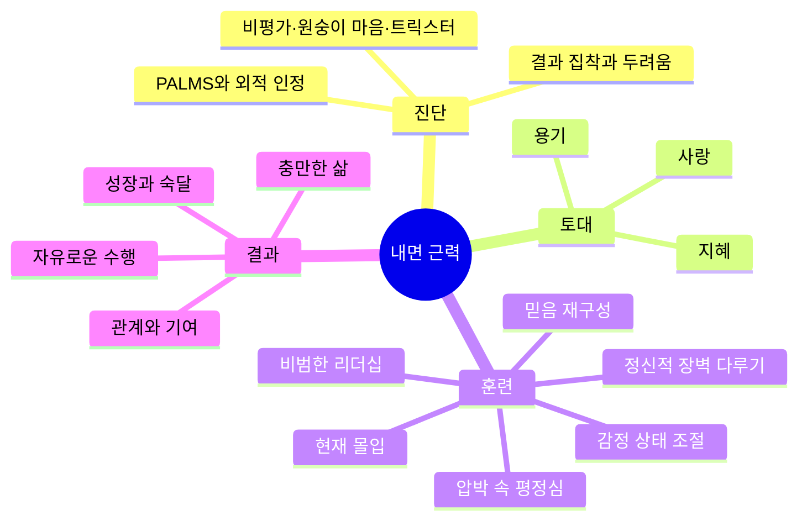
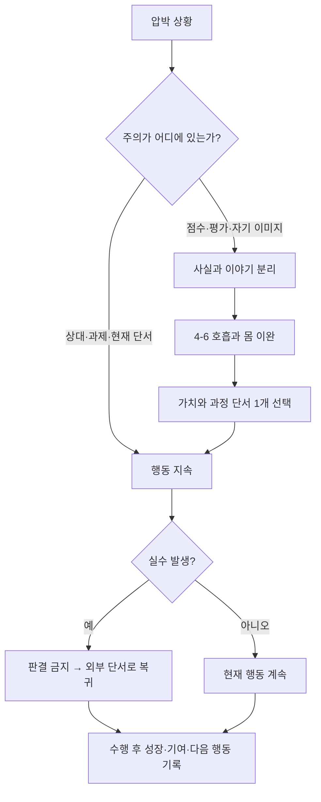

# 내면 근력 — 결국 멘탈 게임이다

> **저자**: 짐 머피 | **원제**: *Inner Excellence: Train Your Mind for Extraordinary Performance and the Best Possible Life* | **한국어판**: 윌북, 2026 | **독서일**: 2026-08-31

> [!note] 노트의 범위
> 한국어판 목차, 저자 공식 자료와 공개된 원서 일부, 장별 해설, 저자 인터뷰, 관련 연구를 교차해 만든 학습 노트다. 책 전체 원문을 대체하지 않으며, 저자의 주장과 독립 연구의 지지 수준을 구분했다.

---

## 목차

- [[#Book on a Page]]
- [[#읽기 전 질문]]
- [[#Part 1 누구나 내면 근력이 필요하다 — 위협을 제거하고 토대 다지기]]
- [[#Part 2 내면 근력이 불러올 혁명적 변화 — 내면 근력을 길러낸 사람들]]
- [[#Part 3 내면 근력 강화 6단계]]
- [[#종합 정리]]
- [[#용어 사전]]
- [[#셀프 테스트]]
- [[#복습 로그]]
- [[#보충자료]]
- [[#내 생각 & 연결]]

---

## Book on a Page

> **한 줄 핵심**: 결과를 붙잡지 말고 사랑·지혜·용기를 훈련하면, 평정심과 탁월한 수행은 부산물로 따라온다.

짐 머피는 시카고 컵스 산하에서 뛰었던 선수이자 코칭과학 석사, 프로·올림픽 선수들의 멘탈 코치다. 그는 압박 속 수행을 연구하며 “최고의 수행”과 “충만한 삶”이 서로 다른 목표가 아니라 같은 내적 훈련의 결과라고 주장한다. 외적 성공에 자기가치를 묶으면 통제할 수 없는 결과가 곧 위협이 되지만, 성장·기여·현재의 행동에 기준을 두면 실패를 감수할 자유가 생긴다. 그 자유는 사랑, 지혜, 용기라는 세 덕목에서 나오고, 감정 상태·믿음·주의·심상·평정심·리더십의 훈련으로 구체화된다. 핵심은 긍정적으로 생각하라는 주문이 아니라, 사실과 해석을 구분하고 통제 가능한 과정으로 주의를 되돌리는 반복 훈련이다. 다만 일부 신경과학 설명과 즉각적 공포 치료 주장은 근거가 약하므로, 실천 철학과 임상적 치료법을 구별해 읽어야 한다.

### 암기 포인트

| ★ | 개념 | 핵심 한 줄 | 기억 고리 |
|:-:|------|-----------|----------|
| ★★★ | 결과는 부산물 | 성공을 직접 움켜쥘수록 수행은 경직된다 | 열린 손 |
| ★★★ | 사랑·지혜·용기 | 무엇을 사랑하고, 무엇이 참인지 보고, 두려워도 행동한다 | 마음의 삼각대 |
| ★★★ | 세 내부의 적 | 판단·산만함·거짓 믿음이 현재의 행동을 빼앗는다 | 비평가·원숭이·사기꾼 |
| ★★☆ | 과정 중심 | 점수보다 숙달, 경쟁자보다 어제의 나를 기준으로 삼는다 | 스코어보드 끄기 |
| ★★☆ | 현재성 | 호흡·주의·감사·루틴으로 지금 할 일에 돌아온다 | 한 번에 한 공 |
| ★☆☆ | 자기초월 | 자기를 덜 의식할수록 실패와 창피를 감수할 자유가 커진다 | 카메라를 밖으로 |

---

## 읽기 전 질문

> [!question] 이 노트를 통해 답할 질문
> 1. 오디션이나 실기에서 결과 집착이 내 수행을 어떻게 좁히는가?
> 2. 사실과 내 머릿속 이야기를 어떤 문장으로 분리할 수 있는가?
> 3. 압박 직전에 쓸 수 있는 60초 루틴은 무엇인가?
> 4. 사랑·지혜·용기를 오늘의 연기 훈련으로 어떻게 번역할 것인가?
> 5. 저자의 조언 중 연구로 지지되는 부분과 과장된 부분은 무엇인가?

---

## Part 1. 누구나 내면 근력이 필요하다 — 위협을 제거하고 토대 다지기 `🟢 기초`

> **원서 범위**: 1~4장 — 외적 성공의 함정, 자의식과 두려움, 세 내부의 적, 사랑·지혜·용기

### 핵심 질문

- 왜 성과를 간절히 원할수록 중요한 순간에 몸과 주의가 굳는가?
- PALMS는 어떻게 자기가치를 외부 조건에 묶는가?
- 비평가, 원숭이 마음, 트릭스터는 각각 어떤 방식으로 수행을 방해하는가?
- 사랑·지혜·용기는 어떻게 두려움과 경쟁하는가?

### 왜 이게 중요한가

대부분은 압박에 약해지면 자신감이나 기술이 부족하다고 판단하고 더 많은 통제와 자기감시를 시도한다. 그러나 자기가치가 점수·합격·평가에 묶여 있다면, 무대는 표현의 장소가 아니라 정체성을 판정받는 법정이 된다. 이때 실수 하나는 단순한 정보가 아니라 “나는 부족하다”는 판결로 확대되고, 주의는 역할과 상대가 아니라 자기 모습과 심사위원 반응으로 이동한다. 기술을 더 쌓아도 위협 구조가 그대로면 실전에서 쓸 수 있는 주의 자원이 줄어든다. 첫 과제는 자신감을 억지로 높이는 것이 아니라 무엇을 위협으로 만들었는지 알아차리는 것이다.

### 핵심 원칙

머피가 비판하는 `PALMS`는 possessions, achievements, looks, money, status, 즉 소유·성취·외모·돈·지위를 뜻한다. 이것들은 나쁜 것이 아니라 불안정한데도 정체성의 토대로 삼을 때 문제가 된다. 통제할 수 없는 외적 결과가 자기 가치의 증거가 되면, 성공 후에도 다음 증명이 필요하고 실패 전에는 상실 공포가 커진다. 저자는 이를 끊임없이 더 많은 것을 요구하는 “풍요병(affluenza)”으로 묘사한다.

내부 방해자는 세 모습으로 나타난다. **비평가(Critic)**는 상황을 즉시 좋음/나쁨으로 판결한다. **원숭이 마음(Monkey Mind)**은 과거 후회와 미래 걱정 사이를 뛰어다니며 현재의 단서와 분리된다. **트릭스터(Trickster)**는 “난 원래 긴장해”, “한 번 틀리면 끝이야” 같은 해석을 사실처럼 믿게 한다. 셋의 공통 연료는 결과 집착이다. 그러므로 첫 기술은 `상황`과 `상황에 대한 생각`을 두 줄로 나누는 것이다. “대사가 한 번 막혔다”는 사실과 “심사위원이 무능하다고 생각할 것이다”는 예측은 같은 것이 아니다.

대안은 사랑·지혜·용기다. **사랑**은 내가 진정으로 바라는 것을 성취물 너머에서 정한다. 배우라면 인정 자체보다 사람과 이야기에 온전히 연결되고, 배우고, 아름다움을 만드는 일을 사랑할 수 있다. **지혜**는 통제 가능한 것과 불가능한 것, 사실과 해석, 단기 쾌감과 장기 성장을 구분한다. **용기**는 두려움이 사라진 뒤의 행동이 아니라 두려움과 함께 의미 있는 행동을 선택하는 능력이다. 세 덕목은 막연한 인품 목록이 아니라 주의의 방향을 자기보호에서 가치 있는 대상과 행동으로 돌리는 장치다.

공개 원서 1장의 핵심 문답도 같은 구조다. 편하고 안전하지만 외적 보상에 묶인 넓은 길과, 두려움을 마주하며 자기다운 자유를 향하는 좁은 길 중 무엇을 택할 것인가. 저자가 “자기중심성”을 두려움의 근원으로 보는 것은 강한 표현이지만, 수행 중 과도한 자기감시가 주의를 소모한다는 실용적 관찰은 연기와 스포츠 모두에 적용할 수 있다.

### 프레임워크 & 실천 가이드

> [!tip] 사실–이야기–가치–행동 4칸 기록
> **Step 1 사실**: 카메라에 찍힌 것처럼 관찰 가능한 사실만 쓴다. “첫 문장에서 숨이 짧아졌다.”
> **Step 2 이야기**: 머리가 붙인 판결과 예측을 쓴다. “또 망할 것이고 모두 실망할 것이다.”
> **Step 3 가치**: 이 순간 무엇을 사랑할지 정한다. “상대 배우를 듣고 장면의 필요를 살아낸다.”
> **Step 4 행동**: 10초 안에 가능한 행동 하나를 쓴다. “발바닥 감각을 느끼고 상대의 마지막 단어를 듣는다.”
> **적용 시점**: 연습 후 자기비난, 오디션 대기, 실수 직후.

> [!example] 오늘부터 시작할 수 있는 실천법
> 1. **즉시 실천(5분)**: 최근 실패 한 장면을 사실/이야기로 나눠 적는다.
> 2. **이번 주 목표**: 매 연습 뒤 `성장 1개·기여 1개·다음 행동 1개`만 기록한다.
> 3. **30일 챌린지**: 결과 평가를 하기 전, 과정 지표 세 개를 먼저 채점한다.
> **성공 지표**: 실수 후 다음 행동으로 돌아오는 시간을 초 단위로 기록해 30일 전보다 단축한다.
> **실패 대처**: “생각하지 말자” 대신 방해자에게 이름을 붙이고 외부 단서 하나로 주의를 이동한다.

> [!warning] 흔한 오해 & 실패 패턴
> **오해**: 결과를 원하지 않아야 좋은 수행이 나온다.
> **현실**: 목표는 방향을 주지만, 수행 순간에 점수와 평가를 계속 감시하면 현재 행동을 방해한다.
> **대안**: 결과 목표는 연습 설계에 사용하고, 수행 중에는 과정 단서 하나에 집중한다.

### 비유로 이해하기

> 결과 집착은 자동차를 운전하면서 계속 백미러 속 점수판만 보는 것과 같다. 목적지는 필요하지만, 커브를 도는 순간에는 도로를 봐야 한다.

### 한 줄 요약

> **Part 1 Summary**: 통제할 수 없는 결과에서 정체성을 떼고 사랑·지혜·용기로 주의를 재배치하면, 두려움 속에서도 자유롭게 행동할 토대가 생긴다.

### 이해도 체크

- [ ] **기억**: PALMS와 세 내부 방해자를 말할 수 있다.
- [ ] **이해**: 결과 집착이 수행 불안을 키우는 과정을 설명할 수 있다.
- [ ] **적용**: 최근 사건 하나를 사실과 이야기로 분리했다.
- [ ] **분석**: 결과 목표와 과정 초점의 역할을 구분할 수 있다.

---

## Part 2. 내면 근력이 불러올 혁명적 변화 — 내면 근력을 길러낸 사람들 `🟡 중급`

> **원서 범위**: 5~6장 — 사무라이의 자기초월, 감정 상태를 바꾸는 법

앞서 위협의 구조와 덕목의 토대를 세웠다면, 다음 질문은 “감정이 이미 흔들렸을 때 무엇을 할 것인가?”다. 2부는 자기를 덜 의식하는 태도와 생리·주의·환경을 활용한 상태 조절을 연결한다.

### 핵심 질문

- 자기초월은 자기희생이나 수동성과 어떻게 다른가?
- 감정 상태는 생각·몸·환경과 어떤 순환을 이루는가?
- 압박 직전 마음을 현재로 돌리는 최소 루틴은 무엇인가?

### 왜 이게 중요한가

감정은 명령만으로 사라지지 않는다. 긴장을 없애려 할수록 긴장 여부를 계속 확인하게 되고, 그 확인 자체가 자기감시를 강화한다. 그래서 “침착해야 해”라는 추상적 요구 대신 호흡, 시선, 자세, 언어, 환경 같은 조절 가능한 입력을 다뤄야 한다. 또한 용기는 불편함이 없는 상태가 아니라 불편함이 있어도 중요한 행동을 지속하는 능력이라는 전환이 필요하다.

### 핵심 원칙

5장의 사무라이 사례는 죽음을 미리 받아들임으로써 자기보존의 공포를 줄이고 명예·의무·봉사에 전념한다는 역설을 보여준다. 오늘날 적용할 핵심은 봉건적 전사 문화를 모방하는 것이 아니라, 결과와 이미지에 대한 집착을 느슨하게 해 더 큰 목적에 복무하는 것이다. “창피할 수 없는 사람, 쉽게 모욕받지 않는 사람, 쉽게 짜증 내지 않는 사람”이 된다는 표현은 반응하지 않는 수동성을 뜻하지 않는다. 사실을 분별하고 필요한 대응은 하되, 상처받은 자아가 자동으로 운전대를 잡지 못하게 한다는 뜻으로 읽는 편이 안전하다.

6장은 `결과 ← 행동 ← 감정 ← 생각/주의`의 연쇄를 제시한다. 이 모델은 상황에 대한 해석이 감정과 행동에 영향을 준다는 인지행동적 관점과 닿아 있다. 호흡을 길게 내쉬기, 시선을 지평선 위 한 점에 두기, 턱과 어깨 힘을 풀기, 긍정적인 행동 단어를 사용하기, 원하는 상태를 떠올리게 하는 음악·이미지를 배치하기가 실천 도구다. “감정을 완전히 통제할 수 있다”기보다, 상태에 영향을 주는 입력을 조정해 행동 선택의 폭을 넓힌다고 이해하는 것이 정확하다.

저자가 제안한 마음 갱신은 하루를 돌아보고, 아름다웠던 순간 세 가지를 회상하고, 실수를 새로운 행동으로 다시 그려보고, 다음 날을 예행연습하고, 원하는 느낌을 상상하는 흐름이다. 이 루틴의 강점은 실패를 판결로 끝내지 않고 다음 수행의 구체적 단서로 바꾸는 데 있다. 감사와 시각화가 만능은 아니지만, 판단과 위협에 독점된 주의를 다른 정보로 넓히는 기능은 있다.

> [!warning] 문화적·과학적 주의
> 사무라이를 자기초월의 이상형으로 제시하는 대목은 계급·폭력·충성 강요라는 역사적 맥락을 단순화한다. 또한 따뜻한 컵을 든 사람이 타인을 더 따뜻하게 평가했다는 유명한 점화 연구는 재현성 논란이 크다. 환경이 행동에 영향을 준다는 일반 원칙과 특정 실험의 신뢰도를 분리해 받아들여야 한다.

### 프레임워크 & 실천 가이드

> [!tip] 60초 Reboot
> **Step 1 정렬(10초)**: 발바닥을 느끼고 시선을 한 점에 둔다.
> **Step 2 호흡(20초)**: 코로 약 4박자 들이쉬고, 턱을 풀며 약 6박자 내쉰다. 두 번 반복한다.
> **Step 3 명명(10초)**: “불안이 있다”라고 말하고 “나는 불안하다”와 분리한다.
> **Step 4 외부 초점(20초)**: 상대 배우의 눈, 마지막 단어, 공간의 온도처럼 장면 밖의 실제 단서 하나를 선택한다.
> **적용 시점**: 오디션 입장 직전, 대사 실수 직후, 평가 생각이 커질 때.

> [!tip] 5단계 마음 갱신
> **1. Review** — 오늘의 사실을 판결 없이 돌아본다.  
> **2. Beauty** — 구체적인 좋은 순간 세 개를 감각과 함께 회상한다.  
> **3. Reprogram** — 실수 장면에서 바꿀 행동 하나를 과거형 비난 대신 미래형 단서로 쓴다.  
> **4. Preview** — 내일의 고압 장면을 시작부터 끝까지 짧게 그린다.  
> **5. Feel** — 완벽함이 아니라 원하는 상태(호기심·연결·담대함)를 몸으로 느껴본다.

> [!example] 오늘부터 시작할 수 있는 실천법
> 1. **즉시 실천**: 휴대전화 메모 첫 줄에 `4초 들숨–6초 날숨–외부 단서 하나`를 저장한다.
> 2. **이번 주 목표**: 연습 전후 긴장도를 0~10으로 기록하고 Reboot 뒤 변화를 측정한다.
> 3. **30일 챌린지**: 주 5회, 잠들기 전 5단계 마음 갱신에 7분만 사용한다.
> **성공 지표**: 루틴 실행률 80%, 실수 후 복귀 시간 감소, 연습 중 자기평가 횟수 감소.
> **실패 대처**: 긴장도가 내려가지 않아도 루틴을 실패로 보지 말고, 다음 행동을 가능하게 했는지 평가한다.

### 비유로 이해하기

> 감정 조절은 파도를 멈추는 일이 아니라 서핑 보드의 자세를 조정하는 일과 같다. 파도는 남아 있어도 넘어질 가능성과 이동 방향은 바꿀 수 있다.

### 한 줄 요약

> **Part 2 Summary**: 자아를 보호하려는 자동 반응을 알아차리고 몸·주의·환경을 조절하면, 불편한 감정 속에서도 가치 있는 행동을 계속할 수 있다.

### 이해도 체크

- [ ] **기억**: 60초 Reboot의 네 단계를 말할 수 있다.
- [ ] **이해**: 자기초월과 자기무시의 차이를 설명할 수 있다.
- [ ] **적용**: 실제 연습 전에 루틴을 한 번 실행했다.
- [ ] **분석**: 감정 “통제”라는 표현의 유용성과 한계를 구분할 수 있다.

---

## Part 3. 내면 근력 강화 6단계 `🔴 심화`

> **원서 범위**: 7~12장 — 믿음, 삶의 이야기, 현재 몰입, 정신적 장벽, 평정심, 리더십

### 핵심 질문

- 제한적 믿음을 현실 검증 가능한 행동 가설로 어떻게 바꿀 것인가?
- 현재 몰입은 멍하게 비우는 상태가 아니라 무엇에 주의를 두는 기술인가?
- 압박 속 평정심과 숙달 목표는 어떻게 연결되는가?
- 리더는 결과보다 성장과 기여를 중심으로 팀 문화를 어떻게 설계하는가?

### 왜 이게 중요한가

토대와 상태 조절만으로는 오래된 자기서사가 자동으로 바뀌지 않는다. “나는 카메라 앞에서 굳는다” 같은 믿음은 주의할 증거를 선택하고, 행동을 회피하게 만들며, 그 결과를 다시 믿음의 증거로 사용한다. 심화 단계는 믿음의 내용만 긍정적으로 바꾸는 것이 아니라, 반복 가능한 행동·주의·피드백의 구조를 새로 설계하는 데 초점을 둬야 한다.

### 핵심 원칙: 여섯 단계

#### 1단계 — 자기절제: 상태를 선택할 틈 만들기

자기절제는 감정을 억압하는 일이 아니라 자극과 반응 사이에 선택 공간을 만드는 능력이다. 호흡, 수면, 환경, 언어, 휴식 루틴은 의지력을 대신하는 구조다. 연기 훈련에서는 긴장을 없애는 데 성공했는지가 아니라, 긴장 중에도 상대를 듣고 행동했는지로 자기절제를 측정한다.

#### 2단계 — 내가 원하는 삶의 이야기: 믿음을 과거형으로 제한하기

머피는 믿음을 가능성의 경계로 보고, 반복된 생각과 감정이 현재 수행 범위를 고정한다고 본다. “나는 대사를 자주 잊어” 대신 “지난 세 번의 연습에서는 대사를 잊었다. 이번에는 첫 행동과 상대의 단어를 단서로 삼는다”라고 말하면 정체성 판결이 관찰과 실험으로 바뀐다. 시각화는 결과 장면만 반복하는 것이 아니라 돌발 상황, 실수, 회복까지 포함해야 한다. 그래야 완벽한 미래상이 깨질 때 함께 무너지지 않는다.

#### 3단계 — 목표에만 몰입: 현재의 한 단위로 축소하기

현재성은 과거와 미래를 지우는 것이 아니라 지금 필요한 정보에 주의를 의도적으로 두는 능력이다. 저자는 분석적 독백을 줄이고, 통제 가능한 루틴·구체적 감사·만트라·서두름을 줄이는 휴식을 활용한다. 약 90분마다 짧은 멈춤, 주기적 휴식 같은 조언은 자원이 허락하는 범위에서 조정해야 한다. 핵심은 바쁨을 성실함으로 오해하지 않는 것이다.

#### 4단계 — 스스로 만든 한계 넘기: 정신적 장벽을 기억이 아니라 반응 패턴으로 보기

스티브 색스와 릭 앤키엘의 입스 사례를 통해, 저자는 정신적 장벽을 과거의 고통에서 보호하려는 자동 반응으로 설명한다. 3인칭 시점으로 기억을 보고, 달라질 수 있었던 작은 행동을 찾고, 새로운 감정·심상과 연결하는 기법을 제안한다. 관점 전환과 심상은 자기거리두기에 도움이 될 수 있지만, 공포증이나 트라우마가 한 번의 세션으로 영구 치료된다는 식의 주장은 신중히 봐야 한다. 일상적 수행 불안은 실험해볼 수 있으나 기능 손상이 큰 불안·공황·트라우마는 전문가 치료를 대신하지 않는다.

#### 5단계 — 평정심: 완벽함보다 공명(resonance)

설리 설렌버거의 허드슨강 비상착륙 사례는 위기에서 판단과 행동을 분리하지 않는 집중을 상징한다. 머피가 말하는 공명은 마음이 비어 있는 무감각이 아니라 자유, 열정, 현재성이 일치하는 상태다. 네 가지 열쇠는 `자아를 증명하기보다 열정을 나누기`, `점수보다 숙달 추구하기`, `상대를 적이 아니라 함께 수준을 끌어올리는 파트너로 보기`, `완벽이 아니라 현재에 있는 모습을 심상화하기`다. 숙달 목표가 수행 목표보다 내적 동기를 덜 훼손한다는 메타분석은 이 방향을 부분적으로 지지한다. 스포츠·신체활동 연구에서도 숙달-접근 목표는 자율성, 내적 동기, 노력, 긍정 정서와 의미 있는 상관을 보였다.

#### 6단계 — 비범한 리더십: 성공을 재정의하고 타인의 성장을 설계하기

리더십은 사람을 통제해 결과를 얻는 기술이 아니라, 개인을 자신보다 큰 목적과 연결하고 자기숙달을 돕는 일이다. 팀의 성공 기준을 승패만이 아니라 준비, 학습, 용기, 협력으로 구체화한다. 부정형 지시보다 행동형 지시를 사용한다. “긴장하지 마” 대신 “첫 호흡 뒤 상대의 눈을 봐”, “실수하지 마” 대신 “문장 끝까지 의도를 보낸다”처럼 관찰 가능한 언어로 바꾼다. 경쟁자는 제거할 적이 아니라 최고의 반응을 끌어내는 무용 파트너라는 관점이 팀과 개인의 방어성을 낮춘다.

### 프레임워크 & 실천 가이드

> [!tip] 압박 수행 GPS
> **G — Goal**: 결과가 아니라 이번 수행의 과정 목표 한 개를 정한다. 예: “매 순간 상대의 마지막 단어를 받는다.”
> **P — Purpose/Plan**: 왜 이 장면을 하는지와 첫 행동 단서를 정한다.
> **S — State/See**: 원하는 상태를 몸으로 만들고, 실수와 회복을 포함한 장면을 심상화한다.
> **적용 시점**: 연습 시작 전 2분, 오디션 대기 중 60초.

> [!tip] 믿음 업데이트 실험
> **Step 1**: 제한적 믿음을 관찰 가능한 문장으로 바꾼다.
> **Step 2**: 그 믿음이 틀릴 가능성을 시험할 최소 행동을 정한다.
> **Step 3**: 결과가 아니라 행동 실행 여부와 회복 시간을 기록한다.
> **Step 4**: 10회 자료가 쌓이기 전에는 정체성 결론을 내리지 않는다.

> [!example] 오늘부터 시작할 수 있는 실천법
> 1. **즉시 실천**: “나는 원래 ___하다” 문장 하나를 과거의 관찰 + 다음 실험으로 바꾼다.
> 2. **이번 주 목표**: 세 번의 연습에서 GPS를 쓰고 수행 중 과정 단서 이탈 횟수를 기록한다.
> 3. **30일 챌린지**: 주 3회 일부러 작은 압박을 추가하고, 실수 후 복귀를 연습한다.
> **성공 지표**: 루틴 실행률 80%, 과정 단서 복귀 시간 50% 단축, 회피한 고압 연습 4회 이상 수행.
> **실패 대처**: 완벽한 심상이 오히려 압박을 만들면 “실수→호흡→외부 단서→재개” 장면을 반복한다.

> [!warning] 흔한 오해 & 실패 패턴
> **오해**: 믿으면 현실이 되고, 불안은 생각을 잘못해서 생긴다.
> **현실**: 믿음과 주의는 행동에 영향을 주지만 능력, 환경, 건강, 자원 제약까지 지우지는 못한다. 불안도 의지 부족의 증거가 아니다.
> **대안**: 믿음을 행동 가설로 다루고, 기술 훈련·환경 조정·전문적 도움과 병행한다.

### 비유로 이해하기

> 믿음은 운명을 결정하는 주문보다 검색창의 필터에 가깝다. 필터가 무엇을 보게 할지는 바꾸지만, 원하는 자료가 세상에 존재하는지와 그것을 다룰 기술까지 자동으로 만들어주지는 않는다.

### 한 줄 요약

> **Part 3 Summary**: 믿음·주의·심상·숙달 기준·리더의 언어를 반복 가능한 시스템으로 바꿀 때, 내면 근력은 기분이 아니라 압박 속 행동 능력이 된다.

### 이해도 체크

- [ ] **기억**: 여섯 단계와 공명의 네 열쇠를 말할 수 있다.
- [ ] **이해**: 숙달 목표와 수행 결과 목표의 차이를 설명할 수 있다.
- [ ] **적용**: 제한적 믿음 하나를 행동 실험으로 바꿨다.
- [ ] **분석**: 심상 훈련의 유용성과 과장 가능성을 구분할 수 있다.
- [ ] **평가**: 전문 치료가 필요한 경우를 자기계발 실천과 구분할 수 있다.

---

## 종합 정리

전체 흐름은 `외적 결과에 묶인 정체성 → 위협과 자기감시 → 현재에서 이탈 → 경직된 수행`이라는 악순환을 진단하고, 이를 `가치와 목적 → 사랑·지혜·용기 → 상태와 주의 조절 → 숙달 중심 행동 → 자유로운 수행`으로 바꾸는 것이다. 핵심 전환은 결과를 포기하는 것이 아니라 결과가 담당하던 역할을 줄이는 데 있다. 결과는 방향과 피드백을 주지만 자기가치를 판정하지 않는다. 수행 순간의 기준은 통제 가능한 행동이고, 수행 뒤의 기준은 배움과 다음 실험이다.

이 관점은 [[운동학습-마스터-종합노트]]의 `수행(performance)`과 `역량(capability)` 구분과 잘 연결된다. 당장의 점수는 역량 전체가 아니며, 압박 속 한 번의 수행도 정체성의 판결문이 아니다. 또한 [[연습을 잘 하기 위한 방법]]의 외부 초점·실수 허용·피드백 원리는 “현재의 대상에 연결하고 결과를 부산물로 둔다”는 접근을 기술 훈련으로 구체화한다.

> [!question] 실천적 시각
> - **적용 범위**: 오디션, 공연, 발표, 시험처럼 평가 압박이 크고 기본 기술이 이미 어느 정도 있는 상황에서 특히 유용하다.
> - **이상 vs 현실**: 긴 휴식, 환경 통제, 매일 충분한 심상 훈련은 시간·경제적 자원이 부족하면 축소해야 한다. 60초 호흡과 과정 단서 하나부터 시작한다.
> - **생존자 편향**: 세계 정상급 선수의 성공 사례는 기억하기 쉽지만 같은 철학을 실천하고도 우승하지 못한 사람은 잘 보이지 않는다. 성과 보장을 뜻하지 않는다.
> - **근거 수준**: 숙달 목표와 내적 동기, 마음챙김 기반 스포츠 개입에는 연구 지지가 있으나 연구 간 이질성과 질 문제가 남는다. 저자의 “잠재의식”, “진동”, 일부 점화 실험, 즉각적 공포 해소 설명은 과학적 사실보다 실천적 은유로 읽는 편이 안전하다.
> - **치료와의 경계**: 심한 공황, 트라우마, 공포증, 우울은 이 루틴만으로 해결하려 하지 말고 자격 있는 정신건강 전문가와 상의한다.

### 90일 실천 로드맵

| 기간 | 목표 | 구체적 행동 | 성공 지표 |
|------|------|-----------|----------|
| Week 1~2 | 위협 구조 관찰 | 매 연습 뒤 사실/이야기/가치/행동 4칸 기록 | 10회 기록, 주요 방해자 1개 식별 |
| Week 3~4 | 상태 복귀 자동화 | 연습 전·실수 후 60초 Reboot | 실행률 80%, 복귀 시간 기준선 확보 |
| Month 2 | 압박 속 과정 초점 | 주 3회 GPS + 작은 평가 조건 추가 | 과정 단서 복귀 시간 30% 단축 |
| Month 3 | 믿음과 수행 검증 | 제한적 믿음 1개를 10회 행동 실험으로 검증 | 회피 행동 감소, 회복 시간 50% 단축 |

---

## 용어 사전

| 용어 | 정의 | 이 책에서의 맥락 |
|------|------|-----------------|
| 내면 근력 | 결과와 감정에 끌려가지 않고 가치에 맞는 행동을 선택하는 훈련 체계 | 사랑·지혜·용기의 토대 위에서 상태·믿음·주의·리더십을 훈련한다 |
| PALMS | 소유, 성취, 외모, 돈, 지위 | 자기가치를 외부 조건에 묶는 대표적 기준 |
| 풍요병(Affluenza) | 더 많은 외적 보상을 얻어야 만족할 수 있다는 문화적·정체성적 집착 | 비교와 불안을 반복시키는 진단적 은유 |
| 비평가 | 사건을 즉시 좋음/나쁨, 성공/실패로 판결하는 내적 목소리 | 실수를 학습 정보가 아니라 자기 판결로 바꾼다 |
| 원숭이 마음 | 과거와 미래를 뛰어다니며 현재 단서에서 벗어나는 산만한 주의 | 목적과 루틴이 없을수록 커진다 |
| 트릭스터 | 제한적 해석을 사실과 정체성으로 믿게 하는 내적 서사 | “나는 원래 못한다” 같은 고정 문장을 만든다 |
| Zoe | 사랑·지혜·용기가 통합된 충만한 생의 상태 | 외적 성공보다 직접 추구할 삶의 질 |
| 공명(Resonance) | 자유·열정·현재성이 일치해 수행에 온전히 연결된 상태 | 완벽이 아니라 숙달과 존재감에 초점을 둘 때 나타난다 |
| 숙달 목표 | 타인을 이기기보다 자신의 기술·이해·노력을 개선하려는 목표 | 내적 동기와 지속 가능한 수행을 돕는다 |
| 외부 초점 | 몸을 감시하기보다 움직임의 효과·상대·과제 단서에 주의를 두는 방식 | [[운동학습-마스터-종합노트]]의 수행 원리와 연결된다 |

---

## 셀프 테스트

> [!tip] 노트를 가리고 답해보기

**기억 (Remember)**
- [ ] PALMS 다섯 요소와 세 내부 방해자를 말할 수 있는가?
- [ ] 사랑·지혜·용기를 각각 행동 문장으로 정의할 수 있는가?

**이해 (Understand)**
- [ ] 결과 집착이 자기감시와 수행 저하로 이어지는 흐름을 설명할 수 있는가?
- [ ] 결과를 포기하는 것과 수행 중 결과에서 주의를 떼는 것의 차이는 무엇인가?

**적용 (Apply)**
- [ ] 오디션 직전 사용할 60초 Reboot를 보지 않고 실행할 수 있는가?
- [ ] “나는 원래 긴장한다”를 관찰 가능한 믿음 업데이트 문장으로 바꿀 수 있는가?

**분석 (Analyze)**
- [ ] 내 수행을 가장 자주 방해하는 것은 비평가·원숭이 마음·트릭스터 중 무엇이며 근거는 무엇인가?
- [ ] 저자의 주장에서 연구 지지가 비교적 강한 부분과 약한 부분을 하나씩 들 수 있는가?

**평가 (Evaluate)**
- [ ] 자기초월이 수동적 복종으로 변질되지 않으려면 어떤 지혜가 필요한가?
- [ ] 90일 뒤 이 접근이 효과 있었는지 어떤 행동 지표로 판단할 것인가?

---

## 복습 로그

| 회차 | 예정일 | 완료일 | 기억률 | 메모 |
|:----:|--------|--------|:------:|------|
| 1차 | 2026-09-01 | | /10 | 60초 Reboot 실습 |
| 2차 | 2026-09-07 | | /10 | 사실/이야기 기록 검토 |
| 3차 | 2026-09-30 | | /10 | 복귀 시간과 회피 행동 변화 비교 |

---

## 보충자료

| 자료 | 유형 | 이 노트의 어떤 부분을 보완하는가 |
|------|------|-------------------------------|
| [저자 공식 소개](https://innerexcellence.com/about/) | 공식 사이트·저자 직접 설명 | 연구 배경, 선수 경력, 2009년 초판과 2020년 개정판 경위 |
| [공식 무료 챕터 PDF](https://innerexcellence.com/wp-content/uploads/2020/04/Inner-Excellence-free-chapter.pdf) | 원서 일부·목차 | 12장 구조, 1장의 논리, 핵심 질문과 활동 확인 |
| [Rich Roll 인터뷰](https://richroll.com/podcast/jim-murphy-927/) | 저자 인터뷰 | 자기중심성, 사랑·지혜·용기, 일상 목표에 대한 직접 설명 |
| [마음챙김 기반 스포츠 개입 메타분석](https://pubmed.ncbi.nlm.nih.gov/36767403/) | 학술 연구 | 현재성 훈련의 가능성과 연구의 이질성·한계 보완 |
| [성취 목표와 내적 동기 메타분석](https://pubmed.ncbi.nlm.nih.gov/15661680/) | 학술 연구 | 숙달 목표가 수행 목표보다 내적 동기를 덜 훼손한다는 근거 |

### 출처 신뢰도 메모

- **A급**: 저자 공식 사이트·공식 공개 PDF·저자 인터뷰·학술 메타분석.
- **B급**: 윌북/예스24 한국어판 서지와 목차, 주요 언론의 출간·저자 보도.
- **C급**: 상업적 장별 요약과 비평. 구조와 논점 탐색에 쓰고 A/B급 자료와 교차했다.
- **상충/주의**: 초판은 2009년, 현재 널리 유통되는 개정 원서는 2020년, 한국어판은 2026년이다. 판본에 따라 페이지 수와 장 표기가 다르다. 한국어판 온라인 목차에는 4장이 누락되어 보이지만 공식 원서 목차에는 사랑·지혜·용기의 세 기둥을 다루는 4장이 존재한다.

---

## 내 생각 & 연결

**가장 큰 인사이트**: 기존 개인 노트 [[내면 근력]]에서 적은 “경험·배움과 성장·아름다움을 과정의 목적으로 삼는다”는 문장은 이 체계의 가장 좋은 개인화다. 합격과 인정은 목표로 남겨두되, 연기하는 순간 사랑할 대상은 평가가 아니라 상대·이야기·아름다움이다.

**내 삶에 적용한다면**: 입시 실기와 오디션 전 GPS의 과정 목표를 `상대의 마지막 단어를 받고 다음 행동으로 반응한다`로 고정한다. 연습 후에는 잘함/못함 대신 `외부 초점 유지율`, `실수 후 복귀 시간`, `회피하지 않고 시도한 횟수`를 기록한다. 30일 동안 세 지표 중 두 개가 개선되면 내면 근력 훈련이 실제 행동으로 옮겨졌다고 판단한다.

**기존 지식과의 연결:**
- [[내면 근력]] — 책을 읽으며 직접 적은 가치·연기·입시 불안에 대한 개인 해석. 이 노트의 실천 목표를 정하는 핵심 자료다.
- [[운동학습-마스터-종합노트]] — 수행과 역량의 구분, 외부 초점, 실수 허용이 과정 중심 수행을 과학적으로 보완한다.
- [[연습을 잘 하기 위한 방법]] — 내면 근력을 실제 연기·보컬 연습의 피드백과 루틴으로 전환할 때 참고한다.

**아직 풀리지 않은 질문:**
- 자기초월이 필요한 경계 설정과 자기보호까지 약화시키지 않게 하려면 어떤 기준이 필요한가?
- 외부 초점과 역할의 내적 감정 작업은 연기 장르별로 어떤 비율이 가장 효과적인가?
- 입시 실전 10회 자료에서 복귀 시간이 줄어도 합격 결과가 변하지 않는다면, 이 훈련의 성공을 어떻게 정의할 것인가?
