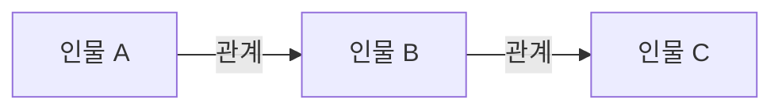

<%*
const works = [
  { title: "맥베스", author: "윌리엄 셰익스피어" },
  { title: "바냐 아저씨", author: "안톤 체홉" },
  { title: "인형의 집", author: "헨릭 입센" },
  { title: "주노와 공작", author: "숀 오케이시" },
  { title: "소", author: "유치진" }
];

const work = await tp.system.suggester(
  works.map(item => `${item.title} — ${item.author}`),
  works,
  false,
  "분석할 지정희곡을 선택하세요"
);

if (!work) {
  new Notice("지정희곡 노트 생성을 취소했습니다.");
  throw new Error("지정희곡 선택이 취소되었습니다.");
}

const targetFolder = "연기/작품과 인물 분석/세종대학교 2027 지정희곡";
const fileName = `세종대학교 지정희곡 - ${work.title}`;
const targetPath = `${targetFolder}/${fileName}.md`;
const currentPath = tp.file.path(true);

if (await tp.file.exists(targetPath) && currentPath !== targetPath) {
  new Notice(`이미 존재하는 노트입니다: ${fileName}`);
  throw new Error(`중복 노트 생성 중단: ${targetPath}`);
}

if (!app.vault.getAbstractFileByPath(targetFolder)) {
  await app.vault.createFolder(targetFolder);
}

if (currentPath !== targetPath) {
  await tp.file.move(`${targetFolder}/${fileName}`);
}

%>
---
work: "<% work.title %>"
author: "<% work.author %>"
exam_scope: "2단계 지정연기"
status: 미시작
tags:
  - 입시/세종대학교
  - 입시/지정희곡
  - 연기/작품분석
---

# <% work.title %>

> [!abstract] 시험 직전 요약
> - **한 문장 줄거리:**
> - **핵심 사건 흐름:**
> - **작품의 핵심 의미:**

| 항목 | 내용 |
|---|---|
| 작품명 | <% work.title %> |
| 작가 | <% work.author %> |

## 작가 소개

- **생애와 활동 시대:**
- **작품 세계와 대표작:**

## 전체 줄거리

### 전체 줄거리

### 짧은 요약

## 사건의 흐름

- 

- **발단부터 결말까지의 흐름:**

## 등장인물과 특징

### 주요 인물

- 

### 보조 인물

- 

## 인물 관계도

## 작품의 특징과 의미

- **장르·구조의 특징:**
- **언어·연극적 형식의 특징:**
- **핵심 갈등:**
- **주제:**
- **제목의 의미:**
- **시대·사회적 의미:**
- **나에게 인상적이었던 지점:**

## 지정연기 장면 후보

1)
