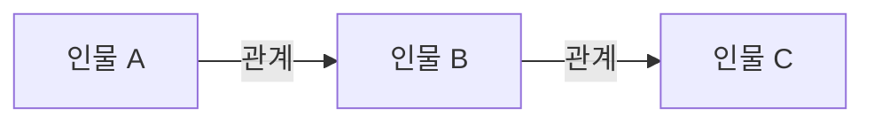

<%*
const works = [
  { title: "오이디푸스 왕", author: "소포클레스", examScope: "추가 희곡", hasMonologue: true },
  { title: "스카팽의 간계", author: "몰리에르", examScope: "추가 희곡", hasMonologue: true },
  { title: "인생은 꿈입니다", author: "칼데론 데 라 바르카", examScope: "추가 희곡", hasMonologue: true },
  { title: "뜻대로 하세요", author: "윌리엄 셰익스피어", examScope: "추가 희곡", hasMonologue: true },
  { title: "트로이의 여인들", author: "에우리피데스", examScope: "공통 희곡", hasMonologue: false },
  { title: "포스터스 박사의 비극", author: "크리스토퍼 말로", examScope: "공통 희곡", hasMonologue: false },
  { title: "피그말리온", author: "조지 버나드 쇼", examScope: "공통 희곡", hasMonologue: false },
  { title: "시련", author: "아서 밀러", examScope: "공통 희곡", hasMonologue: false },
  { title: "살아있는 이중생 각하", author: "오영진", examScope: "공통 희곡", hasMonologue: false }
];

const work = await tp.system.suggester(
  works.map(item => `${item.title} — ${item.author}`),
  works,
  false,
  "분석할 지정희곡을 선택하세요"
);

if (!work) {
  new Notice("지정희곡 노트 생성을 취소했습니다.");
  throw new Error("지정희곡 선택이 취소되었습니다.");
}

const targetFolder = "연기/작품과 인물 분석/한예종 2027 지정희곡";
const fileName = `한예종 지정희곡 - ${work.title}`;
const targetPath = `${targetFolder}/${fileName}.md`;
const currentPath = tp.file.path(true);

if (await tp.file.exists(targetPath) && currentPath !== targetPath) {
  new Notice(`이미 존재하는 노트입니다: ${fileName}`);
  throw new Error(`중복 노트 생성 중단: ${targetPath}`);
}

if (!app.vault.getAbstractFileByPath(targetFolder)) {
  await app.vault.createFolder(targetFolder);
}

if (currentPath !== targetPath) {
  await tp.file.move(`${targetFolder}/${fileName}`);
}

%>
---
work: "<% work.title %>"
author: "<% work.author %>"
exam_scope: "<% work.examScope %>"
status: 미시작
tags:
  - 입시/한예종
  - 입시/지정희곡
  - 연기/작품분석
---

# <% work.title %>

> [!abstract] 시험 직전 요약
> - **한 문장 줄거리:**
> - **핵심 사건 흐름:**
> - **작품의 핵심 의미:**

## 작품 기본 정보

| 항목 | 내용 |
|---|---|
| 작품명 | <% work.title %> |
| 원제 |  |
| 작가 | <% work.author %> |
| 집필 연도 |  |
| 초연 연도 |  |
| 국가·시대 |  |
| 장르 |  |
| 번역본·출판사 |  |

## 작가 소개

- **생애와 활동 시대:**
- **작품 세계와 대표작:**
- **이 희곡이 작가의 작품 세계에서 갖는 위치:**

## 전체 줄거리

### 전체 줄거리

### 짧은 요약

## 사건의 흐름

| 순서 | 장·막 | 주요 사건 | 관련 인물 | 사건의 결과 |
|---:|---|---|---|---|
| 1 |  |  |  |  |
| 2 |  |  |  |  |
| 3 |  |  |  |  |
| 4 |  |  |  |  |
| 5 |  |  |  |  |

- **발단부터 결말까지의 흐름:**

## 등장인물과 특징

### 주요 인물

| 인물 | 신분·역할 | 성격과 특징 | 주요 욕망 | 극 중 변화 |
|---|---|---|---|---|
|  |  |  |  |  |
|  |  |  |  |  |
|  |  |  |  |  |

### 보조 인물

| 인물 | 신분·역할 | 성격과 특징 | 주요 욕망 | 극 중 변화 |
|---|---|---|---|---|
|  |  |  |  |  |
|  |  |  |  |  |

## 인물 관계도

- **관계의 변화·보충 설명:**

## 작품의 특징과 의미

- **장르·구조의 특징:**
- **언어·연극적 형식의 특징:**
- **핵심 갈등:**
- **주제:**
- **제목의 의미:**
- **시대·사회적 의미:**
- **오늘날에도 유효한 이유:**
- **나에게 인상적이었던 지점:**

<%* if (work.hasMonologue) { %>
## 독백 대사 후보

| 인물 | 장면·쪽수 | 대사의 상황 | 분량 | 후보로 고른 이유 | 우선순위 |
|---|---|---|---|---|---:|
|  |  |  |  |  |  |
|  |  |  |  |  |  |
|  |  |  |  |  |  |

> 이 단계에서는 연기 방법을 분석하지 않고 후보의 상황과 선택 이유만 비교한다.
<%* } %>

## 구술 대비

### 질문 1

- **예상 질문:**
- **핵심 키워드 3개:**  /  /  
- **30초 답변:**
- **이어질 수 있는 꼬리질문:**
- **추가 확인이 필요한 사실:**

### 질문 2

- **예상 질문:**
- **핵심 키워드 3개:**  /  /  
- **30초 답변:**
- **이어질 수 있는 꼬리질문:**
- **추가 확인이 필요한 사실:**

### 질문 3

- **예상 질문:**
- **핵심 키워드 3개:**  /  /  
- **30초 답변:**
- **이어질 수 있는 꼬리질문:**
- **추가 확인이 필요한 사실:**

## 출처와 다음 과제

- **희곡 판본:**
- **참고 자료·출처:**
- **아직 이해하지 못한 부분:**
- **다시 읽을 부분:**
- **다음 과제:**
