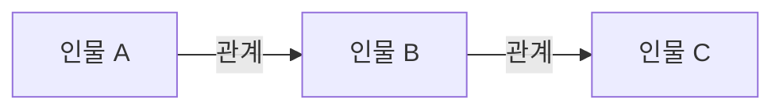

# 뜻대로 하세요

> [!abstract] 시험 직전 요약
> - **한 문장 줄거리:**
> - **핵심 사건 흐름:**
> - **작품의 핵심 의미:**

| 항목 | 내용 |
|---|---|
| 작품명 | 뜻대로 하세요 |
| 작가 | 윌리엄 셰익스피어 |

## 첫인상
## 작가 소개

- **생애와 활동 시대:**
- **작품 세계와 대표작:**

## 전체 줄거리

### 전체 줄거리

### 짧은 요약

## 사건의 흐름

- 

- **발단부터 결말까지의 흐름:**

## 등장인물과 특징

### 주요 인물

- 

### 보조 인물

- 

## 인물 관계도

## 작품의 특징과 의미

- **장르·구조의 특징:**
- **언어·연극적 형식의 특징:**
- **핵심 갈등:**
- **주제:**
- **제목의 의미:**
- **시대·사회적 의미:**
- **나에게 인상적이었던 지점:**

## 독백 대사 후보

1)

## 구술 대비

### 질문 1

- **예상 질문:**
- **핵심 키워드 3개:**  /  /  
- **30초 답변:**
- **이어질 수 있는 꼬리질문:**
- **추가 확인이 필요한 사실:**

### 질문 2

- **예상 질문:**
- **핵심 키워드 3개:**  /  /  
- **30초 답변:**
- **이어질 수 있는 꼬리질문:**
- **추가 확인이 필요한 사실:**

### 질문 3

- **예상 질문:**
- **핵심 키워드 3개:**  /  /  
- **30초 답변:**
- **이어질 수 있는 꼬리질문:**
- **추가 확인이 필요한 사실:**
