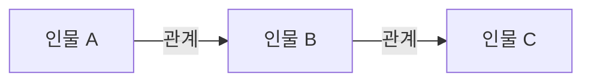

# 인생은 꿈입니다

> [!abstract] 시험 직전 요약
> - **한 문장 줄거리:**
> - **핵심 사건 흐름:**
> - **작품의 핵심 의미:**

| 항목 | 내용 |
|---|---|
| 작품명 | 인생은 꿈입니다 |
| 작가 | 칼데론 데 라 바르카 |

## 첫인상 정리

세히스문도 : 비관적이고 억압된 자유와 저주를 떠올리게 된다. 기본적인 배려와 권한이 배재된 채 탑에 가친 그는 언뜻보면 짐승처럼 야만적이고 본능적이지만, 꿈이라는 장치를 통해서 선해지고 총명해진다.
로사우라 : 아주 아름답고 지성도 뛰어난 사람으로 보임. 현명하지만 비관적이고 불행하다. 아름다움은 필연적으로 불행하다라고 말하는 그녀의 말과 운명을 같이 한다.
클로탈도 : 햄릿을 떠올리게 하는 인물. 뚜렷하게 보이는 인물은 아니다. 우유부단하고 생각이 많으며 대사 중에서 수녀원으로 가, 사느냐 죽느냐라는 대사가 햄릿을 떠올리게 만든다.
아스톨로 : 가식적이여 보이는 인물. 내면의 진심보다는 계산적인 이성이 우세하다. 그렇기 때문에 왕자와 어울리고 품격있지만 매력적으로 다가오지 않는다. 
바실리오 : 점성술과 운명, 저주를 강하게 신뢰한다. 천문학을 아들에게 대적할 수단으로서 배우는 듯 나오지만 장황한 대사 안에서 나한테 와닿는 건 별로 없었다. 하지만 아들에게 기회를 준다.  생각이 많고 책임감이 있으나 좋은지는 모르곘다.

작품에 대해서 막 적어봄 : 
꿈은 특별한 세상이다. 실체가 없는 추상적이고 약속적인 가치이기 때문에 거짓이기 때문에 진실보다 강한 힘을 갖는다.
산다는 것은 우리가 약속한 허상의 가치 내에서 행

## 작가 소개

- **생애와 활동 시대:**
- **작품 세계와 대표작:**

## 전체 줄거리

### 전체 줄거리

### 짧은 요약

## 사건의 흐름

- 

- **발단부터 결말까지의 흐름:**

## 등장인물과 특징

### 주요 인물

- 

### 보조 인물

- 

## 인물 관계도

## 작품의 특징과 의미

- **장르·구조의 특징:**
- **언어·연극적 형식의 특징:**
- **핵심 갈등:**
- **주제:**
- **제목의 의미:**
- **시대·사회적 의미:**
- **나에게 인상적이었던 지점:**

## 독백 대사 후보

1)

## 구술 대비

### 질문 1

- **예상 질문:**
- **핵심 키워드 3개:**  /  /  
- **30초 답변:**
- **이어질 수 있는 꼬리질문:**
- **추가 확인이 필요한 사실:**

### 질문 2

- **예상 질문:**
- **핵심 키워드 3개:**  /  /  
- **30초 답변:**
- **이어질 수 있는 꼬리질문:**
- **추가 확인이 필요한 사실:**

### 질문 3

- **예상 질문:**
- **핵심 키워드 3개:**  /  /  
- **30초 답변:**
- **이어질 수 있는 꼬리질문:**
- **추가 확인이 필요한 사실:**
