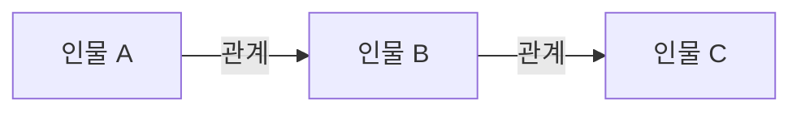

# 인생은 꿈입니다

> [!abstract] 시험 직전 요약
> - **한 문장 줄거리:**
> - **핵심 사건 흐름:**
> - **작품의 핵심 의미:**

| 항목 | 내용 |
|---|---|
| 작품명 | 인생은 꿈입니다 |
| 작가 | 칼데론 데 라 바르카 |

## 첫인상 정리

세히스문도 : 비관적이고 억압된 자유와 저주를 떠올리게 된다. 기본적인 배려와 권한이 배재된 채 탑에 가친 그는 언뜻보면 짐승처럼 야만적이고 본능적이지만, 꿈이라는 장치를 통해서 선해지고 총명해진다.
로사우라 : 아주 아름답고 지성도 뛰어난 사람으로 보임. 현명하지만 비관적이고 불행하다. 아름다움은 필연적으로 불행하다라고 말하는 그녀의 말과 운명을 같이 한다.
클로탈도 : 햄릿을 떠올리게 하는 인물. 뚜렷하게 보이는 인물은 아니다. 우유부단하고 생각이 많으며 대사 중에서 수녀원으로 가, 사느냐 죽느냐라는 대사가 햄릿을 떠올리게 만든다.
아스톨로 : 가식적이여 보이는 인물. 내면의 진심보다는 계산적인 이성이 우세하다. 그렇기 때문에 왕자와 어울리고 품격있지만 매력적으로 다가오지 않는다. 
바실리오 : 점성술과 운명, 저주를 강하게 신뢰한다. 천문학을 아들에게 대적할 수단으로서 배우는 듯 나오지만 장황한 대사 안에서 나한테 와닿는 건 별로 없었다. 하지만 아들에게 기회를 준다.  생각이 많고 책임감이 있으나 좋은지는 모르곘다.

작품에 대해서 막 적어봄 : 
꿈은 특별한 세상이다. 실체가 없는 추상적이고 약속적인 가치이기 때문에 거짓이기 때문에 진실보다 강한 힘을 갖는다.
산다는 것은 우리가 약속한 허상의 가치 내에서 행동하는 것 -> 즉 그것 또한 거짓이고 꿈이다. 
꿈은 달콤해서 사람들로 하여금 무엇인가를 이끌어낸다. 실제를 바꿀 수 있는 용기와 선함을 준다.
꿈이 달콤하기 때문에 현실은 쓰게 느껴진다. 모르면 덜, 알면 더 고통스럽다. 때론 꿈의 달콤함에 현실의 쓴 맛을 직시하게 될까봐 경계하게 되기도 한다. 

꿈은 두 가지 의미가 있다. 우리가 잘 때 꾸는 꿈과 현실에서 도달하고 싶은 꿈.
실제로 존재하지 않는 꿈이라도 그것이 우리로 하여금 용감하게 진정으로 행동하게 만들고 
결국엔 현실로 이루어지기도 한다. 용서를 구하고 그 잘못을 용서하는 거싱야말로 숭고한 마음에서 비롯된다.

## 작가 소개

- **생애와 활동 시대:**
- **작품 세계와 대표작:**

## 전체 줄거리

### 전체 줄거리
폴로니아의 왕 바실리오는 아들 세히스문도가 훗날 폭군이 되어 나라를 파멸시킬 것이라는
예언을 듣고, 이를 막기 위해
갓 태어난 아들을 외딴 탑에 가둡니다.

세히스문도는 자신의 신분조차 모른 채
바실리오의 충신 클로탈도의 보호 아래
세상과 단절된 삶을 살아갑니다.

세월이 흐른 뒤, 바실리오는
예언이 정말 옳은 것인지 확인하기 위해
세히스문도를 궁궐로 데려와
왕자로 대우합니다.

하지만 평생 자유를 빼앗긴 채 살아온
세히스문도는 갑작스럽게 주어진 권력과
자유를 제대로 다루지 못하고
분노와 폭력성을 드러냅니다.

이를 본 바실리오는 예언이 사실이라고
믿게 되고, 세히스문도를
다시 탑으로 돌려보냅니다.

탑에서 깨어난 세히스문도는
궁궐에서의 경험이
모두 꿈이었다는 말을 듣게 됩니다.

그는 현실과 꿈의 경계를 혼란스러워하지만,
설령 인생이 꿈과 같을지라도
선하게 살아야 한다는 깨달음을
얻기 시작합니다.

한편, 귀족 여성 로사우라는 자신을 버리고
왕위 계승권을 가진 에스트레야와
결혼하려는 아스톨포에게 책임을 묻고
명예를 되찾기 위해 남장을 한 채
폴로니아로 향합니다.

그 과정에서
세히스문도와 만나게 된 로사우라는
자신의 명예를 회복하기 위해 싸우고,

세히스문도는 그녀를 통해

욕망과 정의 사이에서

어떤 선택을 해야 하는지 고민하게 됩니다.

​

또한 클로탈도는 로사우라가

자신의 딸이라는 사실을 알게 되면서

충성과 부성애 사이에서 갈등합니다.

​

이후 바실리오가 정당한 후계자인 아들을

탑에 가두었다는 사실이 알려지자

백성들은 세히스문도를 구출해

왕으로 추대합니다.

​

하지만 다시 권력을 손에 쥔 세히스문도는

과거처럼 분노에 휘둘리지 않고

스스로를 통제하기로 선택합니다.

​

그는 자신을 가둔 아버지를 용서하고,

로사우라가 명예를 회복할 수 있도록 돕습니다.

결국 세히스문도는 예언에 굴복하지 않고

자신의 의지로 행동하는 법을 배우며

진정한 군주로 성장합니다.

**[출처]** [한예종 지정희곡 페드로 칼데론 데 라 바르카 <인생은 꿈입니다> 분석_악어연기학원](https://blog.naver.com/crocodileactors/224312699200)|**작성자** [악어연기학원](https://blog.naver.com/crocodileactors)
### 짧은 요약

## 사건의 흐름

- 

- **발단부터 결말까지의 흐름:**

## 등장인물과 특징

### 주요 인물

- 

### 보조 인물

- 

## 인물 관계도

## 작품의 특징과 의미

- **장르·구조의 특징:**
- **언어·연극적 형식의 특징:**
- **핵심 갈등:**
- **주제:**
- **제목의 의미:**
- **시대·사회적 의미:**
- **나에게 인상적이었던 지점:**

## 독백 대사 후보

1)

## 구술 대비

### 질문 1

- **예상 질문:**
- **핵심 키워드 3개:**  /  /  
- **30초 답변:**
- **이어질 수 있는 꼬리질문:**
- **추가 확인이 필요한 사실:**

### 질문 2

- **예상 질문:**
- **핵심 키워드 3개:**  /  /  
- **30초 답변:**
- **이어질 수 있는 꼬리질문:**
- **추가 확인이 필요한 사실:**

### 질문 3

- **예상 질문:**
- **핵심 키워드 3개:**  /  /  
- **30초 답변:**
- **이어질 수 있는 꼬리질문:**
- **추가 확인이 필요한 사실:**
