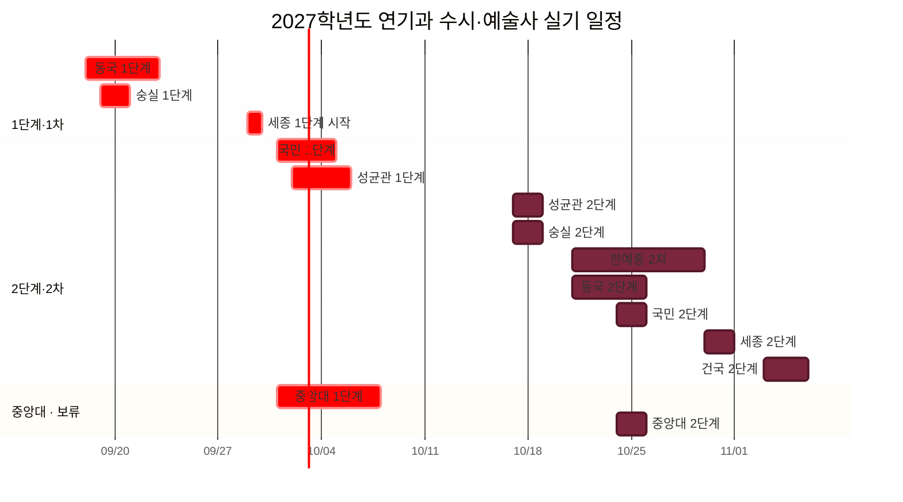

# 2027학년도 연기과 입시 시험 일정 그래프

[[의상 및 헤어 등 이미지|← 입시 이미지 총괄 대시보드]] · [[2027 연기과 지정작품 총정리|지정작품 한눈에 보기]] · [[2027 연기과 학교별 내신 환산 및 5등급 비교|학교별 내신 영향 비교]] · [[2027 연기과 학교별 1·2차 실기 종목 정리|1·2차 실기 종목]]

> [!note] 그래프 기준
> 가천대학교, 서울예술대학교, 인천대학교는 제외했다. 한국예술종합학교 1차는 응시 완료 상태이므로 시험 막대에서 제외하고 합격 발표부터 표시했다. 중앙대학교는 공식 일정은 기입하되 지원 판단 **보류** 상태로 맨 아래에 분리했다.

![[Pasted image 20260830205004.png]]

## 전체 타임라인

> **빨강: 1차·1단계** · **자주: 2차·2단계** · **노랑: 합격자 발표**

> [!danger] 가장 붐비는 구간: 10월 21일~25일
> 10월 21~23일은 한예종 2차와 동국대 2단계가 겹친다. 24~25일에는 국민대 2단계까지 더해져 세 학교가 동시에 진행된다. 중앙대 보류 일정까지 포함하면 24~25일은 네 학교가 겹친다.

## 학교별 일정·합격자 발표표

| 상태 | 학교 | 1차·1단계 시험 | 1차 합격 발표 | 2차·2단계 시험 | 최종 합격자 발표 |
|---|---|---|---|---|---|
| 응시 완료 | 한예종 | 그래프에서 제외 | **2026-10-13 17:00** | **2026-10-21~10-29** · 예상 개인 시험일 **10/24~26 중 1일** | **2026-11-06 17:00** |
| 확정 | 동국대 | 2026-09-18~09-22 | **2026-10-06 예정** | 2026-10-21~10-25 | **2026-12-01 예정** |
| 확정 | 세종대 | 2026-09-29부터 | **2026-10-21 17시 이후** | 2026-10-30~10-31 | **2026-11-06 17시 이후** |
| 확정 | 국민대 | 2026-10-01~10-04 | **2026-10-20 14:00** | 2026-10-24~10-25 | **2026-11-10 17:00** |
| 확정 | 성균관대 | 2026-10-02~10-05 | **2026-10-13** | 2026-10-17~10-18 | **2026-12-18 이전** |
| 확정 | 건국대 | 학생부 1단계 | **2026-10-22 14:00 예정** | **2026-11-03~11-05** | **2026-12-18 14:00 예정** |
| 확정 | 숭실대 | 2026-09-19~09-20 | **2026-10-13 10:00** | 2026-10-17~10-18 | **2026-10-30 10:00** |
| **보류** | **중앙대** | **2026-10-01~10-07** | **2026-10-13 14:00** | **2026-10-24~10-25** | **2026-11-17 14:00** |

> **합격자 발표 기준:** 날짜와 시각은 각 대학 2027학년도 공식 모집요강의 전형 일정표를 옮겼다. 모집요강이 ‘예정’ 또는 ‘이전’이라고 표시한 경우 그 표현도 그대로 유지했다. 성균관대 최종 발표는 공식 요강에 특정 날짜가 아니라 **2026-12-18 이전**으로만 안내되어 있어 임의로 하루를 정하지 않았다.

## 일정 해석 메모

- **한예종:** 1차 시험은 이미 응시했으므로 그래프에서 제외했다. 2차 종료일은 기존 10월 30일이 아니라 공식 모집요강상 **10월 29일**이다. 개인 시험일은 현재 **10월 24~26일 중 하루로 예상**되어 그래프에 노란 점선으로 표시했다. 이 날짜는 공식 배정 전 예상치다.
- **세종대:** 1단계 합격 발표일을 기존 10월 8일에서 공식 일정인 **10월 21일 17시 이후**로 바로잡았다. 1단계 시험 종료일과 개인별 고사일은 수험생 유의사항에서 확인한다.
- **중앙대:** 시험·발표일은 공식 모집요강에 확정되어 있지만 사용자의 지원 판단 상태가 보류이므로, 표의 마지막 행과 이미지 최하단에 따로 표시했다.
- **개인 고사시간:** 학교가 고사 기간만 공지한 경우 실제 응시일·입실시간은 수험표 또는 추후 고사장 공지를 우선한다.

## 공식 출처

- [한국예술종합학교 2027학년도 예술사과정 모집요강](https://www.karts.ac.kr/cmm/fms/FileDown.do?accAt=&atchFileId=FILE_000000000161996&bbsId=BBSMSTR_000000000007&fileSn=23&nttId=69907&trgetId=SYSTEM_DEFAULT_BOARD)
- [동국대학교 2027학년도 수시모집요강](https://ipsi.dongguk.edu/upload/file/20260601115911UVEHWG.PDF)
- [세종대학교 2027학년도 수시모집요강 공지](https://ipsi.sejong.ac.kr/sub_page/sub5/0107_view.asp?B_CATEGORY=0&B_CODE=BOARD_1455878015&IDX=1128&gotopage=1&search_category=&searchstring=&tab1=5)
- [국민대학교 2027학년도 수시모집요강 PDF](https://admission.kookmin.ac.kr/datafiles/contents/%EA%B5%AD%EB%AF%BC%EB%8C%80%ED%95%99%EA%B5%90_2027%ED%95%99%EB%85%84%EB%8F%84_%EC%88%98%EC%8B%9C_%EB%AA%A8%EC%A7%91%EC%9A%94%EA%B0%95%282026.06.22%29.pdf)
- [성균관대학교 2027학년도 수시모집요강](https://admission.skku.edu/upload/guide/20260529115520H43SMR.pdf)
- [건국대학교 2027학년도 수시모집요강](https://enter.konkuk.ac.kr/file/pdfDown.pdf?ofn=2027%ED%95%99%EB%85%84%EB%8F%84+%EA%B1%B4%EA%B5%AD%EB%8C%80%ED%95%99%EA%B5%90+%EC%84%9C%EC%9A%B8%EC%BA%A0%ED%8D%BC%EC%8A%A4+%EC%88%98%EC%8B%9C%EB%AA%A8%EC%A7%91%EC%9A%94%EA%B0%95%28%EB%8B%A8%EB%A9%B4%29_20260513.pdf&sfn=20260526035352665_9631.pdf)
- [숭실대학교 2027학년도 수시 모집요강](https://admission.ssu.ac.kr/mojip/req.asp?flag=1&page_no=1_2_2)
- [중앙대학교 2027학년도 수시모집요강](https://admission.cau.ac.kr/file/pdfDown.pdf?ofn=%EC%A4%91%EC%95%99%EB%8C%80%ED%95%99%EA%B5%90_2027%ED%95%99%EB%85%84%EB%8F%84+%EC%88%98%EC%8B%9C%EB%AA%A8%EC%A7%91%EC%9A%94%EA%B0%95%28%EB%8B%A8%EB%A9%B4%29_%EA%B3%B5%EA%B3%A0%EC%9A%A9.pdf&sfn=20260609111455769_c6144e06ef38475d8ce9563f87b7f3b4.pdf)
