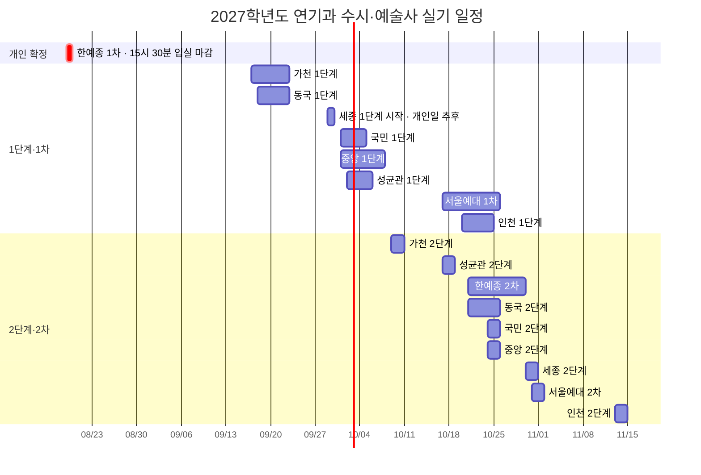

# 2027학년도 연기과 입시 시험 일정 그래프

[[의상 및 헤어 등 이미지|← 입시 이미지 총괄 대시보드]] · [[2027 연기과 지정작품 총정리|지정작품 한눈에 보기]]

![[2027 연기과 이미지/첨부/2027 연기과 시험 일정.png|1000]]

> [!success] 지원 확정 학교
> **한국예술종합학교 · 성균관대학교 · 동국대학교 · 건국대학교**  
> 이 표시는 지원 대상이 확정됐다는 뜻이며, 개인 고사일이나 합격이 확정됐다는 뜻은 아니다.

> [!tip] 이미지 활용
> 이미지를 길게 눌러 휴대폰에 저장하거나, 옵시디언에서 확대해 일정 충돌 구간을 확인한다. 아래 Mermaid 그래프와 날짜표는 수정 가능한 원본으로 그대로 남겨 두었다.

> [!important] 그래프 읽는 법
> 막대는 **학교가 공지한 전체 실기 기간**이다. 실제로 매일 시험을 보는 것이 아니라, 이 기간 안에서 배정된 **개인 고사일 하루**에 응시하는 경우가 많다. 한예종 1차만 현재 본인 일정이 확정되어 정확한 날짜와 입실 마감 시각을 표시했다.

## 전체 타임라인

> [!danger] 가장 붐비는 구간: 10월 21일~25일
> 한예종 2차·동국 2단계·서울예대 1차·인천 1단계가 겹치고, 24~25일에는 국민·중앙 2단계까지 더해진다. 이 구간은 개인 고사일 발표 즉시 충돌 여부를 확인해야 한다.

## 월별 압축 보기

| 월      | 날짜              | 시험                                         | 겹침 정도     |
| ------ | --------------- | ------------------------------------------ | --------- |
| 8월     | **08-19**       | **한예종 1차 — 본인 15:30까지 입실**                 | 개인 일정 확정  |
| 9월     | 09-17~09-22     | 가천 1단계·동국 1단계                              | 높음        |
| 9월     | 09-29~          | 세종 1단계 시작                                  | 개인일 확인 필요 |
| 10월    | 10-01~10-07     | 국민 1단계·중앙 1단계·성균관 1단계                      | **매우 높음** |
| 10월    | 10-09~10-10     | 가천 2단계                                     | 단독        |
| 10월    | 10-17~10-18     | 성균관 2단계·서울예대 1차                            | 높음        |
| 10월    | **10-21~10-25** | 한예종 2차·동국 2단계·서울예대 1차·인천 1단계·국민 2단계·중앙 2단계 | **최고**    |
| 10~11월 | 10-30~11-01     | 세종 2단계·서울예대 2차                             | 높음        |
| 11월    | 11-13~11-14     | 인천 2단계                                     | 단독        |

## 학교별 날짜표

| 학교 | 1단계·1차 | 2단계·2차 | 개인 일정 확인·주의 |
|---|---|---|---|
| ✅ [[2027 연기과 이미지/학교별/한국예술종합학교|한예종]] | **08-19, 본인 15:30 입실 마감** | 10-21~10-29 | **지원 확정** · 2차 시간표 10-14 15:00 확인 |
| [[2027 연기과 이미지/학교별/가천대학교|가천]] | 09-17~09-22 | 10-09~10-10 | 1단계 고사장 09-14 확인 |
| ✅ [[2027 연기과 이미지/학교별/동국대학교|동국]] | 09-18~09-22 | 10-21~10-25 | **지원 확정** · 고사 안내 09-16·10-19 확인 |
| [[2027 연기과 이미지/학교별/세종대학교|세종]] | 09-29부터 | 10-30~10-31 | 1단계 개인일·종료일 09-22 공지 확인 |
| [[2027 연기과 이미지/학교별/국민대학교|국민]] | 10-01~10-04 | 10-24~10-25 | 고사 안내 09-22·10-20 확인 |
| [[2027 연기과 이미지/학교별/중앙대학교|중앙]] | 10-01~10-07 | 10-24~10-25 | 고사 안내 09-22·10-13 확인 |
| ✅ [[2027 연기과 이미지/학교별/성균관대학교|성균관]] | 10-02~10-05 | 10-17~10-18 | **지원 확정** · 개인 고사시간 확인 |
| [[2027 연기과 이미지/학교별/서울예술대학교|서울예대]] | 10-17~10-25 | 10-31~11-01 | 1차 개인일은 10-12 16:00 이후 확인 |
| [[2027 연기과 이미지/학교별/인천대학교|인천]] | 10-20~10-24 | 11-13~11-14 | 고사 안내 10-07·11-11 확인 |
| ✅ [[2027 연기과 이미지/학교별/건국대학교|건국]] | 학생부 선발, 실기 없음 | **최종 모집요강·고사 안내 재확인** | **지원 확정** · 이미지에 날짜 재확인 행으로 표시 |

## 충돌 확인 체크리스트

- [ ] 한예종 1차: **08-19 15:30 입실 마감** 기준으로 이동·식사·헤어 준비 역산
- [ ] 09-17~09-22: 가천과 동국의 개인 고사일이 겹치는지 확인
- [ ] 10-01~10-05: 국민·중앙·성균관의 개인 고사일이 겹치는지 확인
- [ ] 10-17~10-18: 성균관 2단계와 서울예대 1차가 겹치는지 확인
- [ ] 10-21~10-25: 최대 6개 학교의 개인 고사일과 이동시간을 한 표에 확정
- [ ] 10-30~11-01: 세종 2단계와 서울예대 2차가 겹치는지 확인
- [ ] 모든 학교의 수험표·입실 마감·고사장 변경 공지를 전날 다시 확인

## 날짜 미확정·재확인 항목

- **세종 1단계:** 공식 모집요강에는 09-29 시작으로 안내되어 있다. 종료일과 본인 고사일은 09-22 수험생 유의사항에서 확정한다.
- **건국 2단계:** 현재 확보한 공식 시행계획만으로 최종 실기일을 확정하지 않았다. 최종 수시 모집요강과 실기고사 안내 확인 후 그래프에 추가한다.
- **모든 기간형 시험:** 대학이 정정 공지 또는 개인별 고사시간을 발표하면 그 최신 공지가 이 노트보다 우선한다.

## 공식 출처

- [한국예술종합학교 2027학년도 예술사과정 모집요강](https://karts.ac.kr/cop/bbs/selectBoardArticle.do?bbsId=BBSMSTR_000000000007&nttNo=69907&siteId=&sysTyCode=), 연기과 전형일정, 확인 2026-08-04
- [가천대학교 2027학년도 수시모집요강](https://admission.gachon.ac.kr/upload/BBS0021/20260522154511HBZYTW.PDF), 확인 2026-08-04
- [동국대학교 2027학년도 수시모집요강](https://ipsi.dongguk.edu/upload/file/20260601115911UVEHWG.PDF), 확인 2026-08-04
- [세종대학교 2027학년도 수시모집요강 공지](https://ipsi.sejong.ac.kr/sub_page/sub5/0107_view.asp?B_CATEGORY=0&B_CODE=BOARD_1455878015&IDX=1128&gotopage=1&search_category=&searchstring=&tab1=5), 확인 2026-08-04
- [국민대학교 2027학년도 수시모집요강](https://admission.kookmin.ac.kr/nonschedule/notice.php?ctype=view&no=1070&page=1), 확인 2026-08-04
- [중앙대학교 2027학년도 수시모집요강](https://admission.cau.ac.kr/file/pdfDown.pdf?ofn=%EC%A4%91%EC%95%99%EB%8C%80%ED%95%99%EA%B5%90_2027%ED%95%99%EB%85%84%EB%8F%84+%EC%88%98%EC%8B%9C%EB%AA%A8%EC%A7%91%EC%9A%94%EA%B0%95%28%EB%8B%A8%EB%A9%B4%29_%EA%B3%B5%EA%B3%A0%EC%9A%A9.pdf&sfn=20260609111455769_c6144e06ef38475d8ce9563f87b7f3b4.pdf), 확인 2026-08-04
- [성균관대학교 2027학년도 수시모집요강](https://admission.skku.edu/upload/guide/20260529115520H43SMR.pdf), 확인 2026-08-04
- [서울예술대학교 2027학년도 수시 전문학사학위과정 모집요강](https://www.seoularts.ac.kr/web/cop/bbsWeb/selectBoardDetail.do?bbsId=BBSMSTR_000000000702&nttId=242297&nttIds=0), 확인 2026-08-04
- [인천대학교 2027학년도 수시모집요강](https://admission.inu.ac.kr/file/download.do?sfn=20260608112433651_2027%ed%95%99%eb%85%84%eb%8f%84+%ec%9d%b8%ec%b2%9c%eb%8c%80%ed%95%99%ea%b5%90+%ec%88%98%ec%8b%9c%eb%AA%A8%EC%A7%91%EC%9A%94%EA%B0%95.pdf&ofn=2027%ed%95%99%eb%85%84%eb%8f%84+%ec%9d%b8%ec%b2%9c%eb%8c%80%ed%95%99%ea%B5%90+%ec%88%98%ec%8b%9c%eb%AA%A8%EC%A7%91%EC%9A%94%EA%B0%95.pdf), 확인 2026-08-04
- [건국대학교 2027학년도 입학전형 시행계획](https://enter.konkuk.ac.kr/file/pdfDown.pdf?ofn=%5B%EC%B5%9C%EC%A2%85_%EB%86%8D%EC%96%B4%EC%B4%8C%EB%B0%98%EC%98%81%5D+2027+%EC%9E%85%ED%95%99%EC%A0%84%ED%98%95%EC%8B%9C%ED%96%89%EA%B3%84%ED%9A%8D_250714.pdf&sfn=20250714115345568_6455.pdf), 확인 2026-08-04
