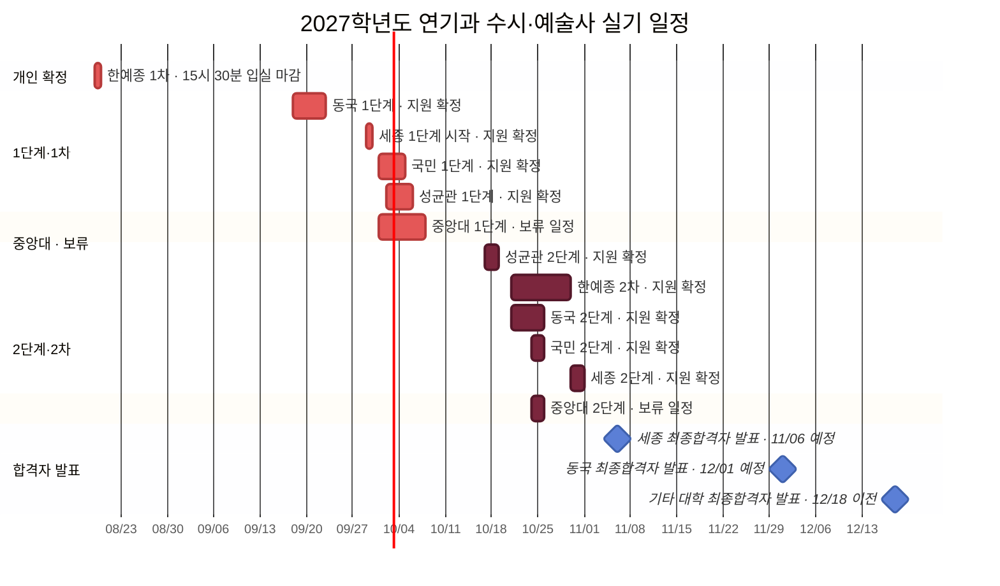

# 2027학년도 연기과 입시 시험 일정 그래프

[[의상 및 헤어 등 이미지|← 입시 이미지 총괄 대시보드]] · [[2027 연기과 지정작품 총정리|지정작품 한눈에 보기]] · [[2027 연기과 학교별 내신 환산 및 5등급 비교|학교별 내신 영향 비교]] · [[2027 연기과 학교별 1·2차 실기 종목 정리|1·2차 실기 종목]]

> [!note] 그래프 기준
> 아래 Mermaid 그래프와 표를 현재 기준 일정으로 사용한다. 기존 겹침지도 이미지는 제외 학교가 포함되어 있어 표시하지 않는다.

## 전체 타임라인 

> **학교 1차·1단계** · **🟤 학교 2차·2단계**  

> [!danger] 가장 붐비는 구간: 10월 21일~25일
> 한예종 2차·동국 2단계가 겹치고, 24~25일에는 국민 2단계까지 겹친다. 중앙대는 현재 보류 일정으로 별도 표시했으므로 공식 확정 시 충돌 여부를 다시 계산한다.

## 학교별 일정·합격자 발표표

| 상태 | 학교 | 1차·1단계 시험 | 2차·2단계 시험 | 합격자 발표 |
|---|---|---|---|---|
| 확정 | 한예종 | 2026-08-19 (개인 입실 15:30) | 2026-10-21~10-30 | 모집요강상 별도 확인 |
| 확정 | 동국대 | 2026-09-18~09-22 | 2026-10-21~10-25 | **2026-12-01 예정** |
| 확정 | 세종대 | 2026-09-29부터 | 2026-10-30~10-31 | **2026-11-06 17시 이후** |
| 확정 | 국민대 | 2026-10-01~10-04 | 2026-10-24~10-25 | 2026-12-18 이전 |
| 보류 | 중앙대 | 2026-10-01~10-07 (보류) | 2026-10-24~10-25 (보류) | 일정·발표일 보류 |
| 확정 | 성균관대 | 2026-10-02~10-05 | 2026-10-17~10-18 | **2026-12-18 이전** |
| 확정 | 인천대 | 2026-10-20~10-24 | 2026-11-13~11-14 | 2026-12-18 이전 |
| 확정 | 건국대 | 학생부 1단계 (일정 미정) | 2단계 고사일 미정 | 2026-12-18 이전 |
| 확정 | 숭실대 | 2026-09-19~09-20 | 2026-10-17~10-18 | 2026-12-18 이전 |

> **합격자 발표 기준:** 모집요강에서 특정 일자를 확정한 경우 그대로 적었고, ‘~이전’만 제시한 경우 마감일을 적었다. 한예종·건국대는 현재 노트에 확인 가능한 연기과 세부 발표일이 없어 ‘별도 확인/미정’으로 남겼다.

## 날짜 미확정·재확인 항목

- **중앙대:** 1·2단계 시험일과 합격자 발표일을 공식 확정 전까지 보류로 표시했다. 확정 모집요강·고사 안내가 나오면 보류 표기를 해제한다.
- **세종 1단계:** 공식 모집요강에는 09-29 시작으로 안내되어 있다. 종료일과 본인 고사일은 수험생 유의사항에서 확정한다.
- **건국 2단계:** 현재 확보한 공식 시행계획만으로 최종 실기일을 확정하지 않았다. 최종 수시 모집요강과 실기고사 안내 확인 후 그래프에 추가한다.

## 공식 출처

- [한국예술종합학교 2027학년도 예술사과정 모집요강](https://karts.ac.kr/cop/bbs/selectBoardArticle.do?bbsId=BBSMSTR_000000000007&nttNo=69907&siteId=&sysTyCode=), 연기과 전형일정, 확인 2026-08-04
- [동국대학교 2027학년도 수시모집요강](https://ipsi.dongguk.edu/upload/file/20260601115911UVEHWG.PDF), 확인 2026-08-04
- [세종대학교 2027학년도 수시모집요강 공지](https://ipsi.sejong.ac.kr/sub_page/sub5/0107_view.asp?B_CATEGORY=0&B_CODE=BOARD_1455878015&IDX=1128&gotopage=1&search_category=&searchstring=&tab1=5), 확인 2026-08-04
- [국민대학교 2027학년도 수시모집요강](https://admission.kookmin.ac.kr/nonschedule/notice.php?ctype=view&no=1070&page=1), 확인 2026-08-04
- [중앙대학교 2027학년도 수시모집요강](https://admission.cau.ac.kr/file/pdfDown.pdf?ofn=%EC%A4%91%EC%95%99%EB%8C%80%ED%95%99%EA%B5%90_2027%ED%95%99%EB%85%84%EB%8F%84+%EC%88%98%EC%8B%9C%EB%AA%A8%EC%A7%91%EC%9A%94%EA%B0%95%28%EB%8B%A8%EB%A9%B4%29_%EA%B3%B5%EA%B3%A0%EC%9A%A9.pdf&sfn=20260609111455769_c6144e06ef38475d8ce9563f87b7f3b4.pdf), p.68, 확인 2026-08-30
- [성균관대학교 2027학년도 수시모집요강](https://admission.skku.edu/upload/guide/20260529115520H43SMR.pdf), 확인 2026-08-04
- [건국대학교 2027학년도 입학전형 시행계획](https://enter.konkuk.ac.kr/file/pdfDown.pdf?ofn=%5B%EC%B5%9C%EC%A2%85_%EB%86%8D%EC%96%B4%EC%B4%8C%EB%B0%98%EC%98%81%5D+2027+%EC%9E%85%ED%95%99%EC%A0%84%ED%98%95%EC%8B%9C%ED%96%89%EA%B3%84%ED%9A%8D_250714.pdf&sfn=20250714115345568_6455.pdf), 확인 2026-08-04
