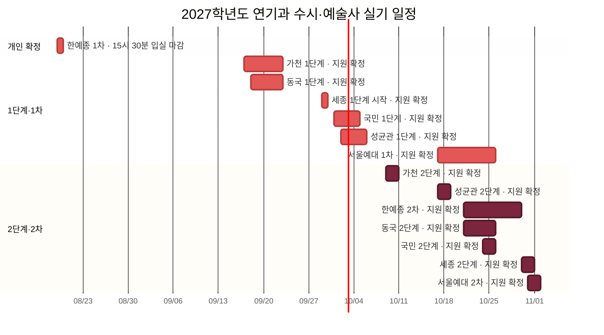

# 2027학년도 연기과 입시 시험 일정 그래프

[[의상 및 헤어 등 이미지|← 입시 이미지 총괄 대시보드]] · [[2027 연기과 지정작품 총정리|지정작품 한눈에 보기]]

![[2027 연기과 이미지/첨부/2027 연기과 시험 일정-겹침지도.png|1000]]

## 전체 타임라인 

> **학교 1차·1단계** · **🟤 학교 2차·2단계**  

> [!danger] 가장 붐비는 구간: 10월 21일~25일
> 한예종 2차·동국 2단계·서울예대 1차가 겹치고, 24~25일에는 국민 2단계까지 겹친다. 개인 고사일 발표 즉시 충돌 여부를 확인한다.

## 월별 압축 보기

| 월 | 날짜 | 시험 | 겹침 정도 |
|---|---|---|---|
| 8월 | **08-19** | **한예종 1차 — 본인 15:30까지 입실** | 개인 일정 확정 |
| 9월 | 09-17~09-22 | 가천 1단계·동국 1단계 | 높음 |
| 9월 | 09-29~ | 세종 1단계 시작 | 개인일 확인 필요 |
| 10월 | 10-01~10-05 | 국민 1단계·성균관 1단계 | 높음 |
| 10월 | 10-09~10-10 | 가천 2단계 | 단독 |
| 10월 | 10-17~10-18 | 성균관 2단계·서울예대 1차 | 높음 |
| 10월 | **10-21~10-25** | 한예종 2차·동국 2단계·서울예대 1차·국민 2단계 | **최고** |
| 10~11월 | 10-30~11-01 | 세종 2단계·서울예대 2차 | 높음 |

## 학교별 날짜표

> `🟩 확정`은 실제 지원하기로 확정한 학교다.

| 지원 상태 | 학교 | 1단계·1차 | 2단계·2차 | 개인 일정 확인·주의 |
|---|---|---|---|---|
| **🟩 확정** | **[[2027 연기과 이미지/학교별/한국예술종합학교|한국예술종합학교]]** | **08-19, 본인 15:30 입실 마감** | 10-21~10-29 | 2차 시간표 10-14 15:00 확인 |
| **🟩 확정** | **[[2027 연기과 이미지/학교별/가천대학교|가천대학교]]** | 09-17~09-22 | 10-09~10-10 | 1단계 고사장 09-14 확인 |
| **🟩 확정** | **[[2027 연기과 이미지/학교별/동국대학교|동국대학교]]** | 09-18~09-22 | 10-21~10-25 | 고사 안내 09-16·10-19 확인 |
| **🟩 확정** | **[[2027 연기과 이미지/학교별/세종대학교|세종대학교]]** | 09-29부터 | 10-30~10-31 | 1단계 개인일·종료일 09-22 공지 확인 |
| **🟩 확정** | **[[2027 연기과 이미지/학교별/국민대학교|국민대학교]]** | 10-01~10-04 | 10-24~10-25 | 고사 안내 09-22·10-20 확인 |
| **🟩 확정** | **[[2027 연기과 이미지/학교별/성균관대학교|성균관대학교]]** | 10-02~10-05 | 10-17~10-18 | 개인 고사시간 확인 |
| **🟩 확정** | **[[2027 연기과 이미지/학교별/서울예술대학교|서울예술대학교]]** | 10-17~10-25 | 10-31~11-01 | 1차 개인일은 10-12 16:00 이후 확인 |
| **🟩 확정** | **[[2027 연기과 이미지/학교별/건국대학교|건국대학교]]** | 학생부 선발, 실기 없음 | **최종 모집요강·고사 안내 재확인** | 날짜 확인 후 일정표에 반영 |

## 날짜 미확정·재확인 항목

- **세종 1단계:** 공식 모집요강에는 09-29 시작으로 안내되어 있다. 종료일과 본인 고사일은 09-22 수험생 유의사항에서 확정한다.
- **건국 2단계:** 현재 확보한 공식 시행계획만으로 최종 실기일을 확정하지 않았다. 최종 수시 모집요강과 실기고사 안내 확인 후 그래프에 추가한다.

## 공식 출처

- [한국예술종합학교 2027학년도 예술사과정 모집요강](https://karts.ac.kr/cop/bbs/selectBoardArticle.do?bbsId=BBSMSTR_000000000007&nttNo=69907&siteId=&sysTyCode=), 연기과 전형일정, 확인 2026-08-04
- [가천대학교 2027학년도 수시모집요강](https://admission.gachon.ac.kr/upload/BBS0021/20260522154511HBZYTW.PDF), 확인 2026-08-04
- [동국대학교 2027학년도 수시모집요강](https://ipsi.dongguk.edu/upload/file/20260601115911UVEHWG.PDF), 확인 2026-08-04
- [세종대학교 2027학년도 수시모집요강 공지](https://ipsi.sejong.ac.kr/sub_page/sub5/0107_view.asp?B_CATEGORY=0&B_CODE=BOARD_1455878015&IDX=1128&gotopage=1&search_category=&searchstring=&tab1=5), 확인 2026-08-04
- [국민대학교 2027학년도 수시모집요강](https://admission.kookmin.ac.kr/nonschedule/notice.php?ctype=view&no=1070&page=1), 확인 2026-08-04
- [성균관대학교 2027학년도 수시모집요강](https://admission.skku.edu/upload/guide/20260529115520H43SMR.pdf), 확인 2026-08-04
- [서울예술대학교 2027학년도 수시 전문학사학위과정 모집요강](https://www.seoularts.ac.kr/web/cop/bbsWeb/selectBoardDetail.do?bbsId=BBSMSTR_000000000702&nttId=242297&nttIds=0), 확인 2026-08-04
- [건국대학교 2027학년도 입학전형 시행계획](https://enter.konkuk.ac.kr/file/pdfDown.pdf?ofn=%5B%EC%B5%9C%EC%A2%85_%EB%86%8D%EC%96%B4%EC%B4%8C%EB%B0%98%EC%98%81%5D+2027+%EC%9E%85%ED%95%99%EC%A0%84%ED%98%95%EC%8B%9C%ED%96%89%EA%B3%84%ED%9A%8D_250714.pdf&sfn=20250714115345568_6455.pdf), 확인 2026-08-04
