<iframe width="560" height="315" src="https://www.youtube.com/embed/PGgDgIjHZWw" title="YouTube video player" frameborder="0" allow="accelerometer; autoplay; clipboard-write; encrypted-media; gyroscope; picture-in-picture" allowfullscreen></iframe>

## 한 줄 핵심

스케일의 방향(상행/하행), 음 간격, 호흡 강도, 스케일 너비를 전략적으로 조합하면 흉성 강화, 두성 개발, 성구 전환, 특정 테크닉 집중 등 원하는 목표에 맞는 맞춤형 훈련 도구를 설계할 수 있다.

## 개요

**러닝타임**: 10분 34초
**난이도**: 고급 (스케일 훈련의 기본 이해 필요)
**선수 학습**: "스케일을 해야 하는 이유, 그리고 발성 기관이 발전하는 원리" 영상 권장

**학습 목표**:
- 스케일 방향(상행/하행)의 전략적 의미 이해
- 음 간격이 훈련 효과에 미치는 영향 파악
- 호흡 강도를 통한 성구 조절 방법 학습
- 개인 목표에 맞는 스케일 설계 능력 습득

**핵심 질문**: 어떻게 하면 내 발성 약점을 보완하는 맞춤형 스케일을 만들 수 있는가?

## 목차

1. [[#스케일 디자인의 4가지 핵심 변수]]
2. [[#상행 vs 하행 스케일의 전략]]
3. [[#음 간격의 과학]]
4. [[#호흡 강도와 성구의 관계]]
5. [[#스케일 너비의 전략적 활용]]
6. [[#실전 스케일 디자인 예시]]
7. [[#용어 사전]]
8. [[#종합 정리]]
9. [[#셀프테스트]]
10. [[#내 생각 & 연결]]
11. [[#보충자료]]

---

## 스케일 디자인의 4가지 핵심 변수

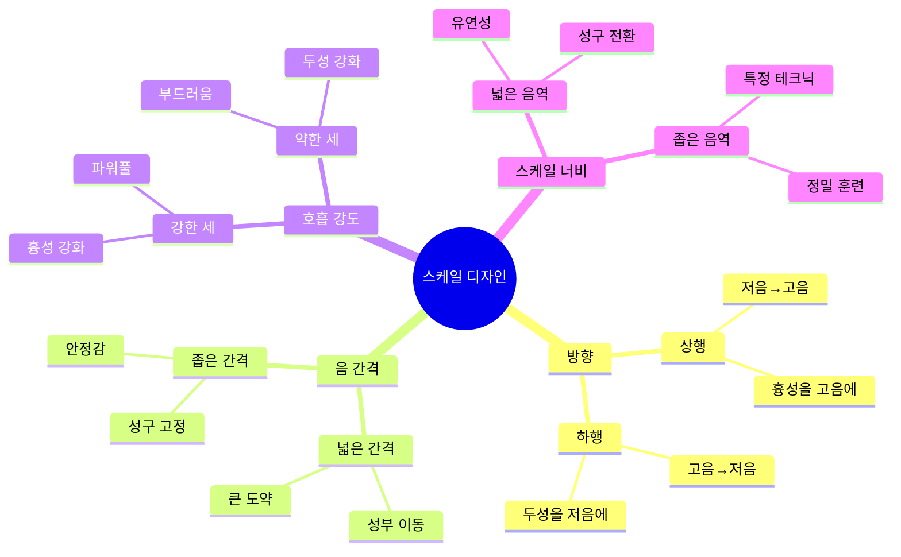

### 스케일 디자인의 본질

스케일은 단순히 "도레미파솔"이 아니다. 각 변수를 조합하여:

| 목표 | 디자인 전략 |
|------|-----------|
| 고음에 힘 실기 | 상행 + 좁은 간격 + 강한 호흡 + 넓은 음역 |
| 부드러운 고음 개발 | 하행 + 넓은 간격 + 약한 호흡 + 넓은 음역 |
| 저음 풍성하게 | 하행 + 좁은 간격 + 강한 호흡 + 좁은 음역 |
| 성구 전환 매끄럽게 | 상행+하행 교차 + 넓은 간격 + 중간 호흡 + 넓은 음역 |

> [!note] 개인 맞춤화의 중요성
> 같은 스케일이라도 사람마다 효과가 다르다. 자신의 약점(예: 고음이 약함, 저음이 얇음, 성구 전환이 불안정함)을 정확히 파악하고 그에 맞는 스케일을 설계해야 한다.

---

## 상행 vs 하행 스케일의 전략

### 상행 스케일: 저음의 특성을 고음으로

**핵심 원리**: 저음에서 자연스럽게 나오는 흉성의 특성을 고음까지 끌고 올라간다.

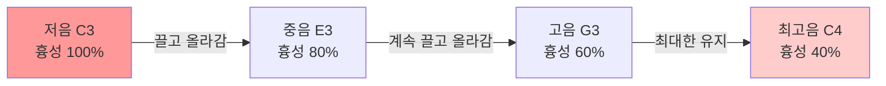

**훈련 효과**:
- 고음에 힘과 두께 추가 (파워풀한 고음)
- 벨팅(Belting) 능력 개발
- 믹스보이스에서 흉성 비율 증가

**주의사항**:
- 과도하게 밀어붙이면 목에 무리
- 긴장 없이 "끌고 올라가는" 감각이 중요
- 처음에는 높이 올라가지 않아도 괜찮음

> [!warning] 흔한 실수
> 상행 스케일에서 고음으로 올라갈 때 "밀어붙이는" 것과 "끌고 올라가는" 것을 혼동하기 쉽다. 밀어붙이면 목이 조이지만, 끌고 올라가면 저음의 편안함이 유지되면서 고음으로 이동한다.

### 하행 스케일: 고음의 특성을 저음으로

**핵심 원리**: 고음에서 자연스럽게 나오는 두성의 특성을 저음까지 끌고 내려온다.

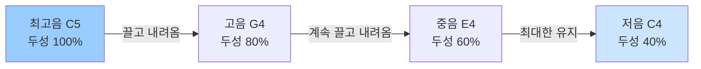

**훈련 효과**:
- 저음에 맑고 깨끗한 음색 추가
- 저음의 울림(공명) 개선
- 두성 근육 발달로 전체 음역 안정감 증가

**특별한 가치**:
> [!tip] 하행 스케일의 숨은 효과
> 많은 초보자들이 상행 스케일만 하고 하행 스케일을 소홀히 한다. 하지만 하행 스케일 없이 상행 스케일만 하면 고음은 발달하지만 불균형한 발성이 된다. **상행 스케일을 하면 반드시 하행 스케일도 함께 해야 균형잡힌 발성**이 된다.

### 상행 + 하행의 시너지 효과

| 측면 | 상행만 할 때 | 하행만 할 때 | 상행+하행 함께 |
|------|------------|------------|---------------|
| 고음 | 파워풀하지만 거칠 수 있음 | 부드럽지만 약할 수 있음 | 파워와 부드러움 공존 |
| 저음 | 두껍지만 답답할 수 있음 | 맑지만 얇을 수 있음 | 두께와 맑음 공존 |
| 성구 전환 | 한쪽 방향만 익숙 | 한쪽 방향만 익숙 | 양방향 모두 자연스러움 |
| 전체 균형 | 불균형 | 불균형 | 균형잡힘 |

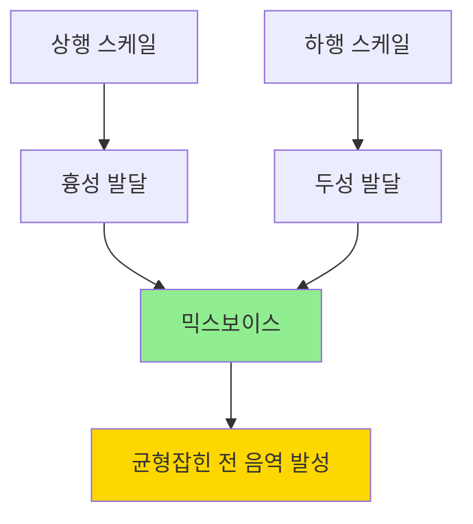

---

## 음 간격의 과학

### 넓은 음 간격: 성부 이동 훈련

**예시**: 도 - 솔 - 도 (5도 또는 옥타브 도약)

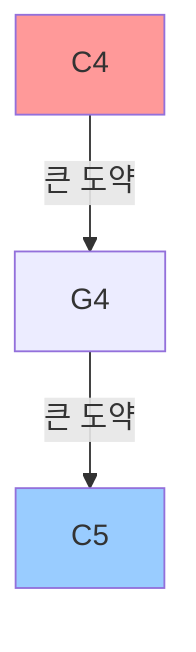

**특징**:
- 음이 크게 뛰면 성구가 빠르게 전환됨
- 저음과 고음을 오가며 흉성↔두성 전환 연습
- 성구 브릿지(passaggio) 통과 훈련

**적합한 경우**:
- 성구 전환이 뚝뚝 끊기는 사람
- 고음으로 갈 때 목소리가 갑자기 바뀌는 사람
- 넓은 음역을 오가는 곡을 연습하는 사람

**훈련 효과**: 성구 사이의 "다리(bridge)" 건설

### 좁은 음 간격: 성구 고정 및 안정감

**예시**: 도 - 레 - 미 - 파 - 솔 (반음 또는 온음 이동)

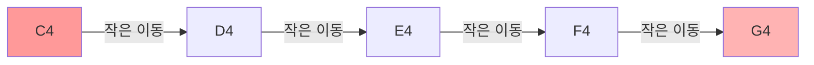

**특징**:
- 음이 조금씩 이동하여 같은 성구 내에서 머무름
- 특정 성구의 안정감과 일관성 강화
- 미세한 음정 조절 능력 향상

**적합한 경우**:
- 특정 음역에서 목소리가 흔들리는 사람
- 한 성구(예: 흉성)를 더 강화하고 싶은 사람
- 정확한 음정 훈련이 필요한 사람

**훈련 효과**: 특정 성구의 "근력 강화"

### 음 간격 전략 비교표

| 특성 | 넓은 간격 (5도 이상) | 좁은 간격 (2도 이내) |
|------|-------------------|-------------------|
| 성구 전환 | 빈번함 | 거의 없음 |
| 훈련 목표 | 성구 이동 유연성 | 성구 내 안정성 |
| 난이도 | 높음 (조절 어려움) | 낮음 (통제 용이) |
| 초보자 적합성 | 보통 | 매우 적합 |
| 고급자 적합성 | 매우 적합 | 보통 |
| 주요 활용 | 믹스보이스 개발 | 특정 성구 강화 |

> [!tip] 진행 단계별 음 간격 전략
> 1. **초급**: 좁은 간격으로 각 성구를 탄탄히 (도레미레도)
> 2. **중급**: 중간 간격으로 성구 경계 탐색 (도미솔미도)
> 3. **고급**: 넓은 간격으로 자유로운 성구 이동 (도솔도솔도)

---

## 호흡 강도와 성구의 관계

### 세(breath, airflow)의 역할

**세(세기)**: 성대를 통과하는 공기의 양과 압력

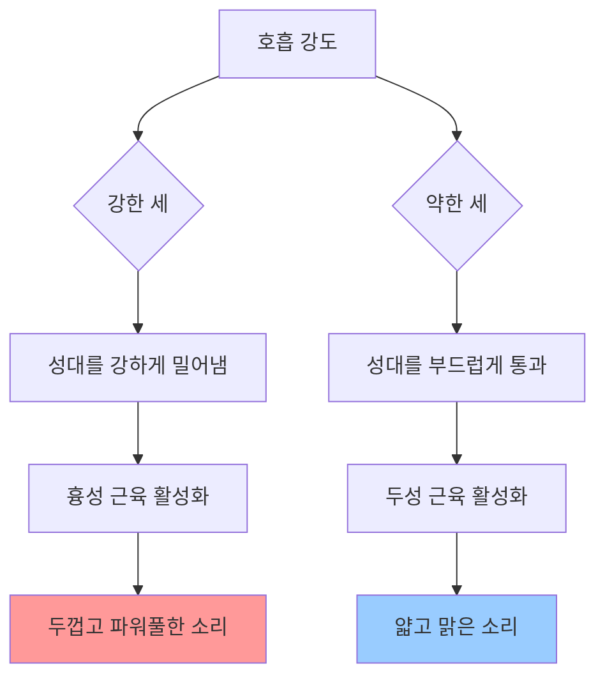

### 강한 호흡 (Strong Airflow)

**특징**:
- 복부에서 강한 지지
- 성대에 더 많은 압력
- 성대가 두껍게 진동

**결과**:
- 흉성 비율 증가
- 소리에 파워와 무게감
- 벨팅(belting)이나 강한 고음에 유리

**적합한 스케일**:
- 상행 스케일과 결합 → 강력한 고음 개발
- 좁은 간격과 결합 → 흉성 근력 강화

**주의사항**:
> [!warning] 강한 호흡의 함정
> "강한 호흡 = 세게 밀어내기"가 아니다. **지지(support)**는 복부와 횡격막의 통제된 힘이지, 목으로 힘을 주는 것이 아니다. 강한 호흡을 잘못 이해하면 목에 긴장이 쌓여 부상으로 이어질 수 있다.

### 약한 호흡 (Light Airflow)

**특징**:
- 부드러운 복부 지지
- 성대에 가벼운 압력
- 성대가 얇게 진동

**결과**:
- 두성 비율 증가
- 소리가 맑고 떠있는 느낌
- 부드러운 고음이나 팔세토에 유리

**적합한 스케일**:
- 하행 스케일과 결합 → 맑은 저음 개발
- 넓은 간격과 결합 → 두성 근육 발달

**특별한 가치**:
- 목의 긴장 해소
- 과도한 흉성 습관 교정
- 고음 접근의 두려움 감소

### 호흡 강도 조절 실전 가이드

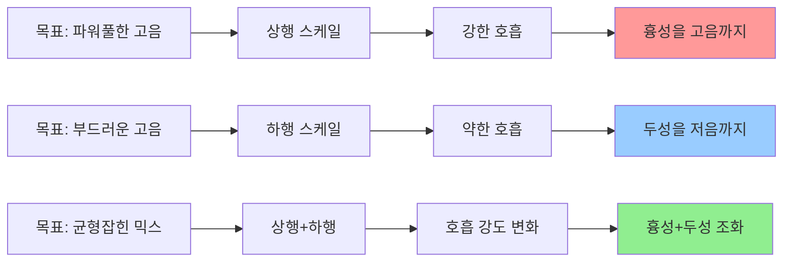

| 목표 | 스케일 방향 | 호흡 강도 | 기대 효과 |
|------|----------|---------|---------|
| 고음에 파워 | 상행 | 강 | 벨팅 능력 향상 |
| 고음의 편안함 | 하행 | 약 | 두성 고음 개발 |
| 저음 풍성함 | 하행 | 강 | 흉성 저음 강화 |
| 저음 맑음 | 상행 | 약 | 저음 공명 개선 |

---

## 스케일 너비의 전략적 활용

### 넓은 음역 스케일 (Wide Range)

**정의**: 한 옥타브 이상을 오가는 스케일

**예시**: C3 - C4 - C5 (2옥타브)

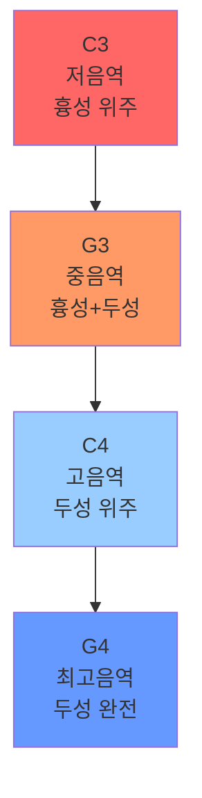

**훈련 목표**:
- 성구 전환 능력 개발
- 전체 음역의 일관성
- 성구 브릿지 통과 훈련

**적합한 경우**:
- 성구 전환 지점에서 소리가 끊기는 사람
- 음역별로 음색이 너무 다른 사람
- 넓은 음역을 사용하는 곡을 준비하는 사람

### 좁은 음역 스케일 (Narrow Range)

**정의**: 5도 이내를 오가는 스케일

**예시**: C4 - E4 - G4 - E4 - C4 (5도)

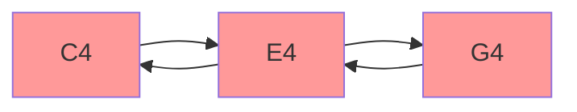

**훈련 목표**:
- 특정 음역 집중 강화
- 특정 테크닉 정밀 훈련
- 성구 내 안정성 확보

**적합한 경우**:
- 특정 음역(예: E4-G4)이 특히 약한 사람
- 특정 테크닉(예: 비브라토, 벤딩)을 연습하고 싶은 사람
- 초보자가 기본기를 다지는 단계

### 너비 전략 비교

| 특성 | 넓은 음역 | 좁은 음역 |
|------|---------|---------|
| 음역 범위 | 1옥타브 이상 | 5도 이내 |
| 성구 전환 | 여러 번 발생 | 거의 발생 안 함 |
| 훈련 강도 | 높음 (체력 소모) | 낮음 (정밀 훈련) |
| 집중도 | 분산 (전체) | 집중 (특정 부분) |
| 초보자 권장 | ★★☆☆☆ | ★★★★★ |
| 중급자 권장 | ★★★★☆ | ★★★☆☆ |
| 고급자 권장 | ★★★★★ | ★★★★☆ |

> [!tip] 훈련 주기 전략
> - **평일 (정밀 훈련)**: 좁은 음역 스케일로 약점 집중 공략
> - **주말 (통합 훈련)**: 넓은 음역 스케일로 전체 음역 연결
> - **공연 전**: 넓은 음역 스케일로 전체 음역 워밍업

---

## 실전 스케일 디자인 예시

### 사례 1: 고음이 약한 초보자

**문제 진단**:
- E4 이상에서 목소리가 갑자기 약해짐
- 고음 시도 시 목에 긴장
- 흉성만 사용하다가 고음에서 두성으로 뚝 끊어짐

**맞춤 스케일 디자인**:

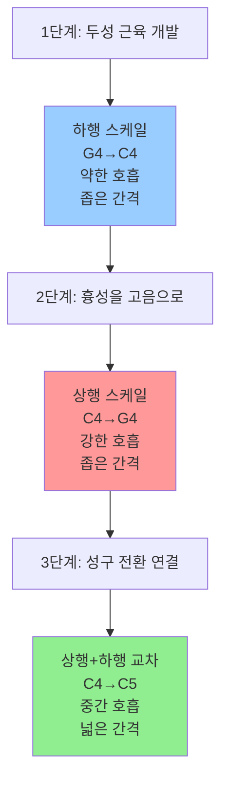

**훈련 순서**:
1. **1-2주**: 하행 스케일 (G4→E4→C4), 약한 호흡, 매일 10분
2. **3-4주**: 상행 스케일 (C4→E4→G4), 중간 호흡, 매일 10분
3. **5-6주**: 상행 스케일 (C4→A4), 강한 호흡, 매일 10분
4. **7-8주**: 넓은 음역 (C4→C5), 상행+하행, 매일 15분

### 사례 2: 고음은 나오지만 얇고 약한 성인 남성

**문제 진단**:
- 고음은 쉽게 나오지만 가성(falsetto)처럼 들림
- 파워가 없고 감정 표현 제한적
- 흉성이 약하고 저음이 불안정

**맞춤 스케일 디자인**:

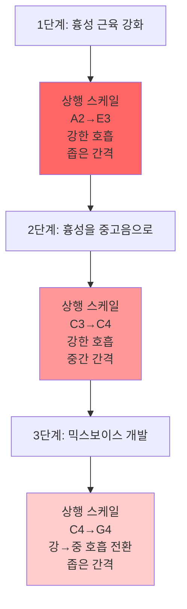

**훈련 순서**:
1. **1-3주**: 저음역 상행 스케일 (A2→E3), 강한 호흡으로 흉성 발달
2. **4-6주**: 중음역 상행 스케일 (C3→G3), 흉성을 위로 끌고 올라가기
3. **7-9주**: 고음역 상행 스케일 (E3→C4), 흉성 유지하며 고음 진입
4. **10-12주**: 넓은 음역 (C3→C5), 강한 흉성을 고음까지 연결

### 사례 3: 성구 전환이 불안정한 중급자

**문제 진단**:
- D4-F4 구간에서 소리가 뚝뚝 끊김
- 올라갈 때와 내려올 때 소리가 다름
- 브릿지(passaggio) 통과 어려움

**맞춤 스케일 디자인**:

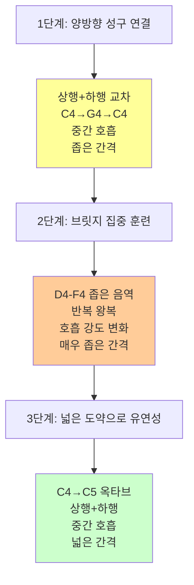

**특별 훈련**:
- **매일 10분**: D4-E4-F4-E4-D4 미세 조정 (브릿지 구간 집중)
- **격일 15분**: C4→C5 옥타브 왕복 (전체 연결)
- **주 2회**: 실제 노래에 적용 (learned skill을 real context로)

### 사례 4: 균형잡힌 믹스보이스 개발 (이상적 케이스)

**목표**: 처음부터 올바른 습관 형성

**통합 스케일 프로그램**:

| 주차 | 월-수-금 | 화-목 | 토요일 |
|------|---------|-------|--------|
| 1-2주 | 하행 좁은 간격 (두성 개발) | 상행 좁은 간격 (흉성 개발) | 휴식 |
| 3-4주 | 하행 중간 간격 | 상행 중간 간격 | 넓은 음역 통합 |
| 5-6주 | 하행 넓은 간격 | 상행 넓은 간격 | 실전 곡 적용 |
| 7-8주 | 상행+하행 교차 | 호흡 강도 변화 연습 | 녹음 및 분석 |

> [!tip] 스케일 디자인의 골든 룰
> 1. **약점 진단 먼저**: 자신이 무엇이 부족한지 정확히 파악
> 2. **한 번에 하나**: 여러 목표를 동시에 훈련하지 말고 우선순위 설정
> 3. **점진적 확장**: 좁은 음역 → 넓은 음역, 약한 호흡 → 강한 호흡
> 4. **상행하행 균형**: 한쪽만 하지 말고 반드시 양방향 훈련
> 5. **실전 적용**: 스케일 연습만 하지 말고 실제 노래에 적용하며 검증

---

## 용어 사전

### 상행 스케일 (Ascending Scale)
저음에서 고음으로 올라가는 음계. 저음에서 자연스럽게 나오는 흉성의 특성을 고음까지 끌고 올라가는 훈련에 사용.

### 하행 스케일 (Descending Scale)
고음에서 저음으로 내려오는 음계. 고음에서 자연스럽게 나오는 두성의 특성을 저음까지 끌고 내려오는 훈련에 사용.

### 흉성 (Chest Voice)
성대가 두껍게 진동하여 가슴에서 울림이 느껴지는 발성. 주로 저음과 중음에서 자연스럽게 사용. 파워풀하고 무게감 있는 소리.

### 두성 (Head Voice)
성대가 얇게 진동하여 머리에서 울림이 느껴지는 발성. 주로 고음에서 자연스럽게 사용. 맑고 떠있는 느낌의 소리.

### 믹스보이스 (Mixed Voice)
흉성과 두성이 혼합된 발성. 고음에서도 파워를 유지하면서 부드러움을 잃지 않는 이상적인 발성. 현대 대중음악의 핵심 기술.

### 세 (Breath, Airflow)
성대를 통과하는 공기의 양과 압력. 세가 강하면 흉성이, 약하면 두성이 활성화됨.

### 음 간격 (Interval)
스케일에서 음과 음 사이의 거리. 좁은 간격(반음, 온음)은 성구 고정, 넓은 간격(5도 이상)은 성구 전환 훈련에 유리.

### 스케일 너비 (Scale Range)
한 스케일이 커버하는 음역의 범위. 좁은 너비(5도 이내)는 집중 훈련, 넓은 너비(1옥타브 이상)는 통합 훈련에 적합.

### 성구 브릿지 / 파사지오 (Bridge / Passaggio)
흉성에서 두성으로(또는 그 반대로) 전환되는 음역대. 대부분의 사람들이 어려움을 겪는 구간. 남성은 보통 E4-F4, 여성은 E5-F5 부근.

### 벨팅 (Belting)
흉성을 고음까지 끌고 올라가는 강력한 발성 기술. 뮤지컬이나 팝 음악에서 드라마틱한 표현에 자주 사용.

### 팔세토 (Falsetto)
가성. 성대가 완전히 닫히지 않고 얇게 진동하여 만들어지는 고음. 두성과 비슷하지만 더 가볍고 공기가 많이 섞인 소리.

---

## 종합 정리

### 스케일 디자인 의사결정 트리

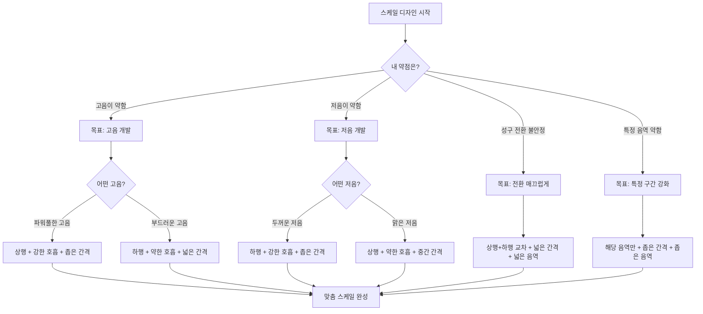

### 4가지 변수 요약 치트시트

| 변수 | 옵션 A | 효과 A | 옵션 B | 효과 B |
|------|--------|--------|--------|--------|
| **방향** | 상행 | 흉성→고음 | 하행 | 두성→저음 |
| **음 간격** | 넓음 (5도+) | 성구 전환 | 좁음 (2도-) | 성구 고정 |
| **호흡 강도** | 강함 | 흉성 강화 | 약함 | 두성 강화 |
| **스케일 너비** | 넓음 (1옥타브+) | 통합 훈련 | 좁음 (5도-) | 집중 훈련 |

### 핵심 원칙 5가지

1. **상행과 하행은 짝ꍍ**: 상행만 하면 불균형, 반드시 둘 다 해야 함
2. **약점에 맞춰 설계**: 만능 스케일은 없음, 자신의 약점 진단이 먼저
3. **점진적 확장**: 쉬운 것부터 어려운 것으로, 좁은 음역에서 넓은 음역으로
4. **감각에 집중**: 기계적 반복이 아닌 의식적 감각 인지
5. **실전 적용**: 스케일은 도구일 뿐, 최종 목표는 노래에 적용

### 흔한 실수와 해결책

| 실수 | 문제점 | 해결책 |
|------|--------|--------|
| 상행만 편향 | 고음 발달하지만 불균형 | 하행 스케일 동등하게 |
| 높이만 추구 | 음역은 넓어지지만 음질 나쁨 | 음질 유지하며 점진적 확장 |
| 기계적 반복 | 시간만 쓰고 발전 없음 | 매 반복마다 감각 확인 |
| 너무 많은 목표 | 집중력 분산, 효과 낮음 | 한 번에 하나씩 |
| 실전 적용 안 함 | 스케일은 되지만 노래는 안 됨 | 매일 실제 곡에 적용 |

---

## 셀프테스트

### 이론 이해도 체크

1. **Q**: 상행 스케일의 목적은 무엇인가?
   **A**: 저음에서 자연스럽게 나오는 흉성의 특성을 고음까지 끌고 올라가 고음에 힘과 파워를 추가하는 것.

2. **Q**: 왜 상행 스케일을 하면 반드시 하행 스케일도 해야 하는가?
   **A**: 상행만 하면 고음은 발달하지만 불균형한 발성이 됨. 하행 스케일을 통해 두성을 저음에 섞어야 전체 음역이 균형잡힘.

3. **Q**: 넓은 음 간격 스케일과 좁은 음 간격 스케일의 차이는?
   **A**: 넓은 간격(5도 이상)은 성구 전환 훈련, 좁은 간격(2도 이내)은 특정 성구 내에서의 안정성 훈련에 유리.

4. **Q**: 강한 호흡과 약한 호흡은 각각 어떤 성구를 강화하는가?
   **A**: 강한 호흡은 흉성을, 약한 호흡은 두성을 강화함.

5. **Q**: 좁은 음역 스케일과 넓은 음역 스케일은 각각 언제 사용하는가?
   **A**: 좁은 음역(5도 이내)은 특정 구간 집중 훈련이나 초보자 기본기 다질 때, 넓은 음역(1옥타브 이상)은 성구 전환 능력 개발이나 전체 음역 통합 훈련 시.

### 실전 응용 문제

**시나리오 1**: 당신은 E4-G4 구간에서 소리가 갑자기 약해지고 불안정합니다. 어떤 스케일을 디자인하겠습니까?

**모범 답안**:
- **1단계**: D4-G4 좁은 음역, 좁은 간격 (반음씩), 상행+하행 교차, 중간 호흡
- **목적**: 브릿지 구간 집중 안정화
- **2단계**: C4-A4 중간 음역, 중간 간격 (3도), 상행+하행 교차, 호흡 강도 변화
- **목적**: 브릿지 통과 유연성 개발

**시나리오 2**: 당신은 고음은 쉽게 나오지만 가성처럼 얇고 힘이 없습니다. 어떻게 훈련하겠습니까?

**모범 답안**:
- **우선순위**: 흉성 근육 강화
- **스케일 디자인**: 상행 스케일, 좁은 간격, 강한 호흡, 좁은 음역 (C3-G3)
- **단계적 확장**: 2주마다 음역을 반음씩 올려 점차 고음에 흉성 혼합
- **균형 유지**: 주 2회는 하행 스케일로 두성도 유지

### 자가 진단 체크리스트

- [ ] 나는 내 발성의 약점을 구체적으로 설명할 수 있다
- [ ] 나는 상행과 하행 스케일을 균등하게 연습한다
- [ ] 나는 스케일의 목적을 이해하고 감각에 집중한다
- [ ] 나는 음 간격의 차이가 훈련 효과에 미치는 영향을 안다
- [ ] 나는 호흡 강도를 의도적으로 조절할 수 있다
- [ ] 나는 스케일 연습을 실제 노래에 적용하고 있다
- [ ] 나는 한 번에 하나의 목표에 집중한다
- [ ] 나는 내 진행 상황을 녹음하여 객관적으로 평가한다

---

## 내 생각 & 연결

### 스케일 디자인과 개인 맞춤화

이 영상의 가장 큰 통찰은 **"스케일은 만능이 아니라 맞춤형 도구"**라는 것이다.

마치 헬스장에서:
- 상체가 약한 사람은 상체 운동 비중을 높이고
- 유연성이 부족한 사람은 스트레칭을 더 하고
- 심폐지구력이 약한 사람은 유산소를 더 하듯이

발성 훈련도:
- 고음이 약하면 상행 스케일 비중을 높이고
- 저음이 약하면 하행 스케일을 강화하고
- 성구 전환이 불안정하면 넓은 간격 스케일에 집중해야 한다

### 다른 학습 영역과의 연결

**언어 학습**:
- 발음 교정도 "상행/하행"과 비슷한 개념
- 모국어 발음(저음역)에서 목표 언어 발음(고음역)으로 점진적 전환
- "음 간격"은 언어 간 거리(한국어→일본어는 가깝고, 한국어→아랍어는 멈)

**프로그래밍 학습**:
- 좁은 스케일 = 특정 알고리즘 집중 훈련
- 넓은 스케일 = 전체 프로젝트 통합
- 상행/하행 = 하향식(top-down) vs 상향식(bottom-up) 접근

**운동 훈련**:
- 호흡 강도 = 운동 강도 (고강도 vs 저강도)
- 스케일 너비 = 운동 범위 (전신 운동 vs 단일 근육 집중)

### 나의 학습 계획

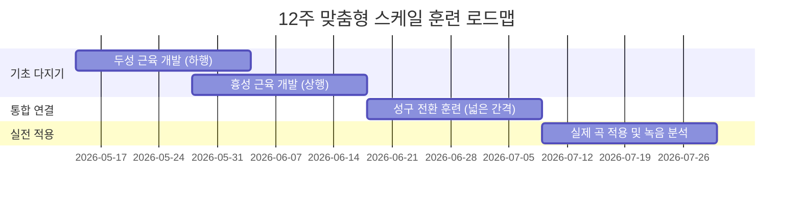

**구체적 주간 계획**:
- **월/수/금**: 목표 스케일 집중 (20분)
- **화/목**: 보완 스케일 (15분)
- **토**: 넓은 음역 통합 스케일 (30분) + 실제 곡 적용
- **일**: 휴식 또는 가벼운 스트레칭 발성

---

## 보충자료

### 추천 학습 경로

1. **이 영상의 선수 학습**: "스케일을 해야 하는 이유, 그리고 발성 기관이 발전하는 원리"
2. **다음 단계**: 실제 스케일 예시 (도미솔미도, 아르페지오 등)
3. **심화 학습**: 성구 브릿지 통과 테크닉
4. **실전 적용**: 장르별 스케일 활용법

### 관련 과학 개념

**근육 생리학**:
- **과부하 원리 (Overload Principle)**: 현재 능력보다 약간 높은 목표로 점진적 확장
- **특이성 원리 (Specificity)**: 훈련한 것만 발달함 (상행만 하면 상행만 느는 이유)
- **가역성 원리 (Reversibility)**: 훈련 안 하면 퇴화 (꾸준함의 중요성)

**운동 학습 이론**:
- **단계적 학습 (Progressive Learning)**: 쉬운 것 → 어려운 것
- **변화 훈련 (Variable Practice)**: 다양한 스케일로 적응력 향상
- **전이 효과 (Transfer Effect)**: 스케일 훈련이 실제 노래에 전이

### 실전 도구

**녹음 및 분석**:
- Audacity (무료): 음성 녹음 및 스펙트로그램 분석
- Vocal Pitch Monitor (무료): 실시간 음정 및 음색 시각화
- Amazing Slow Downer: 속도 조절하며 원곡 따라 연습

**스케일 연습 앱**:
- Vocal Warm Up by Musicopoulos: 다양한 스케일 제공
- Vanido: AI 기반 발성 분석 및 피드백
- Simply Sing: 게임처럼 즐기며 연습

**유용한 악기**:
- 키보드/피아노: 정확한 음정 제공
- 튜너: 자신의 음정 확인
- 메트로놈: 일정한 템포 유지

### 발성 건강 주의사항

> [!warning] 중요: 목 보호
> - **과훈련 금지**: 하루 1시간 이상 스케일 연습 위험
> - **통증 즉시 중단**: 목에 통증이나 쉰 목소리 나타나면 즉시 휴식
> - **충분한 수분**: 성대 건강을 위해 하루 2L 이상 물 섭취
> - **휴식의 중요성**: 주 1-2일은 완전 휴식
> - **점진적 확장**: 급하게 음역 넓히려다 부상 위험

### 참고 자료

**서적**:
- Cornelius L. Reid, "The Free Voice: A Guide to Natural Singing"
- Richard Miller, "The Structure of Singing"
- Janice Chapman, "Singing and Teaching Singing"

**온라인 자료**:
- New York Vocal Coaching YouTube: 체계적인 발성 이론
- Bohemian Vocal Studio: 과학 기반 발성 접근
- 의학발성 메디컬보이스: 한국어 의학 기반 발성 (이 채널!)

**커뮤니티**:
- Reddit r/singing: 국제 발성 커뮤니티
- 네이버 카페 "발성의 모든 것": 한국어 발성 커뮤니티

### 진행 추적 템플릿

```markdown
## 발성 훈련 일지 - [날짜]

### 오늘의 목표
- [ ] 하행 스케일 G4→C4, 20회
- [ ] 상행 스케일 C4→G4, 20회

### 감각 기록
- 하행 시 느낌:
- 상행 시 느낌:
- 새롭게 발견한 감각:

### 어려웠던 점
- 음역:
- 이유:
- 해결 시도:

### 내일 계획
-
```

---

> [!tip] 최종 메시지
> 스케일 디자인은 예술이자 과학이다. 이 영상의 4가지 변수(방향, 음 간격, 호흡 강도, 스케일 너비)를 이해하면, 당신은 **자신만의 발성 코치**가 될 수 있다.
>
> 중요한 것은:
> 1. 자신의 약점을 정확히 진단하고
> 2. 그에 맞는 스케일을 설계하고
> 3. 의식적으로 감각에 집중하며
> 4. 상행과 하행의 균형을 유지하고
> 5. 끈기있게 반복하는 것이다
>
> 만능 스케일은 없다. 당신에게 맞는 스케일이 최고의 스케일이다.
