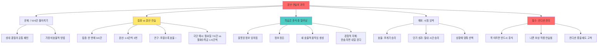

# 분산 연습의 과학: 쪼갤수록 효율이 오른다

## 📌 핵심 한 줄

같은 시간을 연습할 때 한 번에 몰아서 하는 것보다 중간중간 휴식을 넣어 나누는 것이 훨씬 효과적이다

## 🎯 목차

1. [[#문제 상황|문제 상황: 7-8시간 몰아치기 연습의 비효율]] 🟢
2. [[#집중 vs 분산|집중 연습 vs 분산 연습: 연구가 말하는 정답]] 🟡
3. [[#학습의 진실|학습의 진실: 연습할 때가 아닌 휴식할 때 일어난다]] 🔴
4. [[#예외 상황|예외 상황: 시험/오디션이 임박했을 때]] 🟡
5. [[#컨디션 관리|필수 원칙: 목 아플 때는 절대 연습하지 말 것]] 🟢

---

## 📖 개요

많은 성악 학생들이 성대 결절을 가지고 있으며, 그들의 공통점은 "아침에 연습실에 들어가서 7-8시간 동안 노래하다 나온다"는 훈련 방법이다. 이는 **가장 비효율적인 연습 방법**이다.

운동 학습에는 **집중 연습(massed practice)**과 **분산 연습(distributed practice)** 두 가지가 있다. 연구에 따르면 같은 시간을 연습할 때 한 번에 하는 것보다 중간중간 공백기를 만드는 것이 더 효과적이다. 극단적 예시로, 7시간을 월요일에 몰아서 하는 것보다 월화수목금 1시간씩 나누는 것이 훨씬 효과적이다.

그 이유는 **실제 학습은 연습할 때가 아닌 휴식할 때 이루어지기** 때문이다. 휴식 중에 잘못된 정보가 잊혀지고, 정보가 정돈되며, 새로운 효율적인 움직임이 만들어진다. 성악 연습자들 사이에는 "연습할 때 되는 게 아니라 한숨 자면 내일 된다"는 말이 있다.

단, 예외가 있다. 시험이나 오디션이 얼마 안 남았을 경우, **제한된 시간 내 최고 성과**를 위해서는 절대적 연습 시간이 많은 것이 유리하다. 효율은 떨어지지만 단기간 성과는 높다.

마지막 필수 원칙: **목이 아플 때 연습하면 나쁜 보상 작용을 연습하게 되어** 컨디션 좋을 때도 그것이 들어올 수 있다.

---

## 🎬 영상 정보

<iframe width="560" height="315" src="https://www.youtube.com/embed/aWQDzOA4SGw" frameborder="0" allow="accelerometer; autoplay; clipboard-write; encrypted-media; gyroscope; picture-in-picture" allowfullscreen></iframe>

**채널**: 의학발성 메디칼보이스 (Medicalvoice)
**제목**: 연습시간은 어떻게 하는게 좋나요?
**시청일**: 2026-04-20
**영상 길이**: 약 4분

---

## 📚 본문

### 문제 상황: 7-8시간 몰아치기 연습의 비효율

**🟢 기초 | 00:00:00 - 00:00:32**

<iframe src="https://www.youtube.com/embed/aWQDzOA4SGw?start=0&end=32" width="560" height="315" frameborder="0" allowfullscreen></iframe>

진료를 하다 보니 생각보다 많은 학생들이 **성대 결절**을 가지고 있었다. 그들에게 "어떻게 연습하냐"고 물으면 공통된 패턴이 있었다:

> "아침에 연습실에 들어가서 한 7시간, 8시간 동안 노래하다 나와요"

결론부터 말하면, **이러한 훈련 방법은 가장 비효율적인 연습 방법**이다. 장시간 몰아치기 연습이 성대 결절의 원인이 되고, 동시에 학습 효율도 최악이다.

---

### 집중 연습 vs 분산 연습: 연구가 말하는 정답

**🟡 중급 | 00:00:35 - 00:01:18**

<iframe src="https://www.youtube.com/embed/aWQDzOA4SGw?start=35&end=78" width="560" height="315" frameborder="0" allowfullscreen></iframe>

#### 두 가지 연습 방법의 정의

운동 학습에는 두 가지 개념이 있다:

**1. 집중 연습 (Massed Practice)**
- 똑같이 3시간을 연습할 때 **한 번에** 연습하는 것
- 예: 3시간 연속 연습

**2. 분산 연습 (Distributed Practice)**
- 3시간을 연습할 때 **중간중간 휴식**을 두는 것
- 예: 1시간 + 휴식 + 1시간 + 휴식 + 1시간

#### 연구 결과: 분산이 압도적 승리

> "똑같은 시간을 연습할 때 이렇게 한 번의 연습을 하는 것보다 **중간중간 공백기를 만드는 것이 더 효과적**이다"

그래프를 보면 명확하다:
- 똑같은 시간을 연습한다면
- 그 시간을 **최대한 쪼갤수록**
- 연습의 효율이 좋다

#### 극단적 예시로 이해하기

**7시간 연습**을 한다고 가정:

**A안**: 월요일에만 7시간
**B안**: 월화수목금 각 1시간씩 (총 5시간이지만 5일 분산)

→ **당연히 월화수목금 1시간씩 연습하는 게 훨씬 더 효과가 좋다**

실제로 7시간을 다 채우려면:
- 월화수목금토일 1시간씩 = 7시간 분산
- vs 월요일만 7시간

분산이 압도적으로 우수하다.

---

### 학습의 진실: 연습할 때가 아닌 휴식할 때 일어난다

**🔴 심화 | 00:01:36 - 00:02:10**

<iframe src="https://www.youtube.com/embed/aWQDzOA4SGw?start=96&end=130" width="560" height="315" frameborder="0" allowfullscreen></iframe>

#### 반직관적 진실

> "실제로 **학습은 연습할 때 이루어지는 게 아니라 휴식할 때 이루어진다**"

왜 그런지는 **아직 가설 단계**이지만, 현재 가장 유력한 설명:

**휴식 중 일어나는 일들:**
1. **잘못된 정보가 잊혀진다**
2. **연습하면서 얻어진 정보가 정돈된다**
3. **새로운 효율적인 움직임을 만들어낸다**

이러한 **통합(consolidation) 과정**들이 휴식할 때 일어나는 것으로 추정된다.

#### 성악 연습자들의 경험적 지혜

> "무언가를 연습하면 **연습할 때 되는 게 아니라 한숨 자면 내일 된다**"

노래 연습을 하는 분들 사이에 오래전부터 전해져 온 말이다. 과학적 연구가 이 경험적 지혜를 뒷받침한다.

#### 실천 지침

> "연습하실 때 **너무 많은 시간을 한 번에 하기보다는** 최대한 **중간중간 휴식을 넣어서** 하시는 걸 추천"

---

### 예외 상황: 시험/오디션이 임박했을 때

**🟡 중급 | 00:02:21 - 00:03:18**

<iframe src="https://www.youtube.com/embed/aWQDzOA4SGw?start=141&end=198" width="560" height="315" frameborder="0" allowfullscreen></iframe>

#### 단, 예외가 있다

시험이나 오디션이 **얼마 안 남았을 경우**에는 다르다.

#### 그래프를 다시 보면

**효율만 따지면:**
- 연습 시간을 적게
- 최대한 나누어서 하는 게 가장 효율적

**BUT, 제한된 시간 내에서 가장 연습이 많이 된 것은:**
- **절대적인 연습 시간이 많았던 경우**

#### 두 가지 목표의 차이

| 상황 | 목표 | 최적 전략 |
|------|------|----------|
| **장기 실력 향상** | 효율적으로 실력 끌어올리기 | 짧은 연습 + 충분한 휴식 + 여러 번 반복 |
| **단기 성과 극대화** | 제한 시간 내 최고 성과 | 절대적 연습 시간 최대화 (효율 희생) |

#### 현명한 선택

**상황 1: 시험/오디션이 임박 (예: 1주일 후)**
- 한 번에 오래 연습
- 효율은 떨어지지만 단기간 최고 성과

**상황 2: 장기적 실력 향상 (충분한 시간)**
- 짧은 연습을 충분한 휴식 시간을 두고 여러 번 반복
- 가장 효과적인 연습

---

### 필수 원칙: 목 아플 때는 절대 연습하지 말 것

**🟢 기초 | 00:03:18 - 00:03:50**

<iframe src="https://www.youtube.com/embed/aWQDzOA4SGw?start=198&end=230" width="560" height="315" frameborder="0" allowfullscreen></iframe>

#### 절대 규칙

> "**목이 아프면 연습을 반드시 쉬셔야 됩니다**"

이것은 협상 불가능한 원칙이다.

#### 목 아플 때 연습하면 생기는 일

**1. 나쁜 보상 작용이 들어올 가능성이 높다**
- 통증을 피하기 위해 **잘못된 움직임 패턴**을 사용
- 이것이 **보상 작용(compensation)**

**2. 그때 연습을 반복하게 되면**
- 좋은 것을 연습하는 게 아니라
- **나쁜 보상 작용을 연습**하게 된다

**3. 잘못하면 컨디션이 좋을 때도 그게 들어온다**
- 나쁜 패턴이 **근육 기억(muscle memory)**으로 고착
- 목이 멀쩡할 때도 보상 작용이 자동으로 발동

#### 현명한 접근

> "현명하게 **컨디션을 잘 봐가면서** 연습을 충분히 **쪼개서** 하시는 것을 추천"

컨디션 관리 + 분산 연습 = 최적의 조합

---

## 🗺️ 개념 지도

---

## ⭐ 핵심 암기 포인트

### ★★★ 필수 암기

1. **분산 연습 > 집중 연습**
   - 같은 시간이면 쪼갤수록 효율 ↑
   - 7시간: 월요일만 < 월화수목금토일 1시간씩
   - 암기법: "쪼개면 쪼갤수록 좋다"

2. **학습은 휴식 중 일어난다**
   - 연습 중 ✗, 휴식 중 ✓
   - 잘못된 정보 망각 + 정보 정돈 + 새 움직임 생성
   - 암기법: "한숨 자면 내일 된다"

3. **목 아플 때 절대 연습 금지**
   - 나쁜 보상 작용이 연습됨
   - 컨디션 좋을 때도 고착
   - 암기법: "아플 땐 쉬어야 = 좋은 것 연습"

### ★★ 중요 암기

4. **예외: 시험 임박 시**
   - 효율 < 절대 시간
   - 단기 성과 극대화 필요 시 몰아치기도 유효
   - 상황 맞춰 현명한 선택

---

## 📖 용어 사전

### Massed Practice (집중 연습)
**정의**: 같은 시간을 한 번에 몰아서 연습하는 방법

**영상 맥락**: 3시간을 한 번에 연습. 효율이 떨어지지만 제한된 시간 내 절대적 연습량은 많음. 시험/오디션 임박 시 예외적으로 유용.

### Distributed Practice (분산 연습)
**정의**: 같은 시간을 중간중간 휴식을 두고 나누어 연습하는 방법

**영상 맥락**: 3시간을 1시간씩 3번. 쪼갤수록 효율이 높아짐. 장기 실력 향상에 최적. "한숨 자면 내일 된다"는 경험적 지혜와 일치.

### Consolidation (통합/정착)
**정의**: 새로 학습한 정보나 기술이 장기 기억으로 전환되고 안정화되는 과정

**영상 맥락**: 휴식 중 일어나는 과정. 잘못된 정보 망각, 정보 정돈, 새 효율적 움직임 생성. 이것이 분산 연습이 효과적인 신경과학적 이유 (아직 가설 단계).

### Compensation (보상 작용)
**정의**: 신체의 한 부분이 아프거나 기능하지 않을 때 다른 부분이 대신 역할을 하는 현상

**영상 맥락**: 목 아플 때 연습하면 통증 회피를 위해 잘못된 움직임 패턴 사용. 이것이 반복되면 나쁜 보상 작용이 근육 기억으로 고착되어 컨디션 좋을 때도 발동.

---

## 🔗 종합 정리

이 영상은 **하나의 명확한 메시지**를 전달한다: **쪼개라**.

### 논증 구조

**1. 문제 제기**: 많은 학생들이 7-8시간 몰아치기 → 성대 결절 + 비효율

**2. 과학적 근거**: 집중 연습 < 분산 연습 (연구 결과)

**3. 메커니즘 설명**: 학습은 연습 중이 아닌 휴식 중 일어남 (가설)

**4. 예외 제시**: 시험 임박 시 절대 시간이 중요 (상황에 맞춘 선택)

**5. 필수 원칙**: 목 아플 때 연습 금지 (나쁜 보상 작용 방지)

### 핵심 통찰

**"한숨 자면 내일 된다"**라는 성악 연습자들의 경험적 지혜가 운동 학습 연구와 일치한다는 점이 흥미롭다. 과학이 민간 지혜를 입증한 사례.

### 실천 가이드

| 목표 | 전략 | 예시 |
|------|------|------|
| 장기 실력 향상 | 분산 연습 | 하루 1시간씩 매일 |
| 시험 1주일 전 | 집중 연습 | 하루 3-4시간 몰아서 |
| 목 아픔 | 즉시 휴식 | 연습 중단 |
| 컨디션 관리 | 쪼개기 + 모니터링 | 1시간 연습 + 30분 휴식 |

---

## 🧪 셀프 테스트

### 🟢 기초

**Q1**: 7시간을 연습한다면, 월요일에만 7시간 vs 월화수목금토일 1시간씩 중 어느 것이 효율적인가? 그 이유는?

답안 보기

**답**: 월화수목금토일 1시간씩이 훨씬 효율적.

**이유**:
- 분산 연습이 집중 연습보다 우수
- 같은 시간을 쪼갤수록 효율 증가
- 학습은 연습 중이 아닌 휴식 중 일어남
- 매일 휴식(수면) 사이에 정보 통합 과정 발생

**Q2**: 왜 학습은 연습할 때가 아닌 휴식할 때 일어난다고 하는가?

답안 보기

휴식 중 일어나는 일들 (가설 단계):
1. 잘못된 정보가 잊혀짐
2. 연습하면서 얻어진 정보가 정돈됨
3. 새로운 효율적인 움직임을 만들어냄

이러한 통합(consolidation) 과정들이 휴식할 때 일어나는 것으로 추정됨.

### 🟡 중급

**Q3**: 시험이 1주일 후인데 아직 준비가 안 되어 있다. 분산 연습과 집중 연습 중 무엇을 선택해야 하며, 그 이유는?

답안 보기

**답**: 집중 연습 (하루에 많은 시간 투입)

**이유**:
- 효율만 따지면 분산이 우수
- 하지만 제한된 시간 내 최고 성과는 절대적 연습 시간이 많은 경우
- 1주일은 충분히 쪼갤 시간이 부족
- 효율 희생하더라도 단기 성과 극대화 필요

**단서**: 목 아프면 즉시 중단. 나쁜 보상 작용 연습하면 역효과.

**Q4**: 목이 아픈데 중요한 오디션이 3일 후다. 어떻게 해야 하는가?

답안 보기

**답**: 반드시 휴식

**이유**:
1. 목 아플 때 연습 = 나쁜 보상 작용 연습
2. 이것이 반복되면 근육 기억으로 고착
3. 컨디션 좋을 때도 나쁜 패턴 자동 발동
4. 3일 연습으로 얻는 것 < 나쁜 습관 고착으로 잃는 것

**현명한 선택**:
- 지금 휴식 → 목 회복 → 남은 시간 집중 연습
- 무리하게 연습 → 더 악화 → 오디션 망침 + 장기 손상

### 🔴 심화

**Q5**: "한숨 자면 내일 된다"는 말의 신경과학적 의미를 consolidation 개념과 연결하여 설명하라.

답안 보기

**민간 지혜**: 오늘 안 되던 것이 자고 일어나면 된다

**신경과학적 설명** (consolidation):

1. **연습 중**:
   - 정보 입력 + 시행착오
   - 옳은 것 + 틀린 것 혼재
   - 뇌는 아직 정리 안 됨

2. **휴식 중 (특히 수면)**:
   - 잘못된 정보 망각 (불필요한 연결 약화)
   - 정보 정돈 (중요한 연결 강화)
   - 새 효율적 움직임 생성 (패턴 최적화)
   - 장기 기억으로 통합

3. **다음날**:
   - 정리된 정보로 시작
   - 효율적 움직임 패턴 사용
   - "어제 안 되던 게 오늘 된다"

**결론**: 민간 지혜가 최신 신경과학과 일치. 경험이 이론을 앞서간 사례.

---

## 📚 보충자료

### 분산 연습 효과 (Spacing Effect)
1. **Spaced Repetition 연구**
   - 이 노트와의 연관성: 분산 연습의 학습 과학적 근거. 같은 시간 투입 시 간격을 두는 것이 우수.

2. **Sleep and Memory Consolidation**
   - 이 노트와의 연관성: "한숨 자면 내일 된다"의 과학적 배경. 수면 중 기억 통합 과정.

### 운동 학습 이론
3. **Motor Skill Consolidation**
   - 이 노트와의 연관성: 휴식 중 일어나는 "정보 정돈, 새 움직임 생성" 과정의 신경과학적 메커니즘.

---

## 💭 내 생각 & 연결

### 첫 번째 영상과의 연결

이 노트는 첫 번째 영상 [[조사/유튜브/침묵이 학습을 만든다]]과 완벽하게 연결된다:

**첫 번째 영상**: 학습은 교사가 말할 때가 아닌 학생의 침묵 중 일어남 (3-4초 echoic storage)

**이 영상**: 학습은 연습할 때가 아닌 휴식 중 일어남 (consolidation)

→ **공통 원리**: **학습은 "안 할 때" 일어난다**

두 영상 모두 **"더 많이 = 더 좋다"는 직관에 반하는** 메시지를 전달한다.

### 실천적 함의

**학생에게**:
- 하루 7시간보다 매일 1시간이 낫다
- 목 아프면 무조건 쉬어라 (손해가 아닌 투자)
- 시험 임박 시에만 예외적으로 몰아치기

**교사에게**:
- 학생의 몰아치기 연습을 막아라
- "쉬는 것도 연습의 일부"라고 가르쳐라
- 컨디션 관리를 최우선으로

---

## 🗓️ 다음 복습 일정

- **1차 복습**: 2026-04-21 (1일 후)
- **2차 복습**: 2026-04-27 (7일 후)
- **3차 복습**: 2026-05-20 (30일 후)

---

## 📎 태그

#yt-note #knowledge #motor-learning #distributed-practice #spacing-effect #vocal-training #consolidation #rest-and-learning

---

*이 노트는 YT-to-Note 스킬 v8.0으로 생성되었습니다.*